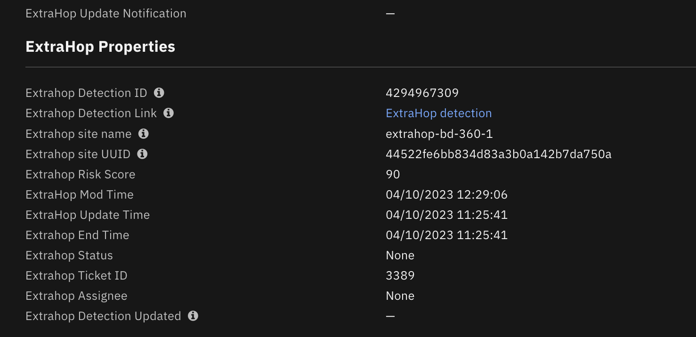
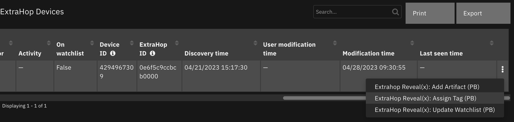
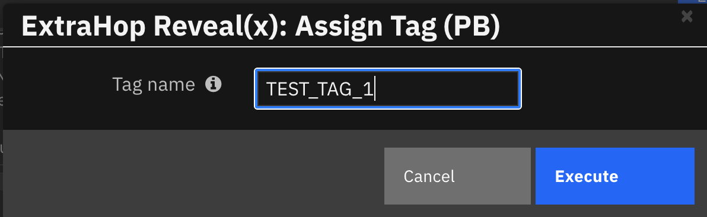
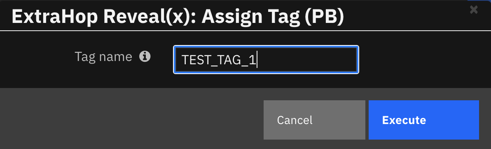
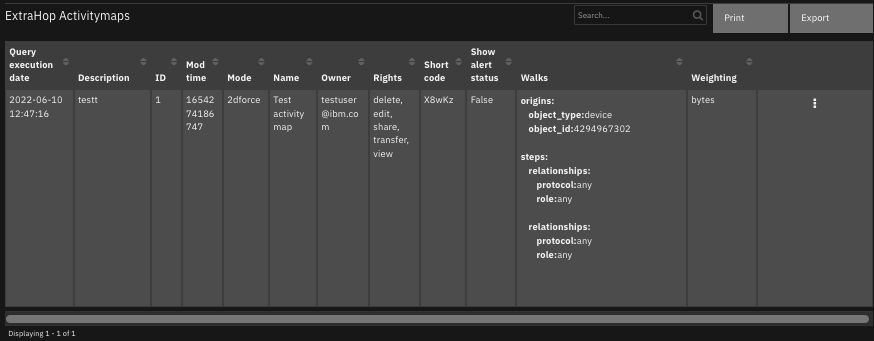
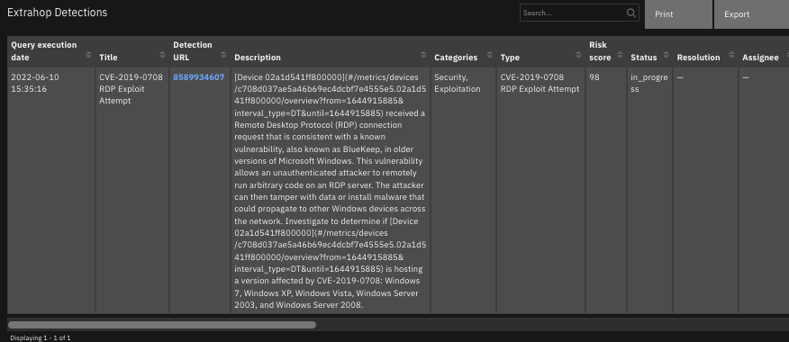
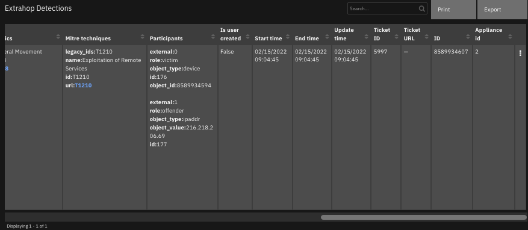
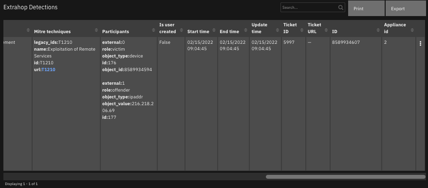
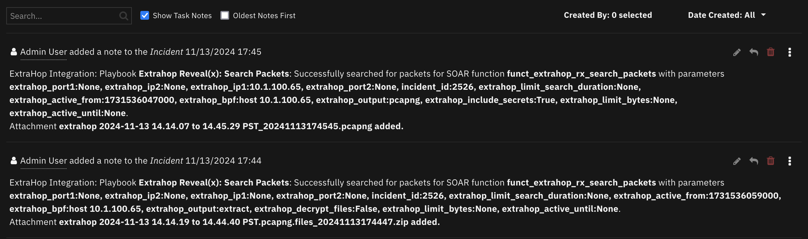
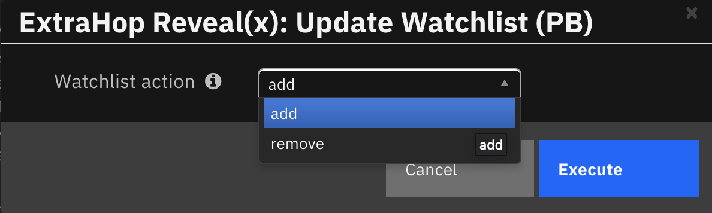

<!--
  This README.md is generated by running:
  "resilient-sdk docgen -p fn_extrahop"

  It is best edited using a Text Editor with a Markdown Previewer. VS Code
  is a good example. Checkout https://guides.github.com/features/mastering-markdown/
  for tips on writing with Markdown

  All fields followed by "::CHANGE_ME::"" should be manually edited

  If you make manual edits and run docgen again, a .bak file will be created

  Store any screenshots in the "doc/screenshots" directory and reference them like:
  

  NOTE: If your app is available in the container-format only, there is no need to mention the integration server in this readme.
-->

# ExtraHop for IBM SOAR

## Table of Contents
- [Release Notes](#release-notes)
- [Overview](#overview)
  - [Key Features](#key-features)
- [Requirements](#requirements)
  - [SOAR platform](#soar-platform)
  - [Cloud Pak for Security](#cloud-pak-for-security)
  - [Proxy Server](#proxy-server)
  - [Python Environment](#python-environment)
  - [Endpoint Developed With](#endpoint-developed-with)
- [Installation](#installation)
  - [Install](#install)
  - [App Configuration](#app-configuration)
  - [Custom Layouts](#custom-layouts)
- [Poller - ExtraHop Escalate Detections](#poller---extrahop-escalate-detections)
- [Function - Extrahop Reveal(x) add detection note](#function---extrahop-revealx-add-detection-note)
- [Function - Extrahop Reveal(x) assign tag](#function---extrahop-revealx-assign-tag)
- [Function - Extrahop Reveal(x) create tag](#function---extrahop-revealx-create-tag)
- [Function - Extrahop Reveal(x) get activitymaps](#function---extrahop-revealx-get-activitymaps)
- [Function - Extrahop Reveal(x) get detection note](#function---extrahop-revealx-get-detection-note)
- [Function - Extrahop Reveal(x) get detections](#function---extrahop-revealx-get-detections)
- [Function - Extrahop Reveal(x) get devices](#function---extrahop-revealx-get-devices)
- [Function - Extrahop Reveal(x) get tags](#function---extrahop-revealx-get-tags)
- [Function - Extrahop Reveal(x) get watchlist](#function---extrahop-revealx-get-watchlist)
- [Function - Extrahop Reveal(x) search detections](#function---extrahop-revealx-search-detections)
- [Function - Extrahop Reveal(x) search devices](#function---extrahop-revealx-search-devices)
- [Function - Extrahop Reveal(x) search packets](#function---extrahop-revealx-search-packets)
- [Function - Extrahop Reveal(x) update detection](#function---extrahop-revealx-update-detection)
- [Function - Extrahop Reveal(x) update watchlist](#function---extrahop-revealx-update-watchlist)
- [Script - ExtraHop script: add artifact from device](#script---extrahop-script-add-artifact-from-device)
- [Script - ExtraHop script: detection property helper](#script---extrahop-script-detection-property-helper)
- [Script - ExtraHop script: device property helper](#script---extrahop-script-device-property-helper)
- [Data Table - ExtraHop Activitymaps](#data-table---extrahop-activitymaps)
- [Data Table - Extrahop Detections](#data-table---extrahop-detections)
- [Data Table - ExtraHop Devices](#data-table---extrahop-devices)
- [Data Table - Extrahop Tags](#data-table---extrahop-tags)
- [Data Table - ExtraHop Watchlist](#data-table---extrahop-watchlist)
- [Custom Fields](#custom-fields)
- [Rules](#rules)
- [Troubleshooting & Support](#troubleshooting--support)
---

## Release Notes
<!--
  Specify all changes in this release. Do not remove the release 
  notes of a previous release
-->
| Version | Date | Notes |
| ------- | ---- | ----- |
| 1.1.0 | 04/2023 | Use mod_time instead of update_time in poller. Convert rules/workflows to playbooks |
| 1.0.0 | 06/2022 | Initial Release |

### 1.1 Changes
In v1.1, the existing rules and workflows have been replaced with playbooks.
This change is made to support the ongoing, newer capabilities of playbooks.
Each playbook has the same functionality as the previous, corresponding rule/workflow. 

If upgrading from a previous release, notice that the previous release's rules/workflows remain in place. Both sets of rules and playbooks are active. For manual actions, playbooks will have the same name as it's corresponding rule, but with "(PB)" added at the end.

You can continue to use the rules/workflows. 
But migrating to playbooks will provide greater functionality along with future app enhancements and bug fixes. 

**NOTE** Starting with version 1.1.0 of the ExtraHop app for SOAR:
* The poller uses ExtraHop detection `mod_time` field to determine which detections to pull in to SOAR.
* The poller includes an optional `polling_lookback` parameter in the app.config that can be used to look back the specified number of minutes when the poller starts or restarts to pull in "older" detections.  If not specified in the app.config, the poller uses a look back of zero minutes.
* The function `ExtraHop Reveal(x) search detections` takes an optional `mod_time` parameter used for searching detections in ExtraHop.

---

## Overview
<!--
  Provide a high-level description of the function itself and its remote software or application.
  The text below is parsed from the "description" and "long_description" attributes in the setup.py file
-->
**IBM Security SOAR app for ExtraHop**

 

ExtraHop is a cybersecurity cloud-native solution that provides AI-based network intelligence to help enterprises detect and respond to advanced threats.

The ExtraHop App for IBM SOAR escalates ExtraHop detections into IBM Security SOAR as an incident/case and facilitates manual enrichment and remediation actions against an ExtraHop RevealX 360 environment in the IBM SOAR Platform.

### Key Features
<!--
  List the Key Features of the Integration
-->
The ExtraHop App provides the following functionality:
* A poller which gathers current detections from ExtraHop and escalates to the SOAR platform as cases/incidents.
* Functions to get, search and update detections.
* Functions to get and add detection notes.
* Functions to get and search devices.
* Functions to get, create and assign tags.
* Functions get and set the watchlist.
* A function to get activitymaps.

---

## Requirements
<!--
  List any Requirements 
-->
This app supports the IBM Security QRadar SOAR Platform and the IBM Security QRadar SOAR for IBM Cloud Pak for Security.

### SOAR platform
The SOAR platform supports two app deployment mechanisms, App Host and integration server.

If deploying to a SOAR platform with an App Host, the requirements are:
* SOAR platform >= `45.0.0`.
* The app is in a container-based format (available from the AppExchange as a `zip` file).

If deploying to a SOAR platform with an integration server, the requirements are:
* SOAR platform >= `45.0.0`.
* The app is in the older integration format (available from the AppExchange as a `zip` file which contains a `tar.gz` file).
* Integration server is running `resilient-circuits>=42.0.0`.
* If using an API key account, make sure the account provides the following minimum permissions: 
  | Name | Permissions |
  | ---- | ----------- |
  | Org Data | Read |
  | Function | Read |
  | incident | Create |
  | all_incidents | Read |
  | all_incidents_fields | Edit |
  | layouts | Read, Edit|

The following SOAR platform guides provide additional information: 
* _App Host Deployment Guide_: provides installation, configuration, and troubleshooting information, including proxy server settings. 
* _Integration Server Guide_: provides installation, configuration, and troubleshooting information, including proxy server settings.
* _System Administrator Guide_: provides the procedure to install, configure and deploy apps. 

The above guides are available on the IBM Documentation website at [ibm.biz/soar-docs](https://ibm.biz/soar-docs). On this web page, select your SOAR platform version. On the follow-on page, you can find the _App Host Deployment Guide_ or _Integration Server Guide_ by expanding **Apps** in the Table of Contents pane. The System Administrator Guide is available by expanding **System Administrator**.

### Cloud Pak for Security
If you are deploying to IBM Cloud Pak for Security, the requirements are:
* IBM Cloud Pak for Security >= 1.4.
* Cloud Pak is configured with an App Host.
* The app is in a container-based format (available from the AppExchange as a `zip` file).

The following Cloud Pak guides provide additional information: 
* _App Host Deployment Guide_: provides installation, configuration, and troubleshooting information, including proxy server settings. From the Table of Contents, select Case Management and Orchestration & Automation > **Orchestration and Automation Apps**.
* _System Administrator Guide_: provides information to install, configure, and deploy apps. From the IBM Cloud Pak for Security IBM Documentation table of contents, select Case Management and Orchestration & Automation > **System administrator**.

These guides are available on the IBM Documentation website at [ibm.biz/cp4s-docs](https://ibm.biz/cp4s-docs). From this web page, select your IBM Cloud Pak for Security version. From the version-specific IBM Documentation page, select Case Management and Orchestration & Automation.

### Proxy Server
The app **does** support a proxy server via the https_proxy and http_proxy app.config settings.

### Python Environment
Both Python 3.6 and Python 3.9 are supported.
Additional package dependencies may exist for each of these packages:
* resilient-circuits>=48.0.0
* retry2 ~= 0.9

### Endpoint Developed With

This app has been implemented using:
| Product Name | Product Version | API URL | API Version |
| ------------ | --------------- | ------- | ----------- |
| ExtraHop RevealX 360 | 9.2.01526 | https://<extrahop_cloud_api_url> or https://<sensor_hostname_or_ip> | v1 |

#### Prerequisites
<!--
List any prerequisites that are needed to use with this endpoint solution. Remove any section that is unnecessary.
-->
* An ExtraHop discover appliance/sensor must be deployed in the users environment.
* The app user must have a user account on the ExtraHop standalone discover appliance or Cloud Services instance with REST API access enabled.
* If the user wants to use the `Function - Extrahop Reveal(x) search packets` function a trace appliance must be deployed in the users environment.
* ExtraHop detection tracking enables a user to connect ExtraHop detections back to SOAR incidents.

For deployments see: [ExtraHop Deployment](https://docs.extrahop.com/current/deploy/#revealx-systems)

For ticket tracking See: [Ticket Tracking](https://docs.extrahop.com/current/detections-configure-ticket-tracking/)

**_NOTE:_** If the user environment is in AWS, a Reveal(x) Ultra sensor can be deployed which is a combination of a discover appliance and a trace appliance.

**_NOTE:_** If detection tracking is enabled on ExtraHop the app functions to get and add detection notes will not complete.


#### Configuration
<!--
List any steps that are needed to configure the endpoint to use this app.
-->
##### ExtraHop standalone sensor
* The ExtraHop system must be configured to allow API key generation for the user.
* A valid API key must be generated for the ExtraHop app user.

##### ExtraHop Cloud Services
* REST API access must be enabled for the user.
* Create REST API credentials (key ID and key secret token) for the ExtraHop app user.

See: [Cloud Service api setup](https://docs.extrahop.com/current/rx360-rest-api/)

#### Permission
<!--
List any user permissions that are needed to use this endpoint. For example, list the API key permissions.
-->
* REST API access must be enabled for the account that IBM SOAR is communicating with as specified in the App configration file.

---

## Installation

### Install
* To install or uninstall an App or Integration on the _SOAR platform_, see the documentation at [ibm.biz/soar-docs](https://ibm.biz/soar-docs).
* To install or uninstall an App on _IBM Cloud Pak for Security_, see the documentation at [ibm.biz/cp4s-docs](https://ibm.biz/cp4s-docs) and follow the instructions above to navigate to Orchestration and Automation.

### App Configuration
The following table provides the settings you need to configure the app. These settings are made in the app.config file. See the documentation discussed in the Requirements section for the procedure.

| Config | Required | Example | Description |
| ------ | :------: | ------- | ----------- |
| **extrahop_rx_host_url** | Yes | `https://<extrahop-hostname-or-IP-api-address>` | *Cloud api service url or sensor url.* |
| **extrahop_rx_api_version** | Yes | `v1` | *Version of (API) access to ExtraHop.* |
| **extrahop_rx_cloud_console_url** | *Yes | ``https://<extrahop-hostname-or-IP-console-address>`` | *Cloud service console url for cloud-based ExtraHop instance.* |
| **extrahop_rx_key_id** | *Yes | `1ab2ef34gh56ijklm012n3abc4` | *Key ID setting if ExtraHop cloud instance used by the integration.* |
| **extrahop_rx_key_secret** | *Yes | `ab2ef34gh56ijklm012n3abc41ab2ef34gh56ijklm012n3abc4` | *Key secret setting if ExtraHop cloud instance used by the integration.* |
| **extrahop_rx_api_key** | *Yes | `ab2ef34GH56ijkLM012n3abc41ab2ef34GH56ijklm4` | *API key setting if standalone sensor used by the integration.* |
| **polling_interval** | Yes | `60` | *Interval to wait between polls of ExtraHop for detections.* |
| **polling_lookback** | No |`120` | *Number of **minutes** to look back for new ExtraHop detections the first time the app starts or restarts.* |
| **polling_filters** | No | `polling_filters="risk_score_min": 80, "category": ["sec.exploit"], "types": ["interactive_traffic_ssh", "interactive_traffic_shell"],  "status": [".none", "new", "in_progress", "acknowledged"], "resolution": [".none" ]` | *Filter detection results returned to SOAR using key/value pairs.*  |
| **extrahop_cafile** | No | `<path to cert file>` or `false` | *TLS certificate setting. Can be a path to a CA bundle or 'false'*  |
| **https_proxy** | No | `https://proxy:443` or `proxy:443` | *Optional setting for an https proxy if required.* |
**_NOTE:_** The integration can use either the ExtraHop Cloud Service or an ExtraHop standalone sensor.

**_NOTE:_** If connecting to an ExtraHop cloud instance, the setting `extrahop_rx_api_key` should be set to a blank value or alteratively commented out.

**_NOTE:_** If connecting to a standalone sensor, the settings `extrahop_rx_key_id` and `extrahop_rx_key_secret` should be set to a blank value or alternatively commented out.

### Custom Layout
<!--
  Use this section to provide guidance on where the user should add any custom fields and data tables.
  You may wish to recommend a new incident tab.
  You should save a screenshot "custom_layouts.png" in the doc/screenshots directory and reference it here
-->
When the poller starts running, a new incident tab is created as shown below. If the poller is not configured to run, the custom layout can be configured manually.
* Import the Data Tables and Custom Fields like the screenshot below:
* Create a new ExtraHop incident tab in Layouts as follows:
  
1. Navigate to the ‘Customization Settings’ and select the Layouts tab.
2. Click on ‘Incident Tabs’.
3. Add a new incident tab named ‘ExtraHop’.
4. Drag and Drop the 'ExtraHop Update Notification' custom property onto the ExtraHop tab.  
5. Create new heading 'ExtraHop Properties' in the ExtraHop tab.
6. Drag and Drop the ExtraHop the remaining custom properties under the new heading as shown below.
7. Create new heading 'ExtraHop Details' in the ExtraHop tab.
8. Drag and drop the ExtraHop data tables under the new heading as shown below.
9. Click Save.
  
 The following screenshot shows the ExtraHop properties and data tables added to the ExtraHop tab:

  

---

## Poller - ExtraHop Escalate Detections
The ExtraHop integration poller starts querying ExtraHop for detections as soon as the app begins running.

The poller provides the following functionality.

* For any new detections discovered, creates a  matching incident in the SOAR platform.
* The ExtraHop detections Ticket ID is assigned the SOAR case value.
* The playbook `Extrahop Reveal(x): Update Case (PB)` is triggered automatically to update an incident/case.
* The automatic playbook enhances the case/incident by adding artifacts and data tables with detection and device information from the matching ExtraHop detection.
* Can be configured to filter the detections which are escalated to the SOAR cases.  
* Closes SOAR case if the corresponding ExtraHop detections are closed.
* Closes ExtraHop detections if the corresponding SOAR cases are closed.
* Updates a notification property in the ExtraHop custom tab if information for a SOAR case if the corresponding ExtraHop detection is updated.
* Adds a note to an ExtraHop detection when a matching SOAR case is created.

**NOTE** Starting with version 1.1.0 of the ExtraHop app for SOAR:
* The poller uses ExtraHop detection `mod_time` field to determine which detections to pull in to SOAR.
* The poller includes an optional `polling_lookback` parameter in the app.config that can be used to look back the specified number of minutes when the poller starts or restarts to pull in "older" detections.  If not specified in the app.config, the poller uses a look back of zero minutes.


The following screenshot shows examples of SOAR incidents created by the poller from ExtraHop detections:

  
    
The following screenshot shows an example of a SOAR incident Details tab created by the poller:

  
  
The following screenshot shows an example of custom properties in the ExtraHop tab of a SOAR incident created by the poller:

   

The following screenshot shows an example of an ExtraHop detection update notification in the ExtraHop tab of a SOAR incident created by the poller:

   

The following screenshot shows examples of artifacts added to a SOAR incident created by the poller:

   


**_NOTE:_** See the data tables section for examples of data tables updated by the poller.

---

## Function - Extrahop Reveal(x) add detection note
Add a note to an ExtraHop detection. Parameters detection_id, note. (Optional) update_time.

   

The function provides the following functionality.

* Adds a note to a detection in the ExtraHop environment. The original note is overwritten.

**_NOTE:_** The original note is overwritten.

**_NOTE:_** Add detection note will fail if `Detection Tracking` is enabled on ExtraHop.

An example playbook that uses this SOAR function is `Extrahop Reveal(x) Update Detection (PB)`.

* A note is added to the ExtraHop detection when a matching SOAR case is closed. 
  
The automatic data table playbook `Extrahop Reveal(x): Update Detection (PB)` is triggered when a SOAR case is closed.

The following screenshot shows an example of a note added to an ExtraHop detection:

   

<details><summary>Inputs:</summary>
<p>

| Name | Type | Required | Example | Tooltip |
| ---- | :--: | :------: | ------- | ------- |
| `extrahop_detection_id` | `number` | No | `-` | Extrahop detection ID |
| `extrahop_note` | `text` | No | `-` | ExtraHop note object |
| `extrahop_update_time` | `number` | No | `-` | (Optional) Return detections that were updated on or after the specified date, expressed in milliseconds since the epoch. |

</p>
</details>

<details><summary>Outputs:</summary>
<p>

> **NOTE:** This example might be in JSON format, but `results` is a Python Dictionary on the SOAR platform.

```python
results = {
  "version": 2.0,
  "success": true,
  "reason": null,
  "content": {
    "result": "success"
  },
  "raw": null,
  "inputs": {
    "extrahop_update_time": 0,
    "extrahop_note": "\nIBM SOAR 10/04/2023 15:36:28\n[SOAR Case - 3080](https://host0.ibm.com:443/#incidents/3080)\nIBM SOAR 10/04/2023 14:00:50\n[SOAR Case - 3390](https://host1.ibm.com:443/#incidents/3390)\nIBM SOAR 2023-04-10 14:18:35\n[SOAR case - '3390'](Closed with resolution summary: 'Not an issue')",
    "extrahop_detection_id": 4294967305
  },
  "metrics": {
    "version": "1.0",
    "package": "fn-extrahop",
    "package_version": "1.0.0",
    "host": "MBP",
    "execution_time_ms": 4470,
    "timestamp": "2023-04-10 14:18:48"
  }
}
```

</p>
</details>

<details><summary>Example Pre-Process Script:</summary>
<p>

```python
##  ExtraHop - pb_extrahop_rx_update_detection pre processing script ##
import re
inputs.extrahop_detection_id = incident.properties.extrahop_detection_id

UPD_DET_DATETIME = playbook.functions.results.get_detection_note_result.metrics.get("timestamp", None)
SUMMARY = re.sub('<[^<]+?>', '', incident.resolution_summary.content)


def get_current_note():
    # Get old note
    note = ''
    get_detection_note_content = playbook.functions.results.get_detection_note_result.content
    note_obj = get_detection_note_content.get("result", {})
    if not note_obj:
        raise ValueError("Existing ExtraHop detection note not found.")
    note = note_obj.get("note", None)
    return note


def make_summary_note():
    # Make a  note.
    summary_note = "IBM SOAR {}\n".format(UPD_DET_DATETIME)
    summary_note += "[SOAR case - '{}'](Closed with resolution summary: '{}')" \
    .format(incident.id, SUMMARY)
    return summary_note

# Processing
def main():
    detection_note = get_current_note()
    inputs.extrahop_note = '\n'.join([detection_note if detection_note else "", make_summary_note()])
    inputs.extrahop_update_time = 0
main()
```

</p>
</details>

<details><summary>Example Pre-Process Script:</summary>
<p>

```python
##  ExtraHop - pb_extrahop_rx_update_detection post processing script ##
#  Globals
FN_NAME = "funct_extrahop_rx_add_detection_note"
PB_NAME = "Extrahop Reveal(x): Update Detection"
results = playbook.functions.results.add_detection_note_result
CONTENT = results.get("content", {})
INPUTS = results.get("inputs", {})

# Processing
def main():
    note_text = ''
    detection_id = INPUTS.get("extrahop_detection_id", None)
    if CONTENT:
        result = CONTENT.get("result", None)
        if result == "success":
            note_text = "ExtraHop Integration: Playbook <b>{0}</b>: Successfully added closure resolution note to " \
                        "ExtraHop detection <b>{1}</b> for SOAR function <b>{2}</b> with parameters <b>{3}</b>."\
                .format(PB_NAME, detection_id, FN_NAME, ", ".join("{}:{}".format(k, v) for k, v in INPUTS.items()))
        elif result.get("error"):
            note_text += "ExtraHop Integration: Playbook <b>{0}</b>: Failed to add closure resolution note to ExtraHop " \
                         "detection <b>{1}</b> for SOAR function <b>{2}</b> with parameters <b>{3}</b>."\
                .format(PB_NAME, detection_id, FN_NAME, ", ".join("{}:{}".format(k, v) for k, v in INPUTS.items()))
            note_text += "<br>Error code: <b>{0}</b>, Error <b>{1}<b>.".format(result.get("error"), result.get("text"))
        elif result == "failed":
            note_text = "ExtraHop Integration: Playbook <b>{0}</b>: Failed to add closure resolution note to ExtraHop " \
                        "detection <b>{1}</b> for SOAR function <b>{2}</b> with parameters <b>{3}</b>."\
                .format(PB_NAME, detection_id, FN_NAME, ", ".join("{}:{}".format(k, v) for k, v in INPUTS.items()))
        else:
            note_text = "ExtraHop Integration: Playbook <b>{0}</b>: Failed to add closure resolution note to ExtraHop " \
                        "detection <b>{1}</b> with unexpected response for SOAR function <b>{2}</b> with parameters <b>{3}</b>."\
                .format(PB_NAME, detection_id, FN_NAME, ", ".join("{}:{}".format(k, v) for k, v in INPUTS.items()))
    else:
        note_text += "ExtraHop Integration: Playbook <b>{0}</b>: There was <b>no</b> result returned while attempting " \
                     "to add closure resolution note to ExtraHop detection <b>{1}</b> for SOAR function <b>{2}</b> with parameters" \
                     " <b>{3}</b> ."\
            .format(PB_NAME, detection_id, FN_NAME, ", ".join("{}:{}".format(k, v) for k, v in INPUTS.items()))

    incident.addNote(helper.createRichText(note_text))

main()

```
</p>
</details>

---
## Function - Extrahop Reveal(x) assign tag
Assign a tag to a list of devices ids forExtrahop Reveal(x). Parameters tag_id. devices_ids.

   

The function provides the following functionality.

* Assigns a tag to a list of device ids discovered in the ExtraHop environment.

An example playbook that uses this SOAR function is `Extrahop Reveal(x): Assign Tag (PB)`.

* A note is added to the SOAR incident with the status of the action. 
  
The playbook is initiated by the manual data table menu item `Extrahop Reveal(x): Assign Tag (PB)` for data table `ExtraGop Devices`.

   

   

The following screenshot shows an example of a note added to a SOAR incident:

   

<details><summary>Inputs:</summary>
<p>

| Name | Type | Required | Example | Tooltip |
| ---- | :--: | :------: | ------- | ------- |
| `extrahop_device_ids` | `text` | No | `-` | Comma or newline seperated list of device ids. |
| `extrahop_tag_id` | `number` | No | `-` | The unique identifier for the tag. |

</p>
</details>

<details><summary>Outputs:</summary>
<p>

> **NOTE:** This example might be in JSON format, but `results` is a Python Dictionary on the SOAR platform.

```python
results = {
  "content": {
    "result": "success"
  },
  "inputs": {
    "extrahop_device_ids": "3",
    "extrahop_tag_id": 5
  },
  "metrics": {
    "execution_time_ms": 810,
    "host": "myhost.ibm.com",
    "package": "fn-extrahop",
    "package_version": "1.0.0",
    "timestamp": "2022-04-13 17:19:42",
    "version": "1.0"
  },
  "raw": null,
  "reason": null,
  "success": true,
  "version": 2.0
}
```

</p>
</details>

<details><summary>Example Pre-Process Script:</summary>
<p>

```python
tag_name = playbook.inputs.extrahop_tag_name
get_tags_content = playbook.functions.results.get_tags_results.get("content", {})
inputs.extrahop_device_ids = str(row.devs_id)
if tag_name is None:
    raise ValueError("The tag name is not set")
inputs.extrahop_tag_id = None
for tag in get_tags_content.get("result", []):
    if tag_name == tag.get("name", None):
        inputs.extrahop_tag_id = tag.get("id", None)
        break
if not inputs.extrahop_tag_id:
    raise ValueError("Tag {} not found.".format(tag_name))

```

</p>
</details>

<details><summary>Example Post-Process Script:</summary>
<p>

```python
##  ExtraHop - pb_extrahop_rx_assign_tag post processing script ##
#  Globals
FN_NAME = "funct_extrahop_rx_assign_tag"
PB_NAME = "Extrahop Reveal(x): Assign Tag"
results = playbook.functions.results.assign_tag_results
CONTENT = results.get("content", {})
INPUTS = results.get("inputs", {})

# Processing
def main():
    note_text = u''
    tag_name = playbook.inputs.extrahop_tag_name
    tag = INPUTS.get("extrahop_tag_name")
    if CONTENT:
        result = CONTENT.get("result", None)
        if result == "success":
            device_id = INPUTS.get("extrahop_device_ids")
            tag_id = INPUTS.get("extrahop_tag_id")
            note_text = "ExtraHop Reveal(x): Playbook <b>{0}</b>: Successfully assigned tag <b>'{1}'</b> with id <b>{2}</b> to device id <b>{3}</b> for SOAR " \
                        "function <b>{4}</b> with parameters <b>{5}</b>.".format(PB_NAME, tag_name, tag_id, device_id, FN_NAME, ", ".join("{}:{}".format(k, v) for k, v in INPUTS.items()))

        elif result == "failed":
            note_text = "ExtraHop Reveal(x): Playbook <b>{0}</b>: Failed to assign tag <b>{1}</b> with id <b>{2}</b> to device id <b>{3}</b> for " \
                        "SOAR function <b>{4}</b> with parameters <b>{5}</b>.".format(PB_NAME, tag_name, tag_id, device_id, FN_NAME, ", ".join("{}:{}".format(k, v) for k, v in INPUTS.items()))
        else:
            note_text = "ExtraHop Reveal(x): Playbook <b>{0}</b>: Assign tag <b>{1}</b> with id <b>{2}</b> to device id <b>{3}</b> failed with unexpected " \
                        "response for SOAR function <b>{4}</b> with parameters <b>{5}</b>.".format(PB_NAME, tag_name, tag_id, device_id, FN_NAME, ", ".join("{}:{}".format(k, v) for k, v in INPUTS.items()))
    else:
        note_text += "ExtraHop Reveal(x): Playbook <b>{0}</b>: There was <b>no</b> result returned while attempting " \
                     "to assign tag <b>{1}</b> with id  <b>{2}</b> to device id <b>{3}</b> for SOAR function <b>{4}</b> with parameters <b>{5}</b>."\
            .format(PB_NAME, tag_name, tag_id, device_id, FN_NAME, ", ".join("{}:{}".format(k, v) for k, v in INPUTS.items()))

    incident.addNote(helper.createRichText(note_text))

main()

```

</p>
</details>

---
## Function - Extrahop Reveal(x) create tag
Create a new tag for Extrahop Reveal(x).  Parameter tag_name.

   

The function provides the following functionality.

* Creates a new tag in the ExtraHop environment.

An example playbook that uses this SOAR function is `Extrahop Reveal(x): Create Tag (PB)`.

* A note is added to the SOAR incident with the status of the action.
* The data table `Extrahop Tags` is updated.

The playbook is initiated by the menu item `Extrahop Reveal(x): Create Tag (PB)`.

   
  
   

The following screenshot shows an example of a note added to a SOAR incident:

   

<details><summary>Inputs:</summary>
<p>

| Name | Type | Required | Example | Tooltip |
| ---- | :--: | :------: | ------- | ------- |
| `extrahop_tag_name` | `text` | No | `-` | The string value for an ExtraHop  tag name. |

</p>
</details>

<details><summary>Outputs:</summary>
<p>

> **NOTE:** This example might be in JSON format, but `results` is a Python Dictionary on the SOAR platform.

```python
results = {
  "content": {
    "result": "success"
  },
  "inputs": {
    "extrahop_tag_name": "TEST_TAG_1"
  },
  "metrics": {
    "execution_time_ms": 798,
    "host": "myhost.ibm.com",
    "package": "fn-extrahop",
    "package_version": "1.0.0",
    "timestamp": "2022-04-13 17:22:37",
    "version": "1.0"
  },
  "raw": null,
  "reason": null,
  "success": true,
  "version": 2.0
}
```

</p>
</details>

<details><summary>Example Pre-Process Script:</summary>
<p>

```python
inputs.extrahop_tag_name = playbook.inputs.extrahop_tag_name
if inputs.extrahop_tag_name is None:
    raise ValueError("The tag name is not set")
```
</p>
</details>

<details><summary>Example Post-Process Script:</summary>
<p>

```python
##  ExtraHop - wf_extrahop_rx_create_tag post processing script ##
#  Globals
FN_NAME = "funct_extrahop_rx_create_tag"
PB_NAME = "Extrahop Reveal(x): Create Tag"
results = playbook.functions.results.create_tag_result
CONTENT = results.get("content", {})
INPUTS = results.get("inputs", {})
QUERY_EXECUTION_DATE = results["metrics"]["timestamp"]

# Processing

note_text = u''
tag = INPUTS.get("extrahop_tag_name")
if CONTENT:
    result = CONTENT.get("result", None)
    if result == "success":
        playbook.addProperty("tag_created", {})
        tag = INPUTS.get("extrahop_tag_name")
        note_text = "ExtraHop Reveal(x): Playbook <b>{0}</b>: Successfully created tag <b>'{1}'</b> for SOAR " \
                    "function <b>{2}</b> with parameters <b>{3}</b>.".format(PB_NAME, tag, FN_NAME, ", ".join("{}:{}".format(k, v) for k, v in INPUTS.items()))
    elif result == "failed":
        note_text = "ExtraHop Reveal(x): Playbook <b>{0}</b>: Failed to create tag <b>'{1}'</b> for " \
                    "SOAR function <b>{2}</b> with parameters <b>{3}</b>.".format(PB_NAME, tag, FN_NAME, ", ".join("{}:{}".format(k, v) for k, v in INPUTS.items()))
    elif result == "exists":
        note_text = "ExtraHop Reveal(x): Playbook <b>{0}</b>: A 422 (tag name exists) error was thrown while to create tag <b>'{1}'</b> for " \
                    "SOAR function <b>{2}</b> with parameters <b>{3}</b>.".format(PB_NAME, tag, FN_NAME, ", ".join("{}:{}".format(k, v) for k, v in INPUTS.items()))
    else:
        note_text = "ExtraHop Reveal(x): Playbook <b>{0}</b>: Create tag <b>'{1}'</b> failed with unexpected " \
                    "response for SOAR function <b>{2}</b> with parameters <b>{3}</b>.".format(PB_NAME, tag, FN_NAME, ", ".join("{}:{}".format(k, v) for k, v in INPUTS.items()))
else:
    note_text += "ExtraHop Reveal(x): Playbook<b>{0}</b>: There was <b>no</b> result returned while attempting " \
                 "to create a tag <b>'{1}'</b>for SOAR function <b>{2}</b> with parameters <b>{3}</b> ."\
            .format(PB_NAME, tag, FN_NAME, ", ".join("{}:{}".format(k, v) for k, v in INPUTS.items()))

incident.addNote(helper.createRichText(note_text))
```
</p>
</details>

---
## Function - Extrahop Reveal(x) get activitymaps
Get activitymap information from Extrahop Reveal(x). Optional parameter activitymap_id.

   

The function provides the following functionality.

* Retrieves information on activitymaps in the ExtraHop environment.

An example playbook that uses this SOAR function is `Extrahop Reveal(x): Get Activitymaps (PB)`.

* A note is added to the SOAR incident with the status of the action. 
* The data table `ExtraHop Activitymaps` is updated.
 
The playbook is initiated by the incident menu item `Extrahop Reveal(x): Get Activitymaps (PB)`.

   

The following screenshot shows an example of the data table updated by the function.

   

The following screenshot shows an example of a note added to a SOAR incident:

   

<details><summary>Inputs:</summary>
<p>

| Name | Type | Required | Example | Tooltip |
| ---- | :--: | :------: | ------- | ------- |
| `extrahop_activitymap_id` | `number` | No | `-` | The unique identifier for the activity map. |

</p>
</details>

<details><summary>Outputs:</summary>
<p>

> **NOTE:** This example might be in JSON format, but `results` is a Python Dictionary on the SOAR platform.

```python
results = {
  "content": {
    "result": [
      {
        "description": "Test map 1",
        "id": 1,
        "mod_time": 1644514002331,
        "mode": "2dforce",
        "name": "Test_activity_map_1",
        "owner": "setup",
        "rights": [
          "delete",
          "edit",
          "share",
          "transfer",
          "view"
        ],
        "short_code": "wGCGL",
        "show_alert_status": false,
        "walks": [
          {
            "origins": [
              {
                "object_id": 6,
                "object_type": "device"
              }
            ],
            "steps": [
              {
                "relationships": [
                  {
                    "protocol": "any",
                    "role": "any"
                  }
                ]
              }
            ]
          }
        ],
        "weighting": "bytes"
      }
    ]
  },
  "inputs": {},
  "metrics": {
    "execution_time_ms": 1063,
    "host": "myhost.ibm.com",
    "package": "fn-extrahop",
    "package_version": "1.0.0",
    "timestamp": "2022-04-13 16:50:16",
    "version": "1.0"
  },
  "raw": null,
  "reason": null,
  "success": true,
  "version": 2.0
}
```

</p>
</details>

<details><summary>Example Pre-Process Script:</summary>
<p>

```python
None
```

</p>
</details>

<details><summary>Example Post-Process Script:</summary>
<p>

```python
##  ExtraHop - pb_extrahop_rx_get_activitymaps post processing script ##
#  Globals
FN_NAME = "funct_extrahop_rx_get_activitymaps"
PB_NAME = "Extrahop Reveal(x): Get Activitymaps"
results = playbook.functions.results.get_activitymap_results
CONTENT = results.get("content", {})
INPUTS = results.get("inputs", {})
QUERY_EXECUTION_DATE = results["metrics"]["timestamp"]
DATA_TABLE = "extrahop_activitymaps"
DATA_TBL_FIELDS = ["ams_description", "ams_id", "mode", "ams_name", "owner", "rights", "short_code",
                   "show_alert_status", "walks", "weighting"]
# Processing
def main():
    note_text = ''
    if CONTENT:
        ams = CONTENT.get("result")
        note_text = "ExtraHop Reveal(x): Playbook <b>{0}</b>: There were <b>{1}</b> Activitymaps returned for SOAR " \
                    "function <b>{2}</b> with parameters <b>{3}</b>.".format(PB_NAME, len(ams), FN_NAME, ", ".join("{}:{}".format(k, v) for k, v in INPUTS.items()))
        if ams:
            for am in ams:
                newrow = incident.addRow(DATA_TABLE)
                newrow.query_execution_date = QUERY_EXECUTION_DATE
                newrow.mod_time = am.get("mod_time", None)
                for f1 in DATA_TBL_FIELDS:
                    f2 = f1
                    if f1.startswith("ams_"):
                        f2 = f1.split('_', 1)[1]
                    if am[f2] is None:
                        newrow[f1] = am[f2]
                    if isinstance(am[f2], list):
                        if f1 in ["walks"]:
                            obj_cnt = 0
                            tbl = u''
                            for w in am[f2]:
                                for kw, vw in w.items():
                                    if kw == "origins":
                                        tbl += "<div><b>origins:</b></div>"
                                        for o in vw:
                                            for k, v in o.items():
                                                tbl += u"<div><b>&emsp;{0}:</b>{1}</div>".format(k, v)
                                        tbl += "<br>"
                                    elif kw == "steps":
                                        tbl += "<div><b>steps:</b></div>"
                                        for s in vw:
                                            relationships = s.get("relationships")
                                            if relationships:
                                                tbl += "<div><b>&emsp;relationships:</b></div>"
                                                for r in relationships:
                                                    for k, v in r.items():
                                                        tbl += "<div><b>&emsp;&emsp;{0}:</b>{1}</div>".format(k, v)
                                                tbl += "<br>"
                                        tbl += "<br>"
                                    else:
                                        tbl += "<div><b>{}:</b></div>".format(kw)
                                        tbl += "<div><b>&emsp{}</b></div>".format(vw)
                            tbl += "<br>"
                            obj_cnt += 1
                            newrow[f1] = tbl
                        else:
                            newrow[f1] = "{}".format(", ".join(am[f2]))
                    elif isinstance(am[f2], (bool, dict)):
                        newrow[f1] = str(am[f2])
                    else:
                        newrow[f1] = "{}".format(am[f2])
            note_text += "<br>The data table <b>{0}</b> has been updated".format("Extrahop Activitymaps")
    else:
        note_text += "ExtraHop Reveal(x): Playbook <b>{0}</b>: There was <b>no</b> result returned while attempting " \
                     "to get activitymaps for SOAR function <b>{1}</b> with parameters <b>{2}</b>." \
            .format(PB_NAME, FN_NAME, ", ".join("{}:{}".format(k, v) for k, v in INPUTS.items()))

    incident.addNote(helper.createRichText(note_text))

main()


```

</p>
</details>

---
## Function - Extrahop Reveal(x) get detection note
Get a note from an ExtraHop detection. Parameter detection_id.

   

The function provides the following functionality.

* Gets the current note from a detection in the ExtraHop environment.
  
**_NOTE:_** Get detection note will fail if `Detection Tracking` is enabled on ExtraHop.

An example playbook that uses this SOAR function is `Extrahop Reveal(x): Update Detection (PB)`.

* The current note is retrieved from the ExtraHop detection when a matching SOAR incident is closed. 
  
The automatic data table playbook `Extrahop Reveal(x): Update Detection (PB)` is initiated when a SOAR case/incident is closed.

<details><summary>Inputs:</summary>
<p>

| Name | Type | Required | Example | Tooltip |
| ---- | :--: | :------: | ------- | ------- |
| `extrahop_detection_id` | `number` | No | `-` | Extrahop detection ID |

</p>
</details>

<details><summary>Outputs:</summary>
<p>

> **NOTE:** This example might be in JSON format, but `results` is a Python Dictionary on the SOAR platform.

```python
results = {
  "content": {
    "result": {
      "author": "setup",
      "note": "\nIBM SOAR 16/05/2022 15:13:37\n[SOAR Case - 4305](https://127.0.0.1:1443/#incidents/4305)",
      "update_time": 1652711350410
    }
  },
  "inputs": {
    "extrahop_detection_id": 3
  },
  "metrics": {
    "execution_time_ms": 780,
    "host": "myhost.ibm.com",
    "package": "fn-extrahop",
    "package_version": "1.0.0",
    "timestamp": "2022-05-16 15:29:13",
    "version": "1.0"
  },
  "raw": null,
  "reason": null,
  "success": true,
  "version": 2.0
}
```

</p>
</details>

<details><summary>Example Pre-Process Script:</summary>
<p>

```python
inputs.extrahop_detection_id = incident.properties.extrahop_detection_id
inputs.incident_id = incident.id
inputs.soar_inc_owner_id = incident.owner_id
inputs.soar_inc_plan_status = incident.plan_status
inputs.soar_inc_resolution_id = incident.resolution_id
```

</p>
</details>

<details><summary>Example Post-Process Script:</summary>
<p>

```python
##  ExtraHop - pb_extrahop_rx_update_setection post processing script ##
#  Globals
FN_NAME = "funct_extrahop_rx_update_detection"
PB_NAME = "Extrahop Reveal(x): Update Detection"
results = playbook.functions.results.update_detection_result
CONTENT = results.get("content", {})
INPUTS = results.get("inputs", {})

# Processing
def main():
    note_text = ''
    if CONTENT:
        result = CONTENT.get("result", None)
        if result == "success":
            playbook.addProperty("update_detection_ok", {})
            note_text = "ExtraHop Integration: Playbook <b>{0}</b>: Successfully updated the detection status for SOAR " \
                        "function <b>{1}</b> with parameters <b>{2}</b>.".format(PB_NAME, FN_NAME, ", ".join("{}:{}".format(k, v) for k, v in INPUTS.items()))
        elif result == "failed":
            note_text = "ExtraHop Integration: Playbook <b>{0}</b>: Failed to update the detection status for " \
                        "SOAR function <b>{1}</b> with parameters <b>{2}</b>.".format(PB_NAME, FN_NAME, ", ".join("{}:{}".format(k, v) for k, v in INPUTS.items()))
        else:
            note_text = "ExtraHop Integration: Playbook <b>{0}</b>: Update detection status failed with unexpected " \
                        "response for SOAR function <b>{1}</b> with parameters <b>{2}</b>.".format(PB_NAME, FN_NAME, ", ".join("{}:{}".format(k, v) for k, v in INPUTS.items()))
    else:
        note_text += "ExtraHop Integration: Playbook <b>{0}</b>: There was <b>no</b> result returned while attempting " \
                     "to update the detection status <b>{1}</b> for SOAR function <b>{2}</b> with parameters <b>{3}</b>."\
            .format(PB_NAME, FN_NAME, ", ".join("{}:{}".format(k, v) for k, v in INPUTS.items()))

    incident.addNote(helper.createRichText(note_text))

main()
```

</p>
</details>

---
## Function - Extrahop Reveal(x) get detections
Get detections information from Extrahop Reveal(x). Optional parameter extrahop_detection_id.

   

The function provides the following functionality.

* Retrieves information on detections in the ExtraHop environment.

An example playbook that uses this SOAR function is `Extrahop Reveal(x): Update Case (PB)`.

* A note is added to the SOAR incident with the status of the action. 
* The data table `ExtraHop Detections` is updated.
 
The playbook is initiated by the automatic `Extrahop Reveal(x): Update Case (PB)`.
The following screenshots show an example of the data table updated by the function:

   
   
   

The following screenshot shows an example of a note added to a SOAR incident:

   

<details><summary>Inputs:</summary>
<p>

| Name | Type | Required | Example | Tooltip |
| ---- | :--: | :------: | ------- | ------- |
| `extrahop_detection_id` | `number` | No | `-` | Extrahop detection ID |
| `extrahop_limit` | `number` | No | `-` | (Optional) Limit the number of devices returned to the specified maximum number. |

</p>
</details>

<details><summary>Outputs:</summary>
<p>

> **NOTE:** This example might be in JSON format, but `results` is a Python Dictionary on the SOAR platform.

```python
results = {
  "content": {
    "result": {
      "appliance_id": 0,
      "assignee": "a@a.com",
      "categories": [
        "sec",
        "sec.caution"
      ],
      "description": "Over the past week, servers negotiated SSL/TLS sessions with a cipher suite that includes an encryption algorithm that is known to be vulnerable. Cipher suites that contain weak encryption algorithms such as CBC, 3DES, RC4, null, anonymous, and export should be removed from servers and replaced with stronger cipher suites.",
      "end_time": 1647051270000,
      "id": 71,
      "is_user_created": false,
      "mitre_tactics": [],
      "mitre_techniques": [],
      "participants": [
        {
          "external": false,
          "id": 175,
          "object_id": 3,
          "object_type": "device",
          "role": "offender"
        },
        {
          "external": false,
          "id": 179,
          "object_id": 6,
          "object_type": "device",
          "role": "offender"
        }
      ],
      "properties": {},
      "resolution": null,
      "risk_score": 61,
      "start_time": 1646559540000,
      "status": "in_progress",
      "ticket_id": "3055",
      "title": "Weekly Summary: Weak Cipher Suites",
      "type": "weak_cipher",
      "update_time": 1647656040000
    }
  },
  "inputs": {
    "extrahop_detection_id": 71
  },
  "metrics": {
    "execution_time_ms": 1373,
    "host": "myhost.ibm.com",
    "package": "fn-extrahop",
    "package_version": "1.0.0",
    "timestamp": "2022-04-13 17:01:56",
    "version": "1.0"
  },
  "raw": null,
  "reason": null,
  "success": true,
  "version": 2.0
}
```

</p>
</details>

<details><summary>Example Pre-Process Script:</summary>
<p>

```python
inputs.extrahop_detection_id = incident.properties.extrahop_detection_id
```

</p>
</details>

<details><summary>Example Post-Process Script:</summary>
<p>

```python
##  ExtraHop - pb_extrahop_rx_search_detections post processing script ##
# funct_extrahop_rx_get_detections
#  Globals
FN_NAME = "funct_extrahop_rx_get_detections"
PB_NAME = "Extrahop Reveal(x): Refresh Case"
results = playbook.functions.results.get_detections_results
CONTENT = results.get("content", {})
INPUTS = results.get("inputs", {})
QUERY_EXECUTION_DATE = results["metrics"]["timestamp"]
DATA_TABLE = "extrahop_detections"

# Read CATEGORY_MAP and TYPE_MAP from playbook property.
CATEGORY_MAP = playbook.properties.category_map
TYPE_MAP = playbook.properties.type_map
LINKBACK_URL = "/extrahop/#/detections/detail/{}"

# Processing
def process_dets(det):
    detection_url = make_linkback_url(det.get("id", None))
    detection_url_html = u'<div><b><a target="blank" href="{0}">{1}</a></b></div>' \
        .format(detection_url, det.get("id", None))
    newrow = incident.addRow(DATA_TABLE)
    newrow.query_execution_date = QUERY_EXECUTION_DATE
    newrow.detection_url = detection_url_html
    newrow.appliance_id = det.get("appliance_id", None)
    newrow.assignee = det.get("assignee", None)
    newrow.categories = "{}".format(", ".join(CATEGORY_MAP[c] if CATEGORY_MAP.get(c) else c for c in det.get("categories", [])))
    newrow.det_description = det.get("description", None)
    newrow.det_id = det.get("id", None)
    newrow.is_user_created = str(det.get("is_user_created", None))
    newrow.end_time = det.get("end_time", None)
    newrow.mod_time = det.get("mod_time", None)
    newrow.update_time = det.get("update_time", None)
    newrow.start_time = det.get("start_time", None)
    newrow.status = det.get("status", None)
    newrow.title = det.get("title", None)
    detection_type = det.get("type", None)
    newrow.type = TYPE_MAP.get(detection_type) if detection_type and TYPE_MAP.get(detection_type) else detection_type
    newrow.risk_score = det.get("risk_score", None)
    newrow.resolution = det.get("resolution", None)
    #newrow.ticket_url =  '<div><b><a target="blank" href="{0}">{1}</a></div>'.format(det.get(f2, None), det.get(f2, None).split('/')[-1])
    newrow.ticket_id = det.get("ticket_id", None)
    newrow.properties = make_json_string(det.get("properties", {}))
    newrow.participants = make_list_string(det.get("participants", []))
    newrow.mitre_techniques = make_list_string(det.get("mitre_techniques", []))
    newrow.mitre_tactics = make_list_string(det.get("mitre_tactics", []))

    # Add participant artifacts
    add_properties_artifacts(det.get("properties", {}))

    # Add participant artifacts
    add_participants_artifacts(det.get("det_id", None), det.get("participants", []))

def make_json_string(detection_json):
    """_summary_

    Args:
        det (json object): ExtraHop detection object 

    Returns:
        str : properties json object converted to a formatted string
    """
    tbl = ''
    for i, j in detection_json.items():
        if i == "suspicious_ipaddr":
            det_type = "Suspicious IP Addresses"
            value = j["value"]
            tbl = '{0}<div><b>{1}:'.format(tbl, det_type)
            tbl = '{0}:<div><b>{1}'.format(tbl, ", ".join("{}".format(i) for i in value))
        else:
            tbl = '{0}<div><b>{1}:</b>{2}</div>'.format(tbl, i, j)
        
    return tbl

def make_list_string(detection_list):
    """_summary_

    Args:
        det (json object): ExtraHop detection object 

    Returns:
        str : properties json object converted to a formatted string

"""

    tbl = u''
    for i in detection_list:
        for k, v in i.items():
            if k == "legacy_ids":
                tbl = '{0}<div><b>{1}:</b>{2}</div>'.format(tbl, k, ','.join(v))
            elif k == "url":
                tbl = '{0}<div><b>{1}:<a target="blank" href="{2}">{3}</a></div>' \
                                .format(tbl, k, v, i["id"])
            else:
                tbl = '{0}<div><b>{1}:</b>{2}</div>'.format(tbl, k, v)
        tbl += u"<br>"

    return tbl

def make_linkback_url(det_id):
    """Create a url to link back to the detection.

    Args:
        det_id (str/int): id representing the detection.

    Returns:
        str: completed url for linkback
    """
    return incident.properties.extrahop_console_url + LINKBACK_URL.format(det_id)

def addArtifact(artifact_type, artifact_value, description):
    """Add new artifacts to the incident.

    :param artifact_type: The type of the artifact.
    :param artifact_value: - The value of the artifact.
    :param description: - the description of the artifact.
    """
    incident.addArtifact(artifact_type, artifact_value, description)

def add_properties_artifacts(properties):
    """Add IP Address artifacts of the detections properties.

    Args:
        properties (_type_): properties of the detections (json object)
    """
    for i, j in properties.items():
        if i == "suspicious_ipaddr":
            artifact_type = "IP Address"
            artifact_type = "Suspicious IP Addresses"
            value = j["value"]
            for ip in value:
                addArtifact(artifact_type, ip, "Suspicious IP address found by ExtraHop.")

def add_participants_artifacts(det_id, participants):
    """ Add artifacts of the participants 

    Args:
        participants (_type_): List of json objects 
    """
    for p in participants:
        if p.get("object_type") == "ipaddr":
            artifact_type = "IP Address"
            addArtifact(artifact_type, p.get("object_value"),
                        "Participant IP address in ExtraHop detection '{0}', role: '{1}'."
                         .format(det_id, p.get("role")))
        if p.get("hostname"):
            artifact_type = "DNS Name"
            addArtifact(artifact_type, p["hostname"],
                        "Participant DNS name in ExtraHop detection '{0}', role: '{1}'."
                        .format(det_id, p.get("role")))

# Processing
def main():
    detection_id = INPUTS.get("extrahop_detection_id")
    note_text = u''
    if CONTENT:
        det = CONTENT.get("result", {})
        note_text = u"ExtraHop Reveal(x): Playbook <b>{0}</b>: A Detection was successfully returned for " \
                    u"detection ID <b>{1}</b> for SOAR function <b>{2}</b> with parameters <b>{3}</b>." \
                    .format(PB_NAME, detection_id, FN_NAME, ", ".join("{}:{}".format(k, v) for k, v in INPUTS.items()))
        if det:
            process_dets(det)
            note_text += u"<br>The data table <b>{0}</b> has been updated".format("Extrahop Detections")
    else:
        note_text += u"ExtraHop Reveal(x): Playbook<b>{0}</b>: There was <b>no</b> result returned while attempting " \
                     u"to get detections for detection ID <b>{1}</b> for SOAR function <b>{2}</b> ." \
                     u" with parameters <b>{3}</b>." \
            .format(PB_NAME, detection_id, FN_NAME, ", ".join("{}:{}".format(k, v) for k, v in INPUTS.items()))

    incident.addNote(helper.createRichText(note_text))
main()
```

</p>
</details>

---
## Function - Extrahop Reveal(x) get devices
Get devices information from Extrahop Reveal(x). Optional parameters  device_id, active_from, active_util, limit and offset.

 

The function provides the following functionality.

* Retrieves information for devices in the ExtraHop environment.

An example playbook that uses this SOAR function is `Extrahop Reveal(x): Search Devices (PB)`.

* A note is added to the SOAR incident with the status of the action. 
* The data table `ExtraHop Devices` is updated.
 
The playbook is initiated by the manual incident menu item `ExtraHop Reveal(x): Search Devices (PB)`.
   
   

   

The following screenshots show an example of the data table updated by the function:

   
   
   

The following screenshot shows an example of a note added to a SOAR incident:

   

<details><summary>Inputs:</summary>
<p>

| Name | Type | Required | Example | Tooltip |
| ---- | :--: | :------: | ------- | ------- |
| `extrahop_active_from` | `number` | No | `-` | (Optional) The beginning timestamp for the request. Return only devices active after this time. Time is expressed in milliseconds since the epoch. 0 indicates the time of the request. |
| `extrahop_active_until` | `number` | No | `-` | (Optional) The ending timestamp for the request. Return only devices active before this time. |
| `extrahop_device_id` | `number` | No | `-` | Extrahop device ID |
| `extrahop_limit` | `number` | No | `-` | (Optional) Limit the number of devices returned to the specified maximum number. |
| `extrahop_offset` | `number` | No | `-` | (Optional) Skip the specified number of devices. This parameter is often combined with the limit parameter to paginate result sets. |
| `extrahop_search_type` | `text` | No | `-` | Indicates the field to search. |
| `extrahop_value` | `text` | No | `-` | Indicates the vakue to search for. |

</p>
</details>

<details><summary>Outputs:</summary>
<p>

> **NOTE:** This example might be in JSON format, but `results` is a Python Dictionary on the SOAR platform.

```python
results = {
  "content": {
    "result": [
      {
        "analysis": "advanced",
        "analysis_level": 2,
        "auto_role": "http_server",
        "cdp_name": "",
        "cloud_account": null,
        "cloud_instance_id": null,
        "cloud_instance_name": null,
        "cloud_instance_type": null,
        "critical": false,
        "custom_criticality": null,
        "custom_make": null,
        "custom_model": null,
        "custom_name": null,
        "custom_type": "",
        "default_name": "Device 027437b63df40000",
        "description": null,
        "device_class": "node",
        "dhcp_name": "",
        "discover_time": 1644418590000,
        "discovery_id": "027437b63df40000",
        "display_name": "Device 027437b63df40000",
        "dns_name": "",
        "extrahop_id": "027437b63df40000",
        "id": 6,
        "ipaddr4": "192.168.1.2",
        "ipaddr6": null,
        "is_l3": false,
        "last_seen_time": 1647052260000,
        "macaddr": "02:74:37:B6:3D:F4",
        "mod_time": 1647052291076,
        "model": null,
        "model_override": null,
        "netbios_name": "",
        "node_id": null,
        "on_watchlist": true,
        "parent_id": null,
        "role": "http_server",
        "subnet_id": null,
        "user_mod_time": 1646046972271,
        "vendor": null,
        "vlanid": 0,
        "vpc_id": null
      }
    ]
  },
  "inputs": {},
  "metrics": {
    "execution_time_ms": 1558,
    "host": "myhost.ibm.com",
    "package": "fn-extrahop",
    "package_version": "1.0.0",
    "timestamp": "2022-04-13 17:02:00",
    "version": "1.0"
  },
  "raw": null,
  "reason": null,
  "success": true,
  "version": 2.0
}
```

</p>
</details>

<details><summary>Example Pre-Process Script:</summary>
<p>

```python
search_filters =  [ 
    "extrahop_device_field",
    "extrahop_device_operand",
    "extrahop_device_operator"
]
for p in search_filters:
    if hasattr(playbook.inputs, p) and playbook.inputs.get(p):
        raise ValueError("A search filter and Device ID are not allowed at the same time.")
        
if playbook.inputs.extrahop_device_id:
    inputs.extrahop_device_id = playbook.inputs.extrahop_device_id
    
if playbook.inputs.extrahop_active_from:
    inputs.extrahop_active_from = playbook.inputs.extrahop_active_from
if playbook.inputs.extrahop_active_until:
    inputs.extrahop_active_until = playbook.inputs.extrahop_active_until
if playbook.inputs.extrahop_limit:
    inputs.extrahop_limit = playbook.inputs.extrahop_limit
if playbook.inputs.extrahop_offset:
    inputs.extrahop_offset = playbook.inputs.extrahop_offset

```

</p>
</details>

<details><summary>Example Post-Process Script:</summary>
<p>

```python
##  ExtraHop - pb_extrahop_rx_get_devices post processing script ##
#  Globals
FN_NAME = "funct_extrahop_rx_get_devices"
PB_NAME = "Example: Extrahop Reveal(x) search devices"
results = playbook.functions.results.get_devices_result
CONTENT = results.get("content", {})
INPUTS = results.get("inputs", {})
QUERY_EXECUTION_DATE = results["metrics"]["timestamp"]
# Display subset of fields
DATA_TABLE = "extrahop_devices"
LINKBACK_URL = "/extrahop/#/metrics/devices/{}.{}"


def make_linkback_url(dev_id):
    """Create a url to link back to the endpoint alert, case, etc.

    Args:
        dev_id (str/int): id representing the device etc.

    Returns:
        str: completed url for linkback
    """
    return incident.properties.extrahop_console_url + LINKBACK_URL.format(incident.properties.extrahop_site_uuid,
                                                                          dev_id)


def process_devs(dev):
    # Process a device result.
    newrow = incident.addRow(DATA_TABLE)
    newrow.query_execution_date = QUERY_EXECUTION_DATE
    newrow.display_name = dev.get("display_name", None)
    newrow.devs_description = dev.get("description", None)
    newrow.default_name = dev.get("default_name", None)
    newrow.dns_name = dev.get("dns_name", None)
    newrow.ipaddr4 = dev.get("ipaddr4", None)
    newrow.ipaddr6 = dev.get("ipaddr6", None)
    newrow.macaddr  = dev.get("macaddr", None)
    newrow.role = dev.get("role", None)
    newrow.vendor = dev.get("vendor", None)
    newrow.devs_id = dev.get("id", None)
    newrow.extrahop_id = dev.get("extrahop_id", None)
    newrow.activity = dev.get("activity", None)
    newrow.on_watchlist = str(dev.get("on_watchlist", None))
    newrow.mod_time = dev.get("mod_time", None)
    newrow.user_mod_time = dev.get("user_mod_time", None)              
    newrow.discover_time = dev.get("discover_time", None)
    newrow.last_seen_time = dev.get("last_seen_time", None)
    device_url = make_linkback_url(dev["extrahop_id"])
    device_url_html = u'<div><b><a target="blank" href="{1}">{2}</a></b></div>' \
        .format("url", device_url, dev["extrahop_id"])
    newrow.device_url = device_url_html

# Processing
def main():
    device_id = INPUTS.get("extrahop_device_id")
    note_text = ''
    if CONTENT:
        dev = CONTENT.get("result")
        if dev:
            note_text = "ExtraHop Integration: Workflow <b>{0}</b>: A Device was successfully returned for " \
                        "device ID <b>{1}</b> for SOAR function <b>{2}</b> with parameters <b>{3}</b>." \
                .format(PB_NAME, device_id, FN_NAME, ", ".join("{}:{}".format(k, v) for k, v in INPUTS.items()))
            process_devs(dev)
            note_text += "<br>The data table <b>{0}</b> has been updated".format(DATA_TABLE)

    else:
        note_text += "ExtraHop Integration: Workflow <b>{0}</b>: There was <b>no</b> result returned while attempting " \
                     "to get device for device ID <b>{1}</b> for SOAR function <b>{2}</b> ." \
                     " with parameters <b>{3}</b>." \
            .format(PB_NAME, device_id, FN_NAME, ", ".join("{}:{}".format(k, v) for k, v in INPUTS.items()))

    incident.addNote(helper.createRichText(note_text))


main()

```

</p>
</details>

---
## Function - Extrahop Reveal(x) get tags
Get tags information from Extrahop Reveal(x). Optional parameter tag_id.

   

The function provides the following functionality.

* Retrieves a list of tags discovered in the ExtraHop environment.

An example playbook that uses this SOAR function is `ExtraHop Reveal(x): Get Tags (PB)`.

* A note is added to the SOAR incident with the status of the action. 
* The data table `Extrahop Tags` is updated.
 
The playbook is initiated by the manual incident menu item `ExtraHop Reveal(x): Get Tags (PB)`.

   

The following screenshot shows an example of the data table updated by the function:

   

The following screenshot shows an example of a note added to a SOAR case:

   

<details><summary>Inputs:</summary>
<p>

| Name | Type | Required | Example | Tooltip |
| ---- | :--: | :------: | ------- | ------- |
| `extrahop_tag_id` | `number` | No | `-` | The unique identifier for the tag. |

</p>
</details>

<details><summary>Outputs:</summary>
<p>

> **NOTE:** This example might be in JSON format, but `results` is a Python Dictionary on the SOAR platform.

```python
results = {
  "content": {
    "result": [
      {
        "id": 1,
        "mod_time": 1646045416014,
        "name": "TEST_TAG_1"
      },
      {
        "id": 2,
        "mod_time": 1646064909025,
        "name": "TEST_TAG_2"
      }
    ]
  },
  "inputs": {},
  "metrics": {
    "execution_time_ms": 969,
    "host": "myhost.ibm.com",
    "package": "fn-extrahop",
    "package_version": "1.0.0",
    "timestamp": "2022-04-13 17:19:40",
    "version": "1.0"
  },
  "raw": null,
  "reason": null,
  "success": true,
  "version": 2.0
}
```

</p>
</details>

<details><summary>Example Pre-Process Script:</summary>
<p>

```python
if playbook.inputs.extrahop_tag_name is None:
    raise ValueError("The tag name is not set")

```

</p>
</details>

<details><summary>Example Post-Process Script:</summary>
<p>

```python
##  ExtraHop - pb_extrahop_rx_get_tags post processing script ##
#  Globals
FN_NAME = "funct_extrahop_rx_get_tags"
PB_NAME = "Extrahop Reveal(x): Get Tags"
results = playbook.functions.results.get_tags_results
CONTENT = results.get("content", {})
INPUTS = results.get("inputs", {})
QUERY_EXECUTION_DATE = results["metrics"]["timestamp"]
DATA_TBL_FIELDS = ["am_description", "am_id", "mod_time", "mode", "name", "owner", "rights", "short_code", "show_alert_status", "walks", "weighting"]


# Processing
def main():
    note_text = ''
    if CONTENT:
        tags = CONTENT.get("result", {})
        note_text = "ExtraHop Integration: Playbook<b>{0}</b>: There were <b>{1}</b> Tags returned for SOAR function <b>{2}</b> "\
                     "with parameters <b>{3}</b>."\
        .format(PB_NAME, len(tags), FN_NAME, ", ".join("{}:{}".format(k, v) for k, v in INPUTS.items()))
        if tags:
            for tag in tags:
                newrow = incident.addRow("extrahop_tags")
                newrow.query_execution_date = QUERY_EXECUTION_DATE
                newrow.tag = tag.get("name")
                newrow.mod_time = tag.get("mod_time")
                newrow.tag_id = tag.get("id")
            note_text += "<br>The data table <b>{0}</b> has been updated".format("Extrahop Tags")

    else:
        note_text += "ExtraHop Integration: Playbook <b>{0}</b>: There was <b>no</b> result returned while attempting " \
                     "to get tags for SOAR function <b>{1}</b> with parameters <b>{2}</b>."\
            .format(PB_NAME, FN_NAME, ", ".join("{}:{}".format(k, v) for k, v in INPUTS.items()))

    incident.addNote(helper.createRichText(note_text))

main()

```

</p>
</details>

---
## Function - Extrahop Reveal(x) get watchlist
Retrieve all devices that are in the watchlist from Extrahop Reveal(x).

 

The function provides the following functionality.

* Retrieves a list of devices on the watchlist in the ExtraHop environment.

An example playbook that uses this SOAR function is `ExtraHop Reveal(x): Get Watchlist (PB)`.

* A note is added to the SOAR incident with the status of the action. 
* The data table `Extrahop Watchlist` is updated.
 
The playbook is initiated by the manual incident menu item `ExtraHop Reveal(x): Get Watchlist (PB)`.

   

The following screenshot shows an example of the data table updated by the function:

   

The following screenshot shows an example of a note added to a SOAR incident:

   

<details><summary>Inputs:</summary>
<p>

| Name | Type | Required | Example | Tooltip |
| ---- | :--: | :------: | ------- | ------- |

</p>
</details>

<details><summary>Outputs:</summary>
<p>

> **NOTE:** This example might be in JSON format, but `results` is a Python Dictionary on the SOAR platform.

```python
results = {
  "content": {
    "result": [
      {
        "analysis": "advanced",
        "analysis_level": 2,
        "auto_role": "http_server",
        "cdp_name": "",
        "cloud_account": null,
        "cloud_instance_id": null,
        "cloud_instance_name": null,
        "cloud_instance_type": null,
        "critical": false,
        "custom_criticality": null,
        "custom_make": null,
        "custom_model": null,
        "custom_name": null,
        "custom_type": "",
        "default_name": "Device 027437b63df40000",
        "description": null,
        "device_class": "node",
        "dhcp_name": "",
        "discover_time": 1644418590000,
        "discovery_id": "027437b63df40000",
        "display_name": "Device 027437b63df40000",
        "dns_name": "",
        "extrahop_id": "027437b63df40000",
        "id": 6,
        "ipaddr4": "192.168.1.2",
        "ipaddr6": null,
        "is_l3": false,
        "last_seen_time": 1647052260000,
        "macaddr": "02:74:37:B6:3D:F4",
        "mod_time": 1647052291076,
        "model": null,
        "model_override": null,
        "netbios_name": "",
        "node_id": null,
        "on_watchlist": true,
        "parent_id": null,
        "role": "http_server",
        "subnet_id": null,
        "user_mod_time": 1646046972271,
        "vendor": null,
        "vlanid": 0,
        "vpc_id": null
      }
    ]
  },
  "inputs": {},
  "metrics": {
    "execution_time_ms": 739,
    "host": "myhost.ibm.com",
    "package": "fn-extrahop",
    "package_version": "1.0.0",
    "timestamp": "2022-04-13 16:50:11",
    "version": "1.0"
  },
  "raw": null,
  "reason": null,
  "success": true,
  "version": 2.0
}
```

</p>
</details>

<details><summary>Example Pre-Process Script:</summary>
<p>

```python
None
```

</p>
</details>

<details><summary>Example Post-Process Script:</summary>
<p>

```python
##  ExtraHop - pb_extrahop_rx_get_watchlist post processing script ##
#  Globals
FN_NAME = "funct_extrahop_rx_get_watchlist"
PB_NAME = "Extrahop Reveal(x): Get Watchlist"
results = playbook.functions.results.get_watchlist_results
CONTENT = results.get("content", {})
INPUTS = results.get("inputs", {})
QUERY_EXECUTION_DATE = results["metrics"]["timestamp"]
# Display subset of fields
DATA_TABLE = "extrahop_watchlist"
DATA_TBL_FIELDS = ["display_name", "ipaddr4", "ipaddr6", "macaddr", "extrahop_id"]

# Processing
def main():
    note_text = ''
    if CONTENT:
        devs = CONTENT.get("result", [])
        note_text = "ExtraHop Reveal(x): Playbook <b>{0}</b>: There were <b>{1}</b> devices returned in the Watchlist" \
                    " for SOAR function <b>{2}</b> with parameters <b>{3}</b>.".format(PB_NAME, len(devs), FN_NAME, ", ".join("{}:{}".format(k, v) for k, v in INPUTS.items()))
        if devs:
            for dev in devs:
                newrow = incident.addRow("extrahop_watchlist")
                newrow.query_execution_date = QUERY_EXECUTION_DATE
                for f1 in DATA_TBL_FIELDS:
                  f2 = f1
                  if dev[f1] is None:
                      newrow[f1] = dev[f2]
                  if isinstance(dev[f1], list):
                      newrow[f1] = "{}".format(", ".join(dev[f2]))
                  elif isinstance(dev[f1], bool):
                      newrow[f1] = str(dev[f2])
                  else:
                      newrow[f1] = "{}".format(dev[f2])
            note_text += "<br>The data table <b>{0}</b> has been updated".format("Extrahop Detections")

    else:
        note_text += "ExtraHop Reveal(x): Playbook <b>{0}</b>: There was <b>no</b> result returned while attempting " \
                     "to get the watchlist for SOAR function <b>{1}</b> with parameters <b>{2}</b>." \
            .format(PB_NAME, FN_NAME, ", ".join("{}:{}".format(k, v) for k, v in INPUTS.items()))

    incident.addNote(helper.createRichText(note_text))

main()

```

</p>
</details>

---
## Function - Extrahop Reveal(x) search detections
Search for detections information from Extrahop Reveal(x). Optional parameters search_filter, active_from, active_util, limit, offset, update_time and sort.

 

The function provides the following functionality.

* Retrieves a list of detections in the ExtraHop environment based on the provided parameters.
* A filter in JSON is used to target the information retrieved.

An example playbook that uses this SOAR function is `ExtraHop Reveal(x): Search Detections (PB)`.

* A note is added to the SOAR incident with the status of the action. 
* The data table `Extrahop Detections` is updated.
 
The playbook is initiated by the manual incident menu item `ExtraHop Reveal(x): Search Detections (PB)`.

The following screenshot shows an example of the action inputs for the playbook:

   

   

The following screenshot shows an example of the data table updated by the function:

   
   
   

The following screenshot shows an example of a note added to a SOAR incident:

   

<details><summary>Inputs:</summary>
<p>

| Name | Type | Required | Example | Tooltip |
| ---- | :--: | :------: | ------- | ------- |
| `extrahop_active_from` | `number` | No | `-` | (Optional) The beginning timestamp for the request. Return only devices active after this time. Time is expressed in milliseconds since the epoch. 0 indicates the time of the request. |
| `extrahop_active_until` | `number` | No | `-` | (Optional) The ending timestamp for the request. Return only devices active before this time. |
| `extrahop_limit` | `number` | No | `-` | (Optional) Limit the number of devices returned to the specified maximum number. |
| `extrahop_mod_time` | `number` | No | `-` | (Optional) Return detections that were modified on or after the specified date, expressed in milliseconds since the epoch. |
| `extrahop_offset` | `number` | No | `-` | (Optional) Skip the specified number of devices. This parameter is often combined with the limit parameter to paginate result sets. |
| `extrahop_search_filter` | `text` | No | `-` | The  filter criteria for Extrahop search results. |
| `extrahop_sort` | `text` | No | `-` | Sorts returned detections by the specified fields. By default, detections are sorted by most recent update time and then ID in ascending order. |
| `extrahop_update_time` | `number` | No | `-` | (Optional) Return detections that were updated on or after the specified date, expressed in milliseconds since the epoch. |

</p>
</details>

<details><summary>Outputs:</summary>
<p>

> **NOTE:** This example might be in JSON format, but `results` is a Python Dictionary on the SOAR platform.

```python
results = {
  "content": {
    "result": [
      {
        "appliance_id": 0,
        "assignee": null,
        "categories": [
          "sec",
          "sec.caution"
        ],
        "description": "Over the past day, servers received connections from devices with suspicious IP addresses. These IP addresses are considered suspicious based on threat intelligence found in your Reveal(x) system. Investigate to determine if the IP addresses are from malicious endpoints.\n\nSuspicious IP addresses linked to this detection:\n* 109.237.103.9\n* 45.83.65.214\n* 45.83.67.186\n* 185.220.101.63\n* 185.220.101.191\n* 130.211.54.158\n* 192.241.212.103",
        "end_time": 1644556530000,
        "id": 3,
        "is_user_created": false,
        "mitre_tactics": [],
        "mitre_techniques": [],
        "participants": [
          {
            "external": false,
            "id": 8,
            "object_id": 2,
            "object_type": "device",
            "role": "victim"
          },
          {
            "external": false,
            "id": 11,
            "object_id": 6,
            "object_type": "device",
            "role": "victim"
          }
        ],
        "properties": {
          "suspicious_ipaddr": {
            "type": "ipaddr",
            "value": [
              "192.168.1.9",
              "192.168.1.214",
              "192.168.1.186",
              "192.168.1.63",
              "192.168.1.191",
              "192.168.1.158",
              "192.168.2.103"
            ]
          }
        },
        "resolution": null,
        "risk_score": 60,
        "start_time": 1644540480000,
        "status": "in_progress",
        "ticket_id": null,
        "title": "Daily Summary: Inbound Suspicious Connections",
        "type": "ti_tcp_incoming",
        "update_time": 1644642690000
      },
      {
        "appliance_id": 0,
        "assignee": "a@a.com",
        "categories": [
          "sec",
          "sec.exploit"
        ],
        "description": "[Device 02a1d541ff800000](#/metrics/devices/c708d037ae5a46b69ec4dcbf7e4555e5.02a1d541ff800000/overview?from=1646741073\u0026interval_type=DT\u0026until=1646741073) received a Remote Desktop Protocol (RDP) connection request that is consistent with a known vulnerability, also known as BlueKeep, in older versions of Microsoft Windows. This vulnerability allows an unauthenticated attacker to remotely run arbitrary code on an RDP server. The attacker can then tamper with data or install malware that could propagate to other Windows devices across the network. Investigate to determine if [Device 02a1d541ff800000](#/metrics/devices/c708d037ae5a46b69ec4dcbf7e4555e5.02a1d541ff800000/overview?from=1646741073\u0026interval_type=DT\u0026until=1646741073) is hosting a version affected by CVE-2019-0708: Windows 7, Windows XP, Windows Vista, Windows Server 2003, and Windows Server 2008.",
        "end_time": 1646741073962,
        "id": 79,
        "is_user_created": false,
        "mitre_tactics": [
          {
            "id": "TA0008",
            "name": "Lateral Movement",
            "url": "https://attack.mitre.org/tactics/TA0008"
          }
        ],
        "mitre_techniques": [
          {
            "id": "T1210",
            "legacy_ids": [
              "T1210"
            ],
            "name": "Exploitation of Remote Services",
            "url": "https://attack.mitre.org/techniques/T1210"
          }
        ],
        "participants": [
          {
            "external": false,
            "id": 194,
            "object_id": 2,
            "object_type": "device",
            "role": "victim"
          },
          {
            "external": true,
            "id": 195,
            "object_type": "ipaddr",
            "object_value": "216.218.206.66",
            "role": "offender"
          }
        ],
        "properties": {
          "client_port": 45214,
          "server_port": 3389
        },
        "resolution": null,
        "risk_score": 98,
        "start_time": 1646741073962,
        "status": "in_progress",
        "ticket_id": "2529",
        "title": "CVE-2019-0708 RDP Exploit Attempt",
        "type": "cve_2019_0708",
        "update_time": 1646741073962
      }
    ]
  },
  "inputs": {
    "extrahop_search_filter": "{\"filter\": {\"status\": [\"in_progress\"]}}"
  },
  "metrics": {
    "execution_time_ms": 948,
    "host": "myhost.ibm.com",
    "package": "fn-extrahop",
    "package_version": "1.0.0",
    "timestamp": "2022-04-13 17:53:38",
    "version": "1.0"
  },
  "raw": null,
  "reason": null,
  "success": true,
  "version": 2.0
}
```

</p>
</details>

<details><summary>Example Pre-Process Script:</summary>
<p>

```python
##  ExtraHop - wf_extrahop_rx_search_detections pre processing script ##
# Read CATEGORY_MAP and TYPE_MAP from workflow propertyself. 
# Reverse the dict keys and values
CATEGORY_MAP = {v: k for k, v in playbook.properties.category_map.items()}
TYPE_MAP = {v: k for k, v in playbook.properties.type_map.items()}
DOT_PARAMS = [
    "me",
    "none"
]


def get_prop(prop, type=None):
    if prop:
        if isinstance(prop, int):
            return prop
        elif isinstance(prop, list):
            return ['{}'.format('.' + i if i in DOT_PARAMS else i) for i in prop]
        else:
            result = '{}'.format('.' + prop if prop in DOT_PARAMS else prop)
        if type == "list":
            return [result]

        return result

    else:
        return None


filter = {}
search_filter = {}
category = None
detection_types = None
if playbook.inputs.extrahop_detection_category:
    category = CATEGORY_MAP[playbook.inputs.extrahop_detection_category]
if hasattr(playbook.inputs, "extrahop_detection_types"):
    detection_types = [TYPE_MAP[d] for d in playbook.inputs.extrahop_detection_types]

filter_props = {
    "risk_score_min": get_prop(playbook.inputs.extrahop_detection_risk_score_min),
    "types": get_prop(detection_types),
    "category": get_prop(category),
    "assignee": get_prop(playbook.inputs.extrahop_detection_assignee, "list"),
    "ticket_id": get_prop(playbook.inputs.extrahop_detection_ticket_id, "list"),
    "status": get_prop(playbook.inputs.get("extrahop_detection_status") if hasattr(playbook.inputs, "extrahop_detection_status") else None),
    "resolution": get_prop(playbook.inputs.get("extrahop_detection_resolution") if hasattr(playbook.inputs, "extrahop_detection_resolution") else None)
}

filter = {k: v for k, v in filter_props.items() if v}

if filter:
    if playbook.properties.extrahop_detection_id:
        raise ValueError("The search filter and Detecion ID are not allowed at the same time.")

    search_filter = {
        "filter": filter
    }
    inputs.extrahop_search_filter = str(search_filter).replace("'", '"')

if playbook.inputs.extrahop_active_from:
    inputs.extrahop_active_from = playbook.inputs.extrahop_active_from
if playbook.inputs.extrahop_active_until:
    inputs.extrahop_active_until = playbook.inputs.extrahop_active_until
if playbook.inputs.extrahop_limit:
    inputs.extrahop_limit = playbook.inputs.extrahop_limit
if playbook.inputs.extrahop_offset:
    inputs.extrahop_offset = playbook.inputs.extrahop_offset
if playbook.inputs.extrahop_update_time:
    inputs.extrahop_update_time = playbook.inputs.extrahop_update_time
if playbook.inputs.extrahop_mod_time:
    inputs.extrahop_mod_time = playbook.inputs.extrahop_mod_time

```

</p>
</details>

<details><summary>Example Post-Process Script:</summary>
<p>

```python
##  ExtraHop - pb_extrahop_rx_search_detections post processing script ##
#  Globals
FN_NAME = "funct_extrahop_rx_search_detections"
PB_NAME = "Extrahop Revealx search detections"
results = playbook.functions.results.search_detections_results
CONTENT = results.get("content", {})
INPUTS = results.get("inputs", {})
QUERY_EXECUTION_DATE = results["metrics"]["timestamp"]
DATA_TABLE = "extrahop_detections"

# Read CATEGORY_MAP and TYPE_MAP from workflow property.
CATEGORY_MAP = playbook.properties.category_map
TYPE_MAP = playbook.properties.type_map

LINKBACK_URL = "/extrahop/#/detections/detail/{}"

# Processing
def process_dets(det):
    detection_url = make_linkback_url(det["id"])
    detection_url_html = u'<div><b><a target="blank" href="{0}">{1}</a></b></div>' \
        .format(detection_url, det.get("id", None))
    newrow = incident.addRow(DATA_TABLE)
    newrow.query_execution_date = QUERY_EXECUTION_DATE
    newrow.detection_url = detection_url_html
    newrow.appliance_id = det.get("appliance_id", None)
    newrow.assignee = det.get("assignee", None)
    newrow.categories = "{}".format(", ".join(CATEGORY_MAP[c] if CATEGORY_MAP.get(c) else c for c in det.get("categories", [])))
    newrow.det_description = det.get("description", None)
    newrow.det_id = det.get("id", None)
    newrow.is_user_created = str(det.get("is_user_created", None))
    newrow.end_time = det.get("end_time", None)
    newrow.mod_time = det.get("mod_time", None)
    newrow.update_time = det.get("update_time", None)
    newrow.start_time = det.get("start_time", None)
    newrow.status = det.get("status", None)
    newrow.title = det.get("title", None)
    detection_type = det.get("type", None)
    newrow.type = TYPE_MAP.get(detection_type) if detection_type and TYPE_MAP.get(detection_type) else detection_type
    newrow.risk_score = det.get("risk_score", None)
    newrow.resolution = det.get("resolution", None)
    #newrow.ticket_url =  '<div><b><a target="blank" href="{0}">{1}</a></div>'.format(det.get(f2, None), det.get(f2, None).split('/')[-1])
    newrow.ticket_id = det.get("ticket_id", None)
    newrow.properties = make_properties_string(det)
    newrow.participants = make_list_string(det.get("participants", []))
    newrow.mitre_tactics = make_list_string(det.get("mitre_tactics", []))
    newrow.mitre_techniques = make_list_string(det.get("mitre_techniques", []))

def make_properties_string(det):
    """_summary_

    Args:
        det (json object): ExtraHop detection object 

    Returns:
        str : properties json object converted to a formatted string
    """
    tbl = ''
    properties = det.get("properties", {})
    for i, j in properties.items():
        if i == "suspicious_ipaddr":
            det_type = "Suspicious IP Addresses"
            value = j["value"]
            tbl = '{0}<div><b>{1}:'.format(tbl, det_type)
            tbl = '{0}:<div><b>{1}'.format(tbl, ", ".join("{}".format(i) for i in value))
        else:
            tbl = '{0}<div><b>{1}:</b>{2}</div>'.format(tbl, i, j)
        
    return tbl

def make_list_string(detection_list):
    """_summary_

    Args:
        det (json object): ExtraHop detection object 

    Returns:
        str : properties json object converted to a formatted string

"""

    tbl = u''
    for i in detection_list:
        for k, v in i.items():
            if k == "legacy_ids":
                tbl = '{0}<div><b>{1}:</b>{2}</div>'.format(tbl, k, ','.join(v))
            elif k == "url":
                tbl = '{0}<div><b>{1}:<a target="blank" href="{2}">{3}</a></div>' \
                                .format(tbl, k, v, i["id"])
            else:
                tbl = '{0}<div><b>{1}:</b>{2}</div>'.format(tbl, k, v)
        tbl += u"<br>"

    return tbl

# Processing
def make_linkback_url(det_id):
    """Create a url to link back to the detection.

    Args:
        det_id (str/int): id representing the detection.

    Returns:
        str: completed url for linkback
    """
    return incident.properties.extrahop_console_url + LINKBACK_URL.format(det_id)

# Processing
def main():
    note_text = ''

    if CONTENT:
        dets = CONTENT.get("result", {})
        note_text = "ExtraHop Reveal(x): Playbook <b>{0}</b>: There were <b>{1}</b> Detections returned for SOAR " \
                    "function <b>{2}</b> with parameters <b>{3}</b>.".format(PB_NAME, len(dets), FN_NAME, ", ".join("{}:{}".format(k, v) for k, v in INPUTS.items()))
        if dets:
            for det in dets:
                process_dets(det)
            note_text += "<br>The data table <b>{0}</b> has been updated".format("Extrahop Detections")

    else:
        note_text += "ExtraHop Reveal(x): Playbook <b>{0}</b>: There was <b>no</b> result returned while attempting " \
                     "to search detections for SOAR function <b>{1}</b> with parameters <b>{2}</b>." \
                    .format(PB_NAME, FN_NAME, ", ".join("{}:{}".format(k, v) for k, v in INPUTS.items()))

    incident.addNote(helper.createRichText(note_text))
    
# Start execution
main()

```

</p>
</details>

---
## Function - Extrahop Reveal(x) search devices
Search for devices information from Extrahop Reveal(x). Optional parameters search_filter, active_from, active_util, limit and offset.

 

The function provides the following functionality.

* Retrieves a list of devices on the in the ExtraHop environment based on the parameters provided.
* A filter in JSON is used to target the information retrieved.

An example playbook that uses this SOAR function is `ExtraHop Reveal(x): Search Devices (PB)`.

* A note is added to the SOAR incident with the status of the action. 
* The data table `Extrahop Devices` is updated.
 
The playbook is initiated by the manual incident menu item `ExtraHop Reveal(x): Search Devices (PB)`.

The following screenshot shows an example of the action inputs for the playbook:

   

   

The following screenshot shows an example of the data table updated by the function:

   
   
   

The following screenshot shows an example of a note added to a SOAR incident:

   

<details><summary>Inputs:</summary>
<p>

| Name | Type | Required | Example | Tooltip |
| ---- | :--: | :------: | ------- | ------- |
| `extrahop_active_from` | `number` | No | `-` | (Optional) The beginning timestamp for the request. Return only devices active after this time. Time is expressed in milliseconds since the epoch. 0 indicates the time of the request. |
| `extrahop_active_until` | `number` | No | `-` | (Optional) The ending timestamp for the request. Return only devices active before this time. |
| `extrahop_limit` | `number` | No | `-` | (Optional) Limit the number of devices returned to the specified maximum number. |
| `extrahop_offset` | `number` | No | `-` | (Optional) Skip the specified number of devices. This parameter is often combined with the limit parameter to paginate result sets. |
| `extrahop_search_filter` | `text` | No | `-` | The  filter criteria for Extrahop search results. |

</p>
</details>

<details><summary>Outputs:</summary>
<p>

> **NOTE:** This example might be in JSON format, but `results` is a Python Dictionary on the SOAR platform.

```python
results = {
  "content": {
    "result": [
      {
        "analysis": "advanced",
        "analysis_level": 2,
        "auto_role": "other",
        "cdp_name": "",
        "cloud_account": null,
        "cloud_instance_id": null,
        "cloud_instance_name": null,
        "cloud_instance_type": null,
        "critical": false,
        "custom_criticality": null,
        "custom_make": null,
        "custom_model": null,
        "custom_name": null,
        "custom_type": "",
        "default_name": "Device 02f6b87341f00000",
        "description": null,
        "device_class": "node",
        "dhcp_name": "",
        "discover_time": 1644418320000,
        "discovery_id": "02f6b87341f00000",
        "display_name": "Device 02f6b87341f00000",
        "dns_name": "",
        "extrahop_id": "02f6b87341f00000",
        "id": 3,
        "ipaddr4": "192.168.1.159",
        "ipaddr6": null,
        "is_l3": false,
        "last_seen_time": 1647052200000,
        "macaddr": "02:F6:B8:73:41:F0",
        "mod_time": 1649866540057,
        "model": null,
        "model_override": null,
        "netbios_name": "",
        "node_id": null,
        "on_watchlist": true,
        "parent_id": null,
        "role": "other",
        "subnet_id": null,
        "user_mod_time": 1644418537403,
        "vendor": null,
        "vlanid": 0,
        "vpc_id": null
      }
    ]
  },
  "inputs": {
    "extrahop_search_filter": "{\"filter\": {\"operator\": \"=\", \"field\": \"ipaddr\", \"operand\": \"192.168.1.159\"}}"
  },
  "metrics": {
    "execution_time_ms": 965,
    "host": "myhost.ibm.com",
    "package": "fn-extrahop",
    "package_version": "1.0.0",
    "timestamp": "2022-04-13 17:17:19",
    "version": "1.0"
  },
  "raw": null,
  "reason": null,
  "success": true,
  "version": 2.0
}
```

</p>
</details>

<details><summary>Example Pre-Process Script:</summary>
<p>

```python
search_filters =  [ 
    "extrahop_device_field",
    "extrahop_device_operand",
    "extrahop_device_operator"
]
for p in search_filters:
    if hasattr(playbook.inputs, p) and playbook.inputs.get(p):
        raise ValueError("A search filter and Device ID are not allowed at the same time.")
        
if playbook.inputs.extrahop_device_id:
    inputs.extrahop_device_id = playbook.inputs.extrahop_device_id
    
if playbook.inputs.extrahop_active_from:
    inputs.extrahop_active_from = playbook.inputs.extrahop_active_from
if playbook.inputs.extrahop_active_until:
    inputs.extrahop_active_until = playbook.inputs.extrahop_active_until
if playbook.inputs.extrahop_limit:
    inputs.extrahop_limit = playbook.inputs.extrahop_limit
if playbook.inputs.extrahop_offset:
    inputs.extrahop_offset = playbook.inputs.extrahop_offset
```

</p>
</details>

<details><summary>Example Post-Process Script:</summary>
<p>

```python
##  ExtraHop - pb_extrahop_rx_search_devices post processing script ##
#  Globals
FN_NAME = "funct_extrahop_rx_search_devices"
PB_NAME = "Extrahop Reveal(x): Search Devices"
results = playbook.functions.results.device_search_results
CONTENT = results.get("content", {})
INPUTS = results.get("inputs", {})
QUERY_EXECUTION_DATE = results["metrics"]["timestamp"]
# Display subset of fields
DATA_TABLE = "extrahop_devices"
LINKBACK_URL = "/extrahop/#/metrics/devices/{}.{}"


# Processing
def make_linkback_url(dev_id):
    """Create a url to link back to the endpoint alert, case, etc.

    Args:
        dev_id (str/int): id representing the device etc.

    Returns:
        str: completed url for linkback
    """
    return incident.properties.extrahop_console_url + LINKBACK_URL.format(incident.properties.extrahop_site_uuid, dev_id)

def process_devs(dev):
    # Process a device result.
    newrow = incident.addRow(DATA_TABLE)
    newrow.query_execution_date = QUERY_EXECUTION_DATE
    newrow.display_name = dev.get("display_name", None)
    newrow.devs_description = dev.get("description", None)
    newrow.default_name = dev.get("default_name", None)
    newrow.dns_name = dev.get("dns_name", None)
    newrow.ipaddr4 = dev.get("ipaddr4", None)
    newrow.ipaddr6 = dev.get("ipaddr6", None)
    newrow.macaddr  = dev.get("macaddr", None)
    newrow.role = dev.get("role", None)
    newrow.vendor = dev.get("vendor", None)
    newrow.devs_id = dev.get("id", None)
    newrow.extrahop_id = dev.get("extrahop_id", None)
    newrow.activity = dev.get("activity", None)
    newrow.on_watchlist = str(dev.get("on_watchlist", None))
    newrow.mod_time = dev.get("mod_time", None)
    newrow.user_mod_time = dev.get("user_mod_time", None)              
    newrow.discover_time = dev.get("discover_time", None)
    newrow.last_seen_time = dev.get("last_seen_time", None)
    device_url = make_linkback_url(dev["extrahop_id"])
    device_url_html = u'<div><b><a target="blank" href="{1}">{2}</a></b></div>' \
        .format("url", device_url, dev["extrahop_id"])
    newrow.device_url = device_url_html

def main():
    note_text = ''
    if CONTENT:
        if CONTENT.get("error", None):
            note_text = "ExtraHop: Playbook <b>{0}</b>: Search devices failed with error <b>'{1}'</b> for " \
                        "SOAR function <b>{2}</b> with parameters <b>{3}</b>.".format(PB_NAME, CONTENT["error"], FN_NAME, ", ".join(unicode("{}:{}").format(k, v) for k, v in INPUTS.items()))
        else:
            devs = CONTENT.get("result", None)
            note_text = "ExtraHop Integration: Workflow <b>{0}</b>: There were <b>{1}</b> Devices returned for SOAR " \
                        "function <b>{2}</b> with parameters <b>{3}</b>.".format(PB_NAME, len(devs), FN_NAME, ", ".join("{}:{}".format(k, v) for k, v in INPUTS.items()))
            if devs:
                for dev in devs:
                    process_devs(dev)
                note_text += "<br>The data table <b>{0}</b> has been updated".format(DATA_TABLE)

    else:
        note_text += "ExtraHop Integration: Workflow <b>{0}</b>: There was <b>no</b> result returned while attempting " \
                     "to search devices for SOAR function <b>{1}</b> with parameters <b>{2}</b>." \
            .format(PB_NAME, FN_NAME, ", ".join("{}:{}".format(k, v) for k, v in INPUTS.items()))

    incident.addNote(helper.createRichText(note_text))

main()
```

</p>
</details>

---
## Function - Extrahop Reveal(x) search packets
Search for and download packets stored on the ExtraHop Reveal(x) system.
Valid output types are: pcap, keylog_txt or zip.

 

The function provides the following functionality.

* Does a packet search and download from an ExtraHop environment. The packet data can be downloaded in pcap, zip and keylog_txt output format.

**_NOTE:_** Extra configuration is required to use the keylog_txt output. [Session key download](https://docs.extrahop.com/current/session-key-download/) 

An example playbook that uses this SOAR function is `ExtraHop Reveal(x): Search Packets (PB)`.

* A note is added to the SOAR incident with the status of the action. 
* An attachment in the select output format is added to the SOAR incident.

The playbook is initiated by the manual incident artifact menu item `ExtraHop Reveal(x): Search Packets`.

The following screenshot shows an example of the action inputs for the playbook:

   

   

The following screenshot shows an example of the attachments added by the function:

   

The following screenshot shows an example of notes added to a SOAR incident:

   

<details><summary>Inputs:</summary>
<p>

| Name | Type | Required | Example | Tooltip |
| ---- | :--: | :------: | ------- | ------- |
| `extrahop_active_from` | `number` | No | `-` | (Optional) The beginning timestamp for the request. Return only devices active after this time. Time is expressed in milliseconds since the epoch. 0 indicates the time of the request. |
| `extrahop_active_until` | `number` | No | `-` | (Optional) The ending timestamp for the request. Return only devices active before this time. |
| `extrahop_always_return_body` | `boolean` | No | `-` | If True return an empty packet capture file and an HTTP status of 200. |
| `extrahop_bpf` | `text` | No | `host 192.168.1.2  dst host 192.168.1.3` | Filter packets with Berkeley Packet Filter syntax. |
| `extrahop_ip1` | `text` | No | `-` | Return packets sent to or received by the specified IP address. |
| `extrahop_ip2` | `text` | No | `-` | Return packets sent to or received by the specified IP address. |
| `extrahop_limit_bytes` | `text` | No | `-` | The maximum number of bytes to return. |
| `extrahop_limit_search_duration` | `text` | No | `-` | The maximum amount of time to run the packet search. |
| `extrahop_output` | `text` | No | `-` | The output format. Valid values pcap , keylog_txt  and zip |
| `extrahop_port1` | `text` | No | `-` | Return packets sent from or received on the specified port. |
| `extrahop_port2` | `text` | No | `-` |  Return packets sent from or received on the specified port. |
| `incident_id` | `number` | Yes | `-` | The ID for the incident in SOAR |

</p>
</details>

<details><summary>Outputs:</summary>
<p>

> **NOTE:** This example might be in JSON format, but `results` is a Python Dictionary on the SOAR platform.

```python
results = {
  "content": {
    "result": {
      "attachment": "\u003cb\u003eextrahop 2022-05-11 16.00.00 to 2022-05-12 21.39.30 PDT.pcap\u003c/b\u003e"
    }
  },
  "inputs": {
    "extrahop_active_from": 1652310000000,
    "extrahop_active_until": null,
    "extrahop_bpf": "host 192.168.1.2",
    "extrahop_ip1": null,
    "extrahop_ip2": null,
    "extrahop_limit_bytes": null,
    "extrahop_limit_search_duration": null,
    "extrahop_output": "pcap",
    "extrahop_port1": null,
    "extrahop_port2": null,
    "incident_id": 4307
  },
  "metrics": {
    "execution_time_ms": 20395,
    "host": "myhost.ibm.com",
    "package": "fn-extrahop",
    "package_version": "1.0.0",
    "timestamp": "2022-05-17 11:24:39",
    "version": "1.0"
  },
  "raw": null,
  "reason": null,
  "success": true,
  "version": 2.0
}
```

</p>
</details>

<details><summary>Example Pre-Process Script:</summary>
<p>

```python
inputs.incident_id = incident.id
if artifact.type == "IP Address" or artifact.type == "DNS Name":
    inputs.extrahop_bpf = "host {}".format(artifact.value)
elif artifact.type == "MAC Address":
    inputs.extrahop_bpf = "ether host {}".format(artifact.value)
inputs.extrahop_active_from = playbook.inputs.extrahop_active_from
inputs.extrahop_active_until = playbook.inputs.extrahop_active_until
inputs.extrahop_output = playbook.inputs.extrahop_output
inputs.extrahop_limit_search_duration = playbook.inputs.extrahop_limit_search_duration
inputs.extrahop_limit_bytes = playbook.inputs.extrahop_limit_bytes
inputs.extrahop_ip1 = playbook.inputs.extrahop_ip1
inputs.extrahop_port1 = playbook.inputs.extrahop_port1
inputs.extrahop_ip2 = playbook.inputs.extrahop_ip2
inputs.extrahop_port2 = playbook.inputs.extrahop_port2
```

</p>
</details>

<details><summary>Example Post-Process Script:</summary>
<p>

```python
##  ExtraHop - pb_extrahop_rx_search_packets post processing script ##
#  Globals
FN_NAME = "funct_extrahop_rx_search_packets"
PB_NAME = "Extrahop Reveal(x): Search Packets"
results = playbook.functions.results.search_packets_results
CONTENT = results.get("content", {})
INPUTS = results.get("inputs", {})

# Processing
def main():
    note_text = ''
    if CONTENT:
        result = CONTENT.get("result")
        if result.get("attachment"):
            note_text += "ExtraHop Integration: Playbook <b>{0}</b>: Successfully searched for packets for SOAR " \
                         "function <b>{1}</b> with parameters <b>{2}</b>."\
                .format(PB_NAME, FN_NAME, ", ".join("{}:{}".format(k, v) for k, v in INPUTS.items()))
            note_text += "<br>Attachment <b>{}<b> added.".format(result.get("attachment"))
        elif result.get("status"):
            note_text += u"ExtraHop Integration: Playbook <b>{0}</b>: Search for packets returned no results for SOAR " \
                        u"SOAR function <b>{1}</b> with parameters <b>{2}</b>."\
                .format(PB_NAME, FN_NAME, ", ".join("{}:{}".format(k, v) for k, v in INPUTS.items()))
            note_text += u"<br>Status <b>{}<b>.".format(result.get("status"))
        elif result.get("error"):
            note_text += u"ExtraHop Integration: Playbook <b>{0}</b>: Search for packets failed for " \
                        u"SOAR function <b>{1}</b> with parameters <b>{2}</b>."\
                .format(PB_NAME, FN_NAME, ", ".join("{}:{}".format(k, v) for k, v in INPUTS.items()))
            note_text += u"<br>Error <b>{}<b>.".format(result.get("error"))
    else:
        note_text += u"ExtraHop Integration: Playbook <b>{0}</b>: There was <b>no</b> result returned while attempting " \
                     u"to search packets for SOAR function <b>{1}</b> with parameters <b>{2}</b>." \
            .format(PB_NAME, FN_NAME, ", ".join("{}:{}".format(k, v) for k, v in INPUTS.items()))

    incident.addNote(helper.createRichText(note_text))

main()

```

</p>
</details>

---
## Function - Extrahop Reveal(x) update detection
Update a detection in Extrahop Reveal(x). Required parameter incident_id, detection_id, owner_id, plan_status, resolution. Optional parameters participants.
 

The function provides the following functionality.

* Updates the status, resolution, ticket ID, assignee and optionally participants of an ExtraHop detection.

An example playbook that uses this SOAR function is `ExtraHop Reveal(x): Update Detection (PB)`.

* Closes an ExtraHop detection if the equivalent SOAR incident is closed.
* A note is added to the SOAR incident with the status of the action.
* A note is added to the ExtraHop detection.

**_NOTE:_** Get or add ExtraHop detection note will fail if `Detection Tracking` is enabled on ExtraHop but the playbook should still complete.

The playbook is initiated by an automatic incident menu item `ExtraHop Reveal(x): Update Detection (PB)`

The following screenshot shows an example of a note added to a SOAR incident:

   

<details><summary>Inputs:</summary>
<p>

| Name | Type | Required | Example | Tooltip |
| ---- | :--: | :------: | ------- | ------- |
| `extrahop_detection_id` | `number` | No | `-` | Extrahop detection ID |
| `extrahop_participants` | `text` | No | `{ "id": 0, "usernames": [], "origins": [] }` | A list of devices and applications associated with a detection.  |
| `incident_id` | `number` | Yes | `-` | The ID for the incident in SOAR |
| `soar_inc_owner_id` | `text` | No | `-` | - |
| `soar_inc_plan_status` | `text` | No | `-` | SOAR incident status |
| `soar_inc_resolution_id` | `text` | No | `-` | SOAR incident resolution |

</p>
</details>

<details><summary>Outputs:</summary>
<p>

> **NOTE:** This example might be in JSON format, but `results` is a Python Dictionary on the SOAR platform.

```python
results = {
  "content": {
    "result": "success"
  },
  "inputs": {
    "extrahop_detection_id": 71,
    "incident_id": 3235,
    "soar_inc_owner_id": "a@a.com",
    "soar_inc_plan_status": "C",
    "soar_inc_resolution_id": "Resolved"
  },
  "metrics": {
    "execution_time_ms": 1084,
    "host": "myhost.ibm.com",
    "package": "fn-extrahop",
    "package_version": "1.0.0",
    "timestamp": "2022-04-13 17:21:32",
    "version": "1.0"
  },
  "raw": null,
  "reason": null,
  "success": true,
  "version": 2.0
}
```

</p>
</details>

<details><summary>Example Pre-Process Script:</summary>
<p>

```python
inputs.extrahop_detection_id = incident.properties.extrahop_detection_id
inputs.incident_id = incident.id
inputs.soar_inc_owner_id = incident.owner_id
inputs.soar_inc_plan_status = incident.plan_status
inputs.soar_inc_resolution_id = incident.resolution_id

```

</p>
</details>

<details><summary>Example Post-Process Script:</summary>
<p>

```python
##  ExtraHop - pb_extrahop_rx_update_detection post processing script ##
#  Globals
FN_NAME = "funct_extrahop_rx_update_detection"
PB_NAME = "Extrahop Reveal(x): Update Detection"
results = playbook.functions.results.update_detection_result
CONTENT = results.get("content", {})
INPUTS = results.get("inputs", {})

# Processing
def main():
    note_text = ''
    if CONTENT:
        result = CONTENT.get("result", None)
        if result == "success":
            playbook.addProperty("update_detection_ok", {})
            note_text = "ExtraHop Integration: Playbook <b>{0}</b>: Successfully updated the detection status for SOAR " \
                        "function <b>{1}</b> with parameters <b>{2}</b>.".format(PB_NAME, FN_NAME, ", ".join("{}:{}".format(k, v) for k, v in INPUTS.items()))
        elif result == "failed":
            note_text = "ExtraHop Integration: Playbook <b>{0}</b>: Failed to update the detection status for " \
                        "SOAR function <b>{1}</b> with parameters <b>{2}</b>.".format(PB_NAME, FN_NAME, ", ".join("{}:{}".format(k, v) for k, v in INPUTS.items()))
        else:
            note_text = "ExtraHop Integration: Playbook <b>{0}</b>: Update detection status failed with unexpected " \
                        "response for SOAR function <b>{1}</b> with parameters <b>{2}</b>.".format(PB_NAME, FN_NAME, ", ".join("{}:{}".format(k, v) for k, v in INPUTS.items()))
    else:
        note_text += "ExtraHop Integration: Playbook <b>{0}</b>: There was <b>no</b> result returned while attempting " \
                     "to update the detection status <b>{1}</b> for SOAR function <b>{2}</b> with parameters <b>{3}</b>."\
            .format(PB_NAME, FN_NAME, ", ".join("{}:{}".format(k, v) for k, v in INPUTS.items()))

    incident.addNote(helper.createRichText(note_text))

main()
```

</p>
</details>

---
## Function - Extrahop Reveal(x) update watchlist
Add or remove devices from the watchlist on Extrahop Reveal(x). Required parameter assign or unassign comma-seperated list of devices.

   

The function provides the following functionality.

* Adds or removes devices to or from the ExtraHop watchlist of the target ExtraHop environment.

An example playbook that uses this SOAR function is `ExtraHop Reveal(x): Update Watchlist (PB)`.

* Adds a device or list ExtraHop devices to the watchlist of the target ExtraHop environment.
* Refreshes the associated row of the data table  `ExtraHop Devices`.
* A note is added to the SOAR incident with the status of the action.
 
The playbook is initiated by the manual data table menu item `ExtraHop Reveal(x): Assign Tag (PB)`.

The following screenshot shows an example of the action inputs for the playbook:

   

   

The following screenshot shows an example of the data table updated by the function:

   


The following screenshot shows an example of a note added to a SOAR incident:

   

<details><summary>Inputs:</summary>
<p>

| Name | Type | Required | Example | Tooltip |
| ---- | :--: | :------: | ------- | ------- |
| `extrahop_assign` | `text` | No | `-` | Comma or newline seperated list of devices to assign to a watchlist. |
| `extrahop_unassign` | `text` | No | `-` | Comma or newline seperated list of devices to unassign from a watchlist. |

</p>
</details>

<details><summary>Outputs:</summary>
<p>

> **NOTE:** This example might be in JSON format, but `results` is a Python Dictionary on the SOAR platform.

```python
results = {
  "content": {
    "result": "success"
  },
  "inputs": {
    "extrahop_assign": "3"
  },
  "metrics": {
    "execution_time_ms": 719,
    "host": "myhost.ibm.com",
    "package": "fn-extrahop",
    "package_version": "1.0.0",
    "timestamp": "2022-04-13 17:17:23",
    "version": "1.0"
  },
  "raw": null,
  "reason": null,
  "success": true,
  "version": 2.0
}
```

</p>
</details>

<details><summary>Example Pre-Process Script:</summary>
<p>

```python
dev_id = row.devs_id
action = playbook.inputs.extrahop_watchlist_action
if action == "add":
    inputs.extrahop_assign = str(dev_id)
elif action == "remove":
    inputs.extrahop_unassign = str(dev_id)
```

</p>
</details>

<details><summary>Example Post-Process Script:</summary>
<p>

```python
##  ExtraHop - pb_extrahop_rx_update_watchlist post processing script ##
#  Globals
FN_NAME = "funct_extrahop_rx_update_watchlist"
PB_NAME = "Extrahop Reveal(x): Update Watchlist"
results = playbook.functions.results.update_watchlist_results
CONTENT = results.get("content", {})
INPUTS = results.get("inputs", {})

# Processing
def main():
    note_text = ''
    if CONTENT:
        result = CONTENT["result"]
        if result == "success":
            workflow.addProperty("watchlist_updated", {})
            note_text = "ExtraHop Integration: Playbook <b>{0}</b>: Successfully updated the watchlist for SOAR " \
                        "function <b>{1}</b> with parameters <b>{2}</b> for device <b>{3}</b>."\
                .format(PB_NAME, FN_NAME, ", ".join("{}:{}".format(k, v) for k, v in INPUTS.items()), row.devs_id)
        elif result == "failed":
            note_text = "ExtraHop Integration: Playbook <b>{0}</b>: Failed to update the watchlist for " \
                        "SOAR function <b>{1}</b> with parameters <b>{2}</b> for device <b>{3}</b>."\
                .format(PB_NAME, FN_NAME, ", ".join("{}:{}".format(k, v) for k, v in INPUTS.items()))
        elif result == "conflict":
            note_text = "ExtraHop Integration: Playbook <b>{0}</b>: A 409 (conflict) error was thrown while attempting  " \
                        "to update the watchlist for SOAR function <b>{1}</b> with parameters <b>{2}</b> for device <b>{3}</b>."\
                .format(PB_NAME, FN_NAME, ", ".join("{}:{}".format(k, v) for k, v in INPUTS.items()), row.devs_id)
            note_text += u"<br>Check if the sensor is being managed from the cloud-based service."
        else:
            note_text = "ExtraHop Integration: Playbook <b>{0}</b>: Update watchlist failed with unexpected " \
                        "response for SOAR function <b>{1}</b> with parameters <b>{2}</b> for device <b>{3}</b>."\
                .format(PB_NAME, FN_NAME, ", ".join("{}:{}".format(k, v) for k, v in INPUTS.items()), row.devs_id)
    else:
        note_text += "ExtraHop Integration: Playbook <b>{0}</b>: There was <b>no</b> result returned while attempting " \
                     "to update the watchlist <b>{1}</b> with parameters <b>{2}</b> for device <b>{3}</b>."\
            .format(PB_NAME, FN_NAME, ", ".join("{}:{}".format(k, v) for k, v in INPUTS.items()), row.devs_id)

    incident.addNote(helper.createRichText(note_text))

main()

```

</p>
</details>

---

## Script - ExtraHop script: add artifact from device
Add Devices data table field as a SOAR artifact.

**Object:** incident

<details><summary>Script Text:</summary>
<p>

```python
# Create a SOAR artifact based on a dropdown which selects the corresponding data-table field.
ARTIFACT_TYPE = playbook.inputs.extrahop_artifact_type.replace(" (v4)" ,"").replace(" (v6)" ,"")

PARAMS = {
    "IP Address": row.ipaddr4,
    "DNS Name": row.dns_name,
    "MAC Address": row.macaddr
}
# Both IP address V4 or V6 will be added as type "IP Address".
if "v6" in playbook.inputs.extrahop_artifact_type:
    PARAMS.update({"IP Address": row.ipaddr6})

def addArtifact(artifact_type, artifact_value, description):
    """This method adds new artifacts to the incident derived from matches of the the regular expression

    :param artifact_type: The type of the artifact.
    :param artifact_value: - The value of the artifact.
    :param description: - the description of the artifact.
    """
    incident.addArtifact(artifact_type, artifact_value, description)

def validate_fields(fields, params):
    """
    Ensure required fields are present. Throw ValueError if not
    :param fields: Required fields.
    :param params: Data-table fields as parameters.
    :return: no return
    """
    for f in fields:
        if f not in params or not params.get(f) or params.get(f) == '':
            raise ValueError(str('Required data-table field is missing or empty for artifact type: ' + f))


# Processing starts here
desc = ''
validate_fields([ARTIFACT_TYPE], PARAMS)
desc = "Artifact from Device detected in the ExtraHop environment. Device name '{}', Device ID '{}'.".format(row.default_name, row.devs_id)
addArtifact(ARTIFACT_TYPE, PARAMS[ARTIFACT_TYPE], desc)

```

</p>
</details>

---
## Script - ExtraHop script: detection property helper
Set ExtraHop detection properties as workflow property dicts.

**Object:** incident

<details><summary>Script Text:</summary>
<p>

```python
##  ExtraHop - scr_extrahop_detection_property_helper script ##
# Used to share data with several workflows.

# Map of detection category  display name to name.
CATEGORY_MAP = {
    "sec.action": "Actions on Objective",
    "sec.botnet": "Botnet",
    "sec.caution": "Caution",
    "sec.command": "Command & Control",
    "sec.cryptomining": "Cryptocurrency Mining",
    "sec.dos": "Denial of Service",
    "sec.exfil": "Exfiltration",
    "sec.exploit": "Exploitation",
    "sec.hardening": "Hardening",
    "sec.lateral": "Lateral Movement",
    "sec.ransomware": "Ransomware",
    "sec.recon": "Reconnaissance",
    "sec": "Security"
}
# Map of detection type name to  display name.
TYPE_MAP = {
    "aaa_auth_errors": "AAA Auth Errors",
    "aaa_brute_force": "Spike in AAA Failed Login Attempts",
    "abnormally_large_database_response": "Database Data Staging",
    "abnormal_s3_upload": "Data Exfiltration to S3 Bucket",
    "abnormal_user_creation": "Unusual User Creation",
    "add_printer_driver": "New Printer Driver Installation Request",
    "anonymous_ftp": "Anonymous FTP Auth Enabled",
    "apache_http_server_path_traversal": "Apache HTTP Server Path Traversal Exploit",
    "apache_struts2_exploit_attempt": "Apache Struts 2 Exploit Attempt",
    "attempted_connections_dropped": "Attempted Connections Dropped",
    "aws_imds_proxying": "AWS Instance Metadata Service (IMDS) Proxy",
    "aws_services_enumeration": "AWS Cloud Service Enumeration",
    "bittorrent_activity": "BitTorrent Activity",
    "blacklisted_cert": "Suspicious SSL/TLS Certificates",
    "bloodhound_enumeration_activity": "BloodHound Enumeration Activity",
    "c2_web_beaconing": "Command-and-Control Beaconing",
    "call_does_not_exist_error": "Call Does Not Exist Error",
    "cifs_round_trip_time": "SMB/CIFS Transaction Delays",
    "cisco_cdp_vulnerabilities": "Cisco CDP Exploit Attempt",
    "citrix_issues": "Citrix Issues",
    "cobalt_strike_c2_dns": "Cobalt Strike DNS Beaconing",
    "cobalt_strike_c2_http": "Cobalt Strike C&C HTTP Connection",
    "cobalt_strike_c2_tls": "Cobalt Strike C&C SSL/TLS Connection",
    "crit_server_suspicious_download": "Suspicious File Download on Critical Server",
    "cryptocurrency_mining": "Cryptocurrency Mining",
    "cryptomining_pool_dns_request": "DNS Request for a Cryptocurrency Mining Pool",
    "cryptomining_pool_ssl_connection": "SSL/TLS Connection to a Cryptocurrency Mining Pool",
    "customer_detection_template": "Custom",
    "cve_2017_12635": "CVE-2017-12635 Apache CouchDB Exploit Attempt",
    "cve_2018_1111": "CVE-2018-1111 Red Hat DHCP Exploit Attempt",
    "cve_2018_13379": "CVE-2018-13379 Fortinet FortiOS Exploit",
    "cve_2018_15961": "CVE-2018-15961 Adobe ColdFusion Exploit Attempt",
    "cve_2018_7600": "Drupal Exploit Attempt",
    "cve_2019_0193": "CVE-2019-0193 Apache Solr Exploit Attempt",
    "cve_2019_0604": "CVE-2019-0604 Microsoft SharePoint Exploit Attempt",
    "cve_2019_0708": "CVE-2019-0708 RDP Exploit Attempt",
    "cve_2019_10149": "CVE-2019-10149 Exim Exploit Attempt",
    "cve_2019_11510": "CVE-2019-11510 Pulse Connect Secure Exploit Attempt",
    "cve_2019_11580": "CVE-2019-11580: Atlassian Crowd Vulnerability",
    "cve_2019_15846": "CVE-2019-15846 Exim Exploit Attempt",
    "cve_2019_17558": "CVE-2019-17558 Apache Solr Exploit",
    "cve_2019_19781_exploit": "CVE-2019-19781 Citrix ADC and Gateway Exploit",
    "cve_2019_19781_scan": "CVE-2019-19781 Citrix ADC and Gateway Scan",
    "cve_2019_2725": "Oracle WebLogic Exploit",
    "cve_2019_8394": "CVE-2019-8394 Zoho ManageEngine Exploit Attempt",
    "cve_2019_9670": "CVE-2019-9670 Synacor Zimbra Collaboration Suite Exploit Attempt",
    "cve_2020_0601": "CVE-2020-0601 Windows CryptoAPI ECC Validation Vulnerability",
    "cve_2020_0796": "CVE-2020-0796 Windows 10 SMBv3 Exploit Attempt",
    "cve_2020_10189": "CVE-2020-10189 Zoho ManageEngine Exploit",
    "cve_2020_11651": "CVE-2020-11651 Salt Exploit Attempt",
    "cve_2020_12695": "CVE-2020-12695 UPnP Exploit Attempt",
    "cve_2020_1301": "CVE-2020-1301 SMBv1 Exploit",
    "cve_2020_1350": "CVE-2020-1350 SIGRed Exploit Attempt",
    "cve_2020_1472": "CVE-2020-1472 Zerologon Scan",
    "cve_2020_1472_exploit": "CVE-2020-1472 Zerologon Exploit Attempt",
    "cve_2020_15505": "CVE-2020-15505 MobileIron Core and Connector Exploit Attempt",
    "cve_2020_16898": "CVE-2020-16898 Windows TCP/IP Stack Exploit Attempt",
    "cve_2020_16899": "CVE-2020-16899 Windows TCP/IP Stack Exploit Attempt",
    "cve_2020_17051": "CVE-2020-17051 Windows NFS Exploit Attempt",
    "cve_2020_1938": "CVE-2020-1938 Ghostcat Exploit",
    "cve_2020_25577": "CVE-2020-25577 FreeBSD Exploit Attempt",
    "cve_2020_25583": "CVE-2020-25583 FreeBSD Exploit Attempt",
    "cve_2020_3952": "CVE-2020-3952 VMware vCenter Exploit",
    "cve_2020_5902": "CVE-2020-5902 F5 BIG-IP Exploit",
    "cve_2020_6207": "CVE-2020-6207 SAP Solution Manager Exploit Attempt",
    "cve_2020_6287": "CVE-2020-6287 SAP RECON Vulnerability",
    "cve_2020_7247": "CVE-2020-7247 OpenSMTPD Exploit Attempt",
    "cve_2021_1497": "CVE-2021-1497 Cisco HyperFlex HX Exploit Attempt",
    "cve_2021_1498": "CVE-2021-1498 Cisco HyperFlex HX Exploit Attempt",
    "cve_2021_21972_exploit": "CVE-2021-21972 VMware vCenter Exploit",
    "cve_2021_21972_scan": "CVE-2021-21972 VMware vCenter Scan",
    "cve_2021_21974": "CVE-2021-21974 VMware ESXi OpenSLP Exploit Attempt",
    "cve_2021_21985": "CVE-2021-21985 VMware vCenter Exploit",
    "cve_2021_22005": "CVE-2021-22005 VMware vCenter Exploit",
    "cve_2021_22006": "CVE-2021-22006 VMware vCenter Exploit",
    "cve_2021_22205": "CVE-2021-22205 GitLab CE and EE Exploit Attempt",
    "cve_2021_22893": "CVE-2021-22893 Pulse Connect Secure Exploit Attempt",
    "cve_2021_22986": "CVE-2021-22986 F5 BIG-IP and BIG-IQ Exploit",
    "cve_2021_22991": "CVE-2021-22991 F5 BIG-IP Exploit",
    "cve_2021_26084": "CVE-2021-26084 Atlassian Confluence Exploit Attempt",
    "cve_2021_26432": "CVE-2021-26432 Windows NFS ONCRPC Exploit Attempt",
    "cve_2021_26877": "CVE-2021-26877 Windows DNS Server Exploit Attempt",
    "cve_2021_26897": "CVE-2021-26897 Windows DNS Server Exploit Attempt",
    "cve_2021_28324": "CVE-2021-28324 Windows 10 SMBv3 Exploit Attempt",
    "cve_2021_31166": "CVE-2021-31166 Windows HTTP Stack Exploit Attempt",
    "cve_2021_31181": "CVE-2021-31181 Microsoft SharePoint Exploit Attempt",
    "cve_2021_34467": "CVE-2021-34467 Microsoft SharePoint Exploit Attempt",
    "cve_2021_34473": "CVE-2021-34473 Microsoft Exchange Server Exploit",
    "cve_2021_34527": "CVE-2021-34527 Windows Print Spooler Exploit Attempt",
    "cve_2021_35394": "CVE-2021-35394 Realtek SDK Exploit Attempt",
    "cve_2021_35395": "CVE-2021-35395 Realtek SDK Exploit Attempt",
    "cve_2021_38647": "CVE-2021-38647 OMIGOD Exploit",
    "cve_2021_42321": "CVE-2021-42321 Microsoft Exchange Exploit Attempt",
    "cve_2021_43798": "CVE-2021-43798 Grafana Exploit Attempt",
    "cve_2021_44228_jndi_injection_attempt": "Log4Shell JNDI Injection Attempt",
    "cve_2021_44228_outbound_activity": "Outbound Log4Shell Activity",
    "cve_2022_0543": "CVE-2022-0543 Redis Exploit",
    "cve_2022_1388": "CVE-2022-1388 F5 BIG-IP Exploit",
    "cve_2022_21907": "CVE-2022-21907 Windows HTTP Stack Exploit Attempt",
    "cve_2022_22947": "CVE-2022-22947 Spring Cloud Gateway Exploit Attempt",
    "cve_2022_22963": "CVE-2022-22963 Spring Cloud Function Exploit Attempt",
    "database_brute_force": "Database Brute Force",
    "database_enumeration": "Database Enumeration",
    "database_issues": "Database Issues",
    "database_takeover": "Database Takeover Attack",
    "database_transaction_failures": "Database Transaction Failures",
    "data_exfil_by_vpn": "VPN Client Data Exfiltration",
    "data_exfiltration": "Data Exfiltration",
    "data_transfer_issues": "Data Transfer Issues",
    "db_processing_spike": "Poor Database Performance",
    "dcom_lateral_movement": "DCOM Remote Command Launch",
    "dcshadow": "DCShadow Attack",
    "dcsync": "DCSync Attack",
    "delayed_citrix_data_transfer": "Delayed Citrix Data Transfer",
    "delayed_database_data_transfer": "Delayed Database Data Transfer",
    "delayed_data_transfer": "Delayed Data Transfer",
    "delayed_email_data_transfer": "Delayed Email Data Transfer",
    "delayed_ftp_data_transfer": "Delayed FTP Data Transfer",
    "delayed_http_data_transfer": "Delayed HTTP Data Transfer",
    "delayed_ip_address_configuration": "Delayed IP Address Configuration",
    "delayed_kerberos_auth": "Delayed Kerberos Auth",
    "delayed_kerberos_data_transfer": "Delayed Kerberos Data Transfer",
    "delayed_ldap_auth": "Delayed LDAP Auth",
    "delayed_ldap_data_transfer": "Delayed LDAP Data Transfer",
    "delayed_memcache_data_transfer": "Delayed Memcache Data Transfer",
    "delayed_redis_data_transfer": "Delayed Redis Data Transfer",
    "delayed_web_services": "Delayed Web Services",
    "delayed_wifi_auth": "Delayed WiFi Auth",
    "dhcp_decline_error": "DHCP Decline Error",
    "dhcp_errors": "DHCP Errors",
    "dhcp_issues": "DHCP Issues",
    "dhcp_restart_error": "DHCP Restart Error",
    "dns_brute_force": "DNS Brute Force",
    "dns_errors": "DNS Errors",
    "dns_internal_reverse_lookup_scan": "DNS Internal Reverse Lookup Scan",
    "dns_issues": "DNS Issues",
    "dns_lookup_failures": "DNS Lookup Failures",
    "dns_rebind": "DNS Rebinding",
    "dns_request_timeouts": "DNS Request Timeouts",
    "dns_timeouts": "DNS Timeouts",
    "dns_tunnel": "DNS Tunnel",
    "dns_zone_transfer": "DNS Zone Transfer",
    "domain_fronting": "Domain Fronting",
    "domain_generation_algorithm": "Domain Generation Algorithm",
    "domain_generation_algorithm_resolved": "DGA Domain Resolution",
    "domain_generation_algorithm_unresolved": "DGA Domain Queries",
    "domain_trust_enumeration": "Domain Trust Enumeration",
    "domain_trusts_enumeration": "Domain Trusts Enumeration",
    "doublepulsar_rdp_implant": "DoublePulsar RDP Implant",
    "doublepulsar_rdp_scan": "DoublePulsar RDP Scan",
    "doublepulsar_smb_implant": "DoublePulsar SMB/CIFS Implant Activity",
    "doublepulsar_smb_scan": "DoublePulsar SMB/CIFS Scan",
    "email_errors": "Email Errors",
    "email_issues": "Email Issues",
    "email_mailbox_unavailable_error": "Email Mailbox Unavailable Error",
    "email_service_unavailable_error": "Email Service Unavailable Error",
    "empire_c2_http": "Empire C&C HTTP Connection",
    "empire_c2_tls": "Empire C&C SSL/TLS Connection",
    "eternalblue_exploit": "EternalBlue Exploit",
    "excessive_ip_fragmentation": "Overlapping IP Fragmentation",
    "experimental": "Experimental Detection",
    "experimentalMetric": "Experimental Detection for Protocol Activity",
    "experimentalMetricAnomaly": "Experimental Detection for a Single Metric",
    "experimentalSource": "Experimental Detection for a Single Source",
    "expired_cert": "Expired SSL Server Certificates",
    "external_db_req": "Request to External Database Server",
    "external_exec_file_download": "Unusual Executable File Download",
    "external_ldap_req": "Request to External LDAP Server",
    "external_nfs_req": "Request to External NFS Server",
    "external_ssh_new_device": "New SSH Device",
    "file_access_failure": "File Access Failure",
    "ftp_access_denied_error": "FTP Access Denied Error",
    "ftp_bad_syntax_error": "FTP Bad Syntax Error",
    "ftp_brute_force": "FTP Brute Force",
    "ftp_errors": "FTP Errors",
    "ftp_file_transfer_issues": "FTP File Transfer Issues",
    "ftp_not_logged_in_error": "FTP Not Logged in Error",
    "hacking_tools": "Hacking Tool Domain Access",
    "high_citrix_latency": "High Citrix Latency",
    "http_400_status_codes": "HTTP 400 Status Codes",
    "http_bad_requests": "HTTP Bad Requests",
    "http_desync_attack": "HTTP Desync Attack",
    "http_errors": "HTTP Errors",
    "http_forbidden": "HTTP Forbidden",
    "http_gateway_timeout_error": "HTTP Gateway Timeout Error",
    "http_internal_error": "HTTP Internal Error",
    "http_method_scan": "HTTP Method Scan",
    "http_not_found": "HTTP Not Found",
    "http_path_traversal": "HTTP Path Traversal",
    "http_plaintext_password_client": "Credentials Sent over HTTP",
    "http_plaintext_password_server": "Credentials Received over HTTP",
    "http_service_unavailable_error": "HTTP Service Unavailable Error",
    "icmp_tunnel": "ICMP Tunnel",
    "inbound_cobalt_strike_connection": "Inbound Connection from a Cobalt Strike IP Address",
    "inbound_tor_connection": "Inbound Tor Node Connections",
    "interactive_traffic_remote_desktop": "Unusual Interactive Traffic from a Remote Desktop",
    "interactive_traffic_shell": "Unusual Interactive Traffic from an External Endpoint",
    "interactive_traffic_ssh": "Remote Control SSH Traffic",
    "interrupted_citrix_data_transfer": "Interrupted Citrix Data Transfer",
    "kali_ssh_server_key": "Default Kali Linux SSH Keys",
    "kaseya_ml": "REvil C&C Activity (Kaseya Supply Chain)",
    "kaseya_ml_ip": "REvil Suspicious Connection (Kaseya Supply Chain)",
    "kaseya_vsa": "Kaseya VSA Activity",
    "kerberos_attack_tool_activity": "Kerberos Attack Tool Activity",
    "kerberos_auth_errors": "Kerberos Auth Errors",
    "kerberos_auth_issues": "Kerberos Auth Issues",
    "kerberos_brute_force": "Kerberos Brute Force",
    "kerberos_duplicate_sessions_errors": "Kerberos Duplicate Sessions Errors",
    "kerberos_expired_password_errors": "Kerberos Expired Password Errors",
    "kerberos_golden_ticket_attack": "Kerberos Golden Ticket Attack",
    "kerberos_invalid_ticket_errors": "Kerberos Invalid Ticket Errors",
    "kerberos_policy_errors": "Kerberos Policy Errors",
    "kerberos_revoked_credentials_errors": "Kerberos Revoked Credentials Errors",
    "kerberos_service_unknown_errors": "Kerberos Service Unknown Errors",
    "kerberos_silver_ticket_attack": "Kerberos Silver Ticket Attack",
    "kerberos_sync_errors": "Kerberos Sync Errors",
    "kerberos_ticket_errors": "Kerberos Ticket Errors",
    "kerberos_unknown_service_errors": "Kerberos Unknown Service Errors",
    "kerberos_user_enumeration": "Kerberos User Enumeration",
    "kerberos_wrong_password_errors": "Kerberos Wrong Password Errors",
    "ldap_all_workstation_enum": "Domain Workstation Enumeration",
    "ldap_as_rep_activity": "AS-REP Roasting Activity",
    "ldap_auth_error": "LDAP Auth Error",
    "ldap_auth_errors": "LDAP Auth Errors",
    "ldap_auth_issues": "LDAP Auth Issues",
    "ldap_client_any_attribute_enum": "LDAP Wildcard Query",
    "ldap_computer_enum": "LDAP Computer Enumeration",
    "ldap_gpo_enumeration": "LDAP GPO Enumeration",
    "ldap_invalid_credentials_error": "LDAP Invalid Credentials Error",
    "ldap_object_enum": "All Object Enumeration",
    "ldap_operational_error": "LDAP Operational Error",
    "ldap_protocol_error": "LDAP Protocol Error",
    "ldap_spn_scan": "LDAP SPN Scan",
    "llmnr_poisoning": "LLMNR Poisoning",
    "local_admin_enumeration": "Windows Account Enumeration",
    "memcache_errors": "Memcache Errors",
    "memcache_issues": "Memcache Issues",
    "meterpreter_shell": "Meterpreter C&C Session",
    "ms_exchange_ssrf_rce": "Microsoft Exchange Server SSRF and RCE Exploit",
    "msf_cert": "Metasploit C&C SSL/TLS Connection",
    "msrpc_admin_access_check": "Unusual Remote Admin Connection Requests",
    "msrpc_alias_member_enum": "Alias Member Enumeration",
    "msrpc_domain_controller_enumeration": "Domain Controller Enumeration",
    "msrpc_group_member_enum": "Group Member Enumeration",
    "msrpc_loggedon_user_enum": "Logged-On User Enumeration",
    "msrpc_netsession_enum": "User Session Enumeration",
    "msrpc_network_share_enum": "Network Share Enumeration",
    "msrpc_rdp_session_enum": "RDP Session Enumeration",
    "msrpc_registry_enumeration_via_winreg": "Windows Registry Enumeration",
    "msrpc_scheduled_task_via_atsvc": "Scheduled Task Activity (ATSVC)",
    "msrpc_scheduled_task_via_ITaskSchedulerService": "Scheduled Task Activity (ITaskSchedulerService)",
    "multiple_email_errors": "Multiple Email Errors",
    "multiple_ftp_errors": "Multiple FTP Errors",
    "multiple_kerberos_auth_errors": "Multiple Kerberos Authentication Errors",
    "multiple_ldap_auth_errors": "Multiple LDAP Auth Errors",
    "multiple_smb_cifs_errors": "Multiple SMB/CIFS Errors",
    "nbt_ns_poisoning": "NBT-NS Poisoning",
    "network_privilege_escalation": "Network Privilege Escalation",
    "new_adws_activity": "New Active Directory Web Service (ADWS) Activity",
    "new_dhcp_activity": "New DHCP Activity",
    "new_doh_activity": "New DNS over HTTPS (DoH) Activity",
    "new_external_connection": "New External Connection",
    "new_external_db_connection": "New External Database Connection",
    "new_external_iiop_connection": "New External IIOP Connection",
    "new_external_ldap_connection": "New External LDAP Connection",
    "new_external_nfs_connection": "New External NFS Connection",
    "new_external_rdp_connection": "New External RDP Connection",
    "new_external_rmi_connection": "New External Java RMI Connection",
    "new_external_ssh_connection": "New External SSH Connection",
    "new_external_telnet_connection": "New External Telnet Connection",
    "new_external_vnc_connection": "New External VNC Connection",
    "new_iot_connection": "New External IoT Connection",
    "new_local_dns_server": "New Local DNS Server Activity",
    "new_smb_cifs_file_transfer": "New SMB/CIFS Executable File Transfer",
    "new_telnet_activity": "New Telnet Activity",
    "nfs_file_access_failure": "NFS File Access Failure",
    "ntlm_relay": "NTLM Relay Attack",
    "ntlmv1_authentication": "NTLMv1 Authentication",
    "numerous_emails": "Numerous Emails",
    "onepercent_ml": "Confirmed OnePercent Group Ransomware IOC",
    "outbound_cobalt_strike_connection": "Outbound Connection to a Cobalt Strike IP Address",
    "outbound_socks_connection": "New Outbound SOCKS Connection",
    "outbound_tor_connection": "Outbound Tor Node Connections",
    "overwhelmed_citrix_data_transfer": "Overwhelmed Citrix Data Transfer",
    "overwhelmed_database_data_transfer": "Overwhelmed Database Data Transfer",
    "overwhelmed_data_transfer": "Overwhelmed Data Transfer",
    "overwhelmed_email_data_transfer": "Overwhelmed Email Data Transfer",
    "overwhelmed_ftp_data_transfer": "Overwhelmed FTP Data Transfer",
    "overwhelmed_http_data_transfer": "Overwhelmed HTTP Data Transfer",
    "overwhelmed_kerberos_data_transfer": "Overwhelmed Kerberos Data Transfer",
    "overwhelmed_ldap_data_transfer": "Overwhelmed LDAP Data Transfer",
    "overwhelmed_memcache_data_transfer": "Overwhelmed Memcache Data Transfer",
    "overwhelmed_redis_data_transfer": "Overwhelmed Redis Data Transfer",
    "ping_scan": "Ping Scan",
    "poor_aaa_performance": "Poor AAA Performance",
    "poor_dhcp_performance": "Poor DHCP Performance",
    "poor_http_performance": "Poor HTTP Performance",
    "potential_covert_channel": "HTTP Tunnel",
    "psexec_activity": "Remote Service Launch",
    "ransomware_activity": "Ransomware Activity",
    "rare_database_table_access": "Rare Database Table Access",
    "rare_ssh_port": "Rare SSH Port",
    "rdp_brute_force": "RDP Brute Force",
    "rdp_unusual_location": "Inbound Remote Desktop Traffic from an Unusual Location",
    "redis_errors": "Redis Errors",
    "redis_issues": "Redis Issues",
    "remote_reg_setvalue": "Remote Registry Modification",
    "reverse_ssh_connection": "Reverse SSH Connection",
    "rfb_brute_force": "VNC Brute Force",
    "ripple20_dns_rce": "CVE-2020-11901 Ripple20 Exploit Attempt",
    "ripple20_icmp_scan": "Ripple20 ICMP Scan",
    "ripple20_icmp_treck": "Treck TCP/IP Network Stack Detected",
    "ripple20_ip_in_ip": "Ripple20 IP in IP Exploit Attempt",
    "ripple20_ip_in_ip_ipaddr": "Ripple20 IP in IP Exploit Attempt",
    "rpc_log_deletion_srv": "Remote Log Deletion",
    "rpc_remote_shutdown": "Remote System Shutdown",
    "samr_domain_admin_enum": "Domain Admin Enumeration",
    "samr_domain_computer_enum": "Domain Workstation Enumeration",
    "samr_domain_group_enum": "Domain Group Enumeration",
    "samr_domain_user_enum": "Domain User Enumeration",
    "samr_domain_workstation_enum": "Domain Workstation Enumeration",
    "samr_local_admin_enum": "Local Admin Enumeration",
    "samr_local_user_enum": "Local User Enumeration",
    "scheduled_task_enumeration": "Scheduled Task Enumeration",
    "sensitive_data_transfer": "Unusual Sensitive Data Transfer",
    "shellshock_dhcp": "Shellshock DHCP Exploit Attempt",
    "shellshock_http": "Shellshock HTTP Exploit Attempt",
    "sip_brute_force": "SIP Brute Force",
    "smb_autostart_path": "File Transfer to Windows Autostart Path",
    "smb_cifs_access_denied_errors": "SMB/CIFS Access Denied Errors",
    "smb_cifs_brute_force": "SMB/CIFS Brute Force",
    "smb_cifs_errors": "SMB/CIFS Errors",
    "smb_cifs_file_access_failure": "SMB/CIFS File Access Failure",
    "smb_cifs_privileged_pipe": "SMB/CIFS Privileged Pipe",
    "smb_cifs_share_enumeration": "SMB/CIFS Share Enumeration",
    "smb_cifs_valid_login_errors": "SMB/CIFS Account Errors",
    "smb_named_pipe_beaconing": "SMB/CIFS Named Pipe Beaconing",
    "smtp_helo_ehlo_buffer_overflow": "Unusual Email Domain Length",
    "smtp_processing_spike": "Poor SMTP Server Performance",
    "smtp_syntax_error": "SMTP Syntax Error",
    "spike_in_email_traffic_volume": "Spike in Email Traffic Volume",
    "spike_in_ldap_requests": "Spike in LDAP Requests",
    "spike_in_rdp_sessions": "Spike in RDP Sessions",
    "spike_in_rfb_sessions": "Spike in VNC Sessions",
    "spike_in_round_trip_time": "Transaction Delays",
    "spike_in_ssh_sessions": "Spike in SSH Sessions",
    "spike_in_telnet_connections": "Spike in Telnet Connections",
    "spoofed_self_signed_ssl_certificate": "Spoofed SSL/TLS Certificate",
    "spring4shell": "CVE-2022-22965 Spring4Shell Exploit Attempt",
    "sqli_attack": "SQL Injection (SQLi) Attack",
    "ssh_brute_force": "SSH Brute Force",
    "ssh_unusual_location": "Inbound SSH Traffic from an Unusual Location",
    "ssh_unusual_location_c2": "Outbound SSH Traffic to an Unusual Location",
    "ssl_scan": "SSL Scan",
    "stalled_data_transfer": "Stalled Data Transfer",
    "sudden_decrease_in_application_bandwidth": "Sudden Decrease in Application Bandwidth",
    "sudden_decrease_in_device_bandwidth": "Sudden Decrease in Device Bandwidth",
    "sudden_decrease_in_network_bandwidth": "Sudden Decrease in Network Bandwidth",
    "sunburst": "SUNBURST C&C Activity",
    "supernova_web_shell_command": "SUPERNOVA Web Shell",
    "suspicious_cifs": "Suspicious SMB/CIFS Resource Accessed",
    "suspicious_file_download_external": "Suspicious External File Download",
    "suspicious_file_download_internal": "Suspicious Internal File Download",
    "suspicious_ftp_data_reads": "FTP Data Staging",
    "suspicious_ftp_download": "Suspicious FTP Download",
    "suspicious_hta_download": "Unusual HTML Application (HTA) File Download",
    "suspicious_http_file": "Suspicious HTTP File Received",
    "suspicious_http_port": "Non-standard HTTP Port",
    "suspicious_ja3_fingerprint": "Suspicious JA3 Fingerprint",
    "suspicious_new_device": "Suspicious New Device Detected",
    "suspicious_nfs_data_reads": "NFS Data Staging",
    "suspicious_nfs_file_reads": "Suspicious NFS File Reads",
    "suspicious_nfs_file_share_access": "Suspicious NFS File Share Access",
    "suspicious_rdp_client": "RDP Attack Tool Activity",
    "suspicious_smb_cifs_data_reads": "SMB/CIFS Data Staging",
    "suspicious_smb_cifs_file_reads": "Suspicious SMB/CIFS File Reads",
    "suspicious_smb_cifs_file_share_access": "Suspicious SMB/CIFS File Share Access",
    "suspicious_smb_cifs_file_transfer": "Unusual SMB/CIFS Executable File Transfer",
    "suspicious_smb_named_pipe": "Suspicious SMB/CIFS Named Pipe",
    "suspicious_tld": "Suspicious Top-level Domain",
    "suspicious_user_agent": "Suspicious User Agent",
    "tcp_null_fin_or_xmas_scan": "TCP NULL, FIN, or XMAS Scan",
    "tcp_syn_scan": "TCP SYN Scan",
    "tcp_urg_flag_client": "TCP Stack Exploit Attempt (Client)",
    "tcp_urg_flag_server": "TCP Stack Exploit Attempt (Server)",
    "telnet_password": "Telnet Password",
    "ti_dns_host": "DNS Client Request to a Suspicious Host",
    "ti_http_host": "HTTP Client Request to a Suspicious Host",
    "ti_http_uri": "HTTP Client Request to a Suspicious URI",
    "ti_ssl_sni": "SSL/TLS Connection to a Suspicious Host",
    "ti_tcp_incoming": "Inbound Suspicious Connections",
    "ti_tcp_outgoing": "Outbound Suspicious Connection",
    "tomcat_jsp_upload": "Apache Tomcat JSP Exploit Attempt",
    "udp_port_scan": "UDP Port Scan",
    "unapproved_saas": "Unapproved Cloud Service Access",
    "unauthorized_caller_error": "Unauthorized Caller Error",
    "unconventional_data_transfer": "Unconventional Data Transfer",
    "unconventional_new_external_host": "Unconventional External Connection",
    "unconventional_new_internal_host": "Unconventional Internal Connection",
    "unconventional_new_protocol": "Unconventional Protocol Communication",
    "unconventional_rdp_behavior": "Unconventional RDP Behavior",
    "unconventional_rdp_data_transfer": "Unconventional RDP Data Transfer",
    "unconventional_rfb_behavior": "Unconventional VNC Behavior",
    "unconventional_rfb_data_transfer": "Unconventional VNC Data Transfer",
    "unconventional_smb_cifs_data_transfer": "Unconventional SMB/CIFS Data Transfer",
    "unconventional_ssh_behavior": "Unconventional SSH Behavior",
    "unconventional_ssh_data_transfer": "Unconventional SSH Data Transfer",
    "unconventional_telnet_data_transfer": "Unconventional Telnet Data Transfer",
    "unencrypted_zoom": "Unencrypted Zoom Data",
    "unexpected_dropped_connections": "Unexpected Dropped Connections",
    "unexpected_service_access": "Unexpected Service Access",
    "unknown_public_dns_server": "Unknown Public DNS Server",
    "unknown_s3_bucket_upload": "Data Exfiltration to Unknown S3 Bucket",
    "unsafe_ldap_auth": "Unsafe LDAP Authentication",
    "unusual_iot_protocol": "Unusual IoT Protocol Activity",
    "unusual_kerberos_fingerprint": "Unusual Kerberos Fingerprint",
    "unusual_protocol_for_enterprise_software": "Unusual Protocol for Enterprise Software",
    "unusual_s3_download": "Unusual Download from S3 Bucket",
    "unusual_user_login_time": "Unusual Login Time",
    "vnc_unusual_location": "Inbound VNC Traffic from an Unusual Location",
    "voip_call_failure": "VoIP Call Failure",
    "voip_unavailability_error": "VoIP Unavailability Error",
    "vpn_gateway_unusual_location": "VPN Gateway Access from an Unusual Location",
    "weak_cipher": "Weak Cipher Suites",
    "weak_kerberos_encryption_attempt": "Weak Kerberos Encryption",
    "web_directory_scan": "Web Directory Scan",
    "web_issues": "Web Issues",
    "weblogic_admin_console_handle_rce": "Oracle WebLogic Administration Console Exploit Attempt",
    "weblogic_xml_deserialization": "Oracle WebLogic Deserialization Exploit Attempt",
    "web_service_issues": "Web Service Issues",
    "wifi_auth_issues": "WiFi Auth Issues",
    "wmi_activity": "New WMI Method Launch",
    "wmi_create_process": "New WMI Process Creation",
    "wmi_enumeration_query": "New WMI Enumeration Query",
    "wordpress_brute_force": "WordPress Brute Force",
    "wsman_activity": "PowerShell Remoting Activity",
    "xss_attack": "Cross-Site Scripting (XSS) Attack"
}

try:
    playbook.addProperty("category_map", CATEGORY_MAP)
    playbook.addProperty("type_map", TYPE_MAP)
    script_inputs = playbook.inputs
except:
    workflow.addProperty("category_map", CATEGORY_MAP)
    workflow.addProperty("type_map", TYPE_MAP)
    script_inputs = rule.properties

```

</p>
</details>

---

## Data Table - ExtraHop Activitymaps

 

#### API Name:
extrahop_activitymaps

#### Columns:
| Column Name | API Access Name | Type | Tooltip |
| ----------- | --------------- | ---- | ------- |
| Description | `ams_description` | `text` | - |
| ID | `ams_id` | `text` | - |
| Mod time | `mod_time` | `text` | - |
| Mode | `mode` | `text` | - |
| Name | `ams_name` | `text` | - |
| Owner | `owner` | `text` | - |
| Query execution date | `query_execution_date` | `text` | - |
| Rights | `rights` | `text` | - |
| Short code | `short_code` | `text` | - |
| Show alert status | `show_alert_status` | `text` | - |
| Walks | `walks` | `textarea` | - |
| Weighting | `weighting` | `text` | - |

---
## Data Table - Extrahop Detections

 
 
 

#### API Name:
extrahop_detections

#### Columns:
| Column Name | API Access Name | Type | Tooltip |
| ----------- | --------------- | ---- | ------- |
| Appliance ID | `appliance_id` | `text` | - |
| Assignee | `assignee` | `text` | - |
| Categories | `categories` | `text` | - |
| Description | `det_description` | `text` | - |
| Detection URL | `detection_url` | `textarea` | - |
| End time | `end_time` | `datetimepicker` | - |
| Detection ID | `det_id` | `text` | - |
| Is user created | `is_user_created` | `text` | - |
| Mod time | `mod_time` | `datetimepicker` | - |
| Mitre tactics | `mitre_tactics` | `textarea` | - |
| Mitre techniques | `mitre_techniques` | `textarea` | - |
| Participants | `participants` | `textarea` | - |
| Properties | `properties` | `textarea` | - |
| Query execution date | `query_execution_date` | `text` | - |
| Resolution | `resolution` | `text` | - |
| Risk score | `risk_score` | `text` | - |
| Start time | `start_time` | `datetimepicker` | - |
| Status | `status` | `text` | - |
| Ticket ID | `ticket_id` | `text` | - |
| Ticket URL | `ticket_url` | `textarea` | - |
| Title | `title` | `text` | - |
| Type | `type` | `text` | - |
| Update time | `update_time` | `datetimepicker` | - |

---
## Data Table - ExtraHop Devices

 
  

#### API Name:
extrahop_devices

#### Columns:
| Column Name | API Access Name | Type | Tooltip |
| ----------- | --------------- | ---- | ------- |
| Activity | `activity` | `text` | - |
| Default name | `default_name` | `text` | - |
| Description | `devs_description` | `text` | - |
| Device URL | `device_url` | `textarea` | Linkback to  device on ExtraHop. |
| Discovery time | `discover_time` | `datetimepicker` | - |
| Display name | `display_name` | `text` | - |
| DNS name | `dns_name` | `text` | - |
| ExtraHop  ID | `extrahop_id` | `text` | ExtraHop Discovery ID |
| Device ID | `devs_id` | `number` | REST API ID |
| IPaddr4 | `ipaddr4` | `text` | - |
| IPaddr6 | `ipaddr6` | `text` | - |
| Last seen time | `last_seen_time` | `datetimepicker` | - |
| MACaddr | `macaddr` | `text` | - |
| Modification time | `mod_time` | `datetimepicker` | - |
| On watchlist | `on_watchlist` | `text` | - |
| Query execution date | `query_execution_date` | `text` | - |
| Role | `role` | `text` | - |
| User modification time | `user_mod_time` | `datetimepicker` | - |
| Vendor | `vendor` | `text` | - |

---
## Data Table - Extrahop Tags

 


#### API Name:
extrahop_tags

#### Columns:
| Column Name | API Access Name | Type | Tooltip |
| ----------- | --------------- | ---- | ------- |
| ID | `tag_id` | `text` | Tag ID |
| Mod time | `mod_time` | `datetimepicker` | Tag modification time |
| Query execution date | `query_execution_date` | `text` | - |
| Tag | `tag` | `text` | Tag name |

---
## Data Table - ExtraHop Watchlist

 

#### API Name:
extrahop_watchlist

#### Columns:
| Column Name | API Access Name | Type | Tooltip |
| ----------- | --------------- | ---- | ------- |
| Display name | `display_name` | `text` | - |
| ExtraHop ID | `extrahop_id` | `text` | - |
| IPaddr4 | `ipaddr4` | `text` | - |
| IPaddr6 | `ipaddr6` | `text` | - |
| MACaddr | `macaddr` | `text` | - |
| Query execution date | `query_execution_date` | `text` | - |

---

## Custom Fields
| Label | API Access Name | Type | Prefix | Placeholder | Tooltip |
| ----- | --------------- | ---- | ------ | ----------- | ------- |
| Extrahop Assignee | `extrahop_assignee` | `text` | `properties` | - | - |
| Extrahop console URL | `extrahop_console_url` | `text` | `properties` | - | ExtraHop base console url. |
| Extrahop Detection ID | `extrahop_detection_id` | `number` | `properties` | - | Extrahop detecion ID. |
| Extrahop Detection Link | `extrahop_detection_link` | `textarea` | `properties` | - | Link back to ExtraHop detection |
| Extrahop Detection Updated | `extrahop_detection_updated` | `datetimepicker` | `properties` | - | Field to indicate detection has been updated |
| Extrahop End Time | `extrahop_end_time` | `datetimepicker` | `properties` | - | - |
| Extrahop Risk Score | `extrahop_risk_score` | `number` | `properties` | - | - |
| Extrahop site name | `extrahop_site_name` | `text` | `properties` | - | The name of the ExtraHop appliance. |
| Extrahop site UUID | `extrahop_site_uuid` | `text` | `properties` | - | The uuidof the ExtraHop appliance. |
| Extrahop Status | `extrahop_status` | `text` | `properties` | - | - |
| Extrahop Ticket ID | `extrahop_ticket_id` | `text` | `properties` | - | - |
| ExtraHop Update Notification | `extrahop_update_notification` | `textarea` | `properties` | - | - |
| ExtraHop Update Time | `extrahop_update_time` | `datetimepicker` | `properties` | - | - |

---


## Playbooks
| Playbook Name | Description | Object | Status |
| ------------- | ----------- | ------ | ------ |
| ExtraHop Reveal(x): Add Artifact (PB) | Add Devices data table field as a SOAR artifact. | extrahop_devices | `enabled` |
| ExtraHop Reveal(x): Assign Tag (PB) |Assign a tag to a list of devices ids for Extrahop Reveal(x). | extrahop_devices | `enabled` |
| ExtraHop Reveal(x): Create tag (PB) | Create a new tag for  ExtraHop Reveal(x). |incident | `enabled` |
| ExtraHop Reveal(x): Get Activity Maps (PB) | Get activity maps information from Extrahop Reveal(x) and write to the ExtraHop Activitymaps data table. | incident | `enabled` |
| ExtraHop Reveal(x): Get Tags (PB) | Get tags information from Extrahop Reveal(x) and write to the ExtraHop Tags data table. | incident | `enabled` |
| ExtraHop Reveal(x): Get Watchlist (PB) | Retrieve all devices that are in the watchlist from Extrahop Reveal(x) . | incident | `enabled` |
| ExtraHop Reveal(x): Refresh Case (PB) | Refresh SOAR case with detection and device information from Extrahop Reveal(x) .|incident | `enabled` |
| ExtraHop Reveal(x): Search Detections (PB) | Search for detections information from Extrahop Reveal(x). | incident | `enabled` |
| ExtraHop Reveal(x): Search Devices (PB) | Search for devices information from Extrahop Reveal(x) using a filter. |incident | `enabled` |
| ExtraHop Reveal(x): Search Packets (PB) | Search for and download packets stored on the ExtraHop Reveal(x) system and add as an attachment. Valid output types are: pcap, keylog_txt or zip.|artifact | `enabled` |
| ExtraHop Reveal(x): Update Detection (PB) | Automatic playbook to update ExtraHop detection if the status is changed on the associated  SOAR incident. Add a resolution note to the  detection. | incident | `enabled` |
| ExtraHop Reveal(x): Update Case (PB) | Automatic playbook to update ExtraHop SOAR case with detection information from Extrahop.| incident | `enabled` |
| ExtraHop Reveal(x): Update Watchlist (PB) | Add or remove an ExtraHop device to or from the watchlist. | extrahop_devices | `enabledt` |

---
## Templates for SOAR Cases
It may necessary to modify the templates used to create or close SOAR cases based on a customer's required custom fields. Below are the default templates used which can be copied, modified and used with app_config's
`soar_create_case_template` and `soar_close_case_template` settings to override the default templates.

### soar_close_incident.jinja
When overriding the template in App Host, specify the file path as `/var/rescircuits`.
```
{
  {# JINJA template for closing a SOAR incident from an ExtraHop detection. #}
  "plan_status": "C",
  "resolution_id": "{{ resolution | soar_substitute('{"None": "Unresolved", "no_action_taken": "Not an Issue", "action_taken": "Resolved"}') }}",
  "resolution_summary": "Closed by ExtraHop, Detection resolution = {{ resolution }}",
  "properties": {
    "extrahop_status": "{{ status | string |soar_substitute('{"None": "None"}') }}",
    "extrahop_ticket_id": "{{ ticket_id |soar_substitute('{"None": "None"}') }}",
    "extrahop_assignee": "{{ assignee | string |soar_substitute('{"None": "None"}') }}",
    "extrahop_update_notification": "<span style='color:red;'>The ExtraHop Detection has been closed.</span><br><div>To refresh the incident run the action: Example: Extrahop Reveal(x) refresh incident.<div/>"
  }
}
```
### soar_create_incident.jinja
When overriding the template in App Host, specify the file path as `/var/rescircuits`.
```
{
  {# JINJA template for creating a new SOAR incident from an ExtraHop detection. #}
  "name": "ExtraHop detection - {{ title }}",
  {# Remove escapes and backticks unnecessary for payload, introduced by api for some detections. #}
  "description": "{{ description | replace('"', '\\"') | replace('\\-', '-') | replace('\\.', '.') | replace('`', '') }}",
  {# start_date cannot be after discovered_date #}
  "discovered_date": {{ start_time }},
  "start_date": {{ start_time }},
  {# if detection users are different than SOAR users, consider using a mapping table using soar_substitute: #}
  {# "owner_id": "{{ assignedTo|soar_substitute('{"Automation": "soar_user1@ent.com", "defender_user2@co.com": "soar_user2@ent.com", "DEFAULT": "default_user@ent.com" }') }}", #}
  "plan_status": "{{ status|string|soar_substitute('{"None": "A", "acknowledged": "A", "in_progress": "A", "closed": "C"}') }}",

  "severity_code": "Low",

  "severity_code": "Medium",

  "severity_code": "High",

  "properties": {
    "extrahop_detection_id": {{ id }},
    "extrahop_mod_time": {{ mod_time }},
    "extrahop_update_time": {{ update_time }},
     
        "extrahop_end_time": {{ end_time }},
     
    "extrahop_risk_score": {{ risk_score }},
    "extrahop_status": "{{ status | string |soar_substitute('{"None": "None"}') }}",
    "extrahop_ticket_id": "{{ ticket_id |soar_substitute('{"None": "None"}') }}",
    "extrahop_assignee": "{{ assignee | string |soar_substitute('{"None": "None"}') }}",
    "extrahop_detection_link": "<a target='blank' href='{{ detection_url }}'>ExtraHop detection</a>",
    "extrahop_console_url": "{{ console_url }}",
    "extrahop_site_name": "{{ network.name }}",
    "extrahop_site_uuid": "{{ network.appliance_uuid }}"
  },
  "comments": [
    {
      "text": {
          "format": "text",
          "content": "Created by ExtraHop from a detection."
      }
    }
  ]
}
```
### soar_ticketid_incident.jinja
When overriding the template in App Host, specify the file path as `/var/rescircuits`.
```
{
  {# JINJA template for updating a SOAR incident ticket id when SOAR case linked to an ExtraHop detection. #}
  "properties": {
    "extrahop_ticket_id": "{{ ticket_id }}"
  }
}
```
### soar_update_incident.jinja
When overriding the template in App Host, specify the file path as `/var/rescircuits`.
```
{
  {# JINJA template for updating a SOAR incident from an ExtraHop detection. #}
  "name": "ExtraHop detection - {{ title }}",
  {# Remove escapes and backticks unnecessary for payload, introduced by api for some detections. #}
  "description": "{{ description | replace('"', '\\"') | replace('\\-', '-') | replace('\\.', '.') | replace('`', '') }}",

  "end_date": {{ end_time }},

  {# if detection users are different than SOAR users, consider using a mapping table using soar_substitute: #}
  {# "owner_id": "{{ assignedTo|soar_substitute('{"Automation": "soar_user1@ent.com", "defender_user2@co.com": "soar_user2@ent.com", "DEFAULT": "default_user@ent.com" }') }}", #}
  "plan_status": "{{ status|string|soar_substitute('{"None": "A", "acknowledged": "A", "in_progress": "A", "closed": "C"}') }}",

  "severity_code": "Low",

  "severity_code": "Medium",

  "severity_code": "High",

  "properties": {
    "extrahop_update_time": {{ update_time }},
    "extrahop_mod_time": {{ mod_time }},
     
        "extrahop_end_time": {{ end_time }},
     
    "extrahop_risk_score": {{ risk_score }},
    "extrahop_status": "{{ status | string |soar_substitute('{"None": "None"}') }}",
    "extrahop_ticket_id": "{{ ticket_id |soar_substitute('{"None": "None"}') }}",
    "extrahop_assignee": "{{ assignee | string |soar_substitute('{"None": "None"}') }}",
    "extrahop_detection_updated": {{ epoch_now }},
    "extrahop_update_notification": "<span style='color:red;'>The ExtraHop Detection has been updated.</span><br><div>To refresh the case run the playbook: Extrahop Reveal(x): Refresh Case (PB).<div/>"
  }
}
```

## Troubleshooting & Support
Refer to the documentation listed in the Requirements section for troubleshooting information.

### For Support
This is an IBM supported app. Please search [ibm.com/mysupport](https://ibm.com/mysupport) for assistance.
