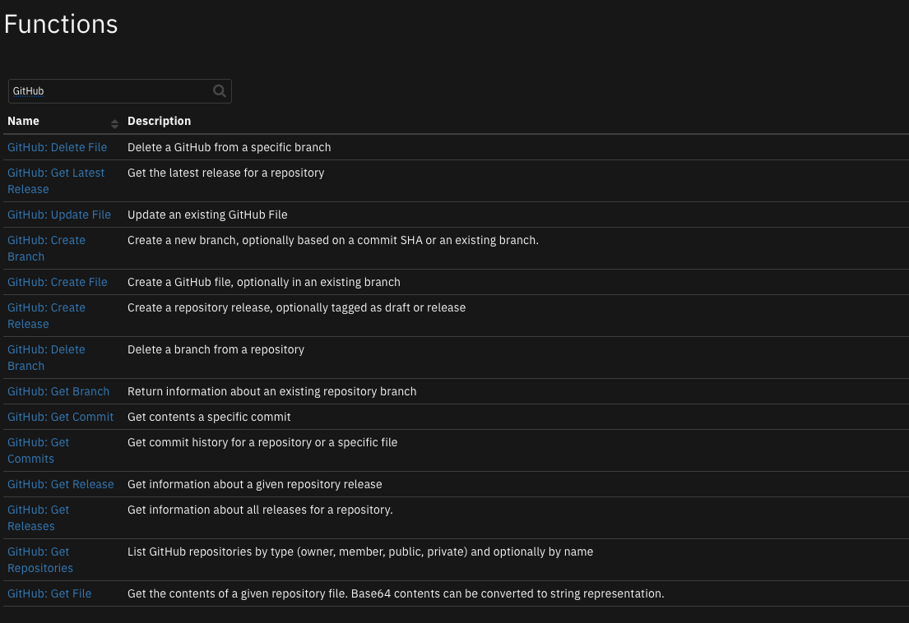
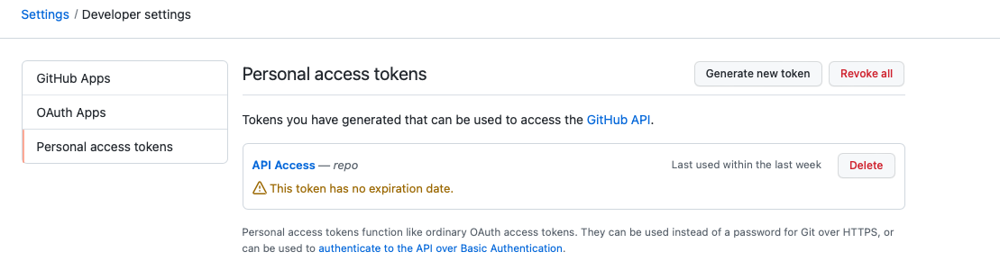

<!--
  This README.md is generated by running:
  "resilient-sdk docgen -p fn_github"

  It is best edited using a Text Editor with a Markdown Previewer. VS Code
  is a good example. Checkout https://guides.github.com/features/mastering-markdown/
  for tips on writing with Markdown

  All fields followed by "::CHANGE_ME::"" should be manually edited

  If you make manual edits and run docgen again, a .bak file will be created

  Store any screenshots in the "doc/screenshots" directory and reference them like:
  

  NOTE: If your app is available in the container-format only, there is no need to mention the integration server in this readme.
-->

# GitHub Functions for IBM SOAR

## Table of Contents
- [Release Notes](#release-notes)
- [Overview](#overview)
  - [Key Features](#key-features)
- [Requirements](#requirements)
  - [SOAR platform](#soar-platform)
  - [Cloud Pak for Security](#cloud-pak-for-security)
  - [Proxy Server](#proxy-server)
  - [Python Environment](#python-environment)
- [Installation](#installation)
  - [Install](#install)
  - [App Configuration](#app-configuration)
- [Function - GitHub Delete File](#function---github-delete-file)
- [Function - GitHub Get Latest Release](#function---github-get-latest-release)
- [Function - GitHub Update File](#function---github-update-file)
- [Function - GitHub: Create Branch](#function---github-create-branch)
- [Function - GitHub: Create File](#function---github-create-file)
- [Function - GitHub: Create Release](#function---github-create-release)
- [Function - GitHub: Delete Branch](#function---github-delete-branch)
- [Function - GitHub: Get Branch](#function---github-get-branch)
- [Function - GitHub: Get Commit](#function---github-get-commit)
- [Function - GitHub: Get Commits](#function---github-get-commits)
- [Function - GitHub: Get File](#function---github-get-file)
- [Function - GitHub: Get Release](#function---github-get-release)
- [Function - GitHub: Get Releases](#function---github-get-releases)
- [Function - GitHub: Get Repositories](#function---github-get-repositories)
- [Function - GitHub: List Directory Files](#function---github-list-directory-files)
- [Script - Convert JSON to rich text v1.3](#script---convert-json-to-rich-text-v13)
- [Playbooks](#playbooks)
- [Troubleshooting & Support](#troubleshooting--support)

---

## Release Notes
<!--
  Specify all changes in this release. Do not remove the release 
  notes of a previous release
-->
| Version | Date | Notes |
| ------- | ---- | ----- |
| 1.0.0 | 12/2022 | Initial Release |

---

## Overview
<!--
  Provide a high-level description of the function itself and its remote software or application.
  The text below is parsed from the "description" and "long_description" attributes in the setup.py file
-->
**SOAR Functions for GitHub**

 

Perform actions on GitHub repositories, branches, files, releases, commits and repositories.

<br>

Links:

<ul><a target='blank' href='https://ibm.com/mysupport'>Support</a></ul>

<ul><a target='blank' href='https://ideas.ibm.com/'>Enhancement Requests</a></ul>

### Key Features
<!--
  List the Key Features of the Integration
-->
* Create, update and delete files, and retrive the contents of a file, optionally in branch
* Create, list and delete branches
* Create and list releases
* Get information about commits

---

## Requirements
This app supports the IBM Security QRadar SOAR Platform and the IBM Security QRadar SOAR for IBM Cloud Pak for Security.

### SOAR platform
The SOAR platform supports two app deployment mechanisms, Edge Gateway (formerly App Host) and integration server.

If deploying to a SOAR platform with an Edge Gateway, the requirements are:
* SOAR platform >= `45.0.7899`.
* The app is in a container-based format (available from the AppExchange as a `zip` file).

If deploying to a SOAR platform with an integration server, the requirements are:
* SOAR platform >= `45.0.7899`.
* The app is in the older integration format (available from the AppExchange as a `zip` file which contains a `tar.gz` file).
* Integration server is running `resilient-circuits>=46.0.0`.
* If using an API key account, make sure the account provides the following minimum permissions: 
  | Name | Permissions |
  | ---- | ----------- |
  | Org Data | Read |
  | Function | Read |

The following SOAR platform guides provide additional information: 
* _Edge Gateway Deployment Guide_ or _App Host Deployment Guide_: provides installation, configuration, and troubleshooting information, including proxy server settings. 
* _Integration Server Guide_: provides installation, configuration, and troubleshooting information, including proxy server settings.
* _System Administrator Guide_: provides the procedure to install, configure and deploy apps. 

The above guides are available on the IBM Documentation website at [ibm.biz/soar-docs](https://ibm.biz/soar-docs). On this web page, select your SOAR platform version. On the follow-on page, you can find the _Edge Gateway Deployment Guide_, _App Host Deployment Guide_, or _Integration Server Guide_ by expanding **Apps** in the Table of Contents pane. The System Administrator Guide is available by expanding **System Administrator**.

### Cloud Pak for Security
If you are deploying to IBM Cloud Pak for Security, the requirements are:
* IBM Cloud Pak for Security >= `1.8`.
* Cloud Pak is configured with an App Host.
* The app is in a container-based format (available from the AppExchange as a `zip` file).

The following Cloud Pak guides provide additional information: 
* _Edge Gateway Deployment Guide_ or _App Host Deployment Guide_: provides installation, configuration, and troubleshooting information, including proxy server settings. From the Table of Contents, select Case Management and Orchestration & Automation > **Orchestration and Automation Apps**.
* _System Administrator Guide_: provides information to install, configure, and deploy apps. From the IBM Cloud Pak for Security IBM Documentation table of contents, select Case Management and Orchestration & Automation > **System administrator**.

These guides are available on the IBM Documentation website at [ibm.biz/cp4s-docs](https://ibm.biz/cp4s-docs). From this web page, select your IBM Cloud Pak for Security version. From the version-specific IBM Documentation page, select Case Management and Orchestration & Automation.

### Proxy Server
The app does support a proxy server, using the environment variables `HTTP_PROXY` and `HTTPS_PROXY`.

### Python Environment
Python 3.6 and Python 3.9 are supported.
Additional package dependencies may exist for each of these packages:
* github3.py @ git+https://github.com/sigmavirus24/github3.py.git
* resilient-circuits>=46.0.0
* resilient-lib

### GitHub Development Version

This app has been implemented using:
| Product Name | Product Version | API URL | API Version |
| ------------ | --------------- | ------- | ----------- |
| GitHub Enterprise Server | 3.3 | - | v3 |

#### Prerequisites

This app works best using an API token. Create one within the GitHub UI under your Account: Settings and Developer settings. The API will be specified in your app.config file using the `api_token` setting. 

 

---

## Installation

### Install
* To install or uninstall an App or Integration on the _SOAR platform_, see the documentation at [ibm.biz/soar-docs](https://ibm.biz/soar-docs).
* To install or uninstall an App on _IBM Cloud Pak for Security_, see the documentation at [ibm.biz/cp4s-docs](https://ibm.biz/cp4s-docs) and follow the instructions above to navigate to Orchestration and Automation.

### App Configuration
The following table provides the settings you need to configure the app. These settings are made in the app.config file. See the documentation discussed in the Requirements section for the procedure.

| Config | Required | Example | Description |
| ------ | :------: | ------- | ----------- |
| **api_token** | Yes | `` | *API token from your account Settings/Developer settings/Personal access tokens* |
| **base_url** | Yes | `<https://github.com>` | *Or your enterprise GitHub url* |
| **client_auth_cert** | Yes | `<path_to_cert.pem>` | *Client auth certificate*  |
| **client_auth_key** | Yes | `<path_to_cert_private_key.pem>` | *Client auth keys* |
| **verify** | Yes | `True` | *Use False to disable client certificate validation* |


---

## Function - GitHub Delete File
Delete a GitHub file from a specific branch.


<details><summary>Inputs:</summary>
<p>

| Name | Type | Required | Example | Tooltip |
| ---- | :--: | :------: | ------- | ------- |
| `github_owner` | `text` | Yes | `-` | repository owner |
| `github_repo` | `text` | Yes | `-` | repository name |
| `github_branch` | `text` | No | `-` | - |
| `github_commit_message` | `text` | Yes | `-` | - |
| `github_committer` | `text` | No | `fullname:email_address` | provide full name and email address separated by a colon (:) |
| `github_file_path` | `text` | Yes | `directory/file_name` | file path |

</p>
</details>

<details><summary>Outputs:</summary>
<p>

> **NOTE:** This example might be in JSON format, but `results` is a Python Dictionary on the SOAR platform.

```python
results = {
  "content": {
    "ETag": "W/\"b6929ec040fc733128de56e0dadbb6d6211fd6169ac2150af9df4bc0d47f1a1a\"",
    "Last-Modified": "",
    "commit": "aa916f54d4e2bdf424a8e36a5fa2252770cbcbf3",
    "content": null
  },
  "inputs": {
    "github_branch": "testit_20221202_143109",
    "github_commit_message": "deleting this",
    "github_committer": null,
    "github_file_path": "test_folder/testit.txt",
    "github_owner": "test-owner",
    "github_repo": "personal"
  },
  "metrics": {
    "execution_time_ms": 2247,
    "host": "host",
    "package": "fn-github",
    "package_version": "1.0.0",
    "timestamp": "2022-12-02 17:04:27",
    "version": "1.0"
  },
  "raw": null,
  "reason": null,
  "success": true,
  "version": 2.0
}
```

</p>
</details>

---
## Function - GitHub Get Latest Release
Get the latest release for a repository.


<details><summary>Inputs:</summary>
<p>

| Name | Type | Required | Example | Tooltip |
| ---- | :--: | :------: | ------- | ------- |
| `github_owner` | `text` | Yes | `-` | repository owner |
| `github_repo` | `text` | Yes | `-` | repository name |

</p>
</details>

<details><summary>Outputs:</summary>
<p>

> **NOTE:** This example might be in JSON format, but `results` is a Python Dictionary on the SOAR platform.

```python
results = {
  "content": {
    "assets": [],
    "assets_url": "https://github.com/api/v3/repos/test-owner/personal/releases/1170504/assets",
    "author": {
      "avatar_url": "https://avatars.github.com/u/133011?",
      "events_url": "https://github.com/api/v3/users/test-owner/events{/privacy}",
      "followers_url": "https://github.com/api/v3/users/test-owner/followers",
      "following_url": "https://github.com/api/v3/users/test-owner/following{/other_user}",
      "gists_url": "https://github.com/api/v3/users/test-owner/gists{/gist_id}",
      "gravatar_id": "",
      "html_url": "https://github.com/test-owner",
      "id": 133011,
      "login": "test-owner",
      "node_id": "MDQ6VXNlcjEzMzAxMQ==",
      "organizations_url": "https://github.com/api/v3/users/test-owner/orgs",
      "received_events_url": "https://github.com/api/v3/users/test-owner/received_events",
      "repos_url": "https://github.com/api/v3/users/test-owner/repos",
      "site_admin": false,
      "starred_url": "https://github.com/api/v3/users/test-owner/starred{/owner}{/repo}",
      "subscriptions_url": "https://github.com/api/v3/users/test-owner/subscriptions",
      "type": "User",
      "url": "https://github.com/api/v3/users/test-owner"
    },
    "body": "Release Description",
    "body_html": "\u003cp\u003eRelease Description\u003c/p\u003e",
    "body_text": "Release Description",
    "created_at": "2022-12-02T18:55:23Z",
    "draft": false,
    "html_url": "https://github.com/test-owner/personal/releases/tag/v1.0.0_20221202_152441",
    "id": 1170504,
    "name": "Test Release_20221202_152441",
    "node_id": "MDc6UmVsZWFzZTExNzA1MDQ=",
    "prerelease": false,
    "published_at": "2022-12-02T20:34:09Z",
    "tag_name": "v1.0.0_20221202_152441",
    "tarball_url": "https://github.com/api/v3/repos/test-owner/personal/tarball/v1.0.0_20221202_152441",
    "target_commitish": "main",
    "upload_url": "https://github.com/api/uploads/repos/test-owner/personal/releases/1170504/assets{?name,label}",
    "url": "https://github.com/api/v3/repos/test-owner/personal/releases/1170504",
    "zipball_url": "https://github.com/api/v3/repos/test-owner/personal/zipball/v1.0.0_20221202_152441"
  },
  "inputs": {
    "github_owner": "test-owner",
    "github_repo": "personal"
  },
  "metrics": {
    "execution_time_ms": 249,
    "host": "host",
    "package": "fn-github",
    "package_version": "1.0.0",
    "timestamp": "2022-12-03 11:36:31",
    "version": "1.0"
  },
  "raw": null,
  "reason": null,
  "success": true,
  "version": 2.0
}
```

</p>
</details>

---
## Function - GitHub Update File
Update the properties of a user. These include, enabling or disabling an account, and modifying a user's password profile.


<details><summary>Inputs:</summary>
<p>

| Name | Type | Required | Example | Tooltip |
| ---- | :--: | :------: | ------- | ------- |
| `github_owner` | `text` | Yes | `-` | repository owner |
| `github_repo` | `text` | Yes | `-` | repository name |
| `github_branch` | `text` | No | `-` | - |
| `github_commit_message` | `text` | Yes | `-` | - |
| `github_committer` | `text` | No | `fullname:email_address` | provide full name and email address separated by a colon (:) |
| `github_file_contents` | `text` | Yes | `-` | String or base64 contents of file to create |
| `github_file_path` | `text` | Yes | `directory/file_name` | file path |

</p>
</details>

<details><summary>Outputs:</summary>
<p>

> **NOTE:** This example might be in JSON format, but `results` is a Python Dictionary on the SOAR platform.

```python
results = {
  "content": {
    "ETag": "W/\"f23eedc71476022c0fffe53ac794688f0227afc207e20091adf47b304777b92e\"",
    "Last-Modified": "",
    "commit": "cd9f8f74430fa82254987d8c01e4316fb82102d7",
    "content": "273f9600ddee78a52891b2e4bbd0b7e6929459a3"
  },
  "inputs": {
    "github_branch": "sample_branch",
    "github_commit_message": "update",
    "github_committer": null,
    "github_file_contents": "d\ne\nf",
    "github_file_path": "sample_file",
    "github_owner": "test-owner",
    "github_repo": "personal"
  },
  "metrics": {
    "execution_time_ms": 2360,
    "host": "host",
    "package": "fn-github",
    "package_version": "1.0.0",
    "timestamp": "2022-12-03 11:38:33",
    "version": "1.0"
  },
  "raw": null,
  "reason": null,
  "success": true,
  "version": 2.0
}
```

</p>
</details>


---
## Function - GitHub: Create Branch
Create a new branch, optionally based on a commit SHA or an existing branch.

<details><summary>Inputs:</summary>
<p>

| Name | Type | Required | Example | Tooltip |
| ---- | :--: | :------: | ------- | ------- |
| `github_owner` | `text` | Yes | `-` | repository owner |
| `github_repo` | `text` | Yes | `-` | repository name |
| `github_based_on_branch_or_sha` | `text` | Yes | `-` | Name of branch or sha1 commit |
| `github_branch` | `text` | No | `-` | - |

</p>
</details>

<details><summary>Outputs:</summary>
<p>

> **NOTE:** This example might be in JSON format, but `results` is a Python Dictionary on the SOAR platform.

```python
results = {
  "content": {
    "ref": "refs/heads/sample_branch"
  },
  "inputs": {
    "github_based_on_branch_or_sha": "main",
    "github_branch": "sample_branch",
    "github_owner": "test-owner",
    "github_repo": "personal"
  },
  "metrics": {
    "execution_time_ms": 2653,
    "host": "host",
    "package": "fn-github",
    "package_version": "1.0.0",
    "timestamp": "2022-12-03 11:30:19",
    "version": "1.0"
  },
  "raw": null,
  "reason": null,
  "success": true,
  "version": 2.0
}
```

</p>
</details>


---
## Function - GitHub: Create File
Create a GitHub file, optionally in an existing branch.


<details><summary>Inputs:</summary>
<p>

| Name | Type | Required | Example | Tooltip |
| ---- | :--: | :------: | ------- | ------- |
| `github_owner` | `text` | Yes | `-` | repository owner |
| `github_repo` | `text` | Yes | `-` | repository name |
| `github_commit_message` | `text` | Yes | `-` | - |
| `github_committer` | `text` | No | `fullname:email_address` | provide full name and email address separated by a colon (:) |
| `github_file_contents` | `text` | Yes | `-` | String or base64 contents of file to create |
| `github_file_path` | `text` | Yes | `directory/file_name` | file path |
| `github_ref` | `text` | No | `commit/branch/tag` | Reference a commit, branch, or tag  |

</p>
</details>

<details><summary>Outputs:</summary>
<p>

> **NOTE:** This example might be in JSON format, but `results` is a Python Dictionary on the SOAR platform.

```python
results = {
  "content": {
    "ETag": "\"9683de062b98f63f5d1be56538a01e923115c78102ab71d6442579998228ad7b\"",
    "Last-Modified": "",
    "commit": "4be6f56fdd37c9d3aa054a15cdfcb091bb16fa4d",
    "content": "1c943a98887754f364fafaa1da3ac56e0e0875a9"
  },
  "inputs": {
    "github_commit_message": "sample",
    "github_committer": "A Example:a@example.com",
    "github_file_contents": "a\nb\nc",
    "github_file_path": "sample_file",
    "github_owner": "test-owner",
    "github_ref": "sample_branch",
    "github_repo": "personal"
  },
  "metrics": {
    "execution_time_ms": 2152,
    "host": "host",
    "package": "fn-github",
    "package_version": "1.0.0",
    "timestamp": "2022-12-03 11:31:18",
    "version": "1.0"
  },
  "raw": null,
  "reason": null,
  "success": true,
  "version": 2.0
}
```

</p>
</details>


---
## Function - GitHub: Create Release
Create a repository release, optionally tagged as draft or release.

<details><summary>Inputs:</summary>
<p>

| Name | Type | Required | Example | Tooltip |
| ---- | :--: | :------: | ------- | ------- |
| `github_owner` | `text` | Yes | `-` | repository owner |
| `github_repo` | `text` | Yes | `-` | repository name |
| `github_prerelease` | `boolean` | No | `-` | - |
| `github_release_description` | `text` | No | `-` | - |
| `github_release_draft` | `boolean` | No | `-` | - |
| `github_release_name` | `text` | No | `-` | - |
| `github_release_tag` | `text` | Yes | `-` | - |

</p>
</details>

<details><summary>Outputs:</summary>
<p>

> **NOTE:** This example might be in JSON format, but `results` is a Python Dictionary on the SOAR platform.

```python
results = {
  "content": {
    "assets": [],
    "assets_url": "https://github.com/api/v3/repos/test-owner/personal/releases/1170764/assets",
    "author": {
      "avatar_url": "https://avatars.github.com/u/133011?",
      "events_url": "https://github.com/api/v3/users/test-owner/events{/privacy}",
      "followers_url": "https://github.com/api/v3/users/test-owner/followers",
      "following_url": "https://github.com/api/v3/users/test-owner/following{/other_user}",
      "gists_url": "https://github.com/api/v3/users/test-owner/gists{/gist_id}",
      "gravatar_id": "",
      "html_url": "https://github.com/test-owner",
      "id": 133011,
      "login": "test-owner",
      "node_id": "MDQ6VXNlcjEzMzAxMQ==",
      "organizations_url": "https://github.com/api/v3/users/test-owner/orgs",
      "received_events_url": "https://github.com/api/v3/users/test-owner/received_events",
      "repos_url": "https://github.com/api/v3/users/test-owner/repos",
      "site_admin": false,
      "starred_url": "https://github.com/api/v3/users/test-owner/starred{/owner}{/repo}",
      "subscriptions_url": "https://github.com/api/v3/users/test-owner/subscriptions",
      "type": "User",
      "url": "https://github.com/api/v3/users/test-owner"
    },
    "body": "release beta",
    "body_html": "\u003cp\u003erelease beta\u003c/p\u003e",
    "body_text": "release beta",
    "created_at": "2022-12-03T16:42:39Z",
    "draft": true,
    "html_url": "https://github.com/test-owner/personal/releases/tag/untagged-f35ad45a1f57b45713d7",
    "id": 1170764,
    "name": "v1.0.1-beta",
    "node_id": "MDc6UmVsZWFzZTExNzA3NjQ=",
    "prerelease": true,
    "published_at": null,
    "tag_name": "v1.0.1-beta",
    "tarball_url": null,
    "target_commitish": "main",
    "upload_url": "https://github.com/api/uploads/repos/test-owner/personal/releases/1170764/assets{?name,label}",
    "url": "https://github.com/api/v3/repos/test-owner/personal/releases/1170764",
    "zipball_url": null
  },
  "inputs": {
    "github_owner": "test-owner",
    "github_prerelease": true,
    "github_release_description": "release beta",
    "github_release_draft": true,
    "github_release_name": "v1.0.1-beta",
    "github_release_tag": "v1.0.1-beta",
    "github_repo": "personal"
  },
  "metrics": {
    "execution_time_ms": 442,
    "host": "host",
    "package": "fn-github",
    "package_version": "1.0.0",
    "timestamp": "2022-12-03 11:42:39",
    "version": "1.0"
  },
  "raw": null,
  "reason": null,
  "success": true,
  "version": 2.0
}
```

</p>
</details>


---
## Function - GitHub: Delete Branch
Delete a branch from a repository.


<details><summary>Inputs:</summary>
<p>

| Name | Type | Required | Example | Tooltip |
| ---- | :--: | :------: | ------- | ------- |
| `github_owner` | `text` | Yes | `-` | repository owner |
| `github_repo` | `text` | Yes | `-` | repository name |
| `github_branch` | `text` | No | `-` | - |

</p>
</details>

<details><summary>Outputs:</summary>
<p>

> **NOTE:** This example might be in JSON format, but `results` is a Python Dictionary on the SOAR platform.

```python
results = {
  "content": {},
  "inputs": {
    "github_branch": "testit_20221202_171242",
    "github_owner": "test-owner",
    "github_repo": "personal"
  },
  "metrics": {
    "execution_time_ms": 2271,
    "host": "host",
    "package": "fn-github",
    "package_version": "1.0.0",
    "timestamp": "2022-12-03 11:03:06",
    "version": "1.0"
  },
  "raw": null,
  "reason": null,
  "success": false,
  "version": 2.0
}
```

</p>
</details>


---
## Function - GitHub: Get Branch
Return information about an existing repository branch.


<details><summary>Inputs:</summary>
<p>

| Name | Type | Required | Example | Tooltip |
| ---- | :--: | :------: | ------- | ------- |
| `github_owner` | `text` | Yes | `-` | repository owner |
| `github_repo` | `text` | Yes | `-` | repository name |
| `github_branch` | `text` | No | `-` | - |

</p>
</details>

<details><summary>Outputs:</summary>
<p>

> **NOTE:** This example might be in JSON format, but `results` is a Python Dictionary on the SOAR platform.

```python
results = {
  "content": {
    "_links": {
      "html": "https://github.com/test-owner/personal/tree/sample_branch",
      "self": "https://github.com/api/v3/repos/test-owner/personal/branches/sample_branch"
    },
    "commit": {
      "author": {
        "avatar_url": "https://avatars.github.com/u/133011?",
        "events_url": "https://github.com/api/v3/users/test-owner/events{/privacy}",
        "followers_url": "https://github.com/api/v3/users/test-owner/followers",
        "following_url": "https://github.com/api/v3/users/test-owner/following{/other_user}",
        "gists_url": "https://github.com/api/v3/users/test-owner/gists{/gist_id}",
        "gravatar_id": "",
        "html_url": "https://github.com/test-owner",
        "id": 133011,
        "login": "test-owner",
        "node_id": "MDQ6VXNlcjEzMzAxMQ==",
        "organizations_url": "https://github.com/api/v3/users/test-owner/orgs",
        "received_events_url": "https://github.com/api/v3/users/test-owner/received_events",
        "repos_url": "https://github.com/api/v3/users/test-owner/repos",
        "site_admin": false,
        "starred_url": "https://github.com/api/v3/users/test-owner/starred{/owner}{/repo}",
        "subscriptions_url": "https://github.com/api/v3/users/test-owner/subscriptions",
        "type": "User",
        "url": "https://github.com/api/v3/users/test-owner"
      },
      "comments_url": "https://github.com/api/v3/repos/test-owner/personal/commits/cd9f8f74430fa82254987d8c01e4316fb82102d7/comments",
      "commit": {
        "author": {
          "date": "2022-12-03T16:38:31Z",
          "email": "Mark.Scherfling@ibm.com",
          "name": "Mark Scherfling"
        },
        "comment_count": 0,
        "committer": {
          "date": "2022-12-03T16:38:31Z",
          "email": "Mark.Scherfling@ibm.com",
          "name": "Mark Scherfling"
        },
        "message": "update",
        "tree": {
          "sha": "a4066fa7f2fa3b28d9f6ad4fc556d77074d0800a",
          "url": "https://github.com/api/v3/repos/test-owner/personal/git/trees/a4066fa7f2fa3b28d9f6ad4fc556d77074d0800a"
        },
        "url": "https://github.com/api/v3/repos/test-owner/personal/git/commits/cd9f8f74430fa82254987d8c01e4316fb82102d7",
        "verification": {
          "payload": null,
          "reason": "unsigned",
          "signature": null,
          "verified": false
        }
      },
      "committer": {
        "avatar_url": "https://avatars.github.com/u/133011?",
        "events_url": "https://github.com/api/v3/users/test-owner/events{/privacy}",
        "followers_url": "https://github.com/api/v3/users/test-owner/followers",
        "following_url": "https://github.com/api/v3/users/test-owner/following{/other_user}",
        "gists_url": "https://github.com/api/v3/users/test-owner/gists{/gist_id}",
        "gravatar_id": "",
        "html_url": "https://github.com/test-owner",
        "id": 133011,
        "login": "test-owner",
        "node_id": "MDQ6VXNlcjEzMzAxMQ==",
        "organizations_url": "https://github.com/api/v3/users/test-owner/orgs",
        "received_events_url": "https://github.com/api/v3/users/test-owner/received_events",
        "repos_url": "https://github.com/api/v3/users/test-owner/repos",
        "site_admin": false,
        "starred_url": "https://github.com/api/v3/users/test-owner/starred{/owner}{/repo}",
        "subscriptions_url": "https://github.com/api/v3/users/test-owner/subscriptions",
        "type": "User",
        "url": "https://github.com/api/v3/users/test-owner"
      },
      "html_url": "https://github.com/test-owner/personal/commit/cd9f8f74430fa82254987d8c01e4316fb82102d7",
      "node_id": "MDY6Q29tbWl0MTM2NzQwODpjZDlmOGY3NDQzMGZhODIyNTQ5ODdkOGMwMWU0MzE2ZmI4MjEwMmQ3",
      "parents": [
        {
          "html_url": "https://github.com/test-owner/personal/commit/4be6f56fdd37c9d3aa054a15cdfcb091bb16fa4d",
          "sha": "4be6f56fdd37c9d3aa054a15cdfcb091bb16fa4d",
          "url": "https://github.com/api/v3/repos/test-owner/personal/commits/4be6f56fdd37c9d3aa054a15cdfcb091bb16fa4d"
        }
      ],
      "sha": "cd9f8f74430fa82254987d8c01e4316fb82102d7",
      "url": "https://github.com/api/v3/repos/test-owner/personal/commits/cd9f8f74430fa82254987d8c01e4316fb82102d7"
    },
    "name": "sample_branch",
    "protected": false,
    "protection": {
      "enabled": false,
      "required_status_checks": {
        "contexts": [],
        "enforcement_level": "off"
      }
    },
    "protection_url": "https://github.com/api/v3/repos/test-owner/personal/branches/sample_branch/protection"
  },
  "inputs": {
    "github_branch": "sample_branch",
    "github_owner": "test-owner",
    "github_repo": "personal"
  },
  "metrics": {
    "execution_time_ms": 260,
    "host": "host",
    "package": "fn-github",
    "package_version": "1.0.0",
    "timestamp": "2022-12-03 12:03:24",
    "version": "1.0"
  },
  "raw": null,
  "reason": null,
  "success": true,
  "version": 2.0
}
```

</p>
</details>

---
## Function - GitHub: Get Commit
Get contents a specific commit.

<details><summary>Inputs:</summary>
<p>

| Name | Type | Required | Example | Tooltip |
| ---- | :--: | :------: | ------- | ------- |
| `github_owner` | `text` | Yes | `-` | repository owner |
| `github_repo` | `text` | Yes | `-` | repository name |
| `github_sha` | `text` | Yes | `-` | - |

</p>
</details>

<details><summary>Outputs:</summary>
<p>

> **NOTE:** This example might be in JSON format, but `results` is a Python Dictionary on the SOAR platform.

```python
results = {
  "content": {
    "author": null,
    "comments_url": "https://github.com/api/v3/repos/test-owner/personal/commits/4be6f56fdd37c9d3aa054a15cdfcb091bb16fa4d/comments",
    "commit": {
      "author": {
        "date": "2022-12-03T16:31:16Z",
        "email": "a@example.com",
        "name": "A Example"
      },
      "comment_count": 0,
      "committer": {
        "date": "2022-12-03T16:31:16Z",
        "email": "a@example.com",
        "name": "A Example"
      },
      "message": "sample",
      "tree": {
        "sha": "cf973382698e6d6fb61d6fe6c9e241cb66afff98",
        "url": "https://github.com/api/v3/repos/test-owner/personal/git/trees/cf973382698e6d6fb61d6fe6c9e241cb66afff98"
      },
      "url": "https://github.com/api/v3/repos/test-owner/personal/git/commits/4be6f56fdd37c9d3aa054a15cdfcb091bb16fa4d",
      "verification": {
        "payload": null,
        "reason": "unsigned",
        "signature": null,
        "verified": false
      }
    },
    "committer": null,
    "files": [
      {
        "additions": 3,
        "blob_url": "https://github.com/test-owner/personal/blob/4be6f56fdd37c9d3aa054a15cdfcb091bb16fa4d/sample_file",
        "changes": 3,
        "contents_url": "https://github.com/api/v3/repos/test-owner/personal/contents/sample_file?ref=4be6f56fdd37c9d3aa054a15cdfcb091bb16fa4d",
        "deletions": 0,
        "filename": "sample_file",
        "patch": "@@ -0,0 +1,3 @@\n+a\n+b\n+c\n\\ No newline at end of file",
        "raw_url": "https://github.com/test-owner/personal/raw/4be6f56fdd37c9d3aa054a15cdfcb091bb16fa4d/sample_file",
        "sha": "1c943a98887754f364fafaa1da3ac56e0e0875a9",
        "status": "added"
      }
    ],
    "html_url": "https://github.com/test-owner/personal/commit/4be6f56fdd37c9d3aa054a15cdfcb091bb16fa4d",
    "node_id": "MDY6Q29tbWl0MTM2NzQwODo0YmU2ZjU2ZmRkMzdjOWQzYWEwNTRhMTVjZGZjYjA5MWJiMTZmYTRk",
    "parents": [
      {
        "html_url": "https://github.com/test-owner/personal/commit/9b4630d4b69a2b1381c9e39c66cbfafc4d3a9288",
        "sha": "9b4630d4b69a2b1381c9e39c66cbfafc4d3a9288",
        "url": "https://github.com/api/v3/repos/test-owner/personal/commits/9b4630d4b69a2b1381c9e39c66cbfafc4d3a9288"
      }
    ],
    "sha": "4be6f56fdd37c9d3aa054a15cdfcb091bb16fa4d",
    "stats": {
      "additions": 3,
      "deletions": 0,
      "total": 3
    },
    "url": "https://github.com/api/v3/repos/test-owner/personal/commits/4be6f56fdd37c9d3aa054a15cdfcb091bb16fa4d"
  },
  "inputs": {
    "github_owner": "test-owner",
    "github_repo": "personal",
    "github_sha": "4be6f56fdd37c9d3aa054a15cdfcb091bb16fa4d"
  },
  "metrics": {
    "execution_time_ms": 380,
    "host": "host",
    "package": "fn-github",
    "package_version": "1.0.0",
    "timestamp": "2022-12-03 11:36:03",
    "version": "1.0"
  },
  "raw": null,
  "reason": null,
  "success": true,
  "version": 2.0
}
```

</p>
</details>


---
## Function - GitHub: Get Commits
Get commit history for a repository or a specific file.


<details><summary>Inputs:</summary>
<p>

| Name | Type | Required | Example | Tooltip |
| ---- | :--: | :------: | ------- | ------- |
| `github_owner` | `text` | Yes | `-` | repository owner |
| `github_repo` | `text` | Yes | `-` | repository name |
| `github_optional_file_path` | `text` | No | `-` | - |
| `github_ref` | `text` | No | `commit/branch/tag` | Reference a commit, branch, or tag  |
| `github_since_date` | `datepicker` | No | `-` | - |
| `github_until_date` | `datepicker` | No | `-` | - |
| `github_limit` | `number` | No | `-` | Limit # of commits to return. Defaults to all commits (-1) |

</p>
</details>

<details><summary>Outputs:</summary>
<p>

> **NOTE:** This example might be in JSON format, but `results` is a Python Dictionary on the SOAR platform.

```python
results = {
  "content": [
    "9b4630d4b69a2b1381c9e39c66cbfafc4d3a9288",
    "4313a3fc6fe92d6fddf3ce95bf171a033c09bfcf",
    "2a75e6631e25ac1c998747ba1fd7dfac679ddc85",
    "81d1985def1840b92a0fc109761345e2966043a7"
  ],
  "inputs": {
    "github_optional_file_path": null,
    "github_owner": "test-owner",
    "github_ref": null,
    "github_repo": "personal",
    "github_since_date": 1669939200000,
    "github_until_date": null
  },
  "metrics": {
    "execution_time_ms": 325,
    "host": "host",
    "package": "fn-github",
    "package_version": "1.0.0",
    "timestamp": "2022-12-03 12:07:32",
    "version": "1.0"
  },
  "raw": null,
  "reason": null,
  "success": true,
  "version": 2.0
}
```

</p>
</details>

---
## Function - GitHub: Get File
Get the contents of a given repository file. Base64 contents can be converted to string representation.

<details><summary>Inputs:</summary>
<p>

| Name | Type | Required | Example | Tooltip |
| ---- | :--: | :------: | ------- | ------- |
| `github_owner` | `text` | Yes | `-` | repository owner |
| `github_repo` | `text` | Yes | `-` | repository name |
| `github_file_path` | `text` | Yes | `directory/file_name` | file path |
| `github_ref` | `text` | No | `commit/branch/tag` | Reference a commit, branch, or tag  |
| `github_return_base64` | `boolean` | No | `-` | choose to return base64 or decoded content |

</p>
</details>

<details><summary>Outputs:</summary>
<p>

> **NOTE:** This example might be in JSON format, but `results` is a Python Dictionary on the SOAR platform.

```python
results = {
  "content": "a\nb\nc",
  "inputs": {
    "github_file_path": "sample_file",
    "github_owner": "test-owner",
    "github_ref": "sample_branch",
    "github_repo": "personal",
    "github_return_base64": false
  },
  "metrics": {
    "execution_time_ms": 247,
    "host": "host",
    "package": "fn-github",
    "package_version": "1.0.0",
    "timestamp": "2022-12-03 11:33:58",
    "version": "1.0"
  },
  "raw": null,
  "reason": null,
  "success": true,
  "version": 2.0
}
```

</p>
</details>


---
## Function - GitHub: Get Release
Get information about a given repository release.


<details><summary>Inputs:</summary>
<p>

| Name | Type | Required | Example | Tooltip |
| ---- | :--: | :------: | ------- | ------- |
| `github_owner` | `text` | Yes | `-` | repository owner |
| `github_repo` | `text` | Yes | `-` | repository name |
| `github_release_tag` | `text` | Yes | `-` | - |

</p>
</details>

<details><summary>Outputs:</summary>
<p>

> **NOTE:** This example might be in JSON format, but `results` is a Python Dictionary on the SOAR platform.

```python
results = {
  "content": {
    "assets": [],
    "assets_url": "https://github.com/api/v3/repos/test-owner/personal/releases/1150808/assets",
    "author": {
      "avatar_url": "https://avatars.github.com/u/133011?",
      "events_url": "https://github.com/api/v3/users/test-owner/events{/privacy}",
      "followers_url": "https://github.com/api/v3/users/test-owner/followers",
      "following_url": "https://github.com/api/v3/users/test-owner/following{/other_user}",
      "gists_url": "https://github.com/api/v3/users/test-owner/gists{/gist_id}",
      "gravatar_id": "",
      "html_url": "https://github.com/test-owner",
      "id": 133011,
      "login": "test-owner",
      "node_id": "MDQ6VXNlcjEzMzAxMQ==",
      "organizations_url": "https://github.com/api/v3/users/test-owner/orgs",
      "received_events_url": "https://github.com/api/v3/users/test-owner/received_events",
      "repos_url": "https://github.com/api/v3/users/test-owner/repos",
      "site_admin": false,
      "starred_url": "https://github.com/api/v3/users/test-owner/starred{/owner}{/repo}",
      "subscriptions_url": "https://github.com/api/v3/users/test-owner/subscriptions",
      "type": "User",
      "url": "https://github.com/api/v3/users/test-owner"
    },
    "body": "some description",
    "body_html": "\u003cp\u003esome description\u003c/p\u003e",
    "body_text": "some description",
    "created_at": "2022-11-08T02:33:05Z",
    "draft": false,
    "html_url": "https://github.com/test-owner/personal/releases/tag/v1.0.0",
    "id": 1150808,
    "name": "Initial Release",
    "node_id": "MDc6UmVsZWFzZTExNTA4MDg=",
    "prerelease": false,
    "published_at": "2022-11-09T21:29:39Z",
    "tag_name": "v1.0.0",
    "tarball_url": "https://github.com/api/v3/repos/test-owner/personal/tarball/v1.0.0",
    "target_commitish": "main",
    "upload_url": "https://github.com/api/uploads/repos/test-owner/personal/releases/1150808/assets{?name,label}",
    "url": "https://github.com/api/v3/repos/test-owner/personal/releases/1150808",
    "zipball_url": "https://github.com/api/v3/repos/test-owner/personal/zipball/v1.0.0"
  },
  "inputs": {
    "github_owner": "test-owner",
    "github_release_tag": "v1.0.0",
    "github_repo": "personal"
  },
  "metrics": {
    "execution_time_ms": 253,
    "host": "host",
    "package": "fn-github",
    "package_version": "1.0.0",
    "timestamp": "2022-12-03 11:37:07",
    "version": "1.0"
  },
  "raw": null,
  "reason": null,
  "success": true,
  "version": 2.0
}
```

</p>
</details>


---
## Function - GitHub: Get Releases
Get information about all releases for a repository.

<details><summary>Inputs:</summary>
<p>

| Name | Type | Required | Example | Tooltip |
| ---- | :--: | :------: | ------- | ------- |
| `github_owner` | `text` | Yes | `-` | repository owner |
| `github_repo` | `text` | Yes | `-` | repository name |

</p>
</details>

<details><summary>Outputs:</summary>
<p>

> **NOTE:** This example might be in JSON format, but `results` is a Python Dictionary on the SOAR platform.

```python
results = {
  "content": [
    {
      "assets": [],
      "assets_url": "https://github.com/api/v3/repos/test-owner/personal/releases/1170764/assets",
      "author": {
        "avatar_url": "https://avatars.github.com/u/133011?",
        "events_url": "https://github.com/api/v3/users/test-owner/events{/privacy}",
        "followers_url": "https://github.com/api/v3/users/test-owner/followers",
        "following_url": "https://github.com/api/v3/users/test-owner/following{/other_user}",
        "gists_url": "https://github.com/api/v3/users/test-owner/gists{/gist_id}",
        "gravatar_id": "",
        "html_url": "https://github.com/test-owner",
        "id": 133011,
        "login": "test-owner",
        "node_id": "MDQ6VXNlcjEzMzAxMQ==",
        "organizations_url": "https://github.com/api/v3/users/test-owner/orgs",
        "received_events_url": "https://github.com/api/v3/users/test-owner/received_events",
        "repos_url": "https://github.com/api/v3/users/test-owner/repos",
        "site_admin": false,
        "starred_url": "https://github.com/api/v3/users/test-owner/starred{/owner}{/repo}",
        "subscriptions_url": "https://github.com/api/v3/users/test-owner/subscriptions",
        "type": "User",
        "url": "https://github.com/api/v3/users/test-owner"
      },
      "body": "release beta",
      "body_html": "\u003cp\u003erelease beta\u003c/p\u003e",
      "body_text": "release beta",
      "created_at": "2022-12-03T16:42:39Z",
      "draft": true,
      "html_url": "https://github.com/test-owner/personal/releases/tag/untagged-f35ad45a1f57b45713d7",
      "id": 1170764,
      "name": "v1.0.1-beta",
      "node_id": "MDc6UmVsZWFzZTExNzA3NjQ=",
      "prerelease": true,
      "published_at": null,
      "tag_name": "v1.0.1-beta",
      "tarball_url": null,
      "target_commitish": "main",
      "upload_url": "https://github.com/api/uploads/repos/test-owner/personal/releases/1170764/assets{?name,label}",
      "url": "https://github.com/api/v3/repos/test-owner/personal/releases/1170764",
      "zipball_url": null
    },
    {
      "assets": [],
      "assets_url": "https://github.com/api/v3/repos/test-owner/personal/releases/1170561/assets",
      "author": {
        "avatar_url": "https://avatars.github.com/u/133011?",
        "events_url": "https://github.com/api/v3/users/test-owner/events{/privacy}",
        "followers_url": "https://github.com/api/v3/users/test-owner/followers",
        "following_url": "https://github.com/api/v3/users/test-owner/following{/other_user}",
        "gists_url": "https://github.com/api/v3/users/test-owner/gists{/gist_id}",
        "gravatar_id": "",
        "html_url": "https://github.com/test-owner",
        "id": 133011,
        "login": "test-owner",
        "node_id": "MDQ6VXNlcjEzMzAxMQ==",
        "organizations_url": "https://github.com/api/v3/users/test-owner/orgs",
        "received_events_url": "https://github.com/api/v3/users/test-owner/received_events",
        "repos_url": "https://github.com/api/v3/users/test-owner/repos",
        "site_admin": false,
        "starred_url": "https://github.com/api/v3/users/test-owner/starred{/owner}{/repo}",
        "subscriptions_url": "https://github.com/api/v3/users/test-owner/subscriptions",
        "type": "User",
        "url": "https://github.com/api/v3/users/test-owner"
      },
      "body": "Release Description",
      "body_html": "\u003cp\u003eRelease Description\u003c/p\u003e",
      "body_text": "Release Description",
      "created_at": "2022-12-02T18:55:23Z",
      "draft": false,
      "html_url": "https://github.com/test-owner/personal/releases/tag/v1.0.0_20221202_171442",
      "id": 1170561,
      "name": "Test Release_20221202_171442",
      "node_id": "MDc6UmVsZWFzZTExNzA1NjE=",
      "prerelease": true,
      "published_at": "2022-12-02T22:14:46Z",
      "tag_name": "v1.0.0_20221202_171442",
      "tarball_url": "https://github.com/api/v3/repos/test-owner/personal/tarball/v1.0.0_20221202_171442",
      "target_commitish": "main",
      "upload_url": "https://github.com/api/uploads/repos/test-owner/personal/releases/1170561/assets{?name,label}",
      "url": "https://github.com/api/v3/repos/test-owner/personal/releases/1170561",
      "zipball_url": "https://github.com/api/v3/repos/test-owner/personal/zipball/v1.0.0_20221202_171442"
    },
    {
      "assets": [],
      "assets_url": "https://github.com/api/v3/repos/test-owner/personal/releases/1170516/assets",
      "author": {
        "avatar_url": "https://avatars.github.com/u/133011?",
        "events_url": "https://github.com/api/v3/users/test-owner/events{/privacy}",
        "followers_url": "https://github.com/api/v3/users/test-owner/followers",
        "following_url": "https://github.com/api/v3/users/test-owner/following{/other_user}",
        "gists_url": "https://github.com/api/v3/users/test-owner/gists{/gist_id}",
        "gravatar_id": "",
        "html_url": "https://github.com/test-owner",
        "id": 133011,
        "login": "test-owner",
        "node_id": "MDQ6VXNlcjEzMzAxMQ==",
        "organizations_url": "https://github.com/api/v3/users/test-owner/orgs",
        "received_events_url": "https://github.com/api/v3/users/test-owner/received_events",
        "repos_url": "https://github.com/api/v3/users/test-owner/repos",
        "site_admin": false,
        "starred_url": "https://github.com/api/v3/users/test-owner/starred{/owner}{/repo}",
        "subscriptions_url": "https://github.com/api/v3/users/test-owner/subscriptions",
        "type": "User",
        "url": "https://github.com/api/v3/users/test-owner"
      },
      "body": "Release Description",
      "body_html": "\u003cp\u003eRelease Description\u003c/p\u003e",
      "body_text": "Release Description",
      "created_at": "2022-12-02T18:55:23Z",
      "draft": false,
      "html_url": "https://github.com/test-owner/personal/releases/tag/v1.0.0_20221202_153917",
      "id": 1170516,
      "name": "Test Release_20221202_153917",
      "node_id": "MDc6UmVsZWFzZTExNzA1MTY=",
      "prerelease": true,
      "published_at": "2022-12-02T20:39:22Z",
      "tag_name": "v1.0.0_20221202_153917",
      "tarball_url": "https://github.com/api/v3/repos/test-owner/personal/tarball/v1.0.0_20221202_153917",
      "target_commitish": "main",
      "upload_url": "https://github.com/api/uploads/repos/test-owner/personal/releases/1170516/assets{?name,label}",
      "url": "https://github.com/api/v3/repos/test-owner/personal/releases/1170516",
      "zipball_url": "https://github.com/api/v3/repos/test-owner/personal/zipball/v1.0.0_20221202_153917"
    },
    {
      "assets": [],
      "assets_url": "https://github.com/api/v3/repos/test-owner/personal/releases/1170504/assets",
      "author": {
        "avatar_url": "https://avatars.github.com/u/133011?",
        "events_url": "https://github.com/api/v3/users/test-owner/events{/privacy}",
        "followers_url": "https://github.com/api/v3/users/test-owner/followers",
        "following_url": "https://github.com/api/v3/users/test-owner/following{/other_user}",
        "gists_url": "https://github.com/api/v3/users/test-owner/gists{/gist_id}",
        "gravatar_id": "",
        "html_url": "https://github.com/test-owner",
        "id": 133011,
        "login": "test-owner",
        "node_id": "MDQ6VXNlcjEzMzAxMQ==",
        "organizations_url": "https://github.com/api/v3/users/test-owner/orgs",
        "received_events_url": "https://github.com/api/v3/users/test-owner/received_events",
        "repos_url": "https://github.com/api/v3/users/test-owner/repos",
        "site_admin": false,
        "starred_url": "https://github.com/api/v3/users/test-owner/starred{/owner}{/repo}",
        "subscriptions_url": "https://github.com/api/v3/users/test-owner/subscriptions",
        "type": "User",
        "url": "https://github.com/api/v3/users/test-owner"
      },
      "body": "Release Description",
      "body_html": "\u003cp\u003eRelease Description\u003c/p\u003e",
      "body_text": "Release Description",
      "created_at": "2022-12-02T18:55:23Z",
      "draft": false,
      "html_url": "https://github.com/test-owner/personal/releases/tag/v1.0.0_20221202_152441",
      "id": 1170504,
      "name": "Test Release_20221202_152441",
      "node_id": "MDc6UmVsZWFzZTExNzA1MDQ=",
      "prerelease": false,
      "published_at": "2022-12-02T20:34:09Z",
      "tag_name": "v1.0.0_20221202_152441",
      "tarball_url": "https://github.com/api/v3/repos/test-owner/personal/tarball/v1.0.0_20221202_152441",
      "target_commitish": "main",
      "upload_url": "https://github.com/api/uploads/repos/test-owner/personal/releases/1170504/assets{?name,label}",
      "url": "https://github.com/api/v3/repos/test-owner/personal/releases/1170504",
      "zipball_url": "https://github.com/api/v3/repos/test-owner/personal/zipball/v1.0.0_20221202_152441"
    },
    {
      "assets": [],
      "assets_url": "https://github.com/api/v3/repos/test-owner/personal/releases/1150808/assets",
      "author": {
        "avatar_url": "https://avatars.github.com/u/133011?",
        "events_url": "https://github.com/api/v3/users/test-owner/events{/privacy}",
        "followers_url": "https://github.com/api/v3/users/test-owner/followers",
        "following_url": "https://github.com/api/v3/users/test-owner/following{/other_user}",
        "gists_url": "https://github.com/api/v3/users/test-owner/gists{/gist_id}",
        "gravatar_id": "",
        "html_url": "https://github.com/test-owner",
        "id": 133011,
        "login": "test-owner",
        "node_id": "MDQ6VXNlcjEzMzAxMQ==",
        "organizations_url": "https://github.com/api/v3/users/test-owner/orgs",
        "received_events_url": "https://github.com/api/v3/users/test-owner/received_events",
        "repos_url": "https://github.com/api/v3/users/test-owner/repos",
        "site_admin": false,
        "starred_url": "https://github.com/api/v3/users/test-owner/starred{/owner}{/repo}",
        "subscriptions_url": "https://github.com/api/v3/users/test-owner/subscriptions",
        "type": "User",
        "url": "https://github.com/api/v3/users/test-owner"
      },
      "body": "some description",
      "body_html": "\u003cp\u003esome description\u003c/p\u003e",
      "body_text": "some description",
      "created_at": "2022-11-08T02:33:05Z",
      "draft": false,
      "html_url": "https://github.com/test-owner/personal/releases/tag/v1.0.0",
      "id": 1150808,
      "name": "Initial Release",
      "node_id": "MDc6UmVsZWFzZTExNTA4MDg=",
      "prerelease": false,
      "published_at": "2022-11-09T21:29:39Z",
      "tag_name": "v1.0.0",
      "tarball_url": "https://github.com/api/v3/repos/test-owner/personal/tarball/v1.0.0",
      "target_commitish": "main",
      "upload_url": "https://github.com/api/uploads/repos/test-owner/personal/releases/1150808/assets{?name,label}",
      "url": "https://github.com/api/v3/repos/test-owner/personal/releases/1150808",
      "zipball_url": "https://github.com/api/v3/repos/test-owner/personal/zipball/v1.0.0"
    }
  ],
  "inputs": {
    "github_owner": "test-owner",
    "github_repo": "personal"
  },
  "metrics": {
    "execution_time_ms": 299,
    "host": "host",
    "package": "fn-github",
    "package_version": "1.0.0",
    "timestamp": "2022-12-03 12:08:43",
    "version": "1.0"
  },
  "raw": null,
  "reason": null,
  "success": true,
  "version": 2.0
}
```

</p>
</details>


---
## Function - GitHub: Get Repositories
List GitHub repositories by type (owner, member, public, private) and optionally by name.


<details><summary>Inputs:</summary>
<p>

| Name | Type | Required | Example | Tooltip |
| ---- | :--: | :------: | ------- | ------- |
| `github_filter_name` | `text` | No | `-` | search using 'contains' logic (no wildcards) |
| `github_repo_type` | `select` | No | `-` | 'owner', 'private', 'public', 'member' |

</p>
</details>

<details><summary>Outputs:</summary>
<p>

> **NOTE:** This example might be in JSON format, but `results` is a Python Dictionary on the SOAR platform.

```python
results = {
  "content": [
    {
      "allow_forking": true,
      "archive_url": "https://github.com/api/v3/repos/test-owner/personal/{archive_format}{/ref}",
      "archived": false,
      "assignees_url": "https://github.com/api/v3/repos/test-owner/personal/assignees{/user}",
      "blobs_url": "https://github.com/api/v3/repos/test-owner/personal/git/blobs{/sha}",
      "branches_url": "https://github.com/api/v3/repos/test-owner/personal/branches{/branch}",
      "clone_url": "https://github.com/test-owner/personal.git",
      "collaborators_url": "https://github.com/api/v3/repos/test-owner/personal/collaborators{/collaborator}",
      "comments_url": "https://github.com/api/v3/repos/test-owner/personal/comments{/number}",
      "commits_url": "https://github.com/api/v3/repos/test-owner/personal/commits{/sha}",
      "compare_url": "https://github.com/api/v3/repos/test-owner/personal/compare/{base}...{head}",
      "contents_url": "https://github.com/api/v3/repos/test-owner/personal/contents/{+path}",
      "contributors_url": "https://github.com/api/v3/repos/test-owner/personal/contributors",
      "created_at": "2022-11-08T00:06:50Z",
      "default_branch": "main",
      "deployments_url": "https://github.com/api/v3/repos/test-owner/personal/deployments",
      "description": null,
      "disabled": false,
      "downloads_url": "https://github.com/api/v3/repos/test-owner/personal/downloads",
      "events_url": "https://github.com/api/v3/repos/test-owner/personal/events",
      "fork": false,
      "forks": 0,
      "forks_count": 0,
      "forks_url": "https://github.com/api/v3/repos/test-owner/personal/forks",
      "full_name": "test-owner/personal",
      "git_commits_url": "https://github.com/api/v3/repos/test-owner/personal/git/commits{/sha}",
      "git_refs_url": "https://github.com/api/v3/repos/test-owner/personal/git/refs{/sha}",
      "git_tags_url": "https://github.com/api/v3/repos/test-owner/personal/git/tags{/sha}",
      "git_url": "git://github.com/test-owner/personal.git",
      "has_downloads": true,
      "has_issues": true,
      "has_pages": false,
      "has_projects": true,
      "has_wiki": true,
      "homepage": null,
      "hooks_url": "https://github.com/api/v3/repos/test-owner/personal/hooks",
      "html_url": "https://github.com/test-owner/personal",
      "id": 1367408,
      "is_template": false,
      "issue_comment_url": "https://github.com/api/v3/repos/test-owner/personal/issues/comments{/number}",
      "issue_events_url": "https://github.com/api/v3/repos/test-owner/personal/issues/events{/number}",
      "issues_url": "https://github.com/api/v3/repos/test-owner/personal/issues{/number}",
      "keys_url": "https://github.com/api/v3/repos/test-owner/personal/keys{/key_id}",
      "labels_url": "https://github.com/api/v3/repos/test-owner/personal/labels{/name}",
      "language": null,
      "languages_url": "https://github.com/api/v3/repos/test-owner/personal/languages",
      "license": null,
      "merges_url": "https://github.com/api/v3/repos/test-owner/personal/merges",
      "milestones_url": "https://github.com/api/v3/repos/test-owner/personal/milestones{/number}",
      "mirror_url": null,
      "name": "personal",
      "node_id": "MDEwOlJlcG9zaXRvcnkxMzY3NDA4",
      "notifications_url": "https://github.com/api/v3/repos/test-owner/personal/notifications{?since,all,participating}",
      "open_issues": 0,
      "open_issues_count": 0,
      "owner": {
        "avatar_url": "https://avatars.github.com/u/133011?",
        "events_url": "https://github.com/api/v3/users/test-owner/events{/privacy}",
        "followers_url": "https://github.com/api/v3/users/test-owner/followers",
        "following_url": "https://github.com/api/v3/users/test-owner/following{/other_user}",
        "gists_url": "https://github.com/api/v3/users/test-owner/gists{/gist_id}",
        "gravatar_id": "",
        "html_url": "https://github.com/test-owner",
        "id": 133011,
        "login": "test-owner",
        "node_id": "MDQ6VXNlcjEzMzAxMQ==",
        "organizations_url": "https://github.com/api/v3/users/test-owner/orgs",
        "received_events_url": "https://github.com/api/v3/users/test-owner/received_events",
        "repos_url": "https://github.com/api/v3/users/test-owner/repos",
        "site_admin": false,
        "starred_url": "https://github.com/api/v3/users/test-owner/starred{/owner}{/repo}",
        "subscriptions_url": "https://github.com/api/v3/users/test-owner/subscriptions",
        "type": "User",
        "url": "https://github.com/api/v3/users/test-owner"
      },
      "permissions": {
        "admin": true,
        "maintain": true,
        "pull": true,
        "push": true,
        "triage": true
      },
      "private": true,
      "pulls_url": "https://github.com/api/v3/repos/test-owner/personal/pulls{/number}",
      "pushed_at": "2022-12-03T16:38:33Z",
      "releases_url": "https://github.com/api/v3/repos/test-owner/personal/releases{/id}",
      "size": 42,
      "ssh_url": "git@github.com:test-owner/personal.git",
      "stargazers_count": 0,
      "stargazers_url": "https://github.com/api/v3/repos/test-owner/personal/stargazers",
      "statuses_url": "https://github.com/api/v3/repos/test-owner/personal/statuses/{sha}",
      "subscribers_url": "https://github.com/api/v3/repos/test-owner/personal/subscribers",
      "subscription_url": "https://github.com/api/v3/repos/test-owner/personal/subscription",
      "svn_url": "https://github.com/test-owner/personal",
      "tags_url": "https://github.com/api/v3/repos/test-owner/personal/tags",
      "teams_url": "https://github.com/api/v3/repos/test-owner/personal/teams",
      "trees_url": "https://github.com/api/v3/repos/test-owner/personal/git/trees{/sha}",
      "updated_at": "2022-12-02T18:55:28Z",
      "url": "https://github.com/api/v3/repos/test-owner/personal",
      "visibility": "private",
      "watchers": 0,
      "watchers_count": 0
    }
  ],
  "inputs": {
    "github_filter_name": null,
    "github_repo_type": "owner"
  },
  "metrics": {
    "execution_time_ms": 242,
    "host": "host",
    "package": "fn-github",
    "package_version": "1.0.0",
    "timestamp": "2022-12-03 12:02:44",
    "version": "1.0"
  },
  "raw": null,
  "reason": null,
  "success": true,
  "version": 2.0
}
```

</p>
</details>

---
## Function - GitHub: List Directory Files
List the files within a folder patch and optionally within a branch


<details><summary>Inputs:</summary>
<p>

| Name | Type | Required | Example | Tooltip |
| ---- | :--: | :------: | ------- | ------- |
| `github_owner` | `text` | Yes | `-` | repository owner |
| `github_repo` | `text` | Yes | `-` | repository name |
| `github_file_path` | `text` | Yes | `directory/file_name` | file path |
| `github_branch` | `text` | No | `commit/branch/tag` | Reference a commit, branch, or tag  |

</p>
</details>

<details><summary>Outputs:</summary>
<p>

> **NOTE:** This example might be in JSON format, but `results` is a Python Dictionary on the SOAR platform.

```python
results = {
  "version": 2.0,
  "success": true,
  "reason": null,
  "content": {
    "testit.txt": {
      "git_url": "https://github.com/api/v3/repos/repo-owner/personal/git/blobs/7ae5ba435f196a40cc08b8b02c6b0905774a40de",
      "html_url": "https://github.com/repo-owner/personal/blob/testit_20221202_135847/test_folder/testit.txt",
      "path": "test_folder/testit.txt",
      "size": 17,
      "encoding": null
    }
  },
  "raw": null,
  "inputs": {
    "github_owner": "test-owner",
    "github_branch": "testit_20221202_135847",
    "github_file_path": "/test_folder",
    "github_repo": "personal"
  },
  "metrics": {
    "version": "1.0",
    "package": "fn-github",
    "package_version": "1.0.0",
    "host": "host",
    "execution_time_ms": 267,
    "timestamp": "2022-12-05 16:56:11"
  }
}
```

</p>
</details>


---

## Script - Convert JSON to rich text v1.3
This script converts a json object into a hierarchical display of rich text and adds the rich text to an incident's rich text (custom) field or an incident note. A workflow/playbook property is used to share the json to convert and identify parameters used on how to perform the conversion.
Typically, a function will create workflow property and this script will run after that function to perform the conversion.
  Features:
    * Display the hierarchical nature of json, presenting the json keys (sorted if specified) as bold labels
    * Provide links to found URLs
    * Create either an incident note or add results to an incident (custom) rich text field.

**Object:** incident

<details><summary>Script Text:</summary>
<p>

```python
# (c) Copyright IBM Corp. 2010, 2022. All Rights Reserved.
VERSION = 1.3
"""
  This script converts a json object into a hierarchical display of rich text and adds the rich text to an incident's rich text (custom) field or an incident note.
  A workflow property is used to define the json to convert and identify parameters used on how to perform the conversion.
  Typically, a function will create workflow property and this script will run after that function to perform the conversion.
  Features:
    * Display the hierarchical nature of json, presenting the json keys as bold labels
    * Provide links to found URLs
    * Create either an incident note or add results to an incident (custom) rich text field.
  
  In order to use this script, define a workflow property called: convert_json_to_rich_text, to define the json and parameters to use for the conversion.
  Workflow properties can be added using a command similar to this:
  workflow.addProperty('convert_json_to_rich_text', {
    "version": 1.3,
    "header": "Artifact scan results for: {}".format(artifact.value),
    "padding": 10,
    "separator": u"<br />",
    "sort": True,
    "json": results.content,
    "json_omit_list": ["omit"],
    "incident_field": None
  })
  
  Format of workflow.property.convert_json_to_rich_text:
  { 
    "version": 1.3, [this is for future compatibility]
    "header": str, [header line to add to converted json produced or None. Ex: Results from scanning artifact: xxx. The header may contain rich text tags]
    "padding": 10, [padding for nested json elements, or defaults to 10]
    "separator": u"<br />"|list such as ['<span>','</span>'], [html separator between json keys and lists or defaults to html break: '<br />'. 
                                                If a list, then the data is brackets by the pair specified]
    "sort": True|False, [sort the json keys at each level when displayed]
    "json": json, [required json to convert]
    "json_omit_list": [list of json keys to exclude or None]
    "incident_field": "<incident_field>" [indicates a builtin rich text incident field, such as 'description' 
                                          or a custom rich text field in the format: 'properties.<field>'. default: create an incident note]
  }
  NOTE: if 'json' element is missing, then results.content is used, if it exists.
"""

import re

# needed for python 3
try:
    unicode("abc") # fails in py3
    py2 = True
except:
    unicode = str
    py2 = False


rc = re.compile(r'http[s]?://(?:[a-zA-Z]|[0-9]|[$-_@.&+#\?]|[!*\(\),]|(?:%[0-9a-fA-F][0-9a-fA-F]))+')

class ConvertJson:
    """Class to hold the conversion parameters and perform the conversion"""

    def __init__(self, omit_keys=[], padding=10, separator=u"<br />", sort_keys=False):
        self.omit_keys = omit_keys
        self.padding = padding
        self.separator = separator
        self.sort_keys = sort_keys


    def format_link(self, item):
        """[summary]
          Find embedded urls (http(s)) and add html anchor tags to display as links
          Args:
              item ([string])

          Returns:
              [str]: None|original text if no links|text with html links
        """
        formatted_item = item
        if py2:
            num_type = bool(item and isinstance(item, (int, long, bool, float)))
        else:
            num_type = bool(item and isinstance(item, (int, bool, float)))

        if item and not num_type:
            list = rc.findall(item)
            if list:
                for link in list:
                    formatted_item = formatted_item.replace(link, u"<a target='blank' href='{0}'>{0}</a>".format(link))

        return formatted_item

    def expand_list(self, list_value, is_list=False):
        """[summary]
          convert items to html, adding indents to nested dictionaries.
          Args:
              list_value ([dict|list]): json element

          Returns:
              [str]: html converted code
        """
        if not isinstance(list_value, list):
            return self.format_link(list_value)
        elif not list_value:
            return u"None<br>"

        try:
            items_list = []  # this will ensure list starts on second line of key label
            for item in list_value:
                if isinstance(item, dict):
                    result = self.convert_json_to_rich_text(item)
                    if is_list:
                        items_list.append(u"<li>{}</li>".format(result))
                    else:
                        items_list.append(result)
                elif isinstance(item, list):
                    items_list.append(self.expand_list(item, is_list=True))
                elif is_list:
                    items_list.append(u"<li>{}</li>".format(self.format_link(unicode(item))))
                else:
                    items_list.append(self.format_link(unicode(item)))

            expand_list_result = self.add_separator(self.separator if not is_list else u"",
                                                    items_list,
                                                    is_list=is_list)

            if is_list:
                return u"<ul>{}</ul>".format(expand_list_result)
            else:
                return u"<div style='padding:5px'>{}</div>".format(expand_list_result)
        except Exception as err:
            return str(err)

    def convert_json_to_rich_text(self, sub_dict):
        """[summary]
          Walk dictionary tree and convert to html for better display
          Args:
              sub_dict ([type]): [description]

          Returns:
              [type]: [description]
        """
        notes = []
        if sub_dict:
            if isinstance(sub_dict, list):
                expanded_list = self.expand_list(sub_dict, is_list=True)
                notes.append(self.add_separator(self.separator, expanded_list))
            else:
                keys = sorted (sub_dict.keys()) if self.sort_keys else sub_dict.keys()

                for key in keys:
                    if key not in self.omit_keys:
                        value = sub_dict[key]
                        is_list = isinstance(value, list)
                        item_list = [u"<strong>{0}</strong>: ".format(key)]
                        if isinstance(value, dict):
                            convert_result = self.convert_json_to_rich_text(value)
                            if convert_result:
                                item_list.append(u"<div style='padding:{}px'>{}</div>".format(self.padding, convert_result))
                            else:
                                item_list.append(u"None<br>")
                        else:
                            item_list.append(self.expand_list(value, is_list=is_list))

                        notes.append(self.add_separator(self.separator, u"".join(make_unicode(v) for v in item_list), is_list=is_list))

        result_notes = u"".join(notes)
        if isinstance(self.separator, list):
            return result_notes
        else:
            return result_notes.replace(
                u"</div>{0}".format(self.separator), u"</div>").replace(
                u"{0}</div>".format(self.separator), u"</div>"
            )  # tighten up result

    def add_separator(self, separator, items, is_list=False):
        """
        apply the separator to the data
        :param separator: None, str or list such as ['<span>', '</span>']
        :param items: str or list to add separator
        :return: text with separator applied
        """
        _items = items

        if not _items:
            return "<br>"

        if not isinstance(_items, list):
            _items = [_items]

        if isinstance(separator, list):
            return u"".join([u"{}{}{}".format(separator[0], item, separator[1]) for item in _items])

        return u"{}{}".format(separator.join(_items), separator if not is_list else u"")

def make_unicode(value):
    if value is None:
        return 'None'

    return unicode(value)

def get_properties(property_name):
    """
    Logic to collect the json and parameters from a workflow property.
    Args:
      property_name: workflow property to reference
    Returns:
      padding, separator, header, json_omit_list, incident_field, json, sort_keys
    """
    result_properties = None
    try:
        result_properties = workflow.properties[property_name]
    except:
        try:
            result_properties = playbook.properties[property_name]
        except:
            result_properties = playbook.functions.results[property_name]

    if not result_properties:
        helper.fail("Playbook/workflow property not found: {}".format(property_name))

    padding = int(result_properties.get("padding", 10))
    separator = result_properties.get("separator", u"<br />")
    if isinstance(separator, list) and len(separator) != 2:
        helper.fail("list of separators should be specified as a pair such as ['<div>', '</div>']: {}".format(separator))

    header = result_properties.get("header")
    json_omit_list = result_properties.get("json_omit_list")
    if not json_omit_list:
        json_omit_list = []
    incident_field = result_properties.get("incident_field")
    
    json = result_properties.get("json")
    # determine if results.content shuold be used
    if not json and getattr(result_properties, "content", None):
      json = result_properties['content']
      
    if not isinstance(json, dict) and not isinstance(json, list):
        helper.fail("json element is not formatted correctly: {}".format(json))
    sort_keys = bool(result_properties.get("sort", False))

    return padding, separator, header, json_omit_list, incident_field, json, sort_keys


## S T A R T
padding, separator, header, json_omit_list, incident_field, json, sort_keys = get_properties('convert_json_to_rich_text')

if header:
    if isinstance(separator, list):
        hdr = u"{0}{1}{2}".format(separator[0], header, separator[1])
    else:
        hdr = u"{0}{1}".format(header, separator)
else:
    hdr = u""

convert = ConvertJson(omit_keys=json_omit_list, padding=padding, separator=separator, sort_keys=sort_keys)
converted_json = convert.convert_json_to_rich_text(json)
result = u"{}{}".format(hdr, converted_json if converted_json else "\nNone")

rich_text_note = helper.createRichText(result)
if incident_field:
    incident[incident_field] = rich_text_note
else:
    incident.addNote(rich_text_note)

```

</p>
</details>

---


## Playbooks
| Playbook Name | Description | Object | Status |
| ------------- | ----------- | ------ | ------ |
| GitHub: Create Branch | None | incident | `enabled` |
| GitHub: Create File | None | incident | `enabled` |
| GitHub: Create Release | None | incident | `enabled` |
| GitHub: Delete Branch | Delete a branch from a repository | incident | `enabled` |
| GitHub: Delete File | Delete file from a specific repo and branch | incident | `enabled` |
| GitHub: Get Branch | None | incident | `enabled` |
| GitHub: Get Commit | None | incident | `enabled` |
| GitHub: Get Commits | None | incident | `enabled` |
| GitHub: Get File | None | incident | `enabled` |
| GitHub: Get Latest Release | Get the latest release for a given repository | incident | `enabled` |
| GitHub: Get Release | None | incident | `enabled` |
| GitHub: Get Repositories | None | incident | `enabled` |

---

## Troubleshooting & Support
Refer to the documentation listed in the Requirements section for troubleshooting information.

### For Support
This is a IBM Community provided App. Please search the Community [ibm.biz/soarcommunity](https://ibm.biz/soarcommunity) for assistance.
