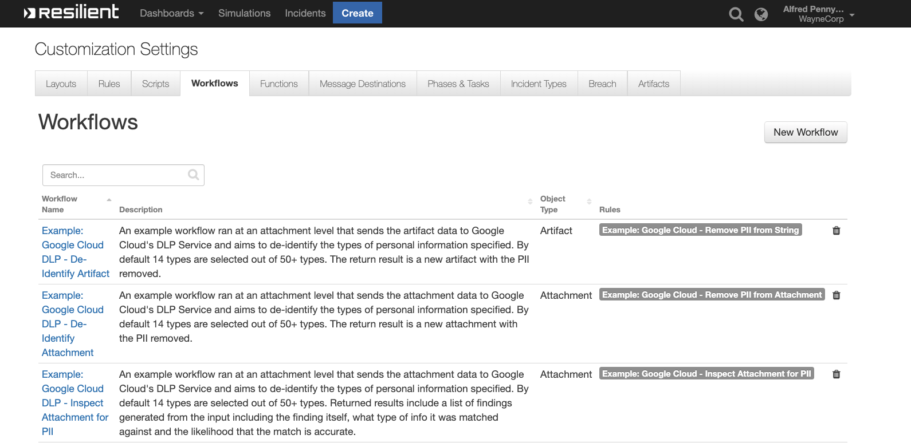

<!-- This file is generated by running resilient-circuits docgen -->
# fn-google-cloud-dlp Functions for IBM Resilient

- [fn-google-cloud-dlp Functions for IBM Resilient](#fn-google-cloud-dlp-functions-for-ibm-resilient)
  - [Overview](#overview)
  - [Key Features](#key-features)
  - [Requirements](#requirements)
  - [Authenticating to Google Cloud](#authenticating-to-google-cloud)
  - [It is recommended to create a new service or user account with the `DLP.User` permission. You will then be given a keyfile which you can set as the GOOGLE_APPLICATION_CREDENTIALS bash value which will be the absolute path to your Keyfile](#it-is-recommended-to-create-a-new-service-or-user-account-with-the-dlpuser-permission-you-will-then-be-given-a-keyfile-which-you-can-set-as-the-googleapplicationcredentials-bash-value-which-will-be-the-absolute-path-to-your-keyfile)
  - [Installation](#installation)
  - [Uninstall](#uninstall)
  - [Troubleshooting](#troubleshooting)
    - [Resilient Action Status](#resilient-action-status)
    - [Resilient Scripting Log](#resilient-scripting-log)
    - [Resilient Logs](#resilient-logs)
    - [Resilient-Circuits](#resilient-circuits)
  - [Support](#support)

---
## Overview
<!-- This description is taken from the in the "description" attribute setup.py file -->
**Resilient Circuits Components for 'fn_google_cloud_dlp**

 

<!-- This description is taken from the in the "long_description" attribute setup.py file -->
The Resilient Integration with Google Cloud DLP provides tools to integrate into your Incident Response Plan. The integration brings Automation and Orchestration capabilities for either identifying, redacting or de-identifying Personally identifiable information (PII) in a body of text.

---
## Key Features
<!-- List the Key Features of the Integration -->
* Inspect a text-based attachment for Personal Identifiable Information
* Search for and redact Personal Identifiable Information from an attachment or artifact

---
## Requirements
<!-- List any Requirements -->
* IBM Resilient >= `v31.0.4235`
* An Integrations Server running `resilient-circuits >= v31.0.0`
  * To setup an Integrations Server see: [ibm.biz/res-int-server-guide](ibm.biz/res-int-server-guide)

## Authenticating to Google Cloud 


Application Default Credentials:
Application Default Credentials are the prefereed way to authenticate when using a client library to interface with Google Cloud.

Services using ADC look for credentials within a GOOGLE_APPLICATION_CREDENTIALS environment variable. Unless you specifically want to have ADC use other credentials (for example, user credentials), set this environment variable to point to your service account key file.
It is recommended to create a new service or user account with the `DLP.User` permission. You will then be given a keyfile which you can set as the GOOGLE_APPLICATION_CREDENTIALS bash value which will be the absolute path to your Keyfile
---
## Installation
* Download the `fn_google_cloud_dlp.zip`
* Copy the `.zip` to your Integrations Server and SSH into it.
* **Unzip** the package:
  ```
  $ unzip fn_google_cloud_dlp-x.x.x.zip
  ```
* **Install** the package:
  ```
  $ pip install fn_google_cloud_dlp-x.x.x.tar.gz
  ```
* Import the **configurations** into your app.config file:
  ```
  $ resilient-circuits config -u
  ```
* Import the fn_google_cloud_dlp **customizations** into the Resilient Appliance:
  ```
  $ resilient-circuits customize -y -l fn-google-cloud-dlp
  ```
* Open the config file, scroll to the bottom and edit your fn_google_cloud_dlp **configurations**:
  ```
  $ nano ~/.resilient/app.config
  ```
  | Config | Required | Example | Description |
  | ------ | :------: | ------- | ----------- |
  | **gcp_project** | Yes | `<YOUR_GOOGLE_PROJECT_ID>` | *The Google Cloud Project that will be used with DLP* |
  | **gcp_dlp_masking_char** | Yes | `#` | *What character will be used to mask PII* |

* **Save** and **Close** the app.config file.
* [Optional]: Run **selftest** to test you the Integration is configured:
  ```
  $ resilient-circuits selftest -l fn-google-cloud-dlp
  ```
* **Run** resilient-circuits or restart the Service on Windows/Linux:
  ```
  $ resilient-circuits run
  ```

---
## Uninstall
* SSH into your Integrations Server
* **Uninstall** the package:
  ```
  $ pip uninstall fn-google-cloud-dlp
  ```
* Open the config file, scroll to the [fn_google_cloud_dlp] section and remove the section or prefix `#` to comment out the section.
* **Save** and **Close** the app.config file.

---
## Troubleshooting
There are several ways to verify the successful operation of a function. 

### Resilient Action Status
* When viewing an incident, use the Actions menu to view **Action Status**. 
* By default, pending and errors are displayed. 
* Modify the filter for actions to also show Completed actions.
* Clicking on an action displays additional information on the progress made or what error occurred.

### Resilient Scripting Log
* A separate log file is available to review scripting errors.
* This is useful when issues occur in the pre-processing or post-processing scripts.
* The default location for this log file is: `/var/log/resilient-scripting/resilient-scripting.log`.

### Resilient Logs
* By default, Resilient logs are retained at `/usr/share/co3/logs`.
* The `client.log` may contain additional information regarding the execution of functions.

### Resilient-Circuits
* The log is controlled in the `.resilient/app.config` file under the section [resilient] and the property `logdir`.
* The default file name is `app.log`.
* Each function will create progress information.
* Failures will show up as errors and may contain python trace statements.

---
## Support
| Name | Version | Author | Support URL |
| ---- | ------- | ------ | ----------- |
| fn_google_cloud_dlp | 1.0.0 | Ryan | http://ibm.biz/resilientcommunity |