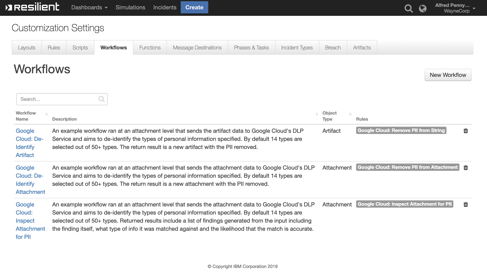

# IBM Resilient Integration with Google Cloud DLP

The Resilient Integration with Google Cloud DLP provides tools to integrate into your Incident Response Plan. The integration brings Automation and Orchestration capabilities for either identifying, redacting or de-identifying Personally identifiable information (PII) in a body of text.

**This package contains 2 Functions, 3 Workflows and 3 Rules that help you integrate with Google Cloud DLP**

 
## Table of Contents

- [app.config settings:](#appconfig-settings)
- [Authenticating to Google Cloud](#authenticating-to-google-cloud)
- [Functions:](#functions)
- [Workflows](#workflows)
- [Rules:](#rules)

# app.config settings:


```bash
[fn_google_cloud_dlp]
gcp_project=<YOUR-PROJECT-ID>
gcp_dlp_masking_char=#
```

## Authenticating to Google Cloud 


Application Default Credentials:
Application Default Credentials are the prefereed way to authenticate when using a client library to interface with Google Cloud.

Services using ADC look for credentials within a GOOGLE_APPLICATION_CREDENTIALS environment variable. Unless you specifically want to have ADC use other credentials (for example, user credentials), set this environment variable to point to your service account key file.
It is recommended to create a new service or user account with the `DLP.User` permission. You will then be given a keyfile which you can set as the GOOGLE_APPLICATION_CREDENTIALS bash value which will be the absolute path to your Keyfile

```bash
export GOOGLE_APPLICATION_CREDENTIALS="/Users/<user>/<path_to_keyfile>.json"
```

See here for more information on [authenticating with Google Cloud DLP ](https://cloud.google.com/dlp/docs/auth)
## Functions:

### Google Cloud DLP: De-Identify Content

### Function Inputs:

| Input Name | Type | Required | Example | Info |
| ------------- | :--: | :-------:| ------- | ------- |
| `incident_id` | `Number` | Yes | `2105`  | ------- |
| `task_id` | `Number` | No | `None` | ------- |
| `artifact_id` | `Number` | No | `None` | ------- |
| `attachment_id` | `Number` | No | `None` | ------- |
| `gcp_artifact_input` | `String` | No | `My name is ryan@gmail.com` | `A function filled used on artifact level workflows` |
| `gcp_dlp_info_types` | `Number` | No | `None` | `A list of info types we will be searching for in a body of text.` |

### Function Output:

```python
results = {
  'content': {
    'de_identified_text': 'One morning, when ####################### '
    'woke from troubled dreams, he found '
    'himself transformed in his bed into a '
    'horrible vermin. He lay on his armour-like '
    'back, and if he lifted his head a little '
    'he could see his brown belly, slightly '
    'domed and divided by arches into stiff '
    'sections.\n'
    'The bedding was hardly able to cover it '
    'and seemed ready to slide off any moment. '
    'His many legs, pitifully thin compared '
    'with the size of the rest of him, waved '
    'about helplessly as he looked. "What\'s '
    'happened to me? " he thought. It wasn\'t a '
    'dream.A list of our Expenses Credit Card '
    'Numbers :\n'
    '\n'
    '\n'
    '################\n'
    '\n'
    '\n'
    'His room, a proper human room although a '
    'little too small, lay peacefully between '
    'its four familiar walls. A collection of '
    'textile samples lay spread out on the '
    'table - ##### was a travelling salesman '
    'Email me at '
    '######################################### '
    '- and above it there hung a picture that '
    'he had recently cut out of an illustrated '
    'magazine and housed in a nice, gilded '
    'frame. ################ It showed a lady '
    'fitted out with a fur hat and fur boa who '
    'sat upright, raising a heavy fur muff that '
    'covered the whole of her lower arm towards '
    'the viewer. ###### then turned to look out '
    'the window at the dull weather.Comprised '
    'IBAN : ###################### Drops\n'
    '"Oh, ###", he thought, "what a strenuous '
    "career it is that I've chosen! Travelling "
    'day in and day out. Doing business like '
    'this takes much more effort than doing '
    'your own business at home, and on top of '
    "that there's the curse of travelling, "
    'worries about making train connections, '
    'bad and irregular food, contact with '
    'different people all the time so that you '
    'can never get to know anyone or become '
    'friendly with them. It can all go to Hell! '
    '" He felt a slight itch up on his belly; '
    '############### pushed himself slowly up '
    'on his back towards the headboard so that '
    'he could lift his head better; found where '
    'the itch was, and saw that it was covered '
    'with lots of little white spots which he '
    "didn't know what to make of; and when he "
    'tried to feel the place with one of his '
    'legs he drew it quickly back because as '
    'soon as he touched it he was overcome by a '
    'cold shudder. He slid back into his former '
    'position. "Getting up early all the time", '
    'he thought, "it makes you stupid. You\'ve '
    'got to get enough sleep. Other travelling '
    'salesmen live a life of luxury. For '
    'instance, whenever I go back to the guest '
    'house during the morning to copy out the '
    'contract, these gentlemen are always still '
    'sitting there eating their breakfasts. '
    'Email me at '
    '################################################# '
    "I ought to just try that with my boss; I'd "
    'get kicked out on the spot. But who knows, '
    'maybe that would be the best thing for me. '
    "If I didn't have my parents to think about "
    "I'd have given in my notice a long time "
    "ago, I'd have gone up to the boss and told "
    'him just what I\n'
  },
  'inputs': {
    'attachment_id': 16,
    'gcp_dlp_info_types': [{
        'id': 1811,
        'name': 'CREDIT_CARD_NUMBER'
      },
      {
        'id': 1812,
        'name': 'EMAIL_ADDRESS'
      },
      {
        'id': 1815,
        'name': 'FIRST_NAME'
      },
      {
        'id': 1821,
        'name': 'IBAN_CODE'
      },
      {
        'id': 1824,
        'name': 'IP_ADDRESS'
      },
      {
        'id': 1829,
        'name': 'LAST_NAME'
      },
      {
        'id': 1831,
        'name': 'MAC_ADDRESS'
      },
      {
        'id': 1837,
        'name': 'PHONE_NUMBER'
      },
      {
        'id': 1864,
        'name': 'DATE'
      },
      {
        'id': 1865,
        'name': 'DATE_OF_BIRTH'
      },
      {
        'id': 1867,
        'name': 'PERSON_NAME'
      },
      {
        'id': 1868,
        'name': 'AGE'
      },
      {
        'id': 1879,
        'name': 'DOMAIN_NAME'
      },
      {
        'id': 1890,
        'name': 'URL'
      }
    ],
    'incident_id': 2096,
    'task_id': 2251250
  },
  'metrics': {
    'execution_time_ms': 1843,
    'host': 'RG-MBP-18.local',
    'package': 'fn-google-cloud-dlp',
    'package_version': '1.0.0',
    'timestamp': '2019-03-15 15:22:21',
    'version': '1.0'
  },
  'raw': '{"de_identified_text": "One morning, when ####################### '
  'woke from troubled dreams, he found himself transformed in his bed '
  'into a horrible vermin. He lay on his armour-like back, and if he '
  'lifted his head a little he could see his brown belly, slightly domed '
  'and divided by arches into stiff sections.\\nThe bedding was hardly '
  'able to cover it and seemed ready to slide off any moment. His many '
  'legs, pitifully thin compared with the size of the rest of him, waved '
  'about helplessly as he looked. \\"What\'s happened to me? \\" he '
  "thought. It wasn't a dream.A list of our Expenses Credit Card Numbers "
  ':\\n\\n\\n################\\n\\n\\nHis room, a proper human room '
  'although a little too small, lay peacefully between its four familiar '
  'walls. A collection of textile samples lay spread out on the table - '
  '##### was a travelling salesman Email me at '
  '######################################### - and above it there hung a '
  'picture that he had recently cut out of an illustrated magazine and '
  'housed in a nice, gilded frame. ################ It showed a lady '
  'fitted out with a fur hat and fur boa who sat upright, raising a '
  'heavy fur muff that covered the whole of her lower arm towards the '
  'viewer. ###### then turned to look out the window at the dull '
  'weather.Comprised IBAN : ###################### Drops\\n\\"Oh, '
  '###\\", he thought, \\"what a strenuous career it is that I\'ve '
  'chosen! Travelling day in and day out. Doing business like this takes '
  'much more effort than doing your own business at home, and on top of '
  "that there's the curse of travelling, worries about making train "
  'connections, bad and irregular food, contact with different people '
  'all the time so that you can never get to know anyone or become '
  'friendly with them. It can all go to Hell! \\" He felt a slight itch '
  'up on his belly; ############### pushed himself slowly up on his back '
  'towards the headboard so that he could lift his head better; found '
  'where the itch was, and saw that it was covered with lots of little '
  "white spots which he didn't know what to make of; and when he tried "
  'to feel the place with one of his legs he drew it quickly back '
  'because as soon as he touched it he was overcome by a cold shudder. '
  'He slid back into his former position. \\"Getting up early all the '
  'time\\", he thought, \\"it makes you stupid. You\'ve got to get '
  'enough sleep. Other travelling salesmen live a life of luxury. For '
  'instance, whenever I go back to the guest house during the morning to '
  'copy out the contract, these gentlemen are always still sitting there '
  'eating their breakfasts. Email me at '
  '################################################# I ought to just try '
  "that with my boss; I'd get kicked out on the spot. But who knows, "
  "maybe that would be the best thing for me. If I didn't have my "
  "parents to think about I'd have given in my notice a long time ago, "
  'I\'d have gone up to the boss and told him just what I\\n"}',
  'reason': None,
  'success': True,
  'version': '1.0'
}

```

### Google Cloud DLP: Inspect Content

A Function which takes either an Attachment or an Artifact as an input in addition to a number of defined information types to search the input for.


### Function Inputs:

| Input Name | Type | Required | Example | Info |
| ------------- | :--: | :-------:| ------- | ------- |
| `incident_id` | `Number` | Yes | `2105`  | ------- |
| `task_id` | `Number` | No | `None` | ------- |
| `artifact_id` | `Number` | No | `None` | ------- |
| `attachment_id` | `Number` | No | `None` | ------- |
| `gcp_artifact_input` | `String` | No | `My name is ryan@gmail.com` | `A function filled used on artifact level workflows` |
| `gcp_dlp_info_types` | `Number` | No | `None` | `A list of info types we will be searching for in a body of text.` |

### Function Output:

```python
results = {
    'content': {
        'attachment_name': 'Attachment-Containing-PII.txt',
        'findings': [{
                'info_type': 'PERSON_NAME',
                'likelihood': 4,
                'quote': 'Gregor Samsa'
            },
            {
                'info_type': 'FIRST_NAME',
                'likelihood': 4,
                'quote': 'Gregor'
            },
            {
                'info_type': 'LAST_NAME',
                'likelihood': 4,
                'quote': 'Samsa'
            },
            {
                'info_type': 'CREDIT_CARD_NUMBER',
                'likelihood': 4,
                'quote': '5105105105105100'
            },
            {
                'info_type': 'PERSON_NAME',
                'likelihood': 3,
                'quote': 'Samsa'
            },
            {
                'info_type': 'LAST_NAME',
                'likelihood': 3,
                'quote': 'Samsa'
            },
            {
                'info_type': 'EMAIL_ADDRESS',
                'likelihood': 4,
                'quote': 'ryan@resilientlab.co.uk'
            },
            {
                'info_type': 'DOMAIN_NAME',
                'likelihood': 4,
                'quote': 'resilientlab.co.uk'
            },
            {
                'info_type': 'CREDIT_CARD_NUMBER',
                'likelihood': 3,
                'quote': '4111111111111111'
            },
            {
                'info_type': 'PERSON_NAME',
                'likelihood': 3,
                'quote': 'Gregor'
            },
            {
                'info_type': 'FIRST_NAME',
                'likelihood': 3,
                'quote': 'Gregor'
            },
            {
                'info_type': 'IBAN_CODE',
                'likelihood': 5,
                'quote': 'IE29AIBK93115212345678'
            },
            {
                'info_type': 'PERSON_NAME',
                'likelihood': 3,
                'quote': 'God'
            },
            {
                'info_type': 'LAST_NAME',
                'likelihood': 3,
                'quote': 'God'
            },
            {
                'info_type': 'CREDIT_CARD_NUMBER',
                'likelihood': 3,
                'quote': '371449635398431'
            },
            {
                'info_type': 'EMAIL_ADDRESS',
                'likelihood': 4,
                'quote': 'ryan@resilientsystems.co.uk'
            },
            {
                'info_type': 'DOMAIN_NAME',
                'likelihood': 4,
                'quote': 'resilientsystems.co.uk'
            }
        ]
    },
    'inputs': {
        'attachment_id': 16,
        'gcp_dlp_info_types': [{
                'id': 1811,
                'name': 'CREDIT_CARD_NUMBER'
            },
            {
                'id': 1812,
                'name': 'EMAIL_ADDRESS'
            },
            {
                'id': 1815,
                'name': 'FIRST_NAME'
            },
            {
                'id': 1821,
                'name': 'IBAN_CODE'
            },
            {
                'id': 1824,
                'name': 'IP_ADDRESS'
            },
            {
                'id': 1829,
                'name': 'LAST_NAME'
            },
            {
                'id': 1831,
                'name': 'MAC_ADDRESS'
            },
            {
                'id': 1837,
                'name': 'PHONE_NUMBER'
            },
            {
                'id': 1864,
                'name': 'DATE'
            },
            {
                'id': 1865,
                'name': 'DATE_OF_BIRTH'
            },
            {
                'id': 1867,
                'name': 'PERSON_NAME'
            },
            {
                'id': 1868,
                'name': 'AGE'
            },
            {
                'id': 1879,
                'name': 'DOMAIN_NAME'
            },
            {
                'id': 1890,
                'name': 'URL'
            }
        ],
        'incident_id': 2096,
        'task_id': 2251250
    },
    'metrics': {
        'execution_time_ms': 1141,
        'host': 'RG-MBP-18.local',
        'package': 'fn-google-cloud-dlp',
        'package_version': '1.0.0',
        'timestamp': '2019-03-15 15:36:09',
        'version': '1.0'
    },
    'raw': '{"findings": [{"quote": "Gregor Samsa", "info_type": "PERSON_NAME", '
    '"likelihood": 4}, {"quote": "Gregor", "info_type": "FIRST_NAME", '
    '"likelihood": 4}, {"quote": "Samsa", "info_type": "LAST_NAME", '
    '"likelihood": 4}, {"quote": "5105105105105100", "info_type": '
    '"CREDIT_CARD_NUMBER", "likelihood": 4}, {"quote": "Samsa", '
    '"info_type": "PERSON_NAME", "likelihood": 3}, {"quote": "Samsa", '
    '"info_type": "LAST_NAME", "likelihood": 3}, {"quote": '
    '"ryan@resilientlab.co.uk", "info_type": "EMAIL_ADDRESS", '
    '"likelihood": 4}, {"quote": "resilientlab.co.uk", "info_type": '
    '"DOMAIN_NAME", "likelihood": 4}, {"quote": "4111111111111111", '
    '"info_type": "CREDIT_CARD_NUMBER", "likelihood": 3}, {"quote": '
    '"Gregor", "info_type": "PERSON_NAME", "likelihood": 3}, {"quote": '
    '"Gregor", "info_type": "FIRST_NAME", "likelihood": 3}, {"quote": '
    '"IE29AIBK93115212345678", "info_type": "IBAN_CODE", "likelihood": 5}, '
    '{"quote": "God", "info_type": "PERSON_NAME", "likelihood": 3}, '
    '{"quote": "God", "info_type": "LAST_NAME", "likelihood": 3}, '
    '{"quote": "371449635398431", "info_type": "CREDIT_CARD_NUMBER", '
    '"likelihood": 3}, {"quote": "ryan@resilientsystems.co.uk", '
    '"info_type": "EMAIL_ADDRESS", "likelihood": 4}, {"quote": '
    '"resilientsystems.co.uk", "info_type": "DOMAIN_NAME", "likelihood": '
    '4}], "attachment_name": "Attachment-Containing-PII.txt"}',
    'reason': None,
    'success': True,
    'version': '1.0'
}
```

## Workflows

### **Google Cloud: De-Identify Attachment**

An example workflow ran at an attachment level that sends the attachment data to Google Cloud's DLP Service and aims to de-identify the types of  personal information specified. By default 14 types are selected out of 50+ types. The return result is a new attachment with the PII removed.

### Pre-Process Script:

```python

inputs.incident_id = incident.id 

# If this workflow has the task_id available, gather it incase we need it.
if task:
  inputs.task_id = task.id
# If this workflow has the attachment_id available, gather it incase we need it.
if attachment:
  inputs.attachment_id = attachment.id

# If this workflow has the artifact_id available, gather it incase we need it.
try: 
  if artifact:
    inputs.artifact_id = artifact.id
except:
  pass
```

There is no post processing script currently. The Result is a new Attachment with the PII removed as specified. 


### **Google Cloud: De-Identify Artifact**

An example workflow ran at an attachment level that sends the artifact data to Google Cloud's DLP Service and aims to de-identify the types of  personal information specified. By default 14 types are selected out of 50+ types. The return result is a new artifact with the PII removed.

### Pre-Process Script:

```python

inputs.incident_id = incident.id 

# If this workflow has the task_id available, gather it incase we need it.
if task:
  inputs.task_id = task.id
# If this workflow has the attachment_id available, gather it incase we need it.
if attachment:
  inputs.attachment_id = attachment.id

# If this workflow has the artifact_id available, gather it incase we need it.
try: 
  if artifact:
    inputs.artifact_id = artifact.id
except:
  pass
```

### Post-Processing Script:
```python

if results.success:
  incident.addArtifact('String', results.content["de_identified_text"], "De-Identified using Google Cloud DLP")
```

### **Google Cloud: Inspect Attachment for PII**

An example workflow ran at an attachment level that sends the attachment data to Google Cloud's DLP Service and aims to de-identify the types of  personal information specified. By default 14 types are selected out of 50+ types. Returned results include a list of findings generated from the input including the finding itself, what type of info it was matched against and the likelihood that the match is accurate.

### Pre-Process Script:

```python

inputs.incident_id = incident.id 

# If this workflow has the task_id available, gather it incase we need it.
if task:
  inputs.task_id = task.id
# If this workflow has the attachment_id available, gather it incase we need it.
if attachment:
  inputs.attachment_id = attachment.id

# If this workflow has the artifact_id available, gather it incase we need it.
try: 
  if artifact:
    inputs.artifact_id = artifact.id
except:
  pass
```

### Post-Processing Script:
```python

if results.success:
  incident.addArtifact('String', results.content["de_identified_text"], "De-Identified using Google Cloud DLP")
```
## Rules:
| Rule Name | Object Type | Workflow Triggered | Conditions |
| --------- | :---------: | ------------------ | ---------- |
| Google Cloud: Inspect Attachment for PII | `Attachment` | `gcp_dlp_inspect_attachment` | None |
| Google Cloud: Remove PII from String | `Artifact` | `gcp_dlp_deidentify_artifact` | `type==String` |
| Google Cloud: Remove PII from Attachment | `Attachment` | `gcp_dlp_deidentify_attachment` | None |

