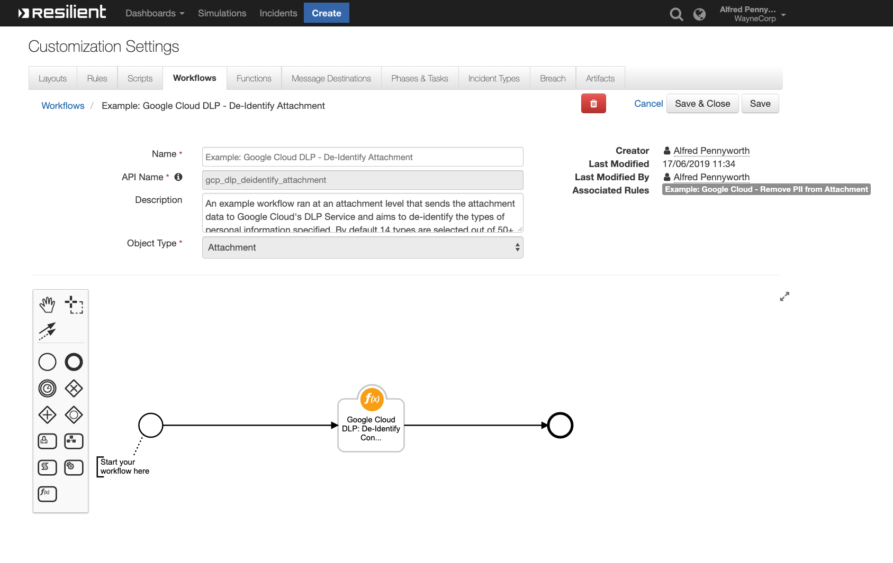
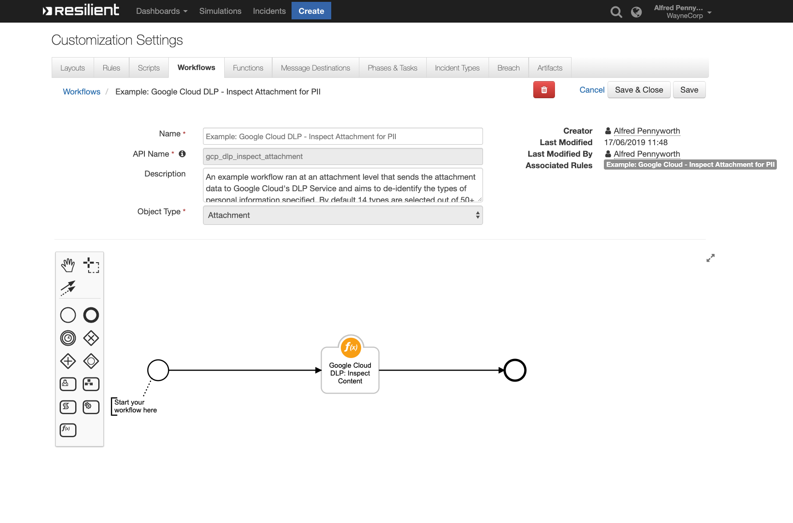

<!-- This file is generated by running resilient-circuits docgen -->
# **User Guide:** fn_google_cloud_dlp_v1.0.0

## Table of Contents
- [**User Guide:** fn_google_cloud_dlp_v1.0.0](#user-guide-fngoogleclouddlpv100)
  - [Table of Contents](#table-of-contents)
  - [App Config Settings:](#app-config-settings)
  - [Function - Google Cloud DLP: De-Identify Content](#function---google-cloud-dlp-de-identify-content)
  - [Function - Google Cloud DLP: Inspect Content](#function---google-cloud-dlp-inspect-content)
  - [Rules](#rules)

---
## App Config Settings:
```
[fn_google_cloud_dlp]
gcp_project=<YOUR_GOOGLE_PROJECT_ID>
gcp_dlp_masking_char=#

```
---
## Function - Google Cloud DLP: De-Identify Content


 

<details><summary>Inputs:</summary>
<p>

| Name | Type | Required | Example | Description |
| ---- | :--: | :------: | ------- | ----------- |
| `artifact_id` | `number` | No | `-` | - |
| `attachment_id` | `number` | No | `-` | - |
| `incident_id` | `number` | No | `Resilient Incident ID` | IncidentID |
| `task_id` | `number` | No | `-` | - |
| `gcp_artifact_input` | `text` | No | `-` | A optional input to be used when the function is ran from an artifact and is used to capture the artifacts value. |
| `gcp_dlp_info_types` | `multiselect` | No | `-` | Which types of PII do you want to de-identify. |

</p>
</details>

<details><summary>Outputs:</summary>
<p>

```python
results = {
  'content': {
    'de_identified_text': 'One morning, when ####################### '
    'Email me at '
    '################################################# '
  },
  'inputs': {
    'attachment_id': 16,
    'gcp_dlp_info_types': [{
        'id': 1811,
        'name': 'CREDIT_CARD_NUMBER'
      },
      {
        'id': 1812,
        'name': 'EMAIL_ADDRESS'
      },
    ],
    'incident_id': 2096,
    'task_id': 2251250
  },
  'metrics': {
    'execution_time_ms': 1843,
    'host': 'RG-MBP-18.local',
    'package': 'fn-google-cloud-dlp',
    'package_version': '1.0.0',
    'timestamp': '2019-03-15 15:22:21',
    'version': '1.0'
  },
  'raw': '<raw output of results>',
  'reason': None,
  'success': True,
  'version': '1.0'
}

```

</p>
</details>

<details><summary>Example Pre-Process Script:</summary>
<p>

```python
inputs.incident_id = incident.id
inputs.gcp_artifact_input = artifact.value
```

</p>
</details>

<details><summary>Example Post-Process Script:</summary>
<p>

```python
if results.success:
  incident.addArtifact('String', results.content["de_identified_text"], "De-Identified using Google Cloud DLP")
```

</p>
</details>

---
## Function - Google Cloud DLP: Inspect Content


 

<details><summary>Inputs:</summary>
<p>

| Name | Type | Required | Example | Description |
| ---- | :--: | :------: | ------- | ----------- |
| `artifact_id` | `number` | No | `-` | - |
| `attachment_id` | `number` | No | `-` | - |
| `incident_id` | `number` | No | `Resilient Incident ID` | IncidentID |
| `task_id` | `number` | No | `-` | - |
| `gcp_artifact_input` | `text` | No | `-` | A optional input to be used when the function is ran from an artifact and is used to capture the artifacts value. |
| `gcp_dlp_info_types` | `multiselect` | No | `-` | Which types of PII do you want to de-identify. |

</p>
</details>

<details><summary>Outputs:</summary>
<p>

```python
results = {
    'content': {
        'attachment_name': 'Attachment-Containing-PII.txt',
        'findings': [
            {
                'info_type': 'CREDIT_CARD_NUMBER',
                'likelihood': 4,
                'quote': '5105105105105100'
            },
            {
                'info_type': 'EMAIL_ADDRESS',
                'likelihood': 4,
                'quote': 'ryan@resilientlab.co.uk'
            }
        ]
    },
    'inputs': {
        'attachment_id': 16,
        'gcp_dlp_info_types': [{
                'id': 1811,
                'name': 'CREDIT_CARD_NUMBER'
            },
            {
                'id': 1812,
                'name': 'EMAIL_ADDRESS'
            },
            {
                'id': 1890,
                'name': 'URL'
            }
        ],
        'incident_id': 2096,
        'task_id': 2251250
    },
    'metrics': {
        'execution_time_ms': 1141,
        'host': 'RG-MBP-18.local',
        'package': 'fn-google-cloud-dlp',
        'package_version': '1.0.0',
        'timestamp': '2019-03-15 15:36:09',
        'version': '1.0'
    },
    'raw': '<raw output of results>',
    'reason': None,
    'success': True,
    'version': '1.0'
}
```

</p>
</details>

<details><summary>Example Pre-Process Script:</summary>
<p>

```python
inputs.incident_id = incident.id 

# If this workflow has the task_id available, gather it incase we need it.
if task:
  inputs.task_id = task.id
# If this workflow has the attachment_id available, gather it incase we need it.
if attachment:
  inputs.attachment_id = attachment.id

# If this workflow has the artifact_id available, gather it incase we need it.
try: 
  if artifact:
    inputs.artifact_id = artifact.id
except:
  pass
```

</p>
</details>

<details><summary>Example Post-Process Script:</summary>
<p>

```python
if results.success:
  if results.content['findings'] != None:
    note_text = u"""Findings were found from attachment <b>{}</b><br><br> Findings: <br>""".format(results.content["attachment_name"])
    for finding in results.content['findings']:
      note_text += u"""Text Quote: <b>{}</b>
                      <br> Information Type Suspected: <b>{}</b>
                      <br> Likelihood / Confidence: <b>{}</b><br><br>""".format(finding["quote"],finding["info_type"],finding["likelihood"])
                      
    incident.addNote(helper.createRichText(note_text))
```

</p>
</details>

---


## Rules
| Rule Name | Object | Workflow Triggered |
| --------- | ------ | ------------------ |
| **Google Cloud: Inspect Attachment for PII** | attachment | `gcp_dlp_inspect_attachment` |
| **Google Cloud: Remove PII from Attachment** | attachment | `gcp_dlp_deidentify_attachment` |
| **Google Cloud: Remove PII from String** | artifact | `gcp_dlp_deidentify_artifact` |
