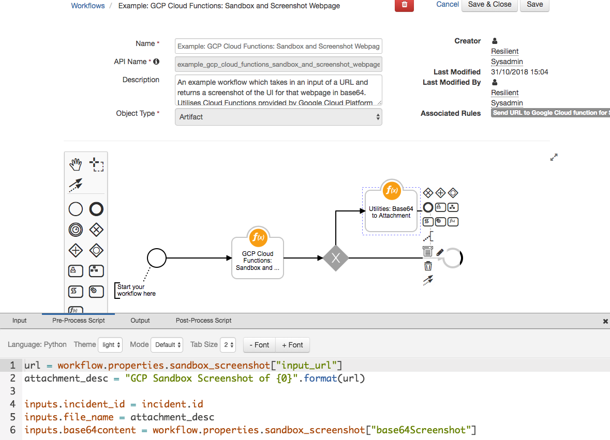

# Resilient Integration with Google Cloud Functions
**This package contains functions which invoke or interact with Google Cloud Functions.**  
 
 

Do you have a use-case or a need to get data / perform an operation from a service without exposing your IP? 
Why not build out a cloud function which does that work for you under a different network configuration and target that instead.

The cloud function used by this example workflow leverages a headless chrome instance to consume a URL and screenshot the result. For information on how to set this up see [this post](https://cloud.google.com/blog/products/gcp/introducing-headless-chrome-support-in-cloud-functions-and-app-engine)

>**Note:** This Package depends on the fn_utilities package. fn_utilities must be installed for the function to work as expected.
In this example Workflow the output of the Google Cloud Function is used as an input into a Utility function called Base64ToAttachment.
This function takes the base64 result from the previous function and saves it in the Resilient Platform as an attachment.
## app.config settings:
```python
[fn_google_cloud_functions]
gcp_region = <GCP_REGION_ID>
gcp_project_id = <GCP_PROJECT_ID>
gcp_function_name = <NAME_OF_CLOUD_FUNCTION>
# Optional Config values
gcp_http_proxy = None
gcp_https_proxy = None

```

## Function Inputs: Google Cloud Function:

| Function Name | Type | Required | Example |
| ------------- | :--: | :-------:| ------- |
| `gcp_url` | `String` | Yes | `'https://google.com'` |  


### Function Inputs: Base64 to Attachment:
>The inputs used by this function are acquired using the outputs of the Google Cloud Function


| Function Name | Type | Required | Example |
| ------------- | :--: | :-------:| ------- |
| `base64content` | `String` | Yes | `'cmFuZG9t......'` |  
| `incident_id` | `Number` | Yes | `2011` |  
| `file_name` | `String` | Yes | `'GCP Screenshot of ibm.com.png'` | 


## Pre-Processing Scripts 
The workflow `Example: GCP Cloud Functions: Sandbox and Screenshot Webpage` includes 2 functions.

### Function: GCP Cloud Functions: Sandbox and Screenshot Webpage
```python
inputs.gcp_url = artifact.value
```

### Function: Utilities: Base64 to Attachment
```python
url = workflow.properties.sandbox_screenshot["input_url"]
attachment_desc = "GCP Sandbox Screenshot of {0}".format(url)

inputs.incident_id = incident.id 
inputs.file_name = attachment_desc
inputs.base64content = workflow.properties.sandbox_screenshot["base64Screenshot"]
```


## Google Cloud Function Output:
The function returns the results as a Python Dictionary. Here is an example ouput:
```
results : {
  success: True  
  inputs: {
   "input_url": google.com,
   "input_full_url": https://google.com
   },
  base64Screenshot: cmFuZG9t......
}
```

## Rules
| Rule Name | Object Type | Workflow Triggered |
| --------- | :---------: | ------------------ |
| Send URL to Google Cloud function for Sandboxing | `Artifact` | `Example: GCP Cloud Functions: Sandbox and Screenshot Webpage` |

## Dependancies

Other function packages are needed to use this package. Below is a table detailing what packages are needed to make the integration work and where to get them.

| Name  | Min Version  | Function Used  | Link  |
|---|---|---|---|
| fn_utilities  | 1.0.3  | utilities_base64_to_attachment.py  | [AppX Link](https://exchange.xforce.ibmcloud.com/hub/extension/2b6699ac8a3976b67dfbddee26dbe3a5)  |
