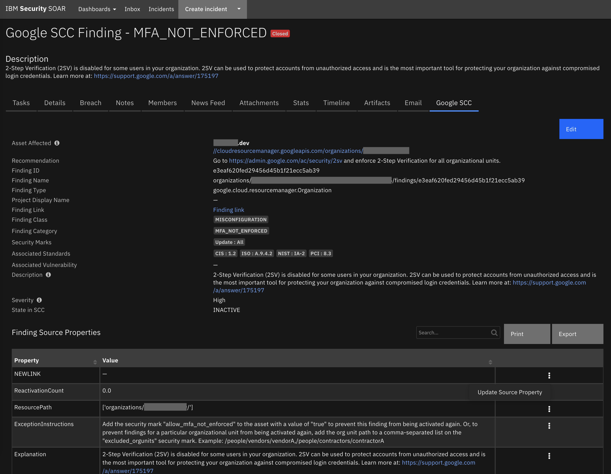
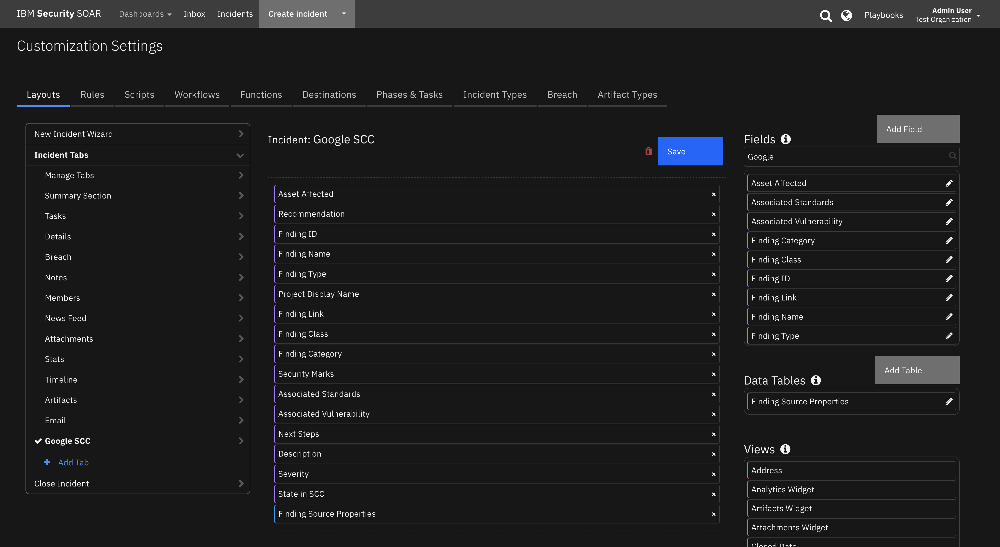
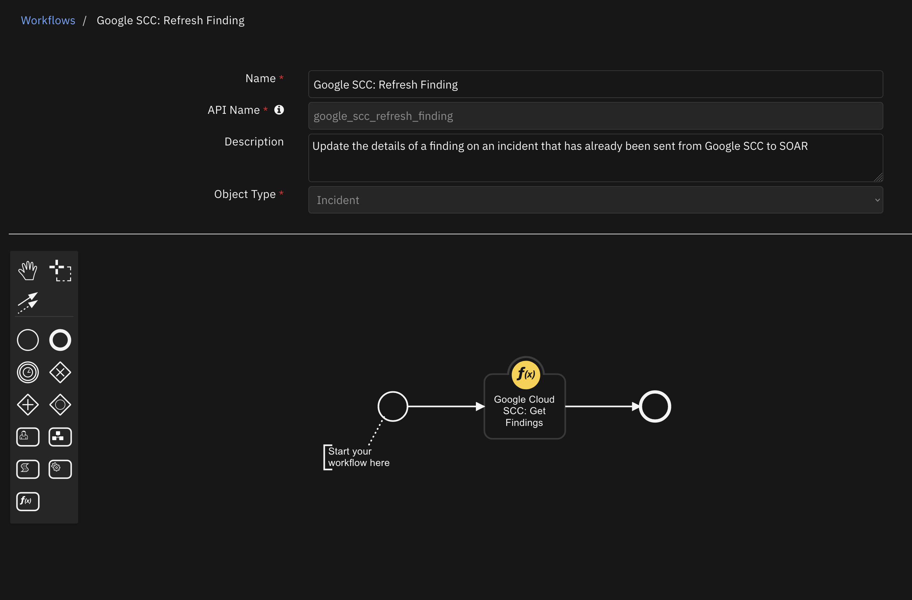
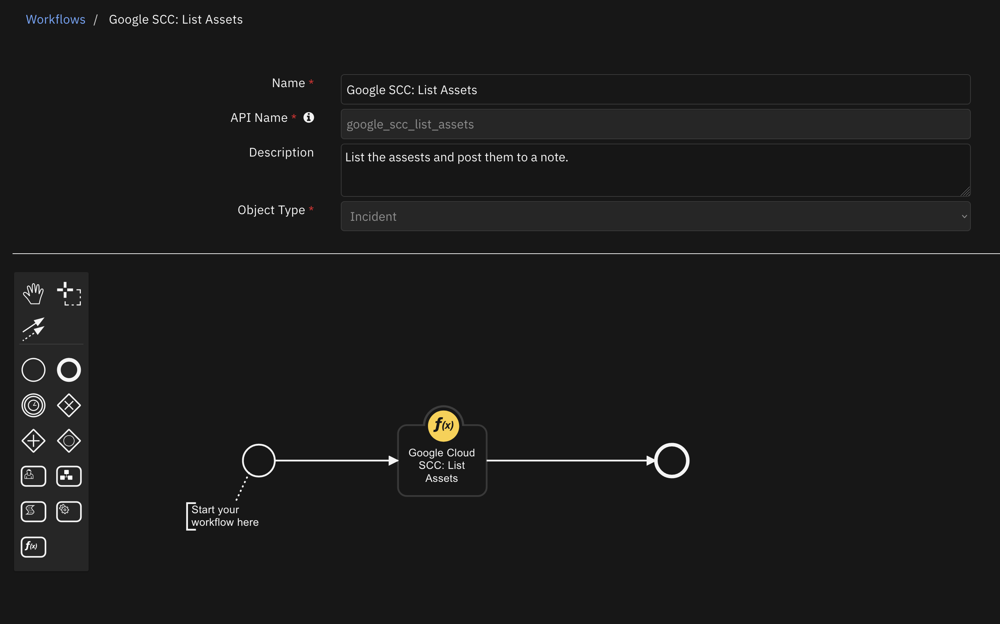
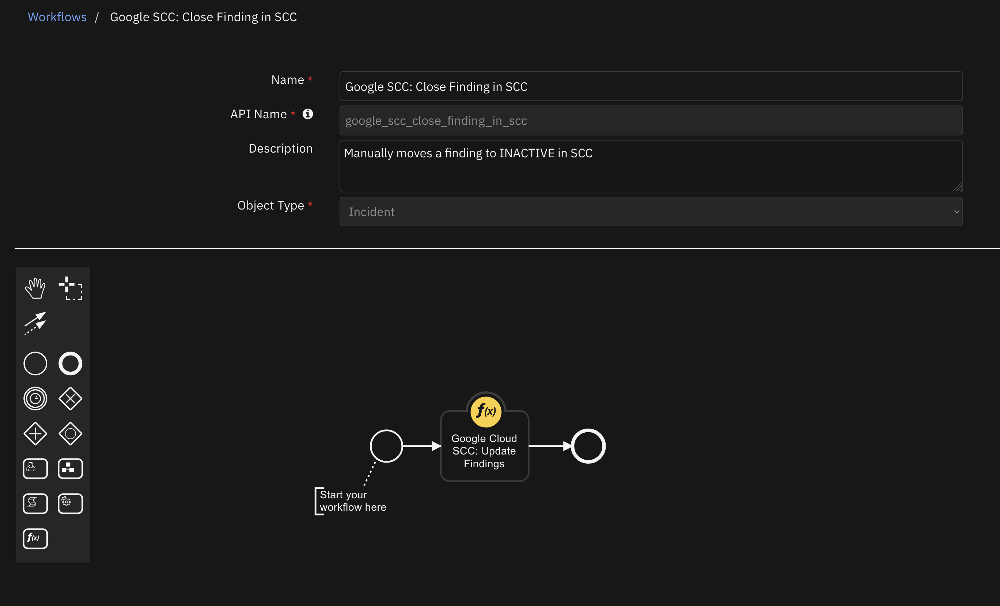
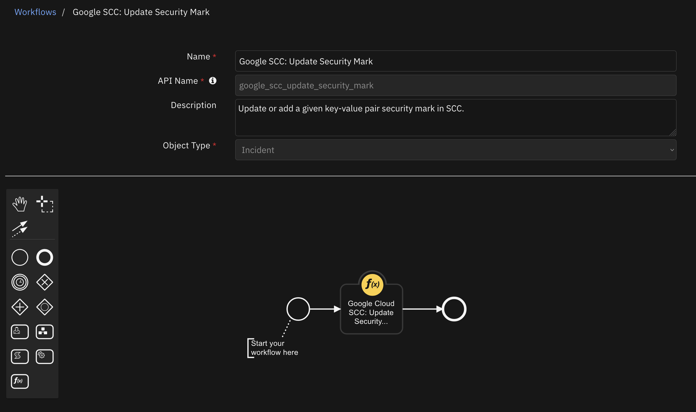
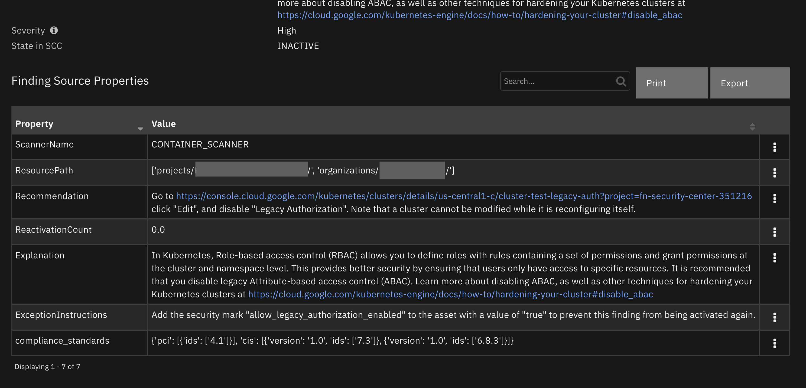

<!--
  This README.md is generated by running:
  "resilient-sdk docgen -p fn_google_cloud_scc"
-->

# Google Cloud Security Command Center

## Table of Contents <!-- omit in toc -->
- [Release Notes](#release-notes)
- [Overview](#overview)
  - [Key Features](#key-features)
- [Requirements](#requirements)
  - [SOAR platform](#soar-platform)
  - [Cloud Pak for Security](#cloud-pak-for-security)
  - [Proxy Server](#proxy-server)
  - [Python Environment](#python-environment)
  - [Endpoint Developed With](#endpoint-developed-with)
  - [Known Issues](#known-issues)
  - [Prerequisites](#prerequisites)
- [Installation](#installation)
  - [Install](#install)
  - [App Configuration](#app-configuration)
  - [Custom Layouts](#custom-layouts)
- [Templates for SOAR Cases](#templates-for-soar-cases)
- [Filters and Field Masks](#filters-and-field-masks)
  - [Findings and Assets Filters](#findings-and-assets-filters)
  - [Assets Field Masks](#assets-field-masks)
- [Rules](#rules)
- [Function - Google Cloud SCC: Get Findings](#function---google-cloud-scc-get-findings)
- [Function - Google Cloud SCC: List Assets](#function---google-cloud-scc-list-assets)
- [Function - Google Cloud SCC: Update Findings](#function---google-cloud-scc-update-findings)
- [Function - Google Cloud SCC: Update Security Mark](#function---google-cloud-scc-update-security-mark)
- [Data Table - Finding Source Properties](#data-table---finding-source-properties)
    - [API Name:](#api-name)
    - [Columns:](#columns)
- [Custom Fields](#custom-fields)
- [Troubleshooting \& Support](#troubleshooting--support)
  - [For Support](#for-support)
---

## Release Notes
<!--
  Specify all changes in this release. Do not remove the release 
  notes of a previous release
-->
| Version | Date | Notes |
| ------- | ---- | ----- |
| 1.0.2 | 08/2023 | Only Python 3.9 supported |
| 1.0.1 | 02/2023 | Proxy bug fix |
| 1.0.0 | 08/2022 | Initial Release |

---

## Overview
<!--
  Provide a high-level description of the function itself and its remote software or application.
  The text below is parsed from the "description" and "long_description" attributes in the setup.py file
-->
**IBM SOAR app with bidirectional synchronization and functions for Google Cloud SCC**

 

Bidirectional synchronization of Google Cloud Security Command Center findings. Additional functions are provided for manual synchronization, manually updating findings, and listing cloud assets monitored in Google SCC.

### Key Features
<!--
  List the Key Features of the Integration
-->
* Automatic case escalation from Security Command Center findings to cases in SOAR
* Key actions provided in SOAR to remediate the findings in Google Cloud
* Manual updates to findings directly from the SOAR interface
* List cloud assets monitored in the Security Command Center

---

## Requirements
<!--
  List any Requirements 
--> 
This app supports the IBM Security QRadar SOAR Platform and the IBM Security QRadar SOAR for IBM Cloud Pak for Security.

### SOAR platform
The SOAR platform supports two app deployment mechanisms, App Host and integration server.

If deploying to a SOAR platform with an App Host, the requirements are:
* SOAR platform >= `43.1.0`.
* The app is in a container-based format (available from the AppExchange as a `zip` file).

If deploying to a SOAR platform with an integration server, the requirements are:
* SOAR platform >= `43.1.0`.
* The app is in the older integration format (available from the AppExchange as a `zip` file which contains a `tar.gz` file).
* Integration server is running `resilient-circuits >= 45.0`.
* If using an API key account, make sure the account provides the following minimum permissions: 
  | Name | Permissions |
  | ---- | ----------- |
  | Org Data | Read |
  | Function | Read |
  | Incident Notes | Edit |
  | Incident Status | Edit |
  | Incident Fields | Edit |

The following SOAR platform guides provide additional information: 
* _App Host Deployment Guide_: provides installation, configuration, and troubleshooting information, including proxy server settings. 
* _Integration Server Guide_: provides installation, configuration, and troubleshooting information, including proxy server settings.
* _System Administrator Guide_: provides the procedure to install, configure and deploy apps. 

The above guides are available on the IBM Documentation website at [ibm.biz/soar-docs](https://ibm.biz/soar-docs). On this web page, select your SOAR platform version. On the follow-on page, you can find the _App Host Deployment Guide_ or _Integration Server Guide_ by expanding **Apps** in the Table of Contents pane. The System Administrator Guide is available by expanding **System Administrator**.

### Cloud Pak for Security
If you are deploying to IBM Cloud Pak for Security, the requirements are:
* IBM Cloud Pak for Security >= 1.9.
* Cloud Pak is configured with an App Host.
* The app is in a container-based format (available from the AppExchange as a `zip` file).

The following Cloud Pak guides provide additional information: 
* _App Host Deployment Guide_: provides installation, configuration, and troubleshooting information, including proxy server settings. From the Table of Contents, select Case Management and Orchestration & Automation > **Orchestration and Automation Apps**.
* _System Administrator Guide_: provides information to install, configure, and deploy apps. From the IBM Cloud Pak for Security IBM Documentation table of contents, select Case Management and Orchestration & Automation > **System administrator**.

These guides are available on the IBM Documentation website at [ibm.biz/cp4s-docs](https://ibm.biz/cp4s-docs). From this web page, select your IBM Cloud Pak for Security version. From the version-specific IBM Documentation page, select Case Management and Orchestration & Automation.

### Proxy Server
The app supports a proxy server.

### Python Environment
Python 3.9 is the only officially supported version of Python for this app.
Additional package dependencies may exist for each of these packages:
* resilient-circuits >= 45.0
* google-cloud-securitycenter ~= 1.12

### Endpoint Developed With

This app has been implemented using:
| Product Name | API Version |
| ------------ | --------------- |
| Google Cloud Security Command Center | v1 |

### Known Issues
NOTE: As of publishing version 1.0.0 of this app, there is a known issue in the Google Cloud Security Command Center user interface where if a finding's state is manually changed from ACTIVE to INACTIVE, it will not trigger an update time event. These update times are relied on heavily in the app to provided bi-directional synchronization. If you intend to manually update the state in SCC, you will have to subsequently manually refresh the finding details into the case in SOAR to correctly reflect the updated state. There are no other known issues.

### Prerequisites
<!--
List any prerequisites that are needed to use with this endpoint solution. Remove any section that is unnecessary.
-->
* A Google Cloud service account with the appropriate IAM permission and its associated private credentials file is required to run this app. [Follow details from Google here](https://cloud.google.com/security-command-center/docs/how-to-programmatic-access).
* The account private key generated in the link above must be accessible from the App Host or integration server's file system.


---

## Installation

### Install
* To install or uninstall an App or Integration on the _SOAR platform_, see the documentation at [ibm.biz/soar-docs](https://ibm.biz/soar-docs).
* To install or uninstall an App on _IBM Cloud Pak for Security_, see the documentation at [ibm.biz/cp4s-docs](https://ibm.biz/cp4s-docs) and follow the instructions above to navigate to Orchestration and Automation.

### App Configuration
The following table provides the settings you need to configure the app. These settings are made in the app.config file. See the documentation discussed in the Requirements section for the procedure.

| Config | Required | Example | Description |
| ------ | :------: | ------- | ----------- |
| **google_application_credentials_path** | Yes | `/var/rescircuits/google-service-acct.json` | *Path to the credentials file created following the directions [here](https://cloud.google.com/security-command-center/docs/how-to-programmatic-access). On App Host this needs to be uploaded as a file through the configuration tab.* |
| **google_cloud_organization_id** | Yes | `1234567890` | *ID of the organization that has SCC configured. Can be found from the Google Cloud Console.* |
| **add_soar_id_as_security_mark** | No | `True` | *True/False whether or not to create Security Marks in SCC with the IBM SOAR ID when a finding is synced to SOAR. If omitted, defaults to False.* |
| **findings_filter** | No | `severity = "MEDIUM"` | *Filter to use when synchronizing findings from SCC to SOAR. If no filter is provided, all new findings will be synchronized. Information on how to format a finding filter can be found here. `AND` and `OR` can be used to string clauses together. NOTE: string values must be captured in quotation marks.* |
| **soar_create_case_template** | No | `/var/rescircuits/create_case.jinja` | *Path to override template for automatic case creation. See [Templates for SOAR Cases](#templates-for-soar-cases).* |
| **soar_update_case_template** | No | `/var/rescircuits/update_case.jinja` | *Path to override template for automatic case updating. See [Templates for SOAR Cases](#templates-for-soar-cases).* |
| **soar_close_case_template** | No | `/var/rescircuits/close_case.jinja` | *Path to override template for automatic case closing. See [Templates for SOAR Cases](#templates-for-soar-cases).* |
| **polling_interval** | Yes | `10` | *Number of **seconds** between polling queries for new findings. Use value 0 to disable automatic case creation from findings.*  |
| **polling_lookback** | Yes | `120` | *Number of **minutes** to look back for new findings the first time the app starts or restarts.* |

### Custom Layouts
* The app automatically creates a custom "Google SCC" incident tab on first install. But more customization can be made in that tab:

  

## Templates for SOAR Cases
It may be necessary to modify the templates used to create, update, or close SOAR cases based on your required custom fields in SOAR.

This is especially relevant if you have required custom _close_ fields that need to be filled when closing a case in SOAR. If that is the case, be sure to implement a custom `close_case_template` and reference those required close fields in the template.

When overriding the template in App Host, specify the file path for each file as `/var/rescircuits`.

Below are the default templates used which can be copied, modified, and used with app_config's
`soar_create_case_template`, `soar_update_case_template`, and `soar_close_case_template` settings to override the default templates.
To see the fields available, checkout the output of the `Get Findings` function. There you will find all the fields that
are made available to the poller when creating, updating, and closing findings.

<details><summary>soar_create_case_template.jinja</summary>

```jinja
{
  {# JINJA template for creating a new SOAR incident from an endpoint #}
  

  "name": "Google SCC Finding - {{ category }}",
  {# `description` is also available without hyperlinks added #}
  "description": "{{ linkified_description | replace('"', '\\"') }}",
  "discovered_date": {{ create_time| soar_datetimeformat(split_at='.') }},
  "start_date": {{ create_time | soar_datetimeformat(split_at='.') }},
  "plan_status": "A",
  "severity_code": "{{ severity | soar_substitute(severity_mapping) }}",

  "properties": {
    "google_scc_id": "{{ finding_id }}",
    "google_scc_name": "{{ name }}",
    "google_scc_type": "{{ resource['type_'] }}",
    "google_scc_resource_name": "{{ resource['name'] }}",
    "google_scc_resource_display_name": "{{ resource['display_name'] }}",
    "google_scc_project_name": "{{ resource['project_name'] }}",
    "google_scc_project_display_name": "{{ resource['project_display_name'] }}",
    "google_scc_url": "<a target='_blank' href='{{ finding_url }}'>SCC Finding</a>",

    {# the properties below are checked for updated in the update template #}
    "google_scc_class": "<span class='label' rel='tooltip' title='{{ finding_class }}'>{{ finding_class }}</span>",
    "google_scc_compliance_standards": "
<span class='label' rel='tooltip' title='{{ standard|upper }}'>{{ standard|upper }} : {{ source_properties['compliance_standards'][standard][0]['ids'][0] }}</span> 
      ",
    "google_scc_next_steps": "{{ next_steps }}",
    "google_scc_security_marks": "
<span class='label' rel='tooltip' title='{{ mark_key }}'>{{ mark_key }} : {{ security_marks['marks'][mark_key] }}</span> 
      ",
    "google_scc_remediation_link": "<b>{{ resource['display_name'] }}</b><br> <a target='_blank' href='{{ external_uri }}'>{{ resource['name'] }}</a>",
    "google_scc_category": "<span class='label' rel='tooltip' title='{{ category }}'>{{ category }}</span>",
    "google_scc_recommendation": "{{ linkified_recommendation | replace('"', '\\"') }}",
    "google_scc_vulnerability": "{{ vulnerability['cve'] if vulnerability['cve'] }}",
    "google_scc_state": "{{ state }}"
  },
  {# add comments as necessary #}
  "comments": [
    
    {
      "text": {
        "format": "html",
        "content": "Created by <b>Google Cloud Security Command Center</b><br><br>{{ notes | replace('"', '\\"') }}"
      }
    }
    
    {
      "text": {
        "format": "html",
        "content": "Created by <b>Google Cloud Security Command Center</b>"
      }
    }
    
  ],
  {# add artifacts as necessary #}
  "artifacts": [
    
      {
        "type": {
          "name": "IP Address"
        },
        "value": "{{ ip }}"
      }
      ,
    

    ,

    
      {
        "type": {
          "name": "DNS Name"
        },
        "value": "{{ domain }}"
      }
      ,
    
  ]
}
```
</details>

<details><summary>soar_update_case_template.jinja</summary>

```jinja
{
  {# JINJA template for updating a new SOAR incident from an endpoint #}
  
  "severity_code": "{{ severity | soar_substitute(severity_mapping) }}",

  "properties": {
    "google_scc_class": "<span class='label' rel='tooltip' title='{{ finding_class }}'>{{ finding_class }}</span>",
    "google_scc_compliance_standards": "
<span class='label' rel='tooltip' title='{{ standard|upper }}'>{{ standard|upper }} : {{ source_properties['compliance_standards'][standard][0]['ids'][0] }}</span> 
      ",
    "google_scc_security_marks": "
<span class='label' rel='tooltip' title='{{ mark_key }}'>{{ mark_key }} : {{ security_marks['marks'][mark_key] }}</span> 
      ",
    "google_scc_remediation_link": "<b>{{ resource["display_name"] }}</b><br> <a target='_blank' href='{{ external_uri }}'>{{ resource["name"] }}</a>",
    "google_scc_category": "<span class='label' rel='tooltip' title='{{ category }}'>{{ category }}</span>",
    "google_scc_recommendation": "{{ linkified_recommendation | replace('"', '\\"') }}",
    "google_scc_vulnerability": "{{ vulnerability['cve'] if vulnerability['cve'] }}",
    "google_scc_state": "{{ state }}",
    "google_scc_next_steps": "{{ next_steps }}"
  }
}

```
</details>

<details><summary>soar_close_case_template.jinja</summary>

```jinja
{
  {# JINJA template for closing a SOAR incident using endpoint data #}
  "plan_status": "C",
  "resolution_id": "Resolved",
  "resolution_summary": "Closed by Google Cloud SCC. {{ source_properties['DeactivationReason'] if 'DeactivationReason' in source_properties }}",

  {# add additional fields based on your 'on close' field requirements #}
  "properties": {
    "google_scc_class": "<span class='label' rel='tooltip' title='{{ finding_class }}'>{{ finding_class }}</span>",
    "google_scc_compliance_standards": "
<span class='label' rel='tooltip' title='{{ standard|upper }}'>{{ standard|upper }} : {{ source_properties['compliance_standards'][standard][0]['ids'][0] }}</span> 
      ",
    "google_scc_security_marks": "
<span class='label' rel='tooltip' title='{{ mark_key }}'>{{ mark_key }} : {{ security_marks['marks'][mark_key] }}</span> 
      ",
    "google_scc_remediation_link": "<b>{{ resource["display_name"] }}</b><br> <a target='_blank' href='{{ external_uri }}'>{{ resource["name"] }}</a>",
    "google_scc_category": "<span class='label' rel='tooltip' title='{{ category }}'>{{ category }}</span>",
    "google_scc_recommendation": "{{ linkified_recommendation | replace('"', '\\"') }}",
    "google_scc_vulnerability": "{{ vulnerability['cve'] if 'cve' in vulnerability }}",
    "google_scc_state": "{{ state }}"
  }
}
```
</details>

## Filters and Field Masks

### Findings and Assets Filters
To use filters when gathering findings or assets, they must follow strict format restrictions set out by Google SCC. Below are a few examples of properly formatted filters. These can be used in workflows that call the `List Assets` function or the `Get Findings` function, or in the app.config value for `findings_filter` (which is used as a default for auto-sync and for `Get Findings` if no other filter is provided). Filters can be strung together with AND and OR logical operators, and parentheses are supported. OR has higher precendence than AND.

Example filters:
```
securityMarks.marks.IBM_SOAR_ID = "1001" AND severity = "MEDIUM
```

```
securityCenterProperties.resourceType="google.cloud.billing.BillingAccount"
```

More details on [findings filters](https://cloud.google.com/security-command-center/docs/reference/rest/v1/organizations.sources.findings/list#query-parameters) and [assets filters](https://cloud.google.com/security-command-center/docs/reference/rest/v1/organizations.assets/list#query-parameters).

### Assets Field Masks
When using the `List Assets` function, a field mask may be applied to restrict the values that are returned from the query. Field masks follow the format `asset.<section>.<value>` and can be strung together in a comma-separated list.

Example:
```
asset.resource_properties, asset.security_center_properties.resource_type
```

---


## Rules
| Rule Name | Object | Workflow Triggered | Description |
| --------- | ------ | ------------------ | ----------- |
| SCC: Add Source Property | incident | `google_scc_add_finding_source_property_in_scc` | Add a source property key-value pair to a finding in SCC |
| SCC: Close Finding | incident | `google_scc_close_finding_in_scc` | Move a finding from `ACTIVE` to `INACTIVE` in SCC |
| SCC: Delete Security Mark | incident | `google_scc_delete_security_mark` | Completely remove a security mark from a finding in SCC |
| SCC: List Assets | incident | `google_scc_list_assets` | Runs a query to list the assets in SCC and post them to a note; should be used with the provided filters and optional field mask |
| SCC: Refresh Finding | incident | `google_scc_refresh_finding` | Manually refresh the values of a finding to update in SOAR |
| SCC: Update Next Steps | incident | `google_scc_update_next_steps_in_scc` | Set the value of the `next_steps` field of a finding in SCC |
| SCC: Update Security Marks | incident | `google_scc_update_security_mark` | Change the value or set a new security mark in SCC |
| SCC: Update Severity | incident | `google_scc_update_severity_in_scc` | Change the severity of a finding in SCC |
| SCC: Update Severity on Change | incident | `google_scc_auto_update_severity_in_scc` | Automatically changes the severity of a finding based on severity changes of the SOAR incident |
| SCC: Update Source Property | datatable | `google_scc_update_finding_source_property_in_scc_from_dt` | Change the value of a source property of a finding in SCC from rows of the source properties datatable in SOAR |
| SCC: Update State | incident | `google_scc_update_state_in_scc` | Update the state of a finding to either `ACTIVE` or `INACTIVE` in SCC |

---

## Function - Google Cloud SCC: Get Findings
Function to get findings from Google Cloud Security Command Center. Optional filter is available. This function is used in the given workflow for refreshing a finding, but with specific filter given for the one finding that is intended to be refreshed. You can design your own workflows and playbooks to take advantage of this function with custom filters for other purposes. See the example pre and post processing scripts and the output section for details on how the function can be used.

 

<details><summary>Inputs:</summary>
<p>

| Name | Type | Required | Example | Tooltip |
| ---- | :--: | :------: | ------- | ------- |
| `google_scc_close_case_on_change` | `boolean` | Yes | `True` | A boolean — if true, the case will be closed on update when INACTIVE in SCC |
| `google_scc_filter` | `text` | No | `name="<full_finding_name>"` | A filter for SCC findings query. If none is given the optional default finding filter from the app.config will be used |

</p>
</details>

<details><summary>Outputs:</summary>
<p>

> **NOTE:** This example might be in JSON format, but `results` is a Python Dictionary on the SOAR platform.

```python
results = {
  "content": {
    "cases_closed_from_function": [],
    "findings_list": [
      {
        "finding": {
          "canonical_name": "projects/<project_id>/sources/<source_id>/findings/<finding_id>",
          "category": "LEGACY_AUTHORIZATION_ENABLED",
          "connections": [],
          "create_time": "2022-06-16T14:46:23.690Z",
          "description": "In Kubernetes, Role-based access control (RBAC) allows you to define roles with rules containing a set of permissions and grant permissions at the cluster and namespace level. This provides better security by ensuring that users only have access to specific resources. It is recommended that you disable legacy Attribute-based access control (ABAC). Learn more about disabling ABAC, as well as other techniques for hardening your Kubernetes clusters at https://cloud.google.com/kubernetes-engine/docs/how-to/hardening-your-cluster#disable_abac",
          "event_time": "2022-06-16T17:19:24.097Z",
          "external_systems": {},
          "external_uri": "https://console.cloud.google.com/<link_to_solution>",
          "finding_class": "MISCONFIGURATION",
          "finding_id": "<finding_id>",
          "finding_url": "https://console.cloud.google.com/security/command-center/findings?organizationId=<org_id>&resourceId=organizations%2F<org_id>%2Fsources%2F<source_id>%2Ffindings%2F<finding_id>",
          "iam_bindings": [],
          "indicator": {
            "domains": [],
            "ip_addresses": []
          },
          "linkified_description": "In Kubernetes, Role-based access control (RBAC) allows you to define roles with rules containing a set of permissions and grant permissions at the cluster and namespace level. This provides better security by ensuring that users only have access to specific resources. It is recommended that you disable legacy Attribute-based access control (ABAC). Learn more about disabling ABAC, as well as other techniques for hardening your Kubernetes clusters at <a href=\"https://cloud.google.com/kubernetes-engine/docs/how-to/hardening-your-cluster#disable_abac\" target=\"_blank\">https://cloud.google.com/kubernetes-engine/docs/how-to/hardening-your-cluster#disable_abac</a>",
          "linkified_recommendation": "Go to <a href=\"https://console.cloud.google.com/kubernetes/clusters/details/us-central1-c/cluster-2?project=<project_display_name>\" target=\"_blank\">https://console.cloud.google.com/kubernetes/clusters/details/us-central1-c/cluster-2?project=<project_display_name></a> click \"Edit\", and disable \"Legacy Authorization\". Note that a cluster cannot be modified while it is reconfiguring itself.",
          "mute": "UNDEFINED",
          "mute_initiator": "",
          "name": "organizations/<org_id>/sources/<source_id>/findings/<finding_id>",
          "next_steps": "",
          "parent": "organizations/<org_id>/sources/<source_id>",
          "recommendation": "Go to https://console.cloud.google.com/kubernetes/clusters/details/us-central1-c/cluster-2?project=<project_display_name> click \"Edit\", and disable \"Legacy Authorization\". Note that a cluster cannot be modified while it is reconfiguring itself.",
          "resource": {
            "display_name": "<resource_name>",
            "folders": [],
            "name": "//container.googleapis.com/<resource_name>",
            "parent_display_name": "<project_display_name>",
            "parent_name": "//cloudresourcemanager.googleapis.com/projects/<project_id>",
            "project_display_name": "<project_display_name>",
            "project_name": "//cloudresourcemanager.googleapis.com/projects/<project_id>",
            "type_": "google.container.Cluster"
          },
          "resource_name": "//container.googleapis.com/<resource_path>",
          "security_marks": {
            "canonical_name": "",
            "marks": {
              "IBM_SOAR_ID": "2190",
              "UP": "DATE"
            },
            "name": "organizations/<org_id>/sources/<source_id>/findings/<finding_id>/securityMarks"
          },
          "severity": "HIGH",
          "source_properties": {
            "DeactivationReason": "The issue has been remediated.",
            "ExceptionInstructions": "Add the security mark \"allow_legacy_authorization_enabled\" to the asset with a value of \"true\" to prevent this finding from being activated again.",
            "Explanation": "In Kubernetes, Role-based access control (RBAC) allows you to define roles with rules containing a set of permissions and grant permissions at the cluster and namespace level. This provides better security by ensuring that users only have access to specific resources. It is recommended that you disable legacy Attribute-based access control (ABAC). Learn more about disabling ABAC, as well as other techniques for hardening your Kubernetes clusters at https://cloud.google.com/kubernetes-engine/docs/how-to/hardening-your-cluster#disable_abac",
            "ReactivationCount": 0.0,
            "Recommendation": "Go to <insert_link> click \"Edit\", and disable \"Legacy Authorization\". Note that a cluster cannot be modified while it is reconfiguring itself.",
            "ResourcePath": [
              "projects/<project_name>/",
              "organizations/<org_id>/"
            ],
            "ScannerName": "CONTAINER_SCANNER",
            "compliance_standards": {
              "cis": [
                {
                  "ids": [
                    "7.3"
                  ],
                  "version": "1.0"
                },
                {
                  "ids": [
                    "6.8.3"
                  ],
                  "version": "1.0"
                }
              ],
              "pci": [
                {
                  "ids": [
                    "4.1"
                  ]
                }
              ]
            }
          },
          "state": "INACTIVE",
          "vulnerability": {
            "cve": null
          }
        },
        "resource": {
          "display_name": "<resource_name>",
          "folders": [],
          "name": "//container.googleapis.com/<resource-path>",
          "parent_display_name": "<project_display_name>",
          "parent_name": "//cloudresourcemanager.googleapis.com/projects/<project_id>",
          "project_display_name": "<project_display_name>",
          "project_name": "//cloudresourcemanager.googleapis.com/projects/<project_id>",
          "type_": "google.container.Cluster"
        },
        "state_change": "UNUSED"
      }
    ]
  },
  "inputs": {
    "google_scc_close_case_on_change": true,
    "google_scc_filter": "name = \"organizations/<org_id>/sources/<source_id>/findings/<finding_id>\""
  },
  "metrics": {
    "execution_time_ms": 5565,
    "host": "myhost",
    "package": "fn-google-cloud-scc",
    "package_version": "1.0.0",
    "timestamp": "2022-06-17 10:14:43",
    "version": "1.0"
  },
  "raw": null,
  "reason": null,
  "success": true,
  "version": 2.0
}
```

</p>
</details>

<details><summary>Example Pre-Process Script:</summary>
<p>

```python
finding_name = incident.properties.google_scc_name.get("content")

if finding_name:
  inputs.google_scc_filter = "name = \"{0}\"".format(finding_name)
else:
  log.fail("Could not find value for finding_name in Incident")
```

</p>
</details>

<details><summary>Example Post-Process Script:</summary>
<p>

```python
SPAN_FORMATTER = "<span class='label' rel='tooltip' title='{0}'>{1}</span>"
LINK_FORMATTER = "<a target='_blank' href='{0}'>{1}</a>"

findings_list = results.get("content").get("findings_list", [])

if results.get("success") and len(findings_list) == 1:
  finding = findings_list[0].get("finding")
  compliance_standards = finding.get("source_properties").get("compliance_standards")
  security_marks = finding.get("security_marks").get("marks")

  incident.properties.google_scc_class = SPAN_FORMATTER.format(finding.get("finding_class"), finding.get("finding_class"))
  standards_list = [SPAN_FORMATTER.format(standard.upper(), "{0} : {1}".format(standard.upper(), compliance_standards[standard][0]['ids'][0])) for standard in compliance_standards]
  incident.properties.google_scc_compliance_standards = " ".join(standards_list)
  marks_list = [SPAN_FORMATTER.format(mark_key, "{0} : {1}".format(mark_key, security_marks.get(mark_key))) for mark_key in security_marks]
  incident.properties.google_scc_security_marks = " ".join(marks_list)
  incident.properties.google_scc_remediation_link = "<b>{0}</b><br>".format(finding.get("resource", {}).get("display_name")) + LINK_FORMATTER.format(finding.get("external_uri"), finding.get("resource", {}).get("name"))
  incident.properties.google_scc_category = SPAN_FORMATTER.format(finding.get("category"), finding.get("category"))
  incident.properties.google_scc_recommendation = finding.get("linkified_recommendation")
  incident.properties.google_scc_vulnerability = finding.get("vulnerability").get("cve")
  incident.properties.google_scc_state = finding.get("state")
  incident.properties.google_scc_next_steps = finding.get("next_steps")
  
```

</p>
</details>

---
## Function - Google Cloud SCC: List Assets
List the assets of a Google Cloud organization that is being monitored in SCC. This function returns two objects (see the output for more details). The one that is used in the example post-processing script (the value `assets_formatted` that is returned from the function) is a neatly formatted HTML string and can be directly posted as a note, as it is in the example. If your use case requires parsing the results in a different way, you can use the `assets_raw` value returned from the function and parse them as you desire.

 

<details><summary>Inputs:</summary>
<p>

| Name | Type | Required | Example | Tooltip |
| ---- | :--: | :------: | ------- | ------- |
| `google_scc_filter` | `text` | No | `securityMarks.marks.test="1"` | A filter for SCC assets query. If none, all assets will be listed. |
| `google_scc_field_mask` | `text` | No | `asset.resource_properties, asset.security_center_properties.resource_type` | Field mask to specify which fields to return from asset query. |

</p>
</details>

<details><summary>Outputs:</summary>
<p>

> **NOTE:** This example might be in JSON format, but `results` is a Python Dictionary on the SOAR platform.

```python
results = {
  "content": {
    "assets_formatted": "<nicely formatted string version of assets...>",
    "assets_raw": [
      {
        "asset": {
          "canonical_name": "projects/216150104097/assets/11712294571846742175",
          "create_time": "2022-05-24T16:36:54.136Z",
          "iam_policy": {
            "policy_blob": "<policy_blob>"
          },
          "link": "https://console.cloud.google.com/security/command-center/assets?organizationId=<org_id>&resourceId=<resource_name>",
          "name": "organizations/259357470209/assets/11712294571846742175",
          "resource_properties": {
            "createTime": "2022-05-24T16:13:28.44Z",
            "lifecycleState": "ACTIVE",
            "name": "<project>",
            "parent": "{\"id\":\"259357470209\",\"type\":\"organization\"}",
            "projectId": "<project>",
            "projectNumber": "216150104097"
          },
          "security_center_properties": {
            "folders": [],
            "resource_display_name": "<project>",
            "resource_name": "//cloudresourcemanager.googleapis.com/projects/216150104097",
            "resource_owners": [
              "user:<user>"
            ],
            "resource_parent": "//cloudresourcemanager.googleapis.com/organizations/259357470209",
            "resource_parent_display_name": "<name>",
            "resource_project": "//cloudresourcemanager.googleapis.com/projects/216150104097",
            "resource_project_display_name": "<project>",
            "resource_type": "google.cloud.resourcemanager.Project"
          },
          "security_marks": {
            "canonical_name": "",
            "marks": {},
            "name": "organizations/259357470209/assets/11712294571846742175/securityMarks"
          },
          "update_time": "2022-06-15T15:04:11.754Z"
        },
        "state_change": "UNUSED"
      },
      {
        "asset": {
          "canonical_name": "projects/216150104097/assets/3331741957707965158",
          "create_time": "2022-06-15T14:54:38.794Z",
          "iam_policy": {
            "policy_blob": ""
          },
          "link": "https://console.cloud.google.com/security/command-center/assets?organizationId=<org_id>&resourceId=<resource_name>",
          "name": "organizations/259357470209/assets/3331741957707965158",
          "resource_properties": {
            "creationTimestamp": "2022-06-15T07:54:37.897-07:00",
            "defaultNetworkTier": "PREMIUM",
            "defaultServiceAccount": "216150104097-compute@developer.gserviceaccount.com",
            "id": "9048930534532860994",
            "kind": "compute#project",
            "name": "<project>",
            "selfLink": "https://www.googleapis.com/compute/v1/projects/<project>",
            "xpnProjectStatus": "UNSPECIFIED_XPN_PROJECT_STATUS"
          },
          "security_center_properties": {
            "folders": [],
            "resource_display_name": "<project>",
            "resource_name": "//compute.googleapis.com/projects/9048930534532860994",
            "resource_owners": [
              "user:<user>"
            ],
            "resource_parent": "//cloudresourcemanager.googleapis.com/projects/216150104097",
            "resource_parent_display_name": "<name>",
            "resource_project": "//cloudresourcemanager.googleapis.com/projects/216150104097",
            "resource_project_display_name": "<project>",
            "resource_type": "google.compute.Project"
          },
          "security_marks": {
            "canonical_name": "",
            "marks": {},
            "name": "organizations/259357470209/assets/3331741957707965158/securityMarks"
          },
          "update_time": "2022-06-15T14:54:38.794Z"
        },
        "state_change": "UNUSED"
      }
    ]
  },
  "inputs": {
    "google_scc_field_mask": null,
    "google_scc_filter": "securityCenterProperties.resourceDisplayName=\"<project>\""
  },
  "metrics": {
    "execution_time_ms": 6014,
    "host": "localhost",
    "package": "fn-google-cloud-scc",
    "package_version": "1.0.0",
    "timestamp": "2022-08-03 13:25:15",
    "version": "1.0"
  },
  "raw": null,
  "reason": null,
  "success": true,
  "version": 2.0
}
```

</p>
</details>

<details><summary>Example Pre-Process Script:</summary>
<p>

```python
finding_name = incident.properties.google_scc_name.get("content")

if finding_name:
  inputs.google_scc_filter = rule.properties.google_scc_search_filter.strip() if rule.properties.google_scc_search_filter else None
  inputs.google_scc_field_mask = rule.properties.google_scc_field_mask.strip() if rule.properties.google_scc_field_mask else None
else:
  log.fail("Could not find value for finding_name in Incident")
```

</p>
</details>

<details><summary>Example Post-Process Script:</summary>
<p>

```python
## This post-processing script is designed to use the
# pre-formatted assets that are returned in `results.content.assets_formatted`. 
# There is, however, another return value `assets_raw` that contains
# more information. Any effort to make the assets displayed in a
# different way should use the assets_raw values.
# NOTE: while the SCC UI will show associated findings
# for an asset, the API exposes no such functionality directly
# when querying assets. In order to acheive a similar result,
# make use of the list_findings function and a well-designed asset filter

pre_msg = "<b>Google SCC List Assets results:</b>"
post_msg = ""
given_filter = results.get("inputs", {}).get("google_scc_filter")
field_mask = results.get("inputs", {}).get("google_scc_field_mask")

# List the filter and field mask at the beginning if they are given
if given_filter:
  pre_msg += "<br><i>Filter: \t\t\t<b>{0}</b></i>".format(given_filter)

if field_mask:
  pre_msg += "<br><i>Field Mask: \t<b>{0}</b></i>".format(field_mask)
  
  # add a note about using field masks if they were given as they are tricky to get right
  post_msg = "<i>Note: When using a Field Mask, <b>only</b> the fields given (and a few other required default fields) will return values, however, other fields may be present as empty values. Be sure to use a properly formatted Field Mask.</i>"

if results.get("success"):
  incident.addNote(pre_msg + "<br><br>" + results.get("content", {}).get("assets_formatted") + "<br><br>" + post_msg)
else:
  incident.addNote(pre_msg + "<br><br>Failed to retreive assets. Reason: {0}<br><br>".format(results.get("reason", "UNKNOWN")) + post_msg)

```

</p>
</details>

---
## Function - Google Cloud SCC: Update Findings
Function to update the value of a given finding property for finding(s) from Google Cloud Security Command Center. Filter is optional, but highly recommended and should be well formed to avoid unexpected updates to multiple findings at once.

 

<details><summary>Inputs:</summary>
<p>

| Name | Type | Required | Example | Tooltip |
| ---- | :--: | :------: | ------- | ------- |
| `google_scc_filter` | `text` | No | `severity="MEDIUM"` | A filter for SCC findings query. If none is given the optional default filter from the app.config will be used |
| `google_scc_update_key` | `text` | Yes | `state` | Field to update |
| `google_scc_update_value` | `text` | No | `INACTIVE` | Value to update field to in SCC |

</p>
</details>

<details><summary>Outputs:</summary>
<p>

> **NOTE:** This example might be in JSON format, but `results` is a Python Dictionary on the SOAR platform.

```python
results = {
  "content": {
    "findings_list": [
      {
        "finding": {
          "canonical_name": "organizations/<org_id>/sources/<source_id>/findings/<finding_id>",
          "category": "OPEN_SSH_PORT",
          "connections": [],
          "create_time": "2022-06-15T14:55:13.751Z",
          "description": "Firewall rules that allow connections from all IP addresses on TCP port 22 or SCTP port 22 may expose SSH services to attackers.",
          "event_time": "2022-06-23T17:00:31.447393Z",
          "external_systems": {},
          "external_uri": "https://console.cloud.google.com/<link_to_solution>",
          "finding_class": "MISCONFIGURATION",
          "finding_url": "https://console.cloud.google.com/security/command-center/findings?organizationId=<org_id>&resourceId=<finding_name>",
          "iam_bindings": [],
          "indicator": {
            "domains": [],
            "ip_addresses": []
          },
          "linkified_description": "Firewall rules that allow connections from all IP addresses on TCP port 22 or SCTP port 22 may expose SSH services to attackers.",
          "linkified_recommendation": "Restrict the firewall rules at: <a href=\"https://console.cloud.google.com/<link_to_solution>\" target=\"_blank\">https://console.cloud.google.com/<link_to_solution></a>",
          "mute": "UNDEFINED",
          "mute_initiator": "",
          "name": "organizations/<org_id>/sources/<source_id>/findings/<finding_id>",
          "next_steps": "These are the next steps",
          "parent": "organizations/<org_id>/sources/<source_id>",
          "recommendation": "Restrict the firewall rules at: https://console.cloud.google.com/<link_to_solution>",
          "resource_name": "//container.googleapis.com/<resource_path>",
          "security_marks": {
            "canonical_name": "",
            "marks": {
              "FAKE": "Security Mark",
              "IBM_SOAR_ID": "2248"
            },
            "name": "organizations/<org_id>/sources/<source_id>/findings/<finding_id>/securityMarks"
          },
          "severity": "MEDIUM",
          "source_properties": {
            "DeactivationReason": "The issue has been remediated.",
            "ExceptionInstructions": "Add the security mark \"allow_open_ssh_port\" to the asset with a value of \"true\" to prevent this finding from being activated again.",
            "Explanation": "Firewall rules that allow connections from all IP addresses on TCP port 22 or SCTP port 22 may expose SSH services to attackers.",
            "ExposedService": "SSH",
            "OpenPorts": {
              "SCTP": [
                22.0
              ],
              "TCP": [
                22.0
              ]
            },
            "ReactivationCount": 0.0,
            "Recommendation": "Restrict the firewall rules at: https://console.cloud.google.com/<link_to_solution>",
            "ResourcePath": [
              "projects/<project_name>/",
              "organizations/<org_id>/"
            ],
            "ScannerName": "FIREWALL_SCANNER",
            "compliance_standards": {
              "cis": [
                {
                  "ids": [
                    "3.6"
                  ],
                  "version": "1.0"
                },
                {
                  "ids": [
                    "3.6"
                  ],
                  "version": "1.1"
                },
                {
                  "ids": [
                    "3.6"
                  ],
                  "version": "1.2"
                }
              ],
              "iso": [
                {
                  "ids": [
                    "A.13.1.1"
                  ]
                }
              ],
              "nist": [
                {
                  "ids": [
                    "SC-7"
                  ]
                }
              ],
              "pci": [
                {
                  "ids": [
                    "1.2.1"
                  ]
                }
              ]
            }
          },
          "state": "INACTIVE",
          "vulnerability": {
            "cve": null
          }
        }
      }
    ],
    "updated_key": "state",
    "updated_value": "INACTIVE"
  },
  "inputs": {
    "google_scc_filter": "name = \"organizations/<org_id>/sources/<source_id>/findings/<finding_id>\"",
    "google_scc_update_key": "state",
    "google_scc_update_value": "INACTIVE"
  },
  "metrics": {
    "execution_time_ms": 5963,
    "host": "myhost",
    "package": "fn-google-cloud-scc",
    "package_version": "1.0.0",
    "timestamp": "2022-06-23 13:00:32",
    "version": "1.0"
  },
  "raw": null,
  "reason": null,
  "success": true,
  "version": 2.0
}
```

</p>
</details>

<details><summary>Example Pre-Process Script:</summary>
<p>

```python
SEVERITY_MAP = {
  "High": "HIGH",
  "Medium": "MEDIUM",
  "Low": "LOW"
}

finding_name = incident.properties.google_scc_name.get("content")

if finding_name:
  # for this specific workflow, we want to only update the finding that
  # is associated with this incident so we pass in the finding name as the filter
  inputs.google_scc_filter = "name = \"{0}\"".format(finding_name)
  
  inputs.google_scc_update_key = "severity"
  inputs.google_scc_update_value = SEVERITY_MAP.get(incident.severity_code, "LOW")
else:
  log.fail("Could not find value for finding_name in Incident")
```

</p>
</details>

<details><summary>Example Post-Process Script:</summary>
<p>

```python
if results.get("success"):
  row.google_scc_source_property_value = results.get("inputs", {}).get("google_scc_update_value")
```

</p>
</details>

---
## Function - Google Cloud SCC: Update Security Mark
Update/add a security mark of/to a given SCC finding.

 

<details><summary>Inputs:</summary>
<p>

| Name | Type | Required | Example | Tooltip |
| ---- | :--: | :------: | ------- | ------- |
| `google_scc_finding_name` | `text` | Yes | `-` | - |
| `google_scc_update_key` | `text` | Yes | `-` | - |
| `google_scc_update_value` | `text` | No | `-` | - |

</p>
</details>

<details><summary>Outputs:</summary>
<p>

> **NOTE:** This example might be in JSON format, but `results` is a Python Dictionary on the SOAR platform.

```python
results = {
  "content": {
    "updated_key": "UPDATE",
    "updated_marks": {
      "canonical_name": "projects/<project_id>/sources/<source_id>/findings/<finding_id>",
      "marks": {
        "IBM_SOAR_ID": "2248",
        "UPDATE": "Security Mark"
      },
      "name": "organizations/<org_id>/sources/<source_id>/findings/<finding_id>/securityMarks"
    },
    "updated_value": "Security Mark"
  },
  "inputs": {
    "google_scc_finding_name": "organizations/<org_id>/sources/<source_id>/findings/<finding_id>",
    "google_scc_update_key": "UPDATE",
    "google_scc_update_value": "Security Mark"
  },
  "metrics": {
    "execution_time_ms": 809,
    "host": "myhost",
    "package": "fn-google-cloud-scc",
    "package_version": "1.0.0",
    "timestamp": "2022-06-23 12:59:14",
    "version": "1.0"
  },
  "raw": null,
  "reason": null,
  "success": true,
  "version": 2.0
}
```

</p>
</details>

<details><summary>Example Pre-Process Script:</summary>
<p>

```python
finding_name = incident.properties.google_scc_name.get("content")

if finding_name:
  inputs.google_scc_finding_name = finding_name
  inputs.google_scc_update_key = rule.properties.google_scc_security_mark_key
else:
  log.fail("Could not find value for finding_name in Incident")
```

</p>
</details>

<details><summary>Example Post-Process Script:</summary>
<p>

```python
SPAN_FORMATTER = "<span class='label' rel='tooltip' title='{0}'>{1}</span>"

if results.get("success"):
  note_text = "Removed security mark <b>{0}</b> in SCC"
  
  update_key = results.get("content").get("updated_key")
  
  incident.addNote(note_text.format(update_key))
  
  security_marks = results.get("content").get("updated_marks", {}).get("marks")
  marks_list = [SPAN_FORMATTER.format(mark_key, "{0} : {1}".format(mark_key, security_marks.get(mark_key))) for mark_key in security_marks]
  incident.properties.google_scc_security_marks = " ".join(marks_list)
```

</p>
</details>

---


## Data Table - Finding Source Properties

 

#### API Name:
google_scc_finding_source_properties_dt

#### Columns:
| Column Name | API Access Name | Type |
| ----------- | --------------- | ---- |
| Property | `google_scc_source_property` | `text` |
| Value | `google_scc_source_property_value` | `textarea` |

---

## Custom Fields
| Label | API Access Name | Type | Prefix |
| ----- | --------------- | ---- | ------ |
| Finding Category | `google_scc_category` | `textarea` | `properties` |
| Finding Class | `google_scc_class` | `textarea` | `properties` |
| Associated Standards | `google_scc_compliance_standards` | `textarea` | `properties` |
| Finding ID | `google_scc_id` | `text` | `properties` |
| Finding Name | `google_scc_name` | `textarea` | `properties` |
| Next Steps | `google_scc_next_steps` | `text` | `properties` |
| Project Display Name | `google_scc_project_display_name` | `text` | `properties` |
| Project Name | `google_scc_project_name` | `text` | `properties` |
| Recommendation | `google_scc_recommendation` | `textarea` | `properties` |
| Asset Affected | `google_scc_remediation_link` | `textarea` | `properties` |
| Resource Display Name | `google_scc_resource_display_name` | `text` | `properties` |
| Resource Name | `google_scc_resource_name` | `text` | `properties` |
| Security Marks | `google_scc_security_marks` | `textarea` | `properties` |
| State in SCC | `google_scc_state` | `text` | `properties` |
| Finding Type | `google_scc_type` | `text` | `properties` |
| Finding Link | `google_scc_url` | `textarea` | `properties` |
| Associated Vulnerability | `google_scc_vulnerability` | `text` | `properties` |

---


## Troubleshooting & Support
Refer to the documentation listed in the Requirements section for troubleshooting information.

### For Support
This is an IBM supported app. Please search [ibm.com/mysupport](https://ibm.com/mysupport) for assistance.
