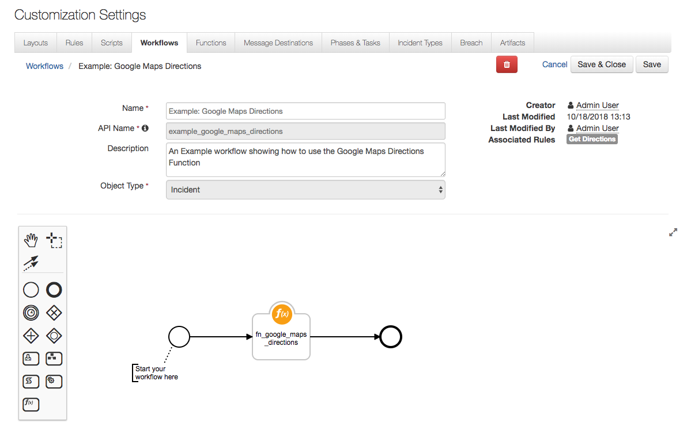

# Resilient Integration with Google Maps
**This package contains one function that generates a link to Google Maps which shows directions from the given origin to the destination**

 


## app.config settings:
```python
None
```

## Function Inputs:
| Function Name | Type | Required | Example |
| ------------- | :--: | :-------:| ------- |
| `google_maps_origin` | `String` | Yes | `"IBM, Armonk, New York"` |
| `google_maps_destination` | `String` | Yes | `"IBM Resilient, Cambridge, Boston, MA"` |


## Function Output:
```python

results = {
  success: True,

  directions_link: "https://www.google.com/maps/dir/?api=1&origin=xxx&destination=xxx"

  inputs: {
    google_maps_origin: "IBM, Armonk, New York", 
    google_maps_destination: "IBM Resilient, Cambridge, Boston, MA"
  },
}

```

## Pre-Processing:
*This example sets the origin and gets the destination **from the Incident Details***
```python
# Set Origin
inputs.google_maps_origin = "IBM, Armonk, New York"

# Get destination from Incident Details
destination = "{0}, {1}, {2}".format(incident.addr, incident.city, incident.country)

# Set Destination
inputs.google_maps_destination = destination
```

## Post-Processing:
*This example **adds a Note to the Incident***
```python
if (results.success):
  
  noteText = """<br><b>Example: Google Maps Directions Wokflow has complete</b>
                <b>Directions Link:</b> <a href='{0}'>{0}</a>""".format(results.directions_link)
  
  incident.addNote(helper.createRichText(noteText))
```

## Rules
| Rule Name | Object Type | Workflow Triggered |
| --------- | :---------: | ------------------ |
| Get Directions | `Incident` | `Example: Google Maps Directions` |