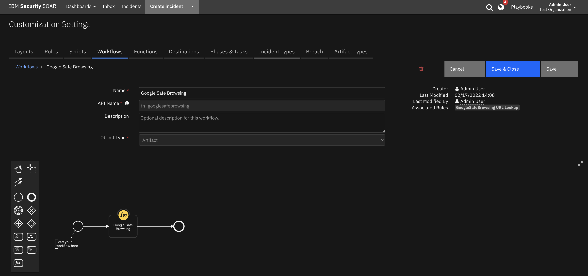
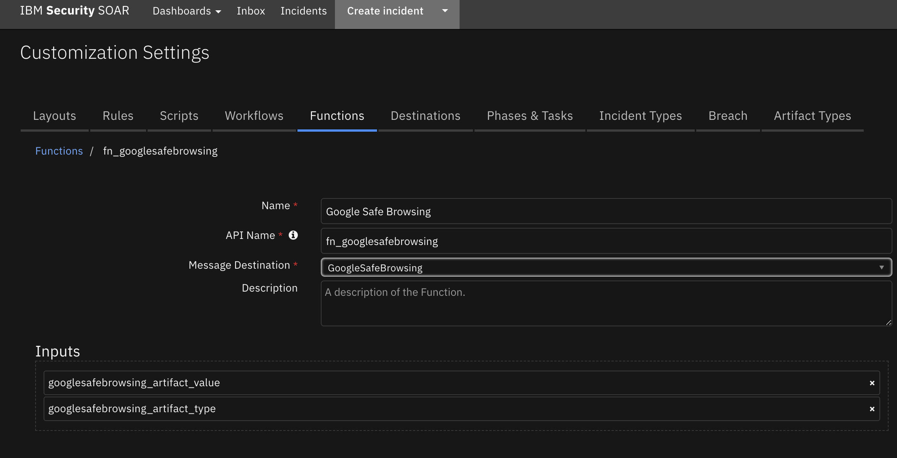

<!--
  This README.md is generated by running:
  "resilient-sdk docgen -p fn_googlesafebrowsing"

  It is best edited using a Text Editor with a Markdown Previewer. VS Code
  is a good example. Checkout https://guides.github.com/features/mastering-markdown/
  for tips on writing with Markdown

  All fields followed by "::CHANGE_ME::"" should be manually edited

  If you make manual edits and run docgen again, a .bak file will be created

  Store any screenshots in the "doc/screenshots" directory and reference them like:
  

  NOTE: If your app is available in the container-format only, there is no need to mention the integration server in this readme.
-->

# Google Safe Browsing Function for IBM SOAR

## Table of Contents
- [Release Notes](#release-notes)
- [Overview](#overview)
  - [Key Features](#key-features)
- [Requirements](#requirements)
  - [SOAR platform](#soar-platform)
  - [Cloud Pak for Security](#cloud-pak-for-security)
  - [Proxy Server](#proxy-server)
  - [Python Environment](#python-environment)
  - [Endpoint Developed With](#endpoint-developed-with)
- [Installation](#installation)
  - [Install](#install)
  - [App Configuration](#app-configuration)
- [Function - Google Safe Browsing](#function---google-safe-browsing)
- [Rules](#rules)
- [Troubleshooting & Support](#troubleshooting--support)
---

## Release Notes
<!--
  Specify all changes in this release. Do not remove the release 
  notes of a previous release
-->
| Version | Date | Notes |
| ------- | ---- | ----- |
| 1.0.1 | 03/2022 | Documentation now accurately reflects supported Python version |
| 1.0.0 | 02/2022 | Initial Release |

---

## Overview
<!--
  Provide a high-level description of the function itself and its remote software or application.
  The text below is parsed from the "description" and "long_description" attributes in the setup.py file
-->
**IBM Security SOAR app for 'fn_googlesafebrowsing'**

 

This app uses Google Safe Browsing to check artifacts with a URL type and adds a hit if the site is potentially unsafe. The hits contains a link to Google Transparency Report that gives information on the potentially unsafe url.

### Key Features
<!--
  List the Key Features of the Integration
-->
* The workflow checks the reputation of the url and creates a hit in the artifact if Google Safe Browsing thinks it is potentially unsafe.

---

## Requirements
<!--
  List any Requirements 
--> 
* resilient-circuits>=43.0.0
This app supports the IBM Security QRadar SOAR Platform and the IBM Security QRadar SOAR for IBM Cloud Pak for Security.

### SOAR platform
The SOAR platform supports two app deployment mechanisms, App Host and integration server.

If deploying to a SOAR platform with an App Host, the requirements are:
* SOAR platform >= `43.1.49`.
* The app is in a container-based format (available from the AppExchange as a `zip` file).

If deploying to a SOAR platform with an integration server, the requirements are:
* SOAR platform >= `43.1.49`.
* The app is in the older integration format (available from the AppExchange as a `zip` file which contains a `tar.gz` file).
* Integration server is running `resilient-circuits>=43.0.0`.
* If using an API key account, make sure the account provides the following minimum permissions: 
  | Name | Permissions |
  | ---- | ----------- |
  | Org Data | Read |
  | Function | Read |

The following SOAR platform guides provide additional information: 
* _App Host Deployment Guide_: provides installation, configuration, and troubleshooting information, including proxy server settings. 
* _Integration Server Guide_: provides installation, configuration, and troubleshooting information, including proxy server settings.
* _System Administrator Guide_: provides the procedure to install, configure and deploy apps. 

The above guides are available on the IBM Documentation website at [ibm.biz/soar-docs](https://ibm.biz/soar-docs). On this web page, select your SOAR platform version. On the follow-on page, you can find the _App Host Deployment Guide_ or _Integration Server Guide_ by expanding **Apps** in the Table of Contents pane. The System Administrator Guide is available by expanding **System Administrator**.

### Cloud Pak for Security
If you are deploying to IBM Cloud Pak for Security, the requirements are:
* IBM Cloud Pak for Security >= 1.9
* Cloud Pak is configured with an App Host.
* The app is in a container-based format (available from the AppExchange as a `zip` file).

The following Cloud Pak guides provide additional information: 
* _App Host Deployment Guide_: provides installation, configuration, and troubleshooting information, including proxy server settings. From the Table of Contents, select Case Management and Orchestration & Automation > **Orchestration and Automation Apps**.
* _System Administrator Guide_: provides information to install, configure, and deploy apps. From the IBM Cloud Pak for Security IBM Documentation table of contents, select Case Management and Orchestration & Automation > **System administrator**.

These guides are available on the IBM Documentation website at [ibm.biz/cp4s-docs](https://ibm.biz/cp4s-docs). From this web page, select your IBM Cloud Pak for Security version. From the version-specific IBM Documentation page, select Case Management and Orchestration & Automation.

### Proxy Server
The app does support a proxy server.

### Python Environment
Python 3.6 is supported.
Additional package dependencies may exist for each of these packages:
* resilient-circuits>=43.0.0

### Endpoint Developed With

This app has been implemented using:
| Product Name | Product Version | API URL | API Version |
| ------------ | --------------- | ------- | ----------- |
| Google Safe Browsing | ------- | https://safebrowsing.googleapis.com/v4/threatMatches:find?key= | v4 |

#### Prerequisites
<!--
List any prerequisites that are needed to use with this endpoint solution. Remove any section that is unnecessary.
-->
* A Google Cloud Platform account

#### Configuration
<!--
List any steps that are needed to configure the endpoint to use this app.
-->
* Create a google project
* Set up an API key
* Activate the Safe Browsing API

---

## Installation

### Install
* To install or uninstall an App or Integration on the _SOAR platform_, see the documentation at [ibm.biz/soar-docs](https://ibm.biz/soar-docs).
* To install or uninstall an App on _IBM Cloud Pak for Security_, see the documentation at [ibm.biz/cp4s-docs](https://ibm.biz/cp4s-docs) and follow the instructions above to navigate to Orchestration and Automation.

### App Configuration
The following table provides the settings you need to configure the app. These settings are made in the app.config file. See the documentation discussed in the Requirements section for the procedure.

| Config | Required | Example | Description |
| ------ | :------: | ------- | ----------- |
| **googlesafebrowsing_api_key** | Yes | `` | API key retrieved from Google Cloud Platform |
| **googlesafebrowsing_url** | Yes | `https://safebrowsing.googleapis.com/v4/threatMatches:find?key=` | --- |

---

## Function - Google Safe Browsing
This app uses Google Safe Browsing to check artifacts with a URL type and adds a hit if the site is potentially unsafe. The hit contains a link to Google Transparency Report that gives information on the potentially unsafe url.

 

<details><summary>Inputs:</summary>
<p>

| Name | Type | Required | Example | Tooltip |
| ---- | :--: | :------: | ------- | ------- |
| `googlesafebrowsing_artifact_type` | `text` | Yes | `-` | - |
| `googlesafebrowsing_artifact_value` | `text` | Yes | `-` | - |

</p>
</details>

<details><summary>Outputs:</summary>
<p>

> **NOTE:** This example might be in JSON format, but `results` is a Python Dictionary on the SOAR platform.

```python
results = {
  "content": {
    "matches": [
      {
        "cacheDuration": "300s",
        "platformType": "ANY_PLATFORM",
        "threat": {
          "url": "http://malware.testing.google.test/testing/malware/*"
        },
        "threatEntryType": "URL",
        "threatType": "MALWARE"
      }
    ]
  },
  "inputs": {
    "googlesafebrowsing_artifact_type": "URL",
    "googlesafebrowsing_artifact_value": "http://malware.testing.google.test/testing/malware/*"
  },
  "metrics": {
    "execution_time_ms": 411,
    "host": "My Host",
    "package": "fn-googlesafebrowsing",
    "package_version": "1.0.0",
    "timestamp": "2022-02-17 14:05:42",
    "version": "1.0"
  },
  "raw": null,
  "reason": null,
  "success": true,
  "version": 2.0
}
```

</p>
</details>

<details><summary>Example Pre-Process Script:</summary>
<p>

```python
inputs.googlesafebrowsing_artifact_type = artifact.type
inputs.googlesafebrowsing_artifact_value = artifact.value
```

</p>
</details>

<details><summary>Example Post-Process Script:</summary>
<p>

```python
# This link contains further information on the site status of the url that is being checked
LINK_URL = "https://www.google.com/transparencyreport/safebrowsing/diagnostic/#url={}"
if results.success:
  if results.content:
    resp = results.content
    hit = []
    for match in resp.get("matches", []):
      linkurl = match["threat"]["url"]
      link = LINK_URL.format(match["threat"]["url"])
      hit = [
      {
        "name": "Threat Type",
        "type": "string",
        "value": "{}".format(match["threatType"])
      }, 
      {
        "name": "Report Link",
        "type": "uri",
        "value": "{}".format(link)
      }, 
      {
        "name": "Platform Type",
        "type": "string",
        "value": "{}".format(match["platformType"])
      },
      {
        "name": "URL Name",
        "type": "string",
        "value": "{}".format(linkurl)
      }
      ]
      artifact.addHit("Google Safe Browsing Function", hit)
else:
  incident.addNote("Google Safe Browsing url check failed: {}".format(results.reason))

```

</p>
</details>

---


## Rules
| Rule Name | Object | Workflow Triggered |
| --------- | ------ | ------------------ |
| GoogleSafeBrowsing URL Lookup | artifact | `google_safe_browsing_url_lookup` |

---

## Troubleshooting & Support
Refer to the documentation listed in the Requirements section for troubleshooting information.

### For Support
This is a IBM Community provided App. Please search the Community [ibm.biz/soarcommunity](https://ibm.biz/soarcommunity) for assistance.
