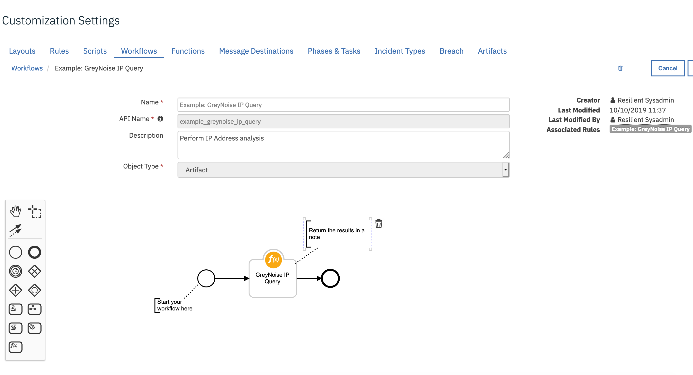
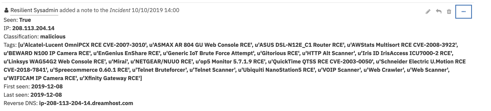

<!-- This file is generated by running resilient-circuits docgen -->
# GreyNoise function for IBM Resilient

  - [Overview](#overview)
  - [Key Features](#key-features)
  - [Requirements](#requirements)
  - [Installation](#installation)
  - [Uninstall](#uninstall)
  - [Troubleshooting](#troubleshooting)
    - [Resilient Action Status](#resilient-action-status)
    - [Resilient Scripting Log](#resilient-scripting-log)
    - [Resilient Logs](#resilient-logs)
    - [Resilient-Circuits](#resilient-circuits)
  - [Support](#support)

---
## Overview
<!-- This description is taken from the in the "description" attribute setup.py file -->
**Resilient Circuits Components for 'fn_greynoise'**

 

<!-- This description is taken from the in the "long_description" attribute setup.py file -->
Perform IP Analysis using Greynoise to catagorize IP addresses and it's threat on you organization.



---
## Requirements
<!-- List any Requirements -->
* IBM Resilient >= `v33.0.5087`
* An Integrations Server running `resilient-circuits >= v31.0.0`
  * To setup an Integrations Server see: [ibm.biz/res-int-server-guide](ibm.biz/res-int-server-guide)

---
## Installation
* Download the `fn_greynoise.zip`
* Copy the `.zip` to your Integrations Server and SSH into it.
* **Unzip** the package:
  ```
  $ unzip fn_greynoise-x.x.x.zip
  ```
* **Install** the package:
  ```
  $ pip install fn_greynoise-x.x.x.tar.gz
  ```
* Import the **configurations** into your app.config file:
  ```
  $ resilient-circuits config -u
  ```
* Import the fn_greynoise **customizations** into the Resilient Appliance:
  ```
  $ resilient-circuits customize -y -l fn-greynoise
  ```
* Open the config file, scroll to the bottom and edit your fn_greynoise **configurations**:
  ```
  $ nano ~/.resilient/app.config
  ```
  | Config | Required | Example | Description |
  | ------ | :------: | ------- | ----------- |
  | url    | yes      | https://api.greynoise.io/v2/noise | url to greynoise |
  | api_key | yes     | eXmYpb...173pje0 | sign up at https://viz.greynoise.io/signup | 

* **Save** and **Close** the app.config file.
* [Optional]: Run **selftest** to test you the Integration is configured:
  ```
  $ resilient-circuits selftest -l fn-greynoise
  ```
* **Run** resilient-circuits or restart the Service on Windows/Linux:
  ```
  $ resilient-circuits run
  ```

---
## Uninstall
* SSH into your Integrations Server
* **Uninstall** the package:
  ```
  $ pip uninstall fn-greynoise
  ```
* Open the config file, scroll to the [fn_greynoise] section and remove the section or prefix `#` to comment out the section.
* **Save** and **Close** the app.config file.

---
## Troubleshooting
There are several ways to verify the successful operation of a function. 

### Resilient Action Status
* When viewing an incident, use the Actions menu to view **Action Status**. 
* By default, pending and errors are displayed. 
* Modify the filter for actions to also show Completed actions.
* Clicking on an action displays additional information on the progress made or what error occurred.

### Resilient Scripting Log
* A separate log file is available to review scripting errors.
* This is useful when issues occur in the pre-processing or post-processing scripts.
* The default location for this log file is: `/var/log/resilient-scripting/resilient-scripting.log`.

### Resilient Logs
* By default, Resilient logs are retained at `/usr/share/co3/logs`.
* The `client.log` may contain additional information regarding the execution of functions.

### Resilient-Circuits
* The log is controlled in the `.resilient/app.config` file under the section [resilient] and the property `logdir`.
* The default file name is `app.log`.
* Each function will create progress information.
* Failures will show up as errors and may contain python trace statements.

---
## Support
| Name | Version | Author | Support URL |
| ---- | ------- | ------ | ----------- |
| fn-greynoise | 1.0.0 | Resilient Labs | http://ibm.biz/resilientcommunity |