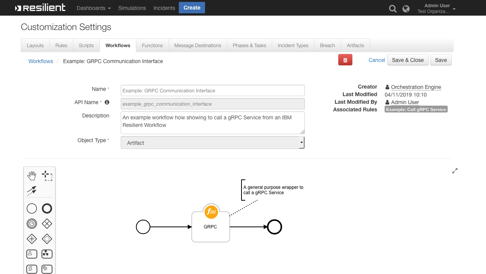
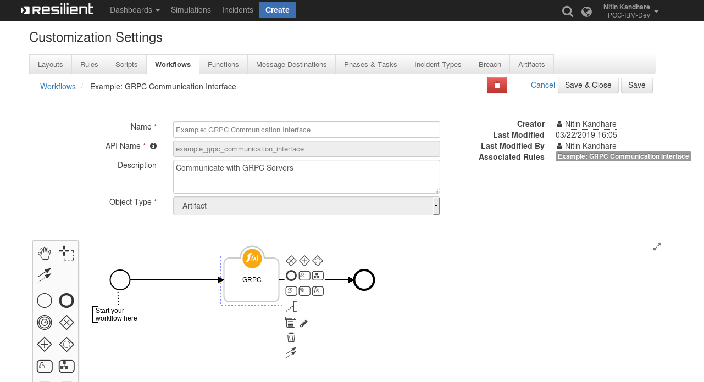
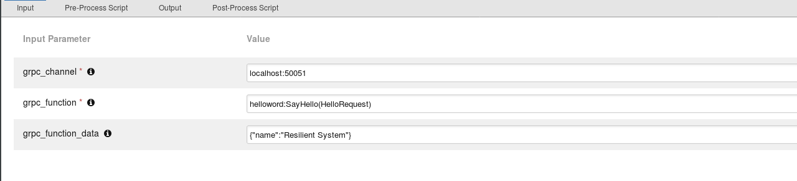
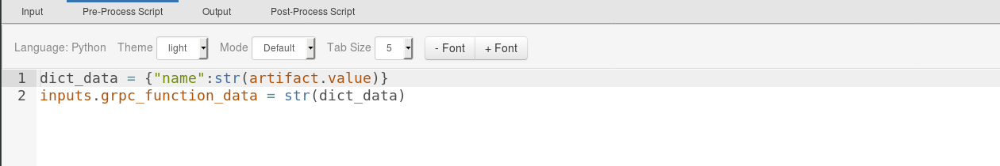
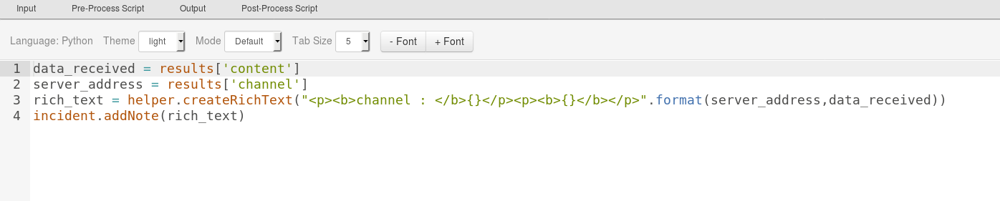

# gRPC Function for IBM Resilient

## Table of Contents  
 - [About This Package](#about-this-package)
 - [Prerequisites](#prerequisites)
 - [Installation](#installation)
 - [Function Inputs](#function-inputs)
 - [Function Output](#function-output)
 - [Pre-Process Script](#pre-process-script)
 - [Post-Process Script](#post-process-script)
 - [Rules](#rules)
 ---
 
## About this Package :
**This gRPC function provides a general purpose wrapper for use with any gRPC client application.** 
* It can be used for request/response style communication during incident response management such as     
	* artifact enrichment  
	* enterprise containment actions  
	* communication and coordination with other enterprise solutions   
* In this edition we have implemented the `unary` communication type service method.  
* For more information on [gRPC](https://grpc.io/docs/)
* We recommend following the gRPC `helloworld` example [here](https://grpc.io/docs/quickstart/python.html) to help get this Integration up and running.
  
 
 
### gRPC Function layout:


### gRPC Sample Inputs


### gRPC Pre-Process Script


### gRPC Post-Process Script


  
## Prerequisites:  
* Resilient Appliance >= v31.0.0
* Integrations Server running resilient_circuits >= v30.0.0
* grpcio version >=v1.19.0 
  
## Installation 
This package requires that it is installed on a RHEL or CentOS platform and uses the resilient-circuits framework.
* Download the `.zip` file from our App Exchange and extract it. You will find a file called: `fn_grpc_interface-<version>.tar.gz`
* Copy this file to your Integrations Server
 * To install the package, run:   
`pip install fn_grpc_interface-<version>.tar.gz`  
  
* To import the function, example rules,data tables and workflows into your Resilient Appliance, run: 
  
	`resilient-circuits customize -y -l fn-grpc-interface`  
	
* To update your `app.config` file with the required gRPC configurations, run:
 
	 `resilient-circuits config -u`   
* Then open your `app.config` file and check the following configuration data is added:  
	```
	[fn_grpc_interface]
	#interface_dir = <<path to interface buffer pb2 files parent directory>>
	#<<package_name=communication_type,secure connection type,certificate_path or google API token>>
	#Note : create a folder same as package name, and copy the interface buffer pb2 files inside the directory.
	#config data settings details as follows :
	#       package_Name(gRPC package name) = communication type(i.e gRPC client-server communication type 
	#       example - unary(Simple RPC),server_stream(response-streaming RPC),client_stream(request-streaming RPC),
	#       bidirectional_stream(bidirectionally-streaming RPC)),secure connection type(i.e None,SSL/TLS,OAuth2),
	#       certificate_path or google API token(i.e None,path to certificate/token).
	#       for more info on gRPC communication types : https://grpc.io/docs/tutorials/basic/python.html
	```
	Edit the `interface_dir` and `package_name` as described:
 
|Configuration Parameters| Description 					|Example|
|------------------------|------------------------------|-------|
|*interface_dir*  |The parent directory containing the gRPC client (pb2) files. These files are auto-generated from your .proto file via the grpc-tools utility.  |*interface_dir = /usr/local/grpc_clients/*|
|*package_name=communication_type,secure connection type,certificate_path or google API token*| Create a separate line for each client application to enable for Resilient. Within interface_dir, create a folder matching package_name where the client pb2files will reside. <br><br>*communication type:* This value can be - unary, server_stream, client_stream, or 	bidirectional_stream. Presently, only `unary` is supported.         For further information, refer to https://grpc.io/docs/tutorials/basic/python.html  <br><br>*secure connection:* This value can be None, SSL/TLS, OAuth2. Presently only None, SSL/TLS are supported.<br><br>*certificate/google token:* if the secure connection type is other than the None, specify either a path to the certificate file or token provided from google. |*helloworld = unary,None,None*|


* To uninstall gRPC Function from Resilient Run the following:  
  
	 `pip uninstall fn_grpc_interface`  
 
## Function Inputs

   |Input Name |Type  |Required|Example|Info|
| --------------|-------| ----------|----------|--------------|
|`grpc_channel`|`String`|yes|`localhost:50051`|this field contain the channel info of the GRPC Server Running ex:hostIP:Port
|`grpc_function`|`String`|yes|`helloworld:SayHello(HelloRequest)`|This fields contains data from .proto file i.e package_name : rpc function name(grpc request function) |
|`grpc_function_data`|`String`|yes|`'{ "name": "128.23.43.56" }' `|This will contain string formatted json containing artifact data and additional parameters required by the gRPC function call|
	 
#### More Information on  grpc function Input:
*package_name:rpc function name(rpc request)* Ex. helloworld:SayHello(HelloRequest)  
	 
This information is derived from the .proto file similar to the following example:  	 	 
	
```
	 package helloworld;
	// The greeting service definition.
	service Greeter {
	  // Sends a greeting
	  rpc SayHello (HelloRequest) returns (HelloReply) {}
	}
``` 
	 
## Function Output
The payload from integration will wrap the results of the gRPC server response in the following JSON structure.  
An attempt is made to return response received as a dictionary if the response is actually a string representation of JSON or a nature dictionary object.   
Otherwise, response received will be returned as a string representation of the result.  
  { "content": response received, "channel": grpc channel }  
* To see the output of each of the  Function, we recommend running `resilient-circuits` in `DEBUG` mode.
* To do this run:
    ```
    $ resilient-circuits run --loglevel=DEBUG
    ```
## Pre-Process Script
  This example sets `grpc_function_data` to the artifact value ,
A pre-processor script will build and format the grpc_function_data input field similar to this example:
  ```python
	def dict_to_json_str(d):
		  """Function that converts a dictionary into a JSON string.
	     Supports types: basestring, unicode, bool, int and nested dicts.
	     Does not support lists.
	     If the value is None, it sets it to False."""

	  json_entry = u'"{0}":{1}'
	  json_entry_str = u'"{0}":"{1}"'
	  entries = []

	  for entry in d:
	    key = entry
	    value = d[entry]
		  if value is None:
			  value = False

		  if isinstance(value, list):
	      helper.fail('dict_to_json_str does not support Python Lists')

		  if isinstance(value, basestring):
	      value = value.replace(u'"', u'\\"')
	      entries.append(json_entry_str.format(unicode(key), unicode(value)))

	    elif isinstance(value, unicode):
	      entries.append(json_entry.format(unicode(key), unicode(value)))
    
	    elif isinstance(value, bool):
	      value = 'true' if value == True else 'false'
	      entries.append(json_entry.format(key, value))

	    elif isinstance(value, int):
	      entries.append(json_entry.format(unicode(key), value))

	    elif isinstance(value, dict):
	      entries.append(json_entry.format(key, dict_to_json_str(value)))

    else:
      helper.fail('dict_to_json_str does not support this type: {0}'.format(type(value)))
	  return u'{0} {1} {2}'.format(u'{', ','.join(entries), u'}')

inputs.grpc_function_data = dict_to_json_str({"name": "IBM Resilient System"})


  ```
      
"name" refers to name of the input parameter specified in the .proto file request message as in this example:

```
	 // The request message containing the user's name.
		message HelloRequest {
		  string name = 1;
		}
```
   If more than one parameter is specified in the request message, then the pre-process script's json object should also include those parameters.
  
## Post-Process Script
  If the response received  is in JSON or dictionary format, it can be parsed within the post-process script as `results.get("content")`. Otherwise, the result will be in string format. 
  By default function data is displayed on incident Notes.
  ```python
		 data_received = results['content']
		 server_address = results['channel']
		 rich_text = helper.createRichText("<p><b>channel : </b>{}</p><p><b>{}</b></p>".format(server_address,data_received))
	     incident.addNote(rich_text)
  ```
  
## Rules
| Rule Name | Object Type | Workflow Triggered |Activity Fields|  
| --------- | :---------: | ------------------ |---------------|  
|`Example: GRPC Communication Interface`| `Artifact` | `Example: GRPC Communication Interface` ||
