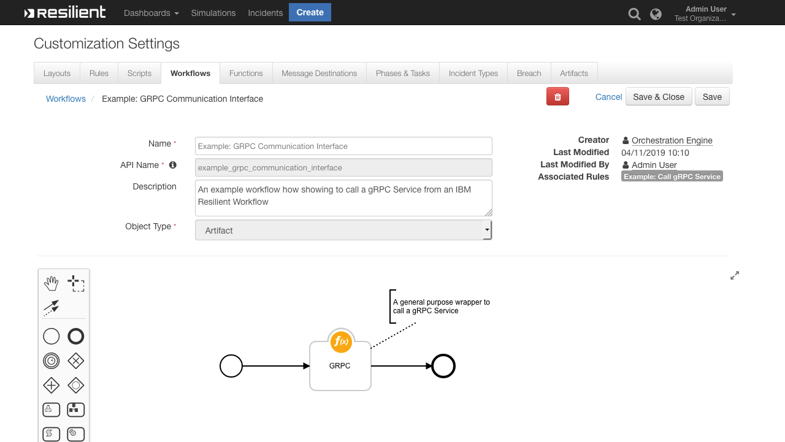

<!--
  This README.md is generated by running:
  "resilient-sdk docgen -p fn_grpc_interface"

  It is best edited using a Text Editor with a Markdown Previewer. VS Code
  is a good example. Checkout https://guides.github.com/features/mastering-markdown/
  for tips on writing with Markdown

  If you make manual edits and run docgen again, a .bak file will be created

  Store any screenshots in the "doc/screenshots" directory and reference them like:
  

  NOTE: If your app is available in the container-format only, there is no need to mention the integration server in this readme.
-->

# fn_grpc_interface

## Table of Contents
- [Release Notes](#release-notes)
- [Overview](#overview)
  - [Key Features](#key-features)
- [Requirements](#requirements)
  - [Resilient platform](#resilient-platform)
  - [Cloud Pak for Security](#cloud-pak-for-security)
  - [Proxy Server](#proxy-server)
  - [Python Environment](#python-environment)
- [Installation](#installation)
  - [Install](#install)
  - [App Configuration](#app-configuration)
- [Function - GRPC](#function---grpc)
- [Rules](#rules)
- [Troubleshooting & Support](#troubleshooting--support)
---

## Release Notes
<!--
  Specify all changes in this release. Do not remove the release 
  notes of a previous release
-->
| Version | Date | Notes |
| ------- | ---- | ----- |
| 1.1.1 | 04/2022 | Pinned `grpcio==1.44.0` and `grpcio-tools==1.44.0` |
| 1.1.0 | 09/2021 | Add app host support; add configuration options for channel and function definition |
| 1.0.0 | 04/2019 | Initial Release |

_Note: as of v1.1.0 the configurations for grpc_channel can be defined in the app.config. For integration server this will require updating your server's app.config to match the correct format. This is optional and the old functionality of defining these values in the function call remains and takes precedence over the values set in the configuration. grpc_channel is a required configuration setting for selftest._
```
grpc_channel=<<host>>:<<port>> 
grpc_function=<<the name of the package>>:<<the function to call>>
```

---

## Overview
<!--
  Provide a high-level description of the function itself and its remote software or application.
  The text below is parsed from the "description" and "long_description" attributes in the setup.py file
-->
**This Function provides a general purpose wrapper that allows you to call gRPC services from within IBM Resilient**

* Using gRPC you can efficiently connect services in and across data centers to help with your Incident Response
* This version supports **Unary RPCs** where the client sends a single request to the server and gets a single response back, just like a normal function call.
* See https://grpc.io/ for more information on gRPC
* We recommend following the gRPC `helloworld` example [here](https://grpc.io/docs/quickstart/python.html) to help get this Integration up and running.

 

---

## Requirements
<!--
  List any Requirements 
-->
This app supports the IBM Resilient SOAR Platform and the IBM Cloud Pak for Security.

### Resilient platform
The Resilient platform supports two app deployment mechanisms, App Host and integration server.

If deploying to a Resilient platform with an App Host, the requirements are:
* Resilient platform >= `40.0.6554`.
* The app is in a container-based format (available from the AppExchange as a `zip` file).

If deploying to a Resilient platform with an integration server, the requirements are:
* Resilient platform >= `40.0.6554`.
* The app is in the older integration format (available from the AppExchange as a `zip` file which contains a `tar.gz` file).
* Integration server is running `resilient_circuits>=30.0.0`.
* If using an API key account, make sure the account provides the following minimum permissions: 
  | Name | Permissions |
  | ---- | ----------- |
  | Org Data | Read |
  | Function | Read |
* Please refer to the release notes above for information on upgrading your configuration to take advantage of new configuration options available in v1.1.0 or greater.

The following Resilient platform guides provide additional information: 
* _App Host Deployment Guide_: provides installation, configuration, and troubleshooting information, including proxy server settings. 
* _Integration Server Guide_: provides installation, configuration, and troubleshooting information, including proxy server settings.
* _System Administrator Guide_: provides the procedure to install, configure and deploy apps. 

The above guides are available on the IBM Knowledge Center at [ibm.biz/resilient-docs](https://ibm.biz/resilient-docs). On this web page, select your Resilient platform version. On the follow-on page, you can find the _App Host Deployment Guide_ or _Integration Server Guide_ by expanding **Resilient Apps** in the Table of Contents pane. The System Administrator Guide is available by expanding **System Administrator**.

### Cloud Pak for Security
If you are deploying to IBM Cloud Pak for Security, the requirements are:
* IBM Cloud Pak for Security >= 1.4.
* Cloud Pak is configured with an App Host.
* The app is in a container-based format (available from the AppExchange as a `zip` file).

The following Cloud Pak guides provide additional information: 
* _App Host Deployment Guide_: provides installation, configuration, and troubleshooting information, including proxy server settings. From the Table of Contents, select Case Management and Orchestration & Automation > **Orchestration and Automation Apps**.
* _System Administrator Guide_: provides information to install, configure, and deploy apps. From the IBM Cloud Pak for Security Knowledge Center table of contents, select Case Management and Orchestration & Automation > **System administrator**.

These guides are available on the IBM Knowledge Center at [ibm.biz/cp4s-docs](https://ibm.biz/cp4s-docs). From this web page, select your IBM Cloud Pak for Security version. From the version-specific Knowledge Center page, select Case Management and Orchestration & Automation.

### Proxy Server
The app **does** support a proxy server.

### Python Environment
Both Python 2.7 and Python 3.6 are supported.
Additional package dependencies may exist for each of these packages:
* grpcio-tools>=1.19.0
* grpcio>=1.19.0
* resilient_circuits>=30.0.0

---

## Installation

### Install
* To install or uninstall an App or Integration on the _Resilient platform_, see the documentation at [ibm.biz/resilient-docs](https://ibm.biz/resilient-docs).
* To install or uninstall an App on _IBM Cloud Pak for Security_, see the documentation at [ibm.biz/cp4s-docs](https://ibm.biz/cp4s-docs) and follow the instructions above to navigate to Orchestration and Automation.

### App Configuration
The following table provides the settings you need to configure the app. These settings are made in the app.config file. See the documentation discussed in the Requirements section for the procedure.

| Config | Required | Example | Description |
| ------ | :------: | ------- | ----------- |
| `interface_dir=<<path_to_dir>>` | Yes | interface_dir=/var/rescircuits/interface_dir | The path to the parent directory of your Protocol Buffer (pb2) files. There must be a directory with name `package_name` within your `interface_dir` for the function to execute properly.|
|`<<package_name>>=<<communication_type>>, <<secure_connection_type>>,<<certificate_path or google_API_token>>`| Yes |helloworld=unary,None,None| *package_name:* Define one `package_name` per line. Within the `interface_dir`, create a directory with the same name as `package_name` where the client Protocol Buffer files will reside. <br><br>*communication_type:* Currently we only support Unary RPCs so this value must be - `unary`. For further information, refer to https://grpc.io/docs/guides/concepts.html <br><br>*secure_connection:* We currently support `SSL` or `TLS` secure connections. This value can be `SSL`, `TLS` or `None`. If SSL/TLS, ensure you provide a `certificate_path`<br><br>*certificate_path/google token:* If `secure_connection` is defined, specify either a path to the certificate file or the token provided by Google|
|`grpc_channel`| No | `grpc_channel=<host>:<port>` | The channel for grpc to listen on. This value is superceeded by any value passed to the function. If the value is omitted from the function call the value in the configuration is used. |

> Note: The structure of the directories is very rigid. Please read the descriptions above carefully before installing. If installing on App Host use the "Configurations" page to add in your package files. If installing on App Host you must host your gRPC server somewhere other than `localhost`.
---

## Function - GRPC
Function that allows you to call a gRPC Service that is being served on your Integrations Server

<details><summary>Inputs:</summary>
<p>

| Name | Type | Required | Example | Tooltip |
| ---- | :--: | :------: | ------- | ------- |
| `grpc_function` | `text` | Yes | `"helloworld:SayHello(HelloRequest)"` | This fields contains data from .proto file i.e package_name : rpc function name(grpc request function) ex: helloword : SayHello(HelloRequest).|
| `grpc_function_data` | `JSON String` | Yes | `'{ "name": "Joe Bloggs" }'` | Additional data Fields to send data from client to server. data format will be in json and key should match the request function parameter. |
| `grpc_channel` | `text` | No | `"<host>:<port>"` | this field contain the channel info of the GRPC Server Running ex: hostIP:Port. This value takes precendence over value set in app.config |

>**NOTE:** the `grpc_function` is derived from your `.proto` files like the `helloworld.proto` example:
>
>```
>syntax = "proto3";
>
>option java_multiple_files = true;
>option java_package = "io.grpc.examples.helloworld";
>option java_outer_classname = "HelloWorldProto";
>option objc_class_prefix = "HLW";
>
>package helloworld;
>
>// The greeting service definition.
>service Greeter {
>  // Sends a greeting
>  rpc SayHello (HelloRequest) returns (HelloReply) {}
>}
>
>// The request message containing the user's name.
>message HelloRequest {
>  string name = 1;
>}
>
>// The response message containing the greetings
>message HelloReply {
>  string message = 1;
>}
>```

</p>
</details>

<details><summary>Outputs:</summary>
<p>

```python
results = {
    'content': {'message': 'Hello, [name]!'},
    'channel': 'localhost:50051
}
```

</p>
</details>

<details><summary>Example Pre-Process Script:</summary>
<p>

```python
def dict_to_json_str(d):
  """Function that converts a dictionary into a JSON string.
     Supports types: basestring, unicode, bool, int and nested dicts.
     Does not support lists.
     If the value is None, it sets it to False."""

  json_entry = u'"{0}":{1}'
  json_entry_str = u'"{0}":"{1}"'
  entries = []

  for entry in d:
    key = entry
    value = d[entry]

    if value is None:
      value = False

    if isinstance(value, list):
      helper.fail('dict_to_json_str does not support Python Lists')

    if isinstance(value, basestring):
      value = value.replace(u'"', u'\\"')
      entries.append(json_entry_str.format(unicode(key), unicode(value)))

    elif isinstance(value, unicode):
      entries.append(json_entry.format(unicode(key), unicode(value)))
    
    elif isinstance(value, bool):
      value = 'true' if value == True else 'false'
      entries.append(json_entry.format(key, value))

    elif isinstance(value, int):
      entries.append(json_entry.format(unicode(key), value))

    elif isinstance(value, dict):
      entries.append(json_entry.format(key, dict_to_json_str(value)))

    else:
      helper.fail('dict_to_json_str does not support this type: {0}'.format(type(value)))

  return u'{0} {1} {2}'.format(u'{', ','.join(entries), u'}')

# Define Inputs assuming grpc_channel and grpc_function are defined in app.config

# The gRPC Function
inputs.grpc_function = "helloworld:SayHello(HelloRequest)"

# The gRPC Function Request Data
inputs.grpc_function_data = dict_to_json_str({"name": artifact.value})
```

</p>
</details>

<details><summary>Example Post-Process Script:</summary>
<p>

```python

grpc_response_data = results['content']
grpc_channel = results['channel']

rich_text = helper.createRichText(u"""A gRPC Response has been received from <b>{0}</b><br>
                                      <b>Response:</b> {1}""".format(grpc_channel, grpc_response_data))

incident.addNote(rich_text)
```

</p>
</details>

---


## Rules
| Rule Name | Object | Workflow Triggered |
| --------- | ------ | ------------------ |
| Example: Call gRPC Service | artifact | `example_grpc_communication_interface` |

---

## Troubleshooting & Support
Refer to the documentation listed in the Requirements section for troubleshooting information.

### For Support
This is a IBM Community provided App. Please search the Community https://ibm.biz/resilientcommunity for assistance.
