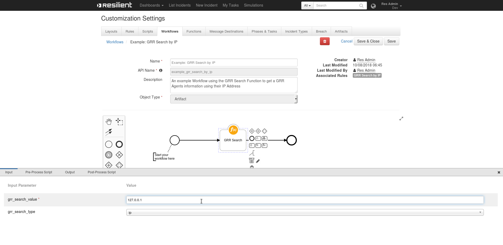

# Resilient Integration with GRR
**This package contains one function that allows you to search for your GRR Agents using IP, Host or User**

 


## app.config settings:
```python
[fn_grr]
grr_server=127.0.0.1
grr_user=user
grr_pwd=password
#Can be True/False
verify_cert=False
```

## Function Inputs:
**grr_search_value:**
* The value of the IP/Host/User
* E.g. 127.0.0.1

**grr_search_type:**
* Select from the dropdown

## Function Output:
* The function returns the results as a Python Dictionary. Here is an example ouput:
```
{   
    'grr_search_type': u'ip',
    'grr_search_value': u'127.0.0.1',
    'success': True
    'agents': [
        {
            u'age': u'1538997200410715',
            u'agentInfo': {
                u'buildTime': u'2018-06-28 09:10:40',
                u'clientDescription': u'grr linux amd64',
                u'clientName': u'grr',
                u'clientVersion': 3232
            },
            u'clientId': u'C.ddc30808cf5d06d3',
            u'firstSeenAt': u'1538497879090708',
            u'fleetspeakEnabled': False,
            u'hardwareInfo': {
                u'biosReleaseDate': u'05/19/2017',
                u'biosRevision': u'4.6',
                u'biosRomSize': u'64 kB',
                u'biosVendor': u'Phoenix Technologies LTD',
                u'biosVersion': u'6.00',
                u'serialNumber': u'VMware-56 4d f0 c8... 77 7e 65',
                u'systemFamily': u'Not Specified',
                u'systemManufacturer': u'VMware',
                u'systemProductName': u'VMware Virtual Platform',
                u'systemSkuNumber': u'Not Specified',
                u'systemUuid': u'xxxx'
            },
            u'interfaces': [{...}, {...}, {...}, {...}, {...}, {...}, {...}, {...}],
            u'knowledgeBase': {
                u'fqdn': u'localhost.localdomain',
                u'os': u'Linux',
                u'osMajorVersion': 7,
                u'osMinorVersion': 5,
                u'osRelease': u'RedHat'
            }, 
            u'lastBootedAt': u'1538996573000000',
            u'lastClock': u'1539009155388036',
            u'lastSeenAt': u'1539009155394278',
            u'memorySize': u'8653881344',
            u'osInfo': {
                u'fqdn': u'localhost.localdomain',
                u'kernel': u'3.10.0-862.14.4.el7.x86_64',
                u'machine': u'x86_64',
                u'release': u'RedHat',
                u'system': u'Linux',
                u'version': u'7.5'
            },
            u'urn': u'aff4:/C.ddc30808cf5d06d3',
            u'volumes:[
                {
                    u'actualAvailableAllocationUnits': u'21684382',
                    u'bytesPerSector': u'4096',
                    u'sectorsPerAllocationUnit': u'1',
                    u'totalAllocationUnits': u'24093702',
                    u'unixvolume': {u'mountPoint': u'/'}
                }
            ]
        }
    ]
}

```