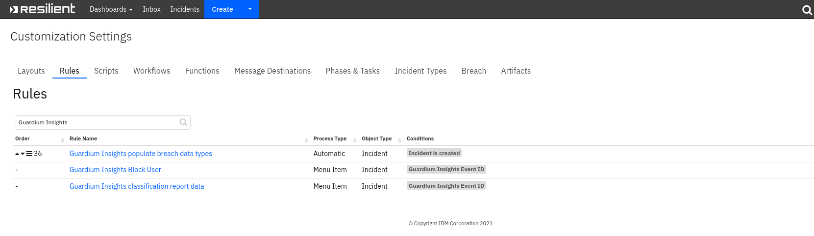
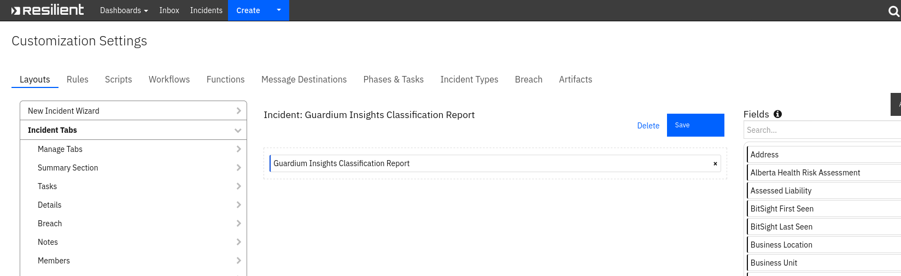
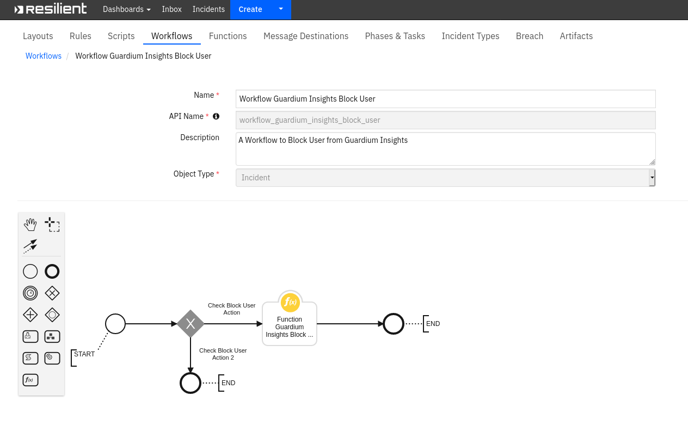
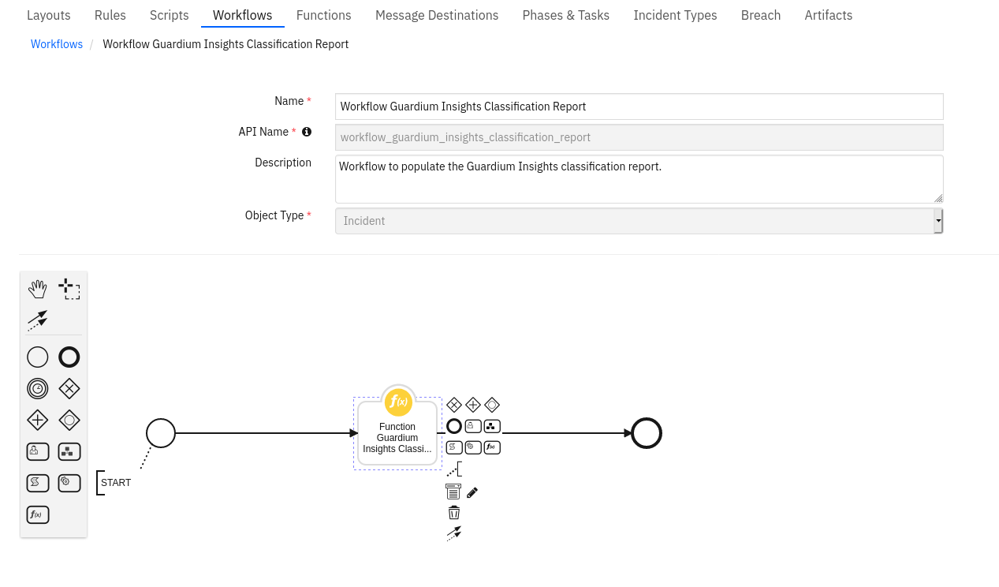
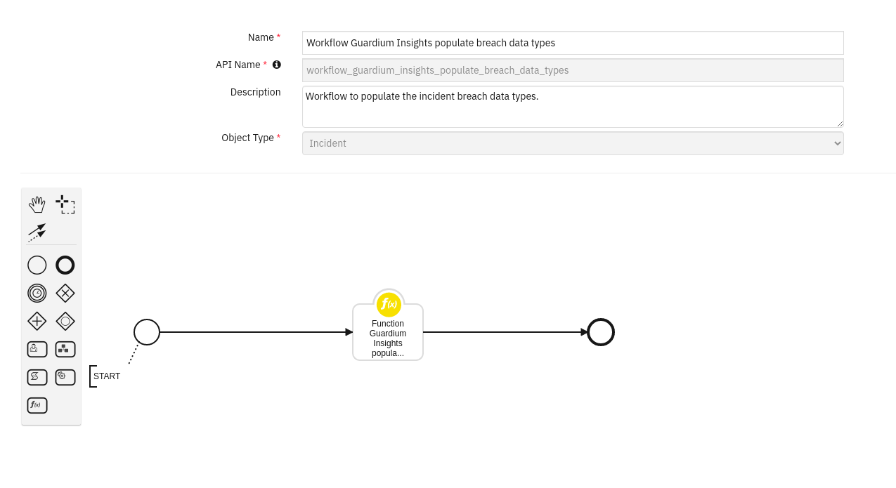
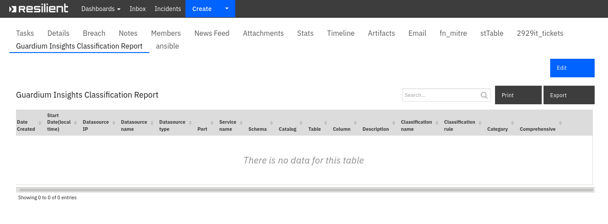

<!--
  This README.md is generated by running:
  "resilient-sdk docgen -p fn_guardium_insights_integration"

  It is best edited using a Text Editor with a Markdown Previewer. VS Code
  is a good example. Checkout https://guides.github.com/features/mastering-markdown/
  for tips on writing with Markdown

  If you make manual edits and run docgen again, a .bak file will be created

  Store any screenshots in the "doc/screenshots" directory and reference them like:
  

  NOTE: If your app is available in the container-format only, there is no need to mention the integration server in this readme.
-->

# Guardium Insights Integration

## Table of Contents

- [Release Notes](#release-notes)
- [Overview](#overview)
    - [Key Features](#key-features)
- [Requirements](#requirements)
    - [Resilient platform](#resilient-platform)
    - [Cloud Pak for Security](#cloud-pak-for-security)
    - [Proxy Server](#proxy-server)
    - [Python Environment](#python-environment)
- [Installation](#installation)
    - [App Host](#app-host)
    - [Integration Server](#integration-server)
    - [App Configuration](#app-configuration)
    - [Custom Layouts](#custom-layouts)
- [Function - Function Guardium Insights Block User](#function---function-guardium-insights-block-user)
- [Function - Function Guardium Insights Classification Report](#function---function-guardium-insights-classification-report)
- [Function - Function Guardium Insights populate breach data types](#function---function-guardium-insights-populate-breach-data-types)
- [Data Table - Guardium Insights Classification Report](#data-table---guardium-insights-classification-report)
- [Custom Fields](#custom-fields)
- [Rules](#rules)
- [Troubleshooting & Support](#troubleshooting--support)

---

## Release Notes

<!--
  Specify all changes in this release. Do not remove the release 
  notes of a previous release
-->

| Version | Date | Notes |
| ------- | ---- | ----- |
| 1.0.0 | 08/2021 | Initial Release |

---

## Overview

<!--
  Provide a high-level description of the function itself and its remote software or application.
  The text below is parsed from the "description" and "long_description" attributes in the setup.py file
-->
**Resilient Circuits Components for 'fn_guardium_insights_integration'**



Resilient Circuits Components for 'fn_guardium_insights_integration'

### Key Features

<!--
  List the Key Features of the Integration
-->

* Automatic Resilient incident's creation based on realtime anomalies generated in Guardium Insights.

* Block a specifiec user from Resilient

* Generate classification report

* Automatically populate the breach data types based on classification report data.

* Automatically create artifacts based on anomalies data in each created incident.

* Enrich who, what, when, where information for each created incidents.

    
---

## Requirements

<!--
  List any Requirements 
-->
This app supports the IBM Resilient SOAR Platform and the IBM Cloud Pak for Security.

### Resilient platform

The Resilient platform supports two app deployment mechanisms, App Host and integration server.

If deploying to a Resilient platform with an App Host, the requirements are:

* Resilient platform >= `36.0.5634`.
* The app is in a container-based format (available from the AppExchange as a `zip` file).

If deploying to a Resilient platform with an integration server, the requirements are:

* Resilient platform >= `36.0.5634`.
* The app is in the older integration format (available from the AppExchange as a `zip` file which contains a `tar.gz`
  file).
* Integration server is running `resilient_circuits>=37.0.0`.
* If using an API key account, make sure the account provides the following minimum permissions:

| Name | Permissions | 
| ---- | ----------- | 
| Org Data | Read | 
| Function | Read |
|Incident|Create, Read, Edit Member|
|Incident fields, Artifacts, Attachments, Milestones, Datatables|Edit|
|Notes|Edit|

The following Resilient platform guides provide additional information:

* _App Host Deployment Guide_:provides installation, configuration, and troubleshooting information, including proxy
  server settings.
* _Integration Server Guide_: provides installation, configuration, and troubleshooting information, including proxy
  server settings.
* _System Administrator Guide_: provides the procedure to install, configure and deploy apps.

The above guides are available on the IBM Knowledge Center at [ibm.biz/resilient-docs](https://ibm.biz/resilient-docs).
On this web page, select your Resilient platform version. On the follow-on page, you can find the _App Host Deployment
Guide_ or _Integration Server Guide_ by expanding **Resilient Apps** in the Table of Contents pane. The System
Administrator Guide is available by expanding **System Administrator**.

### Cloud Pak for Security

If you are deploying to IBM Cloud Pak for Security, the requirements are:

* IBM Cloud Pak for Security >= 1.4.
* Cloud Pak is configured with an App Host.
* The app is in a container-based format (available from the AppExchange as a `zip` file).

The following Cloud Pak guides provide additional information:

* _App Host Deployment Guide_: provides installation, configuration, and troubleshooting information, including proxy
  server settings. From the Table of Contents, select Case Management and Orchestration & Automation > **Orchestration
  and Automation Apps**.
* _System Administrator Guide_: provides information to install, configure, and deploy apps. From the IBM Cloud Pak for
  Security Knowledge Center table of contents, select Case Management and Orchestration & Automation > **System
  administrator**.

These guides are available on the IBM Knowledge Center at [ibm.biz/cp4s-docs](https://ibm.biz/cp4s-docs). From this web
page, select your IBM Cloud Pak for Security version. From the version-specific Knowledge Center page, select Case
Management and Orchestration & Automation.

### Proxy Server

The app **does** support a proxy server. proxy server configuration should done via app.configuration file.

### Python Environment

Both Python 2.7 and Python 3.6 are supported. Additional package dependencies may exist for each of these packages:

* resilient_circuits>=37.0.0
* resilient_lib>=37.0.0'
* resilient>=37.0.0
* circuits>=3.2
* six>=1.15.0
* requests>=2.25.0
* pytz>=2020.5

---

## Installation

### App Host

All the components for running this integration in a container already exist when using the App Host app.

To install,

* Navigate to Administrative Settings and then the Apps tab.
* Click the Install button and select the downloaded file: app-fn_guardium_insights_integration-x.x.x.zip.
* Go to the Configuration tab and edit the app.config file, editing the url, access credentials, etc.

| Config | Required | Example | Description |
| ------ | :------: | ------- | ----------- |
| **datatable_id** | Yes | `guardium_insights_classification_report` | *Resilient data table to hold classification
report data* |
| **insights_host** | Yes | `` | *Guardium Insights IP/DNS* |
| **rest_service_port** | Yes | `8443` | *Guardium Insights Restful Service port, By Default 8443* |
| **insights_encoded_token** | Yes | `` | *Guardium Insights Restful service API Key Configuration.* |
| **analytics_poll_time** | Yes | `` | *Periodic time interval to fetch anomalies from GI, poll time should be
configured in seconds.* |
| **report_period** | yes | `Now minus 7 days`| *classification report period, to populate breach data types data.
values can be `Now minus 3 hours`,`Now minus 24 hours`, `Now minus 7 days`,`Now minus 14 days`*|
| **report_fetch_size** | yes | 500 | *Maximum classification report records size.*|
| **incident_member** | Yes |``| *Incident member to be added, for new created anomaly incidents. value can be group name, individual user account. If multiple value specified each should be separated by comma ex: user@domain.com, group_name.* |
| **proxy** | Yes | `` | *Guardium http/https proxy server address, leave blank for no proxy.* |
| **insights_ca_file** | Yes | `false` | *Mention certificate path for SSL/TSL. Default Disabled.* |
| **enable_firewall_auth** | Yes | `false` | *false - disable firewall authentication, true - enable firewall authentication.* |
| **bso_ip** | Yes | `` | *Firewall Server IP Address.* |
| **bso_user** | Yes | `` | *Firewall Auth User Name, should be given if `enable_firewall_auth=true`.* |
| **bso_password** | Yes | `` | *irewall Auth Password, should be given if `enable_firewall_auth=true`.* |

### Integration Server

* Download the `app-fn_guardium_insights_integration-x.x.x.zip`.
* Copy the `.zip` to your Integration Server and SSH into it.
* **Unzip** the package:
  ```
  $ unzip app-fn_guardium_insights_integration-x.x.x.zip
  ```
* **Install** the package:
  ```
  $ pip install fn_guardium_insights_integration-x.x.x.tar.gz
  ```
* Import the **configurations** into your app.config file:
  ```
  $ resilient-circuits config -u
  ```
* Import the fn_guardium_insights_integration **customizations** into the Resilient platform:
  ```
  $ resilient-circuits customize -y -l fn-guardium-insights-integration
  ```
* Open the config file, scroll to the bottom and edit your fn_ansible_tower configurations:
  ```
  $ nano ~/.resilient/app.config
  ```

### App Configuration

| Config | Required | Example | Description |
| ------ | :------: | ------- | ----------- |
| **datatable_id** | Yes | `guardium_insights_classification_report` | *Resilient data table to hold classification
report data* |
| **insights_host** | Yes | `` | *Guardium Insights IP/DNS* |
| **rest_service_port** | Yes | `8443` | *Guardium Insights Restful Service port, By Default 8443* |
| **insights_encoded_token** | Yes | `` | *Guardium Insights Restful service API Key Configuration.* |
| **analytics_poll_time** | Yes | `` | *Periodic time interval to fetch anomalies from GI, poll time should be
configured in seconds.* |
| **report_period** | yes | `Now minus 7 days`| *classification report period, to populate breach data types data.
values can be `Now minus 3 hours`,`Now minus 24 hours`, `Now minus 7 days`,`Now minus 14 days`*|
| **report_fetch_size** | yes | 500 | *Maximum classification report records size.*|
| **incident_member** | Yes | `` |*Incident member to be added, for new created anomaly incidents. value can be group
name, individual user account. If multiple value specified each should be separated by comma ex: user@domain.com,
group_name.* 


| **proxy** | Yes | `` | *Guardium http/https proxy server address, leave blank for no proxy.* |
| **insights_ca_file** | Yes | `false` | *Mention certificate path for SSL/TSL. Default Disabled.* |
| **enable_firewall_auth** | Yes | `false` | *false - disable firewall authentication, true - enable firewall
authentication.* |
| **bso_ip** | Yes | `` | *Firewall Server IP Address.* |
| **bso_user** | Yes | `` | *Firewall Auth User Name, should be given if `enable_firewall_auth=true`.* |
| **bso_password** | Yes | `` | *irewall Auth Password, should be given if `enable_firewall_auth=true`.* |

* **Save** and **Close** the app.config file.

**Run** resilient-circuits or restart the Service on Windows/Linux:

  ```
  $ resilient-circuits run
  ```

### Custom Layouts

<!--
  Use this section to provide guidance on where the user should add any custom fields and data tables.
  You may wish to recommend a new incident tab.
  You should save a screenshot "custom_layouts.png" in the doc/screenshots directory and reference it here
-->

* Import the Data Tables and Custom Fields like the screenshot below:

  

---

## Function - Function Guardium Insights Block User

A Function to Block User From Guardium Insights.



<details><summary>Inputs:</summary>
<p>

| Name | Type | Required | Example | Tooltip |
| ------ | :------: | ------- | ----------- |--------|
|`input_field_guardium_insights_config_id`| `text` | YES | `-` | - |
|`input_field_guardium_insights_guardium_id` | `text` | YES | `-` |  - |
|`input_field_guardium_insights_what` | `text` | YES | `-` |  - |
|`input_field_guardium_insights_who` | `text` | YES | `-`| - |

</p>
</details>

<details><summary>Outputs:</summary>
<p>

```python
results = {
    # TODO: Copy and paste an example of the Function Output within this code block.
    # To view the output of a Function, run resilient-circuits in DEBUG mode and invoke the Function. 
    # The Function results will be printed in the logs: "resilient-circuits run --loglevel=DEBUG"
  
}
```

</p>
</details>

<details><summary>Example Pre-Process Script:</summary>
<p>

```python
inputs.input_field_guardium_insights_config_id = incident.properties.field_guardium_insights_config_id
inputs.input_field_guardium_insights_guardium_id = incident.properties.field_guardium_insights_global_id
inputs.input_field_guardium_insights_who = incident.properties.field_guardium_insights_who
inputs.input_field_guardium_insights_what = incident.properties.field_guardium_insights_what
```

</p>
</details>

<details><summary>Example Post-Process Script:</summary>
<p>

```python
import re
notes_string = u"Block user action successful\n"
content = results.get("value", {}).get("content", {})
for k, v in content.items():
    notes_string += u"{}: {}\n".format(k, str(v))
inputs_data = results.get("value", {}).get("inputs", {})
for k, v in inputs_data.items():
    if k == "what":
        for sub_k, sub_v in v.items():
            notes_string += u"{}: {}\n".format(re.sub("_", " ", sub_k).title(), sub_v)
    else:
        notes_string += u"{}: {}\n".format(re.sub("_", " ", k).title(), v)
incident.addNote(notes_string)
```

</p>
</details>

---

## Function - Function Guardium Insights Classification Report

A function to get classification report data.



<details><summary>Inputs:</summary>
<p>

| Name | Type | Required | Example | Tooltip |
| ------ | :------: | ------- | ----------- |--------|
|`incident_id` | `number`| Yes| `-`| - |
| `input_field_guardium_insights_fetch_size`| `number`| Yes| `-`| - |
| `input_field_guardium_insights_from_date`| `datetimepicker`| Yes| `-`| - |
|  `input_field_guardium_insights_to_date`| `datetimepicker`| Yes| `-`| - |
| `input_field_guardium_insights_what`| `text`| No| `-`| - |
| `input_field_guardium_insights_who`| `text`| No| `-`| - |
</p>
</details>

<details><summary>Outputs:</summary>
<p>

```python
results = {
    # TODO: Copy and paste an example of the Function Output within this code block.
    # To view the output of a Function, run resilient-circuits in DEBUG mode and invoke the Function. 
    # The Function results will be printed in the logs: "resilient-circuits run --loglevel=DEBUG"
}
```

</p>
</details>

<details><summary>Example Pre-Process Script:</summary>
<p>

```python
inputs.incident_id = incident.id
inputs.input_field_guardium_insights_who = incident.properties.field_guardium_insights_who
inputs.input_field_guardium_insights_what = incident.properties.field_guardium_insights_what
inputs.input_field_guardium_insights_from_date = rule.properties.act_field_guardium_insights_from_date
inputs.input_field_guardium_insights_to_date = rule.properties.act_field_guardium_insights_to_date
inputs.input_field_guardium_insights_fetch_size = rule.properties.act_field_guardium_insights_fetch_size
```

</p>
</details>

<details><summary>Example Post-Process Script:</summary>
<p>

```python
report_st = results.get("value").get("reason")
incident.addNote(report_st)
```

</p>
</details>

---

## Function - Function Guardium Insights populate breach data types
A function to populate the incident breach data types.

 

<details><summary>Inputs:</summary>
<p>

| Name | Type | Required | Example | Tooltip |
| ------ | :------: | ------- | ----------- |----|
| `incident_id` | `number` | Yes | `-` | - |
| `input_field_guardium_insights_what` | `text` | No | `-` | - |
| `input_field_guardium_insights_who` | `text` | No | `-` | - |

</p>
</details>

<details><summary>Outputs:</summary>
<p>

```python
results = {
    # TODO: Copy and paste an example of the Function Output within this code block.
    # To view the output of a Function, run resilient-circuits in DEBUG mode and invoke the Function. 
    # The Function results will be printed in the logs: "resilient-circuits run --loglevel=DEBUG"
}
```

</p>
</details>

<details><summary>Example Pre-Process Script:</summary>
<p>

```python
inputs.incident_id = incident.id
inputs.input_field_guardium_insights_who = incident.properties.field_guardium_insights_who
inputs.input_field_guardium_insights_what = incident.properties.field_guardium_insights_what
```

</p>
</details>

<details><summary>Example Post-Process Script:</summary>
<p>

```python
None
```

</p>
</details>

---


## Data Table - Guardium Insights Classification Report



#### API Name:

guardium_insights_classification_report

#### Columns:

| Column Name | API Access Name | Type | Tooltip |
| ----------- | --------------- | ---- | ------- |
| Catalog | `gi_dt_cl_catalog` | `text` | - |
| Category | `gi_dt_cl_category` | `text` | - |
| Classification name | `gi_dt_cl_classification_name` | `text` | - |
| Classification rule | `gi_dt_cl_classification_rule` | `text` | - |
| Column | `gi_dt_cl_column` | `text` | - |
| Comprehensive | `gi_dt_cl_comprehensive` | `text` | - |
| Datasource IP | `gi_dt_cl_datasource_ip` | `text` | - |
| Datasource name | `gi_dt_cl_datasource_name` | `text` | - |
| Datasource type | `gi_dt_cl_datasource_type` | `text` | - |
| Date Created | `gi_dt_cl_date_created` | `datetimepicker` | - |
| Description | `gi_dt_cl_description` | `text` | - |
| Port | `gi_dt_cl_port` | `text` | - |
| Schema | `gi_dt_cl_schema` | `text` | - |
| Service name | `gi_dt_cl_service_name` | `text` | - |
| Start Date(local time) | `gi_dt_cl_start_datelocal_time` | `datetimepicker` | - |
| Table | `gi_dt_cl_table` | `text` | - |

---

## Custom Fields

| Label | API Access Name | Type | Prefix | Placeholder | Tooltip |
| ----- | --------------- | ---- | ------ | ----------- | ------- |
| what | `field_guardium_insights_what` | `text` | `properties` | - | - |
| when | `field_guardium_insights_when` | `text` | `properties` | - | - |
| Guardium Insights Config ID | `field_guardium_insights_config_id` | `text` | `properties` | - | - |
| where | `field_guardium_insights_where` | `text` | `properties` | - | - |
| Guardium Insights Event ID | `guardium_insights_event_id` | `text` | `properties` | - | - |
| who | `field_guardium_insights_who` | `text` | `properties` | - | - |
| Guardium Insights Global ID | `field_guardium_insights_global_id` | `text` | `properties` | - | - |
| why | `field_guardium_insights_why` | `text` | `properties` | - | - |

---

## Rules

| Rule Name | Object | Workflow Triggered |
| --------- | ------ | ------------------ |
| Guardium Insights Block User | incident | `workflow_guardium_insights_block_user` |
| Guardium Insights classification report data | incident | `workflow_guardium_insights_classification_report` |

---

## Troubleshooting & Support

Refer to the documentation listed in the Requirements section for troubleshooting information.

### For Support

This is a IBM Community provided App. Please search the Community https://ibm.biz/resilientcommunity for assistance.
