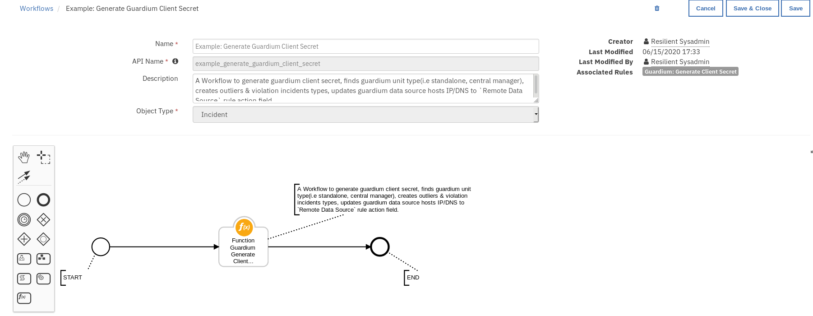

## Guardium Integration Application for IBM Resilient.
## Table of Contents - 
 - [About this package](#about-this-package)    
 - [Prerequisites](#prerequisites)    
 - [Installation](#installation)
 - [Configuration](#configuration)
 - [Resilient Configurations](#resilient-configurations)
 - [Rules](#rules)
 - [Run Application](#run-application)
 - [Application Usage and Details](#application-usage-and-details)

## About this package
**This package provides the following features to the Resilient platform.**
1. Run Active Risk Spotter - Risky Users Scores.
2. Search for Entitlements to Sensitive Objects.
3. Search for User Outlier Details.
4. List Parameter Names By Report Name.
5. Search All Guardium Reports.
6. Block User from Data Source.
7. Generate Guardium Client Secret from Resilient.

## Use Cases
1) Enrich existing Resilient incidents with reporting data from Guardium Data Protection. These incidents do not have to be created by Guardium as there will be instances where Guardium data (for example, risky user names/IPs, risky database tables, sources of sensitive data, user anomalies) could be useful for an investigation, playbook and/or remediation.

2) Blocking a risky user or IP address in databases using Guardium Data Protection's blocking feature. A Resilient user needs to make sure to block the right user name or IP address and not the connection between an application and the database, which can stop the application from running.

## Prerequisites
* Resilient platform >= v34.0.5261
* Integrations Server running Resilient Circuits >= v35.0.203
* circuits>=3.2
* requests>=2.23.0
* resilient-lib>=35.0.203
* paramiko>=2.7.1
* six>=1.14.0
* paramiko_expect>=0.2.8

## Installation
This package requires that it is installed on a RHEL or CentOS platform and uses the Resilient Circuits framework.

* Download the .tar.gz file from the App Exchange and extract it.
* Copy the `fn_guardium_integration-<version>.tar.gz` file to your Integration Server.
* To install the package, run:
    `pip install fn_guardium_integration-<version>.tar.gz`
* To import the function, example rules, message destinations, workflows, data tables and custom incident fields into your Resilient platform run:
    `resilient-circuits customize -y -l fn-guardium-integration`
* To uninstall a function from the Resilient platform, run the following:
    `pip uninstall fn_guardium_integration`

## Configuration
Run the following command to generate the `[fn_guardium_integration]` configuration section in the Resilient app.config file:
`resilient-circuits config[-u/-c]` 

The following Guardium Integration configuration data is added:

```
[fn_guardium_integration]
# Search results data table ID, should not be changed
search_table=guardium_search_report_data

# Search Sensitive objects table ID, should not be changed
sensitive_table=grd_sensitive_objects

# Search Outlier Details table ID, should not be changed
outlier_table=grd_outlier_details

# false - disable firewall authentication, true - enable firewall authentication
enable_firewall_auth=false

# Firewall Server IP Address
bso_ip=

# Firewall Auth User Name, should be given if `enable_firewall_auth=true`
bso_user=

# Firewall Auth Password, should be given if `enable_firewall_auth=true`
bso_password=

# Guardium http/https proxy server address, leave blank for no proxy
# Example https://proxy_server.com:8080
proxy=

# Guardium proxy used to generate client secret through ssh and cli user
#the command that should be executed and used as the proxy.
# example: /usr/bin/nc --proxy proxy.bar.com:8080 target_host target_port
proxy_command=

# Guardium Host IP/DNS
guardium_host=

# Guardium Restful service port.
port=8443

# Guardium User Name
guardium_user=

# Guardium password
guardium_password=

# SSL/TLS
guardium_cert=false

# Q-Radar Block group, The group which will be used to block the user access to database
q_radar_block_group=

# Q-Radar block group policy Name
block_policy_name=

# The following parameters 'cli_user' and 'cli_password' are used for the package selftest function.
# These parameters should be defined only when the package selftest functionality is being used.
cli_user=
cli_password=
```
Edit the [fn_guardium_integration] as follows:
1. *search_table:* Field should not be altered.
2. *sensitive_table:* Field should not be altered.
3. *outlier_table:* Field should not be altered.
4. *enable_firewall_auth:* If Guardium is behind the firewall and needs firewall authentication to access the system, you must set this parameter. If set to `true`, to enable firewall authentication. Set to `false`, to disable firewall authentication.
5. *bso_ip:* if *enable_firewall_auth* is set to `true` then add the firewall IP Address.
6. *bso_user:* if *enable_firewall_auth* is set to `true` then update the firewall Authentication User.
7. *bso_password:* if *enable_firewall_auth* is set to `true` then update the firewall Authentication Password.
8. *proxy:* Guardium http/https proxy server address, leave blank for no proxy.
9. *proxy_command:* The proxy command to generate the client secret if a proxy is being used. Can be left blank if no proxy .Ex: `/usr/bin/nc --proxy proxy.bar.com:8080 target_host target_port`
10. *guardium_host:* Guradium host IP/DNS.
11. *port:* Guardium Restful service port. Default is 8443.
12. *guardium_user:* Guardium username, which is used to generate an access token from Guardium.
13. *guardium_password:* Guardium password used to generate an access token from Guardium.
14. *guardium_cert:* Guardium certificate. Use a TSL/SSL certificate path if required.
15. *q_radar_block_group:* Guardium group used for blocking a user from Data Source.
16. *block_policy_name:* Guardium policy used for blocking a user from Data Source. This policy should be installed in the Guardium system.
17. *cli_user:* Parameter used for the selftest function package only; parameter should be defined only when the package selftest functionality is used.
18. *cli_password:* Parameter used for the selftest function package only; parameter should be defined only when the package selftest functionality is used.

## Resilient Configurations
### Add Results table
To add data tables to incident tabs, use the following steps.
1. Log in to the Resilient platform and navigate to the Customization Settings tab.
    
2. Navigate to Layout settings and click on Incident Tabs then select the Details Incident Tab.
    
3. Add a Header block and name it `Guardium Results`.
4. Drag and drop the data tables, `Guardium Search Report Data`, `Outlier Details`, and `Sensitive Objects`. and When done, save the tab.

    

### Add Customized Incident Fields
To add custom incident fields to incident tabs, use the following steps.
1. Navigate to Customization Settings tab.
    
    
2. Navigate to Layout settings and click on Incident Tabs then select the Details Incident Tab.
    
    
3. Drag and drop the following fields to the selected tab, [*server*, *database_type*, *os_user*, *client_hostname*, *client_ip*, *database*, *source_program*,  *db_user*,  *confidence_score*,  *rare_or_new_behavior*, *diverse_behavior*, *unusual_working_hours*,  *high_volume_outlier*, *vulnerable_obj_outlier*,  *error_outlier*, *ongoing_outlier*, *privileged_user*]. When done, save the tab.

   

## Rules
Rules configurations are listed below, please verify Resilient rules section after package customization.
| Rule Name | Object Type | Workflow Triggered |Activity Fields| Condition |
| --------- | ---------| ------------------ |---------------|--------------|
|Guardium: 1. Run Active Risk Spotter - Risky Users Scores|Incident |Example: Guardium Search Report |`Enter Period From`, `Enter Period To`, `fetch size`|None|
|Guardium: 2. Search for Entitlements to Sensitive Objects|Incident|Example: Guardium Search Report |`Enter Period From`, `Enter Period To`|`Incident Type != Guardium Outliers`|
|Guardium: 3. Search for User Outlier Details|Incidetn|Example: Guardium Search Outlier Details |`Enter Period From`, `Enter Period To`|`Incident Type != Guardium Policy violations`|
|Guardium: 4A. List Parameter Names By Report Name|Incident |Example: Guardium List Parameter Names by Report Name |`Select Report`|None|
|Guardium: 4B. Search All Guardium Reports | Incident|Example: Guardium Search Report |`Select Report`, `Enter Period From`, `Enter Period To`, `fetch size`,`Show Aliases`,`Remote Data Source`,`Parameter label`,`Parameter value`,`Sort Column`,`Sort Type`|None|
|Guardium: 5. Block User from Data Source|Incident|Example: Guardium Block User Access to DB|`DB User Name`|None|
|Guardium: Generate Client Secret | Incident |Example: Generate Guardium Client Secret | `Guardium Cli User`, `Guardium Cli Password`|None|

## Run Application
* Start Resilient Circuits by executing the following command.
`resilient-circuits run`

## Application Usage and Details
### Guardium: Generate Client Secret:
#### Function Guardium Generate Client Secret
The function should only be executed after a fresh installation of the Guardium integration or after upgrading the Guardium system. 
The function generates the Guardium client secret and client ID. The function also detects the Guardium system unit type (standalone or central manager type) and updates the search function remote datasource option as per the available Guardium hosts.
The system details acquired by the function are used to generate a Guardium access token. This is used in successive API calls from the Resilient integration.
The Resilient field, **guardium_system_reference**, is used to store the client secret data.

#### Function Workflow:

#### Example: Generate Guardium Client Secret
This workflow can be invoked from any Resilient incident action menu.




Enter the Guardium cli user name and password and press Execute to invoke the workflow. Navigate to the Notes section of the incident and wait for the message: *Guardium client secret generation completed.*

**Note:** After generating the client secret, if the Resilient rules condition section has in-consistencies as shown below in red, customize the package once again to resolve the issue.


### 1. Guardium: Run Active Risk Spotter - Risky Users Scores:
#### Function Guardium Search Report
This function is used to run the `active risk spotter - risky users scores` report. Risk scores are 0-10 with 10 being the most risky.
Learn more here: https://www.ibm.com/support/knowledgecenter/SSMPHH_11.1.0/com.ibm.guardium.doc/protect/risk_spotter_results.html

#### Function Workflow:

#### Example: Guardium Run Active Risk Spotter:
This workflow can be invoked from any Resilient incident action menu.

`Enter Period From` -  Report start Date & Time.
`Enter Period To` - Report end Date & Time.
`fetch size` - Maximum number of records to be fetched.


The returned results are used to refresh the data table, `Guardium Search Report Data`.

### Guardium: 2. Search for Entitlements to Sensitive Objects:
#### Function Guardium Search Sensitive Object
This function retrieves the sensitive objects. The returned report contains user entitlements to sensitive objects, which is useful for breach investigation and remediation.
Guardium search results from Access category are filtered by incident field values from `DB User` & `Client IP` and Guardium `Sensitive objects` group elements.

#### Function Workflow:

#### Example: Guardium Search Sensitive Objects
This workflow can be invoked from any Resilient incident action menu except for incidents of type `Guardium Outliers`.
`Enter Period From` -  Report start Date & Time.
`Enter Period To` - Report end Date & Time.


The returned results are used to refresh the data table, `Sensitive Objects`.

### Guardium: 3. Search for User Outlier Details:
#### Function Guardium Search Outlier Details
This function retrieves the outlier details.
This report allows a user to enrich a Resilient incident with user outlier data (for instance: SQL errors, password errors, excessive download size).
Guardium Search results from Outlier category are filtered by incident field values from `Database`, `Server`, `DB User`, and `Date Discovered`.

#### Function Workflow:

#### Example: Guardium Search Outlier Details
This workflow can be invoked from any Resilient incident action menu except for incidents of type `Guardium Policy Violations`.

`Enter Period From` -  Report start Date & Time.
`Enter Period To` - Report end Date & Time.


The returned results are used to refresh the data table, `Outlier details`.

## Guardium: 4A. List Parameter Names By Report Name :
#### Function Guardium List Parameter Names by Report Name
This function is used to get the additional parameters required to run Guardium reports.
The function is used prior to executing a Guardium report to get a list of the required parameters for the execution.

#### Function Workflow:
#### Example: Guardium List Parameter Names by Report Name
This workflow can be invoked from any incident action menu. Select any report from the drop-down menu to retrieve the required list of Guardium parameters.


A note is added to the incident with information on selected report parameters.


## Guardium: 4B. Search All Guardium Reports : 
#### Function Guardium Search Report
This function is used to search Guardium reports. The function has access to all default Guardium reports.
This option is for a user who is familiar with Guardium. It allows the user to choose from any of Guardium's 600+ out of the box reports which can be used for enrichment of Resilient data. This option is under the pre-canned options as it requires knowledge of Guardium to choose the most useful reports.

#### Function Workflow:

#### Example: Guardium Search Report
This workflow can be invoked from any incident action menu.


The returned results are used to refresh the data table `Guardium Search Report Data`.

#### Guardium: 5. Block User from Data Source:
##### Function Guardium block user
This function can be used to block user access to the Database.

#### Function Workflow:

#### Example: Guardium Block User Access to DB
This workflow can be invoked from any incident actions menu.


A note is added to the incident with result of workflow.

:copyright:IBM Corp. 2010, 2020. All Rights Reserved.