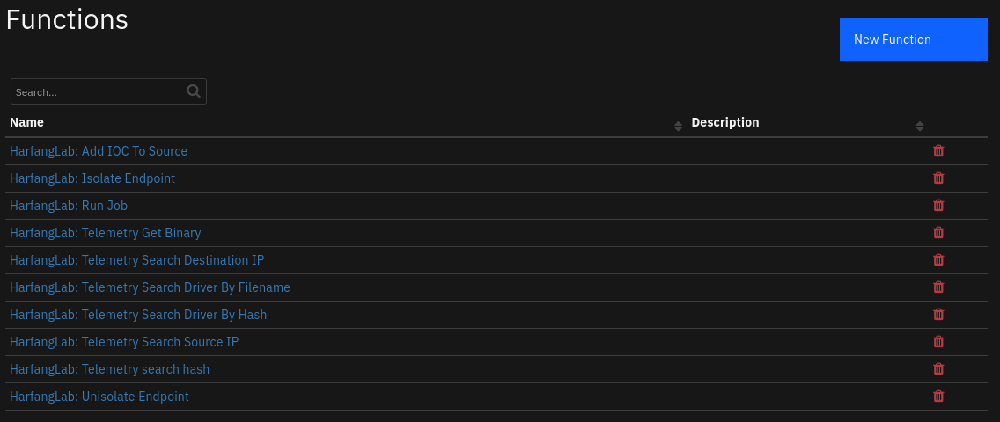
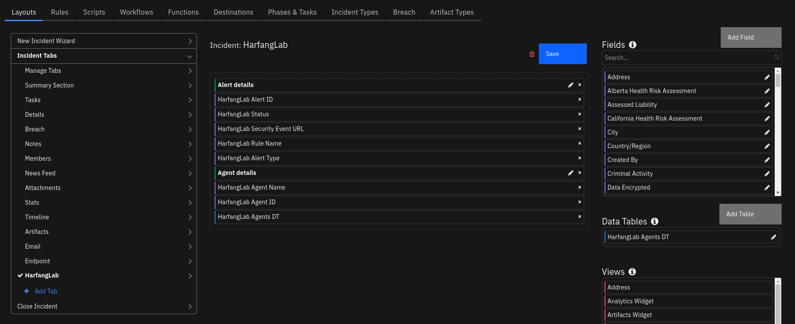
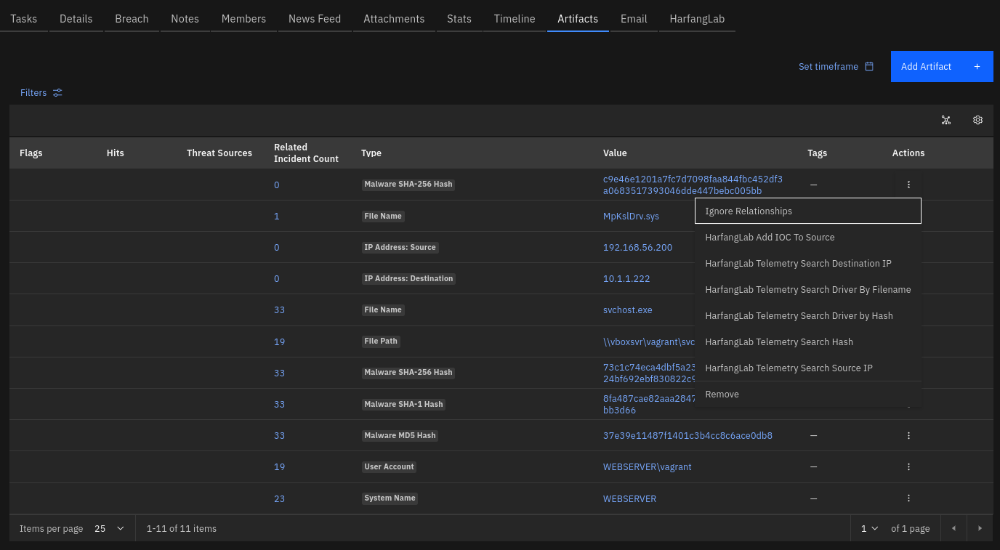
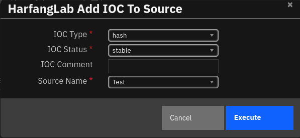
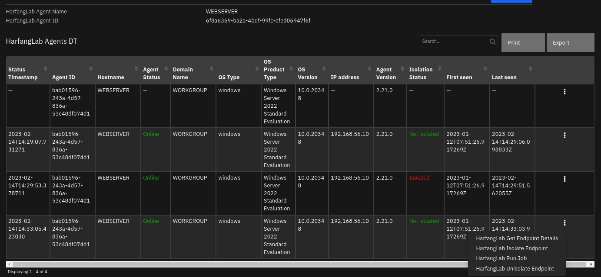
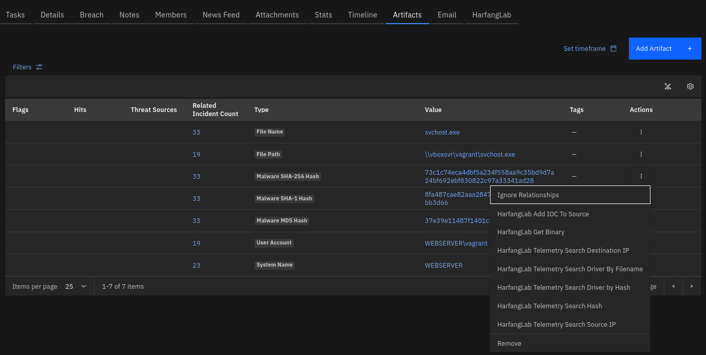
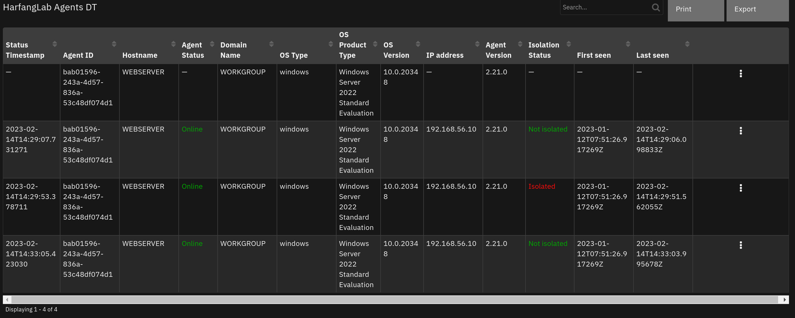

<!--
  This README.md is generated by running:
  "resilient-sdk docgen -p fn_harfanglab_edr"

  It is best edited using a Text Editor with a Markdown Previewer. VS Code
  is a good example. Checkout https://guides.github.com/features/mastering-markdown/
  for tips on writing with Markdown

  All fields followed by "::CHANGE_ME::"" should be manually edited

  If you make manual edits and run docgen again, a .bak file will be created

  Store any screenshots in the "doc/screenshots" directory and reference them like:
  

  NOTE: If your app is available in the container-format only, there is no need to mention the integration server in this readme.
-->

# HarfangLab EDR

## Table of Contents
- [Release Notes](#release-notes)
- [Overview](#overview)
  - [Key Features](#key-features)
- [Requirements](#requirements)
  - [SOAR platform](#soar-platform)
  - [Cloud Pak for Security](#cloud-pak-for-security)
  - [Proxy Server](#proxy-server)
  - [Python Environment](#python-environment)
- [Installation](#installation)
  - [Install](#install)
  - [App Configuration](#app-configuration)
  - [Custom Layouts](#custom-layouts)
- [Function - HarfangLab: Add IOC To Source](#function---harfanglab-add-ioc-to-source)
- [Function - HarfangLab: Get Endpoint Details](#function---harfanglab-get-endpoint-details)
- [Function - HarfangLab: Isolate Endpoint](#function---harfanglab-isolate-endpoint)
- [Function - HarfangLab: Run Job](#function---harfanglab-run-job)
- [Function - HarfangLab: Telemetry Get Binary](#function---harfanglab-telemetry-get-binary)
- [Function - HarfangLab: Telemetry Search Destination IP](#function---harfanglab-telemetry-search-destination-ip)
- [Function - HarfangLab: Telemetry Search Driver By Filename](#function---harfanglab-telemetry-search-driver-by-filename)
- [Function - HarfangLab: Telemetry Search Driver By Hash](#function---harfanglab-telemetry-search-driver-by-hash)
- [Function - HarfangLab: Telemetry search hash](#function---harfanglab-telemetry-search-hash)
- [Function - HarfangLab: Telemetry Search Source IP](#function---harfanglab-telemetry-search-source-ip)
- [Function - HarfangLab: Unisolate Endpoint](#function---harfanglab-unisolate-endpoint)
- [Script - fn_harfanglab_edr_post_process_agent_details_results](#script---fn_harfanglab_edr_post_process_agent_details_results)
- [Script - fn_harfanglab_edr_post_process_job_result](#script---fn_harfanglab_edr_post_process_job_result)
- [Data Table - HarfangLab Agents DT](#data-table---harfanglab-agents-dt)
- [Custom Fields](#custom-fields)
- [Playbooks](#playbooks)
- [Troubleshooting & Support](#troubleshooting--support)
- [Template Appendix](#template-appendix)

---

## Release Notes
<!--
  Specify all changes in this release. Do not remove the release
  notes of a previous release
-->
| Version | Date        | Notes |
| ------- |-------------| ----- |
| 1.0.0 | 02/2023 | Initial Release |

---

## Overview

**Fetch security events from a HarfangLab EDR Manager and manage the incident response.**

 

This connector allows to fetch security events from a HarfangLab EDR Manager and respond to any incident.


### Key Features

The HarfangLab EDR app implements the following functionalities in the IBM SOAR platform:
* Fetch security events with specific criteria (status, minimum severity...) from the HarfangLab EDR's manager and create corresponding IBM SOAR incidents;
* Create artifacts (IP addresses, DNS names, registry keys, file names...) in IBM SOAR incident from HarfangLab security events;
* Close a HarfangLab security event when the associated IBM SOAR incident is closed;
* Close an IBM SOAR incident when the associated HarfangLab security event is closed;
* Get detailed information regarding a HarfangLab agent;
* Isolate and unisolate endpoints to prevent an attacker from moving in an information system;
* Run the following investigation and remediation jobs on the endpoints:
  * getProcesses
  * getServices
  * getPipes
  * getDrivers
  * getPrefetches
  * getScheduledTasks
  * getRunKeys
  * getStartupFiles
  * getPersistence
  * getWMI
  * getNetworkShares
  * getSessions
  * getArtifactMFT
  * getArtifactHives
  * getArtifactEvtx
  * getArtifactLogs
  * getArtifactFilesystem
  * getArtifactUSN
  * getArtifactPrefetch
  * getArtifactAll
  * getArtifactRamdump
* Run hunting queries in the EDR's datalake;
* Get job results and telemetry search results as CSV files attached to incident
* Get RAW artifact files and post them as incident attachments in ZIP-protected archives
* Manage IOC source list.

---

## Requirements

This app supports the IBM Security QRadar SOAR Platform and the IBM Security QRadar SOAR for IBM Cloud Pak for Security.

### SOAR platform
The SOAR platform supports two app deployment mechanisms, Edge Gateway (formerly App Host) and integration server.

If deploying to a SOAR platform with an Edge Gateway, the requirements are:
* SOAR platform >= `45.2.43`.
* The app is in a container-based format (available from the AppExchange as a `zip` file).

If deploying to a SOAR platform with an integration server, the requirements are:
* SOAR platform >= `45.2.43`.
* The app is in the older integration format (available from the AppExchange as a `zip` file which contains a `tar.gz` file).
* Integration server is running `resilient-circuits>=47.1.0`.
* If using an API key account, make sure the account provides the following minimum permissions:

  | Name | Permissions |
  | ---- | ----------- |
  | Org Data | Read |
  | Function | Read |
  | Incident | Read, Edit, Create, Owner, Status |
  | Incident Notes | Edit |

The following SOAR platform guides provide additional information:
* _Edge Gateway Deployment Guide_ or _App Host Deployment Guide_: provides installation, configuration, and troubleshooting information, including proxy server settings.
* _Integration Server Guide_: provides installation, configuration, and troubleshooting information, including proxy server settings.
* _System Administrator Guide_: provides the procedure to install, configure and deploy apps.

The above guides are available on the IBM Documentation website at [ibm.biz/soar-docs](https://ibm.biz/soar-docs). On this web page, select your SOAR platform version. On the follow-on page, you can find the _Edge Gateway Deployment Guide_, _App Host Deployment Guide_, or _Integration Server Guide_ by expanding **Apps** in the Table of Contents pane. The System Administrator Guide is available by expanding **System Administrator**.

### Cloud Pak for Security
If you are deploying to IBM Cloud Pak for Security, the requirements are:
* IBM Cloud Pak for Security >= `1.8`.
* Cloud Pak is configured with an Edge Gateway.
* The app is in a container-based format (available from the AppExchange as a `zip` file).

The following Cloud Pak guides provide additional information:
* _Edge Gateway Deployment Guide_ or _App Host Deployment Guide_: provides installation, configuration, and troubleshooting information, including proxy server settings. From the Table of Contents, select Case Management and Orchestration & Automation > **Orchestration and Automation Apps**.
* _System Administrator Guide_: provides information to install, configure, and deploy apps. From the IBM Cloud Pak for Security IBM Documentation table of contents, select Case Management and Orchestration & Automation > **System administrator**.

These guides are available on the IBM Documentation website at [ibm.biz/cp4s-docs](https://ibm.biz/cp4s-docs). From this web page, select your IBM Cloud Pak for Security version. From the version-specific IBM Documentation page, select Case Management and Orchestration & Automation.

### Proxy Server
The app supports a proxy server for http and https protocols.

### Python Environment
Python 3.6 and Python 3.9 are supported.
Additional package dependencies may exist for each of these packages:
* DateTime==4.7
* python-dateutil==2.8.2
* requests==2.28.1
* resilient-circuits>=47.1.0
* jinja2
* Markdown==3.4.1
* pyminizip==0.2.6

### Development Version

This app has been implemented using:

| Product Name | Product Version | API URL |
| ------------ |-----------------| ------- |
| HarfangLab EDR | v2.21           | `https://<your stack>:8443/configuration/api-doc` |

#### Prerequisites
<!--
List any prerequisites that are needed to use with this endpoint solution. Remove any section that is unnecessary.
-->
* A HarfangLab EDR platform with a user account having permissions to read security events, start jobs and perform searches in telemetry.

#### Configuration
<!--
List any steps that are needed to configure the endpoint to use this app.
-->
* Get an API token from the **Administration > Users** panel for the user you want to use for the IBM SOAR access.

#### Permissions
<!--
List any user permissions that are needed to use this endpoint. For example, list the API key permissions.
-->
* HarfangLab EDR admin role is required


---

## Installation

### Install
* To install or uninstall an App or Integration on the _SOAR platform_, see the documentation at [ibm.biz/soar-docs](https://ibm.biz/soar-docs).
* To install or uninstall an App on _IBM Cloud Pak for Security_, see the documentation at [ibm.biz/cp4s-docs](https://ibm.biz/cp4s-docs) and follow the instructions above to navigate to Orchestration and Automation.

### App Configuration
The following table provides the settings you need to configure the app. These settings are made in the app.config file. See the documentation discussed in the Requirements section for the procedure.

| Config                       | Required | Example                                | Description                                                                                                                               |
|------------------------------|:--------:|----------------------------------------|-------------------------------------------------------------------------------------------------------------------------------------------|
| **api_url**                  |   Yes    | `https://hurukai:8443/`                | *HarfangLab EDR Manager's URL*                                                                                                            |
| **api_key**                  |   Yes    | `<api key>`                            | *HarfangLab EDR's API key*                                                                                                                |
| **verify**                   |   Yes    | `false`                                | *Specify whether the HarfangLab API certificate must be verified ('false' or 'true').*                                                    |
| **http_proxy**               |    No    | `http://my-proxy:3128/`                | *Specify the proxy URL to use for HTTP connections.*                                                                                      |
| **https_proxy**              |    No    | `http://my-proxy:3128/`                | *Specify the proxy URL to use for HTTPs connections.*                                                                                     |
| **first_fetch**              |   Yes    | `1000`                                 | *Start fetching alerts whose creation date is higher than now minus <first_fetch> days.*                                                  |
| **polling_interval**         |    No    | `60`                                   | *Polling interval to fetch security events (comment out or 0 to disable polling).*                                                        |
| **first_fetch**              |    No    | `60`                                   | *Start fetching alerts whose creation date is higher than now minus <first_fetch> days.*                                                  |
| **alert_status**             |    No    | `ACTIVE`                               | *Indicates what type of alert to fetch (ACTIVE for new, investigating.. events, CLOSED for closed and false_positive events).*            |
| **alert_type**               |    No    | `sigma,yara`                           | *Comma-separated list of types of alerts to fetch (sigma, yara, hlai, vt, ransom, ioc, glimps, orion...). Do not put spaces in the list.* |
| **min_severity**             |    No    | `High`                                 | *Minimum severity of alerts to fetch.*                                                                                                    |
| **max_fetch**                |    No    | `25`                                   | *Maximum number of alerts to fetch.*                                                                                                      |
| **job_timeout**              |    No    | `600`                                  | *Maximum time to wait for a job to finish (in seconds).*                                                                                  |
| **archive_password**         |    No    | `infected`                             | *Password to use to protect ZIP archives containing artifacts mainly to avoid AV detections (default to "infected")*                       |
| **create_incident_template** | No | `/path/create_incident_template.jinja` | *Path to custom create incident jinja template.*                                                                                          |
| **close_incident_template**  | No | `/path/close_incident_template.jinja`  | *Path to custom close incident jinja template.*                                                                                           |
| **update_incident_template** | No | `/path/update_incident_template.jinja` | *Path to custom update incident jinja template.*                                                                                          |
| **agent_template**           | No | `/path/agent_template.jinja`           | *Path to custom agent jinja template.*                                                                                                    |

### Custom Layouts
<!--
  Use this section to provide guidance on where the user should add any custom fields and data tables.
  You may wish to recommend a new incident tab.
  You should save a screenshot "custom_layouts.png" in the doc/screenshots directory and reference it here
-->
* Create a dedicated HarfangLab incident tab and import the Data Tables and Custom Fields like the screenshot below:

  


---

## Function - HarfangLab: Add IOC To Source
Add an IOC to a Threat Intelligence source.

 

The following form needs filling to provide specific parameters for the function:


<details><summary>Inputs:</summary>
<p>

| Name | Type | Required | Example | Tooltip |
| ---- | :--: | :------: | ------- | ------- |
| `harfanglab_ioc_comment` | `text` | No | `-` | IOC comment |
| `harfanglab_ioc_status` | `select` | No | `-` | IOC status (stable or testing) |
| `harfanglab_ioc_type` | `select` | Yes | `-` | IOC type (ip_src, ip_dst, ip_both, hash, filename, filepath) |
| `harfanglab_ioc_value` | `text` | Yes | `-` | IOC value |
| `harfanglab_source_name` | `text` | Yes | `-` | Name of the HarfangLab Threat Intelligence source to feed |

</p>
</details>

<details><summary>Outputs:</summary>
<p>

> **NOTE:** This example might be in JSON format, but `results` is a Python Dictionary on the SOAR platform.

```python
results = {
  "content": null,
  "inputs": {
    "harfanglab_ioc_comment": "",
    "harfanglab_ioc_status": "testing",
    "harfanglab_ioc_type": "hash",
    "harfanglab_ioc_value": "73c1c74eca4dbf5a234f558aa9c35bd9d7a24bf692ebf830822c97a33341ad28",
    "harfanglab_source_name": "Test"
  },
  "metrics": {
    "execution_time_ms": 186,
    "host": "tui",
    "package": "fn-harfanglab-edr",
    "package_version": "1.0.0",
    "timestamp": "2023-02-14 15:11:05",
    "version": "1.0"
  },
  "raw": null,
  "reason": null,
  "success": true,
  "version": 2.0
}
```

</p>
</details>

<details><summary>Example Pre-Process Script:</summary>
<p>

```python
inputs.harfanglab_ioc_value = artifact.value
inputs.harfanglab_ioc_type = playbook.inputs.harfanglab_form_ioc_type
inputs.harfanglab_source_name = playbook.inputs.harfanglab_form_source_name
#inputs.harfanglab_ioc_comment = playbook.inputs.harfanglab_form_ioc_comment
inputs.harfanglab_ioc_comment = ''
inputs.harfanglab_ioc_status = playbook.inputs.harfanglab_form_ioc_status```

</p>
</details>

<details><summary>Example Post-Process Script:</summary>
<p>

```python
None
```

</p>
</details>

---
## Function - HarfangLab: Get Endpoint Details
Get detailed information associated to an endpoint, including its physical properties, its isolation status...

 

<details><summary>Inputs:</summary>
<p>

| Name | Type | Required | Example | Tooltip |
| ---- | :--: | :------: | ------- | ------- |
| `harfanglab_agent_id` | `text` | No | `xxxxxxxx-xxxx-xxxx-xxxx-xxxxxxxxxxxx` | HarfangLab Agent ID |

</p>
</details>

<details><summary>Outputs:</summary>
<p>

> **NOTE:** This example might be in JSON format, but `results` is a Python Dictionary on the SOAR platform.

```python
results = {
  "content": {
    "additional_info": {
      "additional_info1": null,
      "additional_info2": null,
      "additional_info3": null,
      "additional_info4": null
    },
    "avg_cpu": 0.7,
    "avg_memory": 192022118.0,
    "avg_system_cpu": 12.7,
    "bitness": "x64",
    "cpu_count": 2,
    "cpu_frequency": 3191,
    "distroid": null,
    "dnsdomainname": null,
    "domain": null,
    "domainname": "WORKGROUP",
    "driver_enabled": true,
    "driver_policy": false,
    "effective_policy_id": "default_policy_id",
    "effective_policy_revision": 9,
    "external_ipaddress": "10.42.0.227",
    "firstseen": "2023-01-12T07:51:26.917269Z",
    "group_count": 0,
    "groups": [],
    "has_valid_password": false,
    "hostname": "WEBSERVER",
    "id": "bab01596-243a-4d57-836a-53c48df074d1",
    "installdate": "2023/01/12 07:47:35",
    "ipaddress": "192.168.56.10",
    "ipmask": "255.255.255.0",
    "isolation_policy": false,
    "isolation_state": false,
    "lastseen": "2023-02-14T14:33:03.995678Z",
    "lastseen_error": "2023-02-14T14:33:30.995678Z",
    "lastseen_warning": "2023-02-14T14:33:14.995678Z",
    "local_admin_count": 2,
    "local_group_count": 25,
    "local_user_count": 5,
    "machine_boottime": "2023-01-12T07:25:12Z",
    "osbuild": 20348,
    "osid": "00454-40000-00001-AA958",
    "osmajor": 10,
    "osminor": 0,
    "osproducttype": "Windows Server 2022 Standard Evaluation",
    "ostype": "windows",
    "osversion": "10.0.20348",
    "policy": {
      "audit_killswitch": false,
      "binary_download_enabled": true,
      "description": "",
      "driverblock_mode": 1,
      "feature_callback_tampering": true,
      "hibou_minimum_level": "critical",
      "hibou_mode": 0,
      "hibou_skip_signed_ms": false,
      "hibou_skip_signed_others": false,
      "hlai_minimum_level": "critical",
      "hlai_mode": 1,
      "hlai_skip_signed_ms": true,
      "hlai_skip_signed_others": false,
      "id": "default_policy_id",
      "ioc_mode": 1,
      "ioc_ruleset": null,
      "loglevel": "INFO",
      "name": "default",
      "ransomguard_alert_only": false,
      "revision": 9,
      "self_protection": false,
      "self_protection_feature_hosts": false,
      "sigma_ruleset": null,
      "sleepjitter": 10,
      "sleeptime": 5,
      "telemetry_alerts_limit": false,
      "telemetry_alerts_limit_value": 1000,
      "telemetry_driverload": true,
      "telemetry_driverload_limit": false,
      "telemetry_driverload_limit_value": 1000,
      "telemetry_log": true,
      "telemetry_log_limit": false,
      "telemetry_log_limit_value": 1000,
      "telemetry_network": true,
      "telemetry_network_limit": false,
      "telemetry_network_limit_value": 1000,
      "telemetry_on_alert_enabled": true,
      "telemetry_on_alert_post_alert_max_duration_secs": 600,
      "telemetry_on_alert_post_alert_max_event_count": 5000,
      "telemetry_on_alert_pre_alert_event_count": 5000,
      "telemetry_process": true,
      "telemetry_process_limit": false,
      "telemetry_process_limit_value": 1000,
      "telemetry_remotethread": true,
      "telemetry_remotethread_limit": false,
      "telemetry_remotethread_limit_value": 1000,
      "tenant": null,
      "use_driver": true,
      "use_isolation": true,
      "use_process_block": true,
      "use_ransomguard": true,
      "use_sigma": true,
      "use_sigma_process_block": false,
      "yara_mode": 1,
      "yara_ruleset": null,
      "yara_skip_signed_ms": true,
      "yara_skip_signed_others": false
    },
    "producttype": "server",
    "refresh_properties_status": null,
    "servicepack": null,
    "starttime": "2023-01-12T07:51:26Z",
    "status": "online",
    "telemetry": null,
    "tenant": null,
    "total_memory": 2133962752.0,
    "uninstall_status": 0,
    "update_status": 0,
    "update_type": null,
    "version": "2.21.0",
    "windows_groups_last_update": "2023-02-14T13:36:52.830718Z",
    "windows_users_last_update": "2023-02-14T13:36:52.830725Z"
  },
  "inputs": {
    "harfanglab_agent_id": "bab01596-243a-4d57-836a-53c48df074d1"
  },
  "metrics": {
    "execution_time_ms": 182,
    "host": "tui",
    "package": "fn-harfanglab-edr",
    "package_version": "1.0.0",
    "timestamp": "2023-02-14 15:33:04",
    "version": "1.0"
  },
  "raw": null,
  "reason": null,
  "success": true,
  "version": 2.0
}
```

</p>
</details>

<details><summary>Example Pre-Process Script:</summary>
<p>

```python
inputs.harfanglab_agent_id = row.harfanglab_dt_agent_id
```

</p>
</details>

<details><summary>Example Post-Process Script:</summary>
<p>

```python
import datetime

if playbook.functions.results.fn_harfanglab_get_endpoint_details_output.success:
  results = playbook.functions.results.fn_harfanglab_get_endpoint_details_output.content
  if results:
    note = u"<b>HarfangLab: Add Agent information to Data Table: </b> \n"
    agent_row = incident.addRow("harfanglab_agents_dt")
    agent_row.harfanglab_dt_status_timestamp = datetime.datetime.utcnow().isoformat()
    agent_row.harfanglab_dt_agent_id = results.get("id")
    agent_row.harfanglab_dt_hostname = results.get("hostname")
    isolated = results.get("isolation_state")
    if not isolated:
      networkStatus = 'Not isolated'
      display_color = "green"
    else:
      networkStatus = 'Isolated'
      display_color = "red"
    networkStatus = u"""<p style= "color:{color}">{status}</p>""".format(color=display_color, status=networkStatus)
    agent_row.harfanglab_dt_isolation_status = networkStatus
    agent_row.harfanglab_dt_hostname = results.get("hostname")
    agent_row.harfanglab_dt_domain_name = results.get("domainname")
    agent_row.harfanglab_dt_os_type = results.get("ostype")
    agent_row.harfanglab_dt_os_product_type = results.get("osproducttype")
    agent_row.harfanglab_dt_os_version = results.get("osversion")
    agent_row.harfanglab_dt_ip_address = results.get("ipaddress")
    agent_row.harfanglab_dt_agent_version = results.get("version")
    agent_row.harfanglab_dt_first_seen = results.get("firstseen")
    agent_row.harfanglab_dt_last_seen = results.get("lastseen")

    incident.addNote(helper.createRichText(note))

```

</p>
</details>

---
## Function - HarfangLab: Isolate Endpoint
Isolate an endpoint.

 

<details><summary>Inputs:</summary>
<p>

| Name | Type | Required | Example | Tooltip |
| ---- | :--: | :------: | ------- | ------- |
| `harfanglab_agent_id` | `text` | No | `xxxxxxxx-xxxx-xxxx-xxxx-xxxxxxxxxxxx` | HarfangLab Agent ID |
</p>
</details>

<details><summary>Outputs:</summary>
<p>

> **NOTE:** This example might be in JSON format, but `results` is a Python Dictionary on the SOAR platform.

```python
results = {
  "content": "Host bab01596-243a-4d57-836a-53c48df074d1 successfully isolated",
  "inputs": {
    "harfanglab_agent_id": "bab01596-243a-4d57-836a-53c48df074d1"
  },
  "metrics": {
    "execution_time_ms": 11028,
    "host": "tui",
    "package": "fn-harfanglab-edr",
    "package_version": "1.0.0",
    "timestamp": "2023-02-14 15:29:40",
    "version": "1.0"
  },
  "raw": null,
  "reason": null,
  "success": true,
  "version": 2.0
}
```

</p>
</details>

<details><summary>Example Pre-Process Script:</summary>
<p>

```python
inputs.harfanglab_agent_id = row.harfanglab_dt_agent_id
```

</p>
</details>

<details><summary>Example Post-Process Script:</summary>
<p>

```python
None
```

</p>
</details>

---
## Function - HarfangLab: Run Job
Run a job on a particular endpoint and upload job results as CSV file in the incident attachments (if harfanglab_ibm_soar_incident_id field is provided).
When an artifact is collected (MFT, Hives, Evtx files, etc.), it can be uploaded in the incident attachments as well in a ZIP-protected archive.
Here is the list of supported jobs:

    * getProcesses
    * getServices
    * getPipes
    * getDrivers
    * getPrefetches
    * getScheduledTasks
    * getRunKeys
    * getStartupFiles
    * getPersistence
    * getWMI
    * getNetworkShares
    * getSessions
    * getArtifactMFT
    * getArtifactHives
    * getArtifactEvtx
    * getArtifactLogs
    * getArtifactFilesystem
    * getArtifactUSN
    * getArtifactPrefetch
    * getArtifactAll
    * getArtifactRamdump


 

<details><summary>Inputs:</summary>
<p>

| Name | Type | Required | Example | Tooltip |
| ---- | :--: | :------: | ------- | ------- |
| `harfanglab_agent_id` | `text` | No | `xxxxxxxx-xxxx-xxxx-xxxx-xxxxxxxxxxxx` | HarfangLab Agent ID || `harfanglab_job_name` | `select` | No | `-` | - |
| `harfanglab_job_timeout` | `number` | No | `600` | Time to wait for a job to finish |
| `harfanglab_ibm_soar_incident_id` | `number` | No | `2001` | IBM SOAR incident id to publish result files to |

</p>
</details>

<details><summary>Outputs:</summary>
<p>

> **NOTE:** This example might be in JSON format, but `results` is a Python Dictionary on the SOAR platform.

```python
results = {
  "content": {
    "markdown": "### Process list\n|Name|Session|Username|Integrity|Pid|Ppid|Cmdline|Fullpath|Signed|Md5|Sha1|Sha256|\n|---|---|---|---|---|---|---|---|---|---|---|---|\n| AggregatorHost.exe | 0 | NT AUTHORITY\\SYSTEM | System | 2524 | 936 | AggregatorHost.exe | C:\\Windows\\System32\\AggregatorHost.exe | True | 391ed483154f77cfdad1e2e0f9ce2001 | 12fc5a711e2be5b64f6b9e2097f21d9020340708 | 6b388c39bdf2f7827b7b2287db82c9fd62e42a588f85a0bbe97ceedf4a452fc4 |\n| conhost.exe | 0 | NT AUTHORITY\\SYSTEM | System | 376 | 4344 | \\??\\C:\\Windows\\system32\\conhost.exe 0x4 | C:\\Windows\\System32\\conhost.exe | True | b03d74d481d9d64047625bec2d64a0ce | 4f1e9d9c9624298620312005cb218a9905c7690c | 6b481d656414c50d8bd0bedcd615aeaf2f5f68576cb6732a9548e0da87729733 |\n| csrss.exe | 0 | NT AUTHORITY\\SYSTEM | Unknown | 428 | 420 | %SystemRoot%\\system32\\csrss.exe ObjectDirectory=\\Windows SharedSection=1024,20480,768 Windows=On SubSystemType=Windows ServerDll=basesrv,1 ServerDll=winsrv:UserServerDllInitialization,3 ServerDll=sxssrv,4 ProfileControl=Off MaxRequestThreads=16 | C:\\Windows\\System32\\csrss.exe | True | a6c9ee45bff7c5e696b07ec41af84541 | 7821fb14835083bae87a66ce96b67b261bea6b2b | 50cbdbce85014f1042f99d5acdaad88ff268317a605bc3700b2487edd0f2ef0e |\n| csrss.exe | 1 | NT AUTHORITY\\SYSTEM | Unknown | 512 | 488 | %SystemRoot%\\system32\\csrss.exe ObjectDirectory=\\Windows SharedSection=1024,20480,768 Windows=On SubSystemType=Windows ServerDll=basesrv,1 ServerDll=winsrv:UserServerDllInitialization,3 ServerDll=sxssrv,4 ProfileControl=Off MaxRequestThreads=16 | C:\\Windows\\System32\\csrss.exe | True | a6c9ee45bff7c5e696b07ec41af84541 | 7821fb14835083bae87a66ce96b67b261bea6b2b | 50cbdbce85014f1042f99d5acdaad88ff268317a605bc3700b2487edd0f2ef0e |\n| ctfmon.exe | 1 | WEBSERVER\\vagrant | High | 2784 | 580 | ctfmon.exe | C:\\Windows\\System32\\ctfmon.exe | True | 91e5e0722b281024e60d5768ab948794 | 59672c3f95d6897a60de38391843c621ef5c66c8 | 2d0ba4fd142dd53f0cd1efbd3f09f2514df8f541ed4df27fdbc25073a8f3240e |\n| dwm.exe | 1 | Window Manager\\DWM-1 | System | 960 | 584 | dwm.exe | C:\\Windows\\System32\\dwm.exe | True | 66f552d20dcf3377279c20a119e0e72f | 74704b48412bd7c3f1aee895b6fa78a192b772cc | 644a42249d70082aa3d5e132cffa213c30547a02cf89ed688a3c4550c496109d |\n| explorer.exe | 1 | WEBSERVER\\vagrant | High | 2444 | 2188 | C:\\Windows\\Explorer.EXE | C:\\Windows\\explorer.exe | True | 7761d5917fa1adc297a5ce0cf1e242eb | dbe123d35922cdfe3eba25d197bbe44b84a47e0d | a3c36c8481af88a925bff1bb0283c028b531e1dc1167d279186a046091bf37ce |\n| fontdrvhost.exe | 1 | Font Driver Host\\UMFD-1 | Low | 768 | 584 | fontdrvhost.exe | C:\\Windows\\System32\\fontdrvhost.exe | True | dd24bac3913d47f9b35a8718aeed3cbe | 01c21d757a5668d372e711103e3a2c0f1edfe858 | 7783c67ed771fcb500f3f58cf19d5e876b7698a4584b402739c79dab260008b7 |\n| fontdrvhost.exe | 0 | Font Driver Host\\UMFD-0 | Low | 776 | 496 | fontdrvhost.exe | C:\\Windows\\System32\\fontdrvhost.exe | True | dd24bac3913d47f9b35a8718aeed3cbe | 01c21d757a5668d372e711103e3a2c0f1edfe858 | 7783c67ed771fcb500f3f58cf19d5e876b7698a4584b402739c79dab260008b7 |\n| hurukai.exe | 0 | NT AUTHORITY\\SYSTEM | System | 508 | 628 | C:\\Program Files\\HarfangLab\\hurukai.exe | C:\\Program Files\\HarfangLab\\hurukai.exe | True | c02cfc2d2e6b73d551bc570fe5c0e621 | 747b868d53396e936a7e4b0a33e5b3062b04423e | ec3a510c206f4390856ae1151113e54603277e80eb36bbfec1bd9ad6a92cce34 |\n| hurukai.exe | 0 | NT AUTHORITY\\SYSTEM | System | 4344 | 508 | C:\\Program Files\\HarfangLab\\hurukai.exe {ea566d09-a9cd-78b9-4d2d-b9963208e733} | C:\\Program Files\\HarfangLab\\hurukai.exe | True | c02cfc2d2e6b73d551bc570fe5c0e621 | 747b868d53396e936a7e4b0a33e5b3062b04423e | ec3a510c206f4390856ae1151113e54603277e80eb36bbfec1bd9ad6a92cce34 |\n| lsass.exe | 0 | NT AUTHORITY\\SYSTEM | System | 640 | 496 | C:\\Windows\\system32\\lsass.exe | C:\\Windows\\System32\\lsass.exe | True | 6da2fcc580c720c16612057e83f47f04 | 66d61b2c69a5797f0d01adaa179b123d6e12ad8d | 3a5c6719ef2e4df699cd27f8dff09b51dbeae395701b18c2b7f990f829e6ca6a |\n| msdtc.exe | 0 | NT AUTHORITY\\NETWORK SERVICE | System | 2960 | 628 | C:\\Windows\\System32\\msdtc.exe | C:\\Windows\\System32\\msdtc.exe | True | bd7be47340ba4888b9b47ad323ff51d3 | 457c91e5cf090a43b51964024bcd21e5525574e7 | ee84158da9a863daa633092f691761952de7888af01fd8020761cfd232e3bc88 |\n| MsMpEng.exe | 0 | NT AUTHORITY\\SYSTEM | Unknown | 4888 | 628 | C:\\ProgramData\\Microsoft\\Windows Defender\\Platform\\4.18.2211.5-0\\MsMpEng.exe | C:\\ProgramData\\Microsoft\\Windows Defender\\Platform\\4.18.2211.5-0\\MsMpEng.exe | True | 0ce4761bf8ceca34a907580d156f74b9 | dfdb9afc3f73b1f3b7f116e581a99d9f64fb9fa3 | 9ad63a5ce2cbce512bd960f6f4e69c23c68c38378d759d4ac1fb5c5916ad044c |\n| Registry | 0 | NT AUTHORITY\\SYSTEM | Unknown | 100 | 4 |  | registry | False |  |  |  |\n| RuntimeBroker.exe | 1 | WEBSERVER\\vagrant | High | 2840 | 752 | C:\\Windows\\System32\\RuntimeBroker.exe -Embedding | C:\\Windows\\System32\\RuntimeBroker.exe | True | 1541969ef9db9aae4e89b749d427cdea | 732f62280a77b9e2337a799deee4089145da9a09 | 91932960c0ed923cc0204b3661b4807bbdc314c6652ea7e6016d96ce36c5d765 |\n| RuntimeBroker.exe | 1 | WEBSERVER\\vagrant | High | 3460 | 752 | C:\\Windows\\System32\\RuntimeBroker.exe -Embedding | C:\\Windows\\System32\\RuntimeBroker.exe | True | 1541969ef9db9aae4e89b749d427cdea | 732f62280a77b9e2337a799deee4089145da9a09 | 91932960c0ed923cc0204b3661b4807bbdc314c6652ea7e6016d96ce36c5d765 |\n| RuntimeBroker.exe | 1 | WEBSERVER\\vagrant | High | 4580 | 752 | C:\\Windows\\System32\\RuntimeBroker.exe -Embedding | C:\\Windows\\System32\\RuntimeBroker.exe | True | 1541969ef9db9aae4e89b749d427cdea | 732f62280a77b9e2337a799deee4089145da9a09 | 91932960c0ed923cc0204b3661b4807bbdc314c6652ea7e6016d96ce36c5d765 |\n| RuntimeBroker.exe | 1 | WEBSERVER\\vagrant | High | 5100 | 752 | C:\\Windows\\System32\\RuntimeBroker.exe -Embedding | C:\\Windows\\System32\\RuntimeBroker.exe | True | 1541969ef9db9aae4e89b749d427cdea | 732f62280a77b9e2337a799deee4089145da9a09 | 91932960c0ed923cc0204b3661b4807bbdc314c6652ea7e6016d96ce36c5d765 |\n| SearchApp.exe | 1 | WEBSERVER\\vagrant | Low | 3204 | 752 | C:\\Windows\\SystemApps\\Microsoft.Windows.Search_cw5n1h2txyewy\\SearchApp.exe -ServerName:CortanaUI.AppX8z9r6jm96hw4bsbneegw0kyxx296wr9t.mca | C:\\Windows\\SystemApps\\Microsoft.Windows.Search_cw5n1h2txyewy\\SearchApp.exe | True | efde01e2986731e39c1c2e0f5a1dbd06 | 0a3a0bcff288a50a567945eb5ec0946435ee72f0 | b0a7de8ebb79a793dfcede37000d6ee614fbbd31ec0241bba58604350e37168f |\n| SecurityHealthService.exe | 0 | NT AUTHORITY\\SYSTEM | Unknown | 2904 | 628 | C:\\Windows\\system32\\SecurityHealthService.exe | C:\\Windows\\System32\\SecurityHealthService.exe | True | ed5777a65aca7fdb2cf1c97a8641a6e6 | 8dc3a49c00f9409ba185329152dafa3201742b17 | 0459a49b6cce70f0532af5a6c41a965d79a55d33fb590e71db55aa82cade038f |\n| services.exe | 0 | NT AUTHORITY\\SYSTEM | Unknown | 628 | 496 | C:\\Windows\\system32\\services.exe | C:\\Windows\\System32\\services.exe | True | 042c0e965c5db03dbf911e4c6a319ce8 | 2d3b9ae599f6b525ffbd3087060a5c210cc86f8a | 711f6ac28ccf2b6d3976bd4529a55ec38ac8c8e6f2376f5b2dcb41a091e28cc2 |\n| ShellExperienceHost.exe | 1 | WEBSERVER\\vagrant | Low | 4440 | 752 | C:\\Windows\\SystemApps\\ShellExperienceHost_cw5n1h2txyewy\\ShellExperienceHost.exe -ServerName:App.AppXtk181tbxbce2qsex02s8tw7hfxa9xb3t.mca | C:\\Windows\\SystemApps\\ShellExperienceHost_cw5n1h2txyewy\\ShellExperienceHost.exe | True | 490512224d6a82112eadf607a60bb798 | 5132006107f82835076a58dacb032599eb62061b | eee13d00b534c1cdc72427d8a73a88755889f03d87936ce058b7644bf9500408 |\n| sihost.exe | 1 | WEBSERVER\\vagrant | High | 2952 | 1300 | sihost.exe | C:\\Windows\\System32\\sihost.exe | True | 45cfb07366fe59573369e66029b12cea | 6fc5f3fc05c987c75b44c5936e89d319ffe714ba | 98b93560ef621b0943d66057aec90b90d47b007a03cfe6b11acf88d6aea67ecd |\n| smss.exe | 0 | NT AUTHORITY\\SYSTEM | Unknown | 332 | 4 | \\SystemRoot\\System32\\smss.exe | C:\\Windows\\System32\\smss.exe | True | 44962fd12f0d29b0713bb5e14653194a | 3b2af5ef58ecf86abe51a730493363448b95dd0a | d94c6656d377bb43a5cca307fc46f5de2b259e8884acedddf0b07f45425f457e |\n| spoolsv.exe | 0 | NT AUTHORITY\\SYSTEM | System | 2028 | 628 | C:\\Windows\\System32\\spoolsv.exe | C:\\Windows\\System32\\spoolsv.exe | True | 55bb3facc6ef795f6f1d8cc656bcb779 | a5f5041642567e2f461c3c9c849e2c04b6e062ae | e05baa5e9f6153043400b4db0c5a63b4d802bd76169f8a6ac111b3f5def8ab94 |\n| sshd.exe | 0 | NT AUTHORITY\\SYSTEM | System | 1664 | 628 | C:\\Program Files\\OpenSSH-Win64\\sshd.exe | C:\\Program Files\\OpenSSH-Win64\\sshd.exe | True | 331ba0e529810ef718dd3efbd1242302 | 631244d731f406394c17c7dfd85203e317c74814 | e6a972f9db27de18be225095b3b3141b945be8aadc4014c8704ae5acafe3e8e0 |\n| StartMenuExperienceHost.exe | 1 | WEBSERVER\\vagrant | Low | 4036 | 752 | C:\\Windows\\SystemApps\\Microsoft.Windows.StartMenuExperienceHost_cw5n1h2txyewy\\StartMenuExperienceHost.exe -ServerName:App.AppXywbrabmsek0gm3tkwpr5kwzbs55tkqay.mca | C:\\Windows\\SystemApps\\Microsoft.Windows.StartMenuExperienceHost_cw5n1h2txyewy\\StartMenuExperienceHost.exe | True | c6b9db31748cf4bf854639dd55d6f45b | 4c74b85b43c5e5c45a4c24ccd98c26f6eb0ed854 | 64beeb8e8d9ea770e9edbe3f9478cdfd68a3130710cbef6429a202b45b63312a |\n| svchost.exe | 0 | NT AUTHORITY\\NETWORK SERVICE | System | 2740 | 628 | C:\\Windows\\system32\\svchost.exe -k NetworkServiceNetworkRestricted -p | C:\\Windows\\System32\\svchost.exe | True | dc32aba4669eafb22fcacd5ec836a107 | da7a6e7798d448cd593b11735e2b614ec2b75b29 | 31780ff2aaf7bc71f755ba0e4fef1d61b060d1d2741eafb33cbab44d889595a0 |\n| svchost.exe | 0 | NT AUTHORITY\\NETWORK SERVICE | System | 388 | 628 | C:\\Windows\\System32\\svchost.exe -k termsvcs | C:\\Windows\\System32\\svchost.exe | True | dc32aba4669eafb22fcacd5ec836a107 | da7a6e7798d448cd593b11735e2b614ec2b75b29 | 31780ff2aaf7bc71f755ba0e4fef1d61b060d1d2741eafb33cbab44d889595a0 |\n| svchost.exe | 0 | NT AUTHORITY\\SYSTEM | System | 1300 | 628 | C:\\Windows\\system32\\svchost.exe -k netsvcs -p | C:\\Windows\\System32\\svchost.exe | True | dc32aba4669eafb22fcacd5ec836a107 | da7a6e7798d448cd593b11735e2b614ec2b75b29 | 31780ff2aaf7bc71f755ba0e4fef1d61b060d1d2741eafb33cbab44d889595a0 |\n| svchost.exe | 0 | NT AUTHORITY\\SYSTEM | System | 1316 | 628 | C:\\Windows\\System32\\svchost.exe -k smbsvcs | C:\\Windows\\System32\\svchost.exe | True | dc32aba4669eafb22fcacd5ec836a107 | da7a6e7798d448cd593b11735e2b614ec2b75b29 | 31780ff2aaf7bc71f755ba0e4fef1d61b060d1d2741eafb33cbab44d889595a0 |\n| svchost.exe | 0 | NT AUTHORITY\\SYSTEM | System | 1460 | 628 | C:\\Windows\\system32\\svchost.exe -k netsvcs | C:\\Windows\\System32\\svchost.exe | True | dc32aba4669eafb22fcacd5ec836a107 | da7a6e7798d448cd593b11735e2b614ec2b75b29 | 31780ff2aaf7bc71f755ba0e4fef1d61b060d1d2741eafb33cbab44d889595a0 |\n| svchost.exe | 0 | NT AUTHORITY\\LOCAL SERVICE | System | 516 | 628 | C:\\Windows\\system32\\svchost.exe -k LocalServiceNoNetwork -p | C:\\Windows\\System32\\svchost.exe | True | dc32aba4669eafb22fcacd5ec836a107 | da7a6e7798d448cd593b11735e2b614ec2b75b29 | 31780ff2aaf7bc71f755ba0e4fef1d61b060d1d2741eafb33cbab44d889595a0 |\n| svchost.exe | 0 | NT AUTHORITY\\NETWORK SERVICE | System | 1516 | 628 | C:\\Windows\\System32\\svchost.exe -k NetworkService -p | C:\\Windows\\System32\\svchost.exe | True | dc32aba4669eafb22fcacd5ec836a107 | da7a6e7798d448cd593b11735e2b614ec2b75b29 | 31780ff2aaf7bc71f755ba0e4fef1d61b060d1d2741eafb33cbab44d889595a0 |\n| svchost.exe | 0 | NT AUTHORITY\\SYSTEM | System | 580 | 628 | C:\\Windows\\System32\\svchost.exe -k LocalSystemNetworkRestricted -p | C:\\Windows\\System32\\svchost.exe | True | dc32aba4669eafb22fcacd5ec836a107 | da7a6e7798d448cd593b11735e2b614ec2b75b29 | 31780ff2aaf7bc71f755ba0e4fef1d61b060d1d2741eafb33cbab44d889595a0 |\n| svchost.exe | 0 | NT AUTHORITY\\LOCAL SERVICE | System | 1668 | 628 | C:\\Windows\\system32\\svchost.exe -k LocalServiceNetworkRestricted -p | C:\\Windows\\System32\\svchost.exe | True | dc32aba4669eafb22fcacd5ec836a107 | da7a6e7798d448cd593b11735e2b614ec2b75b29 | 31780ff2aaf7bc71f755ba0e4fef1d61b060d1d2741eafb33cbab44d889595a0 |\n| svchost.exe | 0 | NT AUTHORITY\\LOCAL SERVICE | System | 1720 | 628 | C:\\Windows\\system32\\svchost.exe -k LocalServiceNoNetworkFirewall -p | C:\\Windows\\System32\\svchost.exe | True | dc32aba4669eafb22fcacd5ec836a107 | da7a6e7798d448cd593b11735e2b614ec2b75b29 | 31780ff2aaf7bc71f755ba0e4fef1d61b060d1d2741eafb33cbab44d889595a0 |\n| svchost.exe | 0 | NT AUTHORITY\\SYSTEM | System | 1880 | 628 | C:\\Windows\\system32\\svchost.exe -k appmodel -p | C:\\Windows\\System32\\svchost.exe | True | dc32aba4669eafb22fcacd5ec836a107 | da7a6e7798d448cd593b11735e2b614ec2b75b29 | 31780ff2aaf7bc71f755ba0e4fef1d61b060d1d2741eafb33cbab44d889595a0 |\n| svchost.exe | 0 | NT AUTHORITY\\LOCAL SERVICE | System | 2064 | 628 | C:\\Windows\\system32\\svchost.exe -k LocalService | C:\\Windows\\System32\\svchost.exe | True | dc32aba4669eafb22fcacd5ec836a107 | da7a6e7798d448cd593b11735e2b614ec2b75b29 | 31780ff2aaf7bc71f755ba0e4fef1d61b060d1d2741eafb33cbab44d889595a0 |\n| svchost.exe | 0 | NT AUTHORITY\\SYSTEM | Unknown | 2172 | 628 | C:\\Windows\\system32\\svchost.exe -k wusvcs -p | C:\\Windows\\System32\\svchost.exe | True | dc32aba4669eafb22fcacd5ec836a107 | da7a6e7798d448cd593b11735e2b614ec2b75b29 | 31780ff2aaf7bc71f755ba0e4fef1d61b060d1d2741eafb33cbab44d889595a0 |\n| svchost.exe | 1 | WEBSERVER\\vagrant | High | 2964 | 628 | C:\\Windows\\system32\\svchost.exe -k UnistackSvcGroup | C:\\Windows\\System32\\svchost.exe | True | dc32aba4669eafb22fcacd5ec836a107 | da7a6e7798d448cd593b11735e2b614ec2b75b29 | 31780ff2aaf7bc71f755ba0e4fef1d61b060d1d2741eafb33cbab44d889595a0 |\n| svchost.exe | 0 | NT AUTHORITY\\LOCAL SERVICE | System | 668 | 628 | C:\\Windows\\System32\\svchost.exe -k LocalServiceNetworkRestricted -p | C:\\Windows\\System32\\svchost.exe | True | dc32aba4669eafb22fcacd5ec836a107 | da7a6e7798d448cd593b11735e2b614ec2b75b29 | 31780ff2aaf7bc71f755ba0e4fef1d61b060d1d2741eafb33cbab44d889595a0 |\n| svchost.exe | 1 | WEBSERVER\\vagrant | High | 3272 | 628 | C:\\Windows\\system32\\svchost.exe -k ClipboardSvcGroup -p | C:\\Windows\\System32\\svchost.exe | True | dc32aba4669eafb22fcacd5ec836a107 | da7a6e7798d448cd593b11735e2b614ec2b75b29 | 31780ff2aaf7bc71f755ba0e4fef1d61b060d1d2741eafb33cbab44d889595a0 |\n| svchost.exe | 0 | NT AUTHORITY\\SYSTEM | System | 752 | 628 | C:\\Windows\\system32\\svchost.exe -k DcomLaunch -p | C:\\Windows\\System32\\svchost.exe | True | dc32aba4669eafb22fcacd5ec836a107 | da7a6e7798d448cd593b11735e2b614ec2b75b29 | 31780ff2aaf7bc71f755ba0e4fef1d61b060d1d2741eafb33cbab44d889595a0 |\n| svchost.exe | 0 | NT AUTHORITY\\NETWORK SERVICE | System | 856 | 628 | C:\\Windows\\system32\\svchost.exe -k RPCSS -p | C:\\Windows\\System32\\svchost.exe | True | dc32aba4669eafb22fcacd5ec836a107 | da7a6e7798d448cd593b11735e2b614ec2b75b29 | 31780ff2aaf7bc71f755ba0e4fef1d61b060d1d2741eafb33cbab44d889595a0 |\n| svchost.exe | 0 | NT AUTHORITY\\SYSTEM | System | 936 | 628 | C:\\Windows\\System32\\svchost.exe -k utcsvc -p | C:\\Windows\\System32\\svchost.exe | True | dc32aba4669eafb22fcacd5ec836a107 | da7a6e7798d448cd593b11735e2b614ec2b75b29 | 31780ff2aaf7bc71f755ba0e4fef1d61b060d1d2741eafb33cbab44d889595a0 |\n| svchost.exe | 0 | NT AUTHORITY\\LOCAL SERVICE | System | 1132 | 628 | C:\\Windows\\system32\\svchost.exe -k LocalService -p | C:\\Windows\\System32\\svchost.exe | True | dc32aba4669eafb22fcacd5ec836a107 | da7a6e7798d448cd593b11735e2b614ec2b75b29 | 31780ff2aaf7bc71f755ba0e4fef1d61b060d1d2741eafb33cbab44d889595a0 |\n| System | 0 | NT AUTHORITY\\SYSTEM | System | 4 | 0 |  |  | False |  |  |  |\n| System Idle Process | 0 | NT AUTHORITY\\SYSTEM | System | 0 | 0 |  |  | False |  |  |  |\n| taskhostw.exe | 1 | WEBSERVER\\vagrant | High | 1652 | 1300 | taskhostw.exe {222A245B-E637-4AE9-A93F-A59CA119A75E} | C:\\Windows\\System32\\taskhostw.exe | True | 5487316514f4ada7e6e0bd9eaa2256e7 | fe8bf49e20207e7599aa1840152c8574e741b46c | f447ae2e838d4de71ca4baba321fea67dabb38aa4321efac81f3ff03cf55fe0a |\n| taskhostw.exe | 1 | WEBSERVER\\vagrant | High | 2472 | 1300 | taskhostw.exe | C:\\Windows\\System32\\taskhostw.exe | True | 5487316514f4ada7e6e0bd9eaa2256e7 | fe8bf49e20207e7599aa1840152c8574e741b46c | f447ae2e838d4de71ca4baba321fea67dabb38aa4321efac81f3ff03cf55fe0a |\n| TextInputHost.exe | 1 | WEBSERVER\\vagrant | Low | 4056 | 752 | C:\\Windows\\SystemApps\\MicrosoftWindows.Client.CBS_cw5n1h2txyewy\\TextInputHost.exe -ServerName:InputApp.AppXjd5de1g66v206tj52m9d0dtpppx4cgpn.mca | C:\\Windows\\SystemApps\\MicrosoftWindows.Client.CBS_cw5n1h2txyewy\\TextInputHost.exe | True | 44028011959b9998f95be738a3389efb | eff5dca91eaa5a26b614e3d0c18b4281131682ff | 2492bf020877275d0ebd0c2f3b01c956e3dbcfc739e85410ac0304c1796053c8 |\n| VBoxService.exe | 0 | NT AUTHORITY\\SYSTEM | System | 1356 | 628 | C:\\Windows\\System32\\VBoxService.exe | C:\\Windows\\System32\\VBoxService.exe | True | 5ac35aca951acd0732752095bbc366be | 153249f827bf6e8b50c875532242dadb2c73e6e0 | af8b600320eb135344a4953d4ef77ddcf69be82da0a3824c6c98d57c074435ba |\n| VBoxTray.exe | 1 | WEBSERVER\\vagrant | High | 4696 | 2444 | C:\\Windows\\System32\\VBoxTray.exe | C:\\Windows\\System32\\VBoxTray.exe | True | 3c21ed6871650bc8635729b9abbb6f21 | 30c08312792876e4efb1fde69abb258769ccd0f4 | b2b383e7076e5a51e997db56cba758b2c4d1a69af1db358bfd541113ff6d8ebe |\n| wininit.exe | 0 | NT AUTHORITY\\SYSTEM | Unknown | 496 | 420 | wininit.exe | C:\\Windows\\System32\\wininit.exe | True | e7bbde1ff6b1c3c883771e145fb6c396 | a9a40b398a00790402397dc69fe0659eb9398cff | 6ec986696ebb09378726d4997c1c5e9ae815898e99b49a1446bf4fd9b7317a47 |\n| winlogon.exe | 1 | NT AUTHORITY\\SYSTEM | System | 584 | 488 | winlogon.exe | C:\\Windows\\System32\\winlogon.exe | True | aef3170240ef485d6bff04ac9d210906 | 38504ba02147f73a2d0dfc26285f6803ee0341f9 | bf64d28266f34c58e52ce23c532337ddba3a0bb9f9102231f81ad87950d5092d |\n| wlms.exe | 0 | NT AUTHORITY\\SYSTEM | System | 2108 | 628 | C:\\Windows\\system32\\wlms\\wlms.exe | C:\\Windows\\System32\\wlms\\wlms.exe | True | e723cfc8e88f9eb378f1043aaf3df92e | d13edb0566805879ccb5f885206c5c43a3907ffa | 7e3b1ea8aacff1ba44acd99110e66364152ca91510be86ed5825fc8e98087594 |\n",
    "message": "OK",
    "output": [
      {
        "cmdline": "AggregatorHost.exe",
        "fullpath": "C:\\Windows\\System32\\AggregatorHost.exe",
        "integrity": "System",
        "md5": "391ed483154f77cfdad1e2e0f9ce2001",
        "name": "AggregatorHost.exe",
        "pid": 2524,
        "ppid": 936,
        "session": 0,
        "sha1": "12fc5a711e2be5b64f6b9e2097f21d9020340708",
        "sha256": "6b388c39bdf2f7827b7b2287db82c9fd62e42a588f85a0bbe97ceedf4a452fc4",
        "signed": true,
        "username": "NT AUTHORITY\\SYSTEM"
      },
      {
        "cmdline": "\\??\\C:\\Windows\\system32\\conhost.exe 0x4",
        "fullpath": "C:\\Windows\\System32\\conhost.exe",
        "integrity": "System",
        "md5": "b03d74d481d9d64047625bec2d64a0ce",
        "name": "conhost.exe",
        "pid": 376,
        "ppid": 4344,
        "session": 0,
        "sha1": "4f1e9d9c9624298620312005cb218a9905c7690c",
        "sha256": "6b481d656414c50d8bd0bedcd615aeaf2f5f68576cb6732a9548e0da87729733",
        "signed": true,
        "username": "NT AUTHORITY\\SYSTEM"
      },
      ...
      {
        "cmdline": "C:\\Windows\\system32\\lsass.exe",
        "fullpath": "C:\\Windows\\System32\\lsass.exe",
        "integrity": "System",
        "md5": "6da2fcc580c720c16612057e83f47f04",
        "name": "lsass.exe",
        "pid": 640,
        "ppid": 496,
        "session": 0,
        "sha1": "66d61b2c69a5797f0d01adaa179b123d6e12ad8d",
        "sha256": "3a5c6719ef2e4df699cd27f8dff09b51dbeae395701b18c2b7f990f829e6ca6a",
        "signed": true,
        "username": "NT AUTHORITY\\SYSTEM"
      }
    ],
    "title": "Process list"
  },
  "inputs": {
    "harfanglab_agent_id": "bab01596-243a-4d57-836a-53c48df074d1",
    "harfanglab_job_name": "getProcesses",
    "harfanglab_job_timeout": 600
  },
  "metrics": {
    "execution_time_ms": 92615,
    "host": "tui",
    "package": "fn-harfanglab-edr",
    "package_version": "1.0.0",
    "timestamp": "2023-02-14 15:31:49",
    "version": "1.0"
  },
  "raw": null,
  "reason": null,
  "success": true,
  "version": 2.0
}
```

</p>
</details>

<details><summary>Example Pre-Process Script:</summary>
<p>

```python
inputs.harfanglab_agent_id = row.harfanglab_dt_agent_id
inputs.harfanglab_job_timeout = 600
inputs.harfanglab_job_name = playbook.inputs.harfanglab_form_job_name
inputs.harfanglab_ibm_soar_incident_id = incident.id
```

</p>
</details>

<details><summary>Example Post-Process Script:</summary>
<p>

```python
if playbook.functions.results.fn_harfanglab_run_job_output.success:
  results = playbook.functions.results.fn_harfanglab_run_job_output.content.output
  title = playbook.functions.results.fn_harfanglab_run_job_output.content.title
  html = f'<h1>{title}</h1>'
  html += '<ul>'
  i = 0
  for row in results:
    html += f'<li><b>#{i}:</b>'
    html += '<ul>'
    for k in row:
      html += f'  <li><b>{k}</b>: {row[k]}</li>'
    html += '</ul>'
    html += '</li>'
    i += 1
  #incident.addNote(playbook.functions.results.fn_harfanglab_run_job_output.content.output)

  html += '</ul>'
  incident.addNote(html)

```

</p>
</details>

---
## Function - HarfangLab: Telemetry Get Binary
Download a binary from the HarfangLab EDR Manager and upload it to the IBM SOAR incident attachments in a ZIP-protected archive.

 

<details><summary>Inputs:</summary>
<p>

| Name | Type | Required | Example | Tooltip |
| ---- | :--: | :------: | ------- | ------- |
| `harfanglab_hash` | `text` | Yes | `-` | Hash of the binary to collect (MD5, SHA1 or SHA256). |
| `harfanglab_ibm_soar_incident_id` | `number` | Yes | `-` | ID of the IBM SOAR incident to publish the attachment to. |
| `harfanglab_ibm_soar_incident_id` | `number` | No | `2001` | IBM SOAR incident id to publish result files to |

</p>
</details>

<details><summary>Outputs:</summary>
<p>

> **NOTE:** This example might be in JSON format, but `results` is a Python Dictionary on the SOAR platform.

```python
results = {
  "content": {
    "args": {
      "hash": "73c1c74eca4dbf5a234f558aa9c35bd9d7a24bf692ebf830822c97a33341ad28"
    },
    "count": 1,
    "link": null,
    "markdown": "### Binary download\n\n#### Search details\n\n|Hash|Search Type|Total Number Of Hits|Investigation Link|\n|---|---|---|---|\n| 73c1c74eca4dbf5a234f558aa9c35bd9d7a24bf692ebf830822c97a33341ad28 | getBinary | 1 |  |\n#### Results (fetched 1/1 entries)\n\n|Path|Size|Signed|Signer|Md5|Sha1|Sha256|Download_Link|\n|---|---|---|---|---|---|---|---|\n| \\\\vboxsvr\\vagrant\\svchost.exe, C:\\Users\\Public\\svchost.exe | 284672 | False |  | 37e39e11487f1401c3b4cc8c6ace0db8 | 8fa487cae82aaa284781673a401cc8d0e2bb3d66 | 73c1c74eca4dbf5a234f558aa9c35bd9d7a24bf692ebf830822c97a33341ad28 | [Download](https://<your stack>:8443/api/data/telemetry/Binary/download/73c1c74eca4dbf5a234f558aa9c35bd9d7a24bf692ebf830822c97a33341ad28?hl_expiring_key=d3b158e6119180d7ea8c31924ebcbcce6fb8c240) |\n",
    "message": "OK",
    "output": [
      {
        "download_link": "https://<your stack>:8443/api/data/telemetry/Binary/download/73c1c74eca4dbf5a234f558aa9c35bd9d7a24bf692ebf830822c97a33341ad28?hl_expiring_key=d3b158e6119180d7ea8c31924ebcbcce6fb8c240",
        "md5": "37e39e11487f1401c3b4cc8c6ace0db8",
        "path": "\\\\vboxsvr\\vagrant\\svchost.exe, C:\\Users\\Public\\svchost.exe",
        "sha1": "8fa487cae82aaa284781673a401cc8d0e2bb3d66",
        "sha256": "73c1c74eca4dbf5a234f558aa9c35bd9d7a24bf692ebf830822c97a33341ad28",
        "signed": false,
        "signer": "",
        "size": 284672
      }
    ],
    "search_type": "getBinary",
    "title": "Binary download"
  },
  "inputs": {
    "harfanglab_hash": "73c1c74eca4dbf5a234f558aa9c35bd9d7a24bf692ebf830822c97a33341ad28",
    "harfanglab_ibm_soar_incident_id": 2362
  },
  "metrics": {
    "execution_time_ms": 2027,
    "host": "tui",
    "package": "fn-harfanglab-edr",
    "package_version": "1.0.0",
    "timestamp": "2023-02-14 20:04:00",
    "version": "1.0"
  },
  "raw": null,
  "reason": null,
  "success": true,
  "version": 2.0
}
```

</p>
</details>

<details><summary>Example Pre-Process Script:</summary>
<p>

```python
inputs.harfanglab_hash = artifact.value
inputs.harfanglab_ibm_soar_incident_id = incident.id
inputs.harfanglab_ibm_soar_incident_id = incident.id
```

</p>
</details>

<details><summary>Example Post-Process Script:</summary>
<p>

```python
None
```

</p>
</details>

---
## Function - HarfangLab: Telemetry Search Destination IP
Search an IP as a destination in HarfangLab EDR's telemetry.

 

<details><summary>Inputs:</summary>
<p>

| Name | Type | Required | Example | Tooltip |
| ---- | :--: | :------: | ------- | ------- |
| `harfanglab_ip` | `text` | Yes | `-` | IP address to search |
| `harfanglab_limit` | `number` | No | `-` | Maximum number of records to fetch |
| `harfanglab_ibm_soar_incident_id` | `number` | No | `2001` | IBM SOAR incident id to publish result files to |

</p>
</details>

<details><summary>Outputs:</summary>
<p>

> **NOTE:** This example might be in JSON format, but `results` is a Python Dictionary on the SOAR platform.

```python
results = {
  "content": {
    "args": {
      "ip": "10.1.1.222",
      "limit": 10
    },
    "count": 28126,
    "link": "https://<your stack>:8443/telemetry/network-connections?offset=0\u0026daddr=10.1.1.222\u0026limit=10\u0026ordering=-event_create_date",
    "markdown": "### IP search\n\n#### Search details\n\n|Ip|Limit|Search Type|Total Number Of Hits|Investigation Link|\n|---|---|---|---|---|\n| 10.1.1.222 | 10 | searchDestinationIP | 28126 | https://<your stack>:8443/telemetry/network-connections?offset=0\u0026daddr=10.1.1.222\u0026limit=10\u0026ordering=-event_create_date |\n#### Results (fetched 10/28126 entries)\n\n|Creation Date|Hostname|Image Name|Username|Source Address|Source Port|Destination Address|Destination Port|Direction|\n|---|---|---|---|---|---|---|---|---|\n| 2023-02-14T14:12:30.804000Z | WORKSTATION-3752 | C:\\Users\\Public\\svchost.exe | WORKSTATION-375\\vagrant | 192.168.56.200 | 50060 | 10.1.1.222 | 80 | out |\n| 2023-02-14T14:10:48.161000Z | WORKSTATION-3752 | C:\\Users\\Public\\svchost.exe | WORKSTATION-375\\vagrant | 192.168.56.200 | 50059 | 10.1.1.222 | 80 | out |\n| 2023-02-14T14:09:05.493000Z | WORKSTATION-3752 | C:\\Users\\Public\\svchost.exe | WORKSTATION-375\\vagrant | 192.168.56.200 | 50058 | 10.1.1.222 | 80 | out |\n| 2023-02-14T14:07:22.723000Z | WORKSTATION-3752 | C:\\Users\\Public\\svchost.exe | WORKSTATION-375\\vagrant | 192.168.56.200 | 50057 | 10.1.1.222 | 80 | out |\n| 2023-02-14T14:05:39.988000Z | WORKSTATION-3752 | C:\\Users\\Public\\svchost.exe | WORKSTATION-375\\vagrant | 192.168.56.200 | 50056 | 10.1.1.222 | 80 | out |\n| 2023-02-14T14:03:57.275000Z | WORKSTATION-3752 | C:\\Users\\Public\\svchost.exe | WORKSTATION-375\\vagrant | 192.168.56.200 | 50055 | 10.1.1.222 | 80 | out |\n| 2023-02-14T14:02:14.595000Z | WORKSTATION-3752 | C:\\Users\\Public\\svchost.exe | WORKSTATION-375\\vagrant | 192.168.56.200 | 50050 | 10.1.1.222 | 80 | out |\n| 2023-02-14T14:00:31.925000Z | WORKSTATION-3752 | C:\\Users\\Public\\svchost.exe | WORKSTATION-375\\vagrant | 192.168.56.200 | 50049 | 10.1.1.222 | 80 | out |\n| 2023-02-14T13:58:49.300000Z | WORKSTATION-3752 | C:\\Users\\Public\\svchost.exe | WORKSTATION-375\\vagrant | 192.168.56.200 | 50048 | 10.1.1.222 | 80 | out |\n| 2023-02-14T13:57:06.650000Z | WORKSTATION-3752 | C:\\Users\\Public\\svchost.exe | WORKSTATION-375\\vagrant | 192.168.56.200 | 50046 | 10.1.1.222 | 80 | out |\n",
    "message": "OK",
    "output": [
      {
        "creation date": "2023-02-14T14:12:30.804000Z",
        "destination address": "10.1.1.222",
        "destination port": 80,
        "direction": "out",
        "hostname": "WORKSTATION-3752",
        "image name": "C:\\Users\\Public\\svchost.exe",
        "source address": "192.168.56.200",
        "source port": 50060,
        "username": "WORKSTATION-375\\vagrant"
      },
      {
        "creation date": "2023-02-14T14:10:48.161000Z",
        "destination address": "10.1.1.222",
        "destination port": 80,
        "direction": "out",
        "hostname": "WORKSTATION-3752",
        "image name": "C:\\Users\\Public\\svchost.exe",
        "source address": "192.168.56.200",
        "source port": 50059,
        "username": "WORKSTATION-375\\vagrant"
      },
      ...
    ],
    "search_type": "searchDestinationIP",
    "title": "IP search"
  },
  "inputs": {
    "harfanglab_ip": "10.1.1.222",
    "harfanglab_limit": 10
  },
  "metrics": {
    "execution_time_ms": 124,
    "host": "tui",
    "package": "fn-harfanglab-edr",
    "package_version": "1.0.0",
    "timestamp": "2023-02-14 15:13:26",
    "version": "1.0"
  },
  "raw": null,
  "reason": null,
  "success": true,
  "version": 2.0
}
```

</p>
</details>

<details><summary>Example Pre-Process Script:</summary>
<p>

```python
inputs.harfanglab_ip = artifact.value
inputs.harfanglab_limit = 10
inputs.harfanglab_ibm_soar_incident_id = incident.id
```

</p>
</details>

<details><summary>Example Post-Process Script:</summary>
<p>

```python
if playbook.functions.results.fn_harfanglab_telemetry_search_destination_ip_output.success:
  results = playbook.functions.results.fn_harfanglab_telemetry_search_destination_ip_output.content.output
  title = playbook.functions.results.fn_harfanglab_telemetry_search_destination_ip_output.content.title
  html = f'<h1>{title}</h1>'
  html += '<ul>'
  i = 0
  for row in results:
    html += f'<li><b>#{i}:</b>'
    html += '<ul>'
    for k in row:
      html += f'  <li><b>{k}</b>: {row[k]}</li>'
    html += '</ul>'
    html += '</li>'
    i += 1

  html += '</ul>'
  incident.addNote(html)

```

</p>
</details>

---
## Function - HarfangLab: Telemetry Search Driver By Filename
Search a driver load in HarfangLab EDR's telemetry per filename.

 

<details><summary>Inputs:</summary>
<p>

| Name | Type | Required | Example | Tooltip |
| ---- | :--: | :------: | ------- | ------- |
| `harfanglab_filename` | `text` | Yes | `-` | Driver file name to search |
| `harfanglab_limit` | `number` | No | `-` | Maximum number of records to fetch |
| `harfanglab_ibm_soar_incident_id` | `number` | No | `2001` | IBM SOAR incident id to publish result files to |

</p>
</details>

<details><summary>Outputs:</summary>
<p>

> **NOTE:** This example might be in JSON format, but `results` is a Python Dictionary on the SOAR platform.

```python
results = {
  "content": {
    "args": {
      "filename": "MpKslDrv.sys",
      "limit": 10
    },
    "count": 97,
    "link": null,
    "markdown": "### Driver load search\n\n#### Search details\n\n|Filename|Limit|Search Type|Total Number Of Hits|Investigation Link|\n|---|---|---|---|---|\n| MpKslDrv.sys | 10 | searchDriverByFileName | 97 |  |\n#### Results (fetched 10/97 entries)\n\n|Loading Time|Hostname|Image Name|Image Path|Size|Signed|Signer|Md5|Sha1|Sha256|\n|---|---|---|---|---|---|---|---|---|---|\n| 2023-02-14T04:52:55.662000Z | DC-01 | MpKslDrv.sys | C:\\ProgramData\\Microsoft\\Windows Defender\\Definition Updates\\{41D85ED2-9570-46AF-A14C-48A0F2B9BBF6}\\MpKslDrv.sys | 214280 | True | Microsoft Windows | cc513c00999921f83964cfb52a3966be | 2f53ed4e72742acc6572b1e09fcd4117b15a47fe | c9e46e1201a7fc7d7098faa844fbc452df3a0683517393046dde447bebc005bb |\n| 2023-02-14T04:11:56.937000Z | WORKSTATION-3752 | MpKslDrv.sys | C:\\ProgramData\\Microsoft\\Windows Defender\\Definition Updates\\{FCE46EAF-F0A5-4A0F-A0D4-3413FA538B12}\\MpKslDrv.sys | 214280 | True | Microsoft Windows | cc513c00999921f83964cfb52a3966be | 2f53ed4e72742acc6572b1e09fcd4117b15a47fe | c9e46e1201a7fc7d7098faa844fbc452df3a0683517393046dde447bebc005bb |\n| 2023-02-14T02:29:13.791000Z | WEBSERVER | MpKslDrv.sys | C:\\ProgramData\\Microsoft\\Windows Defender\\Definition Updates\\{813CEE46-6181-4F10-AEC4-12D23D58A921}\\MpKslDrv.sys | 214280 | True | Microsoft Windows | cc513c00999921f83964cfb52a3966be | 2f53ed4e72742acc6572b1e09fcd4117b15a47fe | c9e46e1201a7fc7d7098faa844fbc452df3a0683517393046dde447bebc005bb |\n| 2023-02-13T04:52:54.788000Z | DC-01 | MpKslDrv.sys | C:\\ProgramData\\Microsoft\\Windows Defender\\Definition Updates\\{2D01A991-DB41-4410-A5F9-E5C313A7D7F6}\\MpKslDrv.sys | 214280 | True | Microsoft Windows | cc513c00999921f83964cfb52a3966be | 2f53ed4e72742acc6572b1e09fcd4117b15a47fe | c9e46e1201a7fc7d7098faa844fbc452df3a0683517393046dde447bebc005bb |\n| 2023-02-13T04:11:57.401000Z | WORKSTATION-3752 | MpKslDrv.sys | C:\\ProgramData\\Microsoft\\Windows Defender\\Definition Updates\\{9C7571E2-1592-461F-9DAB-D3931890B829}\\MpKslDrv.sys | 214280 | True | Microsoft Windows | cc513c00999921f83964cfb52a3966be | 2f53ed4e72742acc6572b1e09fcd4117b15a47fe | c9e46e1201a7fc7d7098faa844fbc452df3a0683517393046dde447bebc005bb |\n| 2023-02-13T02:29:11.465000Z | WEBSERVER | MpKslDrv.sys | C:\\ProgramData\\Microsoft\\Windows Defender\\Definition Updates\\{0E017262-D767-48AE-8F3D-C7AAEE3380C1}\\MpKslDrv.sys | 214280 | True | Microsoft Windows | cc513c00999921f83964cfb52a3966be | 2f53ed4e72742acc6572b1e09fcd4117b15a47fe | c9e46e1201a7fc7d7098faa844fbc452df3a0683517393046dde447bebc005bb |\n| 2023-02-12T04:52:56.802000Z | DC-01 | MpKslDrv.sys | C:\\ProgramData\\Microsoft\\Windows Defender\\Definition Updates\\{C37BB81A-84F3-419D-9E74-0E759DC4F3F9}\\MpKslDrv.sys | 214280 | True | Microsoft Windows | cc513c00999921f83964cfb52a3966be | 2f53ed4e72742acc6572b1e09fcd4117b15a47fe | c9e46e1201a7fc7d7098faa844fbc452df3a0683517393046dde447bebc005bb |\n| 2023-02-12T04:11:53.045000Z | WORKSTATION-3752 | MpKslDrv.sys | C:\\ProgramData\\Microsoft\\Windows Defender\\Definition Updates\\{30A1B473-3EDE-4430-A9F4-435C4DC31296}\\MpKslDrv.sys | 214280 | True | Microsoft Windows | cc513c00999921f83964cfb52a3966be | 2f53ed4e72742acc6572b1e09fcd4117b15a47fe | c9e46e1201a7fc7d7098faa844fbc452df3a0683517393046dde447bebc005bb |\n| 2023-02-12T02:29:10.684000Z | WEBSERVER | MpKslDrv.sys | C:\\ProgramData\\Microsoft\\Windows Defender\\Definition Updates\\{E1F3780C-C67A-4BF4-9EA6-E8A6C0D246F5}\\MpKslDrv.sys | 214280 | True | Microsoft Windows | cc513c00999921f83964cfb52a3966be | 2f53ed4e72742acc6572b1e09fcd4117b15a47fe | c9e46e1201a7fc7d7098faa844fbc452df3a0683517393046dde447bebc005bb |\n| 2023-02-11T04:52:53.363000Z | DC-01 | MpKslDrv.sys | C:\\ProgramData\\Microsoft\\Windows Defender\\Definition Updates\\{78BF4AFC-04CA-4857-9FBC-914A6CE07FCE}\\MpKslDrv.sys | 214280 | True | Microsoft Windows | cc513c00999921f83964cfb52a3966be | 2f53ed4e72742acc6572b1e09fcd4117b15a47fe | c9e46e1201a7fc7d7098faa844fbc452df3a0683517393046dde447bebc005bb |\n",
    "message": "OK",
    "output": [
      {
        "hostname": "DC-01",
        "image name": "MpKslDrv.sys",
        "image path": "C:\\ProgramData\\Microsoft\\Windows Defender\\Definition Updates\\{41D85ED2-9570-46AF-A14C-48A0F2B9BBF6}\\MpKslDrv.sys",
        "loading time": "2023-02-14T04:52:55.662000Z",
        "md5": "cc513c00999921f83964cfb52a3966be",
        "sha1": "2f53ed4e72742acc6572b1e09fcd4117b15a47fe",
        "sha256": "c9e46e1201a7fc7d7098faa844fbc452df3a0683517393046dde447bebc005bb",
        "signed": true,
        "signer": "Microsoft Windows",
        "size": 214280
      },
      {
        "hostname": "WORKSTATION-3752",
        "image name": "MpKslDrv.sys",
        "image path": "C:\\ProgramData\\Microsoft\\Windows Defender\\Definition Updates\\{FCE46EAF-F0A5-4A0F-A0D4-3413FA538B12}\\MpKslDrv.sys",
        "loading time": "2023-02-14T04:11:56.937000Z",
        "md5": "cc513c00999921f83964cfb52a3966be",
        "sha1": "2f53ed4e72742acc6572b1e09fcd4117b15a47fe",
        "sha256": "c9e46e1201a7fc7d7098faa844fbc452df3a0683517393046dde447bebc005bb",
        "signed": true,
        "signer": "Microsoft Windows",
        "size": 214280
      },
      ...
    ],
    "search_type": "searchDriverByFileName",
    "title": "Driver load search"
  },
  "inputs": {
    "harfanglab_filename": "MpKslDrv.sys",
    "harfanglab_limit": 10
  },
  "metrics": {
    "execution_time_ms": 132,
    "host": "tui",
    "package": "fn-harfanglab-edr",
    "package_version": "1.0.0",
    "timestamp": "2023-02-14 15:16:06",
    "version": "1.0"
  },
  "raw": null,
  "reason": null,
  "success": true,
  "version": 2.0
}
```

</p>
</details>

<details><summary>Example Pre-Process Script:</summary>
<p>

```python
inputs.harfanglab_filename = artifact.value
inputs.harfanglab_limit = 10
inputs.harfanglab_ibm_soar_incident_id = incident.id
```

</p>
</details>

<details><summary>Example Post-Process Script:</summary>
<p>

```python
if playbook.functions.results.fn_harfanglab_telemetry_search_driver_filename_output.success:
  results = playbook.functions.results.fn_harfanglab_telemetry_search_driver_filename_output.content.output
  title = playbook.functions.results.fn_harfanglab_telemetry_search_driver_filename_output.content.title
  html = f'<h1>{title}</h1>'
  html += '<ul>'
  i = 0
  for row in results:
    html += f'<li><b>#{i}:</b>'
    html += '<ul>'
    for k in row:
      html += f'  <li><b>{k}</b>: {row[k]}</li>'
    html += '</ul>'
    html += '</li>'
    i += 1

  html += '</ul>'
  incident.addNote(html)

```

</p>
</details>

---
## Function - HarfangLab: Telemetry Search Driver By Hash
Search a driver load in HarfangLab EDR's telemetry per hash.

 

<details><summary>Inputs:</summary>
<p>

| Name | Type | Required | Example | Tooltip |
| ---- | :--: | :------: | ------- | ------- |
| `harfanglab_hash` | `text` | Yes | `-` | Hash of the driver to search |
| `harfanglab_limit` | `number` | No | `-` | Maximum number of records to fetch |
| `harfanglab_ibm_soar_incident_id` | `number` | No | `2001` | IBM SOAR incident id to publish result files to |

</p>
</details>

<details><summary>Outputs:</summary>
<p>

> **NOTE:** This example might be in JSON format, but `results` is a Python Dictionary on the SOAR platform.

```python
results = {
  "content": {
    "args": {
      "hash": "c9e46e1201a7fc7d7098faa844fbc452df3a0683517393046dde447bebc005bb",
      "limit": 10
    },
    "count": 97,
    "link": null,
    "markdown": "### Driver load search\n\n#### Search details\n\n|Hash|Limit|Search Type|Total Number Of Hits|Investigation Link|\n|---|---|---|---|---|\n| c9e46e1201a7fc7d7098faa844fbc452df3a0683517393046dde447bebc005bb | 10 | searchDriverByHash | 97 |  |\n#### Results (fetched 10/97 entries)\n\n|Loading Time|Hostname|Image Name|Image Path|Size|Signed|Signer|Md5|Sha1|Sha256|\n|---|---|---|---|---|---|---|---|---|---|\n| 2023-02-14T04:52:55.662000Z | DC-01 | MpKslDrv.sys | C:\\ProgramData\\Microsoft\\Windows Defender\\Definition Updates\\{41D85ED2-9570-46AF-A14C-48A0F2B9BBF6}\\MpKslDrv.sys | 214280 | True | Microsoft Windows | cc513c00999921f83964cfb52a3966be | 2f53ed4e72742acc6572b1e09fcd4117b15a47fe | c9e46e1201a7fc7d7098faa844fbc452df3a0683517393046dde447bebc005bb |\n| 2023-02-14T04:11:56.937000Z | WORKSTATION-3752 | MpKslDrv.sys | C:\\ProgramData\\Microsoft\\Windows Defender\\Definition Updates\\{FCE46EAF-F0A5-4A0F-A0D4-3413FA538B12}\\MpKslDrv.sys | 214280 | True | Microsoft Windows | cc513c00999921f83964cfb52a3966be | 2f53ed4e72742acc6572b1e09fcd4117b15a47fe | c9e46e1201a7fc7d7098faa844fbc452df3a0683517393046dde447bebc005bb |\n| 2023-02-14T02:29:13.791000Z | WEBSERVER | MpKslDrv.sys | C:\\ProgramData\\Microsoft\\Windows Defender\\Definition Updates\\{813CEE46-6181-4F10-AEC4-12D23D58A921}\\MpKslDrv.sys | 214280 | True | Microsoft Windows | cc513c00999921f83964cfb52a3966be | 2f53ed4e72742acc6572b1e09fcd4117b15a47fe | c9e46e1201a7fc7d7098faa844fbc452df3a0683517393046dde447bebc005bb |\n| 2023-02-13T04:52:54.788000Z | DC-01 | MpKslDrv.sys | C:\\ProgramData\\Microsoft\\Windows Defender\\Definition Updates\\{2D01A991-DB41-4410-A5F9-E5C313A7D7F6}\\MpKslDrv.sys | 214280 | True | Microsoft Windows | cc513c00999921f83964cfb52a3966be | 2f53ed4e72742acc6572b1e09fcd4117b15a47fe | c9e46e1201a7fc7d7098faa844fbc452df3a0683517393046dde447bebc005bb |\n| 2023-02-13T04:11:57.401000Z | WORKSTATION-3752 | MpKslDrv.sys | C:\\ProgramData\\Microsoft\\Windows Defender\\Definition Updates\\{9C7571E2-1592-461F-9DAB-D3931890B829}\\MpKslDrv.sys | 214280 | True | Microsoft Windows | cc513c00999921f83964cfb52a3966be | 2f53ed4e72742acc6572b1e09fcd4117b15a47fe | c9e46e1201a7fc7d7098faa844fbc452df3a0683517393046dde447bebc005bb |\n| 2023-02-13T02:29:11.465000Z | WEBSERVER | MpKslDrv.sys | C:\\ProgramData\\Microsoft\\Windows Defender\\Definition Updates\\{0E017262-D767-48AE-8F3D-C7AAEE3380C1}\\MpKslDrv.sys | 214280 | True | Microsoft Windows | cc513c00999921f83964cfb52a3966be | 2f53ed4e72742acc6572b1e09fcd4117b15a47fe | c9e46e1201a7fc7d7098faa844fbc452df3a0683517393046dde447bebc005bb |\n| 2023-02-12T04:52:56.802000Z | DC-01 | MpKslDrv.sys | C:\\ProgramData\\Microsoft\\Windows Defender\\Definition Updates\\{C37BB81A-84F3-419D-9E74-0E759DC4F3F9}\\MpKslDrv.sys | 214280 | True | Microsoft Windows | cc513c00999921f83964cfb52a3966be | 2f53ed4e72742acc6572b1e09fcd4117b15a47fe | c9e46e1201a7fc7d7098faa844fbc452df3a0683517393046dde447bebc005bb |\n| 2023-02-12T04:11:53.045000Z | WORKSTATION-3752 | MpKslDrv.sys | C:\\ProgramData\\Microsoft\\Windows Defender\\Definition Updates\\{30A1B473-3EDE-4430-A9F4-435C4DC31296}\\MpKslDrv.sys | 214280 | True | Microsoft Windows | cc513c00999921f83964cfb52a3966be | 2f53ed4e72742acc6572b1e09fcd4117b15a47fe | c9e46e1201a7fc7d7098faa844fbc452df3a0683517393046dde447bebc005bb |\n| 2023-02-12T02:29:10.684000Z | WEBSERVER | MpKslDrv.sys | C:\\ProgramData\\Microsoft\\Windows Defender\\Definition Updates\\{E1F3780C-C67A-4BF4-9EA6-E8A6C0D246F5}\\MpKslDrv.sys | 214280 | True | Microsoft Windows | cc513c00999921f83964cfb52a3966be | 2f53ed4e72742acc6572b1e09fcd4117b15a47fe | c9e46e1201a7fc7d7098faa844fbc452df3a0683517393046dde447bebc005bb |\n| 2023-02-11T04:52:53.363000Z | DC-01 | MpKslDrv.sys | C:\\ProgramData\\Microsoft\\Windows Defender\\Definition Updates\\{78BF4AFC-04CA-4857-9FBC-914A6CE07FCE}\\MpKslDrv.sys | 214280 | True | Microsoft Windows | cc513c00999921f83964cfb52a3966be | 2f53ed4e72742acc6572b1e09fcd4117b15a47fe | c9e46e1201a7fc7d7098faa844fbc452df3a0683517393046dde447bebc005bb |\n",
    "message": "OK",
    "output": [
      {
        "hostname": "DC-01",
        "image name": "MpKslDrv.sys",
        "image path": "C:\\ProgramData\\Microsoft\\Windows Defender\\Definition Updates\\{41D85ED2-9570-46AF-A14C-48A0F2B9BBF6}\\MpKslDrv.sys",
        "loading time": "2023-02-14T04:52:55.662000Z",
        "md5": "cc513c00999921f83964cfb52a3966be",
        "sha1": "2f53ed4e72742acc6572b1e09fcd4117b15a47fe",
        "sha256": "c9e46e1201a7fc7d7098faa844fbc452df3a0683517393046dde447bebc005bb",
        "signed": true,
        "signer": "Microsoft Windows",
        "size": 214280
      },
      {
        "hostname": "WORKSTATION-3752",
        "image name": "MpKslDrv.sys",
        "image path": "C:\\ProgramData\\Microsoft\\Windows Defender\\Definition Updates\\{FCE46EAF-F0A5-4A0F-A0D4-3413FA538B12}\\MpKslDrv.sys",
        "loading time": "2023-02-14T04:11:56.937000Z",
        "md5": "cc513c00999921f83964cfb52a3966be",
        "sha1": "2f53ed4e72742acc6572b1e09fcd4117b15a47fe",
        "sha256": "c9e46e1201a7fc7d7098faa844fbc452df3a0683517393046dde447bebc005bb",
        "signed": true,
        "signer": "Microsoft Windows",
        "size": 214280
      },
      ...
    ],
    "search_type": "searchDriverByHash",
    "title": "Driver load search"
  },
  "inputs": {
    "harfanglab_hash": "c9e46e1201a7fc7d7098faa844fbc452df3a0683517393046dde447bebc005bb",
    "harfanglab_limit": 10
  },
  "metrics": {
    "execution_time_ms": 341,
    "host": "tui",
    "package": "fn-harfanglab-edr",
    "package_version": "1.0.0",
    "timestamp": "2023-02-14 15:16:19",
    "version": "1.0"
  },
  "raw": null,
  "reason": null,
  "success": true,
  "version": 2.0
}
```

</p>
</details>

<details><summary>Example Pre-Process Script:</summary>
<p>

```python
inputs.harfanglab_hash = artifact.value
inputs.harfanglab_limit = 10
inputs.harfanglab_ibm_soar_incident_id = incident.id
```

</p>
</details>

<details><summary>Example Post-Process Script:</summary>
<p>

```python
if playbook.functions.results.fn_harfanglab_telemetry_search_driver_hash_output.success:
  results = playbook.functions.results.fn_harfanglab_telemetry_search_driver_hash_output.content.output
  title = playbook.functions.results.fn_harfanglab_telemetry_search_driver_hash_output.content.title
  html = f'<h1>{title}</h1>'
  html += '<ul>'
  i = 0
  for row in results:
    html += f'<li><b>#{i}:</b>'
    html += '<ul>'
    for k in row:
      html += f'  <li><b>{k}</b>: {row[k]}</li>'
    html += '</ul>'
    html += '</li>'
    i += 1

  html += '</ul>'
  incident.addNote(html)

```

</p>
</details>

---
## Function - HarfangLab: Telemetry search hash
Search a hash in HarfangLab EDR's telemetry.

 

<details><summary>Inputs:</summary>
<p>

| Name | Type | Required | Example | Tooltip |
| ---- | :--: | :------: | ------- | ------- |
| `harfanglab_hash` | `text` | Yes | `-` | Hash of the file to search |
| `harfanglab_image_name` | `text` | No | `-` | Full path of the file to search |
| `harfanglab_limit` | `number` | No | `-` | Maximum number of records to fetch |
| `harfanglab_process_name` | `text` | No | `-` | Name of the process to search |
| `harfanglab_ibm_soar_incident_id` | `number` | No | `2001` | IBM SOAR incident id to publish result files to |

</p>
</details>

<details><summary>Outputs:</summary>
<p>

> **NOTE:** This example might be in JSON format, but `results` is a Python Dictionary on the SOAR platform.

```python
results = {
  "content": {
    "args": {
      "hash": "73c1c74eca4dbf5a234f558aa9c35bd9d7a24bf692ebf830822c97a33341ad28",
      "image_name": null,
      "limit": 10,
      "process_name": null
    },
    "count": 4,
    "link": "https://<your stack>:8443/telemetry/processes?limit=25\u0026offset=0\u0026hashes.sha256__exact=73c1c74eca4dbf5a234f558aa9c35bd9d7a24bf692ebf830822c97a33341ad28\u0026limit=10\u0026ordering=-event_create_date",
    "markdown": "### Hash search\n\n#### Search details\n\n|Hash|Process_Name|Image_Name|Limit|Search Type|Total Number Of Hits|Investigation Link|\n|---|---|---|---|---|---|---|\n| 73c1c74eca4dbf5a234f558aa9c35bd9d7a24bf692ebf830822c97a33341ad28 |  |  | 10 | searchHash | 4 | https://<your stack>:8443/telemetry/processes?limit=25\u0026offset=0\u0026hashes.sha256__exact=73c1c74eca4dbf5a234f558aa9c35bd9d7a24bf692ebf830822c97a33341ad28\u0026limit=10\u0026ordering=-event_create_date |\n#### Results (fetched 4/4 entries)\n\n|Name|Creation Date|Hostname|Process Name|Image Name|Command Line|Integrity Level|Parent Image|Parent Command Line|Username|Signed|Signer|Md5|Sha1|Sha256|Process Uuid|Agent Id|\n|---|---|---|---|---|---|---|---|---|---|---|---|---|---|---|---|---|\n|  | 2023-01-12T08:13:02.908000Z | WEBSERVER | svchost.exe | \\\\vboxsvr\\vagrant\\svchost.exe | c:\\vagrant\\svchost.exe | High | C:\\Windows\\PSEXESVC.exe | C:\\Windows\\PSEXESVC.exe | WEBSERVER\\vagrant | False |  | 37e39e11487f1401c3b4cc8c6ace0db8 | 8fa487cae82aaa284781673a401cc8d0e2bb3d66 | 73c1c74eca4dbf5a234f558aa9c35bd9d7a24bf692ebf830822c97a33341ad28 | f6a077c7-243a-4d57-0e44-0042d6a662f3 | bab01596-243a-4d57-836a-53c48df074d1 |\n|  | 2023-01-12T08:07:39.560000Z | WORKSTATION-3752 | svchost.exe | C:\\Users\\Public\\svchost.exe | C:\\Users\\public\\svchost.exe -k ClipboardSvcGroup -p | High | C:\\Windows\\SysWOW64\\WindowsPowerShell\\v1.0\\powershell.exe | C:\\Windows\\SysWOW64\\WindowsPowerShell\\v1.0\\powershell.exe -Version 5.1 -s -NoLogo -NoProfile | WORKSTATION-375\\vagrant | False |  | 37e39e11487f1401c3b4cc8c6ace0db8 | 8fa487cae82aaa284781673a401cc8d0e2bb3d66 | 73c1c74eca4dbf5a234f558aa9c35bd9d7a24bf692ebf830822c97a33341ad28 | e9e757f1-7746-429a-1780-0016b9e6cb03 | a5df9bab-7746-429a-b2c1-5c48fe4be869 |\n|  | 2023-01-11T19:44:51.211000Z | WEBSERVER | svchost.exe | \\\\vboxsvr\\vagrant\\svchost.exe | c:\\vagrant\\svchost.exe | High | C:\\Windows\\PSEXESVC.exe | C:\\Windows\\PSEXESVC.exe | WEBSERVER\\vagrant | False |  | 37e39e11487f1401c3b4cc8c6ace0db8 | 8fa487cae82aaa284781673a401cc8d0e2bb3d66 | 73c1c74eca4dbf5a234f558aa9c35bd9d7a24bf692ebf830822c97a33341ad28 | 23483bd0-ba2a-40df-024c-007248785a4f | 6f8a6369-ba2a-40df-99fc-efed06947f6f |\n|  | 2023-01-11T19:42:57.460000Z | WORKSTATION-3752 | svchost.exe | C:\\Users\\Public\\svchost.exe | C:\\Users\\public\\svchost.exe -k ClipboardSvcGroup -p | High |  |  | WORKSTATION-375\\vagrant | False |  | 37e39e11487f1401c3b4cc8c6ace0db8 | 8fa487cae82aaa284781673a401cc8d0e2bb3d66 | 73c1c74eca4dbf5a234f558aa9c35bd9d7a24bf692ebf830822c97a33341ad28 | 2a0e535d-ec03-494a-12ec-007738a0b665 | 484e6b4f-ec03-494a-a0d4-9c54313889c5 |\n",
    "message": "OK",
    "output": [
      {
        "agent id": "bab01596-243a-4d57-836a-53c48df074d1",
        "command line": "c:\\vagrant\\svchost.exe",
        "creation date": "2023-01-12T08:13:02.908000Z",
        "hostname": "WEBSERVER",
        "image name": "\\\\vboxsvr\\vagrant\\svchost.exe",
        "integrity level": "High",
        "md5": "37e39e11487f1401c3b4cc8c6ace0db8",
        "name": null,
        "parent command line": "C:\\Windows\\PSEXESVC.exe",
        "parent image": "C:\\Windows\\PSEXESVC.exe",
        "process UUID": "f6a077c7-243a-4d57-0e44-0042d6a662f3",
        "process name": "svchost.exe",
        "sha1": "8fa487cae82aaa284781673a401cc8d0e2bb3d66",
        "sha256": "73c1c74eca4dbf5a234f558aa9c35bd9d7a24bf692ebf830822c97a33341ad28",
        "signed": false,
        "signer": "",
        "username": "WEBSERVER\\vagrant"
      },
      {
        "agent id": "a5df9bab-7746-429a-b2c1-5c48fe4be869",
        "command line": "C:\\Users\\public\\svchost.exe -k ClipboardSvcGroup -p",
        "creation date": "2023-01-12T08:07:39.560000Z",
        "hostname": "WORKSTATION-3752",
        "image name": "C:\\Users\\Public\\svchost.exe",
        "integrity level": "High",
        "md5": "37e39e11487f1401c3b4cc8c6ace0db8",
        "name": null,
        "parent command line": "C:\\Windows\\SysWOW64\\WindowsPowerShell\\v1.0\\powershell.exe -Version 5.1 -s -NoLogo -NoProfile",
        "parent image": "C:\\Windows\\SysWOW64\\WindowsPowerShell\\v1.0\\powershell.exe",
        "process UUID": "e9e757f1-7746-429a-1780-0016b9e6cb03",
        "process name": "svchost.exe",
        "sha1": "8fa487cae82aaa284781673a401cc8d0e2bb3d66",
        "sha256": "73c1c74eca4dbf5a234f558aa9c35bd9d7a24bf692ebf830822c97a33341ad28",
        "signed": false,
        "signer": "",
        "username": "WORKSTATION-375\\vagrant"
      },
      {
        "agent id": "6f8a6369-ba2a-40df-99fc-efed06947f6f",
        "command line": "c:\\vagrant\\svchost.exe",
        "creation date": "2023-01-11T19:44:51.211000Z",
        "hostname": "WEBSERVER",
        "image name": "\\\\vboxsvr\\vagrant\\svchost.exe",
        "integrity level": "High",
        "md5": "37e39e11487f1401c3b4cc8c6ace0db8",
        "name": null,
        "parent command line": "C:\\Windows\\PSEXESVC.exe",
        "parent image": "C:\\Windows\\PSEXESVC.exe",
        "process UUID": "23483bd0-ba2a-40df-024c-007248785a4f",
        "process name": "svchost.exe",
        "sha1": "8fa487cae82aaa284781673a401cc8d0e2bb3d66",
        "sha256": "73c1c74eca4dbf5a234f558aa9c35bd9d7a24bf692ebf830822c97a33341ad28",
        "signed": false,
        "signer": "",
        "username": "WEBSERVER\\vagrant"
      },
      {
        "agent id": "484e6b4f-ec03-494a-a0d4-9c54313889c5",
        "command line": "C:\\Users\\public\\svchost.exe -k ClipboardSvcGroup -p",
        "creation date": "2023-01-11T19:42:57.460000Z",
        "hostname": "WORKSTATION-3752",
        "image name": "C:\\Users\\Public\\svchost.exe",
        "integrity level": "High",
        "md5": "37e39e11487f1401c3b4cc8c6ace0db8",
        "name": null,
        "parent command line": null,
        "parent image": null,
        "process UUID": "2a0e535d-ec03-494a-12ec-007738a0b665",
        "process name": "svchost.exe",
        "sha1": "8fa487cae82aaa284781673a401cc8d0e2bb3d66",
        "sha256": "73c1c74eca4dbf5a234f558aa9c35bd9d7a24bf692ebf830822c97a33341ad28",
        "signed": false,
        "signer": "",
        "username": "WORKSTATION-375\\vagrant"
      }
    ],
    "search_type": "searchHash",
    "title": "Hash search"
  },
  "inputs": {
    "harfanglab_hash": "73c1c74eca4dbf5a234f558aa9c35bd9d7a24bf692ebf830822c97a33341ad28"
  },
  "metrics": {
    "execution_time_ms": 314,
    "host": "tui",
    "package": "fn-harfanglab-edr",
    "package_version": "1.0.0",
    "timestamp": "2023-02-14 15:11:20",
    "version": "1.0"
  },
  "raw": null,
  "reason": null,
  "success": true,
  "version": 2.0
}
```

</p>
</details>

<details><summary>Example Pre-Process Script:</summary>
<p>

```python
inputs.harfanglab_hash = artifact.value
inputs.harfanglab_ibm_soar_incident_id = incident.id
```

</p>
</details>

<details><summary>Example Post-Process Script:</summary>
<p>

```python
if playbook.functions.results.fn_harfanglab_telemetry_search_hash_output.success:
  results = playbook.functions.results.fn_harfanglab_telemetry_search_hash_output.content.output
  title = playbook.functions.results.fn_harfanglab_telemetry_search_hash_output.content.title
  html = f'<h1>{title}</h1>'
  html += '<ul>'
  i = 0
  for row in results:
    html += f'<li><b>#{i}:</b>'
    html += '<ul>'
    for k in row:
      html += f'  <li><b>{k}</b>: {row[k]}</li>'
    html += '</ul>'
    html += '</li>'
    i += 1

  html += '</ul>'
  incident.addNote(html)

```

</p>
</details>

---
## Function - HarfangLab: Telemetry Search Source IP
Search an IP as a source in HarfangLab EDR's telemetry.

 

<details><summary>Inputs:</summary>
<p>

| Name | Type | Required | Example | Tooltip |
| ---- | :--: | :------: | ------- | ------- |
| `harfanglab_ip` | `text` | Yes | `-` | IP address to search |
| `harfanglab_limit` | `number` | No | `-` | Maximum number of records to fetch |
| `harfanglab_ibm_soar_incident_id` | `number` | No | `2001` | IBM SOAR incident id to publish result files to |

</p>
</details>

<details><summary>Outputs:</summary>
<p>

> **NOTE:** This example might be in JSON format, but `results` is a Python Dictionary on the SOAR platform.

```python
results = {
  "content": {
    "args": {
      "ip": "192.168.56.200",
      "limit": 10
    },
    "count": 28434,
    "link": "https://<your stack>:8443/telemetry/network-connections?offset=0\u0026saddr=192.168.56.200\u0026limit=10\u0026ordering=-event_create_date",
    "markdown": "### IP search\n\n#### Search details\n\n|Ip|Limit|Search Type|Total Number Of Hits|Investigation Link|\n|---|---|---|---|---|\n| 192.168.56.200 | 10 | searchSourceIP | 28434 | https://<your stack>:8443/telemetry/network-connections?offset=0\u0026saddr=192.168.56.200\u0026limit=10\u0026ordering=-event_create_date |\n#### Results (fetched 10/28434 entries)\n\n|Creation Date|Hostname|Image Name|Username|Source Address|Source Port|Destination Address|Destination Port|Direction|\n|---|---|---|---|---|---|---|---|---|\n| 2023-02-14T14:14:13.596000Z | WORKSTATION-3752 | C:\\Users\\Public\\svchost.exe | WORKSTATION-375\\vagrant | 192.168.56.200 | 50062 | 10.1.1.222 | 80 | out |\n| 2023-02-14T14:12:30.804000Z | WORKSTATION-3752 | C:\\Users\\Public\\svchost.exe | WORKSTATION-375\\vagrant | 192.168.56.200 | 50060 | 10.1.1.222 | 80 | out |\n| 2023-02-14T14:10:48.161000Z | WORKSTATION-3752 | C:\\Users\\Public\\svchost.exe | WORKSTATION-375\\vagrant | 192.168.56.200 | 50059 | 10.1.1.222 | 80 | out |\n| 2023-02-14T14:09:05.493000Z | WORKSTATION-3752 | C:\\Users\\Public\\svchost.exe | WORKSTATION-375\\vagrant | 192.168.56.200 | 50058 | 10.1.1.222 | 80 | out |\n| 2023-02-14T14:07:22.723000Z | WORKSTATION-3752 | C:\\Users\\Public\\svchost.exe | WORKSTATION-375\\vagrant | 192.168.56.200 | 50057 | 10.1.1.222 | 80 | out |\n| 2023-02-14T14:05:39.988000Z | WORKSTATION-3752 | C:\\Users\\Public\\svchost.exe | WORKSTATION-375\\vagrant | 192.168.56.200 | 50056 | 10.1.1.222 | 80 | out |\n| 2023-02-14T14:03:57.275000Z | WORKSTATION-3752 | C:\\Users\\Public\\svchost.exe | WORKSTATION-375\\vagrant | 192.168.56.200 | 50055 | 10.1.1.222 | 80 | out |\n| 2023-02-14T14:02:14.595000Z | WORKSTATION-3752 | C:\\Users\\Public\\svchost.exe | WORKSTATION-375\\vagrant | 192.168.56.200 | 50050 | 10.1.1.222 | 80 | out |\n| 2023-02-14T14:00:31.925000Z | WORKSTATION-3752 | C:\\Users\\Public\\svchost.exe | WORKSTATION-375\\vagrant | 192.168.56.200 | 50049 | 10.1.1.222 | 80 | out |\n| 2023-02-14T13:58:49.300000Z | WORKSTATION-3752 | C:\\Users\\Public\\svchost.exe | WORKSTATION-375\\vagrant | 192.168.56.200 | 50048 | 10.1.1.222 | 80 | out |\n",
    "message": "OK",
    "output": [
      {
        "creation date": "2023-02-14T14:14:13.596000Z",
        "destination address": "10.1.1.222",
        "destination port": 80,
        "direction": "out",
        "hostname": "WORKSTATION-3752",
        "image name": "C:\\Users\\Public\\svchost.exe",
        "source address": "192.168.56.200",
        "source port": 50062,
        "username": "WORKSTATION-375\\vagrant"
      },
      {
        "creation date": "2023-02-14T14:12:30.804000Z",
        "destination address": "10.1.1.222",
        "destination port": 80,
        "direction": "out",
        "hostname": "WORKSTATION-3752",
        "image name": "C:\\Users\\Public\\svchost.exe",
        "source address": "192.168.56.200",
        "source port": 50060,
        "username": "WORKSTATION-375\\vagrant"
      },
      ...
    ],
    "search_type": "searchSourceIP",
    "title": "IP search"
  },
  "inputs": {
    "harfanglab_ip": "192.168.56.200",
    "harfanglab_limit": 10
  },
  "metrics": {
    "execution_time_ms": 217,
    "host": "tui",
    "package": "fn-harfanglab-edr",
    "package_version": "1.0.0",
    "timestamp": "2023-02-14 15:14:29",
    "version": "1.0"
  },
  "raw": null,
  "reason": null,
  "success": true,
  "version": 2.0
}
```

</p>
</details>

<details><summary>Example Pre-Process Script:</summary>
<p>

```python
inputs.harfanglab_ip = artifact.value
inputs.harfanglab_limit = 10
inputs.harfanglab_ibm_soar_incident_id = incident.id
```

</p>
</details>

<details><summary>Example Post-Process Script:</summary>
<p>

```python
if playbook.functions.results.fn_harfanglab_telemetry_search_source_ip_output.success:
  results = playbook.functions.results.fn_harfanglab_telemetry_search_source_ip_output.content.output
  title = playbook.functions.results.fn_harfanglab_telemetry_search_source_ip_output.content.title
  html = f'<h1>{title}</h1>'
  html += '<ul>'
  i = 0
  for row in results:
    html += f'<li><b>#{i}:</b>'
    html += '<ul>'
    for k in row:
      html += f'  <li><b>{k}</b>: {row[k]}</li>'
    html += '</ul>'
    html += '</li>'
    i += 1

  html += '</ul>'
  incident.addNote(html)

```

</p>
</details>

---
## Function - HarfangLab: Unisolate Endpoint
Reconnect an endpoint.

 

<details><summary>Inputs:</summary>
<p>

| Name | Type | Required | Example | Tooltip |
| ---- | :--: | :------: | ------- | ------- |
| `harfanglab_agent_id` | `text` | No | `xxxxxxxx-xxxx-xxxx-xxxx-xxxxxxxxxxxx` | HarfangLab Agent ID || `harfanglab_job_name` | `select` | No | `-` | - |

</p>
</details>

<details><summary>Outputs:</summary>
<p>

> **NOTE:** This example might be in JSON format, but `results` is a Python Dictionary on the SOAR platform.

```python
results = {
  "content": "Host bab01596-243a-4d57-836a-53c48df074d1 successfully unisolated",
  "inputs": {
    "harfanglab_agent_id": "bab01596-243a-4d57-836a-53c48df074d1"
  },
  "metrics": {
    "execution_time_ms": 8879,
    "host": "tui",
    "package": "fn-harfanglab-edr",
    "package_version": "1.0.0",
    "timestamp": "2023-02-14 15:32:49",
    "version": "1.0"
  },
  "raw": null,
  "reason": null,
  "success": true,
  "version": 2.0
}
```

</p>
</details>

<details><summary>Example Pre-Process Script:</summary>
<p>

```python
inputs.harfanglab_agent_id = row.harfanglab_dt_agent_id
```

</p>
</details>

<details><summary>Example Post-Process Script:</summary>
<p>

```python
None
```

</p>
</details>

---

## Script - fn_harfanglab_edr_post_process_agent_details_results


**Object:** fn_harfanglab_edr_post_process_agent_details_results

<details><summary>Script Text:</summary>
<p>

```python
import datetime

if playbook.functions.results.fn_harfanglab_get_endpoint_details_output.success:
  results = playbook.functions.results.fn_harfanglab_get_endpoint_details_output.content
  if results:
    note = u"<b>HarfangLab: Add Agent information to Data Table: </b> \n"
    agent_row = incident.addRow("harfanglab_agents_dt")
    agent_row.harfanglab_dt_status_timestamp = datetime.datetime.utcnow().isoformat()
    agent_row.harfanglab_dt_agent_id = results.get("id")
    agent_row.harfanglab_dt_hostname = results.get("hostname")
    isolated = results.get("isolation_state")
    if not isolated:
      networkStatus = 'Not isolated'
      display_color = "green"
    else:
      networkStatus = 'Isolated'
      display_color = "red"
    networkStatus = u"""<p style= "color:{color}">{status}</p>""".format(color=display_color, status=networkStatus)
    agent_row.harfanglab_dt_isolation_status = networkStatus
    agent_row.harfanglab_dt_hostname = results.get("hostname")
    agent_row.harfanglab_dt_domain_name = results.get("domainname")
    agent_row.harfanglab_dt_os_type = results.get("ostype")
    agent_row.harfanglab_dt_os_product_type = results.get("osproducttype")
    agent_row.harfanglab_dt_os_version = results.get("osversion")
    agent_row.harfanglab_dt_ip_address = results.get("ipaddress")
    agent_row.harfanglab_dt_agent_version = results.get("version")
    agent_row.harfanglab_dt_first_seen = results.get("firstseen")
    agent_row.harfanglab_dt_last_seen = results.get("lastseen")

    incident.addNote(helper.createRichText(note))


```

</p>
</details>

---
## Script - fn_harfanglab_edr_post_process_job_result


**Object:** fn_harfanglab_edr_post_process_job_result

<details><summary>Script Text:</summary>
<p>

```python
if playbook.functions.results.fn_harfanglab_run_job_output.success:
  results = playbook.functions.results.fn_harfanglab_run_job_output.content.output
  title = playbook.functions.results.fn_harfanglab_run_job_output.content.title
  html = f'<h1>{title}</h1>'
  html += '<ul>'
  i = 0
  for row in results:
    html += f'<li><b>#{i}:</b>'
    html += '<ul>'
    for k in row:
      html += f'  <li><b>{k}</b>: {row[k]}</li>'
    html += '</ul>'
    html += '</li>'
    i += 1
  #incident.addNote(playbook.functions.results.fn_harfanglab_run_job_output.content.output)

  html += '</ul>'
  incident.addNote(html)

```

</p>
</details>

---

## Data Table - HarfangLab Agents DT

Here is an example of the HarfangLab Agent data table:
 

#### API Name:
harfanglab_agents_dt

#### Columns:
| Column Name      | API Access Name                  | Type       | Tooltip |
|------------------|----------------------------------|------------| ------- |
| Status Timestamp | `harfanglab_dt_status_timestamp` | `text`     | - |
| Agent ID         | `harfanglab_dt_agent_id`         | `text`     | - |
| Hostname         | `harfanglab_dt_hostname`         | `text`     | - |
| Agent Status     | `harfanglab_dt_agent_status`     | `textarea`  | - |
| Domain Name      | `harfanglab_dt_domain_name`      | `text`     | - |
| OS Type          | `harfanglab_dt_os_type`          | `text`     | - |
| OS Product Type  | `harfanglab_dt_os_product_type`  | `text`     | - |
| OS Version       | `harfanglab_dt_os_version`       | `text`     | - |
| IP address       | `harfanglab_dt_ip_address`       | `text`     | - |
| Agent Version    | `harfanglab_dt_agent_version`    | `text`     | - |
| Isolation Status | `harfanglab_dt_isolation_status` | `textarea` | - |
| First seen       | `harfanglab_dt_first_seen`       | `text`     | - |
| Last seen        | `harfanglab_dt_last_seen`        | `text`     | - |
| Hostname         | `harfanglab_dt_hostname`         | `text`     | - |


---

## Custom Fields
| Label | API Access Name | Type | Prefix | Placeholder | Tooltip |
| ----- | --------------- | ---- | ------ | ----------- | ------- |
| HarfangLab Agent ID | `harfanglab_agent_id` | `text` | `properties` | - | - |
| HarfangLab Agent Name | `harfanglab_agent_name` | `text` | `properties` | - | - |
| HarfangLab Alert ID | `harfanglab_alert_id` | `text` | `properties` | - | - |
| HarfangLab Alert Type | `harfanglab_alert_type` | `text` | `properties` | - | - |
| HarfangLab OS Product Type | `harfanglab_os_product_type` | `text` | `properties` | - | - |
| HarfangLab OS Type | `harfanglab_os_type` | `text` | `properties` | - | - |
| HarfangLab Security Event URL | `harfanglab_security_event_url` | `textarea` | `properties` | - | - |
| HarfangLab Status | `harfanglab_status` | `text` | `properties` | - | - |

---


## Playbooks
| Playbook Name                                  | Description                                                          | Object | Status |
|------------------------------------------------|----------------------------------------------------------------------| ------ | ------ |
| HarfangLab Get Endpoint Details                | Get endpoint details                                                 | harfanglab_agents_dt | `enabled` |
| HarfangLab Isolate Endpoint                    | Isolate an endpoint                                                  | harfanglab_agents_dt | `enabled` |
| HarfangLab Unisolate Endpoint                  | Reconnect an endpoint                                                | harfanglab_agents_dt | `enabled` |
| HarfangLab Run Job                             | Run a job on an endpoint                                             | harfanglab_agents_dt | `enabled` |
| HarfangLab Telemetry Search Destination IP     | Search an IP as a destination in telemetry                           | artifact | `enabled` |
| HarfangLab Telemetry Search Driver By Filename | Search a driver by filename in telemetry                             | artifact | `enabled` |
| HarfangLab Telemetry Search Driver by Hash     | Search a driver by hash in telemetry                                 | artifact | `enabled` |
| HarfangLab Telemetry Search Hash               | Search a hash in telemetry                                           | artifact | `enabled` |
| HarfangLab Telemetry Search Source IP          | Search an IP as a source in telemetry                                | artifact | `enabled` |
| HarfangLab Get Binary                          | Download a binary from its hash                                      | artifact | `enabled` |
| HarfangLab Add IOC To Source                   | Add an IOC in a Threat Intelligence source for detection or blocking | artifact | `enabled` |

---

## Troubleshooting & Support
Refer to the documentation listed in the Requirements section for troubleshooting information.

### For Support
This is an IBM Community provided App. Please search the Community [ibm.biz/soarcommunity](https://ibm.biz/soarcommunity) for assistance.

## Template Appendix

Below are examples of templates for creating, updating, closing IBM SOAR incidents and feeding HarfangLab agent data tables. Customize these templates and refer to them in the app.config file. These default jinja templates map IBM SOAR fields to HarfangLab security events and agent fields.

<details><summary>incident_creation_template</summary>
<p>

```json
{
  
  {# JINJA template for creating a new SOAR incident from a HarfangLab EDR security event. #}
  "name": "HarfangLab - {{ agent.hostname }} - {{ rule_name }}",
  "start_date": {{ event_create_date|resilient_datetimeformat }},
  "discovered_date": {{ alert_time|resilient_datetimeformat }},
  "description": {
    "format": "text",
    "content": "{{ msg }}"
  },
  {# if HarfangLab users are different than SOAR users, consider using a mapping table using resilient_substitute: #}
  "plan_status": "{{ status|resilient_substitute('{"closed": "C", "new": "A", "investigating": "A", "false_postive": "C"}') }}",
  
    "resolution_id": "Resolved",
    "resolution_summary": "Closed by HarfangLab EDR",
  
  "severity_code": "{{ level|resilient_substitute('{"critical": "High", "high": "High", "medium": "Medium", "low": "Low", "informational": "Low"}') }}",
  "properties": {
    "harfanglab_alert_id": "{{ id }}",
    "harfanglab_rule_name": "{{ rule_name }}",
    "harfanglab_agent_id": "{{ agent.agentid }}",
    "harfanglab_agent_name": "{{ agent.hostname }}",
    "harfanglab_alert_type": "{{ alert_type }}",
    "harfanglab_status": "{{ status }}"
  },
  "artifacts": [
    
      {{- comma() }}
      {
        "type": {
          "name": "System Name"
        },
        "value": "{{ agent.hostname|replace('\\', '\\\\')|replace('"', '\\"') }}",
        "description": {
          "format": "text",
          "content": "creation date: {{ event_create_date|resilient_datetimeformat  }}"
        }
      }
      
    
    
      {{- comma() }}
      {
        "type": {
          "name": "User Account"
        },
        "value": "{{ process.username|replace('\\', '\\\\')|replace('"', '\\"') }}",
        "description": {
          "format": "text",
          "content": "creation date: {{ event_create_date|resilient_datetimeformat  }}"
        }
      }
      
    
      {{- comma() }}
      {
        "type": {
          "name": "Malware MD5 Hash"
        },
        "value": "{{ process.hashes.md5 }}",
        "description": {
          "format": "text",
          "content": "creation date: {{ event_create_date|resilient_datetimeformat  }}"
        }
      }
      
    
      {{- comma() }}
      {
        "type": {
          "name": "Malware SHA-1 Hash"
        },
        "value": "{{ process.hashes.sha1 }}",
        "description": {
          "format": "text",
          "content": "creation date: {{ event_create_date|resilient_datetimeformat  }}"
        }
      }
      
    
      {{- comma() }}
      {
        "type": {
          "name": "Malware SHA-256 Hash"
        },
        "value": "{{ process.hashes.sha256 }}",
        "description": {
          "format": "text",
          "content": "creation date: {{ event_create_date|resilient_datetimeformat  }}"
        }
      }
      
    
      {{- comma() }}
      {
        "type": {
          "name": "File Path"
        },
        "value": "{{ process.image_name|replace('\\', '\\\\')|replace('"', '\\"') }}",
        "description": {
          "format": "text",
          "content": "creation date: {{ event_create_date|resilient_datetimeformat  }}"
        }
      }
      
    
      {{- comma() }}
      {
        "type": {
          "name": "File Name"
        },
        "value": "{{ process.process_name|replace('\\', '\\\\')|replace('"', '\\"') }}",
        "description": {
          "format": "text",
          "content": "creation date: {{ event_create_date|resilient_datetimeformat  }}"
        }
      }
      
    
    
      {{- comma() }}
      {
        "type": {
          "name": "DNS Name"
        },
        "value": "{{ details_dns_resolution.requested_name }}",
        "description": {
          "format": "text",
          "content": "creation date: {{ event_create_date|resilient_datetimeformat  }}"
        }
      }
      
    
      {{- comma() }}
      {
        "type": {
          "name": "DNS Name"
        },
        "value": "{{ details_url_request.host }}",
        "description": {
          "format": "text",
          "content": "creation date: {{ event_create_date|resilient_datetimeformat  }}"
        }
      }
      
    
      {{- comma() }}
      {
        "type": {
          "name": "URL"
        },
        "value": "{{ details_url_request.url }}",
        "description": {
          "format": "text",
          "content": "creation date: {{ event_create_date|resilient_datetimeformat  }}"
        }
      }
      
    
      {{- comma() }}
      {
        "type": {
          "name": "IP Address"
        },
        "value": "{{ details_connection.DestinationIp }}",
        "description": {
          "format": "text",
          "content": "creation date: {{ event_create_date|resilient_datetimeformat  }}"
        }
      }
      
    
      {{- comma() }}
      {
        "type": {
          "name": "Registry Key"
        },
        "value": "{{ details_registry.target_object }}",
        "description": {
          "format": "text",
          "content": "creation date: {{ event_create_date|resilient_datetimeformat  }}"
        }
      }
      
    
      {{- comma() }}
      {
        "type": {
          "name": "Malware Family/Variant"
        },
        "value": "{{ eventlog.event_data.get('Threat Name') }}",
        "description": {
          "format": "text",
          "content": "creation date: {{ event_create_date|resilient_datetimeformat  }}"
        }
      }
      

  ]
}
```

</p>
</details>

<details><summary>incident_close_template</summary>
<p>

```json
{
  {# JINJA template for closing a new SOAR incident from a HarfangLab EDR Security Event. #}
  "plan_status": "C",
  "resolution_id": {
    "name": "Resolved"
  },
  "resolution_summary": {
    "format": "text",
    "content": "Closed by HarfangLab EDR"
  },
  "properties": {
    "harfanglab_status": "{{ status }}"
  }
}
```

</p>
</details>

<details><summary>incident_update_template</summary>
<p>

```json
{
  {# JINJA template for updating a SOAR incident from a HarfangLab EDR Security Event. #}
  "properties": {
    "harfanglab_status": "{{ status }}"
  }
}
```

</p>
</details>

<details><summary>agent_template</summary>
<p>

```json
{
  {# JINJA template for a HarfangLab EDR agent to feed a HarfangLab agent data table. #}
  "cells": {
    "harfanglab_dt_agent_id": {"value": "{{ agentid }}" },
    "harfanglab_dt_hostname": {"value": "{{ hostname }}" },
    "harfanglab_dt_domain_name": {"value": "{{ domainname }}" },
    "harfanglab_dt_os_type": {"value": "{{ ostype }}" },
    "harfanglab_dt_os_product_type": {"value": "{{ osproducttype }}" },
    "harfanglab_dt_os_version": {"value": "{{ osversion }}" },
    "harfanglab_dt_agent_version": {"value": "{{ version }}" }
  }
}
```

</p>
</details>
