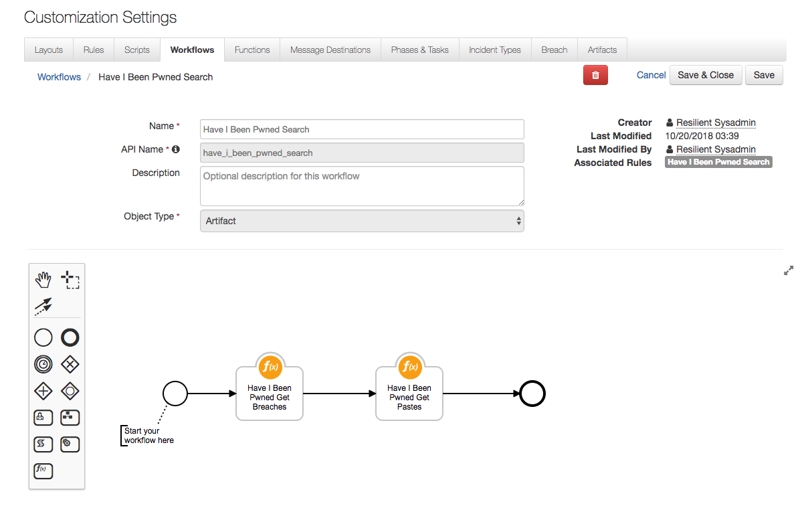

# Resilient Integration with Have I Been Pwned
**This package contains two functions that allows you to search for breaches and pastes given an email address as an input.**

 

## app.config settings:
Set if using a proxy

    [fn_hibp]
    ## Proxy settings if needed
    #hibp_proxy_http=
    #hibp_proxy_https=
    hibp_api_key=

In line with recent changes to HIBP, from August 2019 an API key is required and v3 of the API is released. This app uses both - for an API key there is a charge from HIBP of $3.50 

## Function Inputs:
| Function Name | Type | Required | Example |
| ------------- | :--: | :-------:| ------- |
| `hibp_email_address` | `String` | Yes | `"test@resilientsystems.com"` |


## Function Outputs:
### Have I Been Pwned Get Breaches:
```
{
  "Inputs": {
    "email_address": "test@email.com"
  },
  "Run Time": "2000",
  "Breaches":
    [
       {
          u'PwnCount':14936670,
          u'Domain':u'000webhost.com',
          u'IsSensitive':False,
          u'Name':u'000webhost',
          u'Title':u'000webhost',
          u'DataClasses':[
             u'Email addresses',
             u'IP addresses',
             u'Names',
             u'Passwords'
          ],
          u'LogoType':u'png',
          u'IsSpamList':False,
          u'IsRetired':False,
          u'BreachDate':u'2015-03-01',
          u'IsFabricated':False,
          u'ModifiedDate':      u'2017-12-10T21:44:27      Z',
          u'AddedDate':      u'2015-10-26T23:35:45      Z',
          u'IsVerified':True,
          u'Description':u'In approximately March 2015,
          the free web hosting provider <a href="http://www.troyhunt.com/2015/10/breaches-traders-plain-text-passwords.html" target="_blank" rel="noopener">000webhost suffered a major data breach</a> that exposed almost 15 million customer records. The data was sold and traded before 000webhost was alerted in October. The breach included names,
          email addresses and plain text passwords.'
       },
       {
          u'PwnCount':7990619,
          u'Domain':u'8tracks.com',
          u'IsSensitive':False,
          u'Name':u'8tracks',
          u'Title':u'8tracks',
          u'DataClasses':[
             u'Email addresses',
             u'Passwords'
          ],
          u'LogoType':u'png',
          u'IsSpamList':False,
          u'IsRetired':False,
          u'BreachDate':u'2017-06-27',
          u'IsFabricated':False,
          u'ModifiedDate':      u'2018-02-16T07:09:30      Z',
          u'AddedDate':      u'2018-02-16T07:09:30      Z',
          u'IsVerified':True,
          u'Description':u'In June 2017,
          the online playlists service known as <a href="https://blog.8tracks.com/2017/06/27/password-security-alert/" target="_blank" rel="noopener">8Tracks suffered a data breach</a> which impacted 18 million accounts. In their disclosure,
          8      Tracks advised that &quot;the vector for the attack was an employee\u2019s GitHub account,
          which was not secured using two-factor authentication&quot;. Salted SHA-1 password hashes for users who <em>didn\'t</em> sign up with either Google or Facebook authentication were also included. The data was provided to HIBP by whitehat security researcher and data analyst Adam Davies and contained almost 8 million unique email addresses.'
       }
    ]
}
```

### Have I Been Pwned Get Pastes:
```
{
  "Inputs": {
    "email_address": "test@email.com"
  },
  "Pastes":
    [
       {
          u'Date':None,
          u'Source':u'AdHocUrl',
          u'EmailCount':9893,
          u'Id':      u'http://siph0n.in/exploits.php?id=3670',
          u'Title':u'siph0n.in'
       },
       {
          u'Date':None,
          u'Source':u'AdHocUrl',
          u'EmailCount':12002,
          u'Id':      u'http://siph0n.in/exploits.php?id=3892',
          u'Title':u'siph0n.in'
       },
       {
          u'Date':None,
          u'Source':u'AdHocUrl',
          u'EmailCount':99791,
          u'Id':      u'http://siph0n.in/exploits.php?id=4680',
          u'Title':u'remotestaff.com.au'
       }
    ]
}
```


## Pre-Process Scripts:
This example sets the email_address value **to the value of the Incident's Artifact.**
```python
inputs.email_address = artifact.value
```

## Post-Process Script:
This example adds to the artifact's description the number of breaches the email address was a part of if any exist.
```python
if results.Breaches:
  try:
    des = artifact.description.content
  except Exception, e:
    des = None

  if des is None:
    artifact.description = "Breaches: " + str(len(results.Breaches))
  else:
    artifact.description = des + "\nBreaches: " + str(len(results.Breaches))
```

To package for distribution,

    python ./fn_hibp/setup.py sdist

The resulting .tar.gz file can be installed using

    pip install <filename>.tar.gz

To run the integration:

    resilient-circuits run
