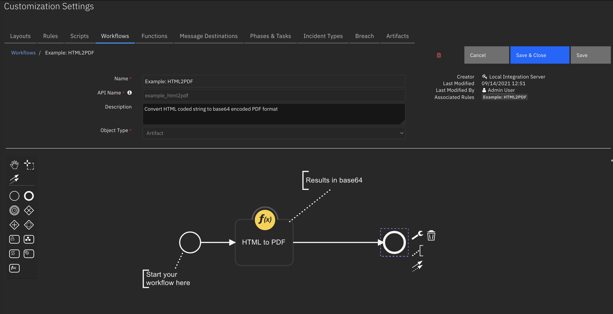

<!--
  This README.md is generated by running:
  "resilient-sdk docgen -p fn_html2pdf"

  It is best edited using a Text Editor with a Markdown Previewer. VS Code
  is a good example. Checkout https://guides.github.com/features/mastering-markdown/
  for tips on writing with Markdown

  If you make manual edits and run docgen again, a .bak file will be created

  Store any screenshots in the "doc/screenshots" directory and reference them like:
  

  NOTE: If your app is available in the container-format only, there is no need to mention the integration server in this readme.
-->

# fn_html2pdf

## Table of Contents
- [Release Notes](#release-notes)
- [Overview](#overview)
  - [Key Features](#key-features)
- [Requirements](#requirements)
  - [Resilient platform](#resilient-platform)
  - [Cloud Pak for Security](#cloud-pak-for-security)
  - [Proxy Server](#proxy-server)
  - [Python Environment](#python-environment)
- [Installation](#installation)
  - [Install](#install)
  - [App Configuration](#app-configuration)
- [Function - HTML to PDF](#function---html-to-pdf)
- [Rules](#rules)
- [Troubleshooting & Support](#troubleshooting--support)
---

## Release Notes
<!--
  Specify all changes in this release. Do not remove the release 
  notes of a previous release
-->
| Version | Date | Notes |
| ------- | ---- | ----- |
| 1.1.0 | 09/2021 | Added App Host support; Dropped Python 2.7 support 
| 1.0.0 | 09/2018 | Initial Release |

---

## Overview
<!--
  Provide a high-level description of the function itself and its remote software or application.
  The text below is parsed from the "description" and "long_description" attributes in the setup.py file
-->
**Convert HTML to a PDF**

This function converts HTML data into a base64 encoded PDF document. 
Alternatively, converts the contents of a website URL into a base64 encoded document.

This function can be used in sequence with other functions, such as `fn_utilities:json2html` and `fn_utilities:base64 to attachment`. See Resilient workflows functions and the use of output workflow properties.

### Key Features
<!--
  List the Key Features of the Integration
-->
* Convert raw HTMl to base64 encoded PDF
* Convert HTML from a given URL to base64 encoded PDF

---

## Requirements
<!--
  List any Requirements 
-->
This app supports the IBM Resilient SOAR Platform and the IBM Cloud Pak for Security.

### Resilient platform
The Resilient platform supports two app deployment mechanisms, App Host and integration server.

If deploying to a Resilient platform with an App Host, the requirements are:
* Resilient platform >= `40.0.6554`.
* The app is in a container-based format (available from the AppExchange as a `zip` file).

If deploying to a Resilient platform with an integration server, the requirements are:
* Resilient platform >= `40.0.6554`.
* The app is in the older integration format (available from the AppExchange as a `zip` file which contains a `tar.gz` file).
* Integration server is running `resilient_circuits>=30.0.0`.
* This function relies on weasyprint which has OS requirements. When installing on an integration server please see details [here](https://doc.courtbouillon.org/weasyprint/stable/first_steps.html) for extra operating system packages to install.
* If using an API key account, make sure the account provides the following minimum permissions: 
  | Name | Permissions |
  | ---- | ----------- |
  | Org Data | Read |
  | Function | Read |

The following Resilient platform guides provide additional information: 
* _App Host Deployment Guide_: provides installation, configuration, and troubleshooting information, including proxy server settings. 
* _Integration Server Guide_: provides installation, configuration, and troubleshooting information, including proxy server settings.
* _System Administrator Guide_: provides the procedure to install, configure and deploy apps. 

The above guides are available on the IBM Knowledge Center at [ibm.biz/resilient-docs](https://ibm.biz/resilient-docs). On this web page, select your Resilient platform version. On the follow-on page, you can find the _App Host Deployment Guide_ or _Integration Server Guide_ by expanding **Resilient Apps** in the Table of Contents pane. The System Administrator Guide is available by expanding **System Administrator**.

### Cloud Pak for Security
If you are deploying to IBM Cloud Pak for Security, the requirements are:
* IBM Cloud Pak for Security >= `1.4`.
* Cloud Pak is configured with an App Host.
* The app is in a container-based format (available from the AppExchange as a `zip` file).

The following Cloud Pak guides provide additional information: 
* _App Host Deployment Guide_: provides installation, configuration, and troubleshooting information, including proxy server settings. From the Table of Contents, select Case Management and Orchestration & Automation > **Orchestration and Automation Apps**.
* _System Administrator Guide_: provides information to install, configure, and deploy apps. From the IBM Cloud Pak for Security Knowledge Center table of contents, select Case Management and Orchestration & Automation > **System administrator**.

These guides are available on the IBM Knowledge Center at [ibm.biz/cp4s-docs](https://ibm.biz/cp4s-docs). From this web page, select your IBM Cloud Pak for Security version. From the version-specific Knowledge Center page, select Case Management and Orchestration & Automation.

### Python Environment
Since v1.1.0 only Python 3.6 is supported.
Additional package dependencies may exist for each of these packages:
* pika
* resilient_circuits>=30.0.0
* weasyprint<53.0

_Note: see the [Install](#install) section below if you are installing on an integration server as more os packages are required._

---

## Installation

### Install
* To install or uninstall an App or Integration on the _Resilient platform_, see the documentation at [ibm.biz/resilient-docs](https://ibm.biz/resilient-docs).
  * Further OS packages are required for installation of this app on a local integration server. You must install `pango` with your system's package installer.
* To install or uninstall an App on _IBM Cloud Pak for Security_, see the documentation at [ibm.biz/cp4s-docs](https://ibm.biz/cp4s-docs) and follow the instructions above to navigate to Orchestration and Automation.

### App Configuration
There are no settings needed to configure this app. Configurations must be set in the workflows that make use of the function.


---

## Function - HTML to PDF
Convert html text or a url reference to a base64 encoded pdf document. _See details in the "Example Post-Process Script" below on how to appropriately capture the output of the function._

 

<details><summary>Inputs:</summary>
<p>

| Name | Type | Required | Example | Tooltip |
| ---- | :--: | :------: | ------- | ------- |
| `html2pdf_data` | `text` | Yes | `http://my_url.com` | specify either a html string or url reference |
| `html2pdf_data_type` | `text` | Yes | `URL` | the type of data passed, usually the artifact type. URL or URI are needed for webpage scaping |
| `html2pdf_stylesheet` | `text` | No | `@page { size: landscape; }* { font-family: Arial; font-size: small; }table { border-collapse: collapse; }table, th, td { border: 1px solid black; }` | css formatted stylesheet information to use when rendering PDF document |

</p>
</details>

<details><summary>Outputs:</summary>
<p>

```python
results = {
    'content': '<base64 encoded PDF data>'
}
```

</p>
</details>

<details><summary>Example Pre-Process Script:</summary>
<p>

```python
None
```

</p>
</details>

<details><summary>Example Post-Process Script:</summary>
<p>

```python
# results in base64. see output property 'content':
# results.content
# or use workflow properties, such as 'pdf', when using this function with another function such as utilities: base64 to attachment:
# inputs.base64content = workflow.properties.pdf.content
```

</p>
</details>

---


## Rules
| Rule Name | Object | Workflow Triggered |
| --------- | ------ | ------------------ |
| Example: HTML2PDF | artifact | `example_html2pdf` |

---

## Troubleshooting & Support
Refer to the documentation listed in the Requirements section for troubleshooting information.

### For Support
This is a IBM Community provided App. Please search the Community https://ibm.biz/resilientcommunity for assistance.
