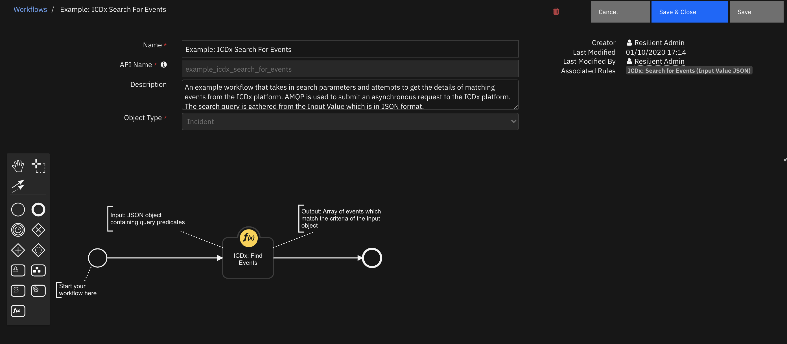
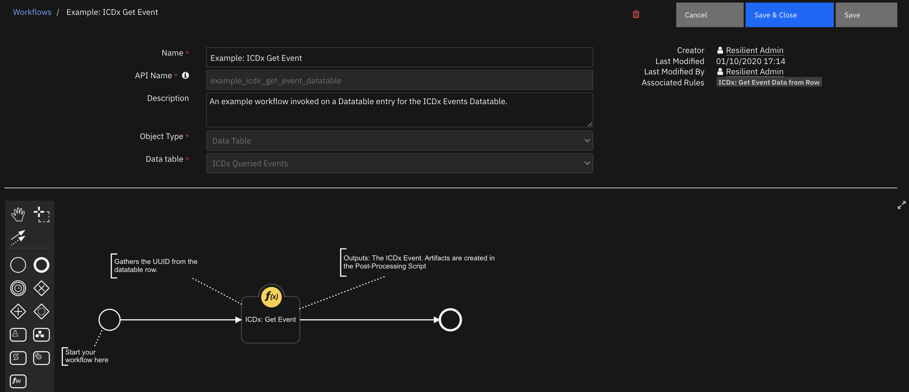
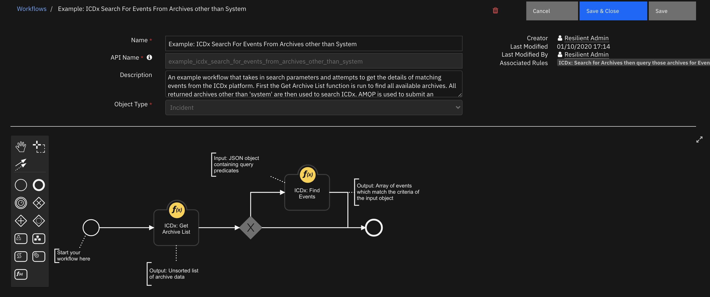

<!--
  This README.md is generated by running:
  "resilient-sdk docgen -p fn_icdx"

  It is best edited using a Text Editor with a Markdown Previewer. VS Code
  is a good example. Checkout https://guides.github.com/features/mastering-markdown/
  for tips on writing with Markdown

  If you make manual edits and run docgen again, a .bak file will be created

  Store any screenshots in the "doc/screenshots" directory and reference them like:
  
-->

# fn-icdx for IBM Resilient

## Table of Contents
- [Release Notes](#release-notes)
- [Overview](#overview)
  - [Key Features](#key-features)
- [Installation](#installation)
  - [Requirements](#requirements)
  - [Install](#install)
  - [App Configuration](#app-configuration)
  - [Custom Layouts](#custom-layouts)
- [Function - ICDx: Find Events](#function---icdx-find-events)
- [Function - ICDx: Get Event](#function---icdx-get-event)
- [Function - ICDx: Get Archive List](#function---icdx-get-archive-list)
- [Data Table - ICDx Queried Events](#data-table---icdx-queried-events)
- [Rules](#rules)
- [Troubleshooting & Support](#troubleshooting-&-support)
---

## Release Notes
<!--
  Specify all changes in this release. Do not remove the release 
  notes of a previous release
-->
### v1.0.0
* Initial Release

### v1.0.1
* Added support for AppHost and Resilient API Keys

---

## Overview
<!--
  Provide a high-level description of the function itself and its remote software or application.
  The text below is parsed from the "description" and "long_description" attributes in the setup.py file
-->
**Integration with ICDX which provides access to the ICDX Search API over AMQP**

 

The Symantec Integrated Cyber Defense Exchange (ICDX) is a central hub used to gather information from a number of different products in the Symantec Catalogue, normalising the information from these products into a schema. This establishes ICDx as an enrichment platform reporting on events gathered from other Symantec products

### Key Features
<!--
  List the Key Features of the Integration
-->
* Asynchronous Component for creating Resilient incidents from ICDx Events
* Ability to perform a query for ICDx Events 
* Ability to gather the details of a specific event by ID

---

## Installation

### Requirements
<!--
  List any Requirements 
-->
* Resilient platform >= `v36.0.0`
* An App Host or an Integration Server:
  * To setup up an App Host see:  [ibm.biz/res-app-host-setup](https://ibm.biz/res-app-host-setup)
* An Integration Server running `resilient_circuits>=30.0.0` (if using an Integration Server)
  * To set up an Integration Server see: [ibm.biz/res-int-server-guide](https://ibm.biz/res-int-server-guide)
  * If using an API key account, minimum required permissions are:
    | Name | Permissions |
    | ---- | ----------- |
    | Org Data | Read |
    | Function | Read |
* Proxy supported: No

---

### Install
* To install or uninstall an App using the App Host see [ibm.biz/res-install-app](https://ibm.biz/res-install-app)

* To install or uninstall an Integration using the Integration Server see the [ibm.biz/res-install-int](https://ibm.biz/res-install-int)
---

### App Configuration
The following table describes the settings you need to configure in the app.config file. If using App Host, see the Resilient System Administrator Guide. If using the integration server, see the Integration Server Guide.

| Config | Required | Example | Description |
| ------ | :------: | ------- | ----------- |
| **icdx_amqp_host** | Yes | `icdx.example.com ` | *Hostname for the ICDx installation, should be like my-server.com.* |
| **icdx_amqp_port** | Yes | `5672` | *Port for the ICDx AMQP Service, defaults to 5672.* |
| **icdx_amqp_vhost** | Yes | `dx` | *Virtual Host for the AMQP Exchange. Default is dx.* |
| **icdx_amqp_username** | Yes | `admin` | *Username of ICDx user.* |
| **icdx_amqp_password** | Yes | `supersecret` | *Password of ICDx user.* |
| **icdx_search_limit** | Yes | `100` | *A limiter for how many results are queried in ICDx. Default is 100 unless this value exceeds that.* |
| **icdx_forwarder_toggle** | Yes | `<True / False>` | *Boolean specifying whether the forwarder should be enabled when circuits is started.* |
| **icdx_forwarder_inc_owner** | Yes | `<USER_EMAIL / USER_ID / GROUP_NAME>` | *Who will be assigned incidents created by the forwarder*|

---

### Custom Layouts
<!--
  Use this section to provide guidance on where the user should add any custom fields and data tables.
  You may wish to recommend a new incident tab.
  You should save a screenshot "custom_layouts.png" in the doc/screenshots directory and reference it here
-->
* Import the Data Tables and Custom Fields like the screenshot below:

  

---

## Function - ICDx: Find Events
Takes a number of parameters in a search request and attempts to gather events from the ICDx Platform. Returns a response containing a list of events or a response with a 204 status code when no results are found.

 

<details><summary>Inputs:</summary>
<p>

| Name | Type | Required | Example | Tooltip |
| ---- | :--: | :------: | ------- | ------- |
| `icdx_search_request` | `textarea` | Yes | `A JSON Payload containing search Query` | The Find Events request retrieves the events that are within the specified time range and satisfy this search condition. |

</p>
</details>

<details><summary>Outputs:</summary>
<p>

```python
results = {
   "version":"1.0",
   "success":False,
   "reason":"None",
   "content":{
      "result_set":"None",
      "num_of_results":0,
      "execution_time":1601631906772
   },
   "raw":"{\"result_set\": null, \"num_of_results\": 0, \"execution_time\": 1601631906772}",
   "inputs":{
      "icdx_search_request":{
         "format":"text",
         "content":"{\"from\":[\"default\",\"dedicated/d900b5f0-aa0d-11e9-e053-000000000001\",\"dedicated/13547310-aec6-11e9-eb82-000000000002\",\"dedicated/3c7b5bd0-1f21-11e9-fa8e-000000000001\"],\"start\":\"-7d\",\"filter\":\"type = \\'NETWORK_EVENT\\'\",\"Query_Title\":\"Search for available archives, then search for NETWORK_EVENTs, limited to all available archives except system.\",\"limit\":5,\"where\":\"severity_id >= 3\",\"id\":1}"
      }
   },
   "metrics":{
      "version":"1.0",
      "package":"fn-icdx",
      "package_version":"1.0.1",
      "host":"RG-MBP-18.local",
      "execution_time_ms":1889,
      "timestamp":"2020-10-02 10:45:06"
   }
}
```

</p>
</details>

<details><summary>Workflows</summary>

  <details><summary>Example Pre-Process Script:</summary>
  <p>

  ```python
  #######################################
### Define pre-processing functions ###
#######################################
payload = {
   "Query_Title": "Search for available archives, then search for NETWORK_EVENTs, limited to all available archives except system.",
   "id" : 1,
   "start"  : "-7d",
   "where"  : "severity_id >= 3",
   "filter": "type = 'NETWORK_EVENT'",
   "limit"  : 5
   }
def dict_to_json_str(d):
  """Function that converts a dictionary into a JSON stringself.
     Supports basestring, bool and int.
     If the value is None, it sets it to False"""

  json_str = '"{ {0} }"'
  json_entry = '"{0}":{1}'
  json_entry_str = '"{0}":"{1}"'
  list_str = '"{0}":[{1}]'
  entries = [] 
  
  # Grab the available archives from the previous function 
  archives_to_search = workflow.properties.archive_search["archives"]
  
  """
  
    Here we take the result of the previous function -- a list of available archives_to_search
    A comma separated string of archives is prepared and then appended to our payload
    
    In the below example, we exclude the system archive by adding every other archive to our payload
  
    Replace 'system' with any archives you DONT want to be searched
  """
  list_builder_str = ''
  for archive in archives_to_search:
    # If the archive isin't the system archive
    if archive["path"] != "system":
      # Append to the list of archives we will search
      list_builder_str += '"{0}",'.format(archive["path"])
          
  # Finally prepare our CSV string to be appended to the payload      
  if list_builder_str.endswith(','):
    list_builder_str = list_builder_str[:-1]
  entries.append(list_str.format("from", list_builder_str))
  
  for entry in d:
    key = entry
    value = d[entry]
      
    if value is None:
      value = False
      
    
    if isinstance(value, basestring):
      entries.append(json_entry_str.format(key, value))
    
    elif isinstance(value, bool):
      value = 'true' if value == True else 'false'
      entries.append(json_entry.format(key, value))
    
    else:
      entries.append(json_entry.format(key, value))
  
  return '{' + ','.join(entries) + '}'
  
  
inputs.icdx_search_request = dict_to_json_str(payload)

  ```

  </p>
  </details>

  <details><summary>Example Post-Process Script:</summary>
  <p>

  ```python
  """
Example of the return data for this workflow
results = {
            "success": True or False
            "result_set": [{
              Object containing ICDx event data
            }],
            "num_of_results": How many results returned (INT),
            "execution_time": The time the function was executed
          }

"""
noteText = u"""<br><b>Search Request executed on ICDx :</b>"""

noteText += u"""<br>Number of results found: <b>{0}</b>
               <br>Results are being inserted into the ICDX Event Datatable""".format(results.num_of_results)

if results.inputs["icdx_search_request"]["Query_Title"] != None:
  noteText += u"""<br><br>A Query_Title attribute was provided with the input payload. 
                <br>Query Title: <b>{0} </b>""".format(results.inputs["icdx_search_request"]["Query_Title"])
  if results.inputs["icdx_search_request"]["where"] not in (None, ''):
    noteText += u"""<br> Where Condition: <b>{0} </b>""".format(results.inputs["icdx_search_request"]["where"]) 
  if results.inputs["icdx_search_request"]["filter"] not in (None, ''):
    noteText += u"""<br> Filter Condition: <b>{0} </b>""".format(results.inputs["icdx_search_request"]["filter"])
                
if results.num_of_results >= results.inputs["icdx_search_request"]["hard_limit"]:
  noteText += u"""<br><br>Query resulted in {0} matching events. ICDx Event Requests are batched with a configurable limit of {1}.
              <br> To access any results after the {1}th returned result, please review the app.config parameter `icdx_search_limit` and update where necessary. 
              <br> The Last UUID appears to be <b>{2}</b>""".format(results.inputs["icdx_search_request"]["limit"],results.inputs["icdx_search_request"]["hard_limit"], results.result_set[-1]["uuid"])


incident.addNote(helper.createRichText(noteText))
if results.result_set:
  for event in results.result_set:
    # Now have a handle on each event; Prepare DataTable
    row = incident.addRow("icdx_events")
    row["icdx_uuid"]  = event['uuid']
    row["icdx_severity_id"]  = event['severity_id']
    row["icdx_device_name"]  = event['device_name']
    row["icdx_device_ip"]  = event['device_ip']
    
    try:
      row["icdx_type"] = event['type']
    except:
      row["icdx_type"] = u"""No Type"""
      
    row["execution_time"] = results.execution_time
    
  ```

  </p>
  </details>

</details>

---
## Function - ICDx: Get Event
Takes in an input of a UUID for an event and attempts to get the details of this event from the ICDx platform.

 

<details><summary>Inputs:</summary>
<p>

| Name | Type | Required | Example | Tooltip |
| ---- | :--: | :------: | ------- | ------- |
| `icdx_uuid` | `text` | Yes | `-` | A UUID value for an ICDx Event.  |

</p>
</details>

<details><summary>Outputs:</summary>
<p>

```python
results = {
   "version":"1.0",
   "success":True,
   "reason":"None",
   "content":{
      "event":{
         "user_name":"admin",
         "session_uid":"hz73OQByQay0mAGlHJz4iw",
         "feature_uid":"default",
         "uuid":"85c62850-0490-11eb-c000-000000000000",
         "  feature_type":"system",
         "device_name":"integration-icdx-ubuntu-2",
         "subfeature_name":"com.symantec.platform.identity.audit.AuditLogger",
         "status_id":1,
         "category_id":4,
         "id":1,
         "feature_path":"system/id_epmp_dx",
         "device_time":1601630433109,
         "feature_name":"Identity Service",
         "x-epmp-sampled":"0",
         "device_os_name":"Linux",
         "log_name":"system",
         "type_id":20,
         "device_os_ver":"4.4.0-131-generic",
         "log_level":"INFO",
         "device_os_bits":"amd64",
         "message":"Successful login of admin",
         "version":"1.0",
         "product_name":"Symantec Integrated Cyber Defense Exchange",
         "log_time":"2020-10-02T05:20:33.109-04:00",
         "device_ip":"9.70.194.66",
         "event_id":20001,
         "x-epmp-traceId":"0482fb724eca2f19",
         "x-epmp-spanId":"0482fb724eca2f19",
         "time":"2020-10-02T05:20:33.109-04:00",
         "severity_id":1,
         "status_thread_name":"SimpleAsyncTaskExecutor-2"
      },
      "artifacts":{
         
      },
      "artifact_keys_as_list":[
         
      ],
      "artifact_values_as_list":[
         
      ]
   },
   "raw":"{\"event\": {\"user_name\": \"admin\", \"session_uid\": \"hz73OQByQay0mAGlHJz4iw\", \"feature_uid\": \"default\", \"uuid\": \"85c62850-0490-11eb-c000-000000000000\", \"  feature_type\": \"system\", \"device_name\": \"integration-icdx-ubuntu-2\", \"subfeature_name\": \"com.symantec.platform.identity.audit.AuditLogger\", \"status_id\": 1, \"category_id\": 4, \"id\": 1, \"feature_path\": \"system/id_epmp_dx\", \"device_time\": 1601630433109, \"feature_name\": \"Identity Service\", \"x-epmp-sampled\": \"0\", \"device_os_name\": \"Linux\", \"log_name\": \"system\", \"type_id\": 20, \"device_os_ver\": \"4.4.0-131-generic\", \"log_level\": \"INFO\", \"device_os_bits\": \"amd64\", \"message\": \"Successful login of admin\", \"version\": \"1.0\", \"product_name\": \"Symantec Integrated Cyber Defense Exchange\", \"log_time\": \"2020-10-02T05:20:33.109-04:00\", \"device_ip\": \"9.70.194.66\", \"event_id\": 20001, \"x-epmp-traceId\": \"0482fb724eca2f19\", \"x-epmp-spanId\": \"0482fb724eca2f19\", \"time\": \"2020-10-02T05:20:33.109-04:00\", \"severity_id\": 1, \"status_thread_name\": \"SimpleAsyncTaskExecutor-2\"}, \"artifacts\": {}, \"artifact_keys_as_list\": [], \"artifact_values_as_list\": []}",
   "inputs":{
      "icdx_uuid":"85c62850-0490-11eb-c000-000000000000"
   },
   "metrics":{
      "version":"1.0",
      "package":"fn-icdx",
      "package_version":"1.0.1",
      "host":"RG-MBP-18.local",
      "execution_time_ms":1851,
      "timestamp":"2020-10-02 14:47:25"
   }
}
```

</p>
</details>

<details><summary>Workflows</summary>

  <details><summary>Example Pre-Process Script:</summary>
  <p>

  ```python
  inputs.icdx_uuid = row.icdx_uuid

  ```

  </p>
  </details>

  <details><summary>Example Post-Process Script:</summary>
  <p>

  ```python
  """
Example of return data 

results = {
            "inputs":{
                "icdx_uuid": The UUID we ran the request with
            },
            "success": True or False,
            "event":  {
              Object containing the ICDx Event data
            },
            "artifacts": {
              Object containing the artifacts we parsed from the event. 
              Structure is name_of_artifact:artifact_data
            },
            "artifact_keys_as_list": [
              List containing the types of artifacts we parsed from the event.
            ],
            "artifact_values_as_list": [
              List containing the artifact data we parsed from the event.
            ]
          }

"""

# Add a note detailing what happened
noteText = u"""<br><b>Get Event request executed on ICDx :</b>
                <br>UUID Provided: <b>{0}</b>""".format(results.inputs["icdx_uuid"])
                
if results.success:
  noteText += u"""<br>Query successful and found an event with matching UUID."""
                  
  if results.event['type'] != None:
    noteText += u"""<br> Type of Event : <b>{0}</b>""".format(results.event["type"])
  else:
    noteText += u"""<br> Event Type ID : <b>{0}</b>""".format(results.event["type_id"])
    
  noteText += u"""<br> Event was gathered from the <b>{0}</b> archive""".format(results.event["log_name"])
  if len(results.artifact_keys_as_list) > 0:
    noteText += """<br>Artifacts generated from Event: <b>{0}</b>""".format("['{}']".format("', '".join(results.artifact_keys_as_list)))
  else:
    noteText += """<br><b>No artifacts generated from Event.</b>"""
else:
  noteText += u"""<br>Query did not find a corresponding event or an exception occured. 
  Check the action status for more information"""
  
incident.addNote(helper.createRichText(noteText))  


# First save the UUID as an artifact, exposing it to artifact level workflows 
incident.addArtifact('String', results.inputs["icdx_uuid"], 'Escalated from ICDx Event with UUID {}. Gathered from the ICDx Utilities Integration'.format(results.inputs["icdx_uuid"]))

""" Will only work in v31 upwards
if results.artifacts not None:
  for artifact_type, artifact_values in results.artifacts.items():
    for artifact_value in artifact_values:
      incident.addArtifact(artifact_type, artifact_value, 'Escalated from ICDx Event with UUID {}. Gathered from the ICDx Utilities Integration'.format(results.inputs["icdx_uuid"]))
"""

# Parse over the keys and values and add them as artifacts
if results.artifact_keys_as_list != None and results.artifact_values_as_list != None:
  for artifact_type, artifact_values in zip(results.artifact_keys_as_list,results.artifact_values_as_list):
    for artifact_value in artifact_values:
      incident.addArtifact(artifact_type, artifact_value, 'Escalated from ICDx Event with UUID {}. Gathered from the ICDx Utilities Integration'.format(results.inputs["icdx_uuid"]))

  ```

  </p>
  </details>

</details>

---
## Function - ICDx: Get Archive List
The Get Archive List API is used to return a list of archives in the ICDx system. The response is an unsorted list of archive metadata objects which can then be searched by a user.

 

<details><summary>Inputs:</summary>
<p>

| Name | Type | Required | Example | Tooltip |
| ---- | :--: | :------: | ------- | ------- |

</p>
</details>

<details><summary>Outputs:</summary>
<p>

```python
results = {
   "version":"1.0",
   "success":True,
   "reason":"None",
   "content":{
      "archives":[
         {
            "name":"System Archive",
            "path":"system"
         },
         {
            "name":"Default Archive",
            "path":"default"
         },
         {
            "path":"dedicated/d900b5f0-aa0d-11e9-e053-000000000001",
            "uuid":"d900b5f0-aa0d-11e9-e053-000000000001"
         },
         {
            "path":"dedicated/13547310-aec6-11e9-eb82-000000000002",
            "uuid":"13547310-aec6-11e9-eb82-000000000002"
         },
         {
            "path":"dedicated/3c7b5bd0-1f21-11e9-fa8e-000000000001",
            "uuid":"3c7b5bd0-1f21-11e9-fa8e-000000000001"
         }
      ]
   },
   "raw":"{\"archives\": [{\"name\": \"System Archive\", \"path\": \"system\"}, {\"name\": \"Default Archive\", \"path\": \"default\"}, {\"path\": \"dedicated/d900b5f0-aa0d-11e9-e053-000000000001\", \"uuid\": \"d900b5f0-aa0d-11e9-e053-000000000001\"}, {\"path\": \"dedicated/13547310-aec6-11e9-eb82-000000000002\", \"uuid\": \"13547310-aec6-11e9-eb82-000000000002\"}, {\"path\": \"dedicated/3c7b5bd0-1f21-11e9-fa8e-000000000001\", \"uuid\": \"3c7b5bd0-1f21-11e9-fa8e-000000000001\"}]}",
   "inputs":{
      
   },
   "metrics":{
      "version":"1.0",
      "package":"fn-icdx",
      "package_version":"1.0.1",
      "host":"RG-MBP-18.local",
      "execution_time_ms":1874,
      "timestamp":"2020-10-02 14:48:23"
   }
}
```

</p>
</details>

<details><summary>Workflows</summary>

  <details><summary>Example Pre-Process Script:</summary>
  <p>

  ```python
  None
  ```

  </p>
  </details>

  <details><summary>Example Post-Process Script:</summary>
  <p>

  ```python
  """
results = {
            "success": True or False,
            "archives": List of available archives or None
          }
"""
noteText = """<br>Found <b>{0}</b> archives available for searching""".format(len(results.archives))

for archive in results.archives:
  noteText += """<br> Archive Name: <b>{0}</b> with path: {1}""".format(archive["name"], archive["path"])

incident.addNote(helper.createRichText(noteText))

  ```

  </p>
  </details>

</details>

---


## Data Table - ICDx Queried Events

 

#### API Name:
icdx_events

#### Columns:
| Column Name | API Access Name | Type | Tooltip |
| ----------- | --------------- | ---- | ------- |
| Artifact Type | `artifact_type` | `text` | Input Artifact Type that was queried |
| Execution Time | `execution_time` | `datetimepicker` | - |
| Device IP | `icdx_device_ip` | `text` | A Device IP gathered from Event (If Any) |
| Device Name | `icdx_device_name` | `text` | A Device Name gathered from Event (If Any) |
| Severity ID | `icdx_severity_id` | `text` | The Severity of the Event. [1] Info; [2] Warning; [3] Minor; [4] Major; [5]; Critical; [6] Fatal |
| Type | `icdx_type` | `text` | A Type of Event.  |
| UUID | `icdx_uuid` | `text` | A Unique Identifier for the ICDx Event |

---


## Rules
| Rule Name | Object | Workflow Triggered |
| --------- | ------ | ------------------ |
| ICDx: Search for Events (Input Value JSON) | incident | `example_icdx_search_for_events` |
| ICDx: Get Event Data | artifact | `example_icdx_get_event_data` |
| ICDx: Search for Archives then query those archives for Events | incident | `example_icdx_search_for_events_from_archives_other_than_system` |
| ICDx: Search for Events related to Device Name (Pre-Processing JSON) | artifact | `example_icdx_search_for_events_related_to_device_name` |
| ICDx: Get Event Data from Row | icdx_events | `example_icdx_get_event_datatable` |
| ICDx: Search for Events related to IP (Pre-Processing JSON) | artifact | `example_icdx_search_for_events_related_to_ip` |

---

## Troubleshooting & Support
If using the app with an App Host, see the Resilient System Administrator Guide and the App Host Deployment Guide for troubleshooting procedures. You can find these guides on the [IBM Knowledge Center](https://www.ibm.com/support/knowledgecenter/SSBRUQ), where you can select which version of the Resilient platform you are using.

If using the app with an integration server, see the [Integration Server Guide](https://ibm.biz/res-int-server-guide)

### For Support
This is a IBM Community Provided App. Please search the Community https://ibm.biz/resilientcommunity for assistance.
