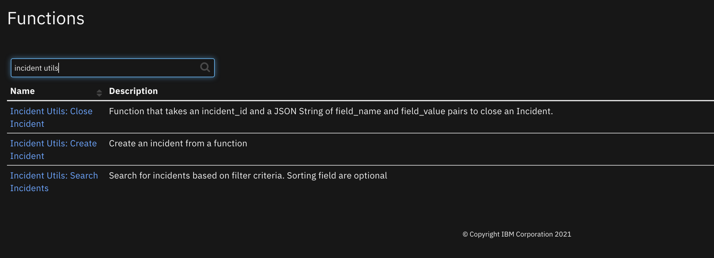
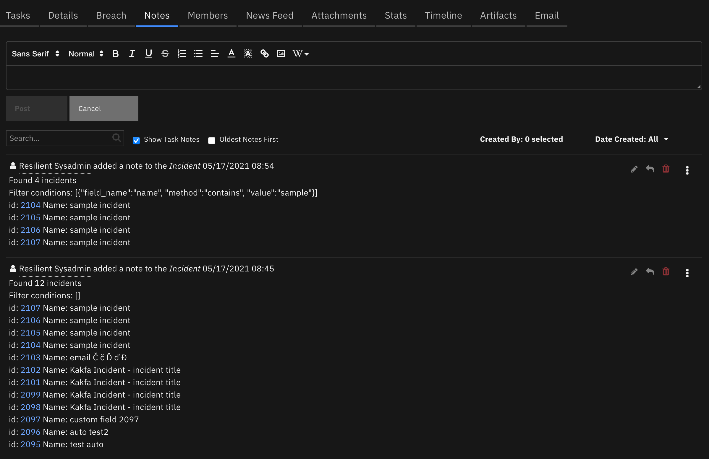
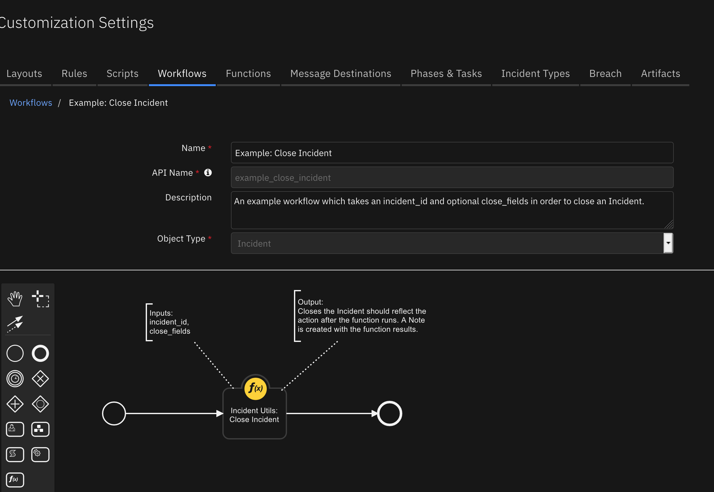

<!--
  This README.md is generated by running:
  "resilient-sdk docgen -p fn_incident_utils"

  It is best edited using a Text Editor with a Markdown Previewer. VS Code
  is a good example. Checkout https://guides.github.com/features/mastering-markdown/
  for tips on writing with Markdown

  If you make manual edits and run docgen again, a .bak file will be created

  Store any screenshots in the "doc/screenshots" directory and reference them like:
  

  NOTE: If your app is available in the container-format only, there is no need to mention the integration server in this readme.
-->

# None

## Table of Contents
- [Release Notes](#release-notes)
- [Overview](#overview)
  - [Key Features](#key-features)
- [Requirements](#requirements)
  - [IBM SOAR platform](#ibm soar-platform)
  - [Cloud Pak for Security](#cloud-pak-for-security)
  - [Proxy Server](#proxy-server)
  - [Python Environment](#python-environment)
- [Installation](#installation)
  - [Install](#install)
  - [App Configuration](#app-configuration)
- [Function - Incident Utils: Create Incident](#function---incident-utils-create-incident)
- [Function - Search Incidents](#function---search-incidents)
- [Function - Incident Utils: Close Incident](#function---incident-utils-close-incident)
- [Rules](#rules)
- [Troubleshooting & Support](#troubleshooting--support)
- [Appendix - Create Incident Data Model](#appendix---create-incident-data-model)
---

## Release Notes
<!--
  Specify all changes in this release. Do not remove the release
  notes of a previous release
-->
| Version | Date | Notes |
| ------- | ---- | ----- |
| 1.1.0 | 06/2021 | Added create and search functions |
| 1.0.0 | 12/2020 | Initial Release |

---

## Overview

### Key Features
<!--
  List the Key Features of the Integration
-->
* Close an Incident
* Create an Incident
* Search Incidents based on filter conditions

<!--
  Provide a high-level description of the function itself and its remote software or application.
  The text below is parsed from the "description" and "long_description" attributes in the setup.py file
-->
**Close Incident Function for IBM SOAR**

 

This package contains a function that enables you to close an Incident: Close Incident


---

## Requirements
<!--
  List any Requirements
-->
This app supports the IBM IBM SOAR Platform and the IBM Cloud Pak for Security.

### IBM SOAR platform
The IBM SOAR platform supports two app deployment mechanisms, App Host and integration server.

If deploying to an IBM SOAR platform with an App Host, the requirements are:
* IBM SOAR platform >= `38.0.6006`.
* The app is in a container-based format (available from the AppExchange as a `zip` file).

If deploying to an IBM SOAR platform with an integration server, the requirements are:
* IBM SOAR platform >= `38.0.6006`.
* The app is in the older integration format (available from the AppExchange as a `zip` file which contains a `tar.gz` file).
* Integration server is running `resilient_circuits>=30.0.0`.
* If using an API key account, make sure the account provides the following minimum permissions:
  | Name | Permissions |
  | ---- | ----------- |
  | Org Data | Read |
  | Function | Read |
  | Incident Fields | Edit, Create |
  | Edit Incidents | Fields, Status |

The following IBM SOAR platform guides provide additional information:
* _App Host Deployment Guide_: provides installation, configuration, and troubleshooting information, including proxy server settings.
* _Integration Server Guide_: provides installation, configuration, and troubleshooting information, including proxy server settings.
* _System Administrator Guide_: provides the procedure to install, configure and deploy apps.

The above guides are available on the IBM Knowledge Center at [ibm.biz/resilient-docs](https://ibm.biz/resilient-docs). On this web page, select your IBM SOAR platform version. On the follow-on page, you can find the _App Host Deployment Guide_ or _Integration Server Guide_ by expanding **Resilient Apps** in the Table of Contents pane. The System Administrator Guide is available by expanding **System Administrator**.

### Cloud Pak for Security
If you are deploying to IBM Cloud Pak for Security, the requirements are:
* IBM Cloud Pak for Security >= 1.4.
* Cloud Pak is configured with an App Host.
* The app is in a container-based format (available from the AppExchange as a `zip` file).

The following Cloud Pak guides provide additional information:
* _App Host Deployment Guide_: provides installation, configuration, and troubleshooting information, including proxy server settings. From the Table of Contents, select Case Management and Orchestration & Automation > **Orchestration and Automation Apps**.
* _System Administrator Guide_: provides information to install, configure, and deploy apps. From the IBM Cloud Pak for Security Knowledge Center table of contents, select Case Management and Orchestration & Automation > **System administrator**.

These guides are available on the IBM Knowledge Center at [ibm.biz/cp4s-docs](https://ibm.biz/cp4s-docs). From this web page, select your IBM Cloud Pak for Security version. From the version-specific Knowledge Center page, select Case Management and Orchestration & Automation.

### Proxy Server
The app **does/does not** support a proxy server.

### Python Environment
Both Python 2.7 and Python 3.6 are supported.
Additional package dependencies may exist for each of these packages:
* resilient-lib>=39.0
* resilient_circuits>=30.0.0

---

## Installation

### Install
* To install or uninstall an App or Integration on the _IBM SOAR platform_, see the documentation at [ibm.biz/resilient-docs](https://ibm.biz/resilient-docs).
* To install or uninstall an App on _IBM Cloud Pak for Security_, see the documentation at [ibm.biz/cp4s-docs](https://ibm.biz/cp4s-docs) and follow the instructions above to navigate to Orchestration and Automation.

### App Configuration

  | Config | Required | Example | Description |
  | ------ | :------: | ------- | ----------- |
  | **search_result_level** | Yes | `full` | *Scope of incidents fields to return: partial, normal and full* |

---

## Function - Incident Utils: Create Incident
Create an incident from a function.


<details><summary>Inputs:</summary>
<p>

| Name | Type | Required | Example | Tooltip |
| ---- | :--: | :------: | ------- | ------- |
| `inc_create_fields` | `text` | Yes | `-` | json incident fields to create an incident |


Format `inc_create_fields` in support of the SOAR API call to create an incident. Below is a sample of the fields which can used. The only required fields are `name` and `discovered_date`. Use the `properties` area to add content to custom fields. See the [appendix](#appendix---create-incident-data-model) for a complete listing of all the fields allowed.

Example:
```
inc_create_fields: {
  "name": "sample incident",
  "description": "something",
  "discovered_date": 1621110044,
  "artifacts": [
    {"type": "IP Address", "value": "1.2.3.4"}
  ]
}
```

Make sure `inc_create_fields` represents a JSON string.
* use double quotes to surround key names and string values.
* use `true` or `false` for boolean values.
* use brackets to surround multi-select field values. Ex. ["some", "thing"].
* field types `datepicker` and `datetimepicker` need to be in epoch format in milliseconds. Ex. 1607533205000.
* custom incident fields are specified within the "properties" heirarchy.

```json
{
  "name": "string",
  "discovered_date": 0,
  "due_date": 0,
  "description": {
    "format": "text",
    "content": "string"
  },
  "severity_code": {
    "name": "Low|Medium|High"
  },
  "incident_type_ids": [
    "Phishing",
    "Malware"
  ],
  "confirmed": true,
  "nist_attack_vectors": [
    null
  ],
  "workspace": {
    "name": "string"
  },
  "properties": {
    "custom_field": "value",
  },
  "artifacts": [
    {
      "type": {
        "name": "string"
      },
      "value": "string",
      "description": {
        "format": "text",
        "content": "string"
      }
    }
  ],
  "comments": [
    {
      "text": {
        "format": "text",
        "content": "string"
      }
    }
  ]
}
```

</p>
</details>

<details><summary>Outputs:</summary>
<p>

```python
results = {
  'version': '1.0',
  'success': True,
  'reason': None,
  'content': {
    'dtm': {

    },
    'cm': {
      'unassigneds': [

      ],
      'total': 0,
      'geo_counts': {

      }
    },
    'regulators': {
      'ids': [

      ]
    },
    'hipaa': {
      'hipaa_adverse': None,
      'hipaa_misused': None,
      'hipaa_acquired': None,
      'hipaa_additional_misuse': None,
      'hipaa_breach': None,
      'hipaa_adverse_comment': None,
      'hipaa_misused_comment': None,
      'hipaa_acquired_comment': None,
      'hipaa_additional_misuse_comment': None,
      'hipaa_breach_comment': None
    },
    'tasks': None,
    'artifacts': [
      {
        'id': 22,
        'type': 1,
        'value': '1.2.3.4',
        'description': None,
        'attachment': None,
        'parent_id': None,
        'creator': {
          'id': 3,
          'fname': 'IBM SOAR',
          'lname': 'Sysadmin',
          'display_name': 'IBM SOAR Sysadmin',
          'status': 'A',
          'email': 'a@example.com',
          'locked': False,
          'password_changed': False,
          'is_external': False,
          'ui_theme': 'verydarkmode'
        },
        'inc_id': 2107,
        'inc_name': 'sample incident',
        'inc_owner': 3,
        'hits': [

        ],
        'created': 1621111014796,
        'last_modified_time': 1621111014807,
        'last_modified_by': {
          'id': 3,
          'type': 'user',
          'name': 'a@example.com',
          'display_name': 'IBM SOAR Sysadmin'
        },
        'pending_sources': [
          105
        ],
        'perms': {
          'read': True,
          'write': True,
          'delete': True
        },
        'properties': None,
        'actions': [
        ],
        'hash': '8b8d9514c6180d5fcd7b7eb52b9f3286cea9c8df818abc5a63ad50ba37bd9935',
        'relating': None,
        'creator_principal': {
          'id': 3,
          'type': 'user',
          'name': 'a@example.com',
          'display_name': 'IBM SOAR Sysadmin'
        },
        'ip': {
          'source': None,
          'destination': None
        }
      }
    ],
    'name': 'sample incident',
    'description': 'something',
    'phase_id': 1004,
    'inc_training': False,
    'vers': 2,
    'addr': None,
    'city': None,
    'creator': {
      'id': 3,
      'fname': 'IBM SOAR',
      'lname': 'Sysadmin',
      'display_name': 'IBM SOAR Sysadmin',
      'status': 'A',
      'email': 'a@example.com',
      'locked': False,
      'password_changed': False,
      'is_external': False,
      'ui_theme': 'verydarkmode'
    },
    'creator_principal': {
      'id': 3,
      'type': 'user',
      'name': 'a@example.com',
      'display_name': 'IBM SOAR Sysadmin'
    },
    'exposure_type_id': 1,
    'incident_type_ids': [

    ],
    'reporter': None,
    'state': None,
    'country': None,
    'zip': None,
    'workspace': 1,
    'exposure': 0,
    'org_handle': 201,
    'members': [

    ],
    'negative_pr_likely': None,
    'perms': {
      'read': True,
      'write': True,
      'comment': True,
      'assign': True,
      'close': True,
      'change_members': True,
      'attach_file': True,
      'read_attachments': True,
      'delete_attachments': True,
      'create_milestones': True,
      'list_milestones': True,
      'create_artifacts': True,
      'list_artifacts': True,
      'delete': True,
      'change_workspace': True
    },
    'confirmed': False,
    'task_changes': {
      'added': [

      ],
      'removed': [

      ]
    },
    'assessment': '<?xml version="1.0" encoding="UTF-8" standalone="yes"?>\n<assessment>\n    <rollups/>\n    <optional>There are 1 required and 0 optional tasks from 1 regulators.</optional>\n</assessment>\n',
    'data_compromised': None,
    'draft': False,
    'properties': {
      'auto_test': None,
      'internal_customizations_field': None
    },
    'resolution_id': None,
    'resolution_summary': None,
    'pii': {
      'data_compromised': None,
      'determined_date': 1621110044,
      'harmstatus_id': 2,
      'data_encrypted': None,
      'data_contained': None,
      'impact_likely': None,
      'ny_impact_likely': None,
      'or_impact_likely': None,
      'wa_impact_likely': None,
      'dc_impact_likely': None,
      'data_source_ids': [

      ],
      'data_format': None,
      'assessment': '<?xml version="1.0" encoding="UTF-8" standalone="yes"?>\n<assessment>\n    <rollups/>\n    <optional>There are 1 required and 0 optional tasks from 1 regulators.</optional>\n</assessment>\n',
      'exposure': 0,
      'gdpr_harm_risk': None,
      'gdpr_lawful_data_processing_categories': [

      ],
      'alberta_health_risk_assessment': None
    },
    'gdpr': {
      'gdpr_breach_circumstances': [

      ],
      'gdpr_breach_type': None,
      'gdpr_personal_data': None,
      'gdpr_identification': None,
      'gdpr_consequences': None,
      'gdpr_final_assessment': None,
      'gdpr_breach_type_comment': None,
      'gdpr_personal_data_comment': None,
      'gdpr_identification_comment': None,
      'gdpr_consequences_comment': None,
      'gdpr_final_assessment_comment': None,
      'gdpr_subsequent_notification': None
    },
    'regulator_risk': {

    },
    'inc_last_modified_date': 1621111014823,
    'comments': None,
    'actions': [
    ],
    'timer_field_summarized_incident_data': [

    ],
    'admin_id': None,
    'creator_id': 3,
    'crimestatus_id': 1,
    'employee_involved': None,
    'end_date': None,
    'exposure_dept_id': None,
    'exposure_individual_name': None,
    'exposure_vendor_id': None,
    'jurisdiction_name': None,
    'jurisdiction_reg_id': None,
    'start_date': None,
    'inc_start': None,
    'org_id': 201,
    'is_scenario': False,
    'hard_liability': 0,
    'nist_attack_vectors': [

    ],
    'id': 2107,
    'sequence_code': None,
    'discovered_date': 1621110044,
    'due_date': None,
    'create_date': 1621111014529,
    'owner_id': 3,
    'severity_code': None,
    'plan_status': 'A'
  },
  'raw': '{}',
  'inputs': {
    'create_fields': '{"name": "sample incident", "description": "something", "discovered_date": 1621110044, "artifacts": [{"type": "IP Address", "value": "1.2.3.4"}]}'
  },
  'metrics': {
    'version': '1.0',
    'package': 'fn-incident-utils',
    'package_version': '1.1.0',
    'host': 'MacBook-Pro.local',
    'execution_time_ms': 975,
    'timestamp': '2021-05-15 16:36:55'
  }
}
```

</p>
</details>

<details><summary>Example Pre-Process Script:</summary>
<p>

```python
inputs.inc_create_fields = rule.properties.inc_create_fields
```

</p>
</details>

<details><summary>Example Post-Process Script:</summary>
<p>

```python
if results.success:
  incident.addNote("Incident successfully created: {}".format(results.content['id']))
else:
  incident.addNote("Incident creation failed: {}".format(results.reason))
```

</p>
</details>

---
## Function - Search Incidents
Search for incidents based on filter criteria. Sorting field are optional

 

<details><summary>Inputs:</summary>
<p>

| Name | Type | Required | Example | Tooltip |
| ---- | :--: | :------: | ------- | ------- |
| `inc_filter_conditions` | `text` | No | `-` | json format for filtering by field(s) |
| `inc_sort_fields` | `text` | No | `-` | json format for sorting |

Examples:
```
inc_filter_conditions: [
  {"field_name":"name", "method":"contains", "value":"sample"},
  {"field_name":"create_date", "method":"gte", "value":1621111014529}
]

inc_sort_fields: [
  {"field_name":"discovered_date", "type": "asc"}
]
```
</p>
</details>

<details><summary>Outputs:</summary>
<p>

```python
results = {
  'version': '1.0',
  'success': True,
  'reason': None,
  'content': {
    'recordsTotal': 2,
    'recordsFiltered': 2,
    'data': [
      {
        'name': 'sample incident',
        'description': 'something',
        'phase_id': 1004,
        'inc_training': False,
        'id': 2107,
        'sequence_code': 'C815-12',
        'discovered_date': 1621110044,
        'due_date': None,
        'create_date': 1621111014529,
        'owner_id': 3,
        'severity_code': None,
        'plan_status': 'A'
      },
      {
        'name': 'sample incident',
        'description': 'something',
        'phase_id': 1004,
        'inc_training': False,
        'id': 2106,
        'sequence_code': 'C815-11',
        'discovered_date': 1621110044,
        'due_date': None,
        'create_date': 1621110762055,
        'owner_id': 3,
        'severity_code': None,
        'plan_status': 'A'
      }
    ]
  },
  'raw': '{}}',
  'inputs': {
    'inc_filter_conditions': '[{"field_name":"name", "method":"contains", "value":"sample"}]',
    'inc_sort_fields': None
  },
  'metrics': {
    'version': '1.0',
    'package': 'fn-incident-utils',
    'package_version': '1.1.0',
    'host': 'MacBook-Pro.local',
    'execution_time_ms': 109,
    'timestamp': '2021-05-17 08:31:22'
  }
}
```

</p>
</details>

<details><summary>Example Pre-Process Script:</summary>
<p>

```python
inputs.inc_filter_conditions = rule.properties.inc_search_fields
inputs.inc_sort_fields = rule.properties.inc_sort_fields
```

</p>
</details>

<details><summary>Example Post-Process Script:</summary>
<p>

```python
msgs = [u"Filter conditions: {}".format(results.inputs['inc_filter_conditions'])]
if results.success:
  for inc in results.content['data']:
    msgs.append(u"id: <a target='blank' href='/#incidents/{0}'>{0}</a> Name: {1}".format(inc['id'], inc['name']))
  incident.addNote(helper.createRichText(u"Found {} incidents<br>{}".format(results.content['recordsTotal'], '<br>'.join(msgs))))

else:
  incident.addNote(u"Search error found: {}".format(results.reason))

```

</p>
</details>

---
## Function - Incident Utils: Close Incident
Function that takes an incident_id and a JSON String of field_name and field_value pairs to close an Incident.

 

<details><summary>Inputs:</summary>
<p>

| Name | Type | Required | Example | Tooltip |
| ---- | :--: | :------: | ------- | ------- |
| `close_fields` | `text` | No | `-` | A JSON String of the fields required to close an Incident e.g.: {'resolution_id':'Resolved','resolution_summary':'closing'} |
| `incident_id` | `number` | Yes | `-` | - |

Example:
```
close_fields: {
  "resolution_id": "Resolved",
  "resolution_summary": "False Positive"
}
```
Make sure `close_fields` represents a JSON string.
* use double quotes to surround key names and string values.
* use `true` or `false` for boolean values.
* use brackets to surround multi-select field values. Ex. ["some", "thing"].
* field types `datepicker` and `datetimepicker` need to be in epoch format in milliseconds. Ex. 1607533205000.
</p>
</details>

<details><summary>Outputs:</summary>
<p>

```python
results = {
  'version': '1.0',
  'success': True,
  'reason': None,
  'content': {
    'success': True,
    'title': None,
    'message': None,
    'hints': [

    ]
  },
  'raw': '{}',
  'inputs': {
    'close_fields': '{"resolution_id": "Resolved", "resolution_summary": "something"}',
    'incident_id': 2107
  },
  'metrics': {
    'version': '1.0',
    'package': 'fn-incident-utils',
    'package_version': '1.1.0',
    'host': 'MacBook-Pro.local',
    'execution_time_ms': 605,
    'timestamp': '2021-05-17 15:50:15'
  }
}
```

</p>
</details>

<details><summary>Example Pre-Process Script:</summary>
<p>

```python
inputs.incident_id = incident.id
iu_close_fields = rule.properties.incident_utils_close_fields.content
inputs.close_fields = u"{}".format(iu_close_fields)
```

</p>
</details>

<details><summary>Example Post-Process Script:</summary>
<p>

```python
note_text = "Result from Example: Close Incident on Incident {0}: <strong>{1}</strong>".format(results.inputs['incident_id'], \
"success" if results.success else "failure.<br>Reason: {}".format(results.reason))
incident.addNote(helper.createRichText(note_text))
```

</p>
</details>

---

## Rules
| Rule Name | Object | Workflow Triggered |
| --------- | ------ | ------------------ |
| Example: Close Incident | incident | `example_close_incident` |
| Example: Create Incident | incident | `example_create_incident` |
| Example: Search Incidents | incident | `example_search_incidents` |

---

## Troubleshooting & Support
Refer to the documentation listed in the Requirements section for troubleshooting information.

### For Support
This is a IBM Community provided App. Please search the Community https://ibm.biz/resilientcommunity for assistance.

## Appendix - Create Incident Data Model
```json
{
  "id": 0,
  "sequence_code": "string",
  "name": "string",
  "discovered_date": 0,
  "due_date": 0,
  "create_date": 0,
  "description": {
    "format": "text",
    "content": "string"
  },
  "owner_id": {
    "name": "string"
  },
  "phase_id": {
    "name": "string"
  },
  "severity_code": {
    "name": "string"
  },
  "plan_status": "string",
  "inc_training": true,
  "inc_last_modified_date": 0,
  "vers": 0,
  "addr": "string",
  "city": "string",
  "creator_id": {
    "name": "string"
  },
  "creator": {
    "id": 0,
    "fname": "string",
    "lname": "string",
    "email": "string",
    "phone": "string",
    "cell": "string",
    "title": "string",
    "notes": "string",
    "locked": true,
    "is_external": true,
    "password_changed": true,
    "display_name": "string",
    "ui_theme": "string"
  },
  "creator_principal": {
    "id": 0,
    "type": "string",
    "name": "string",
    "display_name": "string"
  },
  "crimestatus_id": {
    "name": "string"
  },
  "employee_involved": true,
  "end_date": 0,
  "exposure_dept_id": {
    "name": "string"
  },
  "exposure_individual_name": "string",
  "exposure_vendor_id": {
    "name": "string"
  },
  "incident_type_ids": [
    null
  ],
  "jurisdiction_name": "string",
  "jurisdiction_reg_id": 0,
  "reporter": "string",
  "start_date": 0,
  "state": {
    "name": "string"
  },
  "country": {
    "name": "string"
  },
  "zip": "string",
  "exposure": 0,
  "org_id": 0,
  "org_handle": {
    "name": "string"
  },
  "is_scenario": true,
  "hard_liability": 0,
  "members": [
    null
  ],
  "negative_pr_likely": true,
  "perms": {
    "read": true,
    "write": true,
    "comment": true,
    "assign": true,
    "close": true,
    "change_members": true,
    "attach_file": true,
    "read_attachments": true,
    "delete_attachments": true,
    "create_milestones": true,
    "list_milestones": true,
    "create_artifacts": true,
    "list_artifacts": true,
    "delete": true,
    "change_workspace": true
  },
  "confirmed": true,
  "task_changes": {
    "added": [
      {
        "id": 0,
        "name": "string"
      }
    ],
    "removed": [
      {
        "id": 0,
        "name": "string"
      }
    ]
  },
  "exposure_type_id": {
    "name": "string"
  },
  "assessment": "string",
  "data_compromised": true,
  "nist_attack_vectors": [
    null
  ],
  "workspace": {
    "name": "string"
  },
  "resolution_id": {
    "name": "string"
  },
  "resolution_summary": {
    "format": "text",
    "content": "string"
  },
  "pii": {
    "data_compromised": true,
    "determined_date": 0,
    "harmstatus_id": {
      "name": "string"
    },
    "data_encrypted": true,
    "data_contained": true,
    "impact_likely": true,
    "data_source_ids": [
      null
    ],
    "data_format": {
      "name": "string"
    },
    "assessment": "string",
    "exposure": 0,
    "gdpr_harm_risk": {
      "name": "string"
    },
    "gdpr_lawful_data_processing_categories": [
      null
    ],
    "alberta_health_risk_assessment": true
  },
  "gdpr": {
    "gdpr_breach_circumstances": [
      null
    ],
    "gdpr_breach_type": {
      "name": "string"
    },
    "gdpr_personal_data": {
      "name": "string"
    },
    "gdpr_identification": {
      "name": "string"
    },
    "gdpr_consequences": {
      "name": "string"
    },
    "gdpr_final_assessment": {
      "name": "string"
    },
    "gdpr_breach_type_comment": {
      "format": "text",
      "content": "string"
    },
    "gdpr_personal_data_comment": {
      "format": "text",
      "content": "string"
    },
    "gdpr_identification_comment": {
      "format": "text",
      "content": "string"
    },
    "gdpr_consequences_comment": {
      "format": "text",
      "content": "string"
    },
    "gdpr_final_assessment_comment": {
      "format": "text",
      "content": "string"
    },
    "gdpr_subsequent_notification": true
  },
  "regulator_risk": {},
  "cm": {
    "unassigneds": [
      {
        "geo": {
          "name": "string"
        },
        "count": 0
      }
    ],
    "total": 0
  },
  "regulators": {
    "ids": [
      null
    ]
  },
  "hipaa": {
    "hipaa_adverse": true,
    "hipaa_misused": true,
    "hipaa_acquired": true,
    "hipaa_additional_misuse": true,
    "hipaa_breach": true,
    "hipaa_adverse_comment": "string",
    "hipaa_misused_comment": "string",
    "hipaa_acquired_comment": "string",
    "hipaa_additional_misuse_comment": "string",
    "hipaa_breach_comment": "string"
  },
  "tasks": [
    {
      "inc_name": "string",
      "name": "string",
      "custom": true,
      "inc_id": 0,
      "inc_owner_id": {
        "name": "string"
      },
      "due_date": 0,
      "required": true,
      "owner_id": {
        "name": "string"
      },
      "id": 0,
      "status": "string",
      "inc_training": true,
      "frozen": true,
      "owner_fname": "string",
      "owner_lname": "string",
      "cat_name": "string",
      "description": "string",
      "init_date": 0,
      "src_name": "string",
      "instr_text": "string",
      "instructions": {
        "format": "text",
        "content": "string"
      },
      "at_id": {
        "name": "string"
      },
      "active": true,
      "members": [
        null
      ],
      "perms": {
        "read": true,
        "write": true,
        "comment": true,
        "assign": true,
        "close": true,
        "change_members": true,
        "attach_file": true,
        "read_attachments": true,
        "delete_attachments": true
      },
      "notes": [
        {
          "id": 0,
          "parent_id": 0,
          "user_id": {
            "name": "string"
          },
          "user_fname": "string",
          "user_lname": "string",
          "create_date": 0,
          "modify_date": 0,
          "modify_user": {
            "id": {
              "name": "string"
            },
            "first_name": "string",
            "last_name": "string"
          },
          "text": {
            "format": "text",
            "content": "string"
          },
          "children": [
            {}
          ],
          "mentioned_users": [
            null
          ],
          "comment_perms": {
            "update": true,
            "delete": true
          },
          "is_deleted": true,
          "actions": [
            {
              "id": 0,
              "name": "string",
              "enabled": true
            }
          ],
          "inc_id": 0,
          "inc_name": "string",
          "task_id": 0,
          "task_name": "string",
          "task_custom": true,
          "task_at_id": {
            "name": "string"
          },
          "task_members": [
            null
          ],
          "type": "incident",
          "inc_owner": {
            "name": "string"
          },
          "user_name": "string",
          "modify_principal": {
            "id": 0,
            "type": "string",
            "name": "string",
            "display_name": "string"
          }
        }
      ],
      "closed_date": 0,
      "actions": [
        {
          "id": 0,
          "name": "string",
          "enabled": true
        }
      ],
      "phase_id": {
        "name": "string"
      },
      "category_id": {
        "name": "string"
      },
      "notes_count": 0,
      "attachments_count": 0,
      "creator_principal": {
        "id": 0,
        "type": "string",
        "name": "string",
        "display_name": "string"
      }
    }
  ],
  "artifacts": [
    {
      "id": 0,
      "type": {
        "name": "string"
      },
      "value": "string",
      "description": {
        "format": "text",
        "content": "string"
      },
      "creator": {
        "id": 0,
        "fname": "string",
        "lname": "string",
        "email": "string",
        "phone": "string",
        "cell": "string",
        "title": "string",
        "notes": "string",
        "locked": true,
        "is_external": true,
        "password_changed": true,
        "display_name": "string",
        "ui_theme": "string"
      },
      "hits": [
        {
          "id": "string",
          "value": "string",
          "threat_source_id": {
            "name": "string"
          },
          "artifact_type_id": {
            "name": "string"
          },
          "active": true
        }
      ],
      "attachment": {
        "id": 0,
        "uuid": "string",
        "name": "string",
        "content_type": "string",
        "created": 0,
        "creator_id": {
          "name": "string"
        },
        "size": 0,
        "vers": 0,
        "actions": [
          {
            "id": 0,
            "name": "string",
            "enabled": true
          }
        ],
        "inc_id": 0,
        "inc_name": "string",
        "inc_owner": {
          "name": "string"
        },
        "task_id": 0,
        "task_name": "string",
        "task_custom": true,
        "task_at_id": {
          "name": "string"
        },
        "task_members": [
          null
        ],
        "type": "incident"
      },
      "parent_id": 0,
      "inc_id": 0,
      "inc_name": "string",
      "inc_owner": {
        "name": "string"
      },
      "created": 0,
      "last_modified_by": {
        "id": 0,
        "type": "string",
        "name": "string",
        "display_name": "string"
      },
      "last_modified_time": 0,
      "pending_sources": [
        null
      ],
      "perms": {
        "read": true,
        "write": true,
        "delete": true
      },
      "properties": [
        {
          "name": "string",
          "value": "string"
        }
      ],
      "location": {
        "latlng": {
          "lat": 0,
          "lng": 0
        },
        "city": "string",
        "state": "string",
        "country": "string",
        "postalCode": "string"
      },
      "whois": {
        "raw": "string",
        "pending": true,
        "invalid": true
      },
      "actions": [
        {
          "id": 0,
          "name": "string",
          "enabled": true
        }
      ],
      "relating": true,
      "creator_principal": {
        "id": 0,
        "type": "string",
        "name": "string",
        "display_name": "string"
      },
      "ip": {
        "destination": true,
        "source": true
      },
      "related_incident_count": 0
    }
  ],
  "comments": [
    {
      "id": 0,
      "parent_id": 0,
      "user_id": {
        "name": "string"
      },
      "user_fname": "string",
      "user_lname": "string",
      "create_date": 0,
      "modify_date": 0,
      "modify_user": {
        "id": {
          "name": "string"
        },
        "first_name": "string",
        "last_name": "string"
      },
      "text": {
        "format": "text",
        "content": "string"
      },
      "children": [
        {}
      ],
      "mentioned_users": [
        null
      ],
      "comment_perms": {
        "update": true,
        "delete": true
      },
      "is_deleted": true,
      "actions": [
        {
          "id": 0,
          "name": "string",
          "enabled": true
        }
      ],
      "inc_id": 0,
      "inc_name": "string",
      "task_id": 0,
      "task_name": "string",
      "task_custom": true,
      "task_at_id": {
        "name": "string"
      },
      "task_members": [
        null
      ],
      "type": "incident",
      "inc_owner": {
        "name": "string"
      },
      "user_name": "string",
      "modify_principal": {
        "id": 0,
        "type": "string",
        "name": "string",
        "display_name": "string"
      }
    }
  ],
  "actions": [
    {
      "id": 0,
      "name": "string",
      "enabled": true
    }
  ],
  "timer_field_summarized_incident_data": [
    {
      "fieldValue": "string",
      "incId": 0,
      "running": true,
      "fieldLabel": "string",
      "sum": 0,
      "fieldName": "string"
    }
  ]
}
```