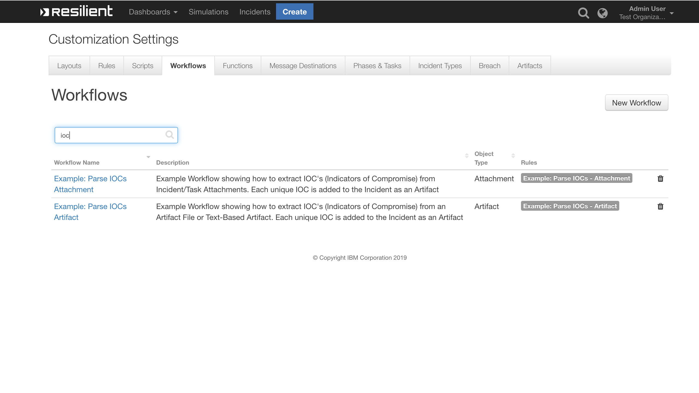

# IOC Parser Functions for IBM Resilient

- [Overview](#overview)
- [Release Notes](#release-notes)
- [Requirements](#requirements)
- [Installation](#installation)
- [Uninstall](#uninstall)
- [Troubleshooting](#troubleshooting)
- [Support](#support)

---
## Overview
<!--
  Provide a high-level description of the function itself and its remote software or application.
  The text below is parsed from the "description" and "long_description" attributes in the setup.py file
-->
**Resilient Function to extract Indicators of Compromise from Attachments + Artifact Files**

 

Uses the IOCParser Python Library to extract IOCs from Resilient Attachments and Artifacts. All unique IOCs that are found are added to the Resilient Incident as an Artifact

---

## Release Notes

### v1.0.0
* Initial Release

### v2.0.0
* Message Destination renamed from `iocpdest` to `fn_ioc_parser`
* Function renamed from `ioc_parser` to `function_ioc_parser`
* Removed Function Inputs: `incidentId`, `inputType` and `artifactId`
* Python FunctionComponent file renamed from `ioc_parser.py` to `function-ioc-parser.py`
* Added *Example* Rules and Workflows
* New Function Result:
  ```python
  results = {
    "iocs": [{
      'count': 1,
      'type': 'IP',
      'value': '127.0.0.0'
    }, {
      'count': 1,
      'type': 'uri',
      'value': 'https://www.example.com'
    }],
    "attachment_file_name": u'test_file_name.pdf'
  }
  ```

---

## Requirements
<!--
  List any Requirements 
-->
* IBM Resilient >= `v31.0.4254`
* An Integration Server running `resilient_circuits>=30.0.0`
  * To setup an Integration Server see: [ibm.biz/res-int-server-guide](https://ibm.biz/res-int-server-guide)

---
## Installation
* Download the `fn_ioc_parser.zip`
* Copy the `.zip` to your Integration Server and SSH into it.
* **Unzip** the package:
  ```
  $ unzip fn_ioc_parser-x.x.x.zip
  ```
* **Change Directory** into the unzipped Directory:
  ```
  $ cd fn_ioc_parser-x.x.x
  ```
* **Install** the package:
  ```
  $ pip install fn_ioc_parser-x.x.x.tar.gz
  ```
* Import the fn_ioc_parser **customizations** into the Resilient Appliance:
  ```
  $ resilient-circuits customize -y -l fn-ioc-parser
  ```
* [Optional]: Run selftest to test the Integration you configured:
  ```
  $ resilient-circuits selftest -l fn-ioc-parser
  ```
* **Run** resilient-circuits or restart the Service on Windows/Linux:
  ```
  $ resilient-circuits run
  ```


---
## Uninstall
* SSH into your Integration Server
* **Uninstall** the package:
  ```
  $ pip uninstall fn-ioc-parser
  ```

---
## Troubleshooting
There are several ways to verify the successful operation of a function.

### Resilient Action Status
* When viewing an incident, use the Actions menu to view **Action Status**.
* By default, pending and errors are displayed.
* Modify the filter for actions to also show Completed actions.
* Clicking on an action displays additional information on the progress made or what error occurred.

### Resilient Scripting Log
* A separate log file is available to review scripting errors.
* This is useful when issues occur in the pre-processing or post-processing scripts.
* The default location for this log file is: `/var/log/resilient-scripting/resilient-scripting.log`.

### Resilient Logs
* By default, Resilient logs are retained at `/usr/share/co3/logs`.
* The `client.log` may contain additional information regarding the execution of functions.

### Resilient-Circuits
* The log is controlled in the `.resilient/app.config` file under the section [resilient] and the property `logdir`.
* The default file name is `app.log`.
* Each function will create progress information.
* Failures will show up as errors and may contain python trace statements.
---

## Support
| Name | Version | Author | Support URL |
| ---- | ------- | ------ | ----------- |
| fn_ioc_parser | 2.0.0 | Resilient Labs | http://ibm.biz/resilientcommunity |
