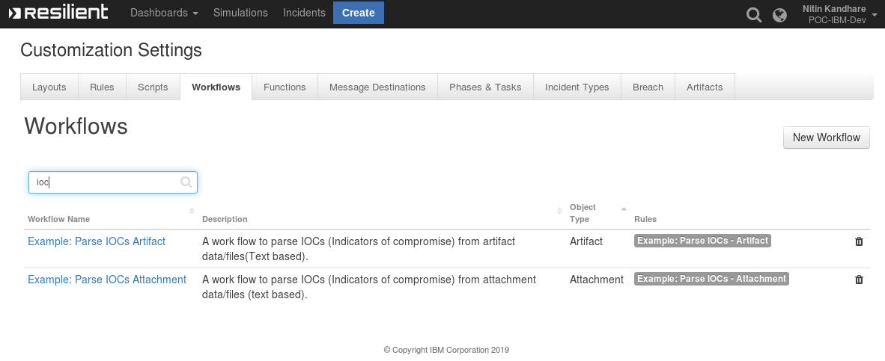
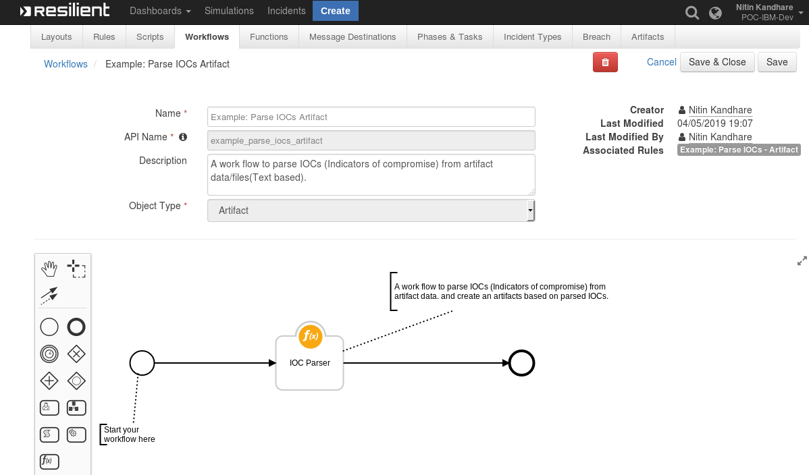
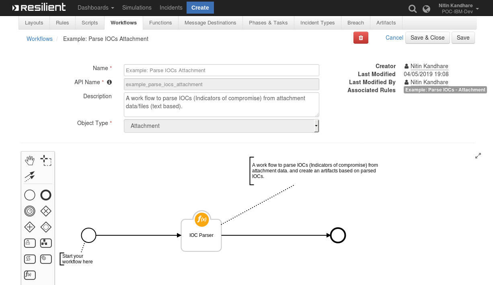
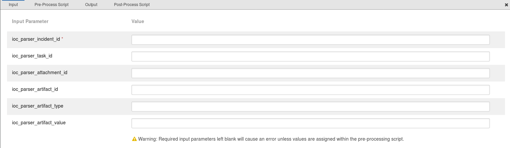
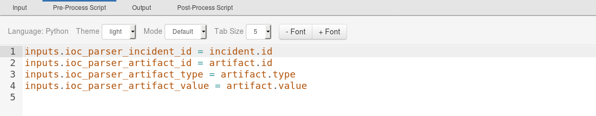
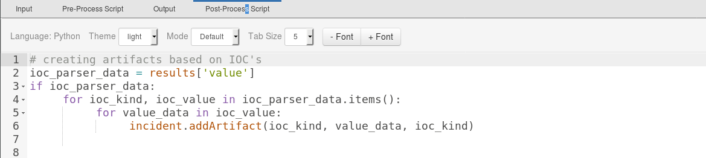
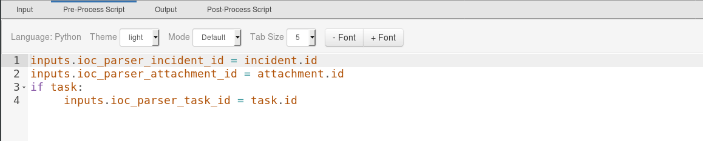
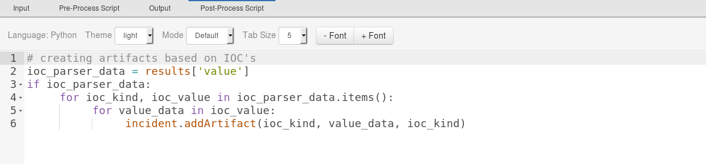

# IOC Parser Function for IBM Resilient

## Table of Contents  
 - [About This Package](#about-this-package)
 - [Prerequisites](#prerequisites)
 - [Installation](#installation)
 - [Function Inputs](#function-inputs)
 - [Function Output](#function-output)
 - [Pre-Process Script](#pre-process-script)
 - [Post-Process Script](#post-process-script)
 - [Rules](#rules)
 ---
 
## About This Package
**This function is to extract IOC's(Indicators of Compromise) from text-based Data/files**
* It can be used to parse Indicators of Compromise from text  based files/data can be called on : 
	*	Text Based Files/Data Artifacts of Resilient 
	*  Text Based Files/Data Incidents Attachments of Resilient 
	*  Text Based Files/Data Incident Task Attachments of Resilient 

After successful completion of parsing of files/data, artifacts are created based on the returned ioc's.
 


### IOC Parser Artifact function layout:


### IOC Parser attachment function layout:


### IOC Parser Inputs


### IOC Parser Artifact Pre-Process Script


### IOC Parser Artifact Post-Process Script


### IOC Parser Attachment Pre-Process Script


### IOC Parser Attachment Post-Process Script


## Prerequisites
* Resilient Appliance >= v31.0.0
* Integrations Server running resilient_circuits >= v30.0.0
* iocparser >= v1.0.14  
* pdfminer.six >= v20181108  
* python-docx >= 0.8.10  
* xlrd >= 1.2.0

## Installation

This package requires that it is installed on a RHEL or CentOS platform and uses the resilient-circuits framework.
* Download the `.zip` file from our App Exchange and extract it. You will find a file called: `fn_ioc_parser-<version>.tar.gz`
* Copy this file to your Integrations Server
 * To install the package, run:   
 `pip install fn_ioc_parser-<version>.tar.gz`
 
 * To import the function, example rules,data tables and workflows into your Resilient Appliance, run: 
	`resilient-circuits customize -y -l fn-ioc-parser`  
	
* To uninstall IOC Parser Function from Resilient Run the following:  
	 `pip uninstall fn_ioc_parser` 
	 
## Function Inputs
|Input Name		|Type      	|Required 	|Example 	| Info	|
|---------------|-----------|-----------|----------|--------|  
|`ioc_parser_incident_id`|  Number|Yes	|	2123| This is the incident ID, passed from Pre-Pocess Script to Function.
|`ioc_parser_artifact_id`|Number|Optional|246|This is the artifact ID of which data can be parsed for IOC's. Passed to function from Resilient Pre-Process script|
|`ioc_parser_artifact_type`|Text |Optional|Other File,String etc.|This is the artifact type of which data can be parsed for IOC's. Passed to function from Resilient Pre-Process script|
|`ioc_parser_artifact_value`|Text|Optional|holiday2019.xlsx,"string data" etc.|This is the artifact value of which data can be parsed for IOC's. Passed to function from Resilient Pre-Process script|
|`ioc_parser_attachment_id`|Number|Optional|2222|This is the attachment ID of which data can be parsed for IOC's. passed to function from Resilient Pre-Process Script.|
|`ioc_parser_task_id`|Number|Optional|2222|This is a task ID of which data can be parsed for IOC's. passed to function from Resilient Pre-Process Script|


## Function Output
The payload from integration will wrap the results of the IOC parser response in the following JSON structure.  
response received will be returned as a string representation of the result.  
```python
{"value":{"IP Adress":[],"URL":[],"Malware MD5 Hash":[],"Malware SHA-1 Hash":[],"Malware SHA-256 Hash":[],"Threat CVE ID":[],"Email Body":[],"File Name":[]}}
```
* To see the output of  of the  Function, we recommend running `resilient-circuits` in `DEBUG` mode.
* To do this run:
    ```
    $ resilient-circuits run --loglevel=DEBUG
    ```
## Pre-Process Script
### <u>For Artifact </u>
This example sets `Example: Parse IOCs Artifact` inputs to the artifact values.
A Pre-Process script will relay the Resilient artifact data to function inputs similar to this example:
```python
inputs.ioc_parser_incident_id = incident.id
inputs.ioc_parser_artifact_id = artifact.id
inputs.ioc_parser_artifact_type = artifact.type
inputs.ioc_parser_artifact_value = artifact.value

```
### <u>For Attachments</u>
This example sets `Example: Parse IOCs Attachment` inputs to the attachments & task values.
A Pre-Process script will relay the Resilient incident and task attachments  data to function inputs similar to this example:
```python
inputs.ioc_parser_incident_id = incident.id
inputs.ioc_parser_attachment_id = attachment.id
if task:
     inputs.ioc_parser_task_id = task.id
```
## Post-Process Script

### <u>For Artifact</u> 
This Post-Process script is used to create an `Artifacts`  in the Resilient incidents, based on the returned ioc's from the artifact function.
```python
ioc_parser_data = results['value']
if ioc_parser_data:
     for ioc_kind, ioc_value in ioc_parser_data.items():
          for value_data in ioc_value:
               incident.addArtifact(ioc_kind, value_data, ioc_kind)
```
### <u>For Attachments</u>
This Post- Process script code snippet is used to create the 	`Artifacts` in the Resilient incidents, based on the returned ioc's from the attachment function.
```python
# creating artifacts based on IOC's
ioc_parser_data = results['value']
if ioc_parser_data:
     for ioc_kind, ioc_value in ioc_parser_data.items():
          for value_data in ioc_value:
               incident.addArtifact(ioc_kind, value_data, ioc_kind)
```
## Rules
| Rule Name | Object Type | Workflow Triggered |Activity Fields|  
| --------- | :---------: | ------------------ |---------------|  
|`Example: Parse IOCs - Artifact`| `Artifact` | `Example: Parse IOCs Artifact` |-----|
|`Example: Parse IOCs - Attachment`|`Attachment`|`Example: Parse IOCs Attachment`|-----|
 
:copyright:IBM Corp. 2010, 2019. All Rights Reserved
