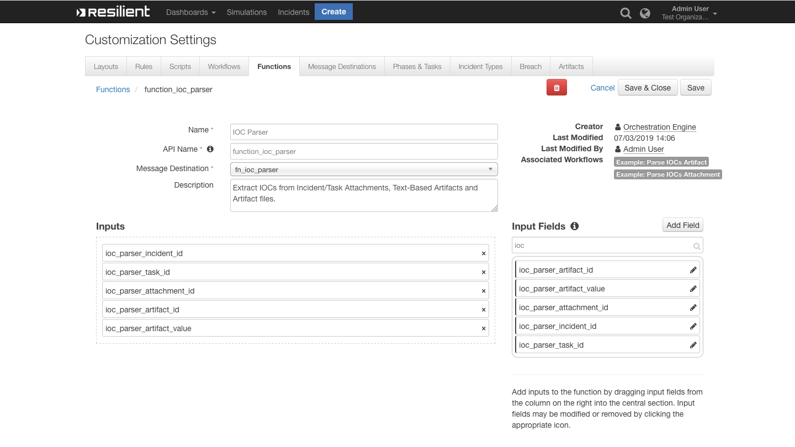

<!--
  This User README.md is generated by running:
  "resilient-circuits docgen -p fn_ioc_parser --only-user-guide"

  It is best edited using a Text Editor with a Markdown Previewer. VS Code
  is a good example. Checkout https://guides.github.com/features/mastering-markdown/
  for tips on writing with Markdown

  If you make manual edits and run docgen again, a .bak file will be created

  Store any screenshots in the "doc/screenshots" directory and reference them like:
  
-->

# **User Guide:** fn_ioc_parser_v2.0.0

## Table of Contents
- [Key Features](#key-features)
- [Function - IOC Parser](#function---ioc-parser)
- [Rules](#rules)

---

## Key Features
<!--
  List the Key Features of the Integration
-->
* Extract unique Indicators Of Compromise (IOCs) from PDF, docx, xls and other text based files.
* Count duplicate IOCs and increment its `count`.
* Add each IOC as an Artifact and update its Description with the IOC's `count`.

---

## Function - IOC Parser
Extract IOCs from Incident/Task Attachments, Text-Based Artifacts and Artifact files.

 

<details><summary>Inputs:</summary>
<p>

| Name | Type | Required | Example | Tooltip |
| ---- | :--: | :------: | ------- | ------- |
| `ioc_parser_artifact_id` | `number` | No | `123` | ID of the artifact |
| `ioc_parser_artifact_value` | `text` | No | `-` | Artifact's value |
| `ioc_parser_attachment_id` | `number` | No | `123` | ID of the attachment |
| `ioc_parser_incident_id` | `number` | Yes | `-` | ID of the incident |
| `ioc_parser_task_id` | `number` | No | `100001` | ID of the task |

</p>
</details>

<details><summary>Outputs:</summary>
<p>

```python
results = {
  'iocs': [{
    'count': 1,
    'type': 'IP',
    'value': '127.0.0.0'
  }, {
    'count': 1,
    'type': 'uri',
    'value': 'https://www.example.com'
  }, {
    'count': 1,
    'type': 'uri',
    'value': 'example.com'
  }, {
    'count': 1,
    'type': 'md5',
    'value': '22sd233b26debdfb8c7cfbd3a55abbd'
  }, {
    'count': 1,
    'type': 'CVE',
    'value': 'CVE-4242-4242'
  }, {
    'count': 5,
    'type': 'email',
    'value': 'info@example.com'
  }],
  'attachment_file_name': u'test_indicators_of_compromise.pdf'
}
```

</p>
</details>

<details><summary>Example Pre-Process Script:</summary>
<p>

```python
# Define Pre-Process Inputs
inputs.ioc_parser_incident_id = incident.id
inputs.ioc_parser_artifact_id = artifact.id
inputs.ioc_parser_artifact_value = artifact.value
```

</p>
</details>

<details><summary>Example Post-Process Script:</summary>
<p>

```python
import re

def get_artifact_type(artifact_value, artifact_type):
  """Use some regex expressions to try and identify
  from the Artifact's value, what Artifact type it is.
  Return original artifact_type if we cannot figure it out"""

  dns_name_regex = re.compile(r'^(([a-zA-Z]{1})|([a-zA-Z]{1}[a-zA-Z]{1})|([a-zA-Z]{1}[0-9]{1})|([0-9]{1}[a-zA-Z]{1})|([a-zA-Z0-9][a-zA-Z0-9-_]{1,61}[a-zA-Z0-9]))\.([a-zA-Z]{2,6}|[a-zA-Z0-9-]{2,30}\.[a-zA-Z]{2,3})$')
  
  if re.match(dns_name_regex, artifact_value):
    return "DNS Name"
  
  return artifact_type

# Map ioc.type to Resilient Artifact Type
ioc_type_to_artifact_type_map = {
    'uri': 'URI Path',
    'IP': 'IP Address',
    'md5': 'Malware MD5 Hash',
    'sha1': 'Malware SHA-1 Hash',
    'sha256': 'Malware SHA-256 Hash',
    'CVE': 'Threat CVE ID',
    'email': 'Email Sender',
    'filename': 'File Name',
    'file': 'File Name'
}

# Get the IOCs
iocs = results.iocs

if iocs:
    # Loop IOCs and add each on as an Artifact
    for ioc in iocs:
      
      # If attachment_file_name is not defined, use the ioc.value as in the Artifact's Description
      if results.attachment_file_name:
        artifact_description = u"This IOC occurred {0} time(s) in the artifact: {1}".format( unicode(ioc.count), unicode(results.attachment_file_name) )
      
      else:
        artifact_description = u"This IOC occurred {0} time(s) in the artifact: {1}".format( unicode(ioc.count), unicode(ioc.value) )

      artifact_value = ioc.value
      artifact_type = ioc_type_to_artifact_type_map.get(ioc.type, "String")
      
      # If the artifact_type is 'URI Path', call get_artifact_type to try identify the type using regex
      if artifact_type == "URI Path":
        artifact_type = get_artifact_type(artifact_value, artifact_type)
      
      incident.addArtifact(artifact_type, artifact_value, artifact_description)

```

</p>
</details>

---


## Rules
| Rule Name | Object | Workflow Triggered |
| --------- | ------ | ------------------ |
| Example: Parse IOCs - Artifact | artifact | `example_parse_iocs_artifact` |
| Example: Parse IOCs - Attachment | attachment | `example_parse_iocs_attachment` |

---
