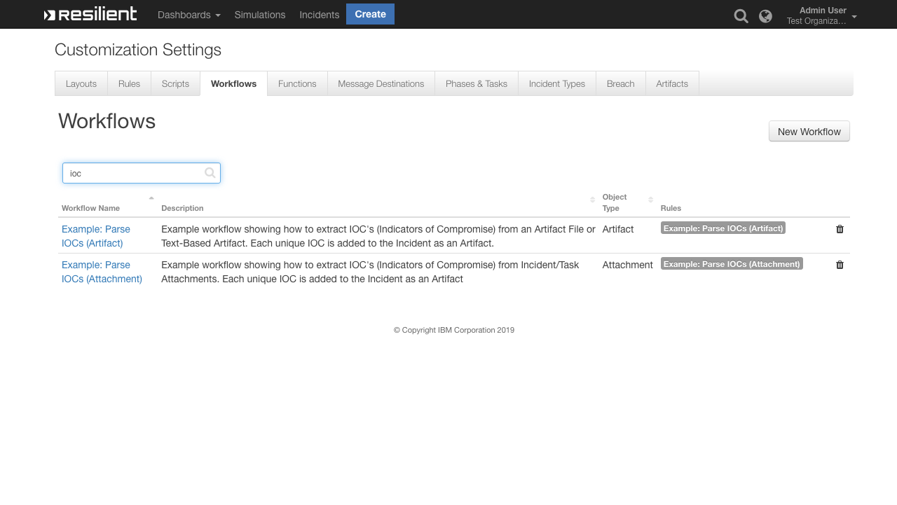

<!--
  This Install README.md is generated by running:
  "resilient-circuits docgen -p fn_ioc_parser_v2 --only-install-guide"

  It is best edited using a Text Editor with a Markdown Previewer. VS Code
  is a good example. Checkout https://guides.github.com/features/mastering-markdown/
  for tips on writing with Markdown

  If you make manual edits and run docgen again, a .bak file will be created

  Store any screenshots in the "doc/screenshots" directory and reference them like:
  
-->

# IOC Parser Function v2 for IBM Resilient

- [Release Notes](#release-notes)
- [Overview](#overview)
- [Requirements](#requirements)
- [Installation](#installation)
- [Uninstall](#uninstall)
- [Troubleshooting](#troubleshooting)
- [Support](#support)

---

## Release Notes
<!--
  Specify all changes in this release. Do not remove the release 
  notes of a previous release
-->
### v1.0.0
* Initial Release

---

## Overview
<!--
  Provide a high-level description of the function itself and its remote software or application.
  The text below is parsed from the "description" and "long_description" attributes in the setup.py file
-->
**These functions extract Indicators of Compromise (IOCs) from Resilient attachments and files**

 

Uses the IOCParser Python Library to extract IOCs from Resilient Attachments and Artifacts. All unique IOCs that are found are added to the Resilient Incident as an Artifact

---

## Requirements
<!--
  List any Requirements 
-->
* Resilient platform >= `v31.0.4254`
* An Integration Server running `resilient_circuits>=30.0.0`
  * To set up an Integration Server see: [ibm.biz/res-int-server-guide](https://ibm.biz/res-int-server-guide)

---

## Installation
* Download the `fn_ioc_parser_v2.zip`.
* Copy the `.zip` to your Integration Server and SSH into it.
* **Unzip** the package:
  ```
  $ unzip fn_ioc_parser_v2-x.x.x.zip
  ```
* **Change Directory** into the unzipped directory:
  ```
  $ cd fn_ioc_parser_v2-x.x.x
  ```
* **Install** the package:
  ```
  $ pip install fn_ioc_parser_v2-x.x.x.tar.gz
  ```
* Import the fn_ioc_parser_v2 **customizations** into the Resilient platform:
  ```
  $ resilient-circuits customize -y -l fn-ioc-parser-v2
  ```
* [Optional]: Run selftest to test the Integration you configured:
  ```
  $ resilient-circuits selftest -l fn-ioc-parser-v2
  ```
* **Run** resilient-circuits or restart the Service on Windows/Linux:
  ```
  $ resilient-circuits run
  ```


---

## Uninstall
* SSH into your Integration Server.
* **Uninstall** the package:
  ```
  $ pip uninstall fn-ioc-parser-v2
  ```

---

## Troubleshooting
There are several ways to verify the successful operation of a function.

### Resilient Action Status
* When viewing an incident, use the Actions menu to view **Action Status**.
* By default, pending and errors are displayed.
* Modify the filter for actions to also show Completed actions.
* Clicking on an action displays additional information on the progress made or what error occurred.

### Resilient Scripting Log
* A separate log file is available to review scripting errors.
* This is useful when issues occur in the pre-processing or post-processing scripts.
* The default location for this log file is: `/var/log/resilient-scripting/resilient-scripting.log`.

### Resilient Logs
* By default, Resilient logs are retained at `/usr/share/co3/logs`.
* The `client.log` may contain additional information regarding the execution of functions.

### Resilient-Circuits
* The log is controlled in the `.resilient/app.config` file under the section [resilient] and the property `logdir`.
* The default file name is `app.log`.
* Each function will create progress information.
* Failures will show up as errors and may contain python trace statements.

---

<!--
  If necessary, use this section to describe how to configure your security application to work with the integration.
  Delete this section if the user does not need to perform any configuration procedures on your product.

## Configure <Product_Name>

* Step One
* Step Two
* Step Three

---
-->

## Support
| Name | Version | Author | Support URL |
| ---- | ------- | ------ | ----------- |
| fn_ioc_parser_v2 | 1.0.0 | Resilient Labs | http://ibm.biz/resilientcommunity |