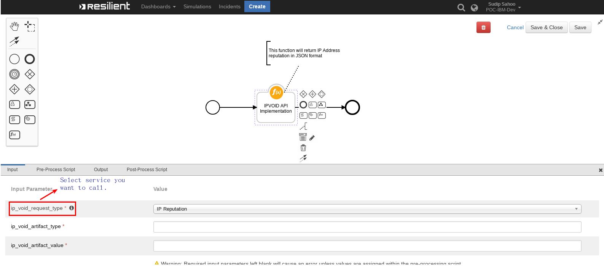

# IPVOID Search Function for IBM Resilient

## Table of Contents
  - [About This Package](#about-this-package)
  - [Prerequisites](#prerequisites)
  - [Installation](#installation)
  - [Function Inputs](#function-inputs)
  - [Function Output](#function-output)
  - [Pre-Process Script](#pre-process-script)
  - [Post-Process Script](#post-process-script)
---

## About This Package:
**This package contains a Function that integrates with your IPVOID account using their APIs**

 

* The function makes use of the IPVOID's Rest API calls to get information on a given query
* This package supports the following API calls:
  * IP Reputation `/iprep/v1/pay-as-you-go/`
  * SSL Info `/sslinfo/v1/pay-as-you-go/`
  * Threat Log `/threatlog/v1/pay-as-you-go/`
  * Email Verify `/emailverify/v1/pay-as-you-go/`
  * DNS Lookup `/dnslookup/v1/pay-as-you-go/`
  * Domain Blacklist `/domainbl/v1/pay-as-you-go/`

## Prerequisites:
* Resilient Appliance >= v31.0.0
* Integrations Server running resilient_circuits >= v30.0.0
* Account with [IPVOID](http://www.ipvoid.com/)
* An API Key from IPVOID

## Installation    
This package requires that it is installed on a RHEL or CentOS platform and uses the resilient-circuits framework.    
* Install this package using `pip`:
* Download the `.zip` file from our App Exchange and extract it. You will find a file called: `fn_ip_void-<version>.tar.gz`
* Copy this file to your Integrations Server
* To install the package, run:
    ```
    $ pip install pip install fn_ip_void-<version>.tar.gz
    ```
* To import the function, example rules and workflows into your Resilient Appliance, run:
    ```
    $ resilient-circuits customize -y -l fn-ip-void
    ```
* To update your `app.config` file with the required IPVOID configurations, run:
    ```
    $ resilient-circuits config -u
    ```
* Then open your `app.config` file and the following configuration data is added:
    ```
    [fn_ip_void]
    ipvoid_base_url=https://endpoint.apivoid.com
    ipvoid_api_key=<your-api-key>
    ```
* Run resilient-circuits:
    ```
    $ resilient-circuits run
    ```
* To uninstall:
    ```
    $ pip uninstall fn-ip-void
    ```

## Function Inputs:
| Input Name | Type | Required | Example | Info |
| ------------- | :--: | :-------:| ------- | ---- |
| `ip_void_artifact_type` | `String` | Yes | `"IP Address"` | Helps to identify request type |
| `ip_void_artifact_value` | `String` | Yes | `"185.157.185.248"` | Make search on given value, IP Address or DNS Name |
| `ip_void_request_type` | Select `String` | Yes | `"IP Reputation"` | Makes sure which IPVOID service to call |

## Function Output:
* To see the output of each of the API calls for this Function, we recommend running `resilient-circuits` in `DEBUG` mode.
* To do this run:
    ```
    $ resilient-circuits run --loglevel=DEBUG
    ```

### An Example Output:
```python
results = {
   "data":{
      "report":{
         "blacklists":{
            "engines":{
               "9":{
                  "engine":"Anti-Attacks BL",
                  "detected":false,
                  "reference":"https:\/\/www.anti-attacks.com\/",
                  "elapsed":"0.00"
               },
               "10":{
                  "engine":"BadIPs",
                  "detected":false,
                  "reference":"https:\/\/www.badips.com\/",
                  "elapsed":"0.00"
               },
               "11":{
                  "engine":"Bambenek Consulting",
                  "detected":false,
                  "reference":"http:\/\/www.bambenekconsulting.com\/",
                  "elapsed":"0.00"
               },
               "12":{
                  "engine":"Blacklists_co",
                  "detected":false,
                  "reference":"http:\/\/blacklists.co\/",
                  "elapsed":"0.00"
               },
               "13":{
                  "engine":"BlockList_de",
                  "detected":false,
                  "reference":"http:\/\/www.blocklist.de\/",
                  "elapsed":"0.00"
               },
               "14":{
                  "engine":"Blocklist.net.ua",
                  "detected":false,
                  "reference":"https:\/\/blocklist.net.ua\/",
                  "elapsed":"0.00"
               },
               "15":{
                  "engine":"BloggingFusion BL",
                  "detected":false,
                  "reference":"https:\/\/www.bloggingfusion.com\/",
                  "elapsed":"0.00"
               },
               "16":{
                  "engine":"Booru BL",
                  "detected":false,
                  "reference":"",
                  "elapsed":"0.00"
               },
               "17":{
                  "engine":"Botvrij.eu",
                  "detected":false,
                  "reference":"http:\/\/botvrij.eu\/",
                  "elapsed":"0.00"
               }
            },
            "detections":1,
            "engines_count":70,
            "detection_rate":"1%",
            "scantime":"0.07"
         }
      }
   },
   "credits_remained":93934.23,
   "credits_expiration":"Fri, 15 Mar 2019 22:06:23 GMT",
   "estimated_queries":"1,174,177",
   "elapsed_time":"0.17",
   "success":true
}
```
## Pre-Process Script:
* This example sets the `ip_void_artifact_value`, `ip_void_artifact_type`, `ip_void_request_type` input to the value and type of the Artifact the user took action on
```python
# The search value to send to IPVOID (may be any String that contains an IP Address, URL etc.)
inputs.ip_void_artifact_value = artifact.value
inputs.ip_void_artifact_type = artifact.type
```

## Post-Process Script:
* This example appends the Threat Intelligences to the Artifact's Description:.
```python
try:
    des = artifact.description.content
except Exception:
  des = None
  
if des is None:
  artifact.description = u"""IPVOID threat intelligence {0}""".format(results["data"])
else:
  artifact.description = des + u"""IPVOID threat intelligence {0}""".format(results["data"])
```
