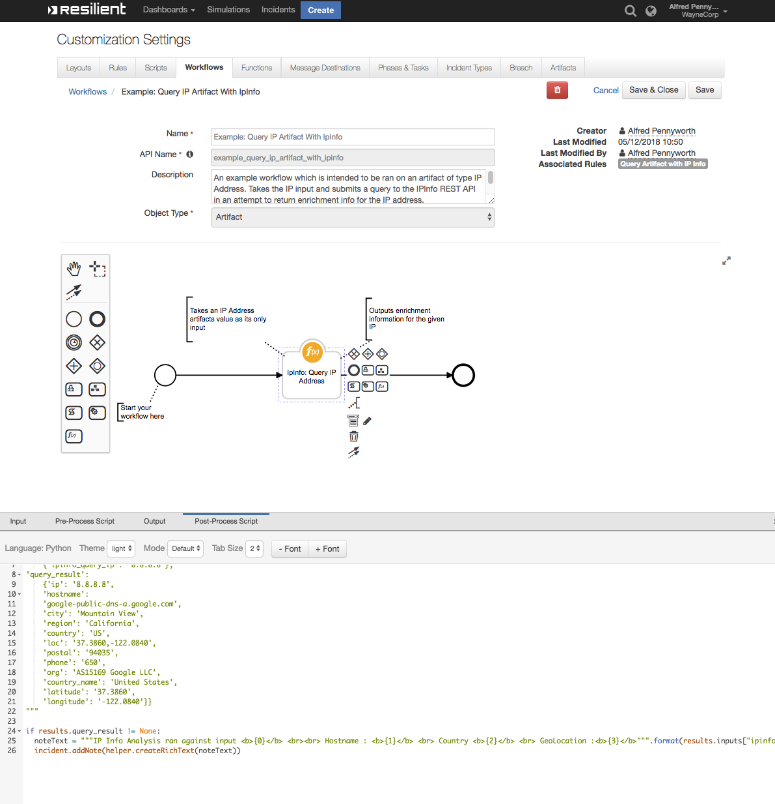

# IPInfo

**This package contains one function which provides enrichment information for an IP Address Artifact by querying that artifact in the IPInfo Database. Takes in an input of an IP address and then queries for information such as the location, ASN and hostname of the IP if any. Results are saved in a rich text note.**



## Table of Contents
- [Release Notes](#release-notes)
- [App Config Settings](#app-configuration)
- [Function Inputs](#function-inputs)
- [Pre-Process Script](#pre-process-script)
- [Post-Process Script](#post-process-script)
- [Output](#output-)
- [Rules](#rules)
---

## Release Notes
<!--
  Specify all changes in this release. Do not remove the release
  notes of a previous release
-->
| Version | Date | Notes |
| ------- | ---- | ----- |
| 1.0.2 | 03/2025 | Converted example workflows to python3 |
| 1.0.1 | 07/2020 | App Host Support|
| 1.0.0 | 12/2018 | Initial Release |

## App Configuration:
The following table provides the settings you need to configure the app. These settings are made in the app.config file. See the documentation discussed in the Requirements section for the procedure.

| Config | Required | Example | Description |
| ------ | :------: | ------- | ----------- |
| ipinfo_access_token | Yes | 123asb | Access Token |


## Function Inputs:
| Function Name | Type | Required | Example |
| ------------- | :--: | :-------:| ------- |
| `ipinfo_query_ip` | `String` | Yes | `'8.8.8.8'` |


## Pre-Process Script:
```python
inputs.ipinfo_query_ip = artifact.value
```

## Post-Process Script:
This example **adds a Note to the Incident.**
```python
if results.success:
  noteText = """IP Info Analysis ran against input <b>{0}</b> <br><br> Hostname : <b>{1}</b> <br> Country <b>{2}</b> <br> GeoLocation :<b>{3}</b>""".format(results.inputs["ipinfo_query_ip"], results.query_result['hostname'], results.query_result['country'], results.query_result['loc'])
  incident.addNote(helper.createRichText(noteText))
```

## Output :
```python
results = {
    'success': True,
    'inputs':
        {'ipinfo_query_ip': '8.8.8.8'},
    'query_result':
        {'ip': '8.8.8.8',
        'hostname':
        'google-public-dns-a.google.com',
        'city': 'Mountain View',
        'region': 'California',
        'country': 'US',
        'loc': '37.3860,-122.0840',
        'postal': '94035',
        'phone': '650',
        'org': 'AS15169 Google LLC',
        'country_name': 'United States',
        'latitude': '37.3860',
        'longitude': '-122.0840'}
        }

```
## Rules
| Rule Name | Object Type | Workflow Triggered |
| --------- | :---------: | ------------------ |
| 	Query Artifact with IP Info | `Artifact` | `Example: Query IP Artifact With IpInfo` |