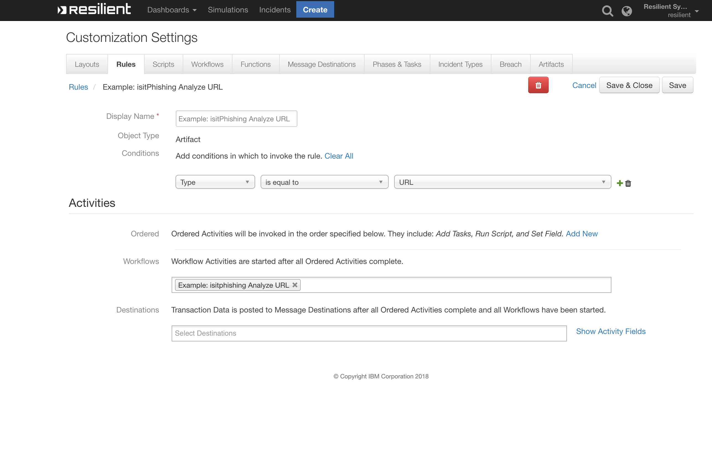
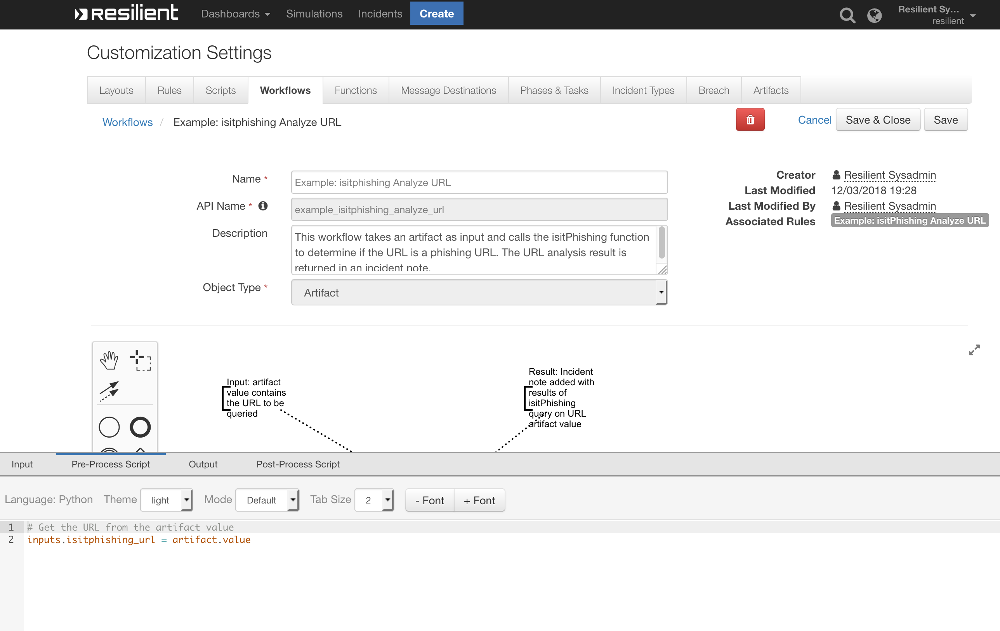
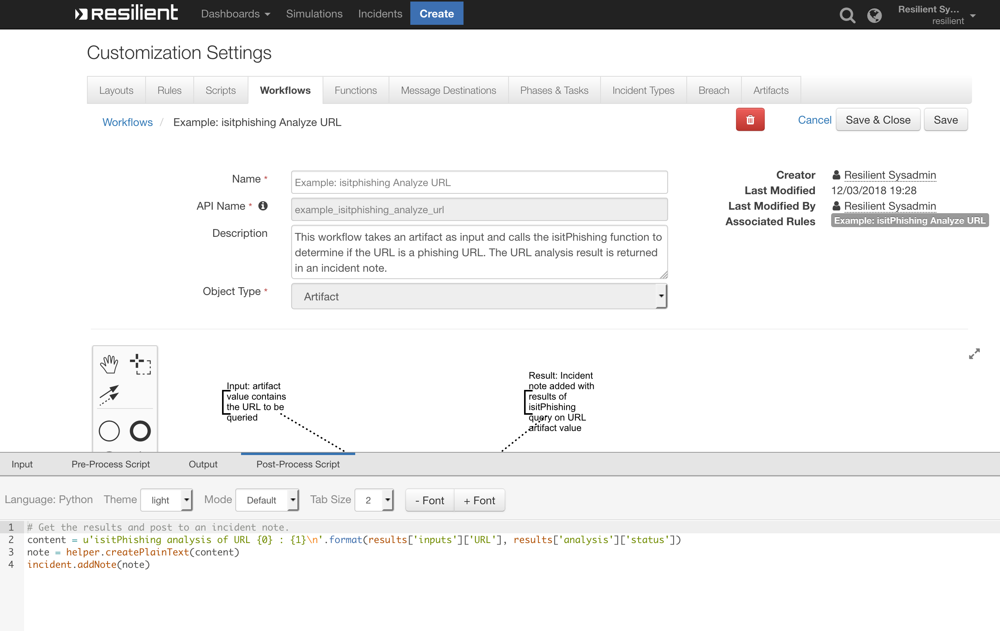

# Resilient Integration with isitPhishing
**This package contains one function that calls the Vade Secure IsItPhishing Webservice API to analyze a URL**

 
 
 

## app.config settings:
```
[fn_isitPhishing]
# Define the Vade Secure IsItPhishing Webservice API endpoint
#
isitPhishing_api_url=https://ws.isitphishing.org/api/v2/url
#
# You need a license key to use the Vade Secure IsItPhishing API. 
# This key will be provided to you by Vade Secure, and has the following format:
# <NAME>:<LICENSE>
isitPhishing_name=xxxx
isitPhishing_license=xxxx
```

## Function Inputs:
| Function Name | Type | Required | Example | Info |
| ------------- | :--: | :-------:| ------- | ---- |
| `isitPhishing`| `String` | Yes | `"http://www.thisisaphishingurl.com "` | N/A |


## Function Output:
```python

results = {
  analysis: {
    status: "PHISHING"
  },
  inputs: {
    URL: "URL_to_analyze"
  }
}

```

## Pre-Process Script:

```python
# Get the URL from the artifact value
inputs.isitphishing_url = artifact.value

```

## Post-Process Script:

```python
# Get the results and post to an incident note.
content = u'isitPhishing analysis of URL {0} : {1}\n'.format(results['inputs']['URL'], results['analysis']['status'])
note = helper.createPlainText(content)
incident.addNote(note)

```

## Rules
| Rule Name | Object Type | Workflow Triggered |
| --------- | :---------: | ------------------ |
| Example: isitPhishing Analyze URL | `Artifact` | `Example: isitPhishing Analyze URL` |

##