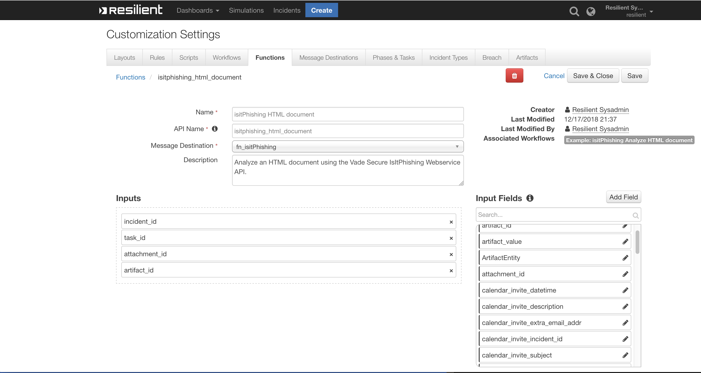

<!--
  This README.md is generated by running:
  "resilient-sdk docgen -p fn_isitphishing"

  It is best edited using a Text Editor with a Markdown Previewer. VS Code
  is a good example. Checkout https://guides.github.com/features/mastering-markdown/
  for tips on writing with Markdown

  If you make manual edits and run docgen again, a .bak file will be created

  Store any screenshots in the "doc/screenshots" directory and reference them like:
  
-->

# fn-isitphishing for IBM Resilient

## Table of Contents
- [Release Notes](#release-notes)
- [Overview](#overview)
  - [Key Features](#key-features)
- [Installation](#installation)
  - [Requirements](#requirements)
  - [Install](#install)
  - [App Configuration](#app-configuration)
- [Function - IsItPhishing HTML document](#function---isitphishing-html-document)
- [Function - IsItPhishing URL](#function---isitphishing-url)
- [Rules](#rules)
- [Troubleshooting & Support](#troubleshooting-&-support)
---

## Release Notes
<!--
  Specify all changes in this release. Do not remove the release 
  notes of a previous release
-->
### v1.0.0
* App Host support
* Package name changed from fn_isitPhishing to fn_isitphishing.

NOTE: Prior installs: edit your app.config file to change ```[fn_isitPhishing]``` to
```[fn_isitphishing]```

### v1.0.0
* Initial Release

---

## Overview
<!--
  Provide a high-level description of the function itself and its remote software or application.
  The text below is parsed from the "description" and "long_description" attributes in the setup.py file
-->
**Resilient Circuits Function that queries isitPhishing.org API to analyze a URL or an HTML document**


Resilient Circuits Function that queries IsItPhishing.org API to analyze a URL or an HTML document

### Key Features
<!--
  List the Key Features of the Integration
-->
* This package contains two functions that call the Vade Secure IsItPhishing Webservice API to analyze a URL or to analyze an HTML document. 
* 3 example workflows and rules to demonstrate how to invoke and use the functions.

---

## Installation

### Requirements
<!--
  List any Requirements 
-->
* Resilient platform >= `v36.0.5634`
* An App Host or an Integration Server:
  * To setup up an App Host see:  [ibm.biz/res-app-host-setup](https://ibm.biz/res-app-host-setup)
  * An Integration Server running `resilient_circuits>=31.0.0` (if using an Integration Server)
    * To set up an Integration Server see: [ibm.biz/res-int-server-guide](https://ibm.biz/res-int-server-guide)
    * If using an API key account, minimum required permissions are:
      | Name | Permissions |
      | ---- | ----------- |
      | Org Data | Read |
      | Function | Read |
* Proxy supported: Yes

---

### Install
* To install or uninstall an App using the App Host see [ibm.biz/res-install-app](https://ibm.biz/res-install-app)

* To install or uninstall an Integration using the Integration Server see the [ibm.biz/res-install-int](https://ibm.biz/res-install-int)
---

### App Configuration
The following table describes the settings you need to configure in the app.config file. If using App Host, see the Resilient System Administrator Guide. If using the integration server, see the Integration Server Guide.

| Config | Required | Example | Description |
| ------ | :------: | ------- | ----------- |
| **isitphishing_api_url** | Yes | `https://ws.isitphishing.org/api/v2` | *IsItPhishing endpoint* |
| **isitphishing_name** | Yes | `name` | *username from Vade Secure* |
| **isitphishing_license** | Yes | `license from Vade Secure` | *license from Vade Secure* |

---


## Function - IsItPhishing HTML document
Analyze an HTML document using the Vade Secure IsItPhishing Webservice API.

 

<details><summary>Inputs:</summary>
<p>

| Name | Type | Required | Example | Tooltip |
| ---- | :--: | :------: | ------- | ------- |
| `artifact_id` | `number` | No | `-` | - |
| `attachment_id` | `number` | No | `-` | - |
| `incident_id` | `number` | Yes | `-` | - |
| `task_id` | `number` | No | `-` | - |

</p>
</details>

<details><summary>Outputs:</summary>
<p>

```python
results = {'version': '1.0', 
           'success': True, 
           'reason': None, 
           'content': {'result': 'unknown'}, 
           'raw': '{"result": "unknown"}', 
           'inputs': {'incident_id': 2147, 
                      'attachment_id': 259, 
                      'filename': 'sample.html'}, 
           'metrics': {'version': '1.0', 'package': 'fn-isitphishing', 
                       'package_version': '1.1.0', 'host': 'MacBook-Pro.local', 
                       'execution_time_ms': 2800, 'timestamp': '2020-11-04 16:29:44'}}
```

</p>
</details>

<details><summary>Example Pre-Process Script:</summary>
<p>

```python
# Required inputs are: incident id and artifact id.
inputs.incident_id = incident.id
inputs.artifact_id = artifact.id
```

</p>
</details>

<details><summary>Example Post-Process Script:</summary>
<p>

```python
# Plaintext 
content = u"IsItPhishing analysis of artifact document {0} : {1}".format(results["inputs"]["filename"],results['content']['result'])

# Create a note
note = helper.createPlainText(content)

# Add note to the incident
incident.addNote(note)
```

</p>
</details>

---
## Function - IsItPhishing URL
Analyze a URL using the Vade Secure IsItPhishing Webservice API.

 

<details><summary>Inputs:</summary>
<p>

| Name | Type | Required | Example | Tooltip |
| ---- | :--: | :------: | ------- | ------- |
| `isitphishing_url` | `text` | Yes | `-` | - |

</p>
</details>

<details><summary>Outputs:</summary>
<p>

```python
results = {'content': {'status': 'PHISHING'}, 
           'inputs': {'URL': 'https://www.bill-netflix.com/index.php'}
}
```

</p>
</details>

<details><summary>Example Pre-Process Script:</summary>
<p>

```python
# Get the URL from the artifact value
inputs.isitphishing_url = artifact.value
```

</p>
</details>

<details><summary>Example Post-Process Script:</summary>
<p>

```python
# Get the results and post to an incident note.
content = u'IsItPhishing analysis of URL {0} : {1}\n'.format(results['inputs']['URL'], results['content']['status'])
note = helper.createPlainText(content)
incident.addNote(note)
```

</p>
</details>

---


## Rules
| Rule Name | Object | Workflow Triggered |
| --------- | ------ | ------------------ |
| Example: IsItPhishing Analyze URL | artifact | `example_isitphishing_analyze_url` |
| Example: IsItPhishing Analyze HTML Document: Artifact | artifact | `example_isitphishing_analyze_html_document_artifact` |
| Example: IsItPhishing Analyze HTML Document: Attachment | attachment | `example_isitphishing_analyze_html_document` |

---

## Troubleshooting & Support
If using the app with an App Host, see the Resilient System Administrator Guide and the App Host Deployment Guide for troubleshooting procedures. You can find these guides on the [IBM Knowledge Center](https://www.ibm.com/support/knowledgecenter/SSBRUQ), where you can select which version of the Resilient platform you are using.

If using the app with an integration server, see the [Integration Server Guide](https://ibm.biz/res-int-server-guide)

### For Support
This is a IBM Community Provided App. Please search the Community https://ibm.biz/resilientcommunity for assistance.
