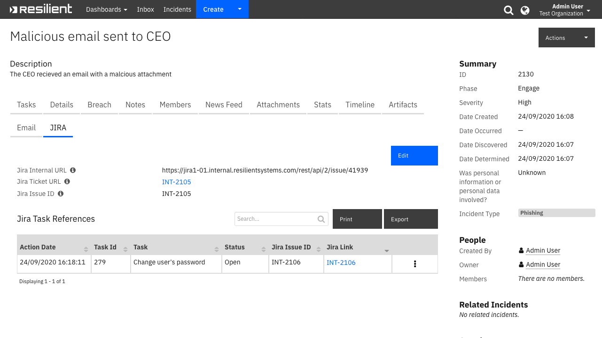
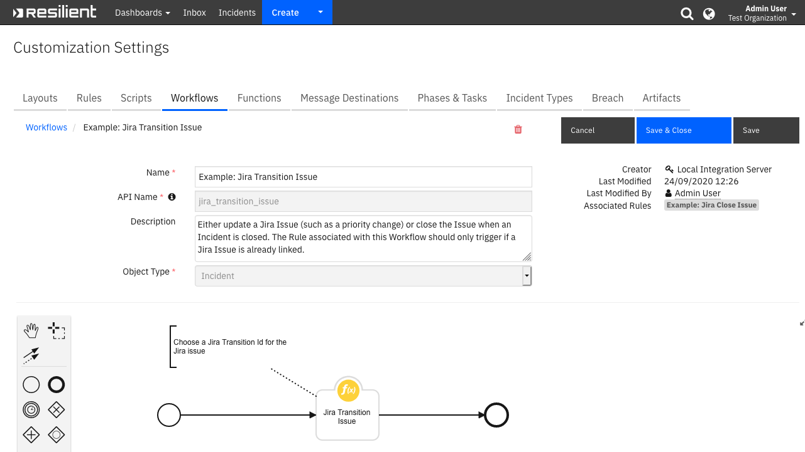
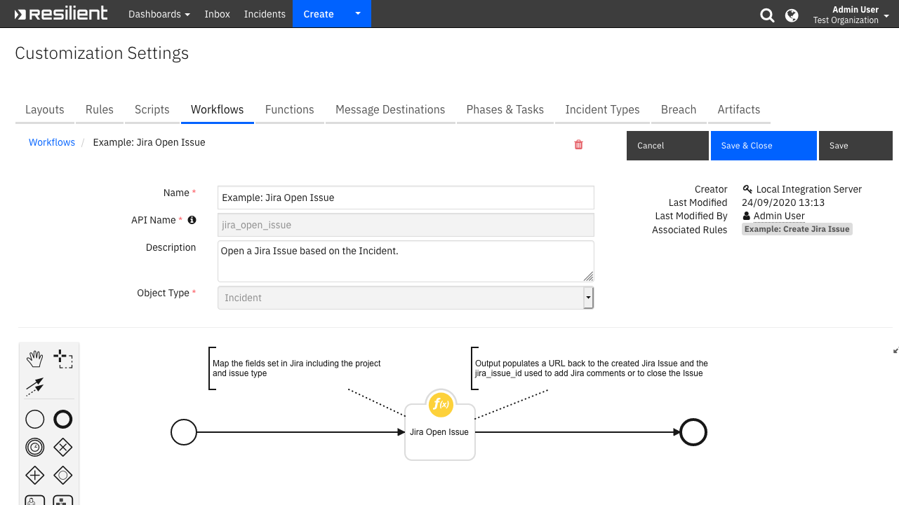
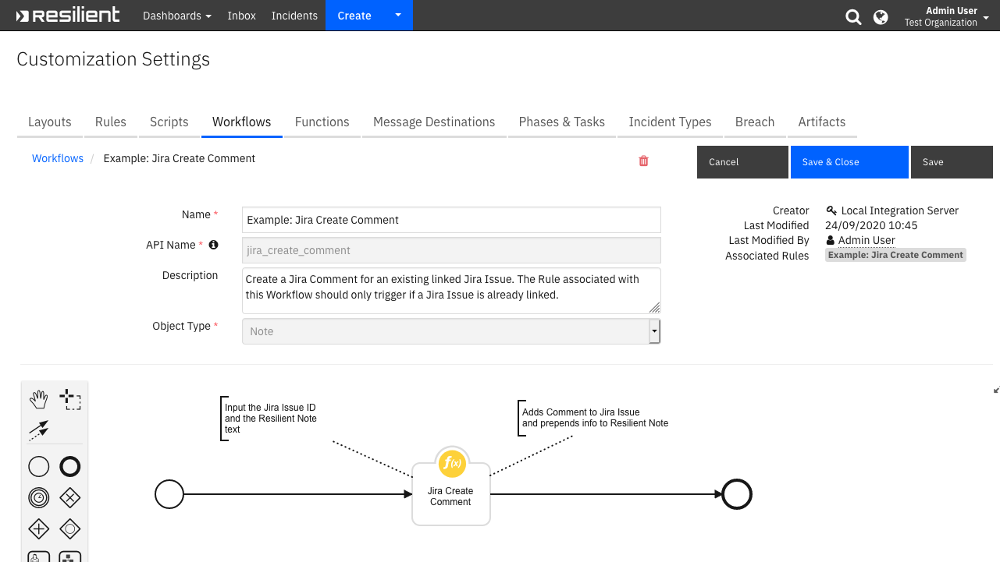

<!--
  This README.md is generated by running:
  "resilient-sdk docgen -p fn_jira"

  It is best edited using a Text Editor with a Markdown Previewer. VS Code
  is a good example. Checkout https://guides.github.com/features/mastering-markdown/
  for tips on writing with Markdown

  If you make manual edits and run docgen again, a .bak file will be created

  Store any screenshots in the "doc/screenshots" directory and reference them like:
  
-->

# Atlassian Jira Functions for Resilient

## Table of Contents
- [Release Notes](#release-notes)
- [Overview](#overview)
  - [Key Features](#key-features)
- [Installation](#installation)
  - [Requirements](#requirements)
  - [Install](#install)
  - [App Configuration](#app-configuration)
  - [Configuring OAuth](#configuring-oauth)
  - [Custom Layouts](#custom-layouts)
- [Function - Jira Transition Issue](#function---jira-transition-issue)
- [Function - Jira Open Issue](#function---jira-open-issue)
- [Function - Jira Create Comment](#function---jira-create-comment)
- [Data Table - Jira Task References](#data-table---jira-task-references)
- [Custom Fields](#custom-fields)
- [Rules](#rules)
- [Troubleshooting & Support](#troubleshooting-&-support)
---

## Release Notes
<!--
  Specify all changes in this release. Do not remove the release 
  notes of a previous release
-->
### v2.1.0
* Added support for authentication with OAuth
  * Includes new configs: `access_token`, `access_token_secret`, `consumer_key_name`, `private_rsa_key_file_path`
* Added support for sending SOAR task notes to Jira -- see updated example workflow
* Added support for images in notes synchronizing to Jira
* Added config `jira_task_references` for custom datatables

### v2.0.0
* Added App Host support
* Added proxy support
* Added support for https://pypi.org/project/jira/
* Changed config heading from `jira` to `fn_jira`
* Added configs: `timeout`, `auth_method`, `http_proxy` and `https_proxy`
* Added incident field `jira_issue_id`
* Changed column name in `jira_task_references` Data Table from `jira_api_url` to `jira_issue_id_col`

### v1.0.2
* Improvements to data table handling
* Bug fixes

### v1.0.1
* Support for versions of Resilient 31.0 and beyond

### v1.0.0
* Initial Release

---

## Overview
<!--
  Provide a high-level description of the function itself and its remote software or application.
  The text below is parsed from the "description" and "long_description" attributes in the setup.py file
-->
**Provides integration with JIRA for Issue Creation, Issue Transition and Comment Creation**

 

This app allows for the tracking of Resilient Incidents and Tasks as Jira Issues. Bidirectional links are saved to allow for easy navigation between the applications.


It also allows for the transitioning of Jira issues when the corresponding incident is closed and adds comments to the Jira issue when a Note is created in Resilient.


Example rules and workflows can used used or modified to meet your business processes.


### Key Features
<!--
  List the Key Features of the Integration
-->
* Issue creation
* Issue transition
* Comment creation

---

## Installation

### Requirements
<!--
  List any Requirements 
-->
* Resilient platform >= `v35.0.0`
* App Host >= `v1.2.132` (if using App Host)
  * To setup up an App Host see:  [ibm.biz/res-app-host-setup](https://ibm.biz/res-app-host-setup)
* An Integration Server running `resilient_circuits>=32.0.0` (if using an Integration Server)
  * To set up an Integration Server see: [ibm.biz/res-int-server-guide](https://ibm.biz/res-int-server-guide)
  * If using an API key account, minimum required permissions are:
    | Name | Permissions |
    | ---- | ----------- |
    | Org Data | Read |
    | Function | Read |
* Proxy supported: Yes

---

### Install
* To install or uninstall an App using the App Host see [ibm.biz/res-install-app](https://ibm.biz/res-install-app)

* To install or uninstall an Integration using the Integration Server see the [ibm.biz/res-install-int](https://ibm.biz/res-install-int)
---

### App Configuration
The following table describes the settings you need to configure in the app.config file. If using App Host, see the Resilient System Administrator Guide. If using the integration server, see the Integration Server Guide.

| Config | Required | Example | Description |
| ------ | :------: | ------- | ----------- |
| **url** | Yes | `https://<jira url>` | The URL of your Jira platform. |
| **auth_method** | Yes | `AUTH` | The method of authentication to use when connecting to your Jira platform. Supported methods are `AUTH`, `BASIC`, and `OAUTH`. For more information on authentication see: https://jira.readthedocs.io/en/latest/examples.html#authentication |
| **user** | Required for `AUTH` or `BASIC` | `<jira user>` | The username of the Jira account to use with this integration. They must be a user on the Jira platform with the correct permissions.  |
| **password** | Required for `AUTH` or `BASIC` | `<jira user password>` | The password or API Key for the Jira account to use with this integration. |
| **access_token** | Required for `OAUTH` | `<oauth access token>` | Access token created through Jira OAuth 1.0a 3LO. Details below. |
| **access_token_secret** | Required for `OAUTH` | `<oauth access secret>` | Access token secret created through Jira OAuth 1.0a 3LO. Details below. |
| **consumer_key_name** | Required for `OAUTH` | `<oauth consumer key>` | Consumer Key name created through Jira UI. Details below. |
| **private_rsa_key_file_path** | Required for `OAUTH` | `/etc/jira_privatekey.pem` | Path to file containing private RSA key associated with the public key that was uploaded in the UI. Details below. |
| **timeout** | No | `10` | The number of seconds to timeout after when making a request to the Jira platform. |
| **jira_dt_name** | No | `jira_task_references` | The datatable in which to store the data for synced SOAR tasks. Default is `jira_task_references`. If using a custom Datatable, this table *must* include the `task_id`, `jira_issue_id_col`, and `jira_link` columns. |
| **verify_cert** | No | `True` | A boolean value. Set to `True` if you want ti verify SSL certificates on each request. |
| **http_proxy** | No | `http://localhost:3128` |  Your HTTP Proxy. |
| **https_proxy** | No | `https://localhost:3128` |  Your HTTPS Proxy. |

### Configuring OAuth
OAuth authentication is supported with OAuth 1.0a protocol on Jira Server and Jira Cloud. This requires setting some configurations through the Jira UI followed by the 3 legged-dance described in the docs linked below. The main goal of this process is to generate a public and private RSA key, as well as a `access_token` and `access_token_secret`. Follow the steps at the appropriate links to setup the RSA keys and generate an access token. Then set the values as appropriate in your app.config. It is recommended to use App Host secrets to store the tokens if deploying on App Host.

Follow the instructions at the appropriate link:

* [OAuth on Jira Server](https://developer.atlassian.com/server/jira/platform/oauth/#step-1--configure-jira) (only step 1)
* [OAuth 1.0a on Jira Cloud](https://developer.atlassian.com/cloud/jira/platform/jira-rest-api-oauth-authentication/#step-2--configure-the-client-application-as-an-oauth-consumer) (only step 2)

> As of v2.1.0, this app only supports OAuth 1.0a authentication to Jira.

Once you've completed the linked step above, you can continue with the rest of Jira's guide (in Java) or you can follow the Python steps below.
> Note: these steps have been verified on Python 3.6. No matter the environment that you run the app in, it is recommended to run these steps with Python 3.6.

1. Create a python environment on a machine that has internet access to your Jira server. Install `jira` in the python environment and the required associated dependencies

    ```
    $ pip install jira cryptography pyjwt IPython
    ```

    This will also install the `jirashell` utility which will be used in the next step.

1. Use the `jirashell` utility to preform the OAuth dance:

    ```
    $ jirashell --oauthdance --consumer-key <name_of_consumer_key_in_jira_ui> --key-cert <path_to_private_rsa_key> --print-tokens
    ```

    This will prompt you at a point to follow a link to sign-in and authorize the OAuth tokens. Click "Allow" and return to the shell. Type `y` and hit enter. The Access Token and Access Token Secret will be printed to your terminal. You can now exit the `jirashell` prompt.

1. Use the token and secret printed to your terminal to provide access to Jira for this app. If running in App Host, it is recommended to enter the values of the tokens as secrets in the app's **Configuration** tab by clicking **Add Secret** and upload the private key as a file by clicking **New File**.

---

### Custom Layouts
<!--
  Use this section to provide guidance on where the user should add any custom fields and data tables.
  You may wish to recommend a new incident tab.
  You should save a screenshot "custom_layouts.png" in the doc/screenshots directory and reference it here
-->
* Import the Data Tables and Custom Fields like the screenshot below:

  

---

## Function - Jira Transition Issue
Transition a Jira issue. This can be used when a Resilient Incident is closed or to change the Jira Issue's workflow state.
See example workflow for configuration of function pre-processor and post-processor scripts

 

<details><summary>Inputs:</summary>
<p>

| Name | Type | Required | Example | Tooltip |
| ---- | :--: | :------: | ------- | ------- |
| `jira_comment` | `text` | No | `"Updated in IBM Resilient"` | The comment to add to the issue in Jira |
| `jira_fields` | `text` | No | `-` | A JSON String of the fields to set in Jira |
| `jira_issue_id` | `text` | Yes | `JRA-1000` | The ID of the issue in Jira. Also known as the issue key. E.g: "JRA-1330" |
| `jira_transition_id` | `text` | Yes | `11` | The ID to transition the Jira issue to. More information can be found in the Jira Documentation on transition_id |

</p>
</details>

<details><summary>Outputs:</summary>
<p>

```python
results = {
    'version': '1.0',
    'success': True,
    'reason': None,
    'content': 'Done',
    'raw': '"Done"',
    'inputs': {
        'jira_issue_id': 'INT-2106',
        'jira_transition_id': 'Close',
        'jira_fields': '{ "resolution":{ "name":"Done" } }',
        'jira_comment': 'Closed in IBM Resilient\n\nResolution: Done\n'
    },
    'metrics': {
        'version': '1.0',
        'package': 'fn-jira',
        'package_version': '2.0.0',
        'host': 'example',
        'execution_time_ms': 1357,
        'timestamp': '2020-09-24 16:27:09'
    }
}
```

</p>
</details>

<details><summary>Workflows</summary>

  <details><summary>Example Pre-Process Script:</summary>
  <p>

  ```python
  # Example: Jira Transition Issue pre-processing script

#######################################
### Define pre-processing functions ###
#######################################
def dict_to_json_str(d):
  """Function that converts a dictionary into a JSON string.
     Supports types: basestring, unicode, bool, int and nested dicts.
     Does not support lists.
     If the value is None, it sets it to False."""

  json_entry = u'"{0}":{1}'
  json_entry_str = u'"{0}":"{1}"'
  entries = [] 

  for entry in d:
    key = entry
    value = d[entry]

    if value is None:
      value = False

    if isinstance(value, list):
      helper.fail('dict_to_json_str does not support Python Lists')

    if isinstance(value, basestring):
      value = value.replace(u'"', u'\\"')
      entries.append(json_entry_str.format(unicode(key), unicode(value)))

    elif isinstance(value, unicode):
      entries.append(json_entry.format(unicode(key), unicode(value)))
    
    elif isinstance(value, bool):
      value = 'true' if value == True else 'false'
      entries.append(json_entry.format(key, value))

    elif isinstance(value, int):
      entries.append(json_entry.format(unicode(key), value))

    elif isinstance(value, dict):
      entries.append(json_entry.format(key, dict_to_json_str(value)))

    else:
      helper.fail('dict_to_json_str does not support this type: {0}'.format(type(value)))

  return u'{0} {1} {2}'.format(u'{', ','.join(entries), u'}')
  

#####################
### Define Inputs ###
#####################

inputs.jira_issue_id = incident.properties.jira_issue_id
inputs.jira_transition_id = "Close"
inputs.jira_comment = u"Closed in IBM Resilient\n\nResolution: {0}\n{1}".format(incident.resolution_id, incident.resolution_summary.content)

resolution_map = { "unresolved": "Obsolete", "duplicate": "Duplicate", "not an issue": "Won't Do", "resolved": "Done" }

# Define JIRA fields here
inputs.jira_fields = dict_to_json_str({
  "resolution": { "name": resolution_map.get(str(incident.resolution_id).lower(), "Done") }
})
  ```

  </p>
  </details>

  <details><summary>Example Post-Process Script:</summary>
  <p>

  ```python
  from java.util import Date
time_now = Date().time

if results.success:
  row.date = time_now
  row.status = "Closed"

  ```

  </p>
  </details>

</details>

---
## Function - Jira Open Issue
Create a jira issue. To be used when a Resilient Incident is created.
See example workflow for configuration of function pre-processor and post-processor scripts

 

**NOTE:** Some fields in Jira are required to open a new Issue. Ensure you add those fields in the pre-process script to `jira_fields` when creating a new Jira Issue

<details><summary>Inputs:</summary>
<p>

| Name | Type | Required | Example | Tooltip |
| ---- | :--: | :------: | ------- | ------- |
| `incident_id` | `number` | Yes | `-` | - |
| `jira_fields` | `text` | No | `-` | A JSON String of the fields to set in Jira |
| `task_id` | `number` | No | `-` | - |

</p>
</details>

<details><summary>Outputs:</summary>
<p>

```python
results = {
    'version': '1.0',
    'success': True,
    'reason': None,
    'content': {
        'issue_url': 'https://jira1-01.example.com/browse/INT-2105',
        'issue_url_internal': 'https://jira1-01.example.com/rest/api/2/issue/41939',
        'issue_key': 'INT-2105',
        'issue': {
            'expand': 'renderedFields,names,schema,operations,editmeta,changelog,versionedRepresentations',
            'id': '41939',
            'self': 'https://jira1-01.example.com/rest/api/2/issue/41939',
            'key': 'INT-2105',
            'fields': {
                'issuetype': {
                    'self': 'https://jira1-01.example.com/rest/api/2/issuetype/10001',
                    'id': '10001',
                    'description': 'Created by Jira Software - do not edit or delete. Issue type for a user story.',
                    'iconUrl': 'https://jira1-01.example.com/images/icons/issuetypes/story.svg',
                    'name': 'Story',
                    'subtask': False
                },
                'timespent': None,
                'project': {
                    'self': 'https://jira1-01.example.com/rest/api/2/project/10101',
                    'id': '10101',
                    'key': 'INT',
                    'name': 'Example',
                    'projectTypeKey': 'software',
                    'avatarUrls': {
                        '48x48': 'https://jira1-01.example.com/secure/projectavatar?avatarId=10324',
                        '24x24': 'https://jira1-01.example.com/secure/projectavatar?size=small&avatarId=10324',
                        '16x16': 'https://jira1-01.example.com/secure/projectavatar?size=xsmall&avatarId=10324',
                        '32x32': 'https://jira1-01.example.com/secure/projectavatar?size=medium&avatarId=10324'
                    }
                },
                'fixVersions': [],
                'aggregatetimespent': None,
                'resolution': None,
                'customfield_10901': {
                    'self': 'https://jira1-01.example.com/rest/api/2/customFieldOption/10807',
                    'value': 'No',
                    'id': '10807'
                },
                'resolutiondate': None,
                'lastViewed': None,
                'watches': {
                    'self': 'https://jira1-01.example.com/rest/api/2/issue/INT-2105/watchers',
                    'watchCount': 1,
                    'isWatching': True
                },
                'created': '2020-09-24T15:10:06.296+0000',
                'customfield_10220': None,
                'priority': {
                    'self': 'https://jira1-01.example.com/rest/api/2/priority/2',
                    'iconUrl': 'https://jira1-01.example.com/secure/attachment/14751/high.svg',
                    'name': 'High',
                    'id': '2'
                },
                'labels': [],
                'timeestimate': None,
                'aggregatetimeoriginalestimate': None,
                'versions': [],
                'customfield_10219': None,
                'issuelinks': [],
                'assignee': None,
                'updated': '2020-09-24T15:10:06.296+0000',
                'status': {
                    'self': 'https://jira1-01.example.com/rest/api/2/status/1',
                    'description': 'The issue is open and ready for the assignee to start work on it.',
                    'iconUrl': 'https://jira1-01.example.com/images/icons/statuses/open.png',
                    'name': 'Open',
                    'id': '1',
                    'statusCategory': {
                        'self': 'https://jira1-01.example.com/rest/api/2/statuscategory/2',
                        'id': 2,
                        'key': 'new',
                        'colorName': 'blue-gray',
                        'name': 'To Do'
                    }
                },
                'components': [],
                'timeoriginalestimate': None,
                'description': 'IBM Resilient Link: https://example.ibm.com:443/#incidents/2130\n\nThe CEO recieved an email with a malcious attachment',
                'timetracking': {},
                'attachment': [],
                'aggregatetimeestimate': None,
                'summary': 'IBM Resilient: Malicious email sent to CEO',
                'creator': {
                    'self': 'https://jira1-01.example.com/rest/api/2/user?username=example',
                    'name': 'example',
                    'key': 'example',
                    'emailAddress': 'example@ibm.com',
                    'avatarUrls': {
                        '48x48': 'https://jira1-01.example.com/secure/useravatar?ownerId=example&avatarId=10713',
                        '24x24': 'https://jira1-01.example.com/secure/useravatar?size=small&ownerId=example&avatarId=10713',
                        '16x16': 'https://jira1-01.example.com/secure/useravatar?size=xsmall&ownerId=example&avatarId=10713',
                        '32x32': 'https://jira1-01.example.com/secure/useravatar?size=medium&ownerId=example&avatarId=10713'
                    },
                    'displayName': 'example',
                    'active': True,
                    'timeZone': 'UTC'
                },
                'subtasks': [],
                'reporter': {
                    'self': 'https://jira1-01.example.com/rest/api/2/user?username=example',
                    'name': 'example',
                    'key': 'example',
                    'emailAddress': 'example@ibm.com',
                    'avatarUrls': {
                        '48x48': 'https://jira1-01.example.com/secure/useravatar?ownerId=example&avatarId=10713',
                        '24x24': 'https://jira1-01.example.com/secure/useravatar?size=small&ownerId=example&avatarId=10713',
                        '16x16': 'https://jira1-01.example.com/secure/useravatar?size=xsmall&ownerId=example&avatarId=10713',
                        '32x32': 'https://jira1-01.example.com/secure/useravatar?size=medium&ownerId=example&avatarId=10713'
                    },
                    'displayName': 'example',
                    'active': True,
                    'timeZone': 'UTC'
                },
                'aggregateprogress': {
                    'progress': 0,
                    'total': 0
                },
                'environment': None,
                'duedate': None,
                'progress': {
                    'progress': 0,
                    'total': 0
                },
                'comment': {
                    'comments': [],
                    'maxResults': 0,
                    'total': 0,
                    'startAt': 0
                },
                'votes': {
                    'self': 'https://jira1-01.example.com/rest/api/2/issue/INT-2105/votes',
                    'votes': 0,
                    'hasVoted': False
                },
                'worklog': {
                    'startAt': 0,
                    'maxResults': 20,
                    'total': 0,
                    'worklogs': []
                }
            }
        }
    },
    'raw': '{"issue_url": "https://jira1-01.example.com/browse/INT-2105", "issue_url_internal": "https://jira1-01.example.com/rest/api/2/issue/41939", "issue_key": "INT-2105", "issue": ...
    'inputs': {
        'incident_id': 2130,
        'jira_fields': '{ "summary":"IBM Resilient: Malicious email sent to CEO","issuetype":"Story","project":"INT","description":"<div class=\\"rte\\"><div>The CEO recieved an email with a malcious attachment</div></div>","priority":{ "name":"High" } }'
    },
    'metrics': {
        'version': '1.0',
        'package': 'fn-jira',
        'package_version': '2.0.0',
        'host': 'example',
        'execution_time_ms': 2016,
        'timestamp': '2020-09-24 16:09:51'
    }
}
```

</p>
</details>

<details><summary>Workflows</summary>

  <details><summary>Example Pre-Process Script:</summary>
  <p>

  ```python
  # Example: Jira Open Issue [Incident] pre-processing script

#######################################
### Define pre-processing functions ###
#######################################
def list_to_json_str(l):
  """
  Function that converts a list into a JSON string.
  Supports types: basestring, unicode, bool, int, list and dicts.
  If the value is None, it sets it to False.
  """
  list_as_str = ''
  json_entry = u'{0},'
  json_entry_str = u'"{0}",'

  for value in l:

    if value is None:
      value = False

    if isinstance(value, list):
      list_as_str += json_entry.format(list_to_json_str(value))

    elif isinstance(value, dict):
      list_as_str += json_entry.format(dict_to_json_str(value))

    elif isinstance(value, basestring):
      value = value.replace(u'"', u'\\"')
      value = value.replace("\n", "\\n")
      list_as_str += json_entry_str.format(unicode(value))

    elif isinstance(value, unicode):
      list_as_str += json_entry.format(unicode(value))

    elif isinstance(value, bool):
      value = 'true' if value is True else 'false'
      list_as_str += json_entry.format(value)

    elif isinstance(value, int):
      list_as_str += json_entry.format(value)

    else:
      helper.fail('list_to_json_str does not support this type: {0}'.format(type(value)))

  return u'{0} {1} {2}'.format(u'[', list_as_str[:-1], u']')

def dict_to_json_str(d):
  """
  Function that converts a dictionary into a JSON string.
  Supports types: basestring, unicode, bool, int, list and nested dicts.
  If the value is None, it sets it to False.
  """

  json_entry = u'"{0}":{1}'
  json_entry_str = u'"{0}":"{1}"'
  entries = []

  for entry in d:
    key = entry
    value = d[entry]

    if value is None:
      value = False

    if isinstance(value, list):
      entries.append(json_entry.format(unicode(key), list_to_json_str(value)))

    elif isinstance(value, dict):
      entries.append(json_entry.format(key, dict_to_json_str(value)))

    elif isinstance(value, basestring):
      value = value.replace(u'"', u'\\"')
      value = value.replace("\n", "\\n")
      entries.append(json_entry_str.format(unicode(key), unicode(value)))

    elif isinstance(value, unicode):
      entries.append(json_entry.format(unicode(key), unicode(value)))

    elif isinstance(value, bool):
      value = 'true' if value is True else 'false'
      entries.append(json_entry.format(key, value))

    elif isinstance(value, int):
      entries.append(json_entry.format(unicode(key), value))

    else:
      helper.fail('dict_to_json_str does not support this type: {0}'.format(type(value)))

  return u'{0} {1} {2}'.format(u'{', ','.join(entries), u'}')

#####################
### Define Inputs ###
#####################

# ID of this incident
inputs.incident_id = incident.id

# A map for JIRA priorities
priority_map = { "Low": {"name": "Low"}, "Medium": {"name": "Medium"}, "High": {"name": "High"} }
jira_priority = priority_map.get(incident.severity_code, {"name": "Low"})

# Define JIRA fields here
inputs.jira_fields = dict_to_json_str({
  "project": "INT",
  "issuetype": rule.properties.jira_issue_type,
  "priority": jira_priority,
  "summary": u"IBM Resilient: {0}".format(incident.name),
  "description": incident.description.content if incident.get("description") else "Created in IBM Resilient"
})

  ```

  </p>
  </details>

  <details><summary>Example Post-Process Script:</summary>
  <p>

  ```python
  
if results.success:
  results_content = results.get("content", {})
  incident.properties.jira_url = "<a href='{}' target='blank'>{}</a>".format(results_content.get("issue_url"), results_content.get("issue_key"))
  incident.properties.jira_internal_url = results_content.get("issue_url_internal")
  incident.properties.jira_issue_id = results_content.get("issue_key")
  ```

  </p>
  </details>

</details>

---
## Function - Jira Create Comment
Create a Jira comment. To be used when a Resilient Note is created.
See example workflow for configuration of function pre-processor and post-processor scripts

 

<details><summary>Inputs:</summary>
<p>

| Name | Type | Required | Example | Tooltip |
| ---- | :--: | :------: | ------- | ------- |
| `jira_comment` | `text` | No | `"Updated in IBM Resilient"` | The comment to add to the issue in Jira |
| `jira_issue_id` | `text` | Yes | `JRA-1000` | The ID of the issue in Jira. Also known as the issue key. E.g: "JRA-1330" |

</p>
</details>

<details><summary>Outputs:</summary>
<p>

```python
results = {
    'version': '1.0',
    'success': True,
    'reason': None,
    'content': {
        'self': 'https://jira1-01.example.com/rest/api/2/issue/41939/comment/53123',
        'id': '53123',
        'author': {
            'self': 'https://jira1-01.example.com/rest/api/2/user?username=.example',
            'name': 'example',
            'key': 'example',
            'emailAddress': 'example@ibm.com',
            'avatarUrls': {
                '48x48': 'https://jira1-01.example.com/secure/useravatar?ownerId=.example&avatarId=10713',
                '24x24': 'https://jira1-01.example.com/secure/useravatar?size=small&ownerId=.example&avatarId=10713',
                '16x16': 'https://jira1-01.example.com/secure/useravatar?size=xsmall&ownerId=.example&avatarId=10713',
                '32x32': 'https://jira1-01.example.com/secure/useravatar?size=medium&ownerId=.example&avatarId=10713'
            },
            'displayName': 'example',
            'active': True,
            'timeZone': 'UTC'
        },
        'body': 'Please note that the CEO is travelling',
        'updateAuthor': {
            'self': 'https://jira1-01.example.com/rest/api/2/user?username=.example',
            'name': 'example',
            'key': 'example',
            'emailAddress': 'example@ibm.com',
            'avatarUrls': {
                '48x48': 'https://jira1-01.example.com/secure/useravatar?ownerId=.example&avatarId=10713',
                '24x24': 'https://jira1-01.example.com/secure/useravatar?size=small&ownerId=.example&avatarId=10713',
                '16x16': 'https://jira1-01.example.com/secure/useravatar?size=xsmall&ownerId=.example&avatarId=10713',
                '32x32': 'https://jira1-01.example.com/secure/useravatar?size=medium&ownerId=.example&avatarId=10713'
            },
            'displayName': 'example',
            'active': True,
            'timeZone': 'UTC'
        },
        'created': '2020-09-24T15:23:12.870+0000',
        'updated': '2020-09-24T15:23:12.870+0000'
    },
    'raw': '{"self": "https://jira1-01.example.com/rest/api/2/issue/41939/comment/53123", "id": "53123", "author": ...
    'inputs': {
        'jira_issue_id': 'INT-2105',
        'jira_comment': '<div class="rte"><div>Please note that the CEO is travelling</div></div>'
    },
    'metrics': {
        'version': '1.0',
        'package': 'fn-jira',
        'package_version': '2.0.0',
        'host': 'example',
        'execution_time_ms': 1150,
        'timestamp': '2020-09-24 16:22:57'
    }
}
```

</p>
</details>

<details><summary>Workflows</summary>

  <details><summary>Example Pre-Process Script:</summary>
  <p>

  ```python
# Example: Jira Create Comment pre-processing script

inputs.jira_issue_id = incident.properties.jira_issue_id
inputs.jira_comment = note.text.content
inputs.incident_id = incident.id

# If this is a task note, get the taskId
if note.type == 'task':
    # Set the task_id
    inputs.task_id = task.id
  ```

  </p>
  </details>

  <details><summary>Example Post-Process Script:</summary>
  <p>

  ```python
# Example: Jira Create Comment post-process script

# Import Date
from java.util import Date

if results.success:
    # Get the current time
    dt_now = Date()
    
    if results.get("content", {}).get("jira_url"):
        jira_url = results.get("content", {}).get("jira_url")
    else:
        jira_url = incident.properties.jira_url.content
    
    # Prepend message and time to the note
    note.text = u"<b>Sent to the Jira issue {0} at {1}</b><br>{2}".format(jira_url, dt_now, unicode(note.text.content))
  ```

  </p>
  </details>

</details>

---


## Data Table - Jira Task References

 

#### API Name:
jira_task_references

#### Columns:
| Column Name | API Access Name | Type | Tooltip |
| ----------- | --------------- | ---- | ------- |
| Action Date | `date` | `datetimepicker` | - |
| Jira Issue ID | `jira_issue_id_col` | `text` | - |
| Jira Link | `jira_link` | `textarea` | - |
| Status | `status` | `text` | - |
| Task | `task` | `textarea` | - |
| Task Id | `task_id` | `text` | - |

---

## Custom Fields
| Label | API Access Name | Type | Prefix | Placeholder | Tooltip |
| ----- | --------------- | ---- | ------ | ----------- | ------- |
| Jira Ticket URL | `jira_url` | `textarea` | `properties` | - | Contains URL back to the Jira issue created via the UI |
| Jira Internal URL | `jira_internal_url` | `text` | `properties` | - | The REST API URL |
| Jira Issue ID | `jira_issue_id` | `text` | `properties` | JRA-1000 | The ID of the issue in Jira. E.g. JRA-1000 |

---


## Rules
| Rule Name | Object | Workflow Triggered |
| --------- | ------ | ------------------ |
| Example: Create Jira Issue (Task) | task | `example_jira_open_issue_task` |
| Example: Jira Close Issue (Task) | jira_task_references | `jira_transition_issue_task` |
| Example: Create Jira Issue | incident | `jira_open_issue` |
| Example: Jira Close Issue | incident | `jira_transition_issue` |
| Example: Jira Create Comment | note | `jira_create_comment` |

---

## Troubleshooting & Support
If using the app with an App Host, see the Resilient System Administrator Guide and the App Host Deployment Guide for troubleshooting procedures. You can find these guides on the [IBM Knowledge Center](https://www.ibm.com/support/knowledgecenter/SSBRUQ), where you can select which version of the Resilient platform you are using.

If using the app with an integration server, see the [Integration Server Guide](https://ibm.biz/res-int-server-guide)

### For Support
This is an IBM Supported app. Please search https://ibm.com/mysupport for assistance.
