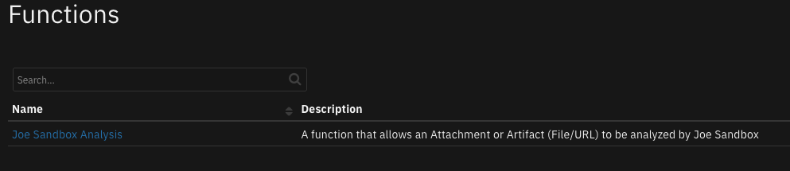
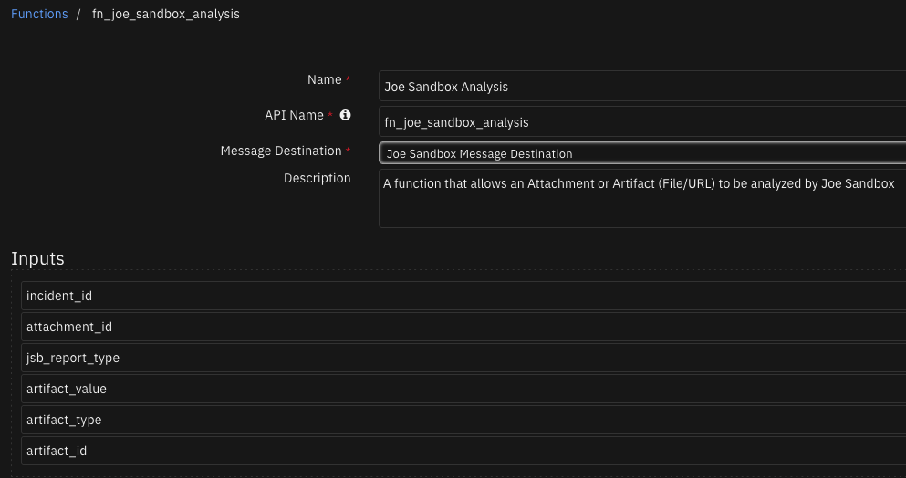

# Joe Sandbox Function for IBM SOAR

## Table of Contents
- [Release Notes](#release-notes)
- [Overview](#overview)
  - [Key Features](#key-features)
- [Requirements](#requirements)
  - [SOAR platform](#soar-platform)
  - [Cloud Pak for Security](#cloud-pak-for-security)
  - [Proxy Server](#proxy-server)
  - [Python Environment](#python-environment)
- [Installation](#installation)
  - [Install](#install)
  - [App Configuration](#app-configuration)
- [Function - Joe Sandbox Analysis](#function---joe-sandbox-analysis)
- [Playbooks](#playbooks)
- [Troubleshooting & Support](#troubleshooting--support)

---

## Release Notes
| Version | Date | Notes |
| ------- | ---- | ----- |
| 2.0.0 | 12/2022 | Updated jbxapi version used, added new settings in the app.config, and added support for basic version of Joe Sandbox cloud |
| 1.0.5 | 10/2022 | Added support for self-signed certificates when connecting to an on-premises machine |
| 1.0.4 | 10/2020 | Apphost support |
| 1.0.3 | 10/2020 | Bug fixes |
| 1.0.1 | 07/2018 | Bug fixes & proxies |
| 1.0.0 | 06/2018 | Initial Release |

---

## Overview

**Joe Sandbox Function for IBM SOAR**

*This package contains a function that executes a Joe Sandbox Analysis of an Attachment or Artifact and returns the Analysis Report to IBM SOAR.*

 

Joe Sandbox Function for IBM SOAR

### Key Features
* Analyze incident attachments
* Analyze incident artifacts

---

## Requirements
This app supports the IBM Security QRadar SOAR Platform and the IBM Security QRadar SOAR for IBM Cloud Pak for Security.

### SOAR platform
The SOAR platform supports two app deployment mechanisms, Edge Gateway (formerly App Host) and integration server.

If deploying to a SOAR platform with an Edge Gateway, the requirements are:
* SOAR platform >= `44.0.7585`.
* The app is in a container-based format (available from the AppExchange as a `zip` file).

If deploying to a SOAR platform with an integration server, the requirements are:
* SOAR platform >= `44.0.7585`.
* The app is in the older integration format (available from the AppExchange as a `zip` file which contains a `tar.gz` file).
* Integration server is running `resilient_circuits>=42.0.0`.
* If using an API key account, make sure the account provides the following minimum permissions: 
  | Name | Permissions |
  | ---- | ----------- |
  | Org Data | Read |
  | Function | Read |

The following SOAR platform guides provide additional information: 
* _Edge Gateway Deployment Guide_ or _App Host Deployment Guide_: provides installation, configuration, and troubleshooting information, including proxy server settings. 
* _Integration Server Guide_: provides installation, configuration, and troubleshooting information, including proxy server settings.
* _System Administrator Guide_: provides the procedure to install, configure and deploy apps. 

The above guides are available on the IBM Documentation website at [ibm.biz/soar-docs](https://ibm.biz/soar-docs). On this web page, select your SOAR platform version. On the follow-on page, you can find the _Edge Gateway Deployment Guide_, _App Host Deployment Guide_, or _Integration Server Guide_ by expanding **Apps** in the Table of Contents pane. The System Administrator Guide is available by expanding **System Administrator**.

### Cloud Pak for Security
If you are deploying to IBM Cloud Pak for Security, the requirements are:
* IBM Cloud Pak for Security >= `1.8`.
* Cloud Pak is configured with an Edge Gateway.
* The app is in a container-based format (available from the AppExchange as a `zip` file).

The following Cloud Pak guides provide additional information: 
* _Edge Gateway Deployment Guide_ or _App Host Deployment Guide_: provides installation, configuration, and troubleshooting information, including proxy server settings. From the Table of Contents, select Case Management and Orchestration & Automation > **Orchestration and Automation Apps**.
* _System Administrator Guide_: provides information to install, configure, and deploy apps. From the IBM Cloud Pak for Security IBM Documentation table of contents, select Case Management and Orchestration & Automation > **System administrator**.

These guides are available on the IBM Documentation website at [ibm.biz/cp4s-docs](https://ibm.biz/cp4s-docs). From this web page, select your IBM Cloud Pak for Security version. From the version-specific IBM Documentation page, select Case Management and Orchestration & Automation.

### Proxy Server
The app does support a proxy server.

### Python Environment
Python 3.6 and Python 3.9 are supported.
Additional package dependencies may exist for each of these packages:
* jbxapi>=3.19.0
* resilient_circuits>=42.0.0

---

## Installation

### Install
* To install or uninstall an App or Integration on the _SOAR platform_, see the documentation at [ibm.biz/soar-docs](https://ibm.biz/soar-docs).
* To install or uninstall an App on _IBM Cloud Pak for Security_, see the documentation at [ibm.biz/cp4s-docs](https://ibm.biz/cp4s-docs) and follow the instructions above to navigate to Orchestration and Automation.

### App Configuration
The following table provides the settings you need to configure the app. These settings are made in the app.config file. See the documentation discussed in the Requirements section for the procedure.

| Config | Required | Example | Description |
| ------ | :------: | ------- | ----------- |
| **jsb_accept_tac** | Yes | `True` | *Joe Sandbox Cloud requires accepting the Terms and Conditions* |
| **jsb_analysis_report_ping_delay** | No | `120` | *Time in seconds to wait between submission status checks* |
| **jsb_analysis_report_request_timeout** | No | `1800` | *Max time in seconds an analysis can take to run before timeout* |
| **jsb_api_key** | Yes | `` | *API key* |
| **jsb_api_url** | Yes | `https://www.joesandbox.com/api/` | *API endpoint url* |
| **jsb_email_notification** | No | `True` | *Send an e-mail upon completion of the analysis* |
| **jsb_secondary_results** | No | `True` | *Enables secondary Results such as Yara rule generation, classification via Joe Sandbox Class as well as several detail reports.* |
| **jsb_verify** | No | `False` | *jsb_verify can be False or a path to a certificate* |
| **jsb_systems** | No | `w7x64` | *Name of system to use or comment out for automatic selection* |

---

## Function - Joe Sandbox Analysis
A function that allows an Attachment or Artifact (File/URL) to be analyzed by Joe Sandbox

 

<details><summary>Inputs:</summary>
<p>

| Name | Type | Required | Example | Tooltip |
| ---- | :--: | :------: | ------- | ------- |
| `artifact_id` | `number` | No | `-` | ID of the artifact |
| `artifact_type` | `text` | No | `-` | Type of the artifact |
| `artifact_value` | `text` | No | `-` | Value of the artifact |
| `attachment_id` | `number` | No | `-` | ID of the attachment |
| `incident_id` | `number` | Yes | `-` | ID of the incident |
| `jsb_report_type` | `select` | Yes | `-` | The format of the report to be returned from Joe Sandbox |

</p>
</details>

<details><summary>Outputs:</summary>
<p>

> **NOTE:** This example might be in JSON format, but `results` is a Python Dictionary on the SOAR platform.

```python
results = {
  "content": {
    "analysis_report_id": "2875365",
    "analysis_report_name": "report-3d16493b0814a18d6806ed30f4efac31.html",
    "analysis_report_url": "https://jbxcloud.joesecurity.org/api//analysis/2875365",
    "analysis_status": "unknown"
  },
  "inputs": {
    "artifact_id": null,
    "artifact_type": "",
    "artifact_value": "",
    "attachment_id": 5,
    "incident_id": 2107,
    "jsb_report_type": "html"
  },
  "metrics": {
    "execution_time_ms": 245007,
    "host": "local",
    "package": "fn-joe-sandbox-analysis",
    "package_version": "2.0.0",
    "timestamp": "2022-12-22 12:56:30",
    "version": "1.0"
  },
  "raw": null,
  "reason": null,
  "success": true,
  "version": 2.0
}
```

</p>
</details>

<details><summary>Example Pre-Process Script:</summary>
<p>

```python
None
```

</p>
</details>

<details><summary>Example Post-Process Script:</summary>
<p>

```python
None
```

</p>
</details>

---


## Playbooks
| Playbook Name | Description | Object | Status |
| ------------- | ----------- | ------ | ------ |
| Example: Joe Sandbox Analysis [Artifact] | An example of having an artifact sample analyzed by Joe Sandbox | artifact | `enabled` |
| Example: Joe Sandbox Analysis [Attachment] | An example of having an attachment sample analyzed by Joe Sandbox | attachment | `enabled` |

---

## Troubleshooting & Support
Refer to the documentation listed in the Requirements section for troubleshooting information.

### For Support
This is a IBM Community provided App. Please search the Community [ibm.biz/soarcommunity](https://ibm.biz/soarcommunity) for assistance.
