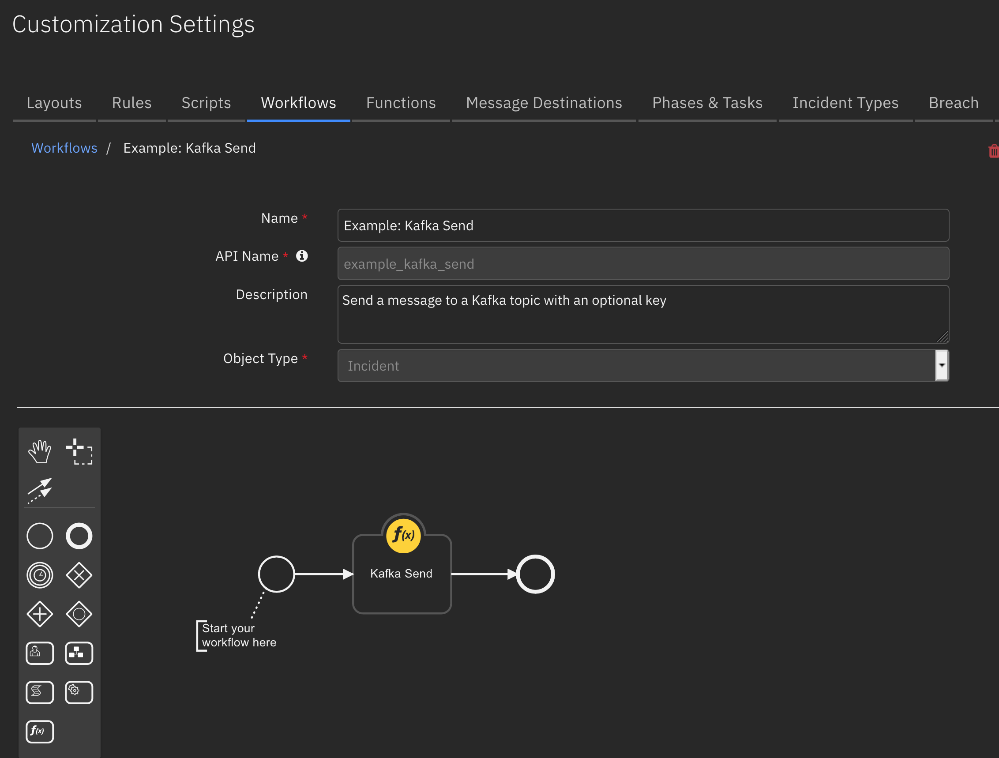
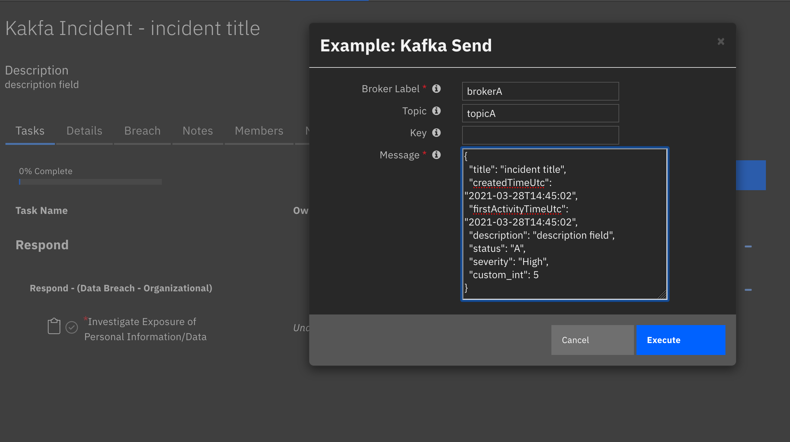
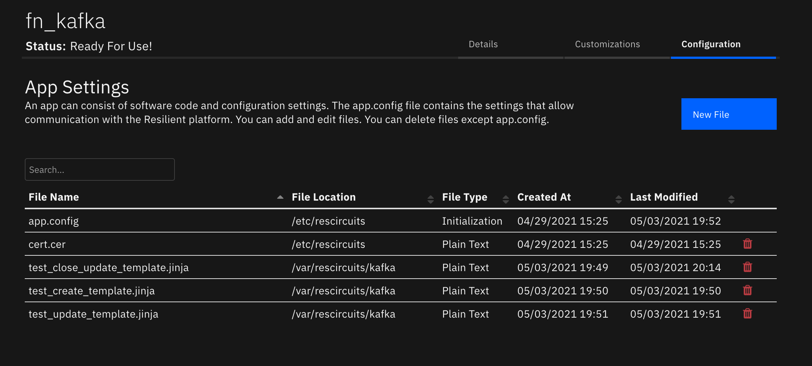

<!--
  This README.md is generated by running:
  "resilient-sdk docgen -p fn_kafka"

  It is best edited using a Text Editor with a Markdown Previewer. VS Code
  is a good example. Checkout https://guides.github.com/features/mastering-markdown/
  for tips on writing with Markdown

  If you make manual edits and run docgen again, a .bak file will be created

  Store any screenshots in the "doc/screenshots" directory and reference them like:
  

  NOTE: If your app is available in the container-format only, there is no need to mention the integration server in this readme.
-->

# None

## Table of Contents
- [Release Notes](#release-notes)
- [Overview](#overview)
  - [Key Features](#key-features)
- [Requirements](#requirements)
  - [IBM SOAR platform](#ibm-soar-platform)
  - [Cloud Pak for Security](#cloud-pak-for-security)
  - [Proxy Server](#proxy-server)
- [Installation](#installation)
  - [Install](#install)
  - [App Configuration](#app-configuration)
- [Function - Kafka Send](#function---kafka-send)
- [Kafka Listener](#kafka-listener)
- [Rules](#rules)
- [Troubleshooting & Support](#troubleshooting--support)
---

## Release Notes
<!--
  Specify all changes in this release. Do not remove the release 
  notes of a previous release
-->
| Version | Date | Notes |
| ------- | ---- | ----- |
| 1.0.0 | 04/2021 | Initial Release |

### Notes

This app replaces the Send to Kafka publication. Importantly, it adds the ability to listen on a Kafka broker
and for select topic(s), create and update incidents based on Kafka message content. See the [Key Features Section](#key-features) for more information. 

---

## Overview
<!--
  Provide a high-level description of the function itself and its remote software or application.
  The text below is parsed from the "description" and "long_description" attributes in the setup.py file
-->
**Resilient Circuits Components for 'fn_kafka'**

 

Resilient Circuits Components for 'fn_kafka'

### Key Features
<!--
  List the Key Features of the Integration
-->
* Ability to define multiple brokers for producing and consuming messages
* Separate field transation templates to process (create or update) and topic
* Send to Kafka allows key/value or just value transmissions on a topic
* Poller for listening on broker topics with configurable templates to create/update SOAR incidents.

---

## Requirements
<!--
  List any Requirements 
-->
This app supports the IBM IBM SOAR SOAR Platform and the IBM Cloud Pak for Security.

### IBM SOAR platform
The IBM SOAR platform supports two app deployment mechanisms, App Host and integration server.

If deploying to a IBM SOAR platform with an App Host, the requirements are:
* IBM SOAR platform >= `38.0.6006`.
* The app is in a container-based format (available from the AppExchange as a `zip` file).

If deploying to a IBM SOAR platform with an integration server, the requirements are:
* IBM SOAR platform >= `38.0.6006`.
* The app is in the older integration format (available from the AppExchange as a `zip` file which contains a `tar.gz` file).
* Integration server is running `resilient_circuits>=30.0.0`.
* If using an API key account, make sure the account provides the following minimum permissions: 

  | Name | Permissions |
  | ---- | ----------- |
  | Org Data | Read |
  | Function | Read |
  | Incidents | Create, Read |
  | Edit Incidents | Fields |


The following IBM SOAR platform guides provide additional information: 
* _App Host Deployment Guide_: provides installation, configuration, and troubleshooting information, including proxy server settings. 
* _Integration Server Guide_: provides installation, configuration, and troubleshooting information, including proxy server settings.
* _System Administrator Guide_: provides the procedure to install, configure and deploy apps. 

The above guides are available on the IBM Knowledge Center at [ibm.biz/resilient-docs](https://ibm.biz/resilient-docs). On this web page, select your IBM SOAR platform version. On the follow-on page, you can find the _App Host Deployment Guide_ or _Integration Server Guide_ by expanding **Resilient Apps** in the Table of Contents pane. The System Administrator Guide is available by expanding **System Administrator**.

### Cloud Pak for Security
If you are deploying to IBM Cloud Pak for Security, the requirements are:
* IBM Cloud Pak for Security >= 1.4.
* Cloud Pak is configured with an App Host.
* The app is in a container-based format (available from the AppExchange as a `zip` file).

The following Cloud Pak guides provide additional information: 
* _App Host Deployment Guide_: provides installation, configuration, and troubleshooting information, including proxy server settings. From the Table of Contents, select Case Management and Orchestration & Automation > **Orchestration and Automation Apps**.
* _System Administrator Guide_: provides information to install, configure, and deploy apps. From the IBM Cloud Pak for Security Knowledge Center table of contents, select Case Management and Orchestration & Automation > **System administrator**.

These guides are available on the IBM Knowledge Center at [ibm.biz/cp4s-docs](https://ibm.biz/cp4s-docs). From this web page, select your IBM Cloud Pak for Security version. From the version-specific Knowledge Center page, select Case Management and Orchestration & Automation.

### Proxy Server
The app **does not** support a proxy server. This is a limitation in the broker connection logic of the kafka package used.

---

## Installation

### Install
* To install or uninstall an App or Integration on the _IBM SOAR platform_, see the documentation at [ibm.biz/resilient-docs](https://ibm.biz/resilient-docs).
* To install or uninstall an App on _IBM Cloud Pak for Security_, see the documentation at [ibm.biz/cp4s-docs](https://ibm.biz/cp4s-docs) and follow the instructions above to navigate to Orchestration and Automation.

### App Configuration
The following table provides the settings you need to configure the app. These settings are made in the app.config file. See the documentation discussed in the Requirements section for the procedure.

### fn_kafka

| Config | Required | Example | Description |
| ------ | :------: | ------- | ----------- |
| **listener_brokers** | No | `brokerA,brokerB` | *comma separated list of broker labels to listen on. If empty, no listeners are started* |
| **selftest_broker** | No | `brokerA` | *Broker label to troubleshoot connection issues* |

### fn_kafka:`broker label`

| Config | Required | Example | Description |
| ------ | :------: | ------- | ----------- |
| **bootstrap_servers** | Yes | `192.168.1.215:9092` | *IP Address and port for * |
| **topics** | Yes | `topicA,topicB` | *comma separated list of topics to listen on when using the listener logic.* |
| **template_dir** | No | `/path/to/templates` | *Directory where templates reside. Use the naming convention or \<topic\>_create_template.jinja and \<topic\>_update_template.jinja.* |


The remaining settings are all configurable per your Kafka broker. See (https://kafka-python.readthedocs.io/en/master/apidoc/KafkaProducer.html) for information on how to use these additional settings

| Config | Required | Example | Description |
| ------ | :------: | ------- | ----------- |
| **sasl_mechanism** | No | `PLAIN` | *Enter a description of the config here.* |
| **security_protocol** | No | `PLAINTEXT` | *Protocol used to communicate with brokers* |
| **ssl_check_hostname** | No | `False` | *flag to configure whether ssl handshake should verify that the certificate matches the brokers hostname* |
| **sasl_plain_username** | No | `` | *username for sasl PLAIN and SCRAM authentication* |
| **sasl_plain_password** | No | `` | *password for sasl PLAIN and SCRAM authentication* |


---

## Function - Kafka Send
Send messages through Kafka based on a named topic.

 

<details><summary>Inputs:</summary>
<p>

| Name | Type | Required | Example | Tooltip |
| ---- | :--: | :------: | ------- | ------- |
| `kafka_broker_label` | `text` | Yes | `brokerA` | - |
| `kafka_topic` | `text` | Yes | `-` | - |
| `kafka_key` | `text` | No | `-` | optional key/value data sending |
| `kafka_message` | `text` | Yes | `-` | can be in json format |

</p>
</details>

<details><summary>Outputs:</summary>
<p>

```python
results = {
    # TODO: Copy and paste an example of the Function Output within this code block.
    # To view the output of a Function, run resilient-circuits in DEBUG mode and invoke the Function. 
    # The Function results will be printed in the logs: "resilient-circuits run --loglevel=DEBUG"
}
```

</p>
</details>

<details><summary>Example Pre-Process Script:</summary>
<p>

```python
inputs.kafka_topic = rule.properties.kafka_topic
inputs.kafka_message = rule.properties.kafka_message.content
inputs.kafka_broker_label = rule.properties.kafka_broker_label
inputs.kafka_key = rule.properties.kafka_key
```

</p>
</details>

<details><summary>Example Post-Process Script:</summary>
<p>

```python
None
```

</p>
</details>

---
## Kafka Listener

It's possible to listen for messages on Kakfa topics. When consumed, the json formatted message retrieved can be used to create and update incidents. Existing incidents are identified by their incident id as the Kafka message key. 
To use this feature, reference to the broker label(s) with the app.config `listener_brokers` setting and specify the `topics` settings to consume messages.

### Templates
Two different templates types are available to convert json messages into the format needed to create or update an incident.
See the `template_dir` app.config setting for the directory used to retain templates. Each template contains the mapping information from a Kafka message to the correct create or update IBM Soar API call. 

Name templates using the following format:

* \<topic\>_create_template.jinja
* \<topic\>_update_template.jinja

This is an example template:

```json
{
  {# JINJA template for creating a new IBM SOAR incident #}
  "name": "Kakfa Incident - {{ title|e }}",
{# use the filter resilient_datetimeformat to convert values for resilient's Epoch timestamp #}
  "discovered_date": {{ createdTimeUtc|resilient_datetimeformat }},
  "create_date": {{ firstActivityTimeUtc|resilient_datetimeformat }},
  "description": {
    "format": "text",
    "content": "{{ description|e }}"
  },
{# use the filter resilient_substitute to convert values for resilient's [N]ew and [A]ctive
   ex. status |resilient_substitute('{"New": "N", "Active": "A"}') #}
  "plan_status": "{{ status }}",
{# use the filter resilient_substitute to convert values for resilient's Low, Medium, High
   ex. severity |resilient_substitute('{"Informational": "Low", "Critical": "High"}') #}
  "severity_code": "{{ severity }}",
  "properties": {
    "custom_int": {{ custom_int }}
  }
}
```

The following json formatted Kafka message would create a new incident.

```json
{
  "title": "incident title",
  "createdTimeUtc": "2021-03-28T14:45:02",
  "firstActivityTimeUtc": "2021-03-28T14:45:02",
  "description": "description field",
  "status": "A",
  "severity": "High",
  "custom_int": 5
}
```

#### Closing Incidents
Use one topic for creating and/or updating incidents and another for closing an incident. When closing an incident, include the incident id as the Kafka message key.

The following update template illustrates closing an incident:

```json
{
  {# include additional "required on close" fields #}
  "plan_status": "C",
  "resolution_id": "{{ status|resilient_substitute('{"truepositive": "Resolved", "falsepositive": "Not an Issue"}') }}",
  "resolution_summary": "{{ description|e }}"
}
```

This payload cooresponds with this template mapping:

```json
{
  "status": "truepositive",
  "description": "closed by Kafka"
}
```

The following image shows three templates used for creating and updating incidents on the topic `test` and a third template used to close incidents on the `test_close` topic.

 
--

## Rules
| Rule Name | Object | Workflow Triggered |
| --------- | ------ | ------------------ |
| Example: Kafka Send | incident | `example_kafka_send` |

---

## Troubleshooting & Support
Refer to the documentation listed in the Requirements section for troubleshooting information.

### For Support
This is a IBM Community provided App. Please search the Community https://ibm.biz/soarcommunity for assistance.
