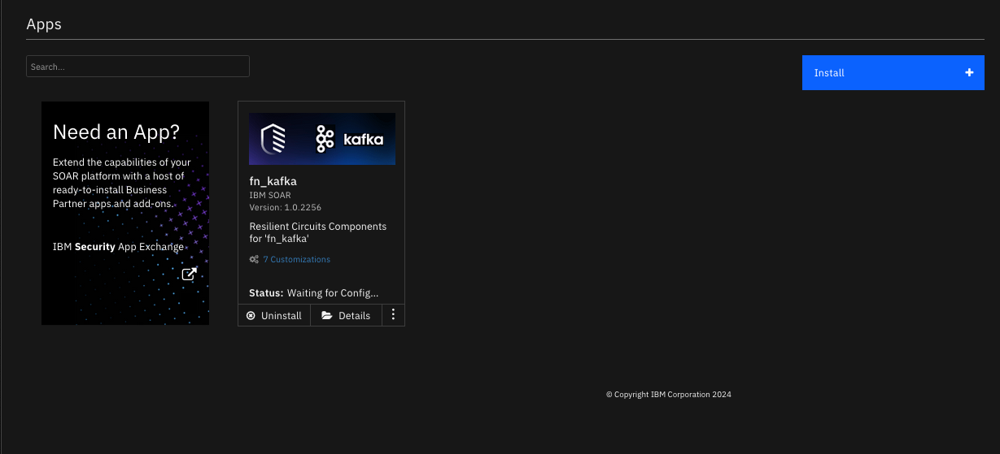
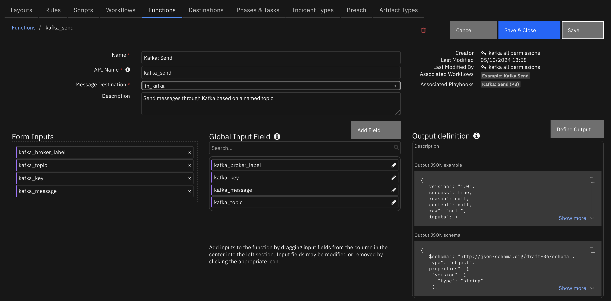

# Kafka


## Table of Contents
- [Release Notes](#release-notes)
- [Overview](#overview)
  - [Key Features](#key-features)
- [Requirements](#requirements)
  - [SOAR platform](#soar-platform)
  - [Cloud Pak for Security](#cloud-pak-for-security)
  - [Proxy Server](#proxy-server)
  - [Python Environment](#python-environment)
- [Installation](#installation)
  - [Install](#install)
  - [App Configuration](#app-configuration)
- [Function - Kafka Send](#function---kafka-send)
- [Kafka Listener](#kafka-listener)
  - [Templates](#templates)
    - [Closing and Updating Incidents](#closing-and-updating-incidents)
- [Playbooks](#playbooks)
- [Troubleshooting & Support](#troubleshooting--support)

---

## Release Notes
<!--
  Specify all changes in this release. Do not remove the release 
  notes of a previous release
-->
| Version | Date    | Notes                        |
|---------|---------|------------------------------|
| 1.0.2   | 05/2024 | Refresh Kafka python dependency; add playbooks |
| 1.0.1   | 10/2023 | Convert Workflows to Python3 |
| 1.0.0   | 04/2021 | Initial Release              |

---
### Kafka App 1.0.2 Changes
In v1.0.2, the existing rules and workflows have been replaced with playbooks. This change is made to support the ongoing, newer capabilities of playbooks. Each playbook has the same functionality as the previous, corresponding rule/workflow.

If upgrading from a previous release, you'll noticed that the previous release's rules/workflows remain in place. Both sets of rules and playbooks are active. For manual actions, playbooks will have the same name as it's corresponding rule, but with "(PB)" added at the end. For automatic actions, the playbooks will be disabled by default.

You can continue to use the rules/workflows. But migrating to playbooks will provide greater functionality along with future app enhancements and bug fixes.

## Overview
<!--
  Provide a high-level description of the function itself and its remote software or application.
  The text below is parsed from the "description" and "long_description" attributes in the setup.py file
-->
**Resilient Circuits Components for 'fn_kafka'**

 

Support the ability to produce and consume Kafka messages over a number of brokers.

### Key Features
<!--
  List the Key Features of the Integration
-->
* Ability to define multiple brokers for producing and consuming messages
* Send to Kafka allows key/value or just value transmissions on a topic
* Poller for listening on broker topics with configurable templates

---

## Requirements
<!--
  List any Requirements 
--> 
This app supports the IBM Security QRadar SOAR Platform and the IBM Security QRadar SOAR for IBM Cloud Pak for Security.

### SOAR platform
The SOAR platform supports two app deployment mechanisms, Edge Gateway (also known as App Host) and integration server.

If deploying to a SOAR platform with an App Host, the requirements are:
* SOAR platform >= `50.0.9097`.
* The app is in a container-based format (available from the AppExchange as a `zip` file).

If deploying to a SOAR platform with an integration server, the requirements are:
* SOAR platform >= `50.0.9097`.
* The app is in the older integration format (available from the AppExchange as a `zip` file which contains a `tar.gz` file).
* Integration server is running `resilient_circuits>=46.0.0`.
* If using an API key account, make sure the account provides the following minimum permissions: 
  | Name | Permissions |
  | ---- | ----------- |
  | Org Data | Read |
  | Function | Read |
  | Incidents | Create, Read |
  | Edit Incidents | Fields |

The following SOAR platform guides provide additional information: 
* _Edge Gateway Deployment Guide_ or _App Host Deployment Guide_: provides installation, configuration, and troubleshooting information, including proxy server settings. 
* _Integration Server Guide_: provides installation, configuration, and troubleshooting information, including proxy server settings.
* _System Administrator Guide_: provides the procedure to install, configure and deploy apps. 

The above guides are available on the IBM Documentation website at [ibm.biz/soar-docs](https://ibm.biz/soar-docs). On this web page, select your SOAR platform version. On the follow-on page, you can find the _Edge Gateway Deployment Guide_, _App Host Deployment Guide_, or _Integration Server Guide_ by expanding **Apps** in the Table of Contents pane. The System Administrator Guide is available by expanding **System Administrator**.

### Cloud Pak for Security
If you are deploying to IBM Cloud Pak for Security, the requirements are:
* IBM Cloud Pak for Security >= `1.10`.
* Cloud Pak is configured with an Edge Gateway.
* The app is in a container-based format (available from the AppExchange as a `zip` file).

The following Cloud Pak guides provide additional information: 
* _Edge Gateway Deployment Guide_ or _App Host Deployment Guide_: provides installation, configuration, and troubleshooting information, including proxy server settings. From the Table of Contents, select Case Management and Orchestration & Automation > **Orchestration and Automation Apps**.
* _System Administrator Guide_: provides information to install, configure, and deploy apps. From the IBM Cloud Pak for Security IBM Documentation table of contents, select Case Management and Orchestration & Automation > **System administrator**.

These guides are available on the IBM Documentation website at [ibm.biz/cp4s-docs](https://ibm.biz/cp4s-docs). From this web page, select your IBM Cloud Pak for Security version. From the version-specific IBM Documentation page, select Case Management and Orchestration & Automation.

### Proxy Server
The app **does not** support a proxy server.

### Python Environment
Python 3.6 and Python 3.9 are supported.
Additional package dependencies may exist for each of these packages:
* kafka-python-ng~=2.0
* resilient_circuits>=51.0.0

### Development Version

This app has been implemented using:
| Product Name | Product Version |
| ------------ | --------------- |
| confluentinc/cp-kafka | 7.4.4 |

#### Prerequisites
<!--
List any prerequisites that are needed to use with this endpoint solution. Remove any section that is unnecessary.
-->
* A running Kafka broker is required for the app to connect to

---

## Installation

### Install
* To install or uninstall an App or Integration on the _SOAR platform_, see the documentation at [ibm.biz/soar-docs](https://ibm.biz/soar-docs).
* To install or uninstall an App on _IBM Cloud Pak for Security_, see the documentation at [ibm.biz/cp4s-docs](https://ibm.biz/cp4s-docs) and follow the instructions above to navigate to Orchestration and Automation.

### App Configuration
The following table provides the settings you need to configure the app. These settings are made in the app.config file. See the documentation discussed in the Requirements section for the procedure.

#### fn_kafka
| Config | Required | Example | Description |
| ------ | :------: | ------- | ----------- |
| **listener_brokers** | Yes | `brokerA,brokerB` | Comma-separated list of broker labels to listen on. If empty or commented out, no listeners are started |
| **selftest_broker** | Yes | `brokerA` | Broker label to troubleshoot connection issues |

#### fn_kafka:`broker label`
| Config | Required | Example | Description |
| ------ | :------: | ------- | ----------- |
| **bootstrap_servers** | Yes | `127.0.0.1:9092` | IP Address and port for Kafka bootstrap server |
| **topics** | Yes | `topicA,topicB` | Comma-separated list of topics to listen on when using the listener logic |
| **template_dir** | No | `/path/to/templates` | Directory where templates reside. Use the naming convention or <topic>_create_template.jinja and <topic>_update_template.jinja for specific template files |

The remaining settings are all configurable per your Kafka broker. See (https://kafka-python.readthedocs.io/en/master/apidoc/KafkaProducer.html) for information on how to use these additional settings
| Config | Required | Example | Description |
| ------ | :------: | ------- | ----------- |
| **group_id** | No | `` | Listener group for consumers |
| **client_id** | No | `` | Client identifier for producers |
| **sasl_mechanism** | No | `PLAIN` | Authentication mechanism when security_protocol is configured for SASL_PLAINTEXT or SASL_SSL |
| **security_protocol** | No | `PLAINTEXT` | Protocol used to communicate with brokers |
| **ssl_check_hostname** | No | `False` | Flag to configure whether ssl handshake should verify that the certificate matches the brokers hostname. |
| **sasl_plain_username** | No | `` | Username for sasl PLAIN and SCRAM authentication |
| **sasl_plain_password** | No | `` | Password for sasl PLAIN and SCRAM authentication |

 ---

## Function - Kafka Send
Send messages through Kafka based on a named topic

 

<details><summary>Inputs:</summary>
<p>

| Name | Type | Required | Example | Tooltip |
| ---- | :--: | :------: | ------- | ------- |
| `kafka_broker_label` | `text` | Yes | `BrokerA` | Broker label defined in app.config |
| `kafka_key` | `text` | No | `-` | Optional key to pass with Kafka message |
| `kafka_message` | `text` | Yes | `-` | Message to send, can be in JSON format |
| `kafka_topic` | `text` | Yes | `-` | Kafka topic to send message to |

</p>
</details>

<details><summary>Outputs:</summary>
<p>

> **NOTE:** This example might be in JSON format, but `results` is a Python Dictionary on the SOAR platform.

```python
results = {
  "version": "1.0",
  "success": true,
  "reason": null,
  "content": null,
  "raw": "null",
  "inputs": {
    "kafka_broker_label": "brokerA",
    "kafka_message": "{\"name\": \"my test incident\",\"description\": \"this is from SOAR\",\"status\": \"A\",\"severity_code\": \"High\", \"discovered_date\": 1708705700642, \"start_date\": 1708705700642}",
    "kafka_key": null,
    "kafka_topic": "quickstart-events"
  },
  "metrics": {
    "version": "1.0",
    "package": "fn-kafka",
    "package_version": "1.0.2",
    "host": "PMBP.local",
    "execution_time_ms": 559,
    "timestamp": "2024-05-07 15:32:32"
  }
}
```

</p>
</details>

<details><summary>Example Function Input Script:</summary>
<p>

```python
inputs.kafka_broker_label = playbook.inputs.kafka_broker_label
inputs.kafka_topic = playbook.inputs.kafka_topic
inputs.kafka_key = playbook.inputs.kafka_key
inputs.kafka_message = playbook.inputs.kafka_message.get("content")
```

</p>
</details>

<details><summary>Example Function Post Process Script:</summary>
<p>

```python
results = playbook.functions.results.kafka_send_results

if not results.success:
    incident.addNote(f"<b>Kafka: Send (PB):</b> Unable to send message to broker {playbook.inputs.kafka_broker_label}.")
else:
  incident.addNote(f"<b>Kafka: Send (PB):</b> Sent message to broker {playbook.inputs.kafka_broker_label}: {playbook.inputs.kafka_message.get('content')}")
```

</p>
</details>

---

## Kafka Listener

It's possible to listen for messages on Kafka topics. When consumed, the json formatted message retrieved can be used to create and update incidents. Existing incidents are identified by their case ID as the Kafka message key.
To use this feature, reference to the broker label(s) with the app.config `listener_brokers` setting and specify the `topics` settings to consume messages.

### Templates
Two different templates types are available to convert JSON messages into the format needed to create or update an incident.
See the `template_dir` app.config setting for the directory used to retain templates. Each template contains the mapping information from a Kafka message to the correct create or update IBM SOAR API call.

Name templates using the following format:

* \<topic\>_create_template.jinja
* \<topic\>_update_template.jinja

This is an example template:

```
{
  {# JINJA template for creating a new IBM SOAR incident #}
  "name": "Kafka Incident - {{ title|e }}",
{# use the filter resilient_datetimeformat to convert values for resilient's Epoch timestamp #}
  "discovered_date": {{ createdTimeUtc|resilient_datetimeformat }},
  "create_date": {{ firstActivityTimeUtc|resilient_datetimeformat }},
  "description": {
    "format": "text",
    "content": "{{ description|e }}"
  },
{# use the filter resilient_substitute to convert values for resilient's [N]ew and [A]ctive
   ex. status |resilient_substitute('{"New": "N", "Active": "A"}') #}
  "plan_status": "{{ status }}",
{# use the filter resilient_substitute to convert values for resilient's Low, Medium, High
   ex. severity |resilient_substitute('{"Informational": "Low", "Critical": "High"}') #}
  "severity_code": "{{ severity }}",
  "properties": {
    "custom_int": {{ custom_int }}
  }
}
```

The following json formatted Kafka message would create a new incident.

```json
{
  "title": "incident title",
  "createdTimeUtc": "2021-03-28T14:45:02",
  "firstActivityTimeUtc": "2021-03-28T14:45:02",
  "description": "description field",
  "status": "A",
  "severity": "High",
  "custom_int": 5
}
```

#### Closing and Updating Incidents
You may use one topic for creating and/or updating incidents and another for closing an incident. When closing or updating an incident, include the incident ID as the Kafka message key, `kafka_key`.

The following update template illustrates closing an incident:

```
{
  {# include additional "required on close" fields #}
  "plan_status": "C",
  "resolution_id": "{{ status|resilient_substitute('{"truepositive": "Resolved", "falsepositive": "Not an Issue"}') }}",
  "resolution_summary": "{{ description|e }}"
}
```

This payload corresponds with this template mapping:

```json
{
  "status": "truepositive",
  "description": "closed by Kafka"
}
```

The following image shows three templates used for creating and updating incidents on the topic `test` and a third template used to close incidents on the `test_close` topic.

 
 ---

## Playbooks
| Playbook Name | Description | Activation Type | Object | Status | Condition | 
| ------------- | ----------- | --------------- | ------ | ------ | --------- | 
| Kafka: Send (PB) | Send messages through Kafka based on a named topic | Manual | incident | `enabled` | `-` | 

---

## Troubleshooting & Support
Refer to the documentation listed in the Requirements section for troubleshooting information.
 
### For Support
This is a IBM Community provided App. Please search the Community [ibm.biz/soarcommunity](https://ibm.biz/soarcommunity) for assistance.