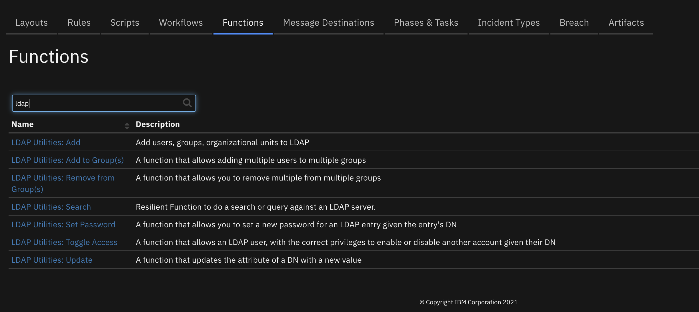
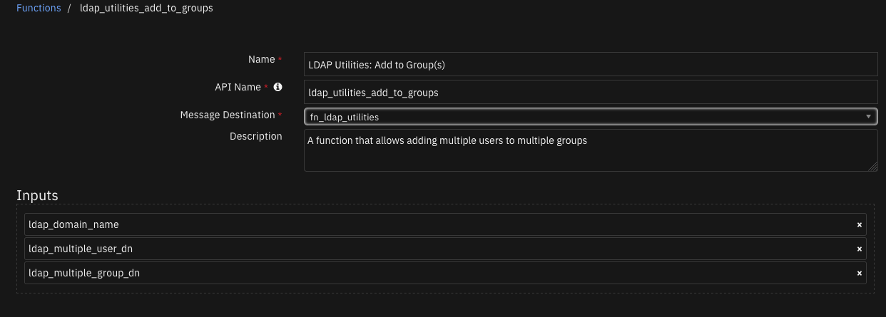
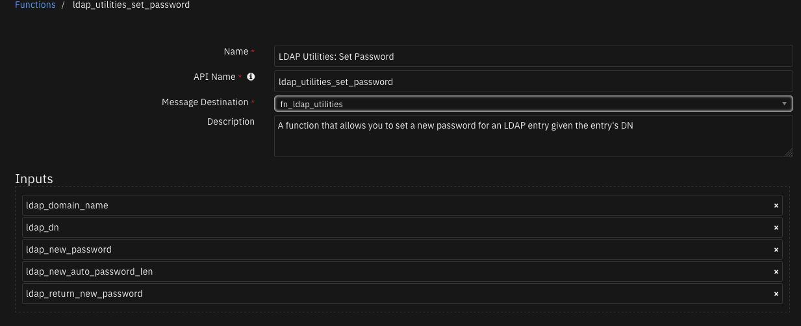
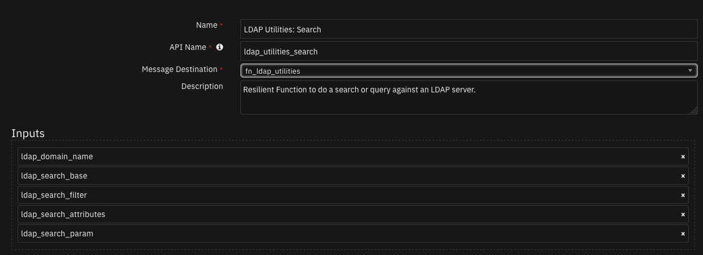
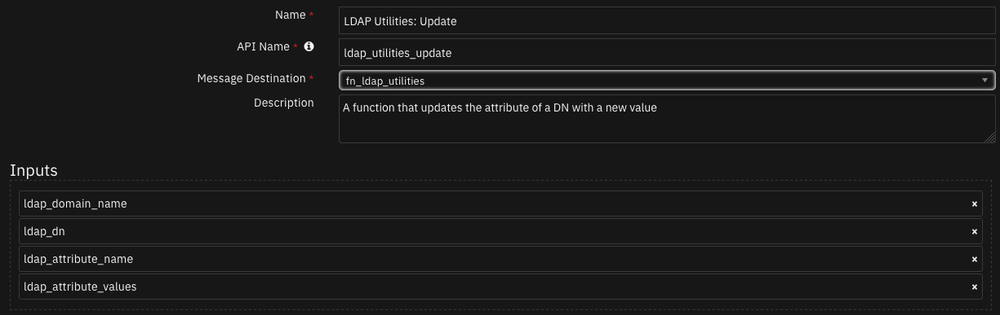
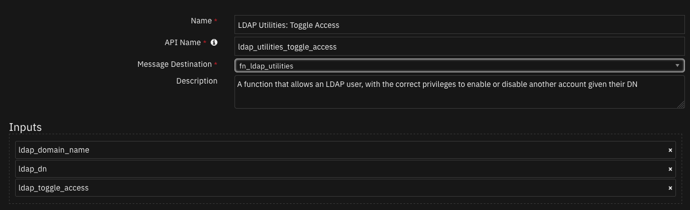
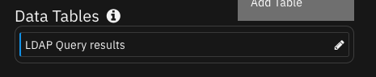

# fn_ldap_utilities

## Table of Contents
- [Release Notes](#release-notes)
- [Overview](#overview)
  - [Key Features](#key-features)
- [Requirements](#requirements)
  - [Resilient platform](#resilient-platform)
  - [Cloud Pak for Security](#cloud-pak-for-security)
  - [Proxy Server](#proxy-server)
- [Installation](#installation)
  - [Install](#install)
  - [App Configuration](#app-configuration)
  - [Custom Layouts](#custom-layouts)
- [Function - LDAP Utilities: Add to Group(s)](#function---ldap-utilities-add-to-groups)
- [Function - LDAP Utilities: Remove from Group(s)](#function---ldap-utilities-remove-from-groups)
- [Function - LDAP Utilities: Set Password](#function---ldap-utilities-set-password)
- [Function - LDAP Utilities: Search](#function---ldap-utilities-search)
- [Function - LDAP Utilities: Update](#function---ldap-utilities-update)
- [Function - LDAP Utilities: Toggle Access](#function---ldap-utilities-toggle-access)
- [Data Table - LDAP Query results](#data-table---ldap-query-results)
- [Rules](#rules)
- [Troubleshooting & Support](#troubleshooting--support)
---

## Release Notes
| Version | Date | Notes |
| ------- | ---- | ----- |
| 1.2.0 | 04/2022 | Add ability to have multiple LDAP Domains |
| 1.1.1 | 00/2000 | Support added for App Host |
| 1.1.0 | 00/2000 | <ul><li>Handle Unicode in Post-Process Scripts</li><li>Handle NTLM Authentication to Active Directory</li><li>Add functionality to allow for LDAP Wildcard queries with *</li></ul> |
| 1.0.0 | MM/YYYY | Initial Release |

---

## Overview
<!--
  Provide a high-level description of the function itself and its remote software or application.
  The text below is parsed from the "description" and "long_description" attributes in the setup.py file
-->
These LDAP Utility integrations allow multiple activities to be initiated from workflows in the IBM SOAR platform to an external LDAP server. Functions include: search, update, and set password.
**SOAR LDAP Utilities'**

 

SOAR components to allow reading and manipulation of your LDAP Server'

## Requirements
<!--
  List any Requirements 
-->
This app supports the IBM SOAR Platform and the IBM Cloud Pak for Security.

### Resilient platform
The Resilient platform supports two app deployment mechanisms, App Host and integration server.

If deploying to a Resilient platform with an App Host, the requirements are:
* Resilient platform >= `41.0.6783`.
* The app is in a container-based format (available from the AppExchange as a `zip` file).

If deploying to a Resilient platform with an integration server, the requirements are:
* Resilient platform >= `41.0.6783`.
* The app is in the older integration format (available from the AppExchange as a `zip` file which contains a `tar.gz` file).
* Integration server is running `resilient_circuits>=39.0.0`.
* If using an API key account, make sure the account provides the following minimum permissions: 
  | Name | Permissions |
  | ---- | ----------- |
  | Org Data | Read |
  | Function | Read |

The following Resilient platform guides provide additional information: 
* _App Host Deployment Guide_: provides installation, configuration, and troubleshooting information, including proxy server settings. 
* _Integration Server Guide_: provides installation, configuration, and troubleshooting information, including proxy server settings.
* _System Administrator Guide_: provides the procedure to install, configure and deploy apps. 

The above guides are available on the IBM Knowledge Center at [ibm.biz/resilient-docs](https://ibm.biz/resilient-docs). On this web page, select your Resilient platform version. On the follow-on page, you can find the _App Host Deployment Guide_ or _Integration Server Guide_ by expanding **Resilient Apps** in the Table of Contents pane. The System Administrator Guide is available by expanding **System Administrator**.

### Cloud Pak for Security
If you are deploying to IBM Cloud Pak for Security, the requirements are:
* IBM Cloud Pak for Security >= 1.4.
* Cloud Pak is configured with an App Host.
* The app is in a container-based format (available from the AppExchange as a `zip` file).

The following Cloud Pak guides provide additional information: 
* _App Host Deployment Guide_: provides installation, configuration, and troubleshooting information, including proxy server settings. From the Table of Contents, select Case Management and Orchestration & Automation > **Orchestration and Automation Apps**.
* _System Administrator Guide_: provides information to install, configure, and deploy apps. From the IBM Cloud Pak for Security Knowledge Center table of contents, select Case Management and Orchestration & Automation > **System administrator**.

These guides are available on the IBM Knowledge Center at [ibm.biz/cp4s-docs](https://ibm.biz/cp4s-docs). From this web page, select your IBM Cloud Pak for Security version. From the version-specific Knowledge Center page, select Case Management and Orchestration & Automation.

### Proxy Server
The app does not support a proxy server.

---

## Installation

### Install
* To install or uninstall an App or Integration on the _Resilient platform_, see the documentation at [ibm.biz/resilient-docs](https://ibm.biz/resilient-docs).
* To install or uninstall an App on _IBM Cloud Pak for Security_, see the documentation at [ibm.biz/cp4s-docs](https://ibm.biz/cp4s-docs) and follow the instructions above to navigate to Orchestration and Automation.

### App Configuration
The following table provides the settings you need to configure the app. These settings are made in the app.config file. See the documentation discussed in the Requirements section for the procedure.

| Config | Required | Example | Description |
| ------ | :------: | ------- | ----------- |
| **ldap_server** | Yes | `xxx.xxx.xxx.xxx` | *Ip address of the LDAP Server* |
| **ldap_port** | Yes | `389` | *Port to use to connect to LDAP server* |
| **ldap_use_ssl** | Yes | `False` | *Boolean value to use ssl or not* |
| **ldap_auth** | Yes | `SIMPLE` | *Type of authentication to use* |
| **ldap_user_dn** | Yes | `CN=Username,CN=Users,DC=example,DC=com` | *DN of LDAP account* |
| **ldap_password** | Yes | `password` | *Password for the LDAP account* |
| **ldap_user_ntlm** | Yes | `Domain\User` | *Windows NTLM user* |
| **ldap_is_active_directory** | Yes | `False` | *Boolean value to determine if LDAP server is on an active directory server* |
| **ldap_connect_timeout** | Yes | `10` | *Timeout in seconds* |

## Function - LDAP Utilities: Add to Group(s)
A function that allows adding multiple users to multiple groups

 

<details><summary>Inputs:</summary>
<p>

| Name | Type | Required | Example | Tooltip |
| ---- | :--: | :------: | ------- | ------- |
| `ldap_domain_name` | `text` | No | `-` | - |
| `ldap_multiple_group_dn` | `text` | Yes | `"['dn=Accounts Group,dc=example,dc=com', 'dn=IT Group,dc=example,dc=com']"` | List (represented as a string) of each DN of the related groups |
| `ldap_multiple_user_dn` | `text` | Yes | `"['dn=tom smith,dc=example,dc=com', 'dn=ted smith,dc=example,dc=com']"` | List (represented as a string) of each DN of the users |

</p>
</details>

<details><summary>Outputs:</summary>
<p>

```python
results = {
  "success": true,
  "users_dn": [
    "cn=Breda User11,cn=Users,dc=example,dc=com",
    "cn=Breda User10,cn=Users,dc=example,dc=com"
  ],
  "groups_dn": [
    "cn=GroupA,cn=Users,dc=example,dc=com"
  ]
}
```

</p>
</details>

<details><summary>Example Pre-Process Script:</summary>
<p>

```python
# Both inputs must be a string representation of a List

## Example of multiple entries
# inputs.ldap_multiple_user_dn = "['dn=user1,dc=example,dc=com', 'dn=user2,dc=example,dc=com']"
# inputs.ldap_multiple_group_dn = "['dn=Accounts Group,dc=example,dc=com', 'dn=IT Group,dc=example,dc=com']"

## Note: You can use this handy function below, then not need to worry about the inputs formatting

def into_string_list_format(entries):
  """Function that converts a list or single string into a 'string repersentation of a list'"""
  string_list_to_return = "[{0}]"

  # If its a string, assume its one DN, one entry
  if isinstance(entries, basestring):
    return string_list_to_return.format('"{0}"'.format(entries))

  # Else assume its a List, so multiple DNs, multiple entries
  else:
    entries_to_add = ""
    for e in entries:
      entries_to_add += '"{0}",'.format(e)
    return string_list_to_return.format(entries_to_add)

list_of_users_dn = ['dn=user1,dc=example,dc=com', 'dn=user2,dc=example,dc=com']

inputs.ldap_domain_name = 'Domain1'
# Both inputs must be a string representation of a List
inputs.ldap_multiple_user_dn = into_string_list_format(list_of_users_dn)
inputs.ldap_multiple_group_dn = into_string_list_format('dn=Accounts Group,dc=example,dc=com')

```

</p>
</details>

<details><summary>Example Post-Process Script:</summary>
<p>

```python
# If the function is successful in adding the users to said groups,
# a note is added to the incident

if (results.success):
  noteText = """<br><i style="color: #979ca3"> LDAP Utilities: Add User(s) to Group(s) <u>complete</u>:</i>
                    <b>User(s):</b> {0}
                    <b>Group(s):</b> {1}""".format(results.users_dn, results.groups_dn)

  incident.addNote(helper.createRichText(noteText))
```

</p>
</details>

---
## Function - LDAP Utilities: Remove from Group(s)
A function that allows you to remove multiple from multiple groups

 

<details><summary>Inputs:</summary>
<p>

| Name | Type | Required | Example | Tooltip |
| ---- | :--: | :------: | ------- | ------- |
| `ldap_domain_name` | `text` | No | `-` | - |
| `ldap_multiple_group_dn` | `text` | Yes | `"['dn=Accounts Group,dc=example,dc=com', 'dn=IT Group,dc=example,dc=com']"` | List (represented as a string) of each DN of the related groups |
| `ldap_multiple_user_dn` | `text` | Yes | `"['dn=tom smith,dc=example,dc=com', 'dn=ted smith,dc=example,dc=com']"` | List (represented as a string) of each DN of the users |

</p>
</details>

<details><summary>Outputs:</summary>
<p>

```python
results = {
  "success": true,
  "users_dn": [
    "cn=Breda User11,cn=Users,dc=example,dc=com",
    "cn=Breda User10,cn=Users,dc=example,dc=com"
  ],
  "groups_dn": [
    "cn=GroupA,cn=Users,dc=example,dc=com"
  ]
}
```

</p>
</details>

<details><summary>Example Pre-Process Script:</summary>
<p>

```python
# Both inputs must be a string representation of a List

## Example of multiple entries
# inputs.ldap_multiple_user_dn = "['dn=user1,dc=example,dc=com', 'dn=user2,dc=example,dc=com']"
# inputs.ldap_multiple_group_dn = "['dn=Accounts Group,dc=example,dc=com', 'dn=IT Group,dc=example,dc=com']"

## Note: You can use this handy function below, then not need to worry about the inputs formatting

def into_string_list_format(entries):
  """Function that converts a list or single string into a 'string repersentation of a list'"""
  string_list_to_return = "[{0}]"

  # If its a string, assume its one DN, one entry
  if isinstance(entries, basestring):
    return string_list_to_return.format('"{0}"'.format(entries))

  # Else assume its a List, so multiple DNs, multiple entries
  else:
    entries_to_add = ""
    for e in entries:
      entries_to_add += '"{0}",'.format(e)
    return string_list_to_return.format(entries_to_add)

list_of_users_dn = ['dn=user1,dc=example,dc=com', 'dn=user2,dc=example,dc=com']

inputs.ldap_domain_name = 'Domain1'
# Both inputs must be a string representation of a List
inputs.ldap_multiple_user_dn = into_string_list_format(list_of_users_dn)
inputs.ldap_multiple_group_dn = into_string_list_format('dn=Accounts Group,dc=example,dc=com')
```

</p>
</details>

<details><summary>Example Post-Process Script:</summary>
<p>

```python
# If the function is successful in removing the users from said groups,
# a note is added to the incident

if (results.success):

  if not results.users_dn:
    noteText = """<br><i style="color: #979ca3">LDAP Utilities: Remove User from Group(s) <u>complete</u>:</i>
                  <b>No users found. Check inputted user DN's</b>"""

  else:
    noteText = """<br><i style="color: #979ca3">LDAP Utilities: Remove User from Group(s) <u>complete</u>:</i>
                    <b>User(s):</b> {0}
                    <b>Group(s):</b> {1}""".format(results.users_dn, results.groups_dn)

  incident.addNote(helper.createRichText(noteText))
```

</p>
</details>

---
## Function - LDAP Utilities: Set Password
A function that allows you to set a new password for an LDAP entry given the entry's DN

 

<details><summary>Inputs:</summary>
<p>

| Name | Type | Required | Example | Tooltip |
| ---- | :--: | :------: | ------- | ------- |
| `ldap_domain_name` | `text` | No | `-` | - |
| `ldap_dn` | `text` | Yes | `-` | Distinguished Name of entry you want to access |
| `ldap_new_password` | `text` | Yes | `-` | The new password you want to set for the entry |

</p>
</details>

<details><summary>Outputs:</summary>
<p>

```python
results = {
  "success": true,
  "user_dn": "CN=fiona saml1,CN=Users,dc=example,DC=com"
}
```

</p>
</details>

<details><summary>Example Pre-Process Script:</summary>
<p>

```python
# Once the LDAP Utilities: Search completes, get the DN of the first entry
# which will be the DN of the account you want to set a Set a New Password for
inputs.ldap_domain_name = 'Domain1'
inputs.ldap_dn = workflow.properties.search_output["entries"][0]["dn"]
inputs.ldap_new_password = "NewTestPassword"
```

</p>
</details>

<details><summary>Example Post-Process Script:</summary>
<p>

```python
# If the function is successful in changing the users password,
# a note is added to the incident

if (results.success):
  noteText = """<br><i style="color: #979ca3">LDAP Utilities: Set Password workflow <u>complete</u>:</i>
                    A New Password has been set for:
                    <b>Email:</b> <u style="color: #7fb0ff">{0}</u>
                    <b>DN:</b> '{1}'""".format(artifact.value, results.user_dn)

  incident.addNote(helper.createRichText(noteText))
```

</p>
</details>

---
## Function - LDAP Utilities: Search
Resilient Function to do a search or query against an LDAP server.

 

<details><summary>Inputs:</summary>
<p>

| Name | Type | Required | Example | Tooltip |
| ---- | :--: | :------: | ------- | ------- |
| `ldap_domain_name` | `text` | No | `-` | - |
| `ldap_search_attributes` | `text` | No | `-` | A single attribute or a list of attributes to be returned by the LDAP search  |
| `ldap_search_base` | `text` | Yes | `-` | The base of the LDAP search request. |
| `ldap_search_filter` | `textarea` | Yes | `-` | The filter of the LDAP search request |
| `ldap_search_param` | `text` | No | `-` | Parameter used in search filter |

</p>
</details>

<details><summary>Outputs:</summary>
<p>

```python
results = {
  "success": true,
  "entries": [
    {
      "dn": "CN=fiona saml1,CN=Users,dc=example,DC=com",
      "cn": "fiona saml1",
      "mail": "fionasaml1@test.com",
      "sn": "saml1",
      "telephoneNumber": [],
      "uid": []
    }
  ]
}
```

</p>
</details>

<details><summary>Example Pre-Process Script:</summary>
<p>

```python
##  LDAP Utilities: Search - pre-processing script ##
inputs.ldap_domain_name = 'Domain1'
inputs.ldap_search_base = "dc=example,dc=com"
inputs.ldap_search_filter = "(&(objectClass=person)(mail=*%ldap_param%))"
inputs.ldap_search_attributes = "uid,cn,sn,mail,telephoneNumber"
inputs.ldap_search_param = artifact.value
```

</p>
</details>

<details><summary>Example Post-Process Script:</summary>
<p>

```python
##  LDAP Utilities: Search - post-processing script ##
# Example of expected results - OpenLdap
"""
'entries': [{"dn": "uid=newton,dc=example,dc=com", "telephoneNumber": [], "uid": ["newton"],
    "mail": ["newton@ldap.forumsys.com"], "sn": ["Newton"], "cn": ["Isaac Newton"]},
    {"dn": "uid=einstein,dc=example,dc=com", "telephoneNumber": ["314-159-2653"], "uid": ["einstein"],
    "mail": ["einstein@ldap.forumsys.com"], "sn": ["Einstein"], "cn": ["Albert Einstein"]}]
"""

# Example of expected results - ActiveDirectory
"""
'entries': [{u'dn': u'CN=Isaac Newton,OU=IBMResilient,DC=ibm,DC=resilient,DC=com',
              u'telephoneNumber': u'314-159-2653', u'cn': u'Isaac Newton',
              u'mail': u'einstein@resilient.ibm.com', u'sn': u'Newton'}]
"""

#  Globals
ENTRY_TO_DATATABLE_MAP = {
   "uid": "uid",
   "cn": "fullname",
   "sn": "surname",
   "mail": "email_address",
   "telephoneNumber": "telephone_number"
}

# Processing if the function is a success
if(results.success):
  for entry in results["entries"]:
    if not entry:
      break
    # Add Row
    row = incident.addRow("ldap_query_results")
    for k in ENTRY_TO_DATATABLE_MAP:
      if not entry[k]:
        row[ENTRY_TO_DATATABLE_MAP[k]] = "N/A"
      else:
        try:
          # If 'entry[k]' is empty
          if not len(entry[k]):
            row[ENTRY_TO_DATATABLE_MAP[k]] = "N/A"
          # Handle for Active Directory
          elif isinstance(entry[k], unicode):
            row[ENTRY_TO_DATATABLE_MAP[k]] = entry[k]
          # Handle for OpenLdap
          else:
            row[ENTRY_TO_DATATABLE_MAP[k]] = entry[k][0]
        except IndexError:
          row[ENTRY_TO_DATATABLE_MAP[k]] = "N/A"
```

</p>
</details>

---
## Function - LDAP Utilities: Update
A function that updates the attribute of a DN with a new value

 

<details><summary>Inputs:</summary>
<p>

| Name | Type | Required | Example | Tooltip |
| ---- | :--: | :------: | ------- | ------- |
| `ldap_domain_name` | `text` | No | `-` | - |
| `ldap_attribute_name` | `text` | Yes | `-` | The name of the LDAP attribute |
| `ldap_attribute_values` | `text` | Yes | `"['value1', 'value2', 'value3']"` | List (as a string representation) of the new attribute values |
| `ldap_dn` | `text` | Yes | `-` | Distinguished Name of entry you want to access |

</p>
</details>

<details><summary>Outputs:</summary>
<p>

```python
results = {
  "success": true,
  "attribute_name": "homePhone",
  "attribute_values": [
    "081111111"
  ],
  "user_dn": "CN=fiona saml1,CN=Users,dc=example,DC=com"
}
```

</p>
</details>

<details><summary>Example Pre-Process Script:</summary>
<p>

```python
# Once the LDAP Utilities: Search completes, get the DN of the first entry
# which will be the DN of the account you want to update. Then set
# the name of the attribute to update and list the values
inputs.ldap_domain_name = 'Domain1'
inputs.ldap_dn = workflow.properties.search_output["entries"][0]["dn"]
inputs.ldap_attribute_name = "homePhone"
inputs.ldap_attribute_values = "['081111111']"
# inputs.ldap_attribute_values = "['081111111', '082222222']"
```

</p>
</details>

<details><summary>Example Post-Process Script:</summary>
<p>

```python
# If the function is successful in updating the value of the attribute,
# a note is added to the incident

if (results.success):
  noteText = """<br><i style="color: #979ca3"> LDAP Utilities: Update workflow <u>complete</u>:</i>
                    An LDAP Attribute has been updated
                    <b>Attribute:</b> {0}
                    <b>New Value(s):</b> {1}
                    <b>DN:</b> '{2}'""".format(results.attribute_name, results.attribute_values, results.user_dn)

  incident.addNote(helper.createRichText(noteText))
```

</p>
</details>

---
## Function - LDAP Utilities: Toggle Access
A function that allows an LDAP user, with the correct privileges to enable or disable another account given their DN

 

<details><summary>Inputs:</summary>
<p>

| Name | Type | Required | Example | Tooltip |
| ---- | :--: | :------: | ------- | ------- |
| `ldap_domain_name` | `text` | No | `-` | - |
| `ldap_dn` | `text` | Yes | `-` | Distinguished Name of entry you want to access |
| `ldap_toggle_access` | `select` | Yes | `-` | Either enable or disable the user |

</p>
</details>

<details><summary>Outputs:</summary>
<p>

```python
results = {
  "success": true,
  "user_dn": "CN=e,CN=Users,dc=example,DC=com",
  "user_status": "Enabled"
}
```

</p>
</details>

<details><summary>Example Pre-Process Script:</summary>
<p>

```python
# Once the LDAP Utilities: Search completes, get the DN of the first entry
# which will be the DN of the account you want to set a Toggle Access for
inputs.ldap_domain_name = 'Domain1'
inputs.ldap_dn = workflow.properties.search_output["entries"][0]["dn"]
```

</p>
</details>

<details><summary>Example Post-Process Script:</summary>
<p>

```python
# If the function is successful in updating users access rights,
# a note is added to the incident

if (results.success):
  color = "#45bc27" #green
  if (results.user_status == "Disabled"):
    color = "#ff402b" #red
  noteText = """<br><i style="color: #979ca3"> LDAP Utilities: Toggle Access workflow <u>complete</u>:</i>
                    <b>Email:</b> <u style="color: #7fb0ff">{0}</u>
                    <b>Status:</b> <b style="color: {1}">{2}</b>
                    <b>DN:</b> '{3}'""".format(artifact.value, color, results.user_status, results.user_dn)

  incident.addNote(helper.createRichText(noteText))
```

</p>
</details>

---


## Data Table - LDAP Query results

 

#### API Name:
ldap_query_results

#### Columns:
| Column Name | API Access Name | Type | Tooltip |
| ----------- | --------------- | ---- | ------- |
| Email address | `email_address` | `text` | - |
| Fullname | `fullname` | `text` | - |
| Surname | `surname` | `text` | - |
| Telephone Number | `telephone_number` | `text` | - |
| UID | `uid` | `text` | - |

---


## Rules
| Rule Name | Object | Workflow Triggered |
| --------- | ------ | ------------------ |
| Example: LDAP Utilities: Add User(s) to Group(s) | artifact | `example_ldap_utilities_add_users_to_groups` |
| Example: LDAP Utilities: Toggle Access | artifact | `example_ldap_utilities_toggle_access` |
| Example: LDAP Utilities: Set Password | artifact | `example_ldap_utilities_set_password` |
| Example: LDAP Utilities: Search | artifact | `example_ldap_utilities_search` |
| Example: LDAP Utilities: Remove User(s) from Group(s) | artifact | `example_ldap_utilities_remove_user_from_groups` |
| Example: LDAP Utilities: Update | artifact | `example_ldap_utilities_update` |

---

## Troubleshooting & Support
Refer to the documentation listed in the Requirements section for troubleshooting information.

### For Support
This is a IBM Community provided App. Please search the Community https://ibm.biz/resilientcommunity for assistance.
