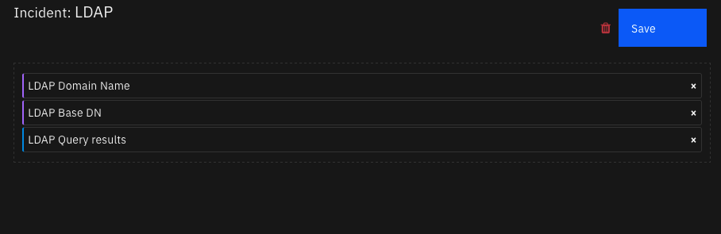
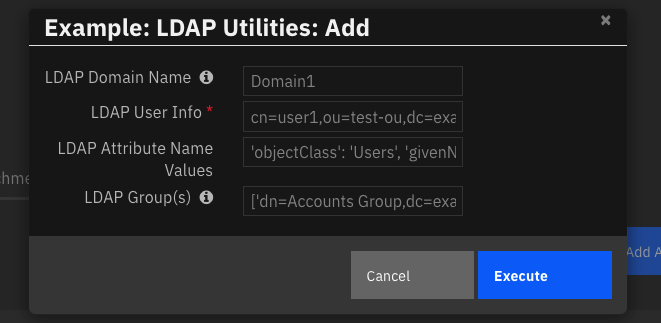
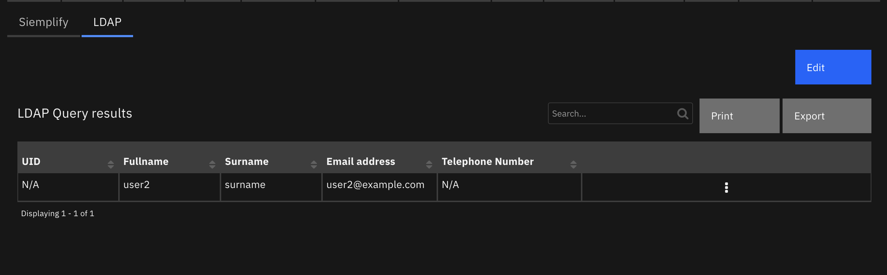

<!--
  This README.md is generated by running:
  "resilient-sdk docgen -p fn_ldap_utilities"

  It is best edited using a Text Editor with a Markdown Previewer. VS Code
  is a good example. Checkout https://guides.github.com/features/mastering-markdown/
  for tips on writing with Markdown

  All fields followed by "::CHANGE_ME::"" should be manually edited

  If you make manual edits and run docgen again, a .bak file will be created

  Store any screenshots in the "doc/screenshots" directory and reference them like:
  

  NOTE: If your app is available in the container-format only, there is no need to mention the integration server in this readme.
-->

# LDAP Utilities

## Table of Contents
- [Release Notes](#release-notes)
- [Overview](#overview)
  - [Key Features](#key-features)
- [Requirements](#requirements)
  - [Resilient platform](#resilient-platform)
  - [Cloud Pak for Security](#cloud-pak-for-security)
  - [Proxy Server](#proxy-server)
  - [Python Environment](#python-environment)
  - [Endpoint Developed With](#endpoint-developed-with)
- [Installation](#installation)
  - [Install](#install)
  - [App Configuration](#app-configuration)
  - [Custom Layouts](#custom-layouts)
- [Function - LDAP Utilities: Add](#function---ldap-utilities-add)
- [Function - LDAP Utilities: Search](#function---ldap-utilities-search)
- [Function - LDAP Utilities: Set Password](#function---ldap-utilities-set-password)
- [Function - LDAP Utilities: Remove from Group(s)](#function---ldap-utilities-remove-from-groups)
- [Function - LDAP Utilities: Update](#function---ldap-utilities-update)
- [Function - LDAP Utilities: Toggle Access](#function---ldap-utilities-toggle-access)
- [Function - LDAP Utilities: Add to Group(s)](#function---ldap-utilities-add-to-groups)
- [Data Table - LDAP Query results](#data-table---ldap-query-results)
- [Rules](#rules)
- [Troubleshooting & Support](#troubleshooting--support)
---

## Release Notes
<!--
  Specify all changes in this release. Do not remove the release
  notes of a previous release
-->
| Version | Date | Notes |
| ------- | ---- | ----- |
| 1.2.0 | 01/2022 | add users, groups, organizational units, etc. |
| 1.1.1 | 08/2020 | Add Host support |
| 1.1.0 | 05/2019 | NTLM Authentication, unicode support in workflow scripts |
| 1.0.0 | 09/2018 | Initial Release |

---

## Overview
<!--
  Provide a high-level description of the function itself and its remote software or application.
  The text below is parsed from the "description" and "long_description" attributes in the setup.py file
-->
**LDAP Utilities for IBM SOAR**
The Lightweight Directory Access Protocol, or LDAP, is an open, vendor-neutral, industry standard
application protocol for accessing and maintaining distributed directory information services over an IP
network. It is used to connect to, search, and modify internet directories.

These LDAP Utility integrations with the IBM Resilient platform allow multiple LDAP tasks to be initiated
from the Resilient platform to an external LDAP server. The returned results can be used to make customized updates to the Resilient platform such as updating incidents, artifacts, data tables and so on.

These LDAP Utility Functions integration package contains several useful workflow functions for common
automation and integration activities in the Resilient platform.

This document describes each utility function, how to configure it in custom workflows, and any additional
customization options.


 

### Key Features
<!--
  List the Key Features of the Integration
-->
Perform several operations on LDAP Server including

* Change user password
* Change user group (add or remove group)
* Set user attributes
* Toggle access
* LDAP search
* Add users, groups, organizational units, etc.

---

## Requirements
<!--
  List any Requirements
-->
This app supports the IBM Resilient SOAR Platform and the IBM Cloud Pak for Security.

### Resilient platform
The Resilient platform supports two app deployment mechanisms, App Host and integration server.

If deploying to a Resilient platform with an App Host, the requirements are:
* Resilient platform >= `40.2.81`.
* The app is in a container-based format (available from the AppExchange as a `zip` file).

If deploying to a Resilient platform with an integration server, the requirements are:
* Resilient platform >= `40.2.81`.
* The app is in the older integration format (available from the AppExchange as a `zip` file which contains a `tar.gz` file).
* Integration server is running `resilient_circuits>=30.0.0`.
* If using an API key account, make sure the account provides the following minimum permissions:
  | Name | Permissions |
  | ---- | ----------- |
  | Org Data | Read |
  | Function | Read |

The following Resilient platform guides provide additional information:
* _App Host Deployment Guide_: provides installation, configuration, and troubleshooting information, including proxy server settings.
* _Integration Server Guide_: provides installation, configuration, and troubleshooting information, including proxy server settings.
* _System Administrator Guide_: provides the procedure to install, configure and deploy apps.

The above guides are available on the IBM Knowledge Center at [ibm.biz/soar-docs](https://ibm.biz/soar-docs). On this web page, select your Resilient platform version. On the follow-on page, you can find the _App Host Deployment Guide_ or _Integration Server Guide_ by expanding **Resilient Apps** in the Table of Contents pane. The System Administrator Guide is available by expanding **System Administrator**.

### Cloud Pak for Security
If you are deploying to IBM Cloud Pak for Security, the requirements are:
* IBM Cloud Pak for Security >= 1.4.
* Cloud Pak is configured with an App Host.
* The app is in a container-based format (available from the AppExchange as a `zip` file).

The following Cloud Pak guides provide additional information:
* _App Host Deployment Guide_: provides installation, configuration, and troubleshooting information, including proxy server settings. From the Table of Contents, select Case Management and Orchestration & Automation > **Orchestration and Automation Apps**.
* _System Administrator Guide_: provides information to install, configure, and deploy apps. From the IBM Cloud Pak for Security Knowledge Center table of contents, select Case Management and Orchestration & Automation > **System administrator**.

These guides are available on the IBM Knowledge Center at [ibm.biz/cp4s-docs](https://ibm.biz/cp4s-docs). From this web page, select your IBM Cloud Pak for Security version. From the version-specific Knowledge Center page, select Case Management and Orchestration & Automation.

### Proxy Server
The app **does** support a proxy server. Use environment variables `HTTPS_PROXY` and `HTTP_PROXY` for integration servers and in App Host, use `manageAppHost proxy` (App Host >= 1.6) to specify your proxy settings

### Python Environment
Both Python 2.7 and Python 3.6 are supported.
Additional package dependencies may exist for each of these packages:
* ldap3>=2.0.0
* resilient_circuits>=30.0.0

### Endpoint Information

This app has been tested using:
| Product Name | Product Version | API URL | API Version |
| ------------ | --------------- | ------- | ----------- |
| OpenDS | 2.3.0 | - | - |


---

## Installation

### Install
* To install or uninstall an App or Integration on the _Resilient platform_, see the documentation at [ibm.biz/soar-docs](https://ibm.biz/soar-docs).
* To install or uninstall an App on _IBM Cloud Pak for Security_, see the documentation at [ibm.biz/cp4s-docs](https://ibm.biz/cp4s-docs) and follow the instructions above to navigate to Orchestration and Automation.

### App Configuration
The following table provides the settings you need to configure the app. These settings are made in the app.config file. See the documentation discussed in the Requirements section for the procedure.

| Config | Required | Example | Description |
| ------ | :------: | ------- | ----------- |
| **ldap_server** | Yes | `xxx.xxx.xxx.xxx` | * IP address of LDAP Server * |
| **ldap_port** | Yes | `389` | *LDAP Port to use. 389 is the default. Active Directory uses 636* |
| **ldap_use_ssl** | Yes | `False` | *True\|False*  |
| **ldap_auth** | Yes | `SIMPLE` | *"ANONYMOUS", "SIMPLE", "NTLM"*  |
| **ldap_user_dn** | Yes | `CN=Username,CN=Users,DC=example,DC=com` | *User for SIMPLE authentication*  |
| **ldap_user_ntlm** | Yes | `Domain\User` | *ldap user for NTML authentication*  |
| **ldap_password** | Yes | `password` | *password for SIMPLE and NTML authentication* |
| **ldap_is_active_directory** | Yes | `False` | *TRUE \|FALSE* |
| **ldap_connect_timeout** | Yes | `10` | *Number of seconds to wait for operation timeout* |

### Custom Layouts
<!--
  Use this section to provide guidance on where the user should add any custom fields and data tables.
  You may wish to recommend a new incident tab.
  You should save a screenshot "custom_layouts.png" in the doc/screenshots directory and reference it here
-->
* Import the Data Tables like the screenshot below:

  

---

## Function - LDAP Utilities: Add
Add users, groups, organizational units to LDAP. For all objects created, specify the `objectclass` in the ldap_attribute_name_values input field.

  

### Examples
| function | ldap_dn | ldap_attribute_name_values | ldap_multiple_group_dn |
| -------- | :------ | :------------------------- | :--------------------- |
| Add Domain | dc=subdomain,dc=example,dc=com | 'objectclass':['top', 'domain'] | - |
| Add OU | ou=people,dc=example,dc=com | 'objectclass': 'OrganizationalUnit' | - |
| Add User | cn=user1,ou=people,dc=example,dc=com | 'objectclass':'inetOrgPerson', 'sn': 'surname', 'mail': 'user1@example.com', 'description': 'something here' | - |
| Add User and associate with Groups | cn=user1,ou=people,dc=example,dc=com | 'objectclass':'inetOrgPerson', 'sn': 'surname', 'mail': 'user1@example.com', 'description': 'something here' | ['cn=mygroup,dc=example,dc=com'] |


<details><summary>Inputs:</summary>
<p>

| Name | Type | Required | Example | Tooltip |
| ---- | :--: | :------: | ------- | ------- |
| `ldap_attribute_name_values` | `text` | No | `"attribute1": "value1", "attribute2": "value2"` | comma separated name value pairs |
| `ldap_dn` | `text` | Yes | `-` | Distinguished Name of entry you want to access |
| `ldap_multiple_group_dn` | `text` | Yes | `"['dn=Accounts Group,dc=example,dc=com', 'dn=IT Group,dc=example,dc=com']"` | List (represented as a string) of each DN of the related groups |

</p>
</details>

<details><summary>Outputs:</summary>
<p>

```python
results = {
  'version': 2.0,
  'success': True,
  'reason': None,
  'content': {
    'result': 0,
    'description': 'success',
    'dn': '',
    'message': '',
    'referrals': None,
    'type': 'addResponse'
  },
  'raw': None,
  'inputs': {
    'ldap_dn': 'cn=user7,ou=people,dc=example,dc=com',
    'ldap_multiple_group_dn': "['cn=mygroup,dc=example,dc=com']",
    'ldap_attribute_name_values': "'objectclass':'inetOrgPerson', 'sn': 'surname'"
  },
  'metrics': {
    'version': '1.0',
    'package': 'fn-ldap-utilities',
    'package_version': '1.2.0',
    'host': 'Marks-MacBook-Pro.local',
    'execution_time_ms': 140,
    'timestamp': '2021-12-28 16:09:04'
  }
}
```

</p>
</details>

<details><summary>Example Pre-Process Script:</summary>
<p>

```python
inputs.ldap_dn = rule.properties.ldap_user_info
inputs.ldap_multiple_group_dn = rule.properties.ldap_groups if rule.properties.ldap_groups else '[]'
inputs.ldap_attribute_name_values = rule.properties.ldap_attribute_name_values
```

</p>
</details>

<details><summary>Example Post-Process Script:</summary>
<p>

```python
if results.success:
  incident.addNote("LDAP Add operation successful for: {}".format(results.inputs.get('ldap_dn')))
else:
  incident.addNote("LDAP Add operation unsuccessful for: {}. Reason: {}".format(results.inputs.get('ldap_dn'), results.reason))
```

</p>
</details>

---
## Function - LDAP Utilities: Search
Resilient Function to do a search or query against an LDAP server.

 

<details><summary>Inputs:</summary>
<p>

| Name | Type | Required | Example | Tooltip |
| ---- | :--: | :------: | ------- | ------- |
| `ldap_search_attributes` | `uid,cn,sn,mail,telephoneNumber` | No | `-` | A single attribute or a list of attributes to be returned by the LDAP search  |
| `ldap_search_base` | `dc=example,dc=com` | Yes | `-` | The base of the LDAP search request. |
| `ldap_search_filter` | `(&(objectClass=person)(mail=*%ldap_param%))` | Yes | `-` | The filter of the LDAP search request |
| `ldap_search_param` | `user2@example.com` | No | `-` | Parameter used in search filter |

Notes:
* The search_base and search_filter must be valid.
* If the %ldap_param% wildcard is used in the search_filter, the search_param input is required.
* The attribute values must meet the custom constraints set on your LDAP server.
</p>
</details>

<details><summary>Outputs:</summary>
<p>

```python
results = {
  'success': True,
  'entries': [
    {
      'dn': 'cn=user2,ou=people,dc=example,dc=com',
      'cn': [
        'user2'
      ],
      'mail': [
        'user2@example.com'
      ],
      'sn': [
        'surname'
      ],
      'telephoneNumber': [

      ],
      'uid': [

      ]
    }
  ]
}
```

</p>
</details>

<details><summary>Example Pre-Process Script:</summary>
<p>

```python
##  LDAP Utilities: Search - pre-processing script ##
inputs.ldap_search_base = "dc=example,dc=com"
inputs.ldap_search_filter = "(&(objectClass=person)(mail=*%ldap_param%))"
inputs.ldap_search_attributes = "uid,cn,sn,mail,telephoneNumber"
inputs.ldap_search_param = artifact.value
```

</p>
</details>

<details><summary>Example Post-Process Script:</summary>
<p>

```python
##  LDAP Utilities: Search - post-processing script ##
# Example of expected results - OpenLdap
"""
'entries': [{"dn": "uid=newton,dc=example,dc=com", "telephoneNumber": [], "uid": ["newton"],
    "mail": ["newton@ldap.forumsys.com"], "sn": ["Newton"], "cn": ["Isaac Newton"]},
    {"dn": "uid=einstein,dc=example,dc=com", "telephoneNumber": ["314-159-2653"], "uid": ["einstein"],
    "mail": ["einstein@ldap.forumsys.com"], "sn": ["Einstein"], "cn": ["Albert Einstein"]}]
"""

# Example of expected results - ActiveDirectory
"""
'entries': [{u'dn': u'CN=Isaac Newton,OU=IBMResilient,DC=ibm,DC=resilient,DC=com',
              u'telephoneNumber': u'314-159-2653', u'cn': u'Isaac Newton',
              u'mail': u'einstein@resilient.ibm.com', u'sn': u'Newton'}]
"""

#  Globals
ENTRY_TO_DATATABLE_MAP = {
   "uid": "uid",
   "cn": "fullname",
   "sn": "surname",
   "mail": "email_address",
   "telephoneNumber": "telephone_number"
}

# Processing if the function is a success
if(results.success):
  for entry in results["entries"]:

    if entry is None:
      break

    else:
      # Add Row
      row = incident.addRow("ldap_query_results")

      for k in ENTRY_TO_DATATABLE_MAP:

        if entry[k] is None:
          row[ENTRY_TO_DATATABLE_MAP[k]] = "N/A"

        else:
          try:
            # if 'entry[k]' is empty
            if len(entry[k]) == 0:
              row[ENTRY_TO_DATATABLE_MAP[k]] = "N/A"

            # Handle for Active Directory
            elif isinstance(entry[k], unicode):
              row[ENTRY_TO_DATATABLE_MAP[k]] = entry[k]

            # Handle for OpenLdap
            else:
              row[ENTRY_TO_DATATABLE_MAP[k]] = entry[k][0]

          except IndexError:
            row[ENTRY_TO_DATATABLE_MAP[k]] = "N/A"
```

</p>
</details>

---
## Function - LDAP Utilities: Set Password
A function that allows you to set a new password for an LDAP entry given the entry's DN

<details><summary>Inputs:</summary>
<p>

| Name | Type | Required | Example | Tooltip |
| ---- | :--: | :------: | ------- | ------- |
| `ldap_dn` | `text` | Yes | `cn=user2,ou=people,dc=example,dc=com` | Distinguished Name of entry you want to access |
| `ldap_new_password` | `text` | Yes | `NewTestPassword` | The new password you want to set for the entry |

</p>
</details>

<details><summary>Outputs:</summary>
<p>

```python
results = {
  'success': True,
  'user_dn': 'cn=user2,ou=people,dc=example,dc=com'
}
```

</p>
</details>

<details><summary>Example Pre-Process Script:</summary>
<p>

```python
# Once the LDAP Utilities: Search completes, get the DN of the first entry
# which will be the DN of the account you want to set a Set a New Password for

inputs.ldap_dn = workflow.properties.search_output["entries"][0]["dn"]
inputs.ldap_new_password = "NewTestPassword"
```

</p>
</details>

<details><summary>Example Post-Process Script:</summary>
<p>

```python
# If the function is successful in changing the users password,
# a note is added to the incident

if (results.success):
  noteText = """<br><i style="color: #979ca3">LDAP Utilities: Set Password workflow <u>complete</u>:</i>
                    A New Password has been set for:
                    <b>Email:</b> <u style="color: #7fb0ff">{0}</u>
                    <b>DN:</b> '{1}'""".format(artifact.value, results.user_dn)

  incident.addNote(helper.createRichText(noteText))
```

</p>
</details>

---
## Function - LDAP Utilities: Remove from Group(s)
A function that allows you to remove multiple from multiple groups

<details><summary>Inputs:</summary>
<p>

| Name | Type | Required | Example | Tooltip |
| ---- | :--: | :------: | ------- | ------- |
| `ldap_multiple_group_dn` | `text` | Yes | `"['dn=Accounts Group,dc=example,dc=com', 'dn=IT Group,dc=example,dc=com']"` | List (represented as a string) of each DN of the related groups |
| `ldap_multiple_user_dn` | `text` | Yes | `"['dn=tom smith,dc=example,dc=com', 'dn=ted smith,dc=example,dc=com']"` | List (represented as a string) of each DN of the users |

Notes:
* Only valid user DNs are removed from the groups. Any user DN that is not a member of the group or is invalid is ignored.
</p>
</details>

<details><summary>Outputs:</summary>
<p>

```python
results = {
  'success': True,
  'users_dn': [
    'dn=user1,dc=example,dc=com',
    'dn=user2,dc=example,dc=com'
  ],
  'groups_dn': [
    'cn=Accounts Group,dc=example,dc=com'
  ]
}
```

</p>
</details>

<details><summary>Example Pre-Process Script:</summary>
<p>

```python
# Both inputs must be a string representation of a List

## Example of multiple entries
# inputs.ldap_multiple_user_dn = "['dn=user1,dc=example,dc=com', 'dn=user2,dc=example,dc=com']"
# inputs.ldap_multiple_group_dn = "['dn=Accounts Group,dc=example,dc=com', 'dn=IT Group,dc=example,dc=com']"

## Note: You can use this handy function below, then not need to worry about the inputs formatting

def into_string_list_format(entries):
  """Function that converts a list or single string into a 'string repersentation of a list'"""
  string_list_to_return = "[{0}]"

  # If its a string, assume its one DN, one entry
  if isinstance(entries, basestring):
    return string_list_to_return.format('"{0}"'.format(entries))

  # Else assume its a List, so multiple DNs, multiple entries
  else:
    entries_to_add = ""
    for e in entries:
      entries_to_add += '"{0}",'.format(e)
    return string_list_to_return.format(entries_to_add)

list_of_users_dn = ['dn=user1,dc=example,dc=com', 'dn=user2,dc=example,dc=com']

# Both inputs must be a string representation of a List
inputs.ldap_multiple_user_dn = into_string_list_format(list_of_users_dn)
inputs.ldap_multiple_group_dn = into_string_list_format('dn=Accounts Group,dc=example,dc=com')

```

</p>
</details>

<details><summary>Example Post-Process Script:</summary>
<p>

```python
# If the function is successful in removing the users from said groups,
# a note is added to the incident

if (results.success):

  if (results.users_dn is None):
    noteText = """<br><i style="color: #979ca3">LDAP Utilities: Remove User from Group(s) <u>complete</u>:</i>
                  <b>No users found. Check inputted user DN's</b>"""

  else:
    noteText = """<br><i style="color: #979ca3">LDAP Utilities: Remove User from Group(s) <u>complete</u>:</i>
                    <b>User(s):</b> {0}
                    <b>Group(s):</b> {1}""".format(results.users_dn, results.groups_dn)

  incident.addNote(helper.createRichText(noteText))
```

</p>
</details>

---
## Function - LDAP Utilities: Update
A function that updates the attribute of a DN with a new value


<details><summary>Inputs:</summary>
<p>

| Name | Type | Required | Example | Tooltip |
| ---- | :--: | :------: | ------- | ------- |
| `ldap_attribute_name` | `text` | Yes | `mail` | The name of the LDAP attribute |
| `ldap_attribute_values` | `text` | Yes | `"['email1@example.com', 'email2@emample.com']"` | List (as a string representation) of the new attribute values |
| `ldap_dn` | `text` | Yes | `dn=tom smith,dc=example,dc=com` | Distinguished Name of entry you want to access |

Notes:
* The attribute values must meet the custom constraints set on your LDAP server.
</p>
</details>

<details><summary>Outputs:</summary>
<p>

```python
results = {
  'success': True,
  'attribute_name': 'homePhone',
  'attribute_values': [
    '081111111'
  ],
  'user_dn': 'cn=user2,ou=people,dc=example,dc=com'
}
```

</p>
</details>

<details><summary>Example Pre-Process Script:</summary>
<p>

```python
# Once the LDAP Utilities: Search completes, get the DN of the first entry
# which will be the DN of the account you want to update. Then set
# the name of the attribute to update and list the values

inputs.ldap_dn = workflow.properties.search_output["entries"][0]["dn"]
inputs.ldap_attribute_name = "homePhone"
inputs.ldap_attribute_values = "['081111111']"
# inputs.ldap_attribute_values = "['081111111', '082222222']"
```

</p>
</details>

<details><summary>Example Post-Process Script:</summary>
<p>

```python
# If the function is successful in updating the value of the attribute,
# a note is added to the incident

if (results.success):
  noteText = """<br><i style="color: #979ca3">LDAP Utilities: Update workflow <u>complete</u>:</i>
                    An LDAP Attribute has been updated
                    <b>Attribute:</b> {0}
                    <b>New Value(s):</b> {1}
                    <b>DN:</b> '{2}'""".format(results.attribute_name, results.attribute_values, results.user_dn)

  incident.addNote(helper.createRichText(noteText))
```

</p>
</details>

---
## Function - LDAP Utilities: Toggle Access
A function that allows an LDAP user, with the correct privileges to enable or disable another account given their DN. This is an Active Directory `only` function.

<details><summary>Inputs:</summary>
<p>

| Name | Type | Required | Example | Tooltip |
| ---- | :--: | :------: | ------- | ------- |
| `ldap_dn` | `text` | Yes | `-` | Distinguished Name of entry you want to access |
| `ldap_toggle_access` | `select` | Yes | `-` | Either enable or disable the user |

</p>
</details>

<details><summary>Outputs:</summary>
<p>

```python
results = {
            "success": True,
            "user_dn": "cn=user2,dc=example,dc=com",
            "user_status": "Disabled"
          }
```

</p>
</details>

<details><summary>Example Pre-Process Script:</summary>
<p>

```python
# Once the LDAP Utilities: Search completes, get the DN of the first entry
# which will be the DN of the account you want to set a Toggle Access for

inputs.ldap_dn = workflow.properties.search_output["entries"][0]["dn"]
```

</p>
</details>

<details><summary>Example Post-Process Script:</summary>
<p>

```python
# If the function is successful in updating users access rights,
# a note is added to the incident

if (results.success):

  color = "#45bc27" #green

  if (results.user_status == "Disabled"):
    color = "#ff402b" #red

  noteText = """<br><i style="color: #979ca3">LDAP Utilities: Toggle Access workflow <u>complete</u>:</i>
                    <b>Email:</b> <u style="color: #7fb0ff">{0}</u>
                    <b>Status:</b> <b style="color: {1}">{2}</b>
                    <b>DN:</b> '{3}'""".format(artifact.value, color, results.user_status, results.user_dn)

  incident.addNote(helper.createRichText(noteText))

```

</p>
</details>

---
## Function - LDAP Utilities: Add to Group(s)
A function that allows adding multiple users to multiple groups.

<details><summary>Inputs:</summary>
<p>

| Name | Type | Required | Example | Tooltip |
| ---- | :--: | :------: | ------- | ------- |
| `ldap_multiple_group_dn` | `text` | Yes | `"['dn=Accounts Group,dc=example,dc=com', 'dn=IT Group,dc=example,dc=com']"` | List (represented as a string) of each DN of the related groups |
| `ldap_multiple_user_dn` | `text` | Yes | `"['dn=tom smith,dc=example,dc=com', 'dn=ted smith,dc=example,dc=com']"` | List (represented as a string) of each DN of the users |

</p>
</details>

<details><summary>Outputs:</summary>
<p>

```python
results = {
  'success': True,
  'users_dn': [
    'dn=user1,dc=example,dc=com',
    'dn=user2,dc=example,dc=com'
  ],
  'groups_dn': [
    'cn=Accounts Group,dc=example,dc=com'
  ]
}
```

</p>
</details>

<details><summary>Example Pre-Process Script:</summary>
<p>

```python
# Both inputs must be a string representation of a List

## Example of multiple entries
# inputs.ldap_multiple_user_dn = "['dn=user1,dc=example,dc=com', 'dn=user2,dc=example,dc=com']"
# inputs.ldap_multiple_group_dn = "['dn=Accounts Group,dc=example,dc=com', 'dn=IT Group,dc=example,dc=com']"

## Note: You can use this handy function below, then not need to worry about the inputs formatting

def into_string_list_format(entries):
  """Function that converts a list or single string into a 'string repersentation of a list'"""
  string_list_to_return = "[{0}]"

  # If its a string, assume its one DN, one entry
  if isinstance(entries, basestring):
    return string_list_to_return.format('"{0}"'.format(entries))

  # Else assume its a List, so multiple DNs, multiple entries
  else:
    entries_to_add = ""
    for e in entries:
      entries_to_add += '"{0}",'.format(e)
    return string_list_to_return.format(entries_to_add)

list_of_users_dn = ['dn=user1,dc=example,dc=com', 'dn=user2,dc=example,dc=com']

# Both inputs must be a string representation of a List
inputs.ldap_multiple_user_dn = into_string_list_format(list_of_users_dn)
inputs.ldap_multiple_group_dn = into_string_list_format('dn=Accounts Group,dc=example,dc=com')

```

</p>
</details>

<details><summary>Example Post-Process Script:</summary>
<p>

```python
# If the function is successful in adding the users to said groups,
# a note is added to the incident

if (results.success):
  noteText = """<br><i style="color: #979ca3">LDAP Utilities: Add User(s) to Group(s) <u>complete</u>:</i>
                    <b>User(s):</b> {0}
                    <b>Group(s):</b> {1}""".format(results.users_dn, results.groups_dn)

  incident.addNote(helper.createRichText(noteText))
```

</p>
</details>

---


## Data Table - LDAP Query results
This table represents a simple display of user data. If you wish to display more attributes,
it's best to create a new table, change the search filter fields and post-processing script to fill the
new table with the user data.

 

#### API Name:
ldap_query_results

#### Columns:
| Column Name | API Access Name | Type | Tooltip |
| ----------- | --------------- | ---- | ------- |
| Email address | `email_address` | `text` | - |
| Fullname | `fullname` | `text` | - |
| Surname | `surname` | `text` | - |
| Telephone Number | `telephone_number` | `text` | - |
| UID | `uid` | `text` | - |

---


## Rules
These rules are examples. Actual use of the functions should be added to your own workflows and playbooks with values either derived from incident data and input from input fields collected when a manual rule is executed.

| Rule Name | Object | Workflow Triggered |
| --------- | ------ | ------------------ |
| Example: LDAP Utilities: Set Password | artifact | `example_ldap_utilities_set_password` |
| Example: LDAP Utilities: Toggle Access | artifact | `example_ldap_utilities_toggle_access` |
| Example: LDAP Utilities: Remove User(s) from Group(s) | artifact | `example_ldap_utilities_remove_user_from_groups` |
| Example: LDAP Utilities: Update | artifact | `example_ldap_utilities_update` |
| Example: LDAP Utilities: Add | incident | `example_ldap_utilities_add` |
| Example: LDAP Utilities: Add User(s) to Group(s) | artifact | `example_ldap_utilities_add_users_to_groups` |
| Example: LDAP Utilities: Search | artifact | `example_ldap_utilities_search` |

---

## Troubleshooting & Support
Refer to the documentation listed in the Requirements section for troubleshooting information.

### For Support
This is a IBM Community provided App. Please search the Community [ibm.biz/soarcommunity](https://ibm.biz/soarcommunity) for assistance.
