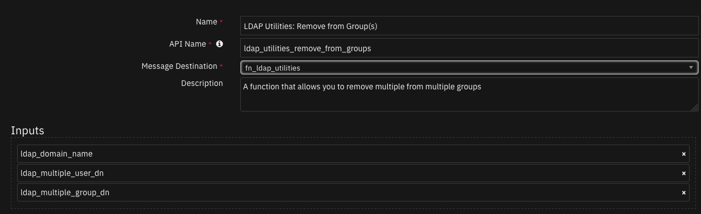

# SOAR LDAP Utilities

## Table of Contents
- [Release Notes](#release-notes)
- [Overview](#overview)
  - [Key Features](#key-features)
- [Requirements](#requirements)
  - [SOAR platform](#soar-platform)
  - [Cloud Pak for Security](#cloud-pak-for-security)
  - [Proxy Server](#proxy-server)
  - [Python Environment](#python-environment)
  - [Endpoint Developed With](#endpoint-developed-with)
- [Installation](#installation)
  - [Install](#install)
  - [App Configuration](#app-configuration)
  - [Custom Layouts](#custom-layouts)
- [Function - LDAP Utilities: Add](#function---ldap-utilities-add)
- [Function - LDAP Utilities: Add to Group(s)](#function---ldap-utilities-add-to-groups)
- [Function - LDAP Utilities: Remove from Group(s)](#function---ldap-utilities-remove-from-groups)
- [Function - LDAP Utilities: Search](#function---ldap-utilities-search)
- [Function - LDAP Utilities: Set Password](#function---ldap-utilities-set-password)
- [Function - LDAP Utilities: Toggle Access](#function---ldap-utilities-toggle-access)
- [Function - LDAP Utilities: Update](#function---ldap-utilities-update)
- [Data Table - LDAP Query results](#data-table---ldap-query-results)
- [Rules](#rules)
- [Troubleshooting & Support](#troubleshooting--support)
---

## Release Notes
| Version | Date | Notes |
| ------- | ---- | ----- |
| 2.0.0 | 04/2022 | <ul><li>Add ability to have multiple LDAP Domains</li><li>New rule to add users, groups, organizational units, etc.</li></ul>|
| 1.1.1 | 07/2021 | Support added for App Host |
| 1.1.0 | 03/2019 | <ul><li>Handle Unicode in Post-Process Scripts</li><li>Handle NTLM Authentication to Active Directory</li><li>Add functionality to allow for LDAP Wildcard queries with *</li></ul> |
| 1.0.0 | 07/2018 | Initial Release |

* For customers upgrading from a previous release to 2.0.0 or greater, the app.config file must be manually edited to add new settings required to each server configuration. See [2.0.0 Changes](#2.0.0-changes)

---

## Overview
These LDAP Utility integrations allow multiple activities to be initiated from workflows in the IBM SOAR platform to an external LDAP server. Functions include: search, update, set password, toggle access, and add user.
**SOAR LDAP Utilities'**

 

SOAR components to allow reading and manipulation of your LDAP Server'

### Key Features
* Add users, groups, organizational units to LDAP
* Add multiple users to multiple groups
* Remove multiple users from a group
* Run a person query against an LDAP server using the person's email address
* Search for a user using their email address, gets their DN and sets a new password for that user
* Enable/disable an Active Directory user account
* Update the value of a DN's attribute with the given value(s)

---

## Requirements
This app supports the IBM Security QRadar SOAR Platform and the IBM Security QRadar SOAR for IBM Cloud Pak for Security.

### SOAR platform
The SOAR platform supports two app deployment mechanisms, App Host and integration server.

If deploying to a SOAR platform with an App Host, the requirements are:
* SOAR platform >= `42.0.7058`.
* The app is in a container-based format (available from the AppExchange as a `zip` file).

If deploying to a SOAR platform with an integration server, the requirements are:
* SOAR platform >= `42.0.7058`.
* The app is in the older integration format (available from the AppExchange as a `zip` file which contains a `tar.gz` file).
* Integration server is running `resilient_circuits>=42.0.0`.
* If using an API key account, make sure the account provides the following minimum permissions: 
  | Name | Permissions |
  | ---- | ----------- |
  | Org Data | Read |
  | Function | Read |

The following SOAR platform guides provide additional information: 
* _App Host Deployment Guide_: provides installation, configuration, and troubleshooting information, including proxy server settings. 
* _Integration Server Guide_: provides installation, configuration, and troubleshooting information, including proxy server settings.
* _System Administrator Guide_: provides the procedure to install, configure and deploy apps. 

The above guides are available on the IBM Documentation website at [ibm.biz/soar-docs](https://ibm.biz/soar-docs). On this web page, select your SOAR platform version. On the follow-on page, you can find the _App Host Deployment Guide_ or _Integration Server Guide_ by expanding **Apps** in the Table of Contents pane. The System Administrator Guide is available by expanding **System Administrator**.

### Cloud Pak for Security
If you are deploying to IBM Cloud Pak for Security, the requirements are:
* IBM Cloud Pak for Security >= 1.4.
* Cloud Pak is configured with an App Host.
* The app is in a container-based format (available from the AppExchange as a `zip` file).

The following Cloud Pak guides provide additional information: 
* _App Host Deployment Guide_: provides installation, configuration, and troubleshooting information, including proxy server settings. From the Table of Contents, select Case Management and Orchestration & Automation > **Orchestration and Automation Apps**.
* _System Administrator Guide_: provides information to install, configure, and deploy apps. From the IBM Cloud Pak for Security IBM Documentation table of contents, select Case Management and Orchestration & Automation > **System administrator**.

These guides are available on the IBM Documentation website at [ibm.biz/cp4s-docs](https://ibm.biz/cp4s-docs). From this web page, select your IBM Cloud Pak for Security version. From the version-specific IBM Documentation page, select Case Management and Orchestration & Automation.

### Proxy Server
The app does not support a proxy server.

### Python Environment
Python 3.6 and Python 3.9 are supported.
Additional package dependencies may exist for each of these packages:
* ldap3>=2.0.0
* resilient_circuits>=42.0.0

---

## Installation

### Install
* To install or uninstall an App or Integration on the _SOAR platform_, see the documentation at [ibm.biz/soar-docs](https://ibm.biz/soar-docs).
* To install or uninstall an App on _IBM Cloud Pak for Security_, see the documentation at [ibm.biz/cp4s-docs](https://ibm.biz/cp4s-docs) and follow the instructions above to navigate to Orchestration and Automation.

### App Configuration
The following table provides the settings you need to configure the app. These settings are made in the app.config file. See the documentation discussed in the Requirements section for the procedure.

| Config | Required | Example | Description |
| ------ | :------: | ------- | ----------- |
| **ldap_server** | Yes | `xxx.xxx.xxx.xxx` | *Ip address of the LDAP Server* |
| **ldap_port** | Yes | `389` | *Port to use to connect to LDAP server* |
| **ldap_use_ssl** | Yes | `False` | *Boolean value to use ssl or not* |
| **ldap_auth** | Yes | `SIMPLE` | *Type of authentication to use* |
| **ldap_user_dn** | Yes | `CN=Username,CN=Users,DC=example,DC=com` | *DN of LDAP account* |
| **ldap_password** | Yes | `password` | *Password for the LDAP account* |
| **ldap_user_ntlm** | Yes | `Domain\User` | *Windows NTLM user* |
| **ldap_is_active_directory** | Yes | `False` | *Boolean value to determine if LDAP server is on an active directory server* |
| **ldap_connect_timeout** | Yes | `10` | *Timeout in seconds* |

#### 2.0.0 Changes
Starting in version 2.0.0, more than one LDAP instance can be configured for SOAR case data synchronization. For enterprises with only one LDAP instance, your app.config file will continue to define the LDAP instance inder the `[fn_ldap_utilities]` section header.

For enterprises with more than one LDAP instance, each instance will have it;s own section header, such as `[fn_ldap_utilites:Domain1]` where `Domain1` represents any label helpful to define your LDAP environment.

Be aware that modifications to  custom workflows will be needed to correctly pass this label through the `ldap_domain_name` function input field if the LDAP server/servers in the app.config have labels.

If you have existing custom workflows, see [Creating workflows when server/servers in app.config are labeled](#creating-workflows-when-serverservers-in-appconfig-are-labeled) for more information abiout changing them to reference the `ldap_domain_name` function input field.

## Using the example functions
Two incident fields have been added, `ldap_domain_name` and `ldap_base_dn`. If these are added to a case and given values then those values will be used when a rule is run that uses those fields. If a rule is run and the user enters a value that is differernt from the ones given in the incident then the user entered value will be used for that rule.

---

## Function - LDAP Utilities: Add
Add users, groups, organizational units to LDAP

 

<details><summary>Inputs:</summary>
<p>

| Name | Type | Required | Example | Tooltip |
| ---- | :--: | :------: | ------- | ------- |
| `ldap_attribute_name_values` | `text` | No | `"attribute1": "value1", "attribute2": "value2"` | comma separated name value pairs |
| `ldap_dn` | `text` | Yes | `-` | Distinguished Name of entry you want to access |
| `ldap_domain_name` | `text` | No | `Domain1` | - |
| `ldap_multiple_group_dn` | `text` | Yes | `"['dn=Accounts Group,dc=example,dc=com', 'dn=IT Group,dc=example,dc=com']"` | List (represented as a string) of each DN of the related groups |

</p>
</details>

<details><summary>Outputs:</summary>
<p>

> **NOTE:** This example might be in JSON format, but `results` is a Python Dictionary on the SOAR platform.

```python
results = {
  "content": {
    "description": "success",
    "dn": "",
    "message": "",
    "referrals": null,
    "result": 0,
    "type": "addResponse"
  },
  "inputs": {
    "ldap_attribute_name_values": "\u0027objectclass\u0027: \u0027groupOfNames\u0027",
    "ldap_dn": "cn=mygroup,dc=example,dc=com",
    "ldap_multiple_group_dn": "[]"
  },
  "metrics": {
    "execution_time_ms": 131,
    "host": "9e05ac7d-259a-4f2f-963c-c6b198aa446f-7bc9574887-rh6vw",
    "package": "fn-ldap-utilities",
    "package_version": "1.2.0",
    "timestamp": "2022-03-07 16:37:55",
    "version": "1.0"
  },
  "raw": null,
  "reason": null,
  "success": true,
  "version": 2.0
}
```

</p>
</details>

<details><summary>Example Pre-Process Script:</summary>
<p>

```python
# If the incident field ldap_domain_name contains a value then set ldap_domain_name to that value
if incident.properties.ldap_domain_name:
  inputs.ldap_domain_name = incident.properties.ldap_domain_name
# If a value is given in the rule ldap_domain_name field then set ldap_domain_name to that value
if rule.properties.ldap_domain_name:
  inputs.ldap_domain_name = rule.properties.ldap_domain_name

inputs.ldap_dn = rule.properties.ldap_user_info
inputs.ldap_multiple_group_dn = rule.properties.ldap_groups if rule.properties.ldap_groups else '[]'
inputs.ldap_attribute_name_values = rule.properties.ldap_attribute_name_values
```

</p>
</details>

<details><summary>Example Post-Process Script:</summary>
<p>

```python
if results.success:
  incident.addNote("LDAP Add operation successful for: {}".format(results.inputs.get('ldap_dn')))
else:
  incident.addNote("LDAP Add operation unsuccessful for: {}. Reason: {}".format(results.inputs.get('ldap_dn'), results.reason))
```

</p>
</details>

---
## Function - LDAP Utilities: Add to Group(s)
A function that allows adding multiple users to multiple groups

 

<details><summary>Inputs:</summary>
<p>

| Name | Type | Required | Example | Tooltip |
| ---- | :--: | :------: | ------- | ------- |
| `ldap_domain_name` | `text` | No | `Domain1` | - |
| `ldap_multiple_group_dn` | `text` | Yes | `"['dn=Accounts Group,dc=example,dc=com', 'dn=IT Group,dc=example,dc=com']"` | List (represented as a string) of each DN of the related groups |
| `ldap_multiple_user_dn` | `text` | Yes | `"['dn=tom smith,dc=example,dc=com', 'dn=ted smith,dc=example,dc=com']"` | List (represented as a string) of each DN of the users |

</p>
</details>

<details><summary>Outputs:</summary>
<p>

> **NOTE:** This example might be in JSON format, but `results` is a Python Dictionary on the SOAR platform.

```python
results = {
  "groups_dn": [
    "cn=GroupA,cn=Users,dc=example,dc=com"
  ],
  "success": true,
  "users_dn": [
    "cn=Breda User11,cn=Users,dc=example,dc=com",
    "cn=Breda User10,cn=Users,dc=example,dc=com"
  ]
}
```

</p>
</details>

<details><summary>Example Pre-Process Script:</summary>
<p>

```python
# Both inputs must be a string representation of a List

## Example of multiple entries
# inputs.ldap_multiple_user_dn = "['dn=user1,dc=example,dc=com', 'dn=user2,dc=example,dc=com']"
# inputs.ldap_multiple_group_dn = "['dn=Accounts Group,dc=example,dc=com', 'dn=IT Group,dc=example,dc=com']"

# Both inputs must be a string representation of a List
inputs.ldap_multiple_user_dn = rule.properties.ldap_multiple_user_dn
inputs.ldap_multiple_group_dn = rule.properties.ldap_multiple_group_dn

# If the incident field ldap_domain_name contains a value then set ldap_domain_name to that value
if incident.properties.ldap_domain_name:
  inputs.ldap_domain_name = incident.properties.ldap_domain_name
# If a value is given in the rule ldap_domain_name field then set ldap_domain_name to that value
if rule.properties.ldap_domain_name:
  inputs.ldap_domain_name = rule.properties.ldap_domain_name
```

</p>
</details>

<details><summary>Example Post-Process Script:</summary>
<p>

```python
# If the function is successful in adding the users to said groups,
# a note is added to the incident

if (results.success):
  noteText = """<br><i style="color: #979ca3"> LDAP Utilities: Add User(s) to Group(s) <u>complete</u>:</i>
                    <b>User(s):</b> {}
                    <b>Group(s):</b> {}""".format(results.inputs.ldap_multiple_user_dn, results.inputs.ldap_multiple_group_dn)

  incident.addNote(helper.createRichText(noteText))
```

</p>
</details>

---
## Function - LDAP Utilities: Remove from Group(s)
A function that allows you to remove multiple from multiple groups

 

<details><summary>Inputs:</summary>
<p>

| Name | Type | Required | Example | Tooltip |
| ---- | :--: | :------: | ------- | ------- |
| `ldap_domain_name` | `text` | No | `Domain1` | - |
| `ldap_multiple_group_dn` | `text` | Yes | `"['dn=Accounts Group,dc=example,dc=com', 'dn=IT Group,dc=example,dc=com']"` | List (represented as a string) of each DN of the related groups |
| `ldap_multiple_user_dn` | `text` | Yes | `"['dn=tom smith,dc=example,dc=com', 'dn=ted smith,dc=example,dc=com']"` | List (represented as a string) of each DN of the users |

</p>
</details>

<details><summary>Outputs:</summary>
<p>

> **NOTE:** This example might be in JSON format, but `results` is a Python Dictionary on the SOAR platform.

```python
results = {
  "groups_dn": [
    "cn=GroupA,cn=Users,dc=example,dc=com"
  ],
  "success": true,
  "users_dn": [
    "cn=Breda User11,cn=Users,dc=example,dc=com",
    "cn=Breda User10,cn=Users,dc=example,dc=com"
  ]
}
```

</p>
</details>

<details><summary>Example Pre-Process Script:</summary>
<p>

```python
# Both inputs must be a string representation of a List

## Example of multiple entries
# inputs.ldap_multiple_user_dn = "['dn=user1,dc=example,dc=com', 'dn=user2,dc=example,dc=com']"
# inputs.ldap_multiple_group_dn = "['dn=Accounts Group,dc=example,dc=com', 'dn=IT Group,dc=example,dc=com']"

# Both inputs must be a string representation of a List
inputs.ldap_multiple_user_dn = rule.properties.ldap_multiple_user_dn
inputs.ldap_multiple_group_dn = rule.properties.ldap_multiple_group_dn

# If the incident field ldap_domain_name contains a value then set ldap_domain_name to that value
if incident.properties.ldap_domain_name:
  inputs.ldap_domain_name = incident.properties.ldap_domain_name
# If a value is given in the rule ldap_domain_name field then set ldap_domain_name to that value
if rule.properties.ldap_domain_name:
  inputs.ldap_domain_name = rule.properties.ldap_domain_name
```

</p>
</details>

<details><summary>Example Post-Process Script:</summary>
<p>

```python
# If the function is successful in removing the users from said groups,
# a note is added to the incident

if (results.success):
  if not results.users_dn:
    noteText = """<br><i style="color: #979ca3"> LDAP Utilities: Remove User from Group(s) <u>complete</u>:</i>
                  <b>No users found. Check inputted user DN's</b>"""
  else:
    noteText = """<br><i style="color: #979ca3"> LDAP Utilities: Remove User from Group(s) <u>complete</u>:</i>
                    <b>User(s):</b> {}
                    <b>Group(s):</b> {}""".format(results.inputs.ldap_multiple_user_dn, results.inputs.ldap_multiple_group_dn)

  incident.addNote(helper.createRichText(noteText))
```

</p>
</details>

---
## Function - LDAP Utilities: Search
SOAR Function to do a search or query against an LDAP server.

 

<details><summary>Inputs:</summary>
<p>

| Name | Type | Required | Example | Tooltip |
| ---- | :--: | :------: | ------- | ------- |
| `ldap_domain_name` | `text` | No | `Domain1` | - |
| `ldap_search_attributes` | `text` | No | `-` | A single attribute or a list of attributes to be returned by the LDAP search  |
| `ldap_search_base` | `text` | Yes | `-` | The base of the LDAP search request. |
| `ldap_search_filter` | `textarea` | Yes | `-` | The filter of the LDAP search request |
| `ldap_search_param` | `text` | No | `-` | Parameter used in search filter |

</p>
</details>

<details><summary>Outputs:</summary>
<p>

> **NOTE:** This example might be in JSON format, but `results` is a Python Dictionary on the SOAR platform.

```python
results = {
  "entries": [
    {
      "cn": "fiona saml1",
      "dn": "CN=fiona saml1,CN=Users,dc=example,DC=com",
      "mail": "fionasaml1@test.com",
      "sn": "saml1",
      "telephoneNumber": [],
      "uid": []
    }
  ],
  "success": true
}
```

</p>
</details>

<details><summary>Example Pre-Process Script:</summary>
<p>

```python
##  LDAP Utilities: Search - pre-processing script ##
inputs.ldap_search_filter = rule.properties.ldap_search_filter
inputs.ldap_search_attributes = rule.properties.ldap_search_attributes
inputs.ldap_search_param = artifact.value
# If the incident field ldap_base_dn contains a value then set ldap_search_base to that value
if incident.properties.ldap_base_dn:
  inputs.ldap_search_base = incident.properties.ldap_base_dn
# If a value is given in the rule ldap_search_base field then set ldap_search_base to that value
if rule.properties.ldap_search_base:
  inputs.ldap_search_base = rule.properties.ldap_search_base

# If the incident field ldap_domain_name contains a value then set ldap_domain_name to that value
if incident.properties.ldap_domain_name:
  inputs.ldap_domain_name = incident.properties.ldap_domain_name
# If a value is given in the rule ldap_domain_name field then set ldap_domain_name to that value
if rule.properties.ldap_domain_name:
  inputs.ldap_domain_name = rule.properties.ldap_domain_name
```

</p>
</details>

<details><summary>Example Post-Process Script:</summary>
<p>

```python
##  LDAP Utilities: Search - post-processing script ##
# Example of expected results - OpenLdap
"""
'entries': [{"dn": "uid=newton,dc=example,dc=com", "telephoneNumber": [], "uid": ["newton"],
    "mail": ["newton@ldap.forumsys.com"], "sn": ["Newton"], "cn": ["Isaac Newton"]},
    {"dn": "uid=einstein,dc=example,dc=com", "telephoneNumber": ["314-159-2653"], "uid": ["einstein"],
    "mail": ["einstein@ldap.forumsys.com"], "sn": ["Einstein"], "cn": ["Albert Einstein"]}]
"""

# Example of expected results - ActiveDirectory
"""
'entries': [{u'dn': u'CN=Isaac Newton,OU=IBMResilient,DC=ibm,DC=resilient,DC=com',
              u'telephoneNumber': u'314-159-2653', u'cn': u'Isaac Newton',
              u'mail': u'einstein@resilient.ibm.com', u'sn': u'Newton'}]
"""

#  Globals
ENTRY_TO_DATATABLE_MAP = {
   "uid": "uid",
   "cn": "fullname",
   "sn": "surname",
   "mail": "email_address",
   "telephoneNumber": "telephone_number"
}

# Processing if the function is a success
if(results.success):
  for entry in results.entries:
    if not entry:
      break
    # Add Row
    row = incident.addRow("ldap_query_results")
    for k in ENTRY_TO_DATATABLE_MAP:
      if not entry[k]:
        row[ENTRY_TO_DATATABLE_MAP[k]] = "N/A"
      else:
        try:
          # If 'entry[k]' is empty
          if not len(entry[k]):
            row[ENTRY_TO_DATATABLE_MAP[k]] = "N/A"
          # Handle for Active Directory
          elif isinstance(entry[k], unicode):
            row[ENTRY_TO_DATATABLE_MAP[k]] = entry[k]
          # Handle for OpenLdap
          else:
            row[ENTRY_TO_DATATABLE_MAP[k]] = entry[k][0]
        except IndexError:
          row[ENTRY_TO_DATATABLE_MAP[k]] = "N/A"
```

</p>
</details>

---
## Function - LDAP Utilities: Set Password
A function that allows you to set a new password for an LDAP entry given the entry's DN

 

<details><summary>Inputs:</summary>
<p>

| Name | Type | Required | Example | Tooltip |
| ---- | :--: | :------: | ------- | ------- |
| `ldap_dn` | `text` | Yes | `-` | Distinguished Name of entry you want to access |
| `ldap_domain_name` | `text` | No | `Domain1` | - |
| `ldap_new_auto_password_len` | `number` | No | `-` | Length of password to generate |
| `ldap_new_password` | `text` | No | `-` | The new password you want to set for the entry |
| `ldap_return_new_password` | `boolean` | No | `-` | - |

</p>
</details>

<details><summary>Outputs:</summary>
<p>

> **NOTE:** This example might be in JSON format, but `results` is a Python Dictionary on the SOAR platform.

```python
results = {
  "success": true,
  "user_dn": "CN=fiona saml1,CN=Users,dc=example,DC=com"
}
```

</p>
</details>

<details><summary>Example Pre-Process Script:</summary>
<p>

```python
# Once the LDAP Utilities: Search completes, get the DN of the first entry
# which will be the DN of the account you want to set a Set a New Password for
inputs.ldap_domain_name = workflow.properties.search_output.inputs.ldap_domain_name
inputs.ldap_dn = workflow.properties.search_output.content[0]["dn"]
inputs.ldap_new_password = rule.properties.ldap_user_new_password
inputs.ldap_new_auto_password_len = rule.properties.ldap_new_auto_password_length
inputs.ldap_return_new_password = rule.properties.ldap_return_new_password
```

</p>
</details>

<details><summary>Example Post-Process Script:</summary>
<p>

```python
# If the function is successful in changing the users password,
# a note is added to the incident

if (results.success):
  noteText = """<br><i style="color: #979ca3"> LDAP MultiDomain Utilities: Set Password workflow <u>complete</u>:</i>
                    A New Password has been set for:
                    <b>Email:</b> <u style="color: #7fb0ff">{}</u>
                    <b>DN:</b> '{}'
                    <b>New password:</b> '{}'""".format(artifact.value, results.inputs.ldap_dn, results.inputs.ldap_new_password)

  incident.addNote(helper.createRichText(noteText))
```

</p>
</details>

---
## Function - LDAP Utilities: Toggle Access
A function that allows an LDAP user, with the correct privileges to enable or disable another account given their DN

 

<details><summary>Inputs:</summary>
<p>

| Name | Type | Required | Example | Tooltip |
| ---- | :--: | :------: | ------- | ------- |
| `ldap_dn` | `text` | Yes | `-` | Distinguished Name of entry you want to access |
| `ldap_domain_name` | `text` | No | `Domain1` | - |
| `ldap_toggle_access` | `select` | Yes | `-` | Either enable or disable the user |

</p>
</details>

<details><summary>Outputs:</summary>
<p>

> **NOTE:** This example might be in JSON format, but `results` is a Python Dictionary on the SOAR platform.

```python
results = {
  "success": true,
  "user_dn": "CN=e,CN=Users,dc=example,DC=com",
  "user_status": "Enabled"
}
```

</p>
</details>

<details><summary>Example Pre-Process Script:</summary>
<p>

```python
# Once the LDAP Utilities: Search completes, get the DN of the first entry
# which will be the DN of the account you want to set a Toggle Access for
inputs.ldap_domain_name = workflow.properties.search_output.inputs.ldap_domain_name
inputs.ldap_dn = workflow.properties.search_output.content[0]["dn"]
inputs.ldap_toggle_access = rule.properties.ldap_toggle_access
```

</p>
</details>

<details><summary>Example Post-Process Script:</summary>
<p>

```python
# If the function is successful in updating users access rights,
# a note is added to the incident

if (results.success):
  color = "#45bc27" #green
  if (results.inputs.ldap_toggle_access.get("name") == "Disabled"):
    color = "#ff402b" #red
  noteText = """<br><i style="color: #979ca3"> LDAP Utilities: Toggle Access workflow <u>complete</u>:</i>
                    <b>Email:</b> <u style="color: #7fb0ff">{}</u>
                    <b>Status:</b> <b style="color: {}">{}</b>
                    <b>DN:</b> '{}'""".format(artifact.value, color, results.inputs.ldap_toggle_access.name, results.inputs.ldap_dn)

  incident.addNote(helper.createRichText(noteText))
```

</p>
</details>

---
## Function - LDAP Utilities: Update
A function that updates the attribute of a DN with a new value

 

<details><summary>Inputs:</summary>
<p>

| Name | Type | Required | Example | Tooltip |
| ---- | :--: | :------: | ------- | ------- |
| `ldap_attribute_name` | `text` | Yes | `-` | The name of the LDAP attribute |
| `ldap_attribute_values` | `text` | Yes | `"['value1', 'value2', 'value3']"` | List (as a string representation) of the new attribute values |
| `ldap_dn` | `text` | Yes | `-` | Distinguished Name of entry you want to access |
| `ldap_domain_name` | `text` | No | `Domain1` | - |

</p>
</details>

<details><summary>Outputs:</summary>
<p>

> **NOTE:** This example might be in JSON format, but `results` is a Python Dictionary on the SOAR platform.

```python
results = {
  "attribute_name": "homePhone",
  "attribute_values": [
    "081111111"
  ],
  "success": true,
  "user_dn": "CN=fiona saml1,CN=Users,dc=example,DC=com"
}
```

</p>
</details>

<details><summary>Example Pre-Process Script:</summary>
<p>

```python
# Once the LDAP Utilities: Search completes, get the DN of the first entry
# which will be the DN of the account you want to update. Then set
# the name of the attribute to update and list the values
inputs.ldap_domain_name = workflow.properties.search_output.inputs.ldap_domain_name
inputs.ldap_dn = workflow.properties.search_output.content[0]["dn"]
inputs.ldap_attribute_name = rule.properties.ldap_update_attribute_name
inputs.ldap_attribute_values = rule.properties.ldap_attribute_update_value
# inputs.ldap_attribute_values = "['081111111', '082222222']"
```

</p>
</details>

<details><summary>Example Post-Process Script:</summary>
<p>

```python
# If the function is successful in updating the value of the attribute,
# a note is added to the incident

if (results.success):
  noteText = """<br><i style="color: #979ca3"> LDAP Utilities: Update workflow <u>complete</u>:</i>
                    An LDAP Attribute has been updated
                    <b>Attribute:</b> {}
                    <b>New Value(s):</b> {}
                    <b>DN:</b> '{}'""".format(results.inputs.ldap_attribute_name, results.inputs.ldap_attribute_values, results.user_dn)

  incident.addNote(helper.createRichText(noteText))
```

</p>
</details>

---


## Data Table - LDAP Query results

 

#### API Name:
ldap_query_results

#### Columns:
| Column Name | API Access Name | Type | Tooltip |
| ----------- | --------------- | ---- | ------- |
| Email address | `email_address` | `text` | - |
| Fullname | `fullname` | `text` | - |
| Surname | `surname` | `text` | - |
| Telephone Number | `telephone_number` | `text` | - |
| UID | `uid` | `text` | - |

---


## Rules
| Rule Name | Object | Workflow Triggered |
| --------- | ------ | ------------------ |
| Example: LDAP Utilities: Add | incident | `example_ldap_utilities_add` |
| Example: LDAP Utilities: Add User(s) to Group(s) | artifact | `example_ldap_utilities_add_users_to_groups` |
| Example: LDAP Utilities: Remove User(s) from Group(s) | artifact | `example_ldap_utilities_remove_user_from_groups` |
| Example: LDAP Utilities: Search | artifact | `example_ldap_utilities_search` |
| Example: LDAP Utilities: Set Password | artifact | `example_ldap_utilities_set_password` |
| Example: LDAP Utilities: Toggle Access | artifact | `example_ldap_utilities_toggle_access` |
| Example: LDAP Utilities: Update | artifact | `example_ldap_utilities_update` |

---

## How to configure to use a single LDAP Server
To use only a single server there are two ways this can be configured
1. User the configureation used in LDAP Utilities versions prior to v2.0.0
```
[fn_ldap_utilities]
# Ip address of the LDAP Server
ldap_server=xxx.xxx.xxx.xxx
# Use port 636 if using ssl or port 389 if not using ssl
ldap_port=389
ldap_use_ssl=False
# Can be ANONYMOUS, SIMPLE or NTLM
ldap_auth=SIMPLE
# DN of LDAP account
ldap_user_dn=CN=Username,CN=Users,DC=example,DC=com
# Password for the LDAP account
ldap_password=password
# Windows NTLM user
ldap_user_ntlm=Domain\\User
ldap_is_active_directory=False
ldap_connect_timeout=10
```
2. Either keep the label, Domain1, or change it (The label does not matter when only one server is configured)
```
[fn_ldap_utilities:Domain1]
# Ip address of the LDAP Server
ldap_server=xxx.xxx.xxx.xxx
# Use port 636 if using ssl or port 389 if not using ssl
ldap_port=389
ldap_use_ssl=False
# Can be ANONYMOUS, SIMPLE or NTLM
ldap_auth=SIMPLE
# DN of LDAP account
ldap_user_dn=CN=Username,CN=Users,DC=example,DC=com
# Password for the LDAP account
ldap_password=password
# Windows NTLM user
ldap_user_ntlm=Domain\\User
ldap_is_active_directory=False
ldap_connect_timeout=10
```

## Creating workflows when server/servers in app.config are labeled
The function input field `ldap_domain_name` is required when LDAP server/servers in the app.config are labeled. In the example workflows pre-process scripts the input field `ldap_domain_name` is defined the following way,
```python
# If the incident field ldap_domain_name contains a value then set ldap_domain_name to that value
if incident.properties.ldap_domain_name:
  inputs.ldap_domain_name = incident.properties.ldap_domain_name
# If a value is given in the rule ldap_domain_name field then set ldap_domain_name to that value
if rule.properties.ldap_domain_name:
  inputs.ldap_domain_name = rule.properties.ldap_domain_name
```

## Troubleshooting & Support
Refer to the documentation listed in the Requirements section for troubleshooting information.

### For Support
This is a IBM Community provided App. Please search the Community [ibm.biz/soarcommunity](https://ibm.biz/soarcommunity) for assistance.
