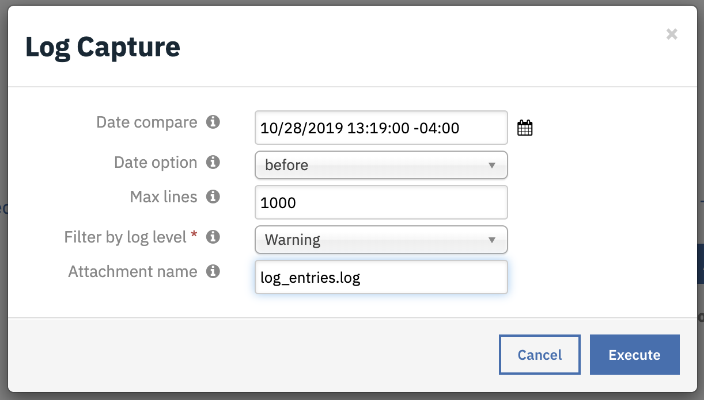

<!--
  This User README.md is generated by running:
  "resilient-circuits docgen -p fn_log_capture --only-user-guide"

  It is best edited using a Text Editor with a Markdown Previewer. VS Code
  is a good example. Checkout https://guides.github.com/features/mastering-markdown/
  for tips on writing with Markdown

  If you make manual edits and run docgen again, a .bak file will be created

  Store any screenshots in the "doc/screenshots" directory and reference them like:
  
-->

# **User Guide:** fn_log_capture_v1.0.0

## Table of Contents
- [Key Features](#key-features)
- [Function - Log Capture](#function---log-capture)
- [Rules](#rules)

---

## Key Features
<!--
  List the Key Features of the Integration
-->

* filter logs by date (`before` or `after` a specified date and time)
* filter logs entries by number of log entries to return (ex. last 1000 lines)
* filter by minimum log level: DEBUG, INFO, WARNING and ERROR

---

## Function - Log Capture
Get the resilient-circuits log, optionally specifying the date, last n lines, or log level

 

<details><summary>Inputs:</summary>
<p>
Use the input fields in any combination. The only requirements is that 'Date compare' and 'Date option' are used together.

| Name | Type | Required | Example | Tooltip |
| ---- | :--: | :------: | ------- | ------- |
| `incident_id` | `number` | Yes | `-` | - |
| `log_attachment_name` | `text` | No | `-` | if empty the file will be resilient-circuits_yyymmdd_hhmms.log |
| `log_capture_date` | `datetimepicker` | No | `-` | Date to start log capture |
| `log_capture_date_option` | `select` | No | before/after | Specify if the date match will be before or after the log timestamp |
| `log_capture_maxlen` | `number` | No | `-` | # of log lines to return from the end or all lines when empty |
| `log_min_level` | `select` | Yes | Debug/Info/Warning/Error | Filter by log levels. DEBUG displays entire log |
| `task_id` | `number` | No | `-` | Used to capture attachment as part of a task |

</p>
</details>

<details><summary>Outputs:</summary>
<p>

```python
results = {
    "success": True/False,
    "content": {
      "attachment_name": "resilient-circuits_20191025_122541.log,
      "num_of_lines": 1000
    },
    "inputs": {
      "log_min_level": {
        "name": "Warning",
        "id": 302
      },
      "log_attachment_name": None,
      "incident_id": 2098,
      "log_capture_maxlen": None,
      "log_capture_date": 1572062400000,
      "log_capture_date_option": {
        "name": "after",
        "id": 254
      }
    },
    "metrics": {
      "version": "1.0",
      "package": "fn-log-capture",
      "package_version": "1.0.0",
      "host": "Marks-MBP.fios-router.home",
      "execution_time_ms": 1359,
      "timestamp": "2019-10-26 09:43:36"
    }
  }
}

}
```

</p>
</details>

<details><summary>Example Pre-Process Script:</summary>
<p>

```python
inputs.log_capture_date = rule.properties.log_capture_date
inputs.log_capture_date_option = rule.properties.log_capture_date_option
inputs.log_capture_maxlen = rule.properties.log_capture_maxlen
inputs.incident_id = incident.id
# uncomment to save attachment to a task
#inputs.task_id = task.id
inputs.log_attachment_name = rule.properties.log_attachment_name
inputs.log_min_level = rule.properties.log_min_level
```

</p>
</details>

<details><summary>Example Post-Process Script:</summary>
<p>

```python
# No script
```

</p>
</details>

---

## Rules
| Rule Name | Object | Workflow Triggered |
| --------- | ------ | ------------------ |
| Log Capture | incident | `log_capture` |

---

## Notes
* The fn_log_capture function can be used with to capture log attachments for a Task. An additional Task level rule and workflow level is required, along with the pre-processing script set to capture the task_id.
* This integration currenly only supports one integration server. Future product changes are needed to support targeting a specific integration server's log file.

<!--
## Inform Resilient Users
  Use this section to optionally provide additional information so that Resilient playbook 
  designer can get the maximum benefit of your integration.
-->