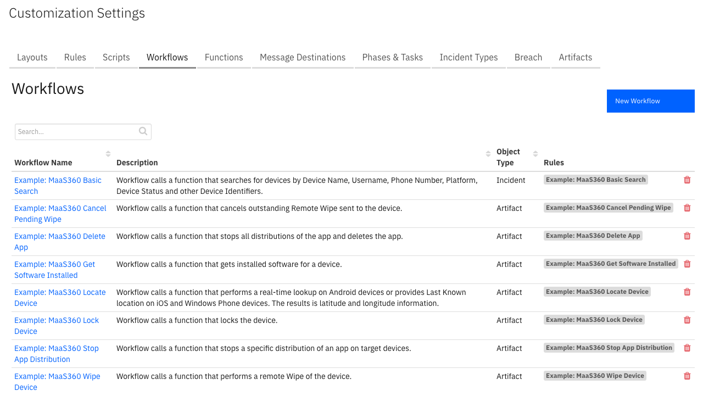
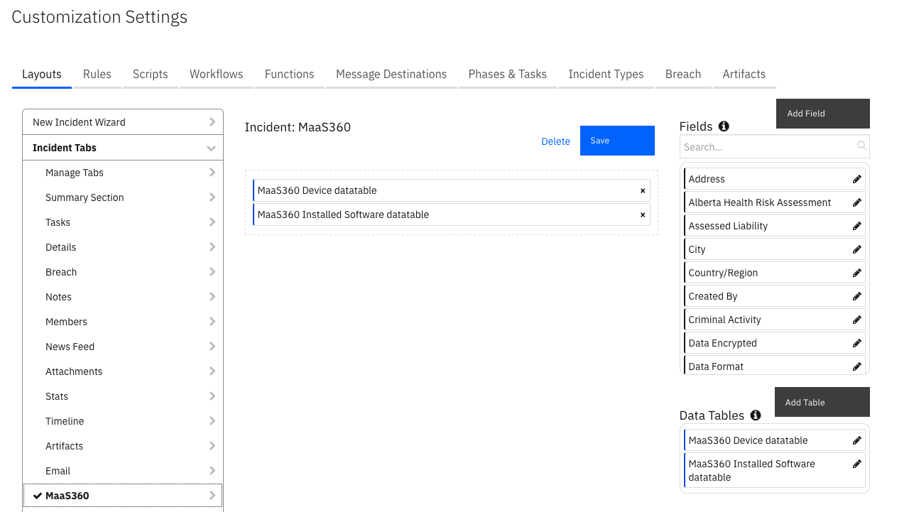
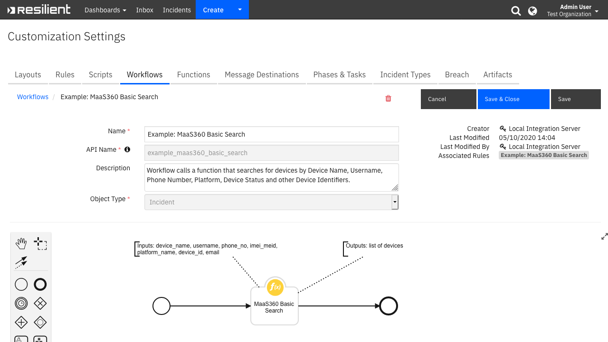
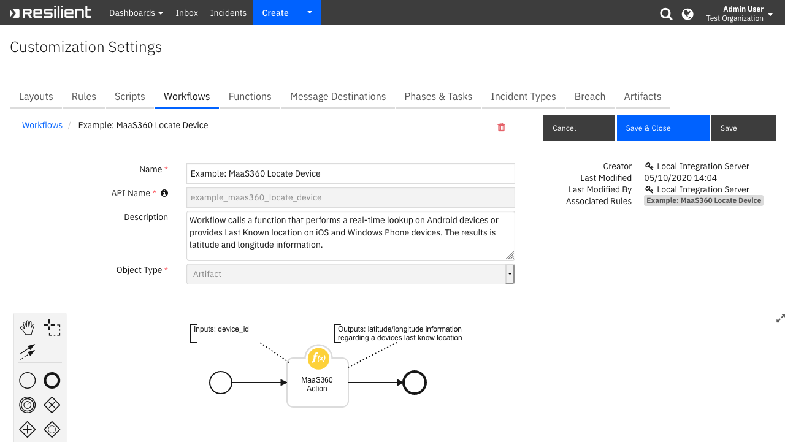
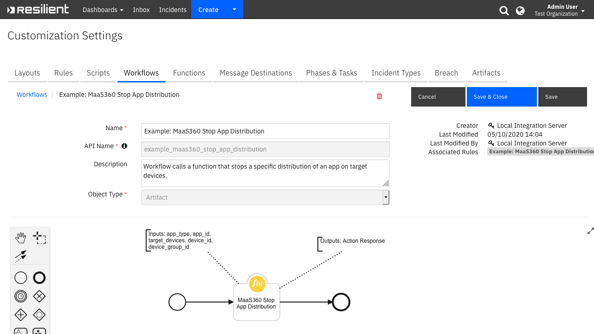

<!--
  This README.md is generated by running:
  "resilient-sdk docgen -p fn_maas360"

  It is best edited using a Text Editor with a Markdown Previewer. VS Code
  is a good example. Checkout https://guides.github.com/features/mastering-markdown/
  for tips on writing with Markdown

  If you make manual edits and run docgen again, a .bak file will be created

  Store any screenshots in the "doc/screenshots" directory and reference them like:
  
-->

# MaaS360 Functions for IBM Resilient

## Table of Contents
- [Release Notes](#release-notes)
- [Overview](#overview)
- [Installation](#installation)
  - [Requirements](#requirements)
  - [Install](#install)
  - [App Configuration](#app-configuration)
  - [Custom Layouts](#custom-layouts)
- [Function - MaaS360 Basic Search](#function---maas360-basic-search)
- [Function - MaaS360 Action](#function---maas360-action)
- [Function - MaaS360 Stop App Distribution](#function---maas360-stop-app-distribution)
- [Function - MaaS360 Delete App](#function---maas360-delete-app)
- [Script - Example: Create Artifact for Device ID](#script---example-create-artifact-for-device-id)
- [Script - Example: Create Artifact for App ID](#script---example-create-artifact-for-app-id)
- [Data Table - MaaS360 Installed Software datatable](#data-table---maas360-installed-software-datatable)
- [Data Table - MaaS360 Device datatable](#data-table---maas360-device-datatable)
- [Custom Artifact Types](#custom-artifact-types)
- [Rules](#rules)
- [Troubleshooting & Support](#troubleshooting-&-support)
---

## Release Notes
<!--
  Specify all changes in this release. Do not remove the release 
  notes of a previous release
-->
### v1.0.1
* Added App Host support

### v1.0.0
* Initial Release

---

## Overview
<!--
  Provide a high-level description of the function itself and its remote software or application.
  The text below is parsed from the "description" and "long_description" attributes in the setup.py file
-->
**This package enables Mobile Device Management (MDM) actions from IBM Resilient.**

 


The MaaS360 function package enables users to perform the following Mobile Device Management (MDM) actions:<br>

- Basic device search.<br>

- Get a list of software and versions installed ona device.<br>

- Locate a device.<br>

- Lock a device.<br>

- Wipe a device.<br>

- Cancel a pending wipe.<br>

- Stop app distribution across specific target devices.<br>

- Delete an app from the MaaS360 catalog.

---

## Installation

### Requirements
<!--
  List any Requirements 
-->
* Resilient platform >= `v35.0.0`
* App Host >= `v1.2.132` (if using App Host)
  * To setup up an App Host see:  [ibm.biz/res-app-host-setup](https://ibm.biz/res-app-host-setup)
* An Integration Server running `resilient_circuits>=35.0.0` (if using an Integration Server)
  * To set up an Integration Server see: [ibm.biz/res-int-server-guide](https://ibm.biz/res-int-server-guide)
  * If using an API key account, minimum required permissions are:
    | Name | Permissions |
    | ---- | ----------- |
    | Org Data | Read |
    | Function | Read |
* Proxy supported: Yes

---

### Install
* To install or uninstall an App using the App Host see [ibm.biz/res-install-app](https://ibm.biz/res-install-app)

* To install or uninstall an Integration using the Integration Server see the [ibm.biz/res-install-int](https://ibm.biz/res-install-int)
---

### App Configuration
The following table describes the settings you need to configure in the app.config file. If using App Host, see the Resilient System Administrator Guide. If using the integration server, see the Integration Server Guide.

| Config | Required | Example | Description |
| ------ | :------: | ------- | ----------- |
| **maas360_host_url** | Yes | `https://xxxx.maas360.com` | The URL of your MaaS360 instance |
| **maas360_billing_id** | Yes | `30000001` | The billing or account ID for your MaaS360 Account |
| **maas360_platform_id** | Yes | `2` | The platform ID of your MaaS360 instance. Can be seen when you create an Access Key |
| **maas360_app_id** | Yes | `30000001_QS1Uuu5` | The App ID of the Access Key. For help on managing Access Keys for your MaaS360 instance refer to www.ibm.com/support/knowledgecenter/ |
| **maas360_app_version** | Yes | `1.0` | The App Version when creating the Access Key. *Generally `1`* |
| **maas360_app_access_key** | Yes | `Gjxdrwyw008` | The Access Key |
| **maas360_username** | Yes | `username` | The username used to login to the MaaS360 instance |
| **maas360_password** | Yes | `password` | The password for the account used to login to the MaaS360 instance|
| **maas360_request_timeout** | No | `60` | The number of seconds to timeout after making a request to MaaS360. If you are seeing read `timeout=30` error you can override the timeout value |
| **maas360_basic_search_page_size** | Yes | `25` | Limit number of devices returned at one time. Allowed page sizes: 25, 50, 100, 200, 250. Default value: 250 |
| **maas360_basic_search_match** | No | `0` | When set to `0` (Default) indicates Partial match for Device Name, Username, Phone Number. When set to `1` indicates Exact match. |
| **maas360_basic_search_sort_attribute** | No | `lastReported` | Sort attribute. Possible values: `lastReported` (Default) or `installedDate` |
| **maas360_basic_search_sort_order** | No | `dsc` | Sort Order. Possible values: `asc` or `dsc` (Default) |
| **maas360_wipe_device_notify_me** | Yes | `Yes` | Whether to notify the administrator on successful device wipe. `yes` value enables this flag |
| **maas360_wipe_device_notify_user** | Yes | `No` | Whether to notify the user on successful device wipe. `yes` value enables this flag. |
| **maas360_wipe_device_notify_others** | Yes | `example1@example.com, example2@example.com` | Comma separated list of other email addresses to notify on successful device wipe |

---

### Custom Layouts
<!--
  Use this section to provide guidance on where the user should add any custom fields and data tables.
  You may wish to recommend a new incident tab.
  You should save a screenshot "custom_layouts.png" in the doc/screenshots directory and reference it here
-->
* A new incident tab is needed in the Layouts section of the Resilient platform to contain two custom data tables like the screenshot below:

  

---
## Function - MaaS360 Basic Search
Function searches for devices by Device Name, Username, Phone Number, Platform, Device Status and other Device Identifiers.

 

<details><summary>Inputs:</summary>
<p>

| Name | Type | Required | Example | Tooltip |
| ---- | :--: | :------: | ------- | ------- |
| `maas360_device_id` | `text` | No | `ApplD8DTH6RCIH86` | Full MaaS360 Device ID string that needs to be searched for |
| `maas360_email` | `text` | No | `jane@example.com` | Full Email address string that needs to be searched for |
| `maas360_imei_meid` | `text` | No | `460272187173695` | Full IMEI or MEID of the device |
| `maas360_partial_device_name` | `text` | No | `Jane's iPhone` | Partial (Starts with) or full Device Name string that needs to be searched for |
| `maas360_partial_phone_no` | `text` | No | `+16175000000` | Partial (Starts with) or full Phone Number that needs to be searched for |
| `maas360_partial_username` | `text` | No | `jane@example.com` | Partial (Starts with) or full Username string that needs to be searched for |
| `maas360_platform_name` | `select` | No | `-` | Windows, Mac, iOS, BlackBerry, Android, Windows Mobile, Symbian, Windows Phone 7, Others |

</p>
</details>

<details><summary>Outputs:</summary>
<p>

```python
results = {
    "content": {
        "count": 1,
        "device": {
            "appComplianceState": "In Compliance",
            "customAssetNumber": "",
            "deviceName": "dummy_device@gmail.com-STV100-1",
            "deviceOwner": "",
            "deviceStatus": "Active",
            "deviceType": "Smartphone",
            "emailAddress": "dummy_device@gmail.com",
            "encryptionStatus": "Encryption Complete",
            "firstRegisteredInEpochms": 1549629133338,
            "imeiEsn": 351623070066166,
            "installedDate": "2019-02-08T12:32:13",
            "installedDateInEpochms": 1549629133338,
            "isSupervisedDevice": False,
            "jailbreakStatus": "No",
            "lastMdmRegisteredInEpochms": 1549629133378,
            "lastRegisteredInEpochms": 1549629133338,
            "lastReported": "2019-04-23T16:11:23",
            "lastReportedInEpochms": 1556035883843,
            "maas360DeviceID": "Androiddeviceid",
            "maas360ManagedStatus": "Enrolled",
            "mailboxDeviceId": "",
            "mailboxLastReported": "",
            "mailboxLastReportedInEpochms": "",
            "mailboxManaged": "",
            "manufacturer": "blackberry",
            "mdmMailboxDeviceId": "",
            "model": "STV100-1",
            "osName": "Android 6.0.1 (MMB29M)",
            "osServicePack": "",
            "osVersion": "6.0.1",
            "ownership": "Corporate Owned",
            "passcodeCompliance": "Compliant",
            "phoneNumber": "",
            "platformName": "Android",
            "policyComplianceState": "In Compliance",
            "ruleComplianceState": "",
            "selectiveWipeStatus": "N/a",
            "sourceID": 1,
            "testDevice": False,
            "udid": "Androiddeviceid",
            "unifiedTravelerDeviceId": "Androiddeviceid",
            "userDomain": "gmail.com",
            "username": "dummy_device@gmail.com",
            "wifiMacAddress": "a4:e4:b8:73:a1:93"
        },
        "pageNumber": 1,
        "pageSize": 1
    },
    "inputs": {
        "maas360_device_id": "Androiddeviceid",
        "maas360_email": None,
        "maas360_imei_meid": None,
        "maas360_partial_device_name": None,
        "maas360_partial_phone_no": None,
        "maas360_partial_username": None,
        "maas360_platform_name": None
    },
    "metrics": {
        "execution_time_ms": 9864,
        "host": "host",
        "package": "fn-maas360",
        "package_version": "1.0.0",
        "timestamp": "2019-05-13 13:21:40",
        "version": "1.0"
    },
    "raw": "raw_json_string",
    "reason": None,
    "success": True,
    "version": "1.0"
}
```

</p>
</details>

<details><summary>Workflows</summary>

  <details><summary>Example Pre-Process Script:</summary>
  <p>

  ```python
  inputs.maas360_device_id = rule.properties.maas360_rule_device_id if rule.properties.maas360_rule_device_id is not None else inputs.maas360_device_id
inputs.maas360_partial_device_name = rule.properties.maas360_rule_device_name if rule.properties.maas360_rule_device_name is not None else inputs.maas360_partial_device_name
inputs.maas360_email = rule.properties.maas360_rule_email if rule.properties.maas360_rule_email is not None else inputs.maas360_email
inputs.maas360_imei_meid = rule.properties.maas360_rule_imei_meid if rule.properties.maas360_rule_imei_meid is not None else inputs.maas360_imei_meid
inputs.maas360_partial_phone_no = rule.properties.maas360_rule_phone_no if rule.properties.maas360_rule_phone_no is not None else inputs.maas360_partial_phone_no
inputs.maas360_platform_name = rule.properties.maas360_rule_platform_name if rule.properties.maas360_rule_platform_name is not None else inputs.maas360_platform_name
inputs.maas360_partial_username = rule.properties.maas360_rule_username if rule.properties.maas360_rule_username is not None else inputs.maas360_partial_username
  ```

  </p>
  </details>

  <details><summary>Example Post-Process Script:</summary>
  <p>

  ```python
  from java.util import Date

def add_row(device):
  device_dt = incident.addRow("maas360_device_dt")
  device_dt.maas360_timestamp = Date()
  device_dt.maas360_deviceid = device.get("maas360DeviceID")
  device_dt.maas360_devicename = device.get("deviceName")
  device_dt.maas360_username = device.get("username")
  device_dt.maas360_platformname = device.get("platformName")
  device_dt.maas360_devicetype = device.get("deviceType")
  device_dt.maas360_lastreported = device.get("lastReported")
  device_dt.maas360_devicestatus = device.get("deviceStatus")

# Print empty string instead of None
def string_value(value):
  return value if value is not None else ""

def add_results_note(inputs, number_devices_found):
  noteText = u"""{} device/s found in MaaS360 database with search parameters: 
    - partialDeviceName: '{}' 
    - partialUsername: '{}'
    - partialPhoneNumber: '{}'
    - imeiMeid: '{}'
    - platformName: '{}'
    - maas360DeviceId: '{}'
    - email: '{}'""".format(
      number_devices_found,
      string_value(inputs.get("maas360_partial_device_name")), 
      string_value(inputs.get("maas360_partial_username")), 
      string_value(inputs.get("maas360_partial_phone_no")), 
      string_value(inputs.get("maas360_imei_meid")),
      string_value(inputs.get("maas360_platform_name").get("name")) if inputs.get("maas360_platform_name") else "",
      string_value(inputs.get("maas360_device_id")),
      string_value(inputs.get("maas360_email"))
      )
  incident.addNote(noteText)

########################
# Mainline starts here #
########################

if results and results.get("success"):
  count = 0
  content = results.get("content")
  if content:
    count = content.get("count")
    if count > 0:
      # Add a row for each Device found
      devices_list = [content.get("device")] if count == 1 else content.get("device")
      map(lambda device: add_row(device), devices_list)
  
  # Write results to a Note
  inputs = results.get("inputs")
  add_results_note(inputs, count)
  ```

  </p>
  </details>

</details>

---

## Function - MaaS360 Action
MaaS360 Function performs different actions based on the chosen Menu Item Rule.

Available actions are: 
- Locate Device
- Get Software Installed
- Lock Device 
- Wipe Device 
- Cancel Pending Wipe

 

<details><summary>Inputs:</summary>
<p>

| Name | Type | Required | Example | Tooltip |
| ---- | :--: | :------: | ------- | ------- |
| `maas360_action_type` | `select` | Yes | `-` | Action Type field is automatically set based on the chosen Workflow action. |
| `maas360_device_id` | `text` | No | `ApplD8DTH6RCIH86` | Full MaaS360 Device ID string that needs to be searched for |

</p>
</details>

### MaaS360 Action - Locate Device

<details><summary>Outputs:</summary>
<p>

```python
results = {
    "content": {
        "actionStatus": 0,
        "description": "The action was executed successfully on the device.",
        "latitude": 25.005112,
        "locatedTime": "2019-05-13 17:45:12.0",
        "longitude": 121.541535,
        "maas360DeviceID": "deviceid"
    },
    "inputs": {
        "maas360_action_type": {
            "id": 202,
            "name": "Locate Device"
        },
        "maas360_device_id": "deviceid"
    },
    "metrics": {
        "execution_time_ms": 951,
        "host": "host",
        "package": "fn-maas360",
        "package_version": "1.0.0",
        "timestamp": "2019-05-13 15:18:51",
        "version": "1.0"
    },
    "raw": "raw_json_string",
    "reason": None,
    "success": True,
    "version": "1.0"
}
```

</p>
</details>

<details><summary>Example Pre-Process Script:</summary>
<p>

```python
inputs.maas360_device_id = artifact.value
```

</p>
</details>

<details><summary>Example Post-Process Script:</summary>
<p>

```python
########################
# Mainline starts here #
########################

if results and results.get("success"):
  content = results.get("content")
  if content:
    latitude = content.get("latitude")
    longitude = content.get("longitude")
    device_id = content.get("maas360DeviceID")
    
    if latitude and longitude:
      noteText = u"Current or last know location for Device ID {} is {} latitude, {} longitude.".format(device_id, latitude, longitude)
      incident.addNote(noteText)
    else:
      noteText = u"There is no current or last know location available for Device ID {}.".format(device_id)
      incident.addNote(noteText)
```

</p>
</details>

### MaaS360 Action - Get Software Installed

<details><summary>Outputs:</summary>
<p>

```python
results = {
    "content": {
        "deviceSw": [
            {
                "swAttrs": [
                    {
                        "key": "Application ID",
                        "type": "string",
                        "value": "com.fiberlink.maas360forios"
                    },
                    {
                        "key": "Version",
                        "type": "string",
                        "value": 3.70.111
                    },
                    {
                        "key": "AppDataSize",
                        "type": "string",
                        "value": 3.79
                    },
                    {
                        "key": "File Size",
                        "type": "string",
                        "value": 175.18
                    },
                    {
                        "key": "Installed by MDM",
                        "type": "string",
                        "value": "Manage Status"
                    }
                ],
                "swName": "MaaS360"
            },
            {
                "swAttrs": [
                    {
                        "key": "Application ID",
                        "type": "string",
                        "value": "com.blackberry.ddt.bugreporter"
                    },
                    {
                        "key": "Version",
                        "type": "string",
                        "value": 1
                    },
                    {
                        "key": "AppDataSize",
                        "type": "string",
                        "value": 0
                    },
                    {
                        "key": "File Size",
                        "type": "string",
                        "value": 0
                    },
                    {
                        "key": "Install Location",
                        "type": "string",
                        "value": "Internal"
                    }
                ],
                "swName": "BlackBerry Bug Reporter"
            }
        ],
        "lastSoftwareDataRefreshDate": "2019-04-18T00:13:07",
        "maas360DeviceID": "deviceid"
    },
    "inputs": {
        "maas360_action_type": {
            "id": 201,
            "name": "Get Software Installed"
        },
        "maas360_device_id": "deviceid"
    },
    "metrics": {
        "execution_time_ms": 13019,
        "host": "host",
        "package": "fn-maas360",
        "package_version": "1.0.0",
        "timestamp": "2019-05-13 13:48:43",
        "version": "1.0"
    },
    "raw": "raw_json_string",
    "reason": None,
    "success": True,
    "version": "1.0"
}
```

</p>
</details>

<details><summary>Example Pre-Process Script:</summary>
<p>

```python
inputs.maas360_device_id = artifact.value
```

</p>
</details>

<details><summary>Example Post-Process Script:</summary>
<p>

```python
from java.util import Date

def add_row(device_id, app_Name, app_version, app_id, refresh_date):
  app_dt = incident.addRow("maas360_installed_software_datatable")
  app_dt.maas360_app_timestamp = Date()
  app_dt.maas360_app_device_id = device_id
  app_dt.maas360_app_app_name = app_Name
  app_dt.maas360_app_app_version = app_version
  app_dt.maas360_app_app_id = app_id
  app_dt.maas360_app_lastSoftwareDataRefreshDate = refresh_date
  
########################
# Mainline starts here #
########################

if results and results.get("success"):
  content = results.get("content")
  if content:
    device_id = content.get("maas360DeviceID")
    refresh_date = content.get("lastSoftwareDataRefreshDate")
    
    found_apps = False
    apps = content.get("deviceSw")
    if apps:
      for app in apps:
        if app:
          app_Name = app.get("swName")
          app_attrs = app.get("swAttrs")
          if app_Name and app_attrs:
            app_version_attr = filter(lambda att: att["key"] == 'Version', app_attrs)
            # filter returns a list [{u'type': u'string', u'key': u'Version', u'value': u'3.70.111'}]
            app_version = str(app_version_attr[0].get("value")) if app_version_attr else "N/A" 
            
            app_app_id_attr = filter(lambda att: att["key"] == 'Application ID', app_attrs)
            # filter returns a list [{u'type': u'string', u'key': u'Application ID', u'value': u'com.fiberlink.maas360forios'}]
            app_id = app_app_id_attr[0].get("value") if app_app_id_attr else "N/A" 
              
            # write results in the app datatable
            add_row(device_id, app_Name, app_version, app_id, refresh_date)
            found_apps = True
            
  if found_apps:
    noteText = u"Installed software was found for the Device ID {} and saved in the MaaS360 Installed Software datatable".format(device_id)
    incident.addNote(noteText)
  else:
    noteText = u"No installed software found for the Device ID {}".format(device_id)
    incident.addNote(noteText)
```

</p>
</details>

### MaaS360 Action - Lock Device

<details><summary>Outputs:</summary>
<p>

```python
results = {
    "content": {
        "actionID": 128294549,
        "actionStatus": 0,
        "description": "The action was executed successfully on the device.",
        "maas360DeviceID": "deviceid"
    },
    "inputs": {
        "maas360_action_type": {
            "id": 203,
            "name": "Lock Device"
        },
        "maas360_device_id": "deviceid"
    },
    "metrics": {
        "execution_time_ms": 558,
        "host": "host",
        "package": "fn-maas360",
        "package_version": "1.0.0",
        "timestamp": "2019-05-13 15:27:03",
        "version": "1.0"
    },
    "raw": "raw_json_string",
    "reason": None,
    "success": True,
    "version": "1.0"
}
```

</p>
</details>

<details><summary>Example Pre-Process Script:</summary>
<p>

```python
inputs.maas360_device_id = artifact.value
```

</p>
</details>

<details><summary>Example Post-Process Script:</summary>
<p>

```python
########################
# Mainline starts here #
########################

if results and results.get("success"):
  content = results.get("content")
  if content:
    noteText = u"Lock Device for Device ID: {}. {}".format(content.get("maas360DeviceID"), content.get("description"))
    incident.addNote(noteText)
```

</p>
</details>

### MaaS360 Action - Wipe Device

<details><summary>Outputs:</summary>
<p>

```python
results = {
    "content": {
        "actionID": 128294800,
        "actionStatus": 0,
        "description": "The action was executed successfully on the device.",
        "maas360DeviceID": "deviceid"
    },
    "inputs": {
        "maas360_action_type": {
            "id": 205,
            "name": "Cancel Pending Wipe"
        },
        "maas360_device_id": "deviceid"
    },
    "metrics": {
        "execution_time_ms": 915,
        "host": "host",
        "package": "fn-maas360",
        "package_version": "1.0.0",
        "timestamp": "2019-05-13 15:30:52",
        "version": "1.0"
    },
    "raw": "raw_json_string",
    "reason": None,
    "success": True,
    "version": "1.0"
}
```

</p>
</details>

<details><summary>Example Pre-Process Script:</summary>
<p>

```python
inputs.maas360_device_id = artifact.value
```

</p>
</details>

<details><summary>Example Post-Process Script:</summary>
<p>

```python
########################
# Mainline starts here #
########################

if results and results.get("success"):
  content = results.get("content")
  if content:
    noteText = u"Cancel Pending Wipe for Device ID: {}. {}".format(content.get("maas360DeviceID"), content.get("description"))
    incident.addNote(noteText)
```

</p>
</details>

---
## Function - MaaS360 Stop App Distribution
Function stops a specific distribution of an app on target devices.

 

<details><summary>Inputs:</summary>
<p>

| Name | Type | Required | Example | Tooltip |
| ---- | :--: | :------: | ------- | ------- |
| `maas360_app_id` | `text` | No | `com.fiberlink.maas360forios` | Unique ID of the application |
| `maas360_app_type` | `select` | Yes | `-` | Type of the app |
| `maas360_device_group_id` | `text` | No | `-` | MaaS360 Device Group ID |
| `maas360_device_id` | `text` | No | `ApplD8DTH6RCIH86` | Full MaaS360 Device ID string that needs to be searched for |
| `maas360_target_devices` | `select` | Yes | `-` | Target Devices |

</p>
</details>

<details><summary>Outputs:</summary>
<p>

```python
results = {
    "content": {
        "description": "Distribution stopped successfully.",
        "status": "Success"
    },
    "inputs": {
        "maas360_app_id": "com.some.app",
        "maas360_app_type": {
            "id": 250,
            "name": "iOS Enterprise Application"
        },
        "maas360_device_group_id": None,
        "maas360_device_id": " deviceid",
        "maas360_target_devices": {
            "id": 352,
            "name": "Specific Device"
        }
    },
    "metrics": {
        "execution_time_ms": 11353,
        "host": "host",
        "package": "fn-maas360",
        "package_version": "1.0.0",
        "timestamp": "2019-05-16 10:23:59",
        "version": "1.0"
    },
    "raw": "{\"status\": \"Success\", \"description\": \"Distribution stopped successfully.\"}",
    "reason": None,
    "success": True,
    "version": "1.0"
}
```

</p>
</details>

<details><summary>Workflows</summary>

  <details><summary>Example Pre-Process Script:</summary>
  <p>

  ```python
  inputs.maas360_app_type = rule.properties.maas360_rule_app_type if rule.properties.maas360_rule_app_type is not None else inputs.maas360_app_type
inputs.maas360_app_id = artifact.value
inputs.maas360_target_devices = rule.properties.maas360_target_devices if rule.properties.maas360_target_devices is not None else inputs.maas360_target_devices
inputs.maas360_device_id = rule.properties.maas360_rule_device_id if rule.properties.maas360_rule_device_id is not None else inputs.maas360_device_id
inputs.maas360_device_group_id = rule.properties.maas360_device_group_id if rule.properties.maas360_device_group_id is not None else inputs.maas360_device_group_id
  ```

  </p>
  </details>

  <details><summary>Example Post-Process Script:</summary>
  <p>

  ```python
  # Print empty string instead of None
def string_value(value):
  return value if value is not None else ""
  
def add_results_note(inputs, response_desc):
  noteText = u"""Stop App Distribution - {} for input params: 
    - appId: '{}' 
    - appType: '{}'
    - targetDevices: '{}'
    - deviceId: '{}'
    - deviceGroupId: '{}'.""".format(
      response_desc,
      inputs.get("maas360_app_id"), 
      inputs.get("maas360_app_type").name, 
      inputs.get("maas360_target_devices").name, 
      string_value(inputs.get("maas360_device_id")),
      string_value(inputs.get("maas360_device_group_id"))
      )
  incident.addNote(noteText)
  
########################
# Mainline starts here #
########################

if results and results.get("success"):
  content = results.get("content")
  if content:
    # Write results to a Note
    inputs = results.get("inputs")
    add_results_note(inputs, content.get("description"))
  ```

  </p>
  </details>

</details>

---

## Function - MaaS360 Delete App
Function stops all distributions of the app and deletes the app.

 

<details><summary>Inputs:</summary>
<p>

| Name | Type | Required | Example | Tooltip |
| ---- | :--: | :------: | ------- | ------- |
| `maas360_app_id` | `text` | No | `com.fiberlink.maas360forios` | Unique ID of the application |
| `maas360_app_type` | `select` | Yes | `-` | Type of the app |

</p>
</details>

<details><summary>Outputs:</summary>
<p>

```python
results = {
    "content": {
        "description": "Application deleted successfully.",
        "status": "Success"
    },
    "inputs": {
        "maas360_app_id": "com.some.app",
        "maas360_app_type": {
            "id": 251,
            "name": "iOS App Store Application"
        }
    },
    "metrics": {
        "execution_time_ms": 16402,
        "host": "host",
        "package": "fn-maas360",
        "package_version": "1.0.0",
        "timestamp": "2019-05-16 10:34:50",
        "version": "1.0"
    },
    "raw": "{\"status\": \"Success\", \"description\": \"Application deleted successfully.\"}",
    "reason": None,
    "success": True,
    "version": "1.0"
}
```

</p>
</details>

<details><summary>Workflows</summary>

  <details><summary>Example Pre-Process Script:</summary>
  <p>

  ```python
  inputs.maas360_app_type = rule.properties.maas360_rule_app_type if rule.properties.maas360_rule_app_type is not None else inputs.maas360_app_type
inputs.maas360_app_id = artifact.value
  ```

  </p>
  </details>

  <details><summary>Example Post-Process Script:</summary>
  <p>

  ```python
  # Print empty string instead of None
def string_value(value):
  return value if value is not None else ""
  
def add_results_note(inputs, response_desc):
  noteText = u"""Delete App - {} for input params: 
    - appId: '{}' 
    - appType: '{}'""".format(
      response_desc,
      inputs.get("maas360_app_id"), 
      inputs.get("maas360_app_type").name
      )
  incident.addNote(noteText)
  
########################
# Mainline starts here #
########################

if results and results.get("success"):
  content = results.get("content")
  if content:
    # Write results to a Note
    inputs = results.get("inputs")
    add_results_note(inputs, content.get("description"))
  ```

  </p>
  </details>

</details>

---

## Script - Example: Create Artifact for Device ID
Script creates an Artifact for MaaS360 Device ID value based on the selected MaaS360 Device datatable row.

**Object:** maas360_device_dt

<details><summary>Script Text:</summary>
<p>

```python
# Create an Artifact for MaaS360 Device ID value based on the selected MaaS360 Device datatable row.

# Artifact description
artifact_description = u"""Created by MaaS360 Basic Search results for Device Name '{}', Username '{}', Platform name '{}', Device Type '{}'""".format(
  row.maas360_devicename,
  row.maas360_username,
  row.maas360_platformname,
  row.maas360_devicetype)

# Artifact type
artifact_type = "maas360_device_id"

# Artifact value
artifact_value = row.maas360_deviceid

# Create an Artifact
if artifact_value:
  incident.addArtifact(artifact_type, artifact_value, artifact_description)

```

</p>
</details>

---
## Script - Example: Create Artifact for App ID
Script creates an Artifact for MaaS360 App ID value based on the selected MaaS360 Installed Software datatable row.

**Object:** maas360_installed_software_datatable

<details><summary>Script Text:</summary>
<p>

```python
# Create an Artifact for MaaS360 App ID value based on the selected MaaS360 Installed Software datatable row.

# Artifact description
artifact_description = u"""Created by MaaS360 Get Software Installed results for Device ID '{}', App Name '{}', App Version '{}'""".format(
  row.maas360_app_device_id,
  row.maas360_app_app_name,
  row.maas360_app_app_version)

# Artifact type
artifact_type = "maas360_app_id"

# Artifact value
artifact_value = row.maas360_app_app_id

# Create an Artifact
if artifact_value:
  incident.addArtifact(artifact_type, artifact_value, artifact_description)

```

</p>
</details>

---

## Data Table - MaaS360 Installed Software datatable

 

#### API Name:
maas360_installed_software_datatable

#### Columns:
| Column Name | API Access Name | Type | Tooltip |
| ----------- | --------------- | ---- | ------- |
| App ID | `maas360_app_app_id` | `text` | - |
| App Name | `maas360_app_app_name` | `text` | - |
| App Version | `maas360_app_app_version` | `text` | - |
| Device ID | `maas360_app_device_id` | `text` | - |
| Last Data Refresh Date | `maas360_app_lastSoftwareDataRefreshDate` | `text` | - |
| Timestamp | `maas360_app_timestamp` | `datetimepicker` | - |

---
## Data Table - MaaS360 Device datatable

 

#### API Name:
maas360_device_dt

#### Columns:
| Column Name | API Access Name | Type | Tooltip |
| ----------- | --------------- | ---- | ------- |
| Device ID | `maas360_deviceid` | `text` | - |
| Device Name | `maas360_devicename` | `text` | - |
| Device Status | `maas360_devicestatus` | `text` | - |
| Device Type | `maas360_devicetype` | `text` | - |
| Last Reported | `maas360_lastreported` | `text` | - |
| Platform Name | `maas360_platformname` | `text` | - |
| Timestamp | `maas360_timestamp` | `datetimepicker` | - |
| Username | `maas360_username` | `text` | - |

---


## Custom Artifact Types
| Display Name | API Access Name | Description |
| ------------ | --------------- | ----------- |
| MaaS360 App Id | `maas360_app_id` | Unique ID of the application |
| MaaS360 Device Id | `maas360_device_id` | MaaS360 Device ID string |

---

## Rules
| Rule Name | Object | Workflow/Script Triggered |
| --------- | ------ | ------------------ |
| Example: MaaS360 Lock Device | artifact | `example_maas360_lock_device` |
| Example: MaaS360 Cancel Pending Wipe | artifact | `example_maas360_cancel_pending_wipe` |
| Example: MaaS360 Basic Search | incident | `example_maas360_basic_search` |
| Example: MaaS360 Get Software Installed | artifact | `example_maas360_get_software_installed` |
| Example: MaaS360 Stop App Distribution | artifact | `example_maas360_stop_app_distribution` |
| Example: Create Artifact for Device ID | maas360_device_dt | `"Example: Create Artifact for Device ID"` |
| Example: MaaS360 Locate Device | artifact | `example_maas360_locate_device` |
| Example: MaaS360 Delete App | artifact | `example_maas360_delete_app` |
| Example: MaaS360 Wipe Device | artifact | `example_maas360_wipe_device` |
| Example: Create Artifact for App ID | maas360_installed_software_datatable | `"Example: Create Artifact for App ID"` |

---

## Troubleshooting & Support
If using the app with an App Host, see the Resilient System Administrator Guide and the App Host Deployment Guide for troubleshooting procedures. You can find these guides on the [IBM Knowledge Center](https://www.ibm.com/support/knowledgecenter/SSBRUQ), where you can select which version of the Resilient platform you are using.

If using the app with an integration server, see the [Integration Server Guide](https://ibm.biz/res-int-server-guide)

### For Support
This is an IBM Supported app. Please search https://ibm.com/mysupport for assistance.
