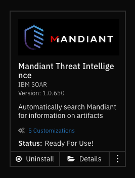

<!--
  This README.md is generated by running:
  "resilient-sdk docgen -p fn_mandiant"

  This file was generated with resilient-sdk v50.0.151

  It is best edited using a Text Editor with a Markdown Previewer. VS Code
  is a good example. Checkout https://guides.github.com/features/mastering-markdown/
  for tips on writing with Markdown

  All fields followed by "::CHANGE_ME::"" should be manually edited

  If you make manual edits and run docgen again, a .bak file will be created

  Store any screenshots in the "doc/screenshots" directory and reference them like:
  

  NOTE: If your app is available in the container-format only, there is no need to mention the integration server in this readme.
-->

# Mandiant Integraiton for QRadar Soar  <!-- omit in toc -->

## Table of Contents <!-- omit in toc -->
- [Release Notes](#release-notes)
- [Overview](#overview)
  - [Supported Artifacts](#supported-artifacts)
  - [Key Features](#key-features)
- [Requirements](#requirements)
  - [SOAR platform](#soar-platform)
  - [Cloud Pak for Security](#cloud-pak-for-security)
  - [Proxy Server](#proxy-server)
  - [Python Environment](#python-environment)
  - [Development Version](#development-version)
  - [Endpoint Configuration](#endpoint-configuration)
- [Installation](#installation)
  - [Install](#install)
  - [App Configuration](#app-configuration)
- [Function - Mandiant: Threat Intelligence](#function---mandiant-threat-intelligence)
- [Playbooks](#playbooks)
- [Troubleshooting \& Support](#troubleshooting--support)
  - [For Support](#for-support)

---

## Release Notes
| Version | Date | Notes |
| ------- | ---- | ----- |
| 1.0.0 | 10/2023 | Automatically search Mandiant for information on certain artifact types |

---

## Overview

<p align="center">

</p>

**Automatically search Mandiant for information on artifacts** \
Investigate publicly known threats with insights from Mandiant. Upon artifact creation, the application is shipped with a disabled playbook which when activated, automatically scans Mandiant for any related information.

### Supported Artifacts
* URLs
* Domain names
* Ip addresses
* md5 hashes

### Key Features
* All enrichment information is displayed as Hits in the artifact section.
* Retrieves a MScore.
* Gathers MISP related information.
* Identifies other sources or similar candidates.
* Generates a verdict by gathering information on various analysis performed on the artifact.

<p align="center">

</p>

---

## Requirements
This app supports the IBM Security QRadar SOAR Platform and the IBM Security QRadar SOAR for IBM Cloud Pak for Security.

### SOAR platform
The SOAR platform supports two app deployment mechanisms, Edge Gateway (formerly App Host) and integration server.

If deploying to a SOAR platform with an Edge Gateway, the requirements are:
* SOAR platform >= `46.0.8131`.
* The app is in a container-based format (available from the AppExchange as a `zip` file).

If deploying to a SOAR platform with an integration server, the requirements are:
* SOAR platform >= `46.0.8131`.
* The app is in the older integration format (available from the AppExchange as a `zip` file which contains a `tar.gz` file).
* Integration server is running `resilient-circuits>=49.1.0`.
* If using an API key account, make sure the account provides the following minimum permissions: 
  | Name | Permissions |
  | ---- | ----------- |
  | Org Data | Read |
  | Function | Read |

The following SOAR platform guides provide additional information: 
* _Edge Gateway Deployment Guide_ or _App Host Deployment Guide_: provides installation, configuration, and troubleshooting information, including proxy server settings. 
* _Integration Server Guide_: provides installation, configuration, and troubleshooting information, including proxy server settings.
* _System Administrator Guide_: provides the procedure to install, configure and deploy apps. 

The above guides are available on the IBM Documentation website at [ibm.biz/soar-docs](https://ibm.biz/soar-docs). On this web page, select your SOAR platform version. On the follow-on page, you can find the _Edge Gateway Deployment Guide_, _App Host Deployment Guide_, or _Integration Server Guide_ by expanding **Apps** in the Table of Contents pane. The System Administrator Guide is available by expanding **System Administrator**.

### Cloud Pak for Security
If you are deploying to IBM Cloud Pak for Security, the requirements are:
* IBM Cloud Pak for Security >= `1.10`.
* Cloud Pak is configured with an Edge Gateway.
* The app is in a container-based format (available from the AppExchange as a `zip` file).

The following Cloud Pak guides provide additional information: 
* _Edge Gateway Deployment Guide_ or _App Host Deployment Guide_: provides installation, configuration, and troubleshooting information, including proxy server settings. From the Table of Contents, select Case Management and Orchestration & Automation > **Orchestration and Automation Apps**.
* _System Administrator Guide_: provides information to install, configure, and deploy apps. From the IBM Cloud Pak for Security IBM Documentation table of contents, select Case Management and Orchestration & Automation > **System administrator**.

These guides are available on the IBM Documentation website at [ibm.biz/cp4s-docs](https://ibm.biz/cp4s-docs). From this web page, select your IBM Cloud Pak for Security version. From the version-specific IBM Documentation page, select Case Management and Orchestration & Automation.

### Proxy Server
The app **does** support a proxy server.

### Python Environment
Python 3.6 and Python 3.9 are supported.
Additional package dependencies may exist for each of these packages:
* resilient-circuits>=49.1.0

### Development Version

This app has been implemented using:
| Product Name | API URL | API Version |
| ------------ | ------- | ----------- |
| Mandiant Threat Intelligence | `https://api.intelligence.mandiant.com` | v4 |

### Endpoint Configuration

This application supports Mandiant's APIV4. No endpoint configuration is required other than the API Key and Secret which can be found in the endpoint user-interface under settings.

---

## Installation

### Install
* To install or uninstall an App or Integration on the _SOAR platform_, see the documentation at [ibm.biz/soar-docs](https://ibm.biz/soar-docs).
* To install or uninstall an App on _IBM Cloud Pak for Security_, see the documentation at [ibm.biz/cp4s-docs](https://ibm.biz/cp4s-docs) and follow the instructions above to navigate to Orchestration and Automation.

### App Configuration
The following table provides the settings you need to configure the app. These settings are made in the app.config file. See the documentation discussed in the Requirements section for the procedure.

| Config | Required | Example | Description |
| ------ | :------: | ------- | ----------- |
| api_key | `Yes` | `7659xxxx29bc6cxxxx` | API key required for authentication |
| api_secret | `Yes` | `6546xxxx29bc6cxxxx` | API secret required for authentication |

---

## Function - Mandiant: Threat Intelligence
Provides customers with intelligence on who is most likely going to attack them, how they are going to attack, and what tools they will use.  This allows customers to prepare their defenses against an imminent attack.

<p align="center">

</p>

<details><summary>Inputs:</summary>
<p>

| Name | Type | Required | Example | Tooltip |
| ---- | :--: | :------: | ------- | ------- |
| `mandiant_artifact_data` | `text` | Yes | `url` | Data from the artifact |
| `mandiant_artifact_type` | `text` | Yes | `www.example.com` | Artifact data type |

</p>
</details>

<details><summary>Outputs:</summary>
<p>

> **NOTE:** This example might be in JSON format, but `results` is a Python Dictionary on the SOAR platform.


```python
results = {
  "version": 2.0,
  "success": true,
  "reason": null,
  "content": {
    "id": "url--30347ecb-ecc0-5d63-a422-2f0aa046d48c",
    "mscore": 99,
    "type": "url",
    "value": "http://achren.org",
    "is_publishable": true,
    "sources": [
      {
        "first_seen": "2020-07-31T00:15:02.614+0000",
        "last_seen": "2020-07-31T00:15:02.614+0000",
        "osint": true,
        "category": [],
        "source_name": "malwaredomainlist"
      }
    ],
    "verdict": {
      "analystVerdict": {
        "timestamp": null,
        "verdict": null,
        "confidenceScore": 0
      },
      "authoritativeVerdict": "mlVerdict",
      "mlVerdict": {
        "confidenceScore": 0.9888736570875306,
        "verdict": "malicious",
        "timestamp": "2022-02-17T22:00:35.914+0000",
        "modelVersion": "6.1.0",
        "reasoning": {
          "malicious_count": 4,
          "source_count": 185,
          "neighbor_influence": null,
          "mandiant": {
            "bp_hosting": {
              "benign_count": 0,
              "confidence": null,
              "malicious_count": 0,
              "name": "Bulletproof Hosting",
              "response_count": 0,
              "source_count": 1
            },
            "fqdn_analysis": {
              "benign_count": 1,
              "confidence": "low",
              "malicious_count": 0,
              "name": "FQDN Analysis",
              "response_count": 1,
              "source_count": 2
            },
            "knowledge_graph": {
              "benign_count": 0,
              "confidence": null,
              "malicious_count": 0,
              "name": "Knowledge Graph",
              "response_count": 0,
              "source_count": 1
            },
            "malware_analysis": {
              "benign_count": 0,
              "confidence": null,
              "malicious_count": 0,
              "name": "Malware Analysis",
              "response_count": 0,
              "source_count": 3
            },
            "name": "Mandiant",
            "spam": {
              "benign_count": 0,
              "confidence": null,
              "malicious_count": 0,
              "name": "Spam Monitoring",
              "response_count": 0,
              "source_count": 1
            },
            "url_analysis": {
              "benign_count": 1,
              "confidence": "low",
              "malicious_count": 0,
              "name": "URL Analysis",
              "response_count": 1,
              "source_count": 4
            }
          },
          "response_count": 6,
          "confidence_count": {
            "benign": {
              "high": 0,
              "low": 2,
              "med": 0
            },
            "malicious": {
              "high": 0,
              "low": 0,
              "med": 4
            }
          },
          "tp": {
            "crowdsource": {
              "benign_count": 0,
              "confidence": "med",
              "malicious_count": 3,
              "name": "Crowdsourced Threat Analysis",
              "response_count": 3,
              "source_count": 91
            },
            "misp": {
              "dch": {
                "benign_count": 0,
                "confidence": null,
                "malicious_count": 0,
                "name": "Dynamic Cloud Hosting (DCH) Provider",
                "response_count": 0,
                "source_count": 9
              },
              "edu": {
                "benign_count": 0,
                "confidence": null,
                "malicious_count": 0,
                "name": "Educational Institution",
                "response_count": 0,
                "source_count": 1
              },
              "name": "MISP",
              "other": {
                "benign_count": 0,
                "confidence": null,
                "malicious_count": 0,
                "name": "Other",
                "response_count": 0,
                "source_count": 14
              },
              "popular_infra": {
                "benign_count": 0,
                "confidence": null,
                "malicious_count": 0,
                "name": "Popular Internet Infrastructure",
                "response_count": 0,
                "source_count": 18
              },
              "popular_web": {
                "benign_count": 0,
                "confidence": null,
                "malicious_count": 0,
                "name": "Popular Website",
                "response_count": 0,
                "source_count": 8
              },
              "sinkhole": {
                "benign_count": 0,
                "confidence": null,
                "malicious_count": 0,
                "name": "Internet Sinkhole",
                "response_count": 0,
                "source_count": 1
              },
              "vpn": {
                "benign_count": 0,
                "confidence": null,
                "malicious_count": 0,
                "name": "Known VPN Hosting Provider",
                "response_count": 0,
                "source_count": 1
              }
            },
            "name": "Third Party",
            "tif": {
              "aa419": {
                "benign_count": 0,
                "confidence": null,
                "malicious_count": 0,
                "name": "Aa419",
                "response_count": 0,
                "source_count": 1
              },
              "azorult-tracker": {
                "benign_count": 0,
                "confidence": null,
                "malicious_count": 0,
                "name": "Azorult-tracker",
                "response_count": 0,
                "source_count": 1
              },
              "benkow": {
                "benign_count": 0,
                "confidence": null,
                "malicious_count": 0,
                "name": "Benkow",
                "response_count": 0,
                "source_count": 1
              },
              "botvrij_urls": {
                "benign_count": 0,
                "confidence": null,
                "malicious_count": 0,
                "name": "Botvrij Urls",
                "response_count": 0,
                "source_count": 1
              },
              "cryptolaemus": {
                "benign_count": 0,
                "confidence": null,
                "malicious_count": 0,
                "name": "Cryptolaemus",
                "response_count": 0,
                "source_count": 1
              },
              "cybercrimetracker": {
                "benign_count": 0,
                "confidence": null,
                "malicious_count": 0,
                "name": "Cybercrimetracker",
                "response_count": 0,
                "source_count": 1
              },
              "davidonzo_hashes": {
                "benign_count": 0,
                "confidence": null,
                "malicious_count": 0,
                "name": "Davidonzo Hashes",
                "response_count": 0,
                "source_count": 1
              },
              "dev": {
                "benign_count": 0,
                "confidence": null,
                "malicious_count": 0,
                "name": "Dev",
                "response_count": 0,
                "source_count": 1
              },
              "digitalside_it_hashes": {
                "benign_count": 0,
                "confidence": null,
                "malicious_count": 0,
                "name": "Digitalside It Hashes",
                "response_count": 0,
                "source_count": 1
              },
              "digitalside_it_urls": {
                "benign_count": 0,
                "confidence": null,
                "malicious_count": 0,
                "name": "Digitalside It Urls",
                "response_count": 0,
                "source_count": 1
              },
              "dyndns_ponmocup": {
                "benign_count": 0,
                "confidence": null,
                "malicious_count": 0,
                "name": "Dyndns Ponmocup",
                "response_count": 0,
                "source_count": 1
              },
              "feodo": {
                "benign_count": 0,
                "confidence": null,
                "malicious_count": 0,
                "name": "Feodo",
                "response_count": 0,
                "source_count": 1
              },
              "feodo_ids": {
                "benign_count": 0,
                "confidence": null,
                "malicious_count": 0,
                "name": "Feodo Ids",
                "response_count": 0,
                "source_count": 1
              },
              "fumik0": {
                "benign_count": 0,
                "confidence": null,
                "malicious_count": 0,
                "name": "Fumik0",
                "response_count": 0,
                "source_count": 1
              },
              "futex.re": {
                "benign_count": 0,
                "confidence": null,
                "malicious_count": 0,
                "name": "Futex.re",
                "response_count": 0,
                "source_count": 1
              },
              "h3x_1day": {
                "benign_count": 0,
                "confidence": null,
                "malicious_count": 0,
                "name": "H3x 1day",
                "response_count": 0,
                "source_count": 1
              },
              "malc0de": {
                "benign_count": 0,
                "confidence": null,
                "malicious_count": 0,
                "name": "Malc0de",
                "response_count": 0,
                "source_count": 1
              },
              "malshare": {
                "benign_count": 0,
                "confidence": null,
                "malicious_count": 0,
                "name": "Malshare",
                "response_count": 0,
                "source_count": 1
              },
              "malwared": {
                "benign_count": 0,
                "confidence": null,
                "malicious_count": 0,
                "name": "Malwared",
                "response_count": 0,
                "source_count": 1
              },
              "malwaredomainlist": {
                "benign_count": 0,
                "confidence": "med",
                "malicious_count": 1,
                "name": "Malwaredomainlist",
                "response_count": 1,
                "source_count": 1
              },
              "malwaremustdie": {
                "benign_count": 0,
                "confidence": null,
                "malicious_count": 0,
                "name": "Malwaremustdie",
                "response_count": 0,
                "source_count": 1
              },
              "name": "Threat Intelligence Feeds",
              "openphish": {
                "benign_count": 0,
                "confidence": null,
                "malicious_count": 0,
                "name": "Openphish",
                "response_count": 0,
                "source_count": 1
              },
              "phishing_database": {
                "benign_count": 0,
                "confidence": null,
                "malicious_count": 0,
                "name": "Phishing Database",
                "response_count": 0,
                "source_count": 1
              },
              "phishstats": {
                "benign_count": 0,
                "confidence": null,
                "malicious_count": 0,
                "name": "Phishstats",
                "response_count": 0,
                "source_count": 1
              },
              "phishtank": {
                "benign_count": 0,
                "confidence": null,
                "malicious_count": 0,
                "name": "Phishtank",
                "response_count": 0,
                "source_count": 1
              },
              "phishtank_valid_online": {
                "benign_count": 0,
                "confidence": null,
                "malicious_count": 0,
                "name": "Phishtank Valid Online",
                "response_count": 0,
                "source_count": 1
              },
              "urlhaus": {
                "benign_count": 0,
                "confidence": null,
                "malicious_count": 0,
                "name": "Urlhaus",
                "response_count": 0,
                "source_count": 1
              },
              "urlscan_phishing": {
                "benign_count": 0,
                "confidence": null,
                "malicious_count": 0,
                "name": "Urlscan Phishing",
                "response_count": 0,
                "source_count": 1
              },
              "viriback": {
                "benign_count": 0,
                "confidence": null,
                "malicious_count": 0,
                "name": "Viriback",
                "response_count": 0,
                "source_count": 1
              },
              "vxvault_virilist": {
                "benign_count": 0,
                "confidence": null,
                "malicious_count": 0,
                "name": "Vxvault Virilist",
                "response_count": 0,
                "source_count": 1
              }
            }
          },
          "benign_count": 2,
          "version": "1.0.1"
        }
      }
    },
    "misp": {
      "akamai": false,
      "alexa_1M": false,
      "apple": false,
      "bank-website": false,
      "cisco_1M": false,
      "cisco_top1000": false,
      "cisco_top20k": false,
      "common-contact-emails": false,
      "covid-19-cyber-threat-coalition-whitelist": false,
      "covid-19-krassi-whitelist": false,
      "dax30": false,
      "empty-hashes": false,
      "google-gcp": false,
      "google-gmail-sending-ips": false,
      "googlebot": false,
      "majestic_million_1M": false,
      "microsoft": false,
      "microsoft-attack-simulator": false,
      "microsoft-azure": false,
      "microsoft-azure-china": false,
      "microsoft-azure-germany": false,
      "microsoft-azure-us-gov": false,
      "microsoft-win10-connection-endpoints": false,
      "mozilla-IntermediateCA": false,
      "multicast": false,
      "nioc-filehash": false,
      "ovh-cluster": false,
      "public-dns-v4": false,
      "public-dns-v6": false,
      "sinkholes": false,
      "smtp-receiving-ips": false,
      "smtp-sending-ips": false,
      "university_domains": false,
      "url-shortener": false,
      "vpn-ipv4": false,
      "vpn-ipv6": false,
      "whats-my-ip": false,
      "wikimedia": false
    },
    "last_updated": "2022-02-17T22:00:36.968Z",
    "first_seen": "2020-07-31T00:15:02.000Z",
    "last_seen": "2020-07-31T00:15:02.000Z"
  },
  "raw": null,
  "inputs": {
    "mandiant_artifact_data": "http://achren.org",
    "mandiant_artifact_type": "URL"
  },
  "metrics": {
    "version": "1.0",
    "package": "fn-mandiant",
    "package_version": "1.0.0",
    "host": "App Host",
    "execution_time_ms": 223,
    "timestamp": "2023-10-03 13:20:15"
  }
}
```

</p>
</details>

<details><summary>Example Function Input Script:</summary>
<p>

```python
inputs.mandiant_artifact_data = artifact.value
inputs.mandiant_artifact_type = artifact.type
```

</p>
</details>

<details><summary>Example Function Post Process Script:</summary>
<p>

```python
def compile_section_by_dtype(value, name):
    """
    Complies received information into HIT Cards. The information can have varied datatype. This function
    automatically detects the data type and formats the information suitable for a SOAR artifact. The result
    is returned as a dictionary representing the subsection with its name, data type, and converted
    value (if applicable).

    Args:
    ----
        value (str): The value to be categorized into a specific data type.
        name  (str): The name or identifier for the subsection.

    Returns:
    -------
        dict: A dictionary representing the subsection with the following keys:
            - "name"  : The name or identifier passed as the 'name' parameter.
            - "type"  : The determined data type of the 'value' (either "string," "uri," or "number").
            - "value" : The 'value' converted to the appropriate data type (int for numbers).
    """
    info_type = "string"

    # if "http" found, the string is classified as an URL
    if "http" in value:
        info_type = "uri"

    # detects if the given string is a number
    elif value.isdigit():
        info_type = "number"
        value = int(value)

    # format required for a HIT card to compile within an artifact
    subsection = {
        "name"  : name,
        "type"  : info_type,
        "value" : value
    }
    return subsection


def dedup_section(section):
    """
    An HIT card exclusively accommodates distinct entries and cannot exhibit information in a nested
    structure. Consequently, data is condensed and organized within the HIT card. To prevent 
    redundancies, this function is employed to attach an index number to the names of recurring
    entries, ensuring their uniqueness

    Args:
    ----
        section (dict): The section to be de-duplicated

    Returns:
    -------
        dict : Similar dictionary with de-duplicated "name" value
    """
    unique_keys = {}
    for idx, each_item in enumerate(section):
        if each_item["name"] not in unique_keys:
            unique_keys[each_item["name"]] = 0
        else:
            unique_keys[each_item["name"]] += 1
            section[idx]["name"] = section[idx]["name"] + str(unique_keys[each_item["name"]])
    return section


def dedup_verdict_section(section):
    """
    Verdict is a special section that contains the result of multiple analysis. Each analysis has
    its own "name", "response_count", "source_count", "benign_count", "confidence", and "malicious_count".
    As these values are being repeated, this function finds the appropriate analysis being performed using
    the name parameter, and appends that to the appropriate fields, there by eliminating duplicates.
    
    Example:
    -------
        Input : Bulletproof Hosting, response_count, source_count, benign_count, malicious_count
        Output: Bulletproof Hosting response_count, Bulletproof Hosting source_count, Bulletproof
                Hosting benign_count, Bulletproof Hosting malicious_count

    Args:
    ----
        section (dict): Verdict section of the response

    Returns:
        dict :  Similar dictionary with "name" values modified with their appropriate analysis type.
    """
    verdict_name = ""

    for each_item in section:
        # Saving the analysis name for subsequent fields
        if each_item["name"] == "name":
            verdict_name = each_item["value"]

        # Appending analysis name to fields that belong to the analysis
        if verdict_name:
            each_item["name"] = f"{verdict_name} {each_item['name']}"
    return section


def compile_hits_section(gathered_info, compiled_section:list) -> list:
    """ 
    The purpose of this function is to flatten and organize data from the `gathered_info`
    dictionary and append it to the `compiled_section` list. The function can also handle
    recursive calls when it encounters nested dictionaries or lists.

    Here's a breakdown of its functionality:
        1. It iterates through the keys of the `gathered_info` dictionary.
        2. If a key corresponds to a dictionary, it recursively calls itself with the nested
            dictionary, aiming to flatten it, and appends the results to the `compiled_section`.
        3. If the `gathered_info` is not a list and the value associated with the current key
            is a dictionary, it also recursively calls itself to flatten the nested dictionary.
        4. If the current key is not a list, and the value is a list, it iterates through the
            list and checks if the elements are dictionaries or lists. If so, it recursively
            calls itself on each element and appends the results to the `compiled_section`.
        5. If neither of the above conditions is met (i.e., the key or value is not a list or
            dictionary), it formats the key and value into a subsection using a function called
            `compile_section_by_dtype`. It then appends this subsection to the `compiled_section`.
        6. Finally, it returns the `compiled_section` containing the flattened and organized data.

    Args:
    ----
        gathered_info   (dict or list) : Could either be a dictionary or a list that requires
                                            flattening.
        compiled_section        (list) : Final flattened result. Contains a list of dictionaries.
                                            The function starts of with an empty list.

    Returns:
    -------
        list: compiled_section
    """
    for each_key in gathered_info:

        # This function has been designed with recursion in mind. This means that
        # gathered_info can be a dict and at times even a list. And therefore 

        # If gathered_info is a list and each_key is a dict is found within the section,
        # this function is recursively called with the newly found dict while passing
        # the previous output list. This is done to flatten the newly found dict and
        # append its contents to the existing section.
        if isinstance(each_key, dict):
            compile_hits_section(each_key, compiled_section)

        # If gathered_info is not a list and the current value of the gathered_info is a dict
        # the function is called recursively to flatten the newly found dict.
        elif not isinstance(gathered_info, list) and isinstance(gathered_info[each_key], dict):
            compile_hits_section(gathered_info[each_key], compiled_section)

        # Similarly if a list is found for the current value or key, it is then iterated further
        # and flattened out.
        elif not isinstance(each_key, list) and isinstance(gathered_info[each_key], list):
            for each_entity in gathered_info[each_key]:
                if isinstance(each_entity, dict) or isinstance(each_entity, list):
                    subsection = compile_hits_section(each_entity, compiled_section)

        # Finally, if the key or value is not a list or dict, then it's classified based on
        # it's datatype and formatted into a section.
        else:
            subsection = compile_section_by_dtype(str(gathered_info[each_key]), each_key)
            compiled_section.append(subsection)

    return compiled_section


def add_response_as_hits(response):
    """
    Here the HIT cards are created for artifacts. Depending on the response, 2 or more cards can
    be created. The primary/top level of the response is created into a HIT card by itself. Every
    other nested item within the response is created into a standalone section.

    Args:
    ----
        response (dict): response from the function that contains information that is to be displayed
                            as HITS.
    Returns:
    -------
        None
    """
    # Extract information found in the top level of the response and create a standalone HIT card
    # for those values. This usually has information related to MScore. Other sections are created
    # into separate HIT cards.
    main_section , other_sections = {}, {}
    for section in response:
        if isinstance(response[section], list) or isinstance(response[section], dict):
            other_sections[section] = response[section]
        else:
            main_section[section ] = response[section]

    # Each of the other sections are create into separate HIT cards, with special processing done
    # for Verdict to accommodate various analysis results. Each section is then deduplicated to
    # avoid any conflicts.
    for each_section in other_sections:
        section = compile_hits_section(other_sections[each_section], [])
        if each_section == "verdict":
            section = dedup_verdict_section(section)
        section = dedup_section(section)
        artifact.addHit(f"Mandiant Threat intelligence: {each_section.title()}", section)
    
    section = compile_hits_section(main_section, [])
    section = dedup_section(section)
    artifact.addHit("Mandiant Threat intelligence: MScore", section)
    
    
    
result = playbook.functions.results.mandiant_results
if not result.success:
    incident.addNote(helper.createRichText(result.reason))
elif "error" not in result.content:
    add_response_as_hits(result.content)
```

</p>
</details>

---


## Playbooks
| Playbook Name | Description | Activation Type | Object | Status | Condition |
| ------------- | ----------- | --------------- | ------ | ------ | ---------- |
| Mandiant: Scan artifact | None | Automatic | artifact | `enabled` | `object_added AND (artifact.type equals IP Address OR artifact.type equals URL OR artifact.type equals Malware MD5 Hash OR artifact.type equals DNS Name)` |

---

## Troubleshooting & Support
Refer to the documentation listed in the Requirements section for troubleshooting information.

### For Support
This is a IBM Community provided App. Please search the Community [ibm.biz/soarcommunity](https://ibm.biz/soarcommunity) for assistance.
