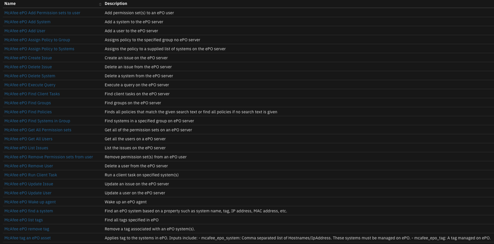

# McAfee ePO Integration for SOAR 

## Table of Contents
- [Release Notes](#release-notes)
- [Overview](#overview)
  - [Key Features](#key-features)
- [Requirements](#requirements)
  - [SOAR platform](#soar-platform)
  - [Cloud Pak for Security](#cloud-pak-for-security)
  - [Proxy Server](#proxy-server)
  - [Python Environment](#python-environment)
- [Installation](#installation)
  - [Install](#install)
  - [App Configuration](#app-configuration)
  - [Custom Layouts](#custom-layouts)
- [Function - McAfee ePO find a system](#function---mcafee-epo-find-a-system)
- [Function - McAfee ePO list tags](#function---mcafee-epo-list-tags)
- [Function - McAfee ePO remove tag](#function---mcafee-epo-remove-tag)
- [Function - McAfee ePO Wake up agent](#function---mcafee-epo-wake-up-agent)
- [Function - McAfee tag an ePO asset](#function---mcafee-tag-an-epo-asset)
- [Data Table - McAfee ePO tags](#data-table---mcafee-epo-tags)
- [Rules](#rules)
- [Troubleshooting & Support](#troubleshooting--support)
---

## Release Notes
| Version | Date | Notes |
| ------- | ---- | ----- |
| 1.1.0 | 07/2022 | <ul><li>Add function "Wake up agent"</li></ul> |
| 1.0.3 | 10/2020 | Added functions: find system, get system info, remove tags and Updated capability to rule for add tag function |
| 1.0.2 | 04/2020 | Support added for App Host |
| 1.0.1 | 10/2019 | Fix py2/3 incompatibility |
| 1.0.0 | 08/2018 | Initial Release |

---

## Overview

**IBM Security SOAR app for McAfee ePO**

 

The McAfee ePO function applies a tag to a system in ePO. The function takes as input a tag and a system or a list of system's hostnames/IP addresses, and then applies the tag to the provided system in ePO. The function assumes the list of systems and the provided tag are validate within ePO.

### Key Features
* Add and remove tags to an ePO system
* List available tags 
* Get info on an ePO system
* Wakes up a systems agent

---

## Requirements
This app supports the IBM Security QRadar SOAR Platform and the IBM Security QRadar SOAR for IBM Cloud Pak for Security.

### SOAR platform
The SOAR platform supports two app deployment mechanisms, App Host and integration server.

If deploying to a SOAR platform with an App Host, the requirements are:
* SOAR platform >= `43.1.49`.
* The app is in a container-based format (available from the AppExchange as a `zip` file).

If deploying to a SOAR platform with an integration server, the requirements are:
* SOAR platform >= `43.1.49`.
* The app is in the older integration format (available from the AppExchange as a `zip` file which contains a `tar.gz` file).
* Integration server is running `resilient_circuits>=43.0.0`.
* If using an API key account, make sure the account provides the following minimum permissions: 
  | Name | Permissions |
  | ---- | ----------- |
  | Org Data | Read |
  | Function | Read |


The following SOAR platform guides provide additional information: 
* _App Host Deployment Guide_: provides installation, configuration, and troubleshooting information, including proxy server settings. 
* _Integration Server Guide_: provides installation, configuration, and troubleshooting information, including proxy server settings.
* _System Administrator Guide_: provides the procedure to install, configure and deploy apps. 

The above guides are available on the IBM Documentation website at [ibm.biz/soar-docs](https://ibm.biz/soar-docs). On this web page, select your SOAR platform version. On the follow-on page, you can find the _App Host Deployment Guide_ or _Integration Server Guide_ by expanding **Apps** in the Table of Contents pane. The System Administrator Guide is available by expanding **System Administrator**.

### Cloud Pak for Security
If you are deploying to IBM Cloud Pak for Security, the requirements are:
* IBM Cloud Pak for Security >= 1.4.
* Cloud Pak is configured with an App Host.
* The app is in a container-based format (available from the AppExchange as a `zip` file).

The following Cloud Pak guides provide additional information: 
* _App Host Deployment Guide_: provides installation, configuration, and troubleshooting information, including proxy server settings. From the Table of Contents, select Case Management and Orchestration & Automation > **Orchestration and Automation Apps**.
* _System Administrator Guide_: provides information to install, configure, and deploy apps. From the IBM Cloud Pak for Security IBM Documentation table of contents, select Case Management and Orchestration & Automation > **System administrator**.

These guides are available on the IBM Documentation website at [ibm.biz/cp4s-docs](https://ibm.biz/cp4s-docs). From this web page, select your IBM Cloud Pak for Security version. From the version-specific IBM Documentation page, select Case Management and Orchestration & Automation.

### Proxy Server
The app does support a proxy server.

### Python Environment
Both Python 3.6 and Python 3.9 are supported.
Additional package dependencies may exist for each of these packages:
* resilient-lib
* resilient_circuits>=43.0.0

---

## Installation

### Install
* To install or uninstall an App or Integration on the _SOAR platform_, see the documentation at [ibm.biz/soar-docs](https://ibm.biz/soar-docs).
* To install or uninstall an App on _IBM Cloud Pak for Security_, see the documentation at [ibm.biz/cp4s-docs](https://ibm.biz/cp4s-docs) and follow the instructions above to navigate to Orchestration and Automation.

### App Configuration
The following table provides the settings you need to configure the app. These settings are made in the app.config file. See the documentation discussed in the Requirements section for the procedure.

| Config | Required | Example | Description |
| ------ | :------: | ------- | ----------- |
| **epo_url** | Yes | `https://<your_epo_server>:8443` | *URL to your McAfee ePO server* |
| **epo_username** | Yes | `<your_epo_username>` | *Your McAfee ePO server username* |
| **epo_password** | Yes | `<your_epo_password>` | *Your McAfee ePO server password* |
| **epo_trust_cert** | Yes | `false` | *Path to server certificate or false to bypass verification* |
| **timeout** | No | `60` | *Timeout is seconds for calls made to the EPo server* |

### Custom Layouts
* Import the Data Tables and Custom Fields like the screenshot below:

  

---

## Function - McAfee ePO find a system
Find an ePO system based on a property such as system name, tag, IP address, MAC address, etc.

 

<details><summary>Inputs:</summary>
<p>

| Name | Type | Required | Example | Tooltip |
| ---- | :--: | :------: | ------- | ------- |
| `mcafee_epo_systems` | `text` | No | `-` | Comma separated list of Hostnames/IpAddress. These systems must be managed on ePO |

</p>
</details>

<details><summary>Outputs:</summary>
<p>

> **NOTE:** This example might be in JSON format, but `results` is a Python Dictionary on the SOAR platform.

```python
results = {
  "content": [
    {
      "EPOBranchNode.AutoID": 2,
      "EPOComputerProperties.CPUSerialNumber": "",
      "EPOComputerProperties.CPUSpeed": 0,
      "EPOComputerProperties.CPUType": "",
      "EPOComputerProperties.ComputerDescription": null,
      "EPOComputerProperties.ComputerName": "test_server",
      "EPOComputerProperties.DefaultLangID": "",
      "EPOComputerProperties.Description": null,
      "EPOComputerProperties.DomainName": "",
      "EPOComputerProperties.FreeDiskSpace": 0,
      "EPOComputerProperties.FreeMemory": 0,
      "EPOComputerProperties.Free_Space_of_Drive_C": 0,
      "EPOComputerProperties.IPAddress": "",
      "EPOComputerProperties.IPHostName": "",
      "EPOComputerProperties.IPSubnet": null,
      "EPOComputerProperties.IPSubnetMask": null,
      "EPOComputerProperties.IPV4x": null,
      "EPOComputerProperties.IPV6": null,
      "EPOComputerProperties.IPXAddress": "",
      "EPOComputerProperties.IsPortable": -1,
      "EPOComputerProperties.LastAgentHandler": null,
      "EPOComputerProperties.NetAddress": "",
      "EPOComputerProperties.NumOfCPU": 0,
      "EPOComputerProperties.OSBitMode": -1,
      "EPOComputerProperties.OSBuildNum": 0,
      "EPOComputerProperties.OSCsdVersion": "",
      "EPOComputerProperties.OSOEMID": "",
      "EPOComputerProperties.OSPlatform": "",
      "EPOComputerProperties.OSType": "",
      "EPOComputerProperties.OSVersion": "",
      "EPOComputerProperties.ParentID": 13,
      "EPOComputerProperties.SubnetAddress": "",
      "EPOComputerProperties.SubnetMask": "",
      "EPOComputerProperties.TimeZone": "",
      "EPOComputerProperties.TotalDiskSpace": 0,
      "EPOComputerProperties.TotalPhysicalMemory": 0,
      "EPOComputerProperties.Total_Space_of_Drive_C": 0,
      "EPOComputerProperties.UserName": "",
      "EPOComputerProperties.UserProperty1": null,
      "EPOComputerProperties.UserProperty2": null,
      "EPOComputerProperties.UserProperty3": null,
      "EPOComputerProperties.UserProperty4": null,
      "EPOComputerProperties.UserProperty5": null,
      "EPOComputerProperties.UserProperty6": null,
      "EPOComputerProperties.UserProperty7": null,
      "EPOComputerProperties.UserProperty8": null,
      "EPOComputerProperties.Vdi": -1,
      "EPOLeafNode.AgentGUID": null,
      "EPOLeafNode.AgentVersion": null,
      "EPOLeafNode.ExcludedTags": "",
      "EPOLeafNode.LastUpdate": null,
      "EPOLeafNode.ManagedState": 0,
      "EPOLeafNode.Tags": "myTag, Server, SOAR"
    }
  ],
  "inputs": {
    "mcafee_epo_systems": "test_server"
  },
  "metrics": {
    "execution_time_ms": 649,
    "host": "local",
    "package": "fn-mcafee-epo",
    "package_version": "1.1.0",
    "timestamp": "2022-07-01 12:40:10",
    "version": "1.0"
  },
  "raw": null,
  "reason": null,
  "success": true,
  "version": 2.0
}
```

</p>
</details>

<details><summary>Example Pre-Process Script:</summary>
<p>

```python
inputs.mcafee_epo_systems = artifact.value
```

</p>
</details>

<details><summary>Example Post-Process Script:</summary>
<p>

```python
if not results.content:
  info = u"ePO system not found"
else:
  info = u"ePO system info\n"
  for system in results.content:
    for setting in system:
      info = u"{}\n{}: {}".format(info, setting, system[setting])

if artifact.description:
  artifact.description = u"{}\n\n{}".format(artifact.description.content, info)
else:
  artifact.description = info

incident.addNote(info)
```

</p>
</details>

---
## Function - McAfee ePO list tags
Find all tags specified in ePO

 

<details><summary>Inputs:</summary>
<p>

| Name | Type | Required | Example | Tooltip |
| ---- | :--: | :------: | ------- | ------- |

</p>
</details>

<details><summary>Outputs:</summary>
<p>

> **NOTE:** This example might be in JSON format, but `results` is a Python Dictionary on the SOAR platform.

```python
results = {
  "content": [
    {
      "tagId": 1,
      "tagName": "Server",
      "tagNotes": "Default tag for systems identified as a Server"
    },
    {
      "tagId": 2,
      "tagName": "Workstation",
      "tagNotes": "Default tag for systems identified as a Workstation"
    },
    {
      "tagId": 3,
      "tagName": "SOAR",
      "tagNotes": ""
    },
    {
      "tagId": 4,
      "tagName": "Windows server 2016",
      "tagNotes": ""
    },
    {
      "tagId": 5,
      "tagName": "Linux",
      "tagNotes": ""
    },
    {
      "tagId": 6,
      "tagName": "Intel(R) Xeon(R) CPU",
      "tagNotes": ""
    },
    {
      "tagId": 7,
      "tagName": "Intel Core Processor",
      "tagNotes": ""
    },
    {
      "tagId": 8,
      "tagName": "Test",
      "tagNotes": ""
    },
    {
      "tagId": 9,
      "tagName": "AA",
      "tagNotes": ""
    },
    {
      "tagId": 10,
      "tagName": "123",
      "tagNotes": ""
    }
  ],
  "inputs": {},
  "metrics": {
    "execution_time_ms": 580,
    "host": "local",
    "package": "fn-mcafee-epo",
    "package_version": "1.1.0",
    "timestamp": "2022-07-22 14:03:38",
    "version": "1.0"
  },
  "raw": null,
  "reason": null,
  "success": true,
  "version": 2.0
}
```

</p>
</details>

<details><summary>Example Pre-Process Script:</summary>
<p>

```python
None
```

</p>
</details>

<details><summary>Example Post-Process Script:</summary>
<p>

```python
if results.success:
  for tag in sorted(results.content, key = lambda i: i['tagName'].lower()):
    row = incident.addRow("mcafee_epo_tags")
    row['epo_id'] = tag['tagId']
    row['epo_tag'] = tag['tagName']
    row['epo_notes'] = tag['tagNotes']
```

</p>
</details>

---
## Function - McAfee ePO remove tag
Remove a tag associated with an ePO system(s).

 

<details><summary>Inputs:</summary>
<p>

| Name | Type | Required | Example | Tooltip |
| ---- | :--: | :------: | ------- | ------- |
| `mcafee_epo_systems` | `text` | No | `-` | Comma separated list of Hostnames/IpAddress. These systems must be managed on ePO |
| `mcafee_epo_tag` | `text` | No | `-` | Tag managed on ePO |

</p>
</details>

<details><summary>Outputs:</summary>
<p>

> **NOTE:** This example might be in JSON format, but `results` is a Python Dictionary on the SOAR platform.

```python
results = {
  "content": 1,
  "inputs": {
    "mcafee_epo_systems": "test_server",
    "mcafee_epo_tag": "[u\u0027Workstation\u0027]"
  },
  "metrics": {
    "execution_time_ms": 660,
    "host": "local",
    "package": "fn-mcafee-epo",
    "package_version": "1.1.0",
    "timestamp": "2022-07-01 12:43:15",
    "version": "1.0"
  },
  "raw": null,
  "reason": null,
  "success": true,
  "version": 2.0
}
```

</p>
</details>

<details><summary>Example Pre-Process Script:</summary>
<p>

```python
inputs.mcafee_epo_systems = artifact.value
inputs.mcafee_epo_tag = str(rule.properties.ss_tags)
```

</p>
</details>

<details><summary>Example Post-Process Script:</summary>
<p>

```python
if not results.content:
  note = u"ePO system not found or tag not applied: {}".format(results.inputs['mcafee_epo_tag'])
else:
  note = u"ePO tag(s) removed: {}".format(results.inputs['mcafee_epo_tag'])

if artifact.description:
  artifact.description = u"{}\n\n{}".format(artifact.description.content, note)
else:
  artifact.description = note
```

</p>
</details>

---
## Function - McAfee ePO Wake up agent
Wake up an ePO agent

 

<details><summary>Inputs:</summary>
<p>

| Name | Type | Required | Example | Tooltip |
| ---- | :--: | :------: | ------- | ------- |
| `mcafee_epo_systems` | `text` | No | `-` | Comma separated list of Hostnames/IpAddress. These systems must be managed on ePO |

</p>
</details>

<details><summary>Outputs:</summary>
<p>

> **NOTE:** This example might be in JSON format, but `results` is a Python Dictionary on the SOAR platform.

```python
results = {
  "content": "completed: 1\nfailed: 0\nexpired: 0",
  "inputs": {
    "mcafee_epo_systems": "WIN-MTHJTQ4ELBP"
  },
  "metrics": {
    "execution_time_ms": 25666,
    "host": "local",
    "package": "fn-mcafee-epo",
    "package_version": "1.1.0",
    "timestamp": "2022-07-25 08:43:47",
    "version": "1.0"
  },
  "raw": null,
  "reason": null,
  "success": true,
  "version": 2.0
}
```

</p>
</details>

<details><summary>Example Pre-Process Script:</summary>
<p>

```python
inputs.mcafee_epo_systems = rule.properties.epo_system
```

</p>
</details>

<details><summary>Example Post-Process Script:</summary>
<p>

```python
incident.addNote(results["content"])
```

</p>
</details>

---
## Function - McAfee tag an ePO asset
Applies tag to the systems in ePO. Inputs include:
- mcafee_epo_system: Comma separated list of Hostnames/IpAddress. These systems must be managed on ePO.
- mcafee_epo_tag: A tag managed on ePO.

 

<details><summary>Inputs:</summary>
<p>

| Name | Type | Required | Example | Tooltip |
| ---- | :--: | :------: | ------- | ------- |
| `mcafee_epo_systems` | `text` | No | `-` | Comma separated list of Hostnames/IpAddress. These systems must be managed on ePO |
| `mcafee_epo_tag` | `text` | No | `-` | Tag managed on ePO |

</p>
</details>

<details><summary>Outputs:</summary>
<p>

> **NOTE:** This example might be in JSON format, but `results` is a Python Dictionary on the SOAR platform.

```python
results = {
  "content": 1,
  "inputs": {
    "mcafee_epo_systems": "test_server",
    "mcafee_epo_tag": "[u\u0027Workstation\u0027]"
  },
  "metrics": {
    "execution_time_ms": 596,
    "host": "local",
    "package": "fn-mcafee-epo",
    "package_version": "1.1.0",
    "timestamp": "2022-07-01 12:42:07",
    "version": "1.0"
  },
  "raw": null,
  "reason": null,
  "success": true,
  "version": 2.0
}
```

</p>
</details>

<details><summary>Example Pre-Process Script:</summary>
<p>

```python
inputs.mcafee_epo_systems = rule.properties.epo_system
inputs.mcafee_epo_tag = row['epo_tag']
```

</p>
</details>

<details><summary>Example Post-Process Script:</summary>
<p>

```python
if results.content:
  note = u"ePO tags: {} applied to system(s): {}".format(results.inputs['mcafee_epo_tag'], results.inputs['mcafee_epo_systems'])
else:
  note = u"ePO system(s): {} either not found or tag already applied for tags: {}".format(results.inputs['mcafee_epo_systems'], results.inputs['mcafee_epo_tag'])

incident.addNote(note)
```

</p>
</details>

---


## Data Table - McAfee ePO tags

 

#### API Name:
mcafee_epo_tags

#### Columns:
| Column Name | API Access Name | Type | Tooltip |
| ----------- | --------------- | ---- | ------- |
| Id | `epo_id` | `number` | - |
| Notes | `epo_notes` | `text` | - |
| Tag | `epo_tag` | `text` | - |

---


## Rules
| Rule Name | Object | Workflow Triggered |
| --------- | ------ | ------------------ |
| McAfee ePO apply a tag | mcafee_epo_tags | `mcafee_epo_apply_a_tag` |
| McAfee ePO apply tags | artifact | `mcafee_epo_apply_tags` |
| McAfee ePO get system info | artifact | `mcafee_epo_get_system_info` |
| McAfee ePO list tags | incident | `mcafee_epo_list_tags` |
| McAfee ePO remove tags | artifact | `mcafee_epo_remove_tag` |
| McAfee ePO Wake up Agent | incident | `mcafee_epo_wake_up_agent` |

---


## Troubleshooting & Support
Refer to the documentation listed in the Requirements section for troubleshooting information.

### For Support
This is a IBM Community provided App. Please search the Community [ibm.biz/soarcommunity](https://ibm.biz/soarcommunity) for assistance.
