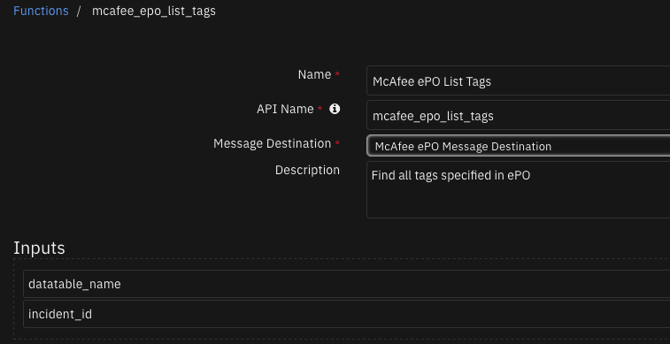
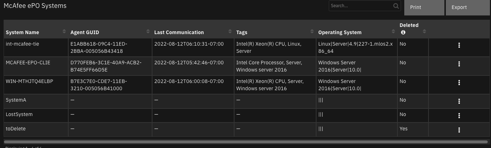

# McAfee ePO Integration for SOAR 

## Table of Contents
- [Release Notes](#release-notes)
- [Overview](#overview)
  - [Key Features](#key-features)
- [Requirements](#requirements)
  - [SOAR platform](#soar-platform)
  - [Cloud Pak for Security](#cloud-pak-for-security)
  - [Proxy Server](#proxy-server)
  - [Python Environment](#python-environment)
- [Installation](#installation)
  - [Install](#install)
  - [App Configuration](#app-configuration)
  - [Custom Layouts](#custom-layouts)
- [Function - McAfee ePO Add Permission sets to user](#function---mcafee-epo-add-permission-sets-to-user)
- [Function - McAfee ePO Add System](#function---mcafee-epo-add-system)
- [Function - McAfee ePO Add User](#function---mcafee-epo-add-user)
- [Function - McAfee ePO Assign Policy to Group](#function---mcafee-epo-assign-policy-to-group)
- [Function - McAfee ePO Assign Policy to Systems](#function---mcafee-epo-assign-policy-to-systems)
- [Function - McAfee ePO Create Issue](#function---mcafee-epo-create-issue)
- [Function - McAfee ePO Delete Issue](#function---mcafee-epo-delete-issue)
- [Function - McAfee ePO Delete System](#function---mcafee-epo-delete-system)
- [Function - McAfee ePO Execute Query](#function---mcafee-epo-execute-query)
- [Function - McAfee ePO Find a System](#function---mcafee-epo-find-a-system)
- [Function - McAfee ePO Find Client Tasks](#function---mcafee-epo-find-client-tasks)
- [Function - McAfee ePO Find Groups](#function---mcafee-epo-find-groups)
- [Function - McAfee ePO Find Policies](#function---mcafee-epo-find-policies)
- [Function - McAfee ePO Find Systems in Group](#function---mcafee-epo-find-systems-in-group)
- [Function - McAfee ePO Get All Permission sets](#function---mcafee-epo-get-all-permission-sets)
- [Function - McAfee ePO Get All Users](#function---mcafee-epo-get-all-users)
- [Function - McAfee ePO List Issues](#function---mcafee-epo-list-issues)
- [Function - McAfee ePO List Tags](#function---mcafee-epo-list-tags)
- [Function - McAfee ePO Remove Permission sets from user](#function---mcafee-epo-remove-permission-sets-from-user)
- [Function - McAfee ePO Remove Tag](#function---mcafee-epo-remove-tag)
- [Function - McAfee ePO Remove User](#function---mcafee-epo-remove-user)
- [Function - McAfee ePO Run Client Task](#function---mcafee-epo-run-client-task)
- [Function - McAfee ePO Update Issue](#function---mcafee-epo-update-issue)
- [Function - McAfee ePO Update User](#function---mcafee-epo-update-user)
- [Function - McAfee ePO Wake up agent](#function---mcafee-epo-wake-up-agent)
- [Function - McAfee Tag an ePO Asset](#function---mcafee-tag-an-epo-asset)
- [Data Table - McAfee ePO Client Tasks](#data-table---mcafee-epo-client-tasks)
- [Data Table - McAfee ePO Groups](#data-table---mcafee-epo-groups)
- [Data Table - McAfee ePO Issues](#data-table---mcafee-epo-issues)
- [Data Table - McAfee ePO Permission sets](#data-table---mcafee-epo-permission-sets)
- [Data Table - McAfee ePO Policies](#data-table---mcafee-epo-policies)
- [Data Table - McAfee ePO Systems](#data-table---mcafee-epo-systems)
- [Data Table - McAfee ePO tags](#data-table---mcafee-epo-tags)
- [Data Table - McAfee ePO Users](#data-table---mcafee-epo-users)
- [Rules](#rules)
- [Troubleshooting & Support](#troubleshooting--support)
---

## Release Notes
| Version | Date | Notes |
| ------- | ---- | ----- |
| 2.0.0 | 07/2022 | <ul><li>Add 20 new functions</li><li>Added 7 new data tables</li><li>Update funct_mcafee_epo_find_a_system function to allow a list of systems properties to be used and return a list of systems</li></ul> |
| 1.0.3 | 10/2020 | Added functions: find system, get system info, remove tags and Updated capability to rule for add tag function |
| 1.0.2 | 04/2020 | Support added for App Host |
| 1.0.1 | 10/2019 | Fix py2/3 incompatibility |
| 1.0.0 | 08/2018 | Initial Release |

---

## Overview

**IBM Security SOAR app for McAfee ePO**

 

The McAfee ePO functions allow for manipilation of tags, systems, users, issues, policies and permission sets.

### Key Features
* Add permission set(s) to an ePO user
* Add a system to the ePO server
* Add a user to the ePO server
* Assigns policy to the specified group no ePO server
* Assigns the policy to a supplied list of systems on the ePO server
* Create an issue on the ePO server
* Delete an issue from the ePO server
* Delete a system from the ePO server
* Execute a query on the ePO server
* Find client tasks on the ePO server
* Find groups on the ePO server
* Finds all policies that match the given search text or find all policies if no search text is given
* Find systems in a specified group on ePO server
* Get all of the permission sets on an ePO server
* Get all the users on a ePO server
* List the issues on the ePO server
* Remove permission set(s) from an ePO user
* Delete a user from the ePO server
* Run a client task on specified system(s)
* Update an issue on the ePO server
* Update a user on the ePO server
* Wake up an ePO agent
* Find an ePO system based on a property such as system name, tag, IP address, MAC address, etc.
* Find all tags specified in ePO
* Remove a tag associated with an ePO system(s).
* Applies tag to the systems in ePO. Inputs include: - mcafee_epo_system: Comma separated list of Hostnames/IpAddress. These systems must be managed on ePO. - mcafee_epo_tag: A tag managed on ePO.

---

## Requirements
This app supports the IBM Security QRadar SOAR Platform and the IBM Security QRadar SOAR for IBM Cloud Pak for Security.

### SOAR platform
The SOAR platform supports two app deployment mechanisms, App Host and integration server.

If deploying to a SOAR platform with an App Host, the requirements are:
* SOAR platform >= `43.1.49`.
* The app is in a container-based format (available from the AppExchange as a `zip` file).

If deploying to a SOAR platform with an integration server, the requirements are:
* SOAR platform >= `43.1.49`.
* The app is in the older integration format (available from the AppExchange as a `zip` file which contains a `tar.gz` file).
* Integration server is running `resilient_circuits>=43.0.0`.
* If using an API key account, make sure the account provides the following minimum permissions: 
  | Name | Permissions |
  | ---- | ----------- |
  | Org Data | Read |
  | Function | Read |

The following SOAR platform guides provide additional information: 
* _App Host Deployment Guide_: provides installation, configuration, and troubleshooting information, including proxy server settings. 
* _Integration Server Guide_: provides installation, configuration, and troubleshooting information, including proxy server settings.
* _System Administrator Guide_: provides the procedure to install, configure and deploy apps. 

The above guides are available on the IBM Documentation website at [ibm.biz/soar-docs](https://ibm.biz/soar-docs). On this web page, select your SOAR platform version. On the follow-on page, you can find the _App Host Deployment Guide_ or _Integration Server Guide_ by expanding **Apps** in the Table of Contents pane. The System Administrator Guide is available by expanding **System Administrator**.

### Cloud Pak for Security
If you are deploying to IBM Cloud Pak for Security, the requirements are:
* IBM Cloud Pak for Security >= 1.4.
* Cloud Pak is configured with an App Host.
* The app is in a container-based format (available from the AppExchange as a `zip` file).

The following Cloud Pak guides provide additional information: 
* _App Host Deployment Guide_: provides installation, configuration, and troubleshooting information, including proxy server settings. From the Table of Contents, select Case Management and Orchestration & Automation > **Orchestration and Automation Apps**.
* _System Administrator Guide_: provides information to install, configure, and deploy apps. From the IBM Cloud Pak for Security IBM Documentation table of contents, select Case Management and Orchestration & Automation > **System administrator**.

These guides are available on the IBM Documentation website at [ibm.biz/cp4s-docs](https://ibm.biz/cp4s-docs). From this web page, select your IBM Cloud Pak for Security version. From the version-specific IBM Documentation page, select Case Management and Orchestration & Automation.

### Proxy Server
The app does support a proxy server.

### Python Environment
Both Python 3.6 and Python 3.9 are supported.
Additional package dependencies may exist for each of these packages:
* resilient-lib
* resilient_circuits>=43.0.0

---

## Installation

### Install
* To install or uninstall an App or Integration on the _SOAR platform_, see the documentation at [ibm.biz/soar-docs](https://ibm.biz/soar-docs).
* To install or uninstall an App on _IBM Cloud Pak for Security_, see the documentation at [ibm.biz/cp4s-docs](https://ibm.biz/cp4s-docs) and follow the instructions above to navigate to Orchestration and Automation.

### App Configuration
The following table provides the settings you need to configure the app. These settings are made in the app.config file. See the documentation discussed in the Requirements section for the procedure.

| Config | Required | Example | Description |
| ------ | :------: | ------- | ----------- |
| **epo_url** | Yes | `https://<your_epo_server>:8443` | *URL to your McAfee ePO server* |
| **epo_username** | Yes | `<your_epo_username>` | *Your McAfee ePO server username* |
| **epo_password** | Yes | `<your_epo_password>` | *Your McAfee ePO server password* |
| **epo_trust_cert** | Yes | `false` | *Path to server certificate or false to bypass verification* |
| **timeout** | No | `60` | *Timeout is seconds for calls made to the ePO server* |

### Custom Layouts
* Import the Data Tables and Custom Fields like the screenshot below:

  


---

## Function - McAfee ePO Add Permission sets to user
Add permission set(s) to an ePO user

 

<details><summary>Inputs:</summary>
<p>

| Name | Type | Required | Example | Tooltip |
| ---- | :--: | :------: | ------- | ------- |
| `mcafee_epo_permsetname` | `text` | No | `-` | Name of the permission set to add to the ePO user |
| `mcafee_epo_username` | `text` | No | `-` | User name for ePO user |

</p>
</details>

<details><summary>Outputs:</summary>
<p>

> **NOTE:** This example might be in JSON format, but `results` is a Python Dictionary on the SOAR platform.

```python
results = {
  "content": true,
  "inputs": {
    "mcafee_epo_permsetname": "Global Reviewer",
    "mcafee_epo_username": "test"
  },
  "metrics": {
    "execution_time_ms": 593,
    "host": "local",
    "package": "fn-mcafee-epo",
    "package_version": "1.1.0",
    "timestamp": "2022-08-02 12:48:58",
    "version": "1.0"
  },
  "raw": null,
  "reason": null,
  "success": true,
  "version": 2.0
}
```

</p>
</details>

<details><summary>Example Pre-Process Script:</summary>
<p>

```python
inputs.mcafee_epo_username = rule.properties.epo_username
inputs.mcafee_epo_permsetname = row.permission_set_name
```

</p>
</details>

<details><summary>Example Post-Process Script:</summary>
<p>

```python
if results['success']:
  if rule.properties.epo_username not in row.users:
    row.users = "{}, {}".format(row.users, rule.properties.epo_username)
    incident.addNote("Permissions set: {} was added to user: {}".format(results['inputs']['mcafee_epo_permsetname'], results['inputs']['mcafee_epo_username']))
  else:
    incident.addNote("User: {} already has permission set: {}".format(results['inputs']['mcafee_epo_username'], results['inputs']['mcafee_epo_permsetname']))
```

</p>
</details>

---
## Function - McAfee ePO Add System
Add a system to the ePO server

 

<details><summary>Inputs:</summary>
<p>

| Name | Type | Required | Example | Tooltip |
| ---- | :--: | :------: | ------- | ------- |
| `mcafee_epo_allow_duplicates` | `boolean` | No | `-` | Weither to allow duplicates or not |
| `mcafee_epo_delete_if_removed` | `boolean` | No | `-` | Should system be deleted if removed |
| `mcafee_epo_flatten_tree_structure` | `boolean` | No | `-` | Should flatten tree structure |
| `mcafee_epo_group_id` | `number` | No | `-` | Id for the group on the ePO server |
| `mcafee_epo_push_agent` | `boolean` | No | `-` | wiether to push the agent to the system or not |
| `mcafee_epo_push_agent_domain_name` | `text` | No | `-` | Domain name for system to push agent |
| `mcafee_epo_push_agent_force_install` | `boolean` | No | `-` | force install if agent on new system |
| `mcafee_epo_push_agent_install_path` | `text` | No | `-` | path to where the agent should be installed on the system |
| `mcafee_epo_push_agent_package_path` | `text` | No | `-` | Path the package on the new system |
| `mcafee_epo_push_agent_password` | `text` | No | `-` | Password for system |
| `mcafee_epo_push_agent_skip_if_installed` | `boolean` | No | `-` | Skip pushing agent if it is installed |
| `mcafee_epo_push_agent_suppress_ui` | `boolean` | No | `-` | Push agent and suppress ui |
| `mcafee_epo_push_agent_username` | `text` | No | `-` | username for system |
| `mcafee_epo_system_name_or_id` | `text` | No | `-` | Comma seperated list of systems name or system ids |
| `mcafee_epo_uninstall` | `boolean` | No | `-` | True or false to uninstall system |

</p>
</details>

<details><summary>Outputs:</summary>
<p>

> **NOTE:** This example might be in JSON format, but `results` is a Python Dictionary on the SOAR platform.

```python
results = {
  "content": true,
  "inputs": {
    "mcafee_epo_allow_duplicates": null,
    "mcafee_epo_delete_if_removed": null,
    "mcafee_epo_flatten_tree_structure": null,
    "mcafee_epo_group_id": 2,
    "mcafee_epo_push_agent": null,
    "mcafee_epo_push_agent_domain_name": null,
    "mcafee_epo_push_agent_force_install": null,
    "mcafee_epo_push_agent_install_path": null,
    "mcafee_epo_push_agent_package_path": null,
    "mcafee_epo_push_agent_password": null,
    "mcafee_epo_push_agent_skip_if_installed": null,
    "mcafee_epo_push_agent_suppress_ui": null,
    "mcafee_epo_push_agent_username": null,
    "mcafee_epo_system_name_or_id": "fffff",
    "mcafee_epo_uninstall": null
  },
  "metrics": {
    "execution_time_ms": 176568,
    "host": "local",
    "package": "fn-mcafee-epo",
    "package_version": "1.1.0",
    "timestamp": "2022-08-16 14:16:44",
    "version": "1.0"
  },
  "raw": null,
  "reason": null,
  "success": true,
  "version": 2.0
}
```

</p>
</details>

<details><summary>Example Pre-Process Script:</summary>
<p>

```python
# Required
inputs.mcafee_epo_group_id = rule.properties.epo_group_id
inputs.mcafee_epo_system_name_or_id = rule.properties.epo_system_names_or_ids

# Optional
inputs.mcafee_epo_allow_duplicates = rule.properties.epo_allow_duplicates
inputs.mcafee_epo_delete_if_removed = rule.properties.epo_delete_if_removed
inputs.mcafee_epo_flatten_tree_structure = rule.properties.epo_flatten_tree_structure
inputs.mcafee_epo_push_agent = rule.properties.epo_push_agent
inputs.mcafee_epo_push_agent_domain_name = rule.properties.epo_push_agent_domain_name
inputs.mcafee_epo_push_agent_force_install = rule.properties.epo_push_agent_force_install
inputs.mcafee_epo_push_agent_package_path = rule.properties.epo_push_agent_package_path
inputs.mcafee_epo_push_agent_password = rule.properties.epo_push_agent_password
inputs.mcafee_epo_push_agent_skip_if_installed = rule.properties.epo_push_agent_skip_if_installed
inputs.mcafee_epo_push_agent_suppress_ui = rule.properties.epo_push_agent_suppress_ui
inputs.mcafee_epo_push_agent_username = rule.properties.epo_push_agent_user_name
inputs.mcafee_epo_uninstall = rule.properties.epo_uninstall_removed
inputs.mcafee_epo_push_agent_install_path = rule.properties.epo_push_agent_install_path
```

</p>
</details>

<details><summary>Example Post-Process Script:</summary>
<p>

```python
if results.get("success"):
  row = incident.addRow("mcafee_epo_systems")
  row["system_name"] = rule.properties.epo_system_names_or_ids
```

</p>
</details>

---
## Function - McAfee ePO Add User
Add a user to the ePO server

 

<details><summary>Inputs:</summary>
<p>

| Name | Type | Required | Example | Tooltip |
| ---- | :--: | :------: | ------- | ------- |
| `mcafee_epo_admin` | `boolean` | No | `-` | Should this user have admin privileges  |
| `mcafee_epo_allowed_ips` | `text` | No | `-` | A list of ips that can access the new user |
| `mcafee_epo_email` | `text` | No | `-` | Email for the new user |
| `mcafee_epo_fullname` | `text` | No | `-` | Full name for the new user |
| `mcafee_epo_notes` | `text` | No | `-` | Notes to add to the new user |
| `mcafee_epo_pass` | `text` | No | `-` | Password for ePO user |
| `mcafee_epo_phone_number` | `text` | No | `-` | Phone number for the new user |
| `mcafee_epo_user_disabled` | `boolean` | No | `-` | Should the new user be disabled when created? |
| `mcafee_epo_username` | `text` | No | `-` | User name for ePO user |

</p>
</details>

<details><summary>Outputs:</summary>
<p>

> **NOTE:** This example might be in JSON format, but `results` is a Python Dictionary on the SOAR platform.

```python
results = {
  "content": true,
  "inputs": {
    "mcafee_epo_admin": true,
    "mcafee_epo_allowed_ips": null,
    "mcafee_epo_email": "jeff@example.com",
    "mcafee_epo_fullname": "jeff",
    "mcafee_epo_notes": "jefferson notes",
    "mcafee_epo_pass": "password",
    "mcafee_epo_phone_number": "534-452-0287",
    "mcafee_epo_user_disabled": false,
    "mcafee_epo_username": "jeff"
  },
  "metrics": {
    "execution_time_ms": 604,
    "host": "local",
    "package": "fn-mcafee-epo",
    "package_version": "1.1.0",
    "timestamp": "2022-08-10 12:55:56",
    "version": "1.0"
  },
  "raw": null,
  "reason": null,
  "success": true,
  "version": 2.0
}
```

</p>
</details>

<details><summary>Example Pre-Process Script:</summary>
<p>

```python
inputs.mcafee_epo_username = rule.properties.epo_username
inputs.mcafee_epo_pass = rule.properties.epo_user_password
inputs.mcafee_epo_admin = rule.properties.epo_admin
inputs.mcafee_epo_allowed_ips = rule.properties.epo_allowed_ips
inputs.mcafee_epo_email = rule.properties.epo_email
inputs.mcafee_epo_fullname = rule.properties.epo_full_name
inputs.mcafee_epo_notes = rule.properties.epo_notes
inputs.mcafee_epo_phone_number = rule.properties.epo_phone_number
inputs.mcafee_epo_user_disabled = rule.properties.epo_user_disbabled
```

</p>
</details>

<details><summary>Example Post-Process Script:</summary>
<p>

```python
if results.get("success"):
  incident.addNote("User: {} successfully created.".format(rule.properties.epo_username))
```

</p>
</details>

---
## Function - McAfee ePO Assign Policy to Group
Assigns policy to the specified group no ePO server

 

<details><summary>Inputs:</summary>
<p>

| Name | Type | Required | Example | Tooltip |
| ---- | :--: | :------: | ------- | ------- |
| `mcafee_epo_group_id` | `number` | No | `-` | Id for the group on the ePO server |
| `mcafee_epo_object_id` | `number` | No | `-` | ID if object |
| `mcafee_epo_product_id` | `text` | No | `-` | The product ID for the task |
| `mcafee_epo_reset_inheritance` | `boolean` | No | `-` | Boolean to reset inheritance |

</p>
</details>

<details><summary>Outputs:</summary>
<p>

> **NOTE:** This example might be in JSON format, but `results` is a Python Dictionary on the SOAR platform.

```python
results = {
  "content": true,
  "inputs": {
    "mcafee_epo_group_id": 5,
    "mcafee_epo_object_id": 39,
    "mcafee_epo_product_id": "MARCOBA_META"
  },
  "metrics": {
    "execution_time_ms": 751,
    "host": "local",
    "package": "fn-mcafee-epo",
    "package_version": "1.1.0",
    "timestamp": "2022-08-22 12:05:01",
    "version": "1.0"
  },
  "raw": null,
  "reason": null,
  "success": true,
  "version": 2.0
}
```

</p>
</details>

<details><summary>Example Pre-Process Script:</summary>
<p>

```python
inputs.mcafee_epo_group_id = row.group_id
inputs.mcafee_epo_object_id = rule.properties.epo_policy_id
inputs.mcafee_epo_product_id = rule.properties.epo_product_id
```

</p>
</details>

<details><summary>Example Post-Process Script:</summary>
<p>

```python
if results.get("success"):
  incident.addNote("Policy: '{}' Assigned to Group: '{}'".format(rule.properties.epo_policy_id, row.group_id))
```

</p>
</details>

---
## Function - McAfee ePO Assign Policy to Systems
Assigns the policy to a supplied list of systems on the ePO server

 

<details><summary>Inputs:</summary>
<p>

| Name | Type | Required | Example | Tooltip |
| ---- | :--: | :------: | ------- | ------- |
| `mcafee_epo_object_id` | `number` | No | `-` | ID if object |
| `mcafee_epo_product_id` | `text` | No | `-` | The product ID for the task |
| `mcafee_epo_reset_inheritance` | `boolean` | No | `-` | Boolean to reset inheritance |
| `mcafee_epo_system_name_or_id` | `text` | No | `-` | Comma seperated list of systems name or system ids |
| `mcafee_epo_type_id` | `number` | No | `-` | Type ID |

</p>
</details>

<details><summary>Outputs:</summary>
<p>

> **NOTE:** This example might be in JSON format, but `results` is a Python Dictionary on the SOAR platform.

```python
results = {
  "content": [
    {
      "id": "12",
      "message": "Assign policy succeeded",
      "name": "SystemA",
      "status": 0
    }
  ],
  "inputs": {
    "mcafee_epo_object_id": 39,
    "mcafee_epo_product_id": "MARCOBA_META",
    "mcafee_epo_system_name_or_id": "SystemA",
    "mcafee_epo_type_id": 19
  },
  "metrics": {
    "execution_time_ms": 709,
    "host": "local",
    "package": "fn-mcafee-epo",
    "package_version": "1.1.0",
    "timestamp": "2022-08-22 12:13:29",
    "version": "1.0"
  },
  "raw": null,
  "reason": null,
  "success": true,
  "version": 2.0
}
```

</p>
</details>

<details><summary>Example Pre-Process Script:</summary>
<p>

```python
inputs.mcafee_epo_system_name_or_id = row.system_name
inputs.mcafee_epo_product_id = rule.properties.epo_product_id
inputs.mcafee_epo_type_id = rule.properties.epo_policy_type_id
inputs.mcafee_epo_object_id = rule.properties.epo_policy_id
```

</p>
</details>

<details><summary>Example Post-Process Script:</summary>
<p>

```python
if results.get("success"):
  incident.addNote("Policy: '{}' Assigned to system: '{}'".format(rule.properties.epo_policy_id, row.system_name))
```

</p>
</details>

---
## Function - McAfee ePO Create Issue
Create an issue on the ePO server

 

<details><summary>Inputs:</summary>
<p>

| Name | Type | Required | Example | Tooltip |
| ---- | :--: | :------: | ------- | ------- |
| `mcafee_epo_issue_assignee` | `text` | No | `-` | Username of person assigned to the issue |
| `mcafee_epo_issue_description` | `text` | No | `-` | description of the issue  |
| `mcafee_epo_issue_due` | `datetimepicker` | No | `-` | Due date of the issue |
| `mcafee_epo_issue_name` | `text` | No | `-` | Name of the issue on the ePO server |
| `mcafee_epo_issue_priority` | `select` | No | `-` | The priority of the issue |
| `mcafee_epo_issue_properties` | `text` | No | `-` | Properties for the issue |
| `mcafee_epo_issue_resolution` | `select` | No | `-` | Resolution status of the issue |
| `mcafee_epo_issue_severity` | `select` | No | `-` | Severity of the issue |
| `mcafee_epo_issue_state` | `select` | No | `-` | State of the issue |
| `mcafee_epo_issue_type` | `select` | No | `-` | Issue type |
| `mcafee_epo_ticket_id` | `number` | No | `-` | ID of the ticket |
| `mcafee_epo_ticket_server_name` | `text` | No | `-` | Name of the server the issue should be on |

</p>
</details>

<details><summary>Outputs:</summary>
<p>

> **NOTE:** This example might be in JSON format, but `results` is a Python Dictionary on the SOAR platform.

```python
results = {
  "content": 13,
  "inputs": {
    "mcafee_epo_issue_assignee": "Jefferson",
    "mcafee_epo_issue_description": "Test issue creation",
    "mcafee_epo_issue_due": 1661950852000,
    "mcafee_epo_issue_name": "New issue",
    "mcafee_epo_issue_priority": "Medium",
    "mcafee_epo_issue_properties": null,
    "mcafee_epo_issue_resolution": "Will Not Fix",
    "mcafee_epo_issue_severity": "Low",
    "mcafee_epo_issue_state": "Assigned",
    "mcafee_epo_issue_type": "Basic",
    "mcafee_epo_ticket_id": null,
    "mcafee_epo_ticket_server_name": null
  },
  "metrics": {
    "execution_time_ms": 547,
    "host": "local",
    "package": "fn-mcafee-epo",
    "package_version": "1.1.0",
    "timestamp": "2022-08-19 09:00:56",
    "version": "1.0"
  },
  "raw": null,
  "reason": null,
  "success": true,
  "version": 2.0
}
```

</p>
</details>

<details><summary>Example Pre-Process Script:</summary>
<p>

```python
inputs.mcafee_epo_issue_assignee = rule.properties.epo_issue_assignee
inputs.mcafee_epo_issue_description = rule.properties.epo_issue_description
inputs.mcafee_epo_issue_due = rule.properties.epo_issue_due
inputs.mcafee_epo_issue_name = rule.properties.epo_issue_name
inputs.mcafee_epo_issue_priority = rule.properties.epo_issue_priority
inputs.mcafee_epo_issue_properties = rule.properties.epo_issue_properties
inputs.mcafee_epo_issue_resolution = rule.properties.epo_issue_resolution
inputs.mcafee_epo_issue_severity = rule.properties.epo_issue_severity
inputs.mcafee_epo_issue_state = rule.properties.epo_issue_state
inputs.mcafee_epo_ticket_id = rule.properties.epo_ticket_id
inputs.mcafee_epo_ticket_server_name = rule.properties.epo_ticket_server_name
```

</p>
</details>

<details><summary>Example Post-Process Script:</summary>
<p>

```python
if results.get("success"):
  row = incident.addRow("mcafee_epo_issues")
  row["issue_name"] = rule.properties.epo_issue_name
  row["severity"] = rule.properties.epo_issue_severity
  row["issue_due_date"] = rule.properties.epo_issue_due
  row["issue_description"] = rule.properties.epo_issue_description
  row["ticket_server_name"] = rule.properties.epo_ticket_server_name
  row["priority"] = rule.properties.epo_issue_priority
  row["type"] = rule.properties.epo_issue_type
  row["resolution"] = rule.properties.epo_issue_resolution
  row["assignee_name"] =rule.properties.epo_issue_assignee
  row["issue_state"] = rule.properties.epo_issue_state
  row["ticket_id"] = rule.properties.epo_ticket_id
  row["issue_deleted"] = False
```

</p>
</details>

---
## Function - McAfee ePO Delete Issue
Delete an issue from the ePO server

 

<details><summary>Inputs:</summary>
<p>

| Name | Type | Required | Example | Tooltip |
| ---- | :--: | :------: | ------- | ------- |
| `mcafee_epo_issue_id` | `number` | No | `-` | ID of the issue |

</p>
</details>

<details><summary>Outputs:</summary>
<p>

> **NOTE:** This example might be in JSON format, but `results` is a Python Dictionary on the SOAR platform.

```python
results = {
  "content": 1,
  "inputs": {
    "mcafee_epo_issue_id": 12
  },
  "metrics": {
    "execution_time_ms": 538,
    "host": "local",
    "package": "fn-mcafee-epo",
    "package_version": "1.1.0",
    "timestamp": "2022-08-19 09:01:12",
    "version": "1.0"
  },
  "raw": null,
  "reason": null,
  "success": true,
  "version": 2.0
}
```

</p>
</details>

<details><summary>Example Pre-Process Script:</summary>
<p>

```python
inputs.mcafee_epo_issue_id = row.issue_id
```

</p>
</details>

<details><summary>Example Post-Process Script:</summary>
<p>

```python
if results.get("success"):
  row.issue_deleted = True
  incident.addNote("Issue: '{}' deleted successfully.".format(row.issue_id))
```

</p>
</details>

---
## Function - McAfee ePO Delete System
Delete a system from the ePO server

 

<details><summary>Inputs:</summary>
<p>

| Name | Type | Required | Example | Tooltip |
| ---- | :--: | :------: | ------- | ------- |
| `mcafee_epo_system_name_or_id` | `text` | No | `-` | Comma seperated list of systems name or system ids |
| `mcafee_epo_uninstall` | `boolean` | No | `-` | True or false to uninstall system |
| `mcafee_epo_uninstall_software` | `boolean` | No | `-` | True or false to uninstall software on system |

</p>
</details>

<details><summary>Outputs:</summary>
<p>

> **NOTE:** This example might be in JSON format, but `results` is a Python Dictionary on the SOAR platform.

```python
results = {
  "content": [
    {
      "id": "15",
      "message": "Computer deleted successfully",
      "name": "toDelete",
      "status": 0
    }
  ],
  "inputs": {
    "mcafee_epo_system_name_or_id": "toDelete"
  },
  "metrics": {
    "execution_time_ms": 615,
    "host": "local",
    "package": "fn-mcafee-epo",
    "package_version": "1.1.0",
    "timestamp": "2022-08-12 09:11:56",
    "version": "1.0"
  },
  "raw": null,
  "reason": null,
  "success": true,
  "version": 2.0
}
```

</p>
</details>

<details><summary>Example Pre-Process Script:</summary>
<p>

```python
inputs.mcafee_epo_system_name_or_id = row.system_name
```

</p>
</details>

<details><summary>Example Post-Process Script:</summary>
<p>

```python
if results.get("success"):
  row.deleted = True
  incident.addNote("System: {} deleted".format(row.system_name))
```

</p>
</details>

---
## Function - McAfee ePO Execute Query
Execute a query on the ePO server

 

<details><summary>Inputs:</summary>
<p>

| Name | Type | Required | Example | Tooltip |
| ---- | :--: | :------: | ------- | ------- |
| `datatable_name` | `text` | No | `Name of the datatable being cleared` | - |
| `incident_id` | `number` | No | `SOAR incident id` | - |
| `mcafee_epo_queryid` | `number` | No | `-` | The ID of the query you want to run |
| `mcafee_epo_target` | `text` | No | `-` | ePO data types target name |

</p>
</details>

<details><summary>Outputs:</summary>
<p>

> **NOTE:** This example might be in JSON format, but `results` is a Python Dictionary on the SOAR platform.

```python
results = {
  "content": [
    {
      "EPOLeafNode.AgentGUID": "E1ABB618-09C4-11ED-2BBA-005056B43418",
      "EPOLeafNode.AgentVersion": "5.6.5.236",
      "EPOLeafNode.ExcludedTags": "",
      "EPOLeafNode.LastCommSecure": "1",
      "EPOLeafNode.LastUpdate": "2022-08-12T06:10:31-07:00",
      "EPOLeafNode.ManagedState": 1,
      "EPOLeafNode.NodeName": "int-mcafee-tie",
      "EPOLeafNode.ResortEnabled": false,
      "EPOLeafNode.SequenceErrorCount": 0,
      "EPOLeafNode.SequenceErrorCountLastUpdate": null,
      "EPOLeafNode.Tags": "Intel(R) Xeon(R) CPU, Linux, Server",
      "EPOLeafNode.TransferSiteListsID": false,
      "EPOLeafNode.os": "Linux|Server|4.9|227-1.mlos2.x86_64"
    },
    {
      "EPOLeafNode.AgentGUID": "D770FEB6-3C1E-40A9-ACB2-B74E5FF66D5E",
      "EPOLeafNode.AgentVersion": "5.5.1.388",
      "EPOLeafNode.ExcludedTags": "",
      "EPOLeafNode.LastCommSecure": "1",
      "EPOLeafNode.LastUpdate": "2022-08-12T05:42:46-07:00",
      "EPOLeafNode.ManagedState": 1,
      "EPOLeafNode.NodeName": "MCAFEE-EPO-CLIE",
      "EPOLeafNode.ResortEnabled": false,
      "EPOLeafNode.SequenceErrorCount": 0,
      "EPOLeafNode.SequenceErrorCountLastUpdate": null,
      "EPOLeafNode.Tags": "Intel Core Processor, Server, Windows server 2016",
      "EPOLeafNode.TransferSiteListsID": false,
      "EPOLeafNode.os": "Windows Server 2016|Server|10.0|"
    },
    {
      "EPOLeafNode.AgentGUID": "B7E3C7E0-CDE7-11EB-3210-005056B41000",
      "EPOLeafNode.AgentVersion": "5.6.6.232",
      "EPOLeafNode.ExcludedTags": "",
      "EPOLeafNode.LastCommSecure": "1",
      "EPOLeafNode.LastUpdate": "2022-08-12T06:00:08-07:00",
      "EPOLeafNode.ManagedState": 1,
      "EPOLeafNode.NodeName": "WIN-MTHJTQ4ELBP",
      "EPOLeafNode.ResortEnabled": false,
      "EPOLeafNode.SequenceErrorCount": 0,
      "EPOLeafNode.SequenceErrorCountLastUpdate": null,
      "EPOLeafNode.Tags": "Intel(R) Xeon(R) CPU, Server, Windows server 2016",
      "EPOLeafNode.TransferSiteListsID": false,
      "EPOLeafNode.os": "Windows Server 2016|Server|10.0|"
    },
    {
      "EPOLeafNode.AgentGUID": null,
      "EPOLeafNode.AgentVersion": null,
      "EPOLeafNode.ExcludedTags": "",
      "EPOLeafNode.LastCommSecure": "0",
      "EPOLeafNode.LastUpdate": null,
      "EPOLeafNode.ManagedState": 0,
      "EPOLeafNode.NodeName": "SystemA",
      "EPOLeafNode.ResortEnabled": false,
      "EPOLeafNode.SequenceErrorCount": 0,
      "EPOLeafNode.SequenceErrorCountLastUpdate": null,
      "EPOLeafNode.Tags": "",
      "EPOLeafNode.TransferSiteListsID": false,
      "EPOLeafNode.os": "|||"
    },
    {
      "EPOLeafNode.AgentGUID": null,
      "EPOLeafNode.AgentVersion": null,
      "EPOLeafNode.ExcludedTags": "",
      "EPOLeafNode.LastCommSecure": "0",
      "EPOLeafNode.LastUpdate": null,
      "EPOLeafNode.ManagedState": 0,
      "EPOLeafNode.NodeName": "LostSystem",
      "EPOLeafNode.ResortEnabled": false,
      "EPOLeafNode.SequenceErrorCount": 0,
      "EPOLeafNode.SequenceErrorCountLastUpdate": null,
      "EPOLeafNode.Tags": "",
      "EPOLeafNode.TransferSiteListsID": false,
      "EPOLeafNode.os": "|||"
    },
    {
      "EPOLeafNode.AgentGUID": null,
      "EPOLeafNode.AgentVersion": null,
      "EPOLeafNode.ExcludedTags": "",
      "EPOLeafNode.LastCommSecure": "0",
      "EPOLeafNode.LastUpdate": null,
      "EPOLeafNode.ManagedState": 0,
      "EPOLeafNode.NodeName": "toDelete",
      "EPOLeafNode.ResortEnabled": false,
      "EPOLeafNode.SequenceErrorCount": 0,
      "EPOLeafNode.SequenceErrorCountLastUpdate": null,
      "EPOLeafNode.Tags": "",
      "EPOLeafNode.TransferSiteListsID": false,
      "EPOLeafNode.os": "|||"
    }
  ],
  "inputs": {
    "datatable_name": "mcafee_epo_systems",
    "incident_id": 2108,
    "mcafee_epo_target": "EPOLeafNode"
  },
  "metrics": {
    "execution_time_ms": 1252,
    "host": "local",
    "package": "fn-mcafee-epo",
    "package_version": "1.1.0",
    "timestamp": "2022-08-12 09:10:36",
    "version": "1.0"
  },
  "raw": null,
  "reason": null,
  "success": true,
  "version": 2.0
}
```

</p>
</details>

<details><summary>Example Pre-Process Script:</summary>
<p>

```python
inputs.mcafee_epo_target = "EPOLeafNode"
inputs.datatable_name = "mcafee_epo_systems"
inputs.incident_id = incident.id
```

</p>
</details>

<details><summary>Example Post-Process Script:</summary>
<p>

```python
if results.get('success'):
  for system in results['content']:
    table_row = incident.addRow("mcafee_epo_systems")
    table_row["system_name"] = system.get("EPOLeafNode.NodeName")
    table_row["agent_guid"] = system.get("EPOLeafNode.AgentGUID")
    table_row["last_communication"] = system.get("EPOLeafNode.LastUpdate")
    table_row["tags"] = system.get("EPOLeafNode.Tags")
    table_row["operating_system"] = system.get("EPOLeafNode.os").replace("|", " | ")
    table_row["deleted"] = False
```

</p>
</details>

---
## Function - McAfee ePO Find a System
Find an ePO system based on a property such as system name, tag, IP address, MAC address, etc.

 

<details><summary>Inputs:</summary>
<p>

| Name | Type | Required | Example | Tooltip |
| ---- | :--: | :------: | ------- | ------- |
| `mcafee_epo_systems` | `text` | No | `-` | Comma separated list of Hostnames/IpAddress. These systems must be managed on ePO |

</p>
</details>

<details><summary>Outputs:</summary>
<p>

> **NOTE:** This example might be in JSON format, but `results` is a Python Dictionary on the SOAR platform.

```python
results = {
  "content": [
    {
      "EPOBranchNode.AutoID": 2,
      "EPOComputerProperties.CPUSerialNumber": "",
      "EPOComputerProperties.CPUSpeed": 0,
      "EPOComputerProperties.CPUType": "",
      "EPOComputerProperties.ComputerDescription": null,
      "EPOComputerProperties.ComputerName": "test_server",
      "EPOComputerProperties.DefaultLangID": "",
      "EPOComputerProperties.Description": null,
      "EPOComputerProperties.DomainName": "",
      "EPOComputerProperties.FreeDiskSpace": 0,
      "EPOComputerProperties.FreeMemory": 0,
      "EPOComputerProperties.Free_Space_of_Drive_C": 0,
      "EPOComputerProperties.IPAddress": "",
      "EPOComputerProperties.IPHostName": "",
      "EPOComputerProperties.IPSubnet": null,
      "EPOComputerProperties.IPSubnetMask": null,
      "EPOComputerProperties.IPV4x": null,
      "EPOComputerProperties.IPV6": null,
      "EPOComputerProperties.IPXAddress": "",
      "EPOComputerProperties.IsPortable": -1,
      "EPOComputerProperties.LastAgentHandler": null,
      "EPOComputerProperties.NetAddress": "",
      "EPOComputerProperties.NumOfCPU": 0,
      "EPOComputerProperties.OSBitMode": -1,
      "EPOComputerProperties.OSBuildNum": 0,
      "EPOComputerProperties.OSCsdVersion": "",
      "EPOComputerProperties.OSOEMID": "",
      "EPOComputerProperties.OSPlatform": "",
      "EPOComputerProperties.OSType": "",
      "EPOComputerProperties.OSVersion": "",
      "EPOComputerProperties.ParentID": 13,
      "EPOComputerProperties.SubnetAddress": "",
      "EPOComputerProperties.SubnetMask": "",
      "EPOComputerProperties.TimeZone": "",
      "EPOComputerProperties.TotalDiskSpace": 0,
      "EPOComputerProperties.TotalPhysicalMemory": 0,
      "EPOComputerProperties.Total_Space_of_Drive_C": 0,
      "EPOComputerProperties.UserName": "",
      "EPOComputerProperties.UserProperty1": null,
      "EPOComputerProperties.UserProperty2": null,
      "EPOComputerProperties.UserProperty3": null,
      "EPOComputerProperties.UserProperty4": null,
      "EPOComputerProperties.UserProperty5": null,
      "EPOComputerProperties.UserProperty6": null,
      "EPOComputerProperties.UserProperty7": null,
      "EPOComputerProperties.UserProperty8": null,
      "EPOComputerProperties.Vdi": -1,
      "EPOLeafNode.AgentGUID": null,
      "EPOLeafNode.AgentVersion": null,
      "EPOLeafNode.ExcludedTags": "",
      "EPOLeafNode.LastUpdate": null,
      "EPOLeafNode.ManagedState": 0,
      "EPOLeafNode.Tags": "myTag, Server, SOAR"
    }
  ],
  "inputs": {
    "mcafee_epo_systems": "test_server"
  },
  "metrics": {
    "execution_time_ms": 649,
    "host": "local",
    "package": "fn-mcafee-epo",
    "package_version": "1.1.0",
    "timestamp": "2022-07-01 12:40:10",
    "version": "1.0"
  },
  "raw": null,
  "reason": null,
  "success": true,
  "version": 2.0
}
```

</p>
</details>

<details><summary>Example Pre-Process Script:</summary>
<p>

```python
inputs.mcafee_epo_systems = artifact.value
```

</p>
</details>

<details><summary>Example Post-Process Script:</summary>
<p>

```python
if not results.get("success"):
  info = u"ePO system not found"
else:
  info = u"ePO system info\n"
  for system in results.content:
    for setting in system:
      info = u"{}\n{}: {}".format(info, setting, system.get("setting"))

if artifact.description:
  artifact.description = u"{}\n\n{}".format(artifact.description.content, info)
else:
  artifact.description = info

incident.addNote(info)
```

</p>
</details>

---
## Function - McAfee ePO Find Client Tasks
Find client tasks on the ePO server

 

<details><summary>Inputs:</summary>
<p>

| Name | Type | Required | Example | Tooltip |
| ---- | :--: | :------: | ------- | ------- |
| `datatable_name` | `text` | No | `Name of the datatable being cleared` | - |
| `incident_id` | `number` | No | `SOAR incident id` | - |
| `mcafee_epo_search_text` | `text` | No | `-` | - |

</p>
</details>

<details><summary>Outputs:</summary>
<p>

> **NOTE:** This example might be in JSON format, but `results` is a Python Dictionary on the SOAR platform.

```python
results = {
  "content": [
    {
      "objectId": 7,
      "objectName": "Collect All",
      "productId": "EPOAGENTMETA",
      "productName": "McAfee Agent ",
      "typeId": 4,
      "typeName": "McAfee Agent: McAfee Agent Statistics"
    },
    {
      "objectId": 14,
      "objectName": "Get changed properties",
      "productId": "EPOAGENTMETA",
      "productName": "McAfee Agent ",
      "typeId": 3,
      "typeName": "McAfee Agent: McAfee Agent Wakeup"
    },
    {
      "objectId": 15,
      "objectName": "Update all packages",
      "productId": "EPOAGENTMETA",
      "productName": "McAfee Agent ",
      "typeId": 1,
      "typeName": "McAfee Agent: Product Update"
    }
  ],
  "inputs": {
    "datatable_name": "mcafee_epo_client_tasks",
    "incident_id": 2108
  },
  "metrics": {
    "execution_time_ms": 1088,
    "host": "local",
    "package": "fn-mcafee-epo",
    "package_version": "1.1.0",
    "timestamp": "2022-08-12 09:58:29",
    "version": "1.0"
  },
  "raw": null,
  "reason": null,
  "success": true,
  "version": 2.0
}
```

</p>
</details>

<details><summary>Example Pre-Process Script:</summary>
<p>

```python
inputs.datatable_name = "mcafee_epo_client_tasks"
inputs.incident_id = incident.id
```

</p>
</details>

<details><summary>Example Post-Process Script:</summary>
<p>

```python
if results.get("success"):
  for x in results.get("content"):
    table = incident.addRow("mcafee_epo_client_tasks")
    table["object_name"] = x.get("objectName")
    table["type_name"] = x.get("typeName")
    table["product_name"] = x.get("productName")
    table["product_id"] = x.get("productId")
    table["object_id"] = x.get("objectId")
```

</p>
</details>

---
## Function - McAfee ePO Find Groups
Find groups on the ePO server

 

<details><summary>Inputs:</summary>
<p>

| Name | Type | Required | Example | Tooltip |
| ---- | :--: | :------: | ------- | ------- |
| `datatable_name` | `text` | No | `Name of the datatable being cleared` | - |
| `incident_id` | `number` | No | `SOAR incident id` | - |
| `mcafee_epo_search_text` | `text` | No | `-` | - |

</p>
</details>

<details><summary>Outputs:</summary>
<p>

> **NOTE:** This example might be in JSON format, but `results` is a Python Dictionary on the SOAR platform.

```python
results = {
  "content": [
    {
      "groupId": 2,
      "groupPath": "My Organization"
    },
    {
      "groupId": 3,
      "groupPath": "My Organization\\Lost and Found"
    },
    {
      "groupId": 4,
      "groupPath": "My Organization\\Lost and Found\\rtp.raleigh.ibm.com"
    },
    {
      "groupId": 5,
      "groupPath": "My Organization\\Test"
    }
  ],
  "inputs": {
    "datatable_name": "mcafee_epo_groups",
    "incident_id": 2108
  },
  "metrics": {
    "execution_time_ms": 1217,
    "host": "local",
    "package": "fn-mcafee-epo",
    "package_version": "1.1.0",
    "timestamp": "2022-08-11 08:48:38",
    "version": "1.0"
  },
  "raw": null,
  "reason": null,
  "success": true,
  "version": 2.0
}
```

</p>
</details>

<details><summary>Example Pre-Process Script:</summary>
<p>

```python
inputs.datatable_name = "mcafee_epo_groups"
inputs.incident_id = incident.id
```

</p>
</details>

<details><summary>Example Post-Process Script:</summary>
<p>

```python
if results.get("success"):
  for x in results.get("content"):
    table = incident.addRow("mcafee_epo_groups")
    table["group_id"] = int(x.get("groupId"))
    table["group_path"] = x.get("groupPath")
```

</p>
</details>

---
## Function - McAfee ePO Find Policies
Finds all policies that match the given search text or find all policies if no search text is given

 

<details><summary>Inputs:</summary>
<p>

| Name | Type | Required | Example | Tooltip |
| ---- | :--: | :------: | ------- | ------- |
| `datatable_name` | `text` | No | `Name of the datatable being cleared` | - |
| `incident_id` | `number` | No | `SOAR incident id` | - |
| `mcafee_epo_search_text` | `text` | No | `-` | - |

</p>
</details>

<details><summary>Outputs:</summary>
<p>

> **NOTE:** This example might be in JSON format, but `results` is a Python Dictionary on the SOAR platform.

```python
results = {
  "content": [
    {
      "featureId": "MARCOBA_META",
      "featureName": "MARCOBA_META",
      "objectId": 39,
      "objectName": "McAfee Default",
      "objectNotes": "",
      "productId": "MARCOBA_META",
      "productName": "Active Response 2.4.4",
      "typeId": 19,
      "typeName": "General"
    },
    {
      "featureId": "MARCOBA_META",
      "featureName": "MARCOBA_META",
      "objectId": 40,
      "objectName": "Full Visibility",
      "objectNotes": "",
      "productId": "MARCOBA_META",
      "productName": "Active Response 2.4.4",
      "typeId": 19,
      "typeName": "General"
    },
    {
      "featureId": "MARCOBA_META",
      "featureName": "MARCOBA_META",
      "objectId": 41,
      "objectName": "Full Monitoring",
      "objectNotes": "",
      "productId": "MARCOBA_META",
      "productName": "Active Response 2.4.4",
      "typeId": 19,
      "typeName": "General"
    },
    {
      "featureId": "MARCOBA_META",
      "featureName": "MARCOBA_META",
      "objectId": 42,
      "objectName": "My Default",
      "objectNotes": "",
      "productId": "MARCOBA_META",
      "productName": "Active Response 2.4.4",
      "typeId": 19,
      "typeName": "General"
    },
    {
      "featureId": "EPOAGENTMETA",
      "featureName": "McAfee Agent",
      "objectId": 4,
      "objectName": "McAfee Default",
      "objectNotes": "The McAfee Default policy is configured with settings recommended by McAfee to protect many environments",
      "productId": "EPOAGENTMETA",
      "productName": "McAfee Agent ",
      "typeId": 3,
      "typeName": "General"
    },
    {
      "featureId": "EPOAGENTMETA",
      "featureName": "McAfee Agent",
      "objectId": 9,
      "objectName": "Large Organization Default",
      "objectNotes": "The Large Organization Default policy is configured with settings recommended by McAfee to protect large enterprise environments.",
      "productId": "EPOAGENTMETA",
      "productName": "McAfee Agent ",
      "typeId": 3,
      "typeName": "General"
    },
    {
      "featureId": "EPOAGENTMETA",
      "featureName": "McAfee Agent",
      "objectId": 11,
      "objectName": "My Default",
      "objectNotes": "",
      "productId": "EPOAGENTMETA",
      "productName": "McAfee Agent ",
      "typeId": 3,
      "typeName": "General"
    },
    {
      "featureId": "EPOAGENTMETA",
      "featureName": "McAfee Agent",
      "objectId": 5,
      "objectName": "McAfee Default",
      "objectNotes": "The McAfee Default policy is configured with settings recommended by McAfee to protect many environments",
      "productId": "EPOAGENTMETA",
      "productName": "McAfee Agent ",
      "typeId": 4,
      "typeName": "Repository"
    },
    {
      "featureId": "EPOAGENTMETA",
      "featureName": "McAfee Agent",
      "objectId": 12,
      "objectName": "My Default",
      "objectNotes": "",
      "productId": "EPOAGENTMETA",
      "productName": "McAfee Agent ",
      "typeId": 4,
      "typeName": "Repository"
    },
    {
      "featureId": "EPOAGENTMETA",
      "featureName": "McAfee Agent",
      "objectId": 6,
      "objectName": "McAfee Default",
      "objectNotes": "The McAfee Default policy is configured with settings recommended by McAfee to protect many environments",
      "productId": "EPOAGENTMETA",
      "productName": "McAfee Agent ",
      "typeId": 5,
      "typeName": "Troubleshooting"
    },
    {
      "featureId": "EPOAGENTMETA",
      "featureName": "McAfee Agent",
      "objectId": 13,
      "objectName": "My Default",
      "objectNotes": "",
      "productId": "EPOAGENTMETA",
      "productName": "McAfee Agent ",
      "typeId": 5,
      "typeName": "Troubleshooting"
    },
    {
      "featureId": "EPOAGENTMETA",
      "featureName": "McAfee Agent",
      "objectId": 7,
      "objectName": "McAfee Default",
      "objectNotes": "",
      "productId": "EPOAGENTMETA",
      "productName": "McAfee Agent ",
      "typeId": 6,
      "typeName": "Custom Properties"
    },
    {
      "featureId": "EPOAGENTMETA",
      "featureName": "McAfee Agent",
      "objectId": 14,
      "objectName": "My Default",
      "objectNotes": "",
      "productId": "EPOAGENTMETA",
      "productName": "McAfee Agent ",
      "typeId": 6,
      "typeName": "Custom Properties"
    },
    {
      "featureId": "EPOAGENTMETA",
      "featureName": "McAfee Agent",
      "objectId": 8,
      "objectName": "McAfee Default",
      "objectNotes": "The McAfee Default policy is configured with settings recommended by McAfee to protect many environments",
      "productId": "EPOAGENTMETA",
      "productName": "McAfee Agent ",
      "typeId": 7,
      "typeName": "Product Improvement Program"
    },
    {
      "featureId": "EPOAGENTMETA",
      "featureName": "McAfee Agent",
      "objectId": 15,
      "objectName": "My Default",
      "objectNotes": "",
      "productId": "EPOAGENTMETA",
      "productName": "McAfee Agent ",
      "typeId": 7,
      "typeName": "Product Improvement Program"
    },
    {
      "featureId": "DXLBROKRMETA",
      "featureName": "McAfee DXL Broker Management",
      "objectId": 24,
      "objectName": "McAfee Default",
      "objectNotes": "",
      "productId": "DXLBROKRMETA",
      "productName": "McAfee DXL Broker Management 6.0.0",
      "typeId": 13,
      "typeName": "General"
    },
    {
      "featureId": "DXLBROKRMETA",
      "featureName": "McAfee DXL Broker Management",
      "objectId": 28,
      "objectName": "My Default",
      "objectNotes": "",
      "productId": "DXLBROKRMETA",
      "productName": "McAfee DXL Broker Management 6.0.0",
      "typeId": 13,
      "typeName": "General"
    },
    {
      "featureId": "DXLCLNT_META",
      "featureName": "McAfee DXL Client",
      "objectId": 33,
      "objectName": "McAfee Default",
      "objectNotes": "",
      "productId": "DXLCLNT_META",
      "productName": "McAfee DXL Client 6.0.0",
      "typeId": 17,
      "typeName": "General"
    },
    {
      "featureId": "DXLCLNT_META",
      "featureName": "McAfee DXL Client",
      "objectId": 35,
      "objectName": "My Default",
      "objectNotes": "",
      "productId": "DXLCLNT_META",
      "productName": "McAfee DXL Client 6.0.0",
      "typeId": 17,
      "typeName": "General"
    }
  ],
  "inputs": {
    "datatable_name": "mcafee_epo_policies",
    "incident_id": 2108
  },
  "metrics": {
    "execution_time_ms": 620661,
    "host": "local",
    "package": "fn-mcafee-epo",
    "package_version": "1.1.0",
    "timestamp": "2022-08-22 11:43:00",
    "version": "1.0"
  },
  "raw": null,
  "reason": null,
  "success": true,
  "version": 2.0
}
```

</p>
</details>

<details><summary>Example Pre-Process Script:</summary>
<p>

```python
inputs.datatable_name = "mcafee_epo_policies"
inputs.incident_id = incident.id
```

</p>
</details>

<details><summary>Example Post-Process Script:</summary>
<p>

```python
if results.get("success"):
  for policy in results["content"]:
    table_row = incident.addRow("mcafee_epo_policies")
    table_row["object_name"] = policy.get("objectName")
    table_row["object_id"] = int(policy.get("objectId"))
    table_row["type_name"] = policy.get("typeName")
    table_row["type_id"] = int(policy.get("typeId"))
    table_row["product_id"] = policy.get("productId")
    table_row["object_notes"] = policy.get("objectNotes")
```

</p>
</details>

---
## Function - McAfee ePO Find Systems in Group
Find systems in a specified group on ePO server

 

<details><summary>Inputs:</summary>
<p>

| Name | Type | Required | Example | Tooltip |
| ---- | :--: | :------: | ------- | ------- |
| `mcafee_epo_group_id` | `number` | No | `-` | Id for the group on the ePO server |
| `mcafee_epo_sub_group` | `text` | No | `-` | Sub group name |

</p>
</details>

<details><summary>Outputs:</summary>
<p>

> **NOTE:** This example might be in JSON format, but `results` is a Python Dictionary on the SOAR platform.

```python
results = {
  "content": [
    {
      "EPOBranchNode.AutoID": 5,
      "EPOComputerProperties.CPUSerialNumber": "",
      "EPOComputerProperties.CPUSpeed": 0,
      "EPOComputerProperties.CPUType": "",
      "EPOComputerProperties.ComputerDescription": null,
      "EPOComputerProperties.ComputerName": "SystemA",
      "EPOComputerProperties.DefaultLangID": "",
      "EPOComputerProperties.Description": null,
      "EPOComputerProperties.DomainName": "",
      "EPOComputerProperties.FreeDiskSpace": 0,
      "EPOComputerProperties.FreeMemory": 0,
      "EPOComputerProperties.Free_Space_of_Drive_C": 0,
      "EPOComputerProperties.IPAddress": "",
      "EPOComputerProperties.IPHostName": "",
      "EPOComputerProperties.IPSubnet": null,
      "EPOComputerProperties.IPSubnetMask": null,
      "EPOComputerProperties.IPV4x": null,
      "EPOComputerProperties.IPV6": null,
      "EPOComputerProperties.IPXAddress": "",
      "EPOComputerProperties.IsPortable": -1,
      "EPOComputerProperties.LastAgentHandler": null,
      "EPOComputerProperties.NetAddress": "",
      "EPOComputerProperties.NumOfCPU": 0,
      "EPOComputerProperties.OSBitMode": -1,
      "EPOComputerProperties.OSBuildNum": 0,
      "EPOComputerProperties.OSCsdVersion": "",
      "EPOComputerProperties.OSOEMID": "",
      "EPOComputerProperties.OSPlatform": "",
      "EPOComputerProperties.OSType": "",
      "EPOComputerProperties.OSVersion": "",
      "EPOComputerProperties.ParentID": 12,
      "EPOComputerProperties.SubnetAddress": "",
      "EPOComputerProperties.SubnetMask": "",
      "EPOComputerProperties.TimeZone": "",
      "EPOComputerProperties.TotalDiskSpace": 0,
      "EPOComputerProperties.TotalPhysicalMemory": 0,
      "EPOComputerProperties.Total_Space_of_Drive_C": 0,
      "EPOComputerProperties.UserName": "",
      "EPOComputerProperties.UserProperty1": null,
      "EPOComputerProperties.UserProperty2": null,
      "EPOComputerProperties.UserProperty3": null,
      "EPOComputerProperties.UserProperty4": null,
      "EPOComputerProperties.UserProperty5": null,
      "EPOComputerProperties.UserProperty6": null,
      "EPOComputerProperties.UserProperty7": null,
      "EPOComputerProperties.UserProperty8": null,
      "EPOComputerProperties.Vdi": -1,
      "EPOLeafNode.AgentGUID": null,
      "EPOLeafNode.AgentVersion": null,
      "EPOLeafNode.ExcludedTags": "",
      "EPOLeafNode.LastUpdate": null,
      "EPOLeafNode.ManagedState": 0,
      "EPOLeafNode.Tags": ""
    }
  ],
  "inputs": {
    "mcafee_epo_group_id": 5
  },
  "metrics": {
    "execution_time_ms": 578,
    "host": "local",
    "package": "fn-mcafee-epo",
    "package_version": "1.1.0",
    "timestamp": "2022-08-22 11:45:56",
    "version": "1.0"
  },
  "raw": null,
  "reason": null,
  "success": true,
  "version": 2.0
}
```

</p>
</details>

<details><summary>Example Pre-Process Script:</summary>
<p>

```python
inputs.mcafee_epo_group_id = row.group_id
```

</p>
</details>

<details><summary>Example Post-Process Script:</summary>
<p>

```python
if results.get("success"):
  systemsList = []
  for x in results.get("content"):
    systemsList.append(x.get("EPOComputerProperties.ComputerName"))
  row.systems = str(systemsList).replace("[","").replace("]","").replace("'","")
```

</p>
</details>

---
## Function - McAfee ePO Get All Permission sets
Get all of the permission sets on an ePO server

 

<details><summary>Inputs:</summary>
<p>

| Name | Type | Required | Example | Tooltip |
| ---- | :--: | :------: | ------- | ------- |
| `datatable_name` | `text` | No | `Name of the datatable being cleared` | - |
| `incident_id` | `number` | No | `SOAR incident id` | - |
| `mcafee_epo_username` | `text` | No | `-` | User name for ePO user |

</p>
</details>

<details><summary>Outputs:</summary>
<p>

> **NOTE:** This example might be in JSON format, but `results` is a Python Dictionary on the SOAR platform.

```python
results = {
  "content": [
    {
      "id": 4,
      "name": "Executive Reviewer"
    },
    {
      "id": 1,
      "name": "Global Reviewer"
    },
    {
      "id": 2,
      "name": "Group Admin"
    },
    {
      "id": 3,
      "name": "Group Reviewer"
    }
  ],
  "inputs": {},
  "metrics": {
    "execution_time_ms": 552,
    "host": "local",
    "package": "fn-mcafee-epo",
    "package_version": "1.1.0",
    "timestamp": "2022-08-02 09:43:53",
    "version": "1.0"
  },
  "raw": null,
  "reason": null,
  "success": true,
  "version": 2.0
}
```

</p>
</details>

<details><summary>Example Pre-Process Script:</summary>
<p>

```python
inputs.datatable_name = "mcafee_epo_permission_sets"
inputs.incident_id = incident.id
```

</p>
</details>

<details><summary>Example Post-Process Script:</summary>
<p>

```python
if results.get("success"):
  for permset in results["content"]:
    table_row = incident.addRow("mcafee_epo_permission_sets")
    table_row["permission_set_name"] = permset.get("name")
```

</p>
</details>

---
## Function - McAfee ePO Get All Users
Get all the users on a ePO server

 

<details><summary>Inputs:</summary>
<p>

| Name | Type | Required | Example | Tooltip |
| ---- | :--: | :------: | ------- | ------- |
| `datatable_name` | `text` | No | `Name of the datatable being cleared` | - |
| `incident_id` | `number` | No | `SOAR incident id` | - |
| `mcafee_epo_permsetname` | `text` | No | `-` | Name of the permission set to add to the ePO user |

</p>
</details>

<details><summary>Outputs:</summary>
<p>

> **NOTE:** This example might be in JSON format, but `results` is a Python Dictionary on the SOAR platform.

```python
results = {
  "content": [],
  "inputs": {
    "mcafee_epo_permsetname": "Global Reviewer"
  },
  "metrics": {
    "execution_time_ms": 566,
    "host": "local",
    "package": "fn-mcafee-epo",
    "package_version": "1.1.0",
    "timestamp": "2022-08-11 08:07:14",
    "version": "1.0"
  },
  "raw": null,
  "reason": null,
  "success": true,
  "version": 2.0
}
```

</p>
</details>

<details><summary>Example Pre-Process Script:</summary>
<p>

```python
inputs.datatable_name = "mcafee_epo_users"
inputs.incident_id = incident.id
```

</p>
</details>

<details><summary>Example Post-Process Script:</summary>
<p>

```python
if results.get("success"):
  for user in results["content"]:
    table_row = incident.addRow("mcafee_epo_users")
    table_row["user_name"] = user.get("name")
    table_row["full_name"] = user.get("fullName")
    table_row["email"] = user.get("email")
    table_row["phone_number"] = user.get("phoneNumber")
    table_row["disabled"] = bool(user.get("disabled"))
    table_row["admin"] = bool(user.get("admin"))
    table_row["notes"] = user.get("notes")
    table_row["allowed_ips"] = user.get("allowedIPs")
    table_row["user_deleted"] = False
```

</p>
</details>

---
## Function - McAfee ePO List Issues
List the issues on the ePO server

 

<details><summary>Inputs:</summary>
<p>

| Name | Type | Required | Example | Tooltip |
| ---- | :--: | :------: | ------- | ------- |
| `datatable_name` | `text` | No | `Name of the datatable being cleared` | - |
| `incident_id` | `number` | No | `SOAR incident id` | - |
| `mcafee_epo_issue_id` | `number` | No | `-` | ID of the issue |

</p>
</details>

<details><summary>Outputs:</summary>
<p>

> **NOTE:** This example might be in JSON format, but `results` is a Python Dictionary on the SOAR platform.

```python
results = {
  "content": [
    {
      "activityLog": [
        {
          "date": "2022-08-19T06:00:56-07:00",
          "details": "",
          "dirty": true,
          "id": 17,
          "issueId": 13,
          "title": "Issue Created",
          "username": "admin"
        }
      ],
      "assignee": null,
      "assigneeName": "Jefferson",
      "createdDate": "2022-08-19T06:00:56-07:00",
      "creatorName": "admin",
      "description": "Test issue creation",
      "dueDate": 1661965252000,
      "id": 13,
      "name": "New issue",
      "priority": "MEDIUM",
      "resolution": "WILLNOTFIX",
      "severity": "LOW",
      "state": "ASSIGNED",
      "subtype": null,
      "ticketId": null,
      "ticketServerName": null,
      "type": "issue.type.untyped"
    }
  ],
  "inputs": {
    "datatable_name": "mcafee_epo_issues",
    "incident_id": 2108
  },
  "metrics": {
    "execution_time_ms": 1434,
    "host": "local",
    "package": "fn-mcafee-epo",
    "package_version": "1.1.0",
    "timestamp": "2022-08-19 09:03:21",
    "version": "1.0"
  },
  "raw": null,
  "reason": null,
  "success": true,
  "version": 2.0
}
```

</p>
</details>

<details><summary>Example Pre-Process Script:</summary>
<p>

```python
inputs.datatable_name = "mcafee_epo_issues"
inputs.incident_id = incident.id
```

</p>
</details>

<details><summary>Example Post-Process Script:</summary>
<p>

```python
if results.get("success"):
  for c in results.get("content"):
    row = incident.addRow("mcafee_epo_issues")
    row["issue_name"] = c.get("name")
    row["issue_id"] = int(c.get("id"))
    row["severity"] = c.get("severity")
    row["issue_due_date"] = c.get("dueDate")
    row["issue_description"] = c.get("description")
    row["ticket_server_name"] = c.get("ticketServerName")
    row["priority"] = c.get("priority")
    row["type"] = c.get("type")
    row["resolution"] = c.get("resolution")
    row["assignee_name"] = c.get("assigneeName")
    row["issue_state"] = c.get("state")
    row["ticket_id"] = int(c.get("ticketId")) if c.get("ticketId") else None
    row["issue_deleted"] = False
```

</p>
</details>

---
## Function - McAfee ePO List Tags
Find all tags specified in ePO

 

<details><summary>Inputs:</summary>
<p>

| Name | Type | Required | Example | Tooltip |
| ---- | :--: | :------: | ------- | ------- |

</p>
</details>

<details><summary>Outputs:</summary>
<p>

> **NOTE:** This example might be in JSON format, but `results` is a Python Dictionary on the SOAR platform.

```python
results = {
  "content": [
    {
      "tagId": 1,
      "tagName": "Server",
      "tagNotes": "Default tag for systems identified as a Server"
    },
    {
      "tagId": 2,
      "tagName": "Workstation",
      "tagNotes": "Default tag for systems identified as a Workstation"
    },
    {
      "tagId": 3,
      "tagName": "SOAR",
      "tagNotes": ""
    },
    {
      "tagId": 4,
      "tagName": "Windows server 2016",
      "tagNotes": ""
    },
    {
      "tagId": 5,
      "tagName": "Linux",
      "tagNotes": ""
    },
    {
      "tagId": 6,
      "tagName": "Intel(R) Xeon(R) CPU",
      "tagNotes": ""
    },
    {
      "tagId": 7,
      "tagName": "Intel Core Processor",
      "tagNotes": ""
    },
    {
      "tagId": 8,
      "tagName": "Test",
      "tagNotes": ""
    },
    {
      "tagId": 9,
      "tagName": "AA",
      "tagNotes": ""
    },
    {
      "tagId": 10,
      "tagName": "123",
      "tagNotes": ""
    }
  ],
  "inputs": {},
  "metrics": {
    "execution_time_ms": 580,
    "host": "local",
    "package": "fn-mcafee-epo",
    "package_version": "1.1.0",
    "timestamp": "2022-07-22 14:03:38",
    "version": "1.0"
  },
  "raw": null,
  "reason": null,
  "success": true,
  "version": 2.0
}
```

</p>
</details>

<details><summary>Example Pre-Process Script:</summary>
<p>

```python
None
```

</p>
</details>

<details><summary>Example Post-Process Script:</summary>
<p>

```python
if results.get("success"):
  for tag in sorted(results.content, key = lambda i: i['tagName'].lower()):
    row = incident.addRow("mcafee_epo_tags")
    row['epo_id'] = tag['tagId']
    row['epo_tag'] = tag['tagName']
    row['epo_notes'] = tag['tagNotes']
```

</p>
</details>

---
## Function - McAfee ePO Remove Permission sets from user
Remove permission set(s) from an ePO user

 

<details><summary>Inputs:</summary>
<p>

| Name | Type | Required | Example | Tooltip |
| ---- | :--: | :------: | ------- | ------- |
| `mcafee_epo_permsetname` | `text` | No | `-` | Name of the permission set to add to the ePO user |
| `mcafee_epo_username` | `text` | No | `-` | User name for ePO user |

</p>
</details>

<details><summary>Outputs:</summary>
<p>

> **NOTE:** This example might be in JSON format, but `results` is a Python Dictionary on the SOAR platform.

```python
results = {
  "content": true,
  "inputs": {
    "mcafee_epo_permsetname": "Executive Reviewer",
    "mcafee_epo_username": "test"
  },
  "metrics": {
    "execution_time_ms": 584,
    "host": "local",
    "package": "fn-mcafee-epo",
    "package_version": "1.1.0",
    "timestamp": "2022-08-02 12:46:01",
    "version": "1.0"
  },
  "raw": null,
  "reason": null,
  "success": true,
  "version": 2.0
}
```

</p>
</details>

<details><summary>Example Pre-Process Script:</summary>
<p>

```python
inputs.mcafee_epo_permsetname = row.permission_set_name
inputs.mcafee_epo_username = rule.properties.epo_username
```

</p>
</details>

<details><summary>Example Post-Process Script:</summary>
<p>

```python
if results.gett('success'):
  incident.addNote("Permissions set: {} was removed from user: {}".format(results['inputs']['mcafee_epo_permsetname'], results['inputs']['mcafee_epo_username']))
  usersList = list(row.users.split(", "))
  usersList.remove(rule.properties.epo_username)
  row.users = str(usersList).replace("[","").replace("]","").replace("'","")
```

</p>
</details>

---
## Function - McAfee ePO Remove Tag
Remove a tag associated with an ePO system(s).

 

<details><summary>Inputs:</summary>
<p>

| Name | Type | Required | Example | Tooltip |
| ---- | :--: | :------: | ------- | ------- |
| `mcafee_epo_systems` | `text` | No | `-` | Comma separated list of Hostnames/IpAddress. These systems must be managed on ePO |
| `mcafee_epo_tag` | `text` | No | `-` | Tag managed on ePO |

</p>
</details>

<details><summary>Outputs:</summary>
<p>

> **NOTE:** This example might be in JSON format, but `results` is a Python Dictionary on the SOAR platform.

```python
results = {
  "content": 1,
  "inputs": {
    "mcafee_epo_systems": "test_server",
    "mcafee_epo_tag": "[u\u0027Workstation\u0027]"
  },
  "metrics": {
    "execution_time_ms": 660,
    "host": "local",
    "package": "fn-mcafee-epo",
    "package_version": "1.1.0",
    "timestamp": "2022-07-01 12:43:15",
    "version": "1.0"
  },
  "raw": null,
  "reason": null,
  "success": true,
  "version": 2.0
}
```

</p>
</details>

<details><summary>Example Pre-Process Script:</summary>
<p>

```python
inputs.mcafee_epo_systems = artifact.value
inputs.mcafee_epo_tag = str(rule.properties.ss_tags)
```

</p>
</details>

<details><summary>Example Post-Process Script:</summary>
<p>

```python
if not results.get("success"):
  note = u"ePO system not found or tag not applied: {}".format(results.inputs['mcafee_epo_tag'])
else:
  note = u"ePO tag(s) removed: {}".format(results.inputs['mcafee_epo_tag'])

if artifact.description:
  artifact.description = u"{}\n\n{}".format(artifact.description.content, note)
else:
  artifact.description = note
```

</p>
</details>

---
## Function - McAfee ePO Remove User
Delete a user from the ePO server

 

<details><summary>Inputs:</summary>
<p>

| Name | Type | Required | Example | Tooltip |
| ---- | :--: | :------: | ------- | ------- |
| `mcafee_epo_username` | `text` | No | `-` | User name for ePO user |

</p>
</details>

<details><summary>Outputs:</summary>
<p>

> **NOTE:** This example might be in JSON format, but `results` is a Python Dictionary on the SOAR platform.

```python
results = {
  "content": true,
  "inputs": {
    "mcafee_epo_username": "testUser"
  },
  "metrics": {
    "execution_time_ms": 597,
    "host": "local",
    "package": "fn-mcafee-epo",
    "package_version": "1.1.0",
    "timestamp": "2022-08-11 08:07:17",
    "version": "1.0"
  },
  "raw": null,
  "reason": null,
  "success": true,
  "version": 2.0
}
```

</p>
</details>

<details><summary>Example Pre-Process Script:</summary>
<p>

```python
inputs.mcafee_epo_username = row.user_name
```

</p>
</details>

<details><summary>Example Post-Process Script:</summary>
<p>

```python
if results.get("success"):
  row.user_deleted = True
  incident.addNote("User: {} removed  from ePO server".format(row.user_name))
```

</p>
</details>

---
## Function - McAfee ePO Run Client Task
Run a client task on specified system(s)

 

<details><summary>Inputs:</summary>
<p>

| Name | Type | Required | Example | Tooltip |
| ---- | :--: | :------: | ------- | ------- |
| `mcafee_epo_abort_after_minutes` | `number` | No | `-` | Number of minutes to wait to abort a call that isnt responding |
| `mcafee_epo_product_id` | `text` | No | `-` | The product ID for the task |
| `mcafee_epo_random_minutes` | `number` | No | `-` | number of random minutes |
| `mcafee_epo_retry_attempts` | `number` | No | `-` | Number of times to retry call |
| `mcafee_epo_retry_intervals_in_seconds` | `number` | No | `-` | Number of seconds to wait between retrys |
| `mcafee_epo_stop_after_minutes` | `number` | No | `-` | number of minutes to wait until stopping retry call |
| `mcafee_epo_system_name_or_id` | `text` | No | `-` | Comma seperated list of systems name or system ids |
| `mcafee_epo_task_id` | `number` | No | `-` | The ID of the client task |
| `mcafee_epo_timeout_in_hours` | `number` | No | `-` | Number of hours to wait until timeout |
| `mcafee_epo_use_all_agent_handlers` | `boolean` | No | `-` | True or false to use all agent handers |

</p>
</details>

<details><summary>Outputs:</summary>
<p>

> **NOTE:** This example might be in JSON format, but `results` is a Python Dictionary on the SOAR platform.

```python
results = {
  "content": "Succeeded",
  "inputs": {
    "mcafee_epo_product_id": "EPOAGENTMETA",
    "mcafee_epo_system_name_or_id": "WIN-MTHJTQ4ELBP",
    "mcafee_epo_task_id": 7
  },
  "metrics": {
    "execution_time_ms": 615,
    "host": "local",
    "package": "fn-mcafee-epo",
    "package_version": "1.1.0",
    "timestamp": "2022-08-15 08:05:18",
    "version": "1.0"
  },
  "raw": null,
  "reason": null,
  "success": true,
  "version": 2.0
}
```

</p>
</details>

<details><summary>Example Pre-Process Script:</summary>
<p>

```python
inputs.mcafee_epo_system_name_or_id = rule.properties.epo_system_names_or_ids
inputs.mcafee_epo_product_id = row.product_id
inputs.mcafee_epo_task_id = int(row.task_id)
```

</p>
</details>

<details><summary>Example Post-Process Script:</summary>
<p>

```python
if results.get("success"):
  incident.addNote("System(s): '{}' ran client task: '{}' successfully.".format(rule.properties.epo_system_names_or_ids, row.object_name))
```

</p>
</details>

---
## Function - McAfee ePO Update Issue
Update an issue on the ePO server

 

<details><summary>Inputs:</summary>
<p>

| Name | Type | Required | Example | Tooltip |
| ---- | :--: | :------: | ------- | ------- |
| `mcafee_epo_issue_assignee` | `text` | No | `-` | Username of person assigned to the issue |
| `mcafee_epo_issue_description` | `text` | No | `-` | description of the issue  |
| `mcafee_epo_issue_due` | `datetimepicker` | No | `-` | Due date of the issue |
| `mcafee_epo_issue_id` | `number` | No | `-` | ID of the issue |
| `mcafee_epo_issue_name` | `text` | No | `-` | Name of the issue on the ePO server |
| `mcafee_epo_issue_priority` | `select` | No | `-` | The priority of the issue |
| `mcafee_epo_issue_properties` | `text` | No | `-` | Properties for the issue |
| `mcafee_epo_issue_resolution` | `select` | No | `-` | Resolution status of the issue |
| `mcafee_epo_issue_severity` | `select` | No | `-` | Severity of the issue |
| `mcafee_epo_issue_state` | `select` | No | `-` | State of the issue |
| `mcafee_epo_ticket_id` | `number` | No | `-` | ID of the ticket |
| `mcafee_epo_ticket_server_name` | `text` | No | `-` | Name of the server the issue should be on |

</p>
</details>

<details><summary>Outputs:</summary>
<p>

> **NOTE:** This example might be in JSON format, but `results` is a Python Dictionary on the SOAR platform.

```python
results = {
  "content": 13,
  "inputs": {
    "mcafee_epo_issue_assignee": null,
    "mcafee_epo_issue_description": null,
    "mcafee_epo_issue_due": null,
    "mcafee_epo_issue_id": 13,
    "mcafee_epo_issue_name": null,
    "mcafee_epo_issue_priority": null,
    "mcafee_epo_issue_properties": null,
    "mcafee_epo_issue_resolution": "Fixed",
    "mcafee_epo_issue_severity": null,
    "mcafee_epo_issue_state": "Resolved",
    "mcafee_epo_ticket_id": null,
    "mcafee_epo_ticket_server_name": null
  },
  "metrics": {
    "execution_time_ms": 576,
    "host": "local",
    "package": "fn-mcafee-epo",
    "package_version": "1.1.0",
    "timestamp": "2022-08-19 09:05:15",
    "version": "1.0"
  },
  "raw": null,
  "reason": null,
  "success": true,
  "version": 2.0
}
```

</p>
</details>

<details><summary>Example Pre-Process Script:</summary>
<p>

```python
inputs.mcafee_epo_issue_assignee = rule.properties.epo_issue_assignee
inputs.mcafee_epo_issue_description = rule.properties.epo_issue_description
inputs.mcafee_epo_issue_due = rule.properties.epo_issue_due
inputs.mcafee_epo_issue_id = row.issue_id
inputs.mcafee_epo_issue_name = rule.properties.epo_issue_name
inputs.mcafee_epo_issue_priority = rule.properties.epo_issue_priority
inputs.mcafee_epo_issue_properties = rule.properties.epo_issue_properties
inputs.mcafee_epo_issue_resolution = rule.properties.epo_issue_resolution
inputs.mcafee_epo_issue_severity = rule.properties.epo_issue_severity
inputs.mcafee_epo_issue_state = rule.properties.epo_issue_state
inputs.mcafee_epo_ticket_id = rule.properties.epo_ticket_id
inputs.mcafee_epo_ticket_server_name = rule.properties.epo_ticket_server_name
```

</p>
</details>

<details><summary>Example Post-Process Script:</summary>
<p>

```python
note = ""
if results.get("success"):
  inputs = results.get("inputs")
  if inputs.get("mcafee_epo_issue_priority"):
    row.priority = inputs.get("mcafee_epo_issue_priority")
    note += "Priority updated: {}\n".format(inputs.get("mcafee_epo_issue_priority"))
  if inputs.get("mcafee_epo_ticket_server_name"):
    row.ticket_server_name = inputs.get("mcafee_epo_ticket_server_name")
    note += "Ticket Server Name updated: {}\n".format(inputs.get("mcafee_epo_ticket_server_name"))
  if inputs.get("mcafee_epo_issue_resolution"):
    row.resolution = inputs.get("mcafee_epo_issue_resolution")
    note += "Resolution updated: {}\n".format(inputs.get("mcafee_epo_issue_resolution"))
  if inputs.get("mcafee_epo_issue_due"):
    row.issue_due_date = inputs.get("mcafee_epo_issue_due")
    note += "Due Date updated: {}\n".format(inputs.get("mcafee_epo_issue_due"))
  if inputs.get("mcafee_epo_ticket_id"):
    row.ticket_id = inputs.get("mcafee_epo_ticket_id")
    note += "Ticket ID updated: {}\n".format(inputs.get("mcafee_epo_ticket_id"))
  if inputs.get("mcafee_epo_issue_severity"):
    row.severity = inputs.get("mcafee_epo_issue_severity")
    note += "Severity updated: {}\n".format(inputs.get("mcafee_epo_issue_severity"))
  if inputs.get("mcafee_epo_issue_state"):
    row.issue_state = inputs.get("mcafee_epo_issue_state")
    note += "State updated: {}\n".format(inputs.get("mcafee_epo_issue_state"))
  if inputs.get("mcafee_epo_issue_name"):
    row.issue_name = inputs.get("mcafee_epo_issue_name")
    note += "Name updated: {}\n".format(inputs.get("mcafee_epo_issue_name"))
  if inputs.get("mcafee_epo_issue_assignee"):
    row.assignee_name = inputs.get("mcafee_epo_issue_assignee")
    note += "Assignee updated: {}\n".format(inputs.get("mcafee_epo_issue_assignee"))
  if inputs.get("mcafee_epo_issue_description"):
    row.issue_description = inputs.get("mcafee_epo_issue_description")
    note += "Description updated: {}\n".format(inputs.get("mcafee_epo_issue_description"))
  incident.addNote("Issue ID: '{}' updated \n{}".format(row.issue_id, note))
```

</p>
</details>

---
## Function - McAfee ePO Update User
Update a user on the ePO server

 

<details><summary>Inputs:</summary>
<p>

| Name | Type | Required | Example | Tooltip |
| ---- | :--: | :------: | ------- | ------- |
| `mcafee_epo_admin` | `boolean` | No | `-` | Should this user have admin privileges  |
| `mcafee_epo_allowed_ips` | `text` | No | `-` | A list of ips that can access the new user |
| `mcafee_epo_email` | `text` | No | `-` | Email for the new user |
| `mcafee_epo_fullname` | `text` | No | `-` | Full name for the new user |
| `mcafee_epo_new_username` | `text` | No | `-` | Change the ePO users usernam |
| `mcafee_epo_notes` | `text` | No | `-` | Notes to add to the new user |
| `mcafee_epo_pass` | `text` | No | `-` | Password for ePO user |
| `mcafee_epo_phone_number` | `text` | No | `-` | Phone number for the new user |
| `mcafee_epo_subjectdn` | `text` | No | `-` | Add a subject DN to the ePO users info |
| `mcafee_epo_user_disabled` | `boolean` | No | `-` | Should the new user be disabled when created? |
| `mcafee_epo_username` | `text` | No | `-` | User name for ePO user |
| `mcafee_epo_windowsdomain` | `text` | No | `-` | Add a windows domain to the ePO users info |
| `mcafee_epo_windowsusername` | `text` | No | `-` | Add a windows user name to the ePO users info |

</p>
</details>

<details><summary>Outputs:</summary>
<p>

> **NOTE:** This example might be in JSON format, but `results` is a Python Dictionary on the SOAR platform.

```python
results = {
  "content": true,
  "inputs": {
    "mcafee_epo_admin": false,
    "mcafee_epo_allowed_ips": null,
    "mcafee_epo_email": "jefferson@example.com",
    "mcafee_epo_fullname": "Jefferson Greg",
    "mcafee_epo_new_username": "jefferson",
    "mcafee_epo_notes": "This is Jeffersons account",
    "mcafee_epo_pass": null,
    "mcafee_epo_phone_number": "7930445234",
    "mcafee_epo_subjectdn": null,
    "mcafee_epo_user_disabled": false,
    "mcafee_epo_username": "jeff",
    "mcafee_epo_windowsdomain": null,
    "mcafee_epo_windowsusername": null
  },
  "metrics": {
    "execution_time_ms": 609,
    "host": "local",
    "package": "fn-mcafee-epo",
    "package_version": "1.1.0",
    "timestamp": "2022-08-10 13:53:43",
    "version": "1.0"
  },
  "raw": null,
  "reason": null,
  "success": true,
  "version": 2.0
}
```

</p>
</details>

<details><summary>Example Pre-Process Script:</summary>
<p>

```python
inputs.mcafee_epo_admin = rule.properties.epo_admin
inputs.mcafee_epo_allowed_ips = rule.properties.epo_allowed_ips
inputs.mcafee_epo_email = rule.properties.epo_email
inputs.mcafee_epo_fullname = rule.properties.epo_full_name
inputs.mcafee_epo_notes = rule.properties.epo_notes
inputs.mcafee_epo_pass = rule.properties.epo_user_password
inputs.mcafee_epo_phone_number = rule.properties.epo_phone_number
inputs.mcafee_epo_user_disabled = rule.properties.epo_user_disbabled
inputs.mcafee_epo_username = row.user_name
inputs.mcafee_epo_new_username = rule.properties.epo_new_username
inputs.mcafee_epo_subjectdn = rule.properties.epo_subject_dn
inputs.mcafee_epo_windowsdomain = rule.properties.epo_windows_domain
inputs.mcafee_epo_windowsusername = rule.properties.epo_windows_username
```

</p>
</details>

<details><summary>Example Post-Process Script:</summary>
<p>

```python
note = ""
if results.get("success"):
  inputs = results.get("inputs")
  if inputs.get("mcafee_epo_new_username"):
    row.user_name = inputs.get("mcafee_epo_new_username")
    note += "Username updated: {}\n".format(inputs.get("mcafee_epo_new_username"))
  if inputs.get("mcafee_epo_fullname"):
    row.full_name = inputs.get("mcafee_epo_fullname")
    note += "Full name updated: {}\n".format(inputs.get("mcafee_epo_fullname"))
  if inputs.get("mcafee_epo_email"):
    row.email = inputs.get("mcafee_epo_email")
    note += "Email updated: {}\n".format(inputs.get("mcafee_epo_email"))
  if inputs.get("mcafee_epo_phone_number"):
    row.phone_number = inputs.get("mcafee_epo_phone_number")
    note += "Phone number updated: {}\n".format(inputs.get("mcafee_epo_phone_number"))
  if inputs.get("mcafee_epo_user_disabled") != None:
    row.disabled = bool(inputs.get("mcafee_epo_user_disabled"))
    note += "User disbaled updated: {}\n".format(bool(inputs.get("mcafee_epo_user_disabled")))
  if inputs.get("mcafee_epo_admin") != None:
    row.admin = bool(inputs.get("mcafee_epo_admin"))
    note += "Admin updated: {}\n".format(bool(inputs.get("mcafee_epo_admin")))
  if inputs.get("mcafee_epo_notes"):
    row.notes = inputs.get("mcafee_epo_notes")
    note += "Notes updated: {}\n".format(inputs.get("mcafee_epo_notes"))
  if inputs.get("mcafee_epo_allowed_ips"):
    row.allowed_ips = inputs.get("mcafee_epo_allowed_ips")
    note += "Allowed IPs updated: {}\n".format(inputs.get("mcafee_epo_allowed_ips"))
  incident.addNote("User: {} updated \n{}".format(row.user_name, note))
```

</p>
</details>

---
## Function - McAfee ePO Wake up agent
Wake up an ePO agent

 

<details><summary>Inputs:</summary>
<p>

| Name | Type | Required | Example | Tooltip |
| ---- | :--: | :------: | ------- | ------- |
| `mcafee_epo_systems` | `text` | No | `-` | Comma separated list of Hostnames/IpAddress. These systems must be managed on ePO |

</p>
</details>

<details><summary>Outputs:</summary>
<p>

> **NOTE:** This example might be in JSON format, but `results` is a Python Dictionary on the SOAR platform.

```python
results = {
  "content": "completed: 1\nfailed: 0\nexpired: 0",
  "inputs": {
    "mcafee_epo_systems": "WIN-MTHJTQ4ELBP"
  },
  "metrics": {
    "execution_time_ms": 25666,
    "host": "local",
    "package": "fn-mcafee-epo",
    "package_version": "1.1.0",
    "timestamp": "2022-07-25 08:43:47",
    "version": "1.0"
  },
  "raw": null,
  "reason": null,
  "success": true,
  "version": 2.0
}
```

</p>
</details>

<details><summary>Example Pre-Process Script:</summary>
<p>

```python
inputs.mcafee_epo_systems = rule.properties.epo_system
```

</p>
</details>

<details><summary>Example Post-Process Script:</summary>
<p>

```python
incident.addNote(results.get("content"))
```

</p>
</details>

---
## Function - McAfee Tag an ePO Asset
Applies tag to the systems in ePO. Inputs include:
- mcafee_epo_system: Comma separated list of Hostnames/IpAddress. These systems must be managed on ePO.
- mcafee_epo_tag: A tag managed on ePO.

 

<details><summary>Inputs:</summary>
<p>

| Name | Type | Required | Example | Tooltip |
| ---- | :--: | :------: | ------- | ------- |
| `mcafee_epo_systems` | `text` | No | `-` | Comma separated list of Hostnames/IpAddress. These systems must be managed on ePO |
| `mcafee_epo_tag` | `text` | No | `-` | Tag managed on ePO |

</p>
</details>

<details><summary>Outputs:</summary>
<p>

> **NOTE:** This example might be in JSON format, but `results` is a Python Dictionary on the SOAR platform.

```python
results = {
  "content": 1,
  "inputs": {
    "mcafee_epo_systems": "test_server",
    "mcafee_epo_tag": "[u\u0027Workstation\u0027]"
  },
  "metrics": {
    "execution_time_ms": 596,
    "host": "local",
    "package": "fn-mcafee-epo",
    "package_version": "1.1.0",
    "timestamp": "2022-07-01 12:42:07",
    "version": "1.0"
  },
  "raw": null,
  "reason": null,
  "success": true,
  "version": 2.0
}
```

</p>
</details>

<details><summary>Example Pre-Process Script:</summary>
<p>

```python
inputs.mcafee_epo_systems = rule.properties.epo_system
inputs.mcafee_epo_tag = row['epo_tag']
```

</p>
</details>

<details><summary>Example Post-Process Script:</summary>
<p>

```python
if results.get("success"):
  note = u"ePO tags: {} applied to system(s): {}".format(results.inputs['mcafee_epo_tag'], results.inputs['mcafee_epo_systems'])
else:
  note = u"ePO system(s): {} either not found or tag already applied for tags: {}".format(results.inputs['mcafee_epo_systems'], results.inputs['mcafee_epo_tag'])

incident.addNote(note)
```

</p>
</details>

---


## Data Table - McAfee ePO Client Tasks

 

#### API Name:
mcafee_epo_client_tasks

#### Columns:
| Column Name | API Access Name | Type | Tooltip |
| ----------- | --------------- | ---- | ------- |
| Object Name | `object_name` | `text` | Name of the client task |
| Product ID | `product_id` | `text` | ID for the product |
| Product Name | `product_name` | `text` | Name of the product associated with the client task |
| Task ID | `task_id` | `number` | ID for the task |
| Type Name | `type_name` | `text` | Type of client task |

---
## Data Table - McAfee ePO Groups

 

#### API Name:
mcafee_epo_groups

#### Columns:
| Column Name | API Access Name | Type | Tooltip |
| ----------- | --------------- | ---- | ------- |
| Group ID | `group_id` | `number` | ID of the group |
| Group Path | `group_path` | `text` | Path to the group on the ePO server |
| Systems | `systems` | `text` | Name of the systems in the group |

---
## Data Table - McAfee ePO Issues

 

#### API Name:
mcafee_epo_issues

#### Columns:
| Column Name | API Access Name | Type | Tooltip |
| ----------- | --------------- | ---- | ------- |
| Assignee Name | `assignee_name` | `text` | - |
| Deleted | `issue_deleted` | `boolean` | - |
| Description | `issue_description` | `text` | - |
| Due Date | `issue_due_date` | `datetimepicker` | - |
| Issue ID | `issue_id` | `number` | - |
| Issue Name | `issue_name` | `text` | - |
| Priority | `priority` | `text` | - |
| Resolution | `resolution` | `text` | - |
| Severity | `severity` | `text` | - |
| State | `issue_state` | `text` | - |
| Ticket ID | `ticket_id` | `number` | - |
| Ticket Server Name | `ticket_server_name` | `text` | - |
| Type | `type` | `text` | - |

---
## Data Table - McAfee ePO Permission sets

 

#### API Name:
mcafee_epo_permission_sets

#### Columns:
| Column Name | API Access Name | Type | Tooltip |
| ----------- | --------------- | ---- | ------- |
| Permission Set Name | `permission_set_name` | `text` | - |
| Users | `users` | `text` | Users that have the permission set |

---
## Data Table - McAfee ePO Policies

 

#### API Name:
mcafee_epo_policies

#### Columns:
| Column Name | API Access Name | Type | Tooltip |
| ----------- | --------------- | ---- | ------- |
| Object ID | `object_id` | `number` | - |
| Object Name | `object_name` | `text` | - |
| Object Notes | `object_notes` | `text` | - |
| Product ID | `product_id` | `text` | - |
| Type ID | `type_id` | `number` | - |
| Type Name | `type_name` | `text` | - |

---
## Data Table - McAfee ePO Systems

 

#### API Name:
mcafee_epo_systems

#### Columns:
| Column Name | API Access Name | Type | Tooltip |
| ----------- | --------------- | ---- | ------- |
| Agent GUID | `agent_guid` | `text` | - |
| Deleted | `deleted` | `boolean` | If the System is deleted or not |
| Last Communication | `last_communication` | `text` | - |
| Operating System | `operating_system` | `text` | - |
| System Name | `system_name` | `text` | - |
| Tags | `tags` | `text` | - |

---
## Data Table - McAfee ePO tags

 

#### API Name:
mcafee_epo_tags

#### Columns:
| Column Name | API Access Name | Type | Tooltip |
| ----------- | --------------- | ---- | ------- |
| Id | `epo_id` | `number` | - |
| Notes | `epo_notes` | `text` | - |
| Tag | `epo_tag` | `text` | - |

---
## Data Table - McAfee ePO Users

 

#### API Name:
mcafee_epo_users

#### Columns:
| Column Name | API Access Name | Type | Tooltip |
| ----------- | --------------- | ---- | ------- |
| Admin | `admin` | `boolean` | - |
| Allowed IPs | `allowed_ips` | `text` | - |
| Disabled | `disabled` | `boolean` | - |
| Email | `email` | `text` | - |
| Full Name | `full_name` | `text` | - |
| Notes | `notes` | `text` | - |
| Phone Number | `phone_number` | `text` | - |
| User Deleted | `user_deleted` | `boolean` | - |
| User Name | `user_name` | `text` | - |

---


## Rules
| Rule Name | Object | Workflow Triggered |
| --------- | ------ | ------------------ |
| McAfee ePO Add Permission Set to User | mcafee_epo_permission_sets | `mcafee_epo_add_permission_sets_to_user` |
| McAfee ePO Add System | incident | `mcafee_epo_add_system` |
| McAfee ePO Add User | incident | `mcafee_epo_add_user` |
| McAfee ePO Apply a Tag | mcafee_epo_tags | `mcafee_epo_apply_a_tag` |
| McAfee ePO Apply Tags | artifact | `mcafee_epo_apply_tags` |
| McAfee ePO Assign Policy to Group from Group | mcafee_epo_groups | `mcafee_epo_assign_policy_to_group_from_group` |
| McAfee ePO Assign Policy to Group from Policy | mcafee_epo_policies | `mcafee_epo_assign_policy_to_group_from_policy` |
| McAfee ePO Assign Policy to System from System | mcafee_epo_systems | `mcafee_epo_assign_policy_to_system_from_system` |
| McAfee ePO Assign Policy to Systems from Policy | mcafee_epo_policies | `mcafee_epo_assign_policy_to_systems_from_policy` |
| McAfee ePO Create Issue | incident | `mcafee_epo_create_issue` |
| McAfee ePO Delete Issue | mcafee_epo_issues | `mcafee_epo_delete_issue` |
| McAfee ePO Delete System | mcafee_epo_systems | `mcafee_epo_delete_system` |
| McAfee ePO Find All Client Tasks | incident | `mcafee_epo_find_all_client_tasks` |
| McAfee ePO Find All Groups | incident | `mcafee_epo_find_all_groups` |
| McAfee ePO Find Policies | incident | `mcafee_epo_find_policies` |
| McAfee ePO Find Systems in Group | mcafee_epo_groups | `mcafee_epo_find_systems_in_group` |
| McAfee ePO Get All Permission Sets | incident | `mcafee_epo_get_all_permission_sets` |
| McAfee ePO Get All Systems | incident | `mcafee_epo_get_all_systems` |
| McAfee ePO Get All Users | incident | `mcafee_epo_get_all_users` |
| McAfee ePO Get System Info | artifact | `mcafee_epo_get_system_info` |
| McAfee ePO Get System Info from Property | incident | `mcafee_epo_get_system_info_from_property` |
| McAfee ePO Get System Information | mcafee_epo_systems | `mcafee_epo_get_system_information` |
| McAfee ePO Get Users with Permission Set | mcafee_epo_permission_sets | `mcafee_epo_get_user_with_permission_set` |
| McAfee ePO List Issues | incident | `mcafee_epo_list_issues` |
| McAfee ePO List Tags | incident | `mcafee_epo_list_tags` |
| McAfee ePO Remove Permission Set from User | mcafee_epo_permission_sets | `mcafee_epo_remove_permission_set_from_user` |
| McAfee ePO Remove Tags | artifact | `mcafee_epo_remove_tag` |
| McAfee ePO Remove User | mcafee_epo_users | `mcafee_epo_remove_user` |
| McAfee ePO Run Client Task | mcafee_epo_client_tasks | `mcafee_epo_run_client_task` |
| McAfee ePO Run Client Task on System | mcafee_epo_systems | `mcafee_epo_run_client_task_on_system` |
| McAfee ePO Update Issue | mcafee_epo_issues | `mcafee_epo_update_issue` |
| McAfee ePO Update User | mcafee_epo_users | `mcafee_epo_update_user` |
| McAfee ePO Wake up Agent | incident | `mcafee_epo_wake_up_agent` |

---


## Troubleshooting & Support
Refer to the documentation listed in the Requirements section for troubleshooting information.

### For Support
This is a IBM Community provided App. Please search the Community [ibm.biz/soarcommunity](https://ibm.biz/soarcommunity) for assistance.
