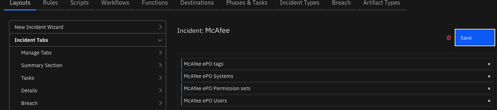
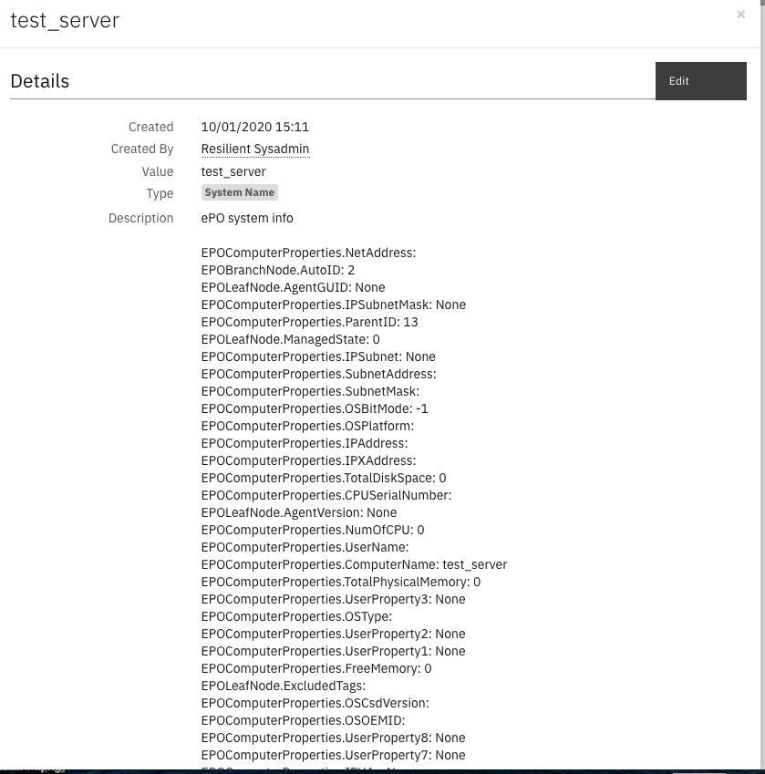

<!--
  This User README.md is generated by running:
  "resilient-sdk docgen -p fn_mcafee_epo --user-guide"

  It is best edited using a Text Editor with a Markdown Previewer. VS Code
  is a good example. Checkout https://guides.github.com/features/mastering-markdown/
  for tips on writing with Markdown

  If you make manual edits and run docgen again, a .bak file will be created

  Store any screenshots in the "doc/screenshots" directory and reference them like:
  
-->

# **User Guide:** fn_mcafee_epo_v1.0.3

## Table of Contents
- [Configuration](#configuration)
- [Key Features](#key-features)
- [Function - McAfee ePO find a system](#function---mcafee-epo-find-a-system)
- [Function - McAfee tag an ePO asset](#function---mcafee-tag-an-epo-asset)
- [Function - McAfee ePO remove tag](#function---mcafee-epo-remove-tag)
- [Function - McAfee ePO list tags](#function---mcafee-epo-list-tags)
- [Data Table - McAfee ePO tags](#data-table---mcafee-epo-tags)
- [Rules](#rules)

---
## Release Notes
<!--
  Specify all changes in this release. Do not remove the release 
  notes of a previous release
-->
### v1.0.3
* New functions
* Enhanced rules and workflows
### v1.0.2
App Host support
### v1.0.1
* Bug fixes
### v1.0.0
* Initial Release
---
## Key Features
<!--
  List the Key Features of the Integration
-->
* Add and remove tags to an ePO system
* List available tags 
* Get info on an ePO system

## Configuration
### App Host Installation
All the components for running this integration in a container already exist when using the App Host app.

To install,

* Navigate to Administrative Settings and then the Apps tab.
* Click the Install button and select the downloaded file: app-fn_mcafee_epo-x.x.x.zip.
* Go to the Configuration tab and edit the app.config file, editing the API key, user and password for McAfee ePO and making any additional setting changes.
Edit the `[fn_mcafee_epo]` portion of the app.config file:

  | Config | Required | Example | Description |
  | ------ | :------: | ------- | ----------- |
  | **epo_url** | Yes | `https://<your_epo_server>:8443` | *URL to your McAfee ePO server* |
  | **epo_username** | Yes | `<your_epo_username>` | *Login credentials* |
  | **epo_password** | Yes | `<your_epo_password>` | *Login credential* |
  | **epo_trust_cert** | Yes | `false` | *path to server certificate or false to bypass verification* |

### Integration Server Installation
* Download the `fn_mcafee_epo.zip` file.
* Copy the `.zip` to your Integration Server and SSH into it.
* **Unzip** the package:
  ```
  $ unzip fn_mcafee_epo-x.x.x.zip
  ```
* **Change Directory** into the unzipped directory:
  ```
  $ cd fn_mcafee_epo-x.x.x
  ```
* **Install** the package:
  ```
  $ pip install fn_mcafee_epo-x.x.x.tar.gz
  ```
* Import the **configurations** into your app.config file:
  ```
  $ resilient-circuits config -u -l fn-mcafee-epo
  ```
* Import the fn_mcafee_epo **customizations** into the Resilient platform:
  ```
  $ resilient-circuits customize -y -l fn-mcafee-epo
  ```
* Open the config file, scroll to the bottom and edit your fn_mcafee_epo configurations:

  | Config | Required | Example | Description |
  | ------ | :------: | ------- | ----------- |
  | **epo_url** | Yes | `https://<your_epo_server>:8443` | *URL to your McAfee ePO server* |
  | **epo_username** | Yes | `<your_epo_username>` | *Login credentials* |
  | **epo_password** | Yes | `<your_epo_password>` | *Login credential* |
  | **epo_trust_cert** | Yes | `false` | *path to server certificate or false to bypass verification* |

### Layout changes
A datatable, McAfee ePO Tags, is available to list and act upon ePO tags. Add this table to your Layout by either creating a new tab or simply drag the datatable to an existing tab.

 

## Function - McAfee ePO find a system
Find an ePO system based on a property such as system name, tag, IP address, MAC address, etc.

 

<details><summary>Inputs:</summary>
<p>

| Name | Type | Required | Example | Tooltip |
| ---- | :--: | :------: | ------- | ------- |
| `mcafee_epo_systems` | `text` | No | `server_name` | Comma separated list of Hostnames/IpAddress. These systems must be managed on ePO |

</p>
</details>

<details><summary>Outputs:</summary>
<p>

```python
results = {
  'version': '1.0',
  'success': True,
  'reason': None,
  'content': [
    {
      'EPOComputerProperties.ParentID': 13,
      'EPOComputerProperties.ComputerName': 'test_server',
      'EPOComputerProperties.Description': None,
      'EPOComputerProperties.ComputerDescription': None,
      'EPOComputerProperties.TimeZone': '',
      'EPOComputerProperties.DefaultLangID': '',
      'EPOComputerProperties.UserName': '',
      'EPOComputerProperties.DomainName': '',
      'EPOComputerProperties.IPHostName': '',
      'EPOComputerProperties.IPV6': None,
      'EPOComputerProperties.IPAddress': '',
      'EPOComputerProperties.IPSubnet': None,
      'EPOComputerProperties.IPSubnetMask': None,
      'EPOComputerProperties.IPV4x': None,
      'EPOComputerProperties.IPXAddress': '',
      'EPOComputerProperties.SubnetAddress': '',
      'EPOComputerProperties.SubnetMask': '',
      'EPOComputerProperties.NetAddress': '',
      'EPOComputerProperties.OSType': '',
      'EPOComputerProperties.OSVersion': '',
      'EPOComputerProperties.OSCsdVersion': '',
      'EPOComputerProperties.OSBuildNum': 0,
      'EPOComputerProperties.OSPlatform': '',
      'EPOComputerProperties.OSOEMID': '',
      'EPOComputerProperties.CPUType': '',
      'EPOComputerProperties.CPUSpeed': 0,
      'EPOComputerProperties.NumOfCPU': 0,
      'EPOComputerProperties.CPUSerialNumber': '',
      'EPOComputerProperties.TotalPhysicalMemory': 0,
      'EPOComputerProperties.FreeMemory': 0,
      'EPOComputerProperties.FreeDiskSpace': 0,
      'EPOComputerProperties.TotalDiskSpace': 0,
      'EPOComputerProperties.IsPortable': -1,
      'EPOComputerProperties.Vdi': -1,
      'EPOComputerProperties.OSBitMode': -1,
      'EPOComputerProperties.LastAgentHandler': None,
      'EPOComputerProperties.UserProperty1': None,
      'EPOComputerProperties.UserProperty2': None,
      'EPOComputerProperties.UserProperty3': None,
      'EPOComputerProperties.UserProperty4': None,
      'EPOComputerProperties.UserProperty5': None,
      'EPOComputerProperties.UserProperty6': None,
      'EPOComputerProperties.UserProperty7': None,
      'EPOComputerProperties.UserProperty8': None,
      'EPOComputerProperties.Free_Space_of_Drive_C': 0,
      'EPOComputerProperties.Total_Space_of_Drive_C': 0,
      'EPOLeafNode.Tags': 'Resilient',
      'EPOLeafNode.ExcludedTags': '',
      'EPOLeafNode.LastUpdate': None,
      'EPOLeafNode.ManagedState': 0,
      'EPOLeafNode.AgentGUID': None,
      'EPOLeafNode.AgentVersion': None,
      'EPOBranchNode.AutoID': 2
    }
  ],
  'raw': '[{...}]',
  'inputs': {
    'mcafee_epo_systems': 'test_server'
  },
  'metrics': {
    'version': '1.0',
    'package': 'fn-mcafee-epo',
    'package_version': '1.0.2',
    'host': 'Marks-MacBook-Pro.local',
    'execution_time_ms': 346,
    'timestamp': '2020-10-05 15:28:47'
  }
}
```

</p>
</details>

<details><summary>Workflows</summary>

  <details><summary>Example Pre-Process Script:</summary>
  <p>

  ```python
  inputs.mcafee_epo_systems = artifact.value
  ```

  </p>
  </details>

  <details><summary>Example Post-Process Script:</summary>
  <p>

  ```python
  if not results.content:
  info = u"ePO system not found"
else:
  info = u"ePO system info\n"
  for system in results.content:
    for setting in system:
      info = u"{}\n{}: {}".format(info, setting, system[setting])
      
if artifact.description:
  artifact.description = u"{}\n\n{}".format(artifact.description.content, info)
else:
  artifact.description = info
  ```

  </p>
  </details>

</details>

---
## Function - McAfee tag an ePO asset
Applies tag to systems in ePO. Inputs include:
- mcafee_epo_system: Comma separated list of Hostnames/IpAddress. These systems must be managed on ePO.
- mcafee_epo_tag: A tag managed on ePO.


<details><summary>Inputs:</summary>
<p>

| Name | Type | Required | Example | Tooltip |
| ---- | :--: | :------: | ------- | ------- |
| `mcafee_epo_systems` | `text` | No | `server_name` | Comma separated list of Hostnames/IpAddress. These systems must be managed on ePO |
| `mcafee_epo_tag` | `text` | No | `Workstation` | Tag managed on ePO |

</p>
</details>

<details><summary>Outputs:</summary>
<p>

```python
results = {
  'version': '1.0',
  'success': True,
  'reason': None,
  'content': 1,
  'raw': '1',
  'inputs': {
    'mcafee_epo_systems': 'test_server',
    'mcafee_epo_tag': "[u'Workstation']"
  },
  'metrics': {
    'version': '1.0',
    'package': 'fn-mcafee-epo',
    'package_version': '1.0.2',
    'host': 'Marks-MacBook-Pro.local',
    'execution_time_ms': 461,
    'timestamp': '2020-10-05 15:38:13'
  },
  'Systems': 'test_server',
  'Tag': "[u'Workstation']"
}
```

</p>
</details>

<details><summary>Workflows</summary>

  <details><summary>Example Pre-Process Script:</summary>
  <p>

  ```python
  inputs.mcafee_epo_systems = rule.properties.epo_system
  inputs.mcafee_epo_tag = row['epo_tag']
  ```

  </p>
  </details>

  <details><summary>Example Post-Process Script:</summary>
  <p>

  ```python
if results.content:
  note = u"ePO tags: {} applied to system: {}".format(results.inputs['mcafee_epo_tag'], results.inputs['mcafee_epo_systems'])
else:
  note = u"ePO system: {} either not found or tag already applied for tags: {}".format(results.inputs['mcafee_epo_systems'], results.inputs['mcafee_epo_tag'])
  
incident.addNote(note)
  ```

  </p>
  </details>

</details>

---
## Function - McAfee ePO remove tag
Remove a tag associated with ePO system(s).


<details><summary>Inputs:</summary>
<p>

| Name | Type | Required | Example | Tooltip |
| ---- | :--: | :------: | ------- | ------- |
| `mcafee_epo_systems` | `text` | No | `test_server` | Comma separated list of Hostnames/IpAddress. These systems must be managed on ePO |
| `mcafee_epo_tag` | `text` | No | `Workstation` | Tag managed on ePO |

</p>
</details>

<details><summary>Outputs:</summary>
<p>

```python
results = {
  'version': '1.0',
  'success': True,
  'reason': None,
  'content': 1,
  'raw': '1',
  'inputs': {
    'mcafee_epo_systems': 'test_server',
    'mcafee_epo_tag': "[u'Workstation']"
  },
  'metrics': {
    'version': '1.0',
    'package': 'fn-mcafee-epo',
    'package_version': '1.0.2',
    'host': 'Marks-MacBook-Pro.local',
    'execution_time_ms': 383,
    'timestamp': '2020-10-05 15:39:47'
  }
}
```

</p>
</details>

<details><summary>Workflows</summary>

  <details><summary>Example Pre-Process Script:</summary>
  <p>

  ```python
  inputs.mcafee_epo_systems = artifact.value
  inputs.mcafee_epo_tag = str(rule.properties.ss_tags)
  ```

  </p>
  </details>

  <details><summary>Example Post-Process Script:</summary>
  <p>

  ```python
  if not results.content:
  note = u"ePO system not found or tag not applied: {}".format(results.inputs['mcafee_epo_tag'])
else:
  note = u"ePO tag(s) removed: {}".format(results.inputs['mcafee_epo_tag'])
  
if artifact.description:
  artifact.description = u"{}\n\n{}".format(artifact.description.content, note)
else:
  artifact.description = note
  ```

  </p>
  </details>

</details>

---
## Function - McAfee ePO list tags
Find all tags specified in ePO

 

<details><summary>Inputs:</summary>
<p>

None

</p>
</details>

<details><summary>Outputs:</summary>
<p>

```python
results = {
  'version': '1.0',
  'success': True,
  'reason': None,
  'content': [
    {
      'tagNotes': 'Default tag for systems identified as a Server',
      'tagId': 1,
      'tagName': 'Server'
    },
    {
      'tagNotes': 'Default tag for systems identified as a Workstation',
      'tagId': 2,
      'tagName': 'Workstation'
    },
    {
      'tagNotes': 'This will automatically be assigned to system where the users have had Local Domain Users added.',
      'tagId': 3,
      'tagName': 'EE:ALDU'
    },
    {
      'tagNotes': 'DXL Broker',
      'tagId': 4,
      'tagName': 'DXLBROKER'
    },
    {
      'tagNotes': 'Apply Tag to TIEServers',
      'tagId': 5,
      'tagName': 'TIESERVER'
    },
    {
      'tagNotes': 'Protection Workspace tag for escalated systems',
      'tagId': 6,
      'tagName': 'Escalated'
    },
    {
      'tagNotes': 'Protection Workspace tag for systems to be excluded from the compliance check',
      'tagId': 7,
      'tagName': 'Excluded from Compliance Check'
    },
    {
      'tagNotes': 'Sample tag creation for partners',
      'tagId': 8,
      'tagName': 'IBM QRadar'
    },
    {
      'tagNotes': 'Apply Tag to Active Response Server',
      'tagId': 9,
      'tagName': 'MARSERVER'
    },
    {
      'tagNotes': 'Apply Tag to Active Response Server',
      'tagId': 10,
      'tagName': 'MARAGG'
    },
    {
      'tagNotes': '',
      'tagId': 11,
      'tagName': 'Shut Down'
    },
    {
      'tagNotes': '',
      'tagId': 12,
      'tagName': 'myTag'
    },
    {
      'tagNotes': 'aaa',
      'tagId': 13,
      'tagName': 'Ā ā Ă ă Ą ą '
    },
    {
      'tagNotes': 'Ā ā Ă ă Ą ą ',
      'tagId': 14,
      'tagName': 'Resilient'
    }
  ],
  'raw': '[{...}]',
  'inputs': {
    
  },
  'metrics': {
    'version': '1.0',
    'package': 'fn-mcafee-epo',
    'package_version': '1.0.2',
    'host': 'Marks-MacBook-Pro.local',
    'execution_time_ms': 277,
    'timestamp': '2020-10-05 15:35:35'
  }
}
```

</p>
</details>

<details><summary>Workflows</summary>

  <details><summary>Example Pre-Process Script:</summary>
  <p>

  ```python
  None
  ```

  </p>
  </details>

  <details><summary>Example Post-Process Script:</summary>
  <p>

  ```python
  if results.success:
  for tag in sorted(results.content, key = lambda i: i['tagName'].lower()):
    row = incident.addRow("mcafee_epo_tags")
    row['epo_id'] = tag['tagId']
    row['epo_tag'] = tag['tagName']
    row['epo_notes'] = tag['tagNotes']
    
  ```

  </p>
  </details>

</details>

---

## Data Table - McAfee ePO tags

#### API Name:
mcafee_epo_tags

#### Columns:
| Column Name | API Access Name | Type | Tooltip |
| ----------- | --------------- | ---- | ------- |
| Id | `epo_id` | `number` | - |
| Notes | `epo_notes` | `text` | - |
| Tag | `epo_tag` | `text` | - |

---


## Rules
| Rule Name | Object | Workflow Triggered |
| --------- | ------ | ------------------ |
| McAfee ePO remove tags | artifact | `mcafee_epo_remove_tag` |
| McAfee ePO apply a tag | mcafee_epo_tags | `mcafee_epo_apply_a_tag` |
| McAfee ePO list tags | incident | `mcafee_epo_list_tags` |
| McAfee ePO apply tags | artifact | `mcafee_epo_apply_tags` |
| McAfee ePO get system info | artifact | `mcafee_epo_get_system_info` |

---
