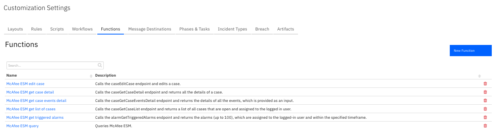
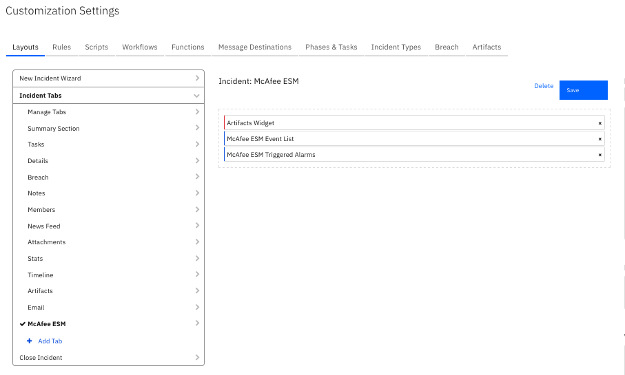

<!--
  This Install README.md is generated by running:
  "resilient-sdk docgen -p fn_mcafee_esm --install-guide"

  It is best edited using a Text Editor with a Markdown Previewer. VS Code
  is a good example. Checkout https://guides.github.com/features/mastering-markdown/
  for tips on writing with Markdown

  If you make manual edits and run docgen again, a .bak file will be created

  Store any screenshots in the "doc/screenshots" directory and reference them like:
  
-->

# fn-mcafee-esm Functions for IBM Resilient

- [Release Notes](#release-notes)
- [Overview](#overview)
- [Requirements](#requirements)
- [Installation](#installation)
- [Uninstall](#uninstall)
- [Troubleshooting & Support](#troubleshooting)

---

## Release Notes
<!--
  Specify all changes in this release. Do not remove the release 
  notes of a previous release
-->
### v1.0.2
- Support added for App Host.
- Support added for proxies.

### v1.0.1
* Fixed bug when retrieving case details. 

### v1.0.0
* Initial Release

---

## Overview
<!--
  Provide a high-level description of the function itself and its remote software or application.
  The text below is parsed from the "description" and "long_description" attributes in the setup.py file
-->
**Resilient Circuits Components for 'fn_mcafee_esm'**

 

The McAfee ESM integration with the Resilient platform allows for the escalation and enrichment 
of cases from McAfee ESM to the Resilient platform.
### Key Features
<!--
  List the Key Features of the Integration
-->
The McAfee ESM package provides the following features:
* Poll a McAfee ESM server for cases and create corresponding incidents in the Resilient platform.
* Query a McAfee ESM server.
* Get a list of cases.
* Get a case details.
* Get a case events details.
* Get triggered events.
* Update a case.  
---

## Requirements
<!--
  List any Requirements 
-->
* Resilient platform >= `v31.0.4254`
* To setup up an App Host see:  [ibm.biz/res-app-host-setup](https://ibm.biz/res-app-host-setup)
* An Integration Server running `resilient_circuits>=30.0.0`
  * To set up an Integration Server see: [ibm.biz/res-int-server-guide](https://ibm.biz/res-int-server-guide)
  * If using API Keys, minimum required permissions are:
    | Name | Permissions |
    | ---- | ----------- |
    | Org Data | Read, Edit |
    | Incident | Create, Read all |
    | Function | Read |
* Proxy supported: Yes
---


### Installation
* To install or uninstall an App using the App Host see [ibm.biz/res-install-app](https://ibm.biz/res-install-app)

* To install or uninstall an Integration using the Integration Server see the [ibm.biz/res-install-int](https://ibm.biz/res-install-int)
---

### App Configuration
The following table describes the settings you need to configure in the app.config file. If using App Host, see the Resilient System Administrator Guide. If using the integration server, see the Integration Server Guide.
| Config | Required | Example | Description |
| ------ | :------: | ------- | ----------- |
| **esm_url** | Yes | `https://mcafee_esm_server` | *URL of the McAfee ESM server.* |
| **esm_username** | Yes | `mcafee_esm_username` | *User name for McAfee ESM api access.* |
| **esm_password** | Yes | `mcafee_esm_password` | *User password for McAfee ESM api access.*  |
| **verify_cert** | Yes | `True or False` | *Use a CA cert for access to McAfee ESM server.* |
| **esm_polling_interval** | Yes | `0` | *How often polling should happen. Value is in seconds.* |
| **http_proxy** | Yes | `0` | *Optional setting for an http proxy if required.*  |
| **https_proxy** | Yes | `0` | *Optional setting for an https proxy if required.*  |

---

### Custom Layouts
<!--
  Use this section to provide guidance on where the user should add any custom fields and data tables.
  You may wish to recommend a new incident tab.
  You should save a screenshot "custom_layouts.png" in the doc/screenshots directory and reference it here
-->
* To use the functions, create a new Incident tab containing the data tables. Drag the McAfee ESM data tables on to the layout and click Save as shown in the screenshot below:
  

---

## Uninstall
* SSH into your Integration Server.
* **Uninstall** the package:
  ```
  $ pip uninstall fn-mcafee-esm
  ```
* Open the config file, scroll to the [fn_mcafee_esm] section and remove the section or prefix `#` to comment out the section.
* **Save** and **Close** the app.config file.

---

## Troubleshooting & Support
If using the app with an App Host, see the Resilient System Administrator Guide and the App Host Deployment Guide for troubleshooting procedures. You can find these guides on the [IBM Knowledge Center](https://www.ibm.com/support/knowledgecenter/SSBRUQ), where you can select which version of the Resilient platform you are using.

If using the app with an integration server, see the [Integration Server Guide](https://ibm.biz/res-int-server-guide)

### For Support
This is an IBM Supported app. Please search https://ibm.com/mysupport for assistance.

