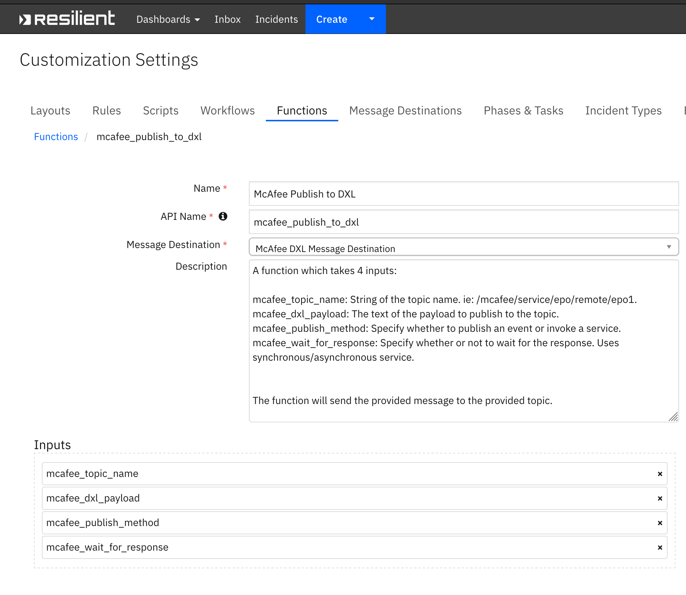

<!--
  This README.md is generated by running:
  "resilient-sdk docgen -p fn_mcafee_opendxl"

  It is best edited using a Text Editor with a Markdown Previewer. VS Code
  is a good example. Checkout https://guides.github.com/features/mastering-markdown/
  for tips on writing with Markdown

  If you make manual edits and run docgen again, a .bak file will be created

  Store any screenshots in the "doc/screenshots" directory and reference them like:
  
-->

# McAfee OpenDXL Functions for IBM Resilient

## Table of Contents
- [Release Notes](#release-notes)
- [Overview](#overview)
  - [Key Features](#key-features)
- [Installation](#installation)
  - [Requirements](#requirements)
  - [Install](#install)
  - [App Configuration](#app-configuration)
- [Function - McAfee Publish to DXL](#function---mcafee-publish-to-dxl)
- [Rules](#rules)
- [Troubleshooting & Support](#troubleshooting-&-support)
---

## Release Notes
<!--
  Specify all changes in this release. Do not remove the release 
  notes of a previous release
-->
### v1.2.0
* App Host support
### v1.1.0
* Added Resilient Subscriber component

### v1.0.0
* Initial Release

---

## Overview
<!--
  Provide a high-level description of the function itself and its remote software or application.
  The text below is parsed from the "description" and "long_description" attributes in the setup.py file
-->
**Resilient Circuits Components for McAfee publishing to DXL Functions**

 

Resilient Circuits Components for McAfee publishing to DXL Functions

### Key Features
<!--
  List the Key Features of the Integration
-->
* The McAfee Publish to DXL function contains the ability to publish a synchronous or asynchronous message to an event or a service.
 * The McAfee DXL Subscriber listens on defined topics and maps the data to the Resilient platform to create incidents and artifacts.

---

## Installation

### Requirements
<!--
  List any Requirements 
-->
* Resilient platform >= `v36.0.5634`
* An App Host or an Integration Server:
  * To setup up an App Host see:  [ibm.biz/res-app-host-setup](https://ibm.biz/res-app-host-setup)
  * An Integration Server running `resilient_circuits>=30.0.0` (if using an Integration Server)
    * To set up an Integration Server see: [ibm.biz/res-int-server-guide](https://ibm.biz/res-int-server-guide)
    * If using an API key account, minimum required permissions are:
      | Name | Permissions |
      | ---- | ----------- |
      | Org Data | Read |
      | Function | Read |
* Proxy supported: Yes/No

---

### Install
* To install or uninstall an App using the App Host see [ibm.biz/res-install-app](https://ibm.biz/res-install-app)

* To install or uninstall an Integration using the Integration Server see the [ibm.biz/res-install-int](https://ibm.biz/res-install-int)
---

### App Configuration
The following table describes the settings you need to configure in the app.config file. If using App Host, see the Resilient System Administrator Guide. If using the integration server, see the Integration Server Guide.

| Config | Required | Example | Description |
| ------ | :------: | ------- | ----------- |
| **dxlclient_config** | Yes | `/home/integration/.resilient/fn_mcafee_opendxl/dxlclient.config` | *Enter a description of the config here.* |
| **topic_listener_on** | Yes | `False` | *Enter a description of the config here.* |
| **custom_template_dir** | No | `` | *Enter a description of the config here.* |

---


## Function - McAfee Publish to DXL
A function which takes 4 inputs:

mcafee_topic_name: String of the topic name. ie: /mcafee/service/epo/remote/epo1.
mcafee_dxl_payload: The text of the payload to publish to the topic.
mcafee_publish_method: Specify whether to publish an event or invoke a service.
mcafee_wait_for_response: Specify whether or not to wait for the response. Uses synchronous/asynchronous service.


The function will send the provided message to the provided topic.

 

<details><summary>Inputs:</summary>
<p>

| Name | Type | Required | Example | Tooltip |
| ---- | :--: | :------: | ------- | ------- |
| `mcafee_dxl_payload` | `text` | Yes | `-` | The text of the payload to publish to the topic |
| `mcafee_publish_method` | `select` | Yes | `-` | Specify whether to publish an event or invoke a service |
| `mcafee_topic_name` | `text` | Yes | `-` | String of the topic name. ie: /mcafee/service/epo/remote/epo1 |
| `mcafee_wait_for_response` | `select` | No | `-` | Specify whether or not to wait for the response. Uses synchronous/asynchronous service |

</p>
</details>

<details><summary>Outputs:</summary>
<p>

```python
results = {
    # TODO: Copy and paste an example of the Function Output within this code block.
    # To view the output of a Function, run resilient-circuits in DEBUG mode and invoke the Function. 
    # The Function results will be printed in the logs: "resilient-circuits run --loglevel=DEBUG"
}
```

</p>
</details>

<details><summary>Example Pre-Process Script:</summary>
<p>

```python
# Replaces trust level string with acceptable value to publish to topic

inputs.mcafee_dxl_payload = inputs.mcafee_dxl_payload.replace("\"Known Malicious\"", "1")

inputs.mcafee_dxl_payload = inputs.mcafee_dxl_payload.replace("\"Most Likely Malicious\"", "15")

inputs.mcafee_dxl_payload = inputs.mcafee_dxl_payload.replace("\"Might Be Malicious\"", "30")

```

</p>
</details>

<details><summary>Example Post-Process Script:</summary>
<p>

```python
"""
Response returned provides the input values in the following format
{
  "mcafee_topic_name": "<topic_name>",
  "mcafee_dxl_payload": "<payload>",
  "mcafee_publish_method": "<method>",
  "mcafee_wait_for_response": "<wait for response>"
"""

trust_level = ""

content = results.get("content")

if content.get("mcafee_dxl_payload").find("30") > 0:
  trust_level = "Might Be Malicious"
  
elif content.get("mcafee_dxl_payload").find("15") > 0:
  trust_level = "Most Likely Malicious"

elif content.get("mcafee_dxl_payload").find("1") > 0:
  trust_level = "Known Malicious"


text = """The following was published to DXL:<br>
<b>Payload:</b> {}<br>
<b>Topic:</b> {}<br>
<b>Method:</b> {}<br>

Setting Trust Level to {}
""".format(content.get("mcafee_dxl_payload"), content.get("mcafee_topic_name"), content.get("mcafee_publish_method"), trust_level)

noteText = helper.createRichText(text)
incident.addNote(noteText)
```

</p>
</details>

---


## Rules
| Rule Name | Object | Workflow Triggered |
| --------- | ------ | ------------------ |
| (Example) McAfee Publish to DXL (Set TIE Reputation Known Malicious) | incident | `example_mcafee_publish_to_dxl_set_tie_reputation` |
| (Example) McAfee Publish to DXL (Tag System Shut Down) | incident | `example_mcafee_publish_to_dxl_tag_system` |

---
## DXL Subscriber 

<p>
The DXL subscriber is designed using Resilient Circuits but does not rely on the functions
capabilities. The subscriber connects to the Data Exchange Layer and listens on the topic
specified topic(s). When a message is sent to the topic, the integration uses a mapping template
to map the data into a Resilient incident DTO and create incidents and artifacts within the Resilient
platform. 
<p>
To use the DXL Subscriber, set the topic_listener_on configuration parameter to True.
<p>
When you run Resilient Circuits, the subscriber listens on the default topic,
/mcafee/event/epo/threat/response, and uses the default provided jinja template to map incident and artifact data into the Resilient Platform.

---

## Troubleshooting & Support
If using the app with an App Host, see the Resilient System Administrator Guide and the App Host Deployment Guide for troubleshooting procedures. You can find these guides on the [IBM Knowledge Center](https://www.ibm.com/support/knowledgecenter/SSBRUQ), where you can select which version of the Resilient platform you are using.

If using the app with an integration server, see the [Integration Server Guide](https://ibm.biz/res-int-server-guide)

### For Support
This is an IBM Supported app. Please search https://ibm.com/mysupport for assistance.
