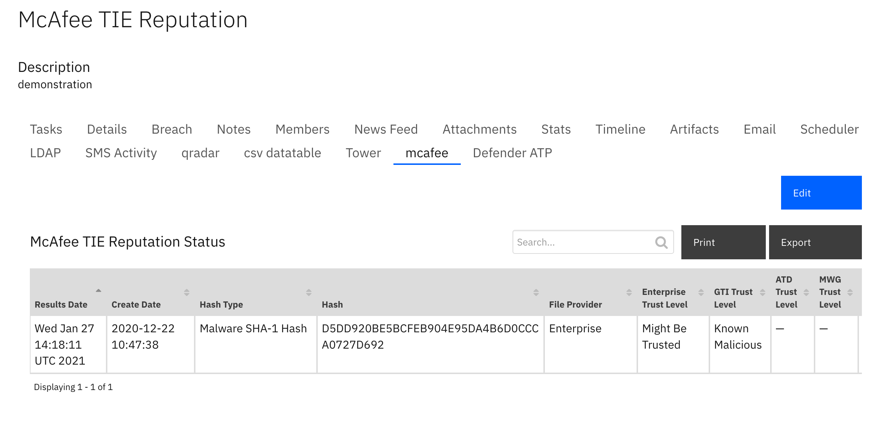

<!--
  This README.md is generated by running:
  "resilient-sdk docgen -p fn_mcafee_tie"

  It is best edited using a Text Editor with a Markdown Previewer. VS Code
  is a good example. Checkout https://guides.github.com/features/mastering-markdown/
  for tips on writing with Markdown

  If you make manual edits and run docgen again, a .bak file will be created

  Store any screenshots in the "doc/screenshots" directory and reference them like:
  
-->

# McAfee Threat Intelligence Exchange (TIE) Functions for IBM Resilient

## Table of Contents
- [Release Notes](#release-notes)
- [Overview](#overview)
  - [Key Features](#key-features)
- [Installation](#installation)
  - [Requirements](#requirements)
  - [Install](#install)
  - [App Configuration](#app-configuration)
  - [Custom Layouts](#custom-layouts)
- [Function - McAfee TIE search hash](#function---mcafee-tie-search-hash)
- [Data Table - TIE Results](#data-table---tie-results)
- [Rules](#rules)
- [Troubleshooting & Support](#troubleshooting-&-support)
---

## Release Notes
<!--
  Specify all changes in this release. Do not remove the release 
  notes of a previous release
-->
### v1.0.2
* Support added for App Host.

### v1.0.1
* Support added for App Host.

### v1.0.0
* Initial Release

---

## Overview
<!--
  Provide a high-level description of the function itself and its remote software or application.
  The text below is parsed from the "description" and "long_description" attributes in the setup.py file
-->
**Resilient Circuits Components for McAfee TIE Functions**


<p>
The  McAfee TIE Functions for IBM Resilient provides the ability to search McAfee Threat Intelliegence Exchange (TIE) server for information on a specific file hash.  This information can come from any of the providers:

*  Enterprise
*  GTI
* ATD
* MWG

In addition, a system list is returned by the function.

---

## Installation

### Requirements
<!--
  List any Requirements 
-->
* Resilient platform >= `v35.0.0`
  * To setup up an App Host see:  [ibm.biz/res-app-host-setup](https://ibm.biz/res-app-host-setup)
* An Integration Server running `resilient_circuits>=30.0.0` (if using an Integration Server)
  * To set up an Integration Server see: [ibm.biz/res-int-server-guide](https://ibm.biz/res-int-server-guide)
  * If using an API key account, minimum required permissions are:
    | Name | Permissions |
    | ---- | ----------- |
    | Org Data | Read |
    | Function | Read |

---

### Install
* To install or uninstall an App using the App Host see [ibm.biz/res-install-app](https://ibm.biz/res-install-app)

* To install or uninstall an Integration using the Integration Server see the [ibm.biz/res-install-int](https://ibm.biz/res-install-int)
---

### App Configuration
The following table describes the settings you need to configure in the app.config file. If using App Host, see the Resilient System Administrator Guide. If using the integration server, see the Integration Server Guide.

| Config | Required | Example | Description |
| ------ | :------: | ------- | ----------- |
| **dxlclient_config** | Yes | `/home/integration/.resilient/mcafee_tie/dxlclient.config` | *Path to the dxlclient.config file* |

<p>
Before running the McAfee TIE functions, the dxlclient.config, certificates and key files must be created using a provisioning command.  More information on the dxlclient.config file and provisioning the system can be found here:

[https://opendxl.github.io/opendxl-client-python/pydoc/provisioningoverview.html](https://opendxl.github.io/opendxl-client-python/pydoc/provisioningoverview.html)

[https://opendxl.github.io/opendxl-client-python/pydoc/basiccliprovisioning.html#basiccliprovisioning](https://opendxl.github.io/opendxl-client-python/pydoc/basiccliprovisioning.html#basiccliprovisioning)

Here is an example of the dxlclient CLI provisioning command:

```python -m dxlclient -vv provisionconfig /home/integration/.resilient/fn_mcafee_tie X.X.X.X client1 -u admin -p password```

In this example, ```X.X.X.X``` is the IP address of the McAfee ePO server or OpenDXL Broker. 

 The directory 
```/home/integration/.resilient/fn_mcafee_tie```
 is the location where the generated files will be created.

In an App Host environment, cut and paste the contents of all the generated files into the App Settings Configuration tab in the Resilient UI in the File Locations ```/etc/rescircuits/fn_mcafee_tie```  

Here is a screen shot of these files in an App Host environment:


---

### Custom Layouts
<!--
  Use this section to provide guidance on where the user should add any custom fields and data tables.
  You may wish to recommend a new incident tab.
  You should save a screenshot "custom_layouts.png" in the doc/screenshots directory and reference it here
-->
* Customize the Artifacts Tab page by dragging the TIE Results data table on to it as pictured below or create your own McAfee TIE incident tab and drag the TIE Results on to it:


---

## Function - McAfee TIE search hash
A function which takes two inputs:

mcafee_tie_hash_type: The type of file hash (md5, sha1, sha256).
mcafee_tie_hash: The value of the hash.

The function returns a JSON object containing the available information from the different file providers (Enterprise, GTI, ATD, MWG) along with the list of systems related to it.

 

<details><summary>Inputs:</summary>
<p>

| Name | Type | Required | Example | Tooltip |
| ---- | :--: | :------: | ------- | ------- |
| `mcafee_tie_hash` | `text` | No | `-` | The value of the hash |
| `mcafee_tie_hash_type` | `text` | No | `-` | The type of file hash (md5, sha1, sha256) |

</p>
</details>

<details><summary>Outputs:</summary>
<p>

```python
results = {  
 "GTI":{  
    "File Provider":"GTI",
    "Attributes":{  

    },
    "Create Date":"2018-02-21 12:17:10",
    "Trust Level":"Known Malicious"
 },
 "ATD":{  
    "File Provider":"ATD",
    "Create Date":"2018-03-14 11:53:09",
    "Trust Level":"Most Likely Malicious"
 },
 "MWG":{  
    "File Provider":"MWG",
    "Create Date":"2018-03-14 11:53:55",
    "Trust Level":"Most Likely Malicious"
 },
 "Enterprise":{  
    "File Provider":"Enterprise",
    "Attributes":{  
       "Average Local Rep":"Most Likely Malicious",
       "First Contact":"2018-02-21 12:17:10",
       "Min Local Rep":"Most Likely Malicious",
       "Is Prevalent":"0",
       "File Name Count":"1",
       "Max Local Rep":"Most Likely Malicious"
    },
    "Create Date":"2018-02-21 12:17:10",
    "Trust Level":"Most Likely Malicious"
 }
 "system_list":[{
   "date": 1519233563,
   "agentGuid": {a00728ff-3187-46c1-97d2-8e0f26ea940b}
 }]
}
```

</p>
</details>

<details><summary>Workflows:</summary>

<p>

 


  <details><summary>Example Pre-Process Script:</summary>
  <p>

  ```python
  if artifact.type == "Malware MD5 Hash":
  inputs.mcafee_tie_hash_type = "md5"
  inputs.mcafee_tie_hash = artifact.value
elif artifact.type == "Malware SHA-1 Hash":
  inputs.mcafee_tie_hash_type = "sha1"
  inputs.mcafee_tie_hash = artifact.value
elif artifact.type == "Malware SHA-256 Hash":
  inputs.mcafee_tie_hash_type = "sha256"
  inputs.mcafee_tie_hash = artifact.value
else:
  helper.fail("Artifact hash was not set correctly")

  ```

  </p>
  </details>

  <details><summary>Example Post-Process Script:</summary>
  <p>

  ```python
  """
Data returned will be in the following structure


{  
   "GTI":{  
      "File Provider":"GTI",
      "Attributes":{  

      },
      "Create Date":"2018-02-21 12:17:10",
      "Trust Level":"Known Malicious"
   },
   "ATD":{  
      "File Provider":"ATD",
      "Create Date":"2018-03-14 11:53:09",
      "Trust Level":"Most Likely Malicious"
   },
   "MWG":{  
      "File Provider":"MWG",
      "Create Date":"2018-03-14 11:53:55",
      "Trust Level":"Most Likely Malicious"
   },
   "Enterprise":{  
      "File Provider":"Enterprise",
      "Attributes":{  
         "Average Local Rep":"Most Likely Malicious",
         "First Contact":"2018-02-21 12:17:10",
         "Min Local Rep":"Most Likely Malicious",
         "Is Prevalent":"0",
         "File Name Count":"1",
         "Max Local Rep":"Most Likely Malicious"
      },
      "Create Date":"2018-02-21 12:17:10",
      "Trust Level":"Most Likely Malicious"
   }
   "system_list":[{
     "date": 1519233563,
     "agentGuid": {a00728ff-3187-46c1-97d2-8e0f26ea940b}
   }]
}
"""

row = incident.addRow("tie_results")
row["hash_type"] = artifact.type
row["hash"] = artifact.value
row["file_provider"] = results["Enterprise"]["File Provider"]
row["trust_level"] = results["Enterprise"]["Trust Level"]
row["tie_create_date"] = results["Enterprise"]["Create Date"]


  ```

  </p>
  </details>

</details>

 </p>
</details>

---


## Data Table - TIE Results

 

#### API Name:
tie_results

#### Columns:
| Column Name | API Access Name | Type | Tooltip |
| ----------- | --------------- | ---- | ------- |
| File Provider | `file_provider` | `text` | - |
| Hash | `hash` | `text` | - |
| Hash Type | `hash_type` | `text` | - |
| Create Date | `tie_create_date` | `text` | - |
| Trust Level | `trust_level` | `text` | - |

---


## Rules
| Rule Name | Object | Workflow Triggered |
| --------- | ------ | ------------------ |
| (Example) McAfee artifact hash search | artifact | `mcafee_tie_hash_search_workflow` |

<details><summary>Rules:</summary>

<p>

 

</p>
</details>

---

## Troubleshooting & Support
If using the app with an App Host, see the Resilient System Administrator Guide and the App Host Deployment Guide for troubleshooting procedures. You can find these guides on the [IBM Knowledge Center](https://www.ibm.com/support/knowledgecenter/SSBRUQ), where you can select which version of the Resilient platform you are using.

If using the app with an integration server, see the [Integration Server Guide](https://ibm.biz/res-int-server-guide)

### For Support
This is an IBM Supported app. Please search https://ibm.com/mysupport for assistance.
