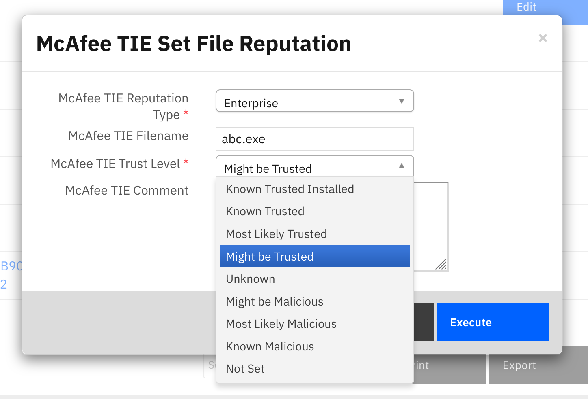

<!--
  This README.md is generated by running:
  "resilient-sdk docgen -p fn_mcafee_tie"

  It is best edited using a Text Editor with a Markdown Previewer. VS Code
  is a good example. Checkout https://guides.github.com/features/mastering-markdown/
  for tips on writing with Markdown

  If you make manual edits and run docgen again, a .bak file will be created

  Store any screenshots in the "doc/screenshots" directory and reference them like:
  

  NOTE: If your app is available in the container-format only, there is no need to mention the integration server in this readme.
-->

# None

## Table of Contents
- [Release Notes](#release-notes)
- [Overview](#overview)
  - [Key Features](#key-features)
- [Requirements](#requirements)
  - [Resilient platform](#resilient-platform)
  - [Cloud Pak for Security](#cloud-pak-for-security)
  - [Proxy Server](#proxy-server)
- [Installation](#installation)
  - [Install](#install)
  - [App Configuration](#app-configuration)
  - [Custom Layouts](#custom-layouts)
- [Function - McAfee TIE: Set File Reputation](#function---mcafee-tie-set-file-reputation)
- [Function - McAfee TIE search hash](#function---mcafee-tie-search-hash)
- [Data Table - TIE Results](#data-table---tie-results)
- [Rules](#rules)
- [Troubleshooting & Support](#troubleshooting--support)
---

## Release Notes
<!--
  Specify all changes in this release. Do not remove the release 
  notes of a previous release
-->
| Version | Date | Notes |
| ------- | ---- | ----- |
| 1.1.0 | 1/2021 | Added Feature: Get, Set Reputation |
| 1.0.2 | 09/2020 | Bug fixes |
| 1.0.1 | 05/2020 | App Host support |
| 1.0.0 | 05/2018 | Initial Release |

---

## Overview
<!--
  Provide a high-level description of the function itself and its remote software or application.
  The text below is parsed from the "description" and "long_description" attributes in the setup.py file
-->
**Resilient Circuits Components for McAfee TIE Functions**

 

The  McAfee TIE Functions for IBM Resilient provides the ability to search and set file reputation within McAfee Threat Intelligence Exchange (TIE) server for information on a specific file hash.  This information can come from any of the providers:

*  Enterprise
*  GTI
*  ATD
*  MWG

In addition, a system list is returned by the function.

### Key Features
<!--
  List the Key Features of the Integration
-->
* Search for hashes in McAfee TIE
* Set file reputation trust levels on file hashes

---

## Requirements
<!--
  List any Requirements 
-->
This app supports the IBM Resilient SOAR Platform and the IBM Cloud Pak for Security.

### Resilient platform
The Resilient platform supports two app deployment mechanisms, App Host and integration server.

If deploying to a Resilient platform with an App Host, the requirements are:
* Resilient platform >= `36.0.5634`.
* The app is in a container-based format (available from the AppExchange as a `zip` file).

If deploying to a Resilient platform with an integration server, the requirements are:
* Resilient platform >= `36.0.5634`.
* The app is in the older integration format (available from the AppExchange as a `zip` file which contains a `tar.gz` file).
* Integration server is running `resilient_circuits>=30.0.0`.
* If using an API key account, make sure the account provides the following minimum permissions: 
  | Name | Permissions |
  | ---- | ----------- |
  | Org Data | Read |
  | Function | Read |

The following Resilient platform guides provide additional information: 
* _App Host Deployment Guide_: provides installation, configuration, and troubleshooting information, including proxy server settings. 
* _Integration Server Guide_: provides installation, configuration, and troubleshooting information, including proxy server settings.
* _System Administrator Guide_: provides the procedure to install, configure and deploy apps. 

The above guides are available on the IBM Knowledge Center at [ibm.biz/resilient-docs](https://ibm.biz/resilient-docs). On this web page, select your Resilient platform version. On the follow-on page, you can find the _App Host Deployment Guide_ or _Integration Server Guide_ by expanding **Resilient Apps** in the Table of Contents pane. The System Administrator Guide is available by expanding **System Administrator**.

### Cloud Pak for Security
If you are deploying to IBM Cloud Pak for Security, the requirements are:
* IBM Cloud Pak for Security >= 1.4.
* Cloud Pak is configured with an App Host.
* The app is in a container-based format (available from the AppExchange as a `zip` file).

The following Cloud Pak guides provide additional information: 
* _App Host Deployment Guide_: provides installation, configuration, and troubleshooting information, including proxy server settings. From the Table of Contents, select Case Management and Orchestration & Automation > **Orchestration and Automation Apps**.
* _System Administrator Guide_: provides information to install, configure, and deploy apps. From the IBM Cloud Pak for Security Knowledge Center table of contents, select Case Management and Orchestration & Automation > **System administrator**.

These guides are available on the IBM Knowledge Center at [ibm.biz/cp4s-docs](https://ibm.biz/cp4s-docs). From this web page, select your IBM Cloud Pak for Security version. From the version-specific Knowledge Center page, select Case Management and Orchestration & Automation.

### Proxy Server
The app supports a proxy server. See the DXL Configuration file for settings.

---

## Installation

### Install
* To install or uninstall an App or Integration on the _Resilient platform_, see the documentation at [ibm.biz/resilient-docs](https://ibm.biz/resilient-docs).
* To install or uninstall an App on _IBM Cloud Pak for Security_, see the documentation at [ibm.biz/cp4s-docs](https://ibm.biz/cp4s-docs) and follow the instructions above to navigate to Orchestration and Automation.

### App Configuration
The following table provides the settings you need to configure the app. These settings are made in the app.config file. See the documentation discussed in the Requirements section for the procedure.

| Config | Required | Example | Description |
| ------ | :------: | ------- | ----------- |
| **dxlclient_config** | Yes | `/var/rescircuits/fn_mcafee_tie/dxlclient.config` | *DXLClient configuration file. See the [OpenDXL documentation](https://opendxl.github.io/opendxl-client-python/pydoc/updatingconfigfromcli.html) for instructions on how to set.* |

#### App Host Configuration
Since McAfee TIE references it's own configuration file, this file needs to be added to the files available to the container running this app for App Host. This is done by referring to the location of config file as `/var/rescircuits/fn_mcafee_tie/dxlclient.config` within the container and then including that file in the files available to the app. See the snapshot below for an example. 


In addition to the dxlclient.config file, three certificate files need to be added to the app: ca-bundle.crt, client.crt, client.key. These files were built when you generated the dxlclient.config file and will be included in the same folder location. Be aware that all references to the folder (ex. `/var/rescircuits/fn_mcafee_tie/`) must be specified the same way. That is, all references to the file path should contain the trailing slash or all references should leave it off.


### Custom Layouts
<!--
  Use this section to provide guidance on where the user should add any custom fields and data tables.
  You may wish to recommend a new incident tab.
  You should save a screenshot "custom_layouts.png" in the doc/screenshots directory and reference it here
-->
* Import the Data Table, TIE Results, like the screenshot below. Your setup may use a different tab:

  


#### Custom Artifact Type
A new artifact type is provided, `Certificate SHA-1 Hash`. This can be used to create new artifacts
which are different than Malware SHA-1 Hash artifacts. The latter are used for getting and 
setting reputations.
---

## Function - McAfee TIE: Set File Reputation
Set a file's reputation. This works on MD5, SH1 and SHA256 hashes. Either 'Enterprise' or 'External'
reputations can be set.

Manual action rules are available from an artifact or from the TIE Results datatable.

 

<details><summary>Inputs:</summary>
<p>

| Name | Type | Required | Example | Tooltip |
| ---- | :--: | :------: | ------- | ------- |
| `mcafee_tie_reputation_type` | `text` | Yes | `External | Enterprise` | - |
| `mcafee_tie_comment` | `text` | No | `-` | - |
| `mcafee_tie_filename` | `text` | No | `-` | Used for new reputation entries |
| `mcafee_tie_hash` | `text` | Yes | `D5DD920BE5BCFEB904E95DA4B6D0CCCA0727D692` | The value of the hash |
| `mcafee_tie_hash_type` | `text` | Yes | `md5` | The type of file hash (md5, sha1, sha256) |
| `mcafee_tie_trust_level` | `select` | Yes | `Most Likely Malicious` | - |

</p>
</details>

<details><summary>Outputs:</summary>
<p>

```python
results = {
  'version': '1.0',
  'success': True,
  'reason': None,
  'content': {
    'hashes': {
      'sha1': 'd5dd920be5bcfeb904e95da4b6d0ccca0727d692'
    },
    'oldReputations': {
      3: {
        'createDate': 1608652058,
        'providerId': 3,
        'trustLevel': 50,
        'attributes': {
          '2101652': '1',
          '2123156': '0',
          '2098277': '0',
          '2102165': '1608652058',
          '2114965': '1',
          '2111893': '4',
          '2139285': '216172786408751223'
        }
      },
      1: {
        'createDate': 1608652105,
        'providerId': 1,
        'trustLevel': 1,
        'attributes': {
          '2120340': '2134902792'
        }
      }
    },
    'newReputations': {
      3: {
        'createDate': 1608652058,
        'providerId': 3,
        'trustLevel': 99,
        'attributes': {
          '2101652': '1',
          '2123156': '0',
          '2098277': '0',
          '2102165': '1608652058',
          '2114965': '1',
          '2111893': '4',
          '2139285': '216172786408751223'
        }
      },
      1: {
        'createDate': 1608652105,
        'providerId': 1,
        'trustLevel': 1,
        'attributes': {
          '2120340': '2134902792'
        }
      }
    },
    'updateTime': 1608669082
  },
  'raw': '{"hashes": {"sha1": "d5dd920be5bcfeb904e95da4b6d0ccca0727d692"}, "oldReputations": {"3": {"createDate": 1608652058, "providerId": 3, "trustLevel": 50, "attributes": {"2101652": "1", "2123156": "0", "2098277": "0", "2102165": "1608652058", "2114965": "1", "2111893": "4", "2139285": "216172786408751223"}}, "1": {"createDate": 1608652105, "providerId": 1, "trustLevel": 1, "attributes": {"2120340": "2134902792"}}}, "newReputations": {"3": {"createDate": 1608652058, "providerId": 3, "trustLevel": 99, "attributes": {"2101652": "1", "2123156": "0", "2098277": "0", "2102165": "1608652058", "2114965": "1", "2111893": "4", "2139285": "216172786408751223"}}, "1": {"createDate": 1608652105, "providerId": 1, "trustLevel": 1, "attributes": {"2120340": "2134902792"}}}, "updateTime": 1608669082}',
  'inputs': {
    'mcafee_tie_hash_type': 'Malware SHA-1 Hash',
    'mcafee_tie_hash': 'D5DD920BE5BCFEB904E95DA4B6D0CCCA0727D692',
    'mcafee_tie_trust_level': {
      'id': 880,
      'name': 'Known Trusted'
    },
    'mcafee_tie_comment': None
  },
  'metrics': {
    'version': '1.0',
    'package': 'fn-mcafee-tie',
    'package_version': '1.1.0',
    'host': 'Marks-MacBook-Pro.local',
    'execution_time_ms': 5048,
    'timestamp': '2020-12-22 15:31:27'
  }
}
```

</p>
</details>

<details><summary>Example Pre-Process Script:</summary>
<p>

```python
inputs.mcafee_tie_reputation_type = str(rule.properties.mcafee_tie_reputation_type)
inputs.mcafee_tie_trust_level = str(rule.properties.mcafee_tie_trust_level)
inputs.mcafee_tie_comment = rule.properties.mcafee_tie_comment.content
inputs.mcafee_tie_filename = rule.properties.mcafee_tie_filename
inputs.mcafee_tie_hash_type = artifact.type
inputs.mcafee_tie_hash = artifact.value
```

</p>
</details>

<details><summary>Example Post-Process Script:</summary>
<p>

```python
note = u"McAfee TIE File Reputation: {}\nReputation Type: {}\nHash: {} ({})\nFile Name: {}\nComment: {}"\
            .format(results.inputs['mcafee_tie_trust_level']['name'],
                    results.inputs['mcafee_tie_reputation_type']['name'],
                    results.inputs['mcafee_tie_hash'],
                    artifact.type,
                    results.inputs['mcafee_tie_filename'],
                    results.inputs['mcafee_tie_comment'])

if results.content:
    incident.addNote("Set reputation successful\n{}".format(note))
else:
    incident.addNote("Set reputation unsuccessful. An internal McAfee error has occurred.\n{}".format(note))
```

</p>
</details>

---
## Function - McAfee TIE search hash
A function which takes two inputs:

mcafee_tie_hash_type: The type of file hash (md5, sha1, sha256).
mcafee_tie_hash: The value of the hash.

The function returns back a dict of all the available information from the different file providers (Enterprise, GTI, ATD, MWG) along with the list of systems related to it.


<details><summary>Inputs:</summary>
<p>

| Name | Type | Required | Example | Tooltip |
| ---- | :--: | :------: | ------- | ------- |
| `mcafee_tie_hash` | `text` | Yes | `DB1AEC5222075800EDA75D7205267569679B424E5C58A28102417F46D3B5790D` | The value of the hash |
| `mcafee_tie_hash_type` | `text` | Yes | `sha-256` | The type of file hash (md5, sha1, sha256) |

</p>
</details>

<details><summary>Outputs:</summary>
<p>

```python
results = {
  'version': '1.0',
  'success': True,
  'reason': None,
  'content': {
    'mcafee_topic_name': '/mcafee/event/epo/threat/response',
    'mcafee_dxl_payload': '{"hashes": [{"type": "md5", "value": "Dk0TzJrwTMZLaPw4/goNrA=="}], "providerId": 3, "trustLevel": 1}',
    'mcafee_publish_method': 'Service',
    'mcafee_wait_for_response': 'No'
  },
  'raw': '{"mcafee_topic_name": "/mcafee/event/epo/threat/response", "mcafee_dxl_payload": "{\\"hashes\\": [{\\"type\\": \\"md5\\", \\"value\\": \\"Dk0TzJrwTMZLaPw4/goNrA==\\"}], \\"providerId\\": 3, \\"trustLevel\\": 1}", "mcafee_publish_method": "Service", "mcafee_wait_for_response": "No"}',
  'inputs': {
    'mcafee_publish_method': {
      'id': 205,
      'name': 'Service'
    },
    'mcafee_topic_name': '/mcafee/event/epo/threat/response',
    'mcafee_dxl_payload': '{"hashes": [{"type": "md5", "value": "Dk0TzJrwTMZLaPw4/goNrA=="}], "providerId": 3, "trustLevel": 1}',
    'mcafee_wait_for_response': {
      'id': 203,
      'name': 'No'
    }
  },
  'metrics': {
    'version': '1.0',
    'package': 'fn-mcafee-opendxl',
    'package_version': '1.2.0',
    'host': 'Marks-MacBook-Pro.local',
    'execution_time_ms': 0,
    'timestamp': '2020-12-22 15:31:49'
  },
  'mcafee_topic_name': '/mcafee/event/epo/threat/response',
  'mcafee_dxl_payload': '{"hashes": [{"type": "md5", "value": "Dk0TzJrwTMZLaPw4/goNrA=="}], "providerId": 3, "trustLevel": 1}',
  'mcafee_publish_method': 'Service',
  'mcafee_wait_for_response': 'No'
}
```

</p>
</details>

<details><summary>Example Pre-Process Script:</summary>
<p>

```python
if artifact.type == "Malware MD5 Hash":
  inputs.mcafee_tie_hash_type = "md5"
  inputs.mcafee_tie_hash = artifact.value
elif artifact.type == "Malware SHA-1 Hash":
  inputs.mcafee_tie_hash_type = "sha1"
  inputs.mcafee_tie_hash = artifact.value
elif artifact.type == "Malware SHA-256 Hash":
  inputs.mcafee_tie_hash_type = "sha256"
  inputs.mcafee_tie_hash = artifact.value
else:
  helper.fail("Artifact hash was not set correctly")

```

</p>
</details>

<details><summary>Example Post-Process Script:</summary>
<p>

```python
"""
Data returned will be in the following structure


{  
   "GTI":{  
      "File Provider":"GTI",
      "Attributes":{  

      },
      "Create Date":"2018-02-21 12:17:10",
      "Trust Level":"Known Malicious"
   },
   "ATD":{  
      "File Provider":"ATD",
      "Create Date":"2018-03-14 11:53:09",
      "Trust Level":"Most Likely Malicious"
   },
   "MWG":{  
      "File Provider":"MWG",
      "Create Date":"2018-03-14 11:53:55",
      "Trust Level":"Most Likely Malicious"
   },
   "Enterprise":{  
      "File Provider":"Enterprise",
      "Attributes":{  
         "Average Local Rep":"Most Likely Malicious",
         "First Contact":"2018-02-21 12:17:10",
         "Min Local Rep":"Most Likely Malicious",
         "Is Prevalent":"0",
         "File Name Count":"1",
         "Max Local Rep":"Most Likely Malicious"
      },
      "Create Date":"2018-02-21 12:17:10",
      "Trust Level":"Most Likely Malicious"
   }
   "system_list":[{
     "date": 1519233563,
     "agentGuid": {a00728ff-3187-46c1-97d2-8e0f26ea940b}
   }]
}
"""

import java.util.Date as Date

if results.get("Enterprise"):
    row = incident.addRow("tie_results")
    row['results_date'] = str(Date())
    row["hash_type"] = artifact.type
    row["hash"] = artifact.value
    row["ent_trust_level"] = results["Enterprise"].get("Trust Level")
    row["tie_create_date"] = results["Enterprise"].get("Create Date")
    row["gti_trust_level"] = results["GTI"].get("Trust Level")
    row["atd_trust_level"] = results["ATD"].get("Trust Level")
    row["mwg_trust_level"] = results["MWG"].get("Trust Level")

```

</p>
</details>

---


## Data Table - TIE Results

 

#### API Name:
tie_results

#### Columns:
| Column Name | API Access Name | Type | Tooltip |
| ----------- | --------------- | ---- | ------- |
| Results Date | `results_date` | `text` | - |
| File Name | `file_name` | `text` | - |
| Hash | `hash` | `text` | - |
| Hash Type | `hash_type` | `text` | - |
| Create Date | `tie_create_date` | `text` | - |
| Enterprise Trust Level | `trust_level` | `text` | - |
| GTI Trust Level | `trust_level` | `text` | - |
| ATD Trust Level | `trust_level` | `text` | - |
| MWG Trust Level | `trust_level` | `text` | - |

---


## Rules
| Rule Name | Object | Workflow Triggered |
| --------- | ------ | ------------------ |
| McAfee TIE Set File Reputation | artifact | `mcafee_tie_set_file_reputation` |
| McAfee TIE Set File Reputation - Datatable | tie_results | `mcafee_tie_set_reputation__datatable` |
| McAfee TIE Get File Reputation | artifact | `mcafee_tie_get_file_reputation` |
| McAfee TIE Get Latest Reputation | Datatable | `mcafee_tie_get_lastest_reputation` |

---

## Troubleshooting & Support
Refer to the documentation listed in the Requirements section for troubleshooting information.

### For Support
This is an IBM supported app. Please search https://ibm.com/mysupport for assistance.
