<!--
  This README.md is generated by running:
  "resilient-sdk docgen -p fn_microsoft_defender"

  It is best edited using a Text Editor with a Markdown Previewer. VS Code
  is a good example. Checkout https://guides.github.com/features/mastering-markdown/
  for tips on writing with Markdown

  If you make manual edits and run docgen again, a .bak file will be created

  Store any screenshots in the "doc/screenshots" directory and reference them like:
  

  NOTE: If your app is available in the container-format only, there is no need to mention the integration server in this readme.
-->

# Microsoft Defender

## Table of Contents
- [Release Notes](#release-notes)
- [Overview](#overview)
  - [Key Features](#key-features)
- [Requirements](#requirements)
  - [Resilient platform](#resilient-platform)
  - [Cloud Pak for Security](#cloud-pak-for-security)
  - [Proxy Server](#proxy-server)
  - [Python Environment](#python-environment)
- [Installation](#installation)
  - [Install](#install)
  - [App Configuration](#app-configuration)
  - [Custom Layouts](#custom-layouts)
  - [Azure App Configuration](#azure-app-configuration)
  - [Template files](#template-files)
- [Function - Defender Update Incident](#function---defender-update-incident)
- [Function - Defender App Execution](#function---defender-app-execution)
- [Function - Defender Find Machines by File](#function---defender-find-machines-by-file)
- [Function - Defender Machine Vulnerabilities](#function---defender-machine-vulnerabilities)
- [Function - Defender Machine Isolation](#function---defender-machine-isolation)
- [Function - Defender Alert Search](#function---defender-alert-search)
- [Function - Defender List Indicators](#function---defender-list-indicators)
- [Function - Defender Quarantine File](#function---defender-quarantine-file)
- [Function - Defender Get Related Alert Information](#function---defender-get-related-alert-information)
- [Function - Defender Machine Scan](#function---defender-machine-scan)
- [Function - Defender Set Indicator](#function---defender-set-indicator)
- [Function - Defender Get File Information](#function---defender-get-file-information)
- [Function - Defender Find machines by filter](#function---defender-find-machines-by-filter)
- [Function - Defender Delete Indicator](#function---defender-delete-indicator)
- [Function - Defender Get Incident](#function---defender-get-incident)
- [Function - Defender Find Machines by IP](#function---defender-find-machines-by-ip)
- [Function - Defender Update Alert](#function---defender-update-alert)
- [Function - Defender Collect Machine Investigation Package](#function---defender-collect-machine-investigation-package)
- [Script - Create Artifact from Indicator](#script---create-artifact-from-indicator)
- [Data Table - Defender Machines](#data-table---defender-machines)
- [Data Table - Defender Alerts](#data-table---defender-alerts)
- [Data Table - Defender Indicators](#data-table---defender-indicators)
- [Custom Fields](#custom-fields)
- [Rules](#rules)
- [Troubleshooting & Support](#troubleshooting--support)
- [Template Appendix](#template-appendix)
---

## Release Notes
<!--
  Specify all changes in this release. Do not remove the release
  notes of a previous release
-->
| Version | Date | Notes |
| ------- | ---- | ----- |
| 1.0.0 | 10/2021 | Initial Release |

---

## Overview
<!--
  Provide a high-level description of the function itself and its remote software or application.
  The text below is parsed from the "description" and "long_description" attributes in the setup.py file
-->
**Resilient Circuits Components for 'fn_microsoft_defender'**

 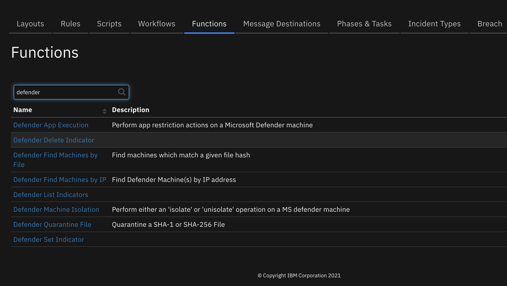

Perform operations against Defender such as set indicators, isolate and quarantine machines, and block file execution

### Key Features
<!--
  List the Key Features of the Integration
-->
* List, set, update and delete Defender indicators
* Search for Defender machines by IP address
* Search for Defender machines by file hash
* Isolate/unisolate Defender machines
* Restrict/unrestrict apps on a Defender machine
* Run an antivirus scan on a Defender machine
* Quarantine files on a Defender machine
* Get file information

---

## Requirements
<!--
  List any Requirements
-->
This app supports the IBM Resilient SOAR Platform and the IBM Cloud Pak for Security.

### Resilient platform
The Resilient platform supports two app deployment mechanisms, App Host and integration server.

If deploying to a Resilient platform with an App Host, the requirements are:
* Resilient platform >= `39.0.6328`.
* The app is in a container-based format (available from the AppExchange as a `zip` file).

If deploying to a Resilient platform with an integration server, the requirements are:
* Resilient platform >= `39.0.6328`.
* The app is in the older integration format (available from the AppExchange as a `zip` file which contains a `tar.gz` file).
* Integration server is running `resilient_circuits>=30.0.0`.
* If using an API key account, make sure the account provides the following minimum permissions:
  | Name | Permissions |
  | ---- | ----------- |
  | Org Data | Read |
  | Function | Read |
  | Incident | Read, Create |
  | Edit Incident | Fields, Owner, Status, Notes |

The following Resilient platform guides provide additional information:
* _App Host Deployment Guide_: provides installation, configuration, and troubleshooting information, including proxy server settings.
* _Integration Server Guide_: provides installation, configuration, and troubleshooting information, including proxy server settings.
* _System Administrator Guide_: provides the procedure to install, configure and deploy apps.

The above guides are available on the IBM Knowledge Center at [ibm.biz/soar-docs](https://ibm.biz/soar-docs). On this web page, select your Resilient platform version. On the follow-on page, you can find the _App Host Deployment Guide_ or _Integration Server Guide_ by expanding **Resilient Apps** in the Table of Contents pane. The System Administrator Guide is available by expanding **System Administrator**.

### Cloud Pak for Security
If you are deploying to IBM Cloud Pak for Security, the requirements are:
* IBM Cloud Pak for Security >= 1.4.
* Cloud Pak is configured with an App Host.
* The app is in a container-based format (available from the AppExchange as a `zip` file).

The following Cloud Pak guides provide additional information:
* _App Host Deployment Guide_: provides installation, configuration, and troubleshooting information, including proxy server settings. From the Table of Contents, select Case Management and Orchestration & Automation > **Orchestration and Automation Apps**.
* _System Administrator Guide_: provides information to install, configure, and deploy apps. From the IBM Cloud Pak for Security Knowledge Center table of contents, select Case Management and Orchestration & Automation > **System administrator**.

These guides are available on the IBM Knowledge Center at [ibm.biz/cp4s-docs](https://ibm.biz/cp4s-docs). From this web page, select your IBM Cloud Pak for Security version. From the version-specific Knowledge Center page, select Case Management and Orchestration & Automation.

### Proxy Server
The app supports a proxy server via the https_proxy and http_proxy app.config settings.

### Python Environment
Python 3.6+ is supported.
Additional package dependencies may exist for each of these packages:
* msal
* rapidjson
* resilient_circuits>=37.0.0
* resilient_lib>=37.0.0
* simplejson

---

## Installation

### Install
* To install or uninstall an App or Integration on the _Resilient platform_, see the documentation at [ibm.biz/soar-docs](https://ibm.biz/soar-docs).
* To install or uninstall an App on _IBM Cloud Pak for Security_, see the documentation at [ibm.biz/cp4s-docs](https://ibm.biz/cp4s-docs) and follow the instructions above to navigate to Orchestration and Automation.

### App Configuration
The following table provides the settings you need to configure the app. These settings are made in the app.config file. See the documentation discussed in the Requirements section for the procedure.

| Config | Required | Example | Description |
| ------ | :------: | ------- | ----------- |
| **tenant_id** | Yes | `89d65-...-57bae1c2` | *Azure tenant Id.* |
| **client_id** | Yes | `244ad4-...-3564fc4` | *Azure app id (client id).* |
| **app_secret** | Yes | `940c4d2-...-9d32e1b` | *Azure app secret.* |
| **api_url** | Yes | `https://api.securitycenter.microsoft.com` | *API utl. This can be customized per Azure region.* |
| **polling_lookback** | Yes | `120` | *When resilient-circuits starts, number of minutes to look back for changes to Sentinel incidents.* |
| **polling_interval** | Yes | `60` | *Number of seconds for the poller to run.* |
| **new_incident_filters** | Yes | `"status": ["New", "Active"],"severity": ["High", "Medium","Low"]` | *filers to apply for promoting Sentinel incidents to SOAR. All criteria need to match. For lists [], one value needs to match.* |
| **create_incident_template** | No | /path/to/incident_creation_template.jinja | *custom template for incident creation* |
| **update_incident_template** | No | /path/to/incident_update_template.jinja | *custom template for incident updates* |
| **close_incident_template** | No | /path/to/incident_close_template.jinja | *custom template for closing a incident* |
| **update_defender_alert_template** | No | /path/to/defender_update_alert_template.jinja | *custom template for updating an alert* |
| **verify** | No | false | *'false' to disable certificate verification or /path/to/client_certificate.pem* |
| **update_defender_incident_template** | No | /path/to/defender_update_incident_template.jinja | *custom template for updating an alert* |
| **http_proxy https_proxy** | No | https//proxy.com | *url for proxy settings* |

### Custom Layouts
<!--
  Use this section to provide guidance on where the user should add any custom fields and data tables.
  You may wish to recommend a new incident tab.
  You should save a screenshot "custom_layouts.png" in the doc/screenshots directory and reference it here
-->
* Import the Data Tables and Custom Fields like the screenshot below:

  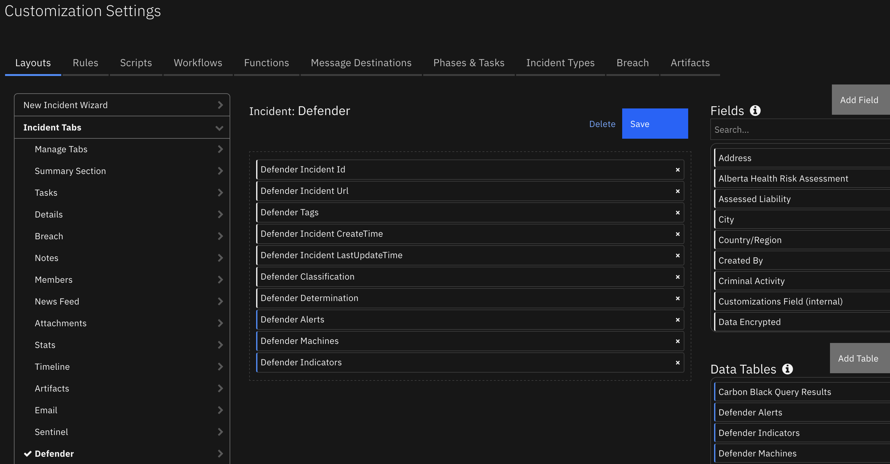


---

### Azure App Configuration

In order to use this app, an Azure app needs to be registered with the proper permissions for Defender and a client secret generated. Settings, in general are:

Application Type: Daemon with api calls enabled

API Permissions (Application type):

    Alert.ReadAll
    Alert.ReadWriteAll
    File.Read.All
    Incident.ReadWrite
    Incident.ReadWrite.All
    Ip.Read.All
    Machine.CollectForensics
    Machine.Isolate
    Machine.Read.All
    Machine.ReadWrite.All
    Machine.RestrictExecution
    Machine.Scan
    Machine.StopAndQuarantine
    Software.Read.All
    Ti.Read.All
    Ti.ReadWrite
    Ti.ReadWrite.All
    User.Read
    User.Read.All
    Url.Read.All
    Vunerabilities.ReadAll

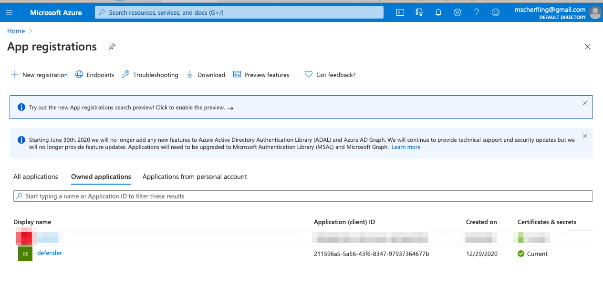

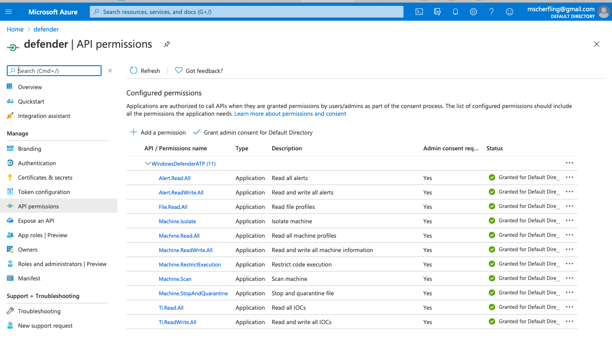

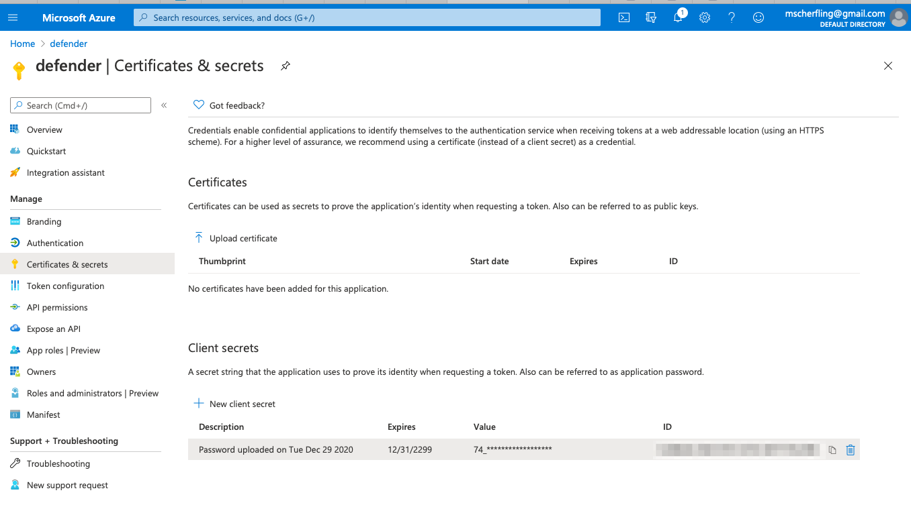

---

### Template files
Templates are used during the syncronization of incidents and comments between Defender and IBM SOAR.
These templates provide the mapping between Defender incident and SOAR incident fields. The templates cover these scenarios:

* create a SOAR incident from a Defender incident
* update an existing SOAR incident
* close a SOAR incident when the cooresponding Defender incident closes
* create a Defender incident comment
* update a Defender incident alert

There are cases where these template need to be modified for your environment. For instance, customers can
customize their close incident process with different required fields. In this example, the incident_close_template.jinja file needs to be updated and referenced in your app.config file as:

close_incident_template=/path/to/your/custom/close_incident_template.jinja

See the [Template Appendix](#template-appendix) for copies of the existing templates which you can use to modify for your environment requirements.

## Function - Defender Update Incident
Update a Defender Incident

<details><summary>Inputs:</summary>
<p>
| Name | Type | Required | Example | Tooltip |
| ---- | :--: | :------: | ------- | ------- |
| `defender_classification` | `select` | No | `TruePositive` | Unknown, FalsePositive, TruePositive. |
| `defender_comment` | `text` | No | `-` | - |
| `defender_determination` | `select` | No | `Malware` | NotAvailable, Apt, Malware, SecurityPersonnel, SecurityTesting, UnwantedSoftware, Other. |
| `defender_incident_id` | `number` | No | `-` | - |
| `defender_incident_status` | `select` | No | `Active` | Active, Resolved, and Redirected. |
| `defender_tags` | `text` | No | `-` | comma separated list of defender incident tags |

</p>
</details>

<details><summary>Outputs:</summary>
<p>

```python
results = {
  'version': 2.0,
  'success': True,
  'reason': None,
  'content': {
    '@odata.context': 'https://api.securitycenter.microsoft.com/api/$metadata#Incidents/$entity',
    'incidentId': 31,
    'incidentUri': 'https://security.microsoft.com/incidents/31?tid=50ad7d3e-b889-434d-802d-13b87c68047b',
    'redirectIncidentId': None,
    'incidentName': 'Multi-stage incident involving Initial access & Discovery on one endpoint',
    'createdTime': '2021-10-18T18:22:55.0166667Z',
    'lastUpdateTime': '2021-10-27T01:12:39.9333333Z',
    'assignedTo': 'Defender 365',
    'classification': 'TruePositive',
    'determination': 'Malware',
    'status': 'Active',
    'severity': 'Medium',
    'tags': [
      'tagA',
      'tagB'
    ],
    'comments': [
      {
        'comment': 'new comment from azure',
        'createdBy': 'abc@swivrllc.onmicrosoft.com',
        'createdTime': '2021-10-22T20:53:53.9133333Z'
      }
    ],
    'alerts': [
      {
        'alertId': 'da637701781744658799_2045659800',
        'providerAlertId': 'da637701781744658799_2045659800',
        'incidentId': 31,
        'serviceSource': 'MicrosoftDefenderForEndpoint',
        'creationTime': '2021-10-18T18:22:54.465905Z',
        'lastUpdatedTime': '2021-10-27T01:12:39.9533333Z',
        'resolvedTime': '2021-10-26T20:38:24.3646436Z',
        'firstActivity': '2021-10-18T18:19:38.3176713Z',
        'lastActivity': '2021-10-18T18:19:40.2929171Z',
        'title': 'Suspicious Task Scheduler activity',
        'description': 'A process involved in earlier malicious activity used Task Scheduler to create, modify, or delete a task. This might be an attempt launch malicious code automatically and establish persistence.',
        'category': 'Persistence',
        'status': 'Resolved',
        'severity': 'Medium',
        'investigationId': None,
        'investigationState': 'UnsupportedAlertType',
        'classification': 'TruePositive',
        'determination': 'Other',
        'detectionSource': 'WindowsDefenderAtp',
        'detectorId': '446b23e1-48b0-41f9-ae7b-03655adcf941',
        'assignedTo': 'Automation',
        'actorName': None,
        'threatFamilyName': None,
        'mitreTechniques': [
          'T1053'
        ],
        'devices': [
          {
            'mdatpDeviceId': '2a94aaf80aa31094790ce40da6fdfc03a9a145c5',
            'aadDeviceId': None,
            'deviceDnsName': 'windowsvmos',
            'osPlatform': 'Windows10',
            'version': '20H2',
            'osProcessor': 'x64',
            'osBuild': 19042,
            'healthStatus': 'Active',
            'riskScore': 'High',
            'rbacGroupName': None,
            'firstSeen': '2021-08-11T13:36:43.1619242Z',
            'tags': [

            ],
            'defenderAvStatus': 'Updated',
            'onboardingStatus': 'Onboarded',
            'vmMetadata': {
              'vmId': '55de7a4c-b77a-4748-9c4f-048b88c0f3aa',
              'cloudProvider': 'Azure',
              'resourceId': '/subscriptions/a4b7e24a-c7aa-4d84-8dae-89e99b336784/resourceGroups/DEMOASSETS/providers/Microsoft.Compute/virtualMachines/WindowsVMOS',
              'subscriptionId': 'a4b7e24a-c7aa-4d84-8dae-89e99b336784'
            }
          }
        ],
        'entities': [
          {
            'entityType': 'Process',
            'evidenceCreationTime': '2021-10-18T18:22:54.73Z',
            'verdict': 'Suspicious',
            'remediationStatus': 'None',
            'sha1': 'f5ee89bb1e4a0b1c3c7f1e8d05d0677f2b2b5919',
            'sha256': '73a3c4aef5de385875339fc2eb7e58a9e8a47b6161bdc6436bf78a763537be70',
            'fileName': 'powershell.exe',
            'filePath': 'C:\\Windows\\SysWOW64\\WindowsPowerShell\\v1.0',
            'processId': 10212,
            'processCommandLine': "powershell.exe -W Hidden -Exec Bypass -Command cd /;$fileBase64Prefix = ''",
            'processCreationTime': '2021-10-18T18:19:33.3686931Z',
            'parentProcessId': 10452,
            'parentProcessCreationTime': '2021-10-18T18:19:11.4593785Z',
            'parentProcessFileName': 'WINWORD.EXE',
            'parentProcessFilePath': 'C:\\Program Files (x86)\\Microsoft Office\\root\\Office16',
            'accountName': 'userAccount',
            'domainName': 'WindowsVMOS',
            'userSid': 'S-1-5-21-1542157044-1944968518-3635326852-500',
            'aadUserId': 'ae973ab4-1b5e-48b2-bf2f-c3bf1b3634a2',
            'userPrincipalName': 'def@swivrllc.onmicrosoft.com',
            'detectionStatus': 'Detected',
            'deviceId': '2a94aaf80aa31094790ce40da6fdfc03a9a145c5'
          }
        ]
      }
    ]
  },
  'raw': None,
  'inputs': {
    'defender_classification': 'TruePositive',
    'defender_incident_id': 31,
    'defender_determination': 'Malware',
    'defender_tags': 'tagA,tagB',
    'defender_incident_status': 'Active'
  },
  'metrics': {
    'version': '1.0',
    'package': 'fn-microsoft-defender',
    'package_version': '1.0.0',
    'host': 'Marks-MacBook-Pro.local',
    'execution_time_ms': 1950,
    'timestamp': '2021-10-26 21:12:40'
  }
}
```

</p>
</details>

<details><summary>Example Pre-Process Script:</summary>
<p>

```python
# change as necessary. Value Defender values are:  Active, Resolved, and Redirected.
LOOKUP_STATUS = {
    "7": "Resolved", # Unresolved
    "8": "Resolved", # Duplicate
    "9": "Resolved", # Not an Issue
    "10": "Resolved" # Resolved
}

inputs.defender_incident_id = incident.properties.defender_incident_id
inputs.defender_incident_status = LOOKUP_STATUS.get(incident.resolution_id, "Resolved")
inputs.defender_comment = incident.resolution_summary.content
inputs.defender_classification = incident.properties.defender_classification
inputs.defender_determination = incident.properties.defender_determination
```

</p>
</details>

<details><summary>Example Post-Process Script:</summary>
<p>

```python
None
```

</p>
</details>

---
## Function - Defender App Execution
Perform app restriction actions on a Microsoft Defender machine

 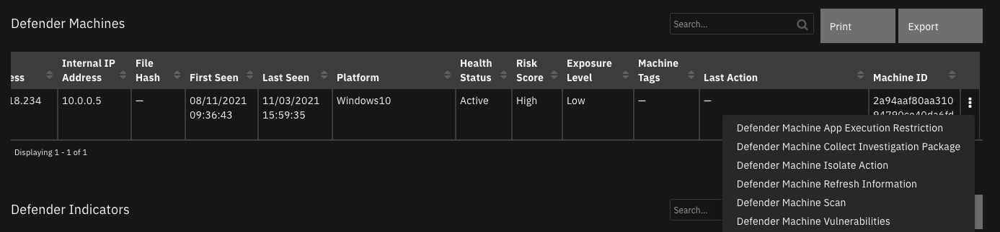

<details><summary>Inputs:</summary>
<p>

| Name | Type | Required | Example | Tooltip |
| ---- | :--: | :------: | ------- | ------- |
| `defender_description` | `text` | No | `-` | - |
| `defender_machine_id` | `text` | Yes | `-` | - |
| `defender_restriction_type` | `select` | Yes | `-` | restrictCodeExecution, unrestrictCodeExecution |

</p>
</details>

<details><summary>Outputs:</summary>
<p>

```python
results = {
  'version': '1.0',
  'success': True,
  'reason': None,
  'content': {
    '@odata.context': 'https://api.securitycenter.microsoft.com/api/$metadata#MachineActions/$entity',
    'id': 'e345e07a-1621-4801-bb7d-42a6370354ee',
    'type': 'UnrestrictCodeExecution',
    'title': None,
    'requestor': '2578565a-7957-474e-b626-d290d93c7e38',
    'requestorComment': 'unrestrict',
    'status': 'Succeeded',
    'machineId': '2a94aaf80aa31094790ce40da6fdfc03a9a145c5',
    'computerDnsName': 'windowsvmos',
    'creationDateTimeUtc': '2021-10-27T17:57:23.430512Z',
    'lastUpdateDateTimeUtc': '2021-10-27T17:57:29.8458727Z',
    'cancellationRequestor': None,
    'cancellationComment': None,
    'cancellationDateTimeUtc': None,
    'errorHResult': 0,
    'scope': None,
    'externalId': None,
    'requestSource': 'PublicApi',
    'relatedFileInfo': None,
    'commands': [

    ],
    'troubleshootInfo': None
  },
  'raw': '',
  'inputs': {
    'defender_restriction_type': {
      'id': 305,
      'name': 'unrestrictCodeExecution'
    },
    'defender_description': 'unrestrict',
    'defender_machine_id': '2a94aaf80aa31094790ce40da6fdfc03a9a145c5'
  },
  'metrics': {
    'version': '1.0',
    'package': 'fn-microsoft-defender',
    'package_version': '1.0.0',
    'host': 'a2875bae-fd94-432b-8395-2a59908315b3-57c5bb9c88-7gbcp',
    'execution_time_ms': 30909,
    'timestamp': '2021-10-27 17:57:53'
  }
}
```

</p>
</details>

<details><summary>Example Pre-Process Script:</summary>
<p>

```python
inputs.defender_description = rule.properties.defender_action_comment
inputs.defender_machine_id = row['machine_id']
inputs.defender_restriction_type = str(rule.properties.defender_app_execution_action)

```

</p>
</details>

<details><summary>Example Post-Process Script:</summary>
<p>

```python
import time

msg = u"Defender Action {}.\nAction: {}\nMachine: {}\nComment: {}"\
   .format("successful" if results.success else "unsuccessful",
           rule.properties.defender_app_execution_action,
           row['machine_id'],
           rule.properties.defender_action_comment)

if results.success:
  row['report_date'] = int(time.time()*1000)
  action_msg = "Action: {}\nComment: {}\nStatus: {}\nStart Date: {}".format(
    results.content['type'],
    results.content['requestorComment'],
    results.content['status'],
    results.content['creationDateTimeUtc']
    )
  row['machine_last_action'] = helper.createPlainText(action_msg)
else:
  msg = u"{}\nReason: {}".format(msg, results.reason)

incident.addNote(helper.createPlainText(msg))

```

</p>
</details>

---
## Function - Defender Find Machines by File
Find machines which match a given file hash

 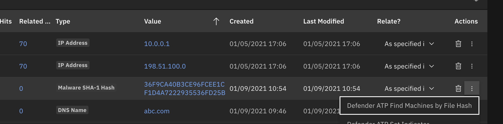

<details><summary>Inputs:</summary>
<p>

| Name | Type | Required | Example | Tooltip |
| ---- | :--: | :------: | ------- | ------- |
| `defender_indicator_value` | `text` | No | `-` | - |

</p>
</details>

<details><summary>Outputs:</summary>
<p>

```python
results = {
  'version': '1.0',
  'success': True,
  'reason': None,
  'content': {
    '@odata.context': 'https://api.securitycenter.microsoft.com/api/$metadata#Files/$entity',
    'sha1': 'cc4934376adfa2c4d5c698791c51264d0080948b',
    'sha256': '455795fabfd3c2c246b4b9e37782db8dbac8c9957210d782331861b56010bb12',
    'md5': '3912bbf391299d495109636a0ea47bcb',
    'globalPrevalence': 10968,
    'globalFirstObserved': '2020-08-23T07:26:58.0186152Z',
    'globalLastObserved': '2021-10-27T12:53:07.9730547Z',
    'size': 192512,
    'fileType': None,
    'isPeFile': False,
    'filePublisher': None,
    'fileProductName': None,
    'signer': None,
    'issuer': None,
    'signerHash': None,
    'isValidCertificate': None,
    'determinationType': 'Unknown',
    'determinationValue': ''
  },
  'raw': '',
  'inputs': {
    'defender_indicator_value': '455795fabfd3c2c246b4b9e37782db8dbac8c9957210d782331861b56010bb12'
  },
  'metrics': {
    'version': '1.0',
    'package': 'fn-microsoft-defender',
    'package_version': '1.0.0',
    'host': 'a2875bae-fd94-432b-8395-2a59908315b3-57c5bb9c88-7gbcp',
    'execution_time_ms': 649,
    'timestamp': '2021-10-27 18:15:39'
  }
}
```

</p>
</details>

<details><summary>Example Pre-Process Script:</summary>
<p>

```python
inputs.defender_indicator_value = artifact.value
```

</p>
</details>

<details><summary>Example Post-Process Script:</summary>
<p>

```python
import time

if results.success:
    for machine in results.content['value']:
        row = incident.addRow("defender_atp_machines")
        row['report_date'] = int(time.time()*1000)
        row['machine_id'] = machine['id']
        row['machine_name'] = machine['computerDnsName']
        row['machine_platform'] = machine['osPlatform']
        row['machine_firstseen'] = machine['firstSeen_ts']
        row['machine_lastseen'] = machine['lastSeen_ts']
        row['machine_ip'] = machine['lastIpAddress']
        row['machine_file_hash'] = artifact.value
        row['machine_health_status'] = machine.get('healthStatus')
        row['machine_risk_score'] = machine.get('riskScore')
        row['machine_exposure_level'] = machine.get('exposureLevel')
        row['machine_tags'] = ', '.join(machine.get('machineTags', []))
else:
    msg = u"Defender Action unsuccessful.\nAction: Find machines by file hash\nReason: {}".format(results.reason)
    incident.addNote(helper.createPlainText(msg))
```

</p>
</details>

---
## Function - Defender Machine Vulnerabilities
Get vulnerabilities for a given Defender machine


<details><summary>Inputs:</summary>
<p>

| Name | Type | Required | Example | Tooltip |
| ---- | :--: | :------: | ------- | ------- |
| `defender_machine_id` | `text` | Yes | `-` | - |

</p>
</details>

<details><summary>Outputs:</summary>
<p>

```python
results = {
  'version': '1.0',
  'success': True,
  'reason': None,
  'content': {
    '@odata.context': 'https://api.securitycenter.microsoft.com/api/$metadata#Collection(microsoft.windowsDefenderATP.api.PublicVulnerabilityDto)',
    'value': [

    ]
  },
  'raw': '{"@odata.context": "https://api.securitycenter.microsoft.com/api/$metadata#Collection(microsoft.windowsDefenderATP.api.PublicVulnerabilityDto)", "value": []}',
  'inputs': {
    'defender_machine_id': '2a94aaf80aa31094790ce40da6fdfc03a9a145c5'
  },
  'metrics': {
    'version': '1.0',
    'package': 'fn-microsoft-defender',
    'package_version': '1.0.0',
    'host': 'a2875bae-fd94-432b-8395-2a59908315b3-57df779566-tkf5x',
    'execution_time_ms': 791,
    'timestamp': '2021-10-27 20:48:07'
  }
}
```

</p>
</details>

<details><summary>Example Pre-Process Script:</summary>
<p>

```python
inputs.defender_machine_id = row['machine_id']
```

</p>
</details>

<details><summary>Example Post-Process Script:</summary>
<p>

```python
"""
 [
        {
            "id": "CVE-2019-1348",
            "name": "CVE-2019-1348",
            "description": "Git could allow a remote attacker to bypass security restrictions, caused by a flaw in the --export-marks option of git fast-import. By persuading a victim to import specially-crafted content, an attacker could exploit this vulnerability to overwrite arbitrary paths.",
            "severity": "Medium",
            "cvssV3": 4.3,
            "exposedMachines": 1,
            "publishedOn": "2019-12-13T00:00:00Z",
            "updatedOn": "2019-12-13T00:00:00Z",
            "publicExploit": False,
            "exploitVerified": False,
            "exploitInKit": False,
            "exploitTypes": [],
            "exploitUris": []
        },
        {
            "id": "CVE-2019-1348",
            "name": "CVE-2019-1348-2",
            "description": "Git could allow a remote attacker to bypass security restrictions, caused by a flaw in the --export-marks option of git fast-import. By persuading a victim to import specially-crafted content, an attacker could exploit this vulnerability to overwrite arbitrary paths.",
            "severity": "Medium",
            "cvssV3": 4.3,
            "exposedMachines": 1,
            "publishedOn": "2019-12-13T00:00:00Z",
            "updatedOn": "2019-12-13T00:00:00Z",
            "publicExploit": False,
            "exploitVerified": False,
            "exploitInKit": False,
            "exploitTypes": [],
            "exploitUris": []
        }
    ]
"""


def mk_note(list_of_notes):
    return "<br>---<br><br>".join(["<br>".join(note) for note in list_of_notes])

def format_line(k, v):
    return "<b>{}</b>: {}".format(k, v)

vulnerabilities = results.content['value']
if results['success']:
    if not vulnerabilities:
        incident.addNote("No machine vulnerabilities for: {}".format(row['machine_name']))
    else:
        note = []
        for risk in vulnerabilities:
            note_info = []
            note_info.append(format_line("Machine", row['machine_name']))
            note_info.append(format_line("Machine Id", row['machine_id']))
            note_info.append(format_line("Vulnerability", risk['name']))
            note_info.append(format_line("Description", risk['description']))
            note_info.append(format_line("Severity", risk['severity']))
            note_info.append(format_line("Published", risk['publishedOn']))
            note_info.append(format_line("Updated", risk['updatedOn']))

            note.append(note_info)
        incident.addNote(helper.createRichText(mk_note(note)))
else:
    incident.addNote("Defender Machine Vulnerabilities failed: {}".format(results.reason))

```

</p>
</details>

---
## Function - Defender Machine Isolation
Perform either an 'isolate' or 'unisolate' operation on a MS defender machine

 

<details><summary>Inputs:</summary>
<p>

| Name | Type | Required | Example | Tooltip |
| ---- | :--: | :------: | ------- | ------- |
| `defender_description` | `text` | No | `-` | - |
| `defender_isolation_action` | `text` | Yes | `-` | 'isolate' or 'unisolate' |
| `defender_isolation_type` | `select` | No | `-` | Type of operation to perform: 'Full' or 'Selective' |
| `defender_machine_id` | `text` | Yes | `-` | - |

</p>
</details>

<details><summary>Outputs:</summary>
<p>

```python
results = {
  'version': '1.0',
  'success': True,
  'reason': None,
  'content': {
    '@odata.context': 'https://api.securitycenter.microsoft.com/api/$metadata#MachineActions/$entity',
    'id': '38199c68-823c-4e6c-8a33-52a5f23ccdf1',
    'type': 'Isolate',
    'title': None,
    'requestor': '2578565a-7957-474e-b626-d290d93c7e38',
    'requestorComment': 'full isolate',
    'status': 'Succeeded',
    'machineId': '2a94aaf80aa31094790ce40da6fdfc03a9a145c5',
    'computerDnsName': 'windowsvmos',
    'creationDateTimeUtc': '2021-10-27T20:55:07.8402983Z',
    'lastUpdateDateTimeUtc': '2021-10-27T20:55:41.5307443Z',
    'cancellationRequestor': None,
    'cancellationComment': None,
    'cancellationDateTimeUtc': None,
    'errorHResult': 0,
    'scope': 'Full',
    'externalId': None,
    'requestSource': 'PublicApi',
    'relatedFileInfo': None,
    'commands': [

    ],
    'troubleshootInfo': None
  },
  'raw': '',
  'inputs': {
    'defender_isolation_type': {
      'id': 331,
      'name': 'Full'
    },
    'defender_description': 'full isolate',
    'defender_machine_id': '2a94aaf80aa31094790ce40da6fdfc03a9a145c5',
    'defender_isolation_action': 'isolate'
  },
  'metrics': {
    'version': '1.0',
    'package': 'fn-microsoft-defender',
    'package_version': '1.0.0',
    'host': 'a2875bae-fd94-432b-8395-2a59908315b3-57df779566-tkf5x',
    'execution_time_ms': 61859,
    'timestamp': '2021-10-27 20:56:09'
  }
}
```

</p>
</details>

<details><summary>Example Pre-Process Script:</summary>
<p>

```python
inputs.defender_machine_id = row['machine_id']
inputs.defender_isolation_type = None
inputs.defender_description = rule.properties.defender_action_comment
inputs.defender_isolation_action = 'unisolate'
```

</p>
</details>

<details><summary>Example Post-Process Script:</summary>
<p>

```python
import java.util.Date as Date

if results.success:
  row['report_date'] = Date().getTime()
  action_msg = "Action: {}\nComment: {}\nStatus: {}\nStart Date: {}".format(
    results.content['type'],
    results.content['requestorComment'],
    results.content['status'],
    results.content['creationDateTimeUtc']
    )
  row['machine_last_action'] = helper.createPlainText(action_msg)
else:
  msg = u"Defender Unisolate Action {}.\nMachine: {} ({})\nType: {}\nComment: {}\nReason: {}"\
   .format("successful" if results.success else "unsuccessful",
           row['machine_name'], row['machine_id'],
           str(rule.properties.defender_isolation_type),
           rule.properties.defender_action_comment,
           results.reason)

  incident.addNote(helper.createPlainText(msg))

```

</p>
</details>

---
## Function - Defender Alert Search
Return Defender alerts based on a set of search criteria


<details><summary>Inputs:</summary>
<p>

| Name | Type | Required | Example | Tooltip |
| ---- | :--: | :------: | ------- | ------- |
| `defender_alert_lastseen` | `datetimepicker` | No | `-` | Last Seen Alert Date |
| `defender_alert_lastupdatetime` | `datetimepicker` | No | `-` | Date when alert was last updated |
| `defender_alert_result_max` | `number` | No | `5` | Number of top results to return |
| `defender_alert_severity` | `select` | No | `-` | - |
| `defender_machine_id` | `text` | Yes | `-` | - |

</p>
</details>

<details><summary>Outputs:</summary>
<p>

```python
results = {
    # TODO: Copy and paste an example of the Function Output within this code block.
    # To view the output of a Function, run resilient-circuits in DEBUG mode and invoke the Function.
    # The Function results will be printed in the logs: "resilient-circuits run --loglevel=DEBUG"
}
```

</p>
</details>

<details><summary>Example Pre-Process Script:</summary>
<p>

```python
None
```

</p>
</details>

<details><summary>Example Post-Process Script:</summary>
<p>

```python
None
```

</p>
</details>

---
## Function - Defender List Indicators
Get a list of all Defender indicators. Optionally, specify a regex filter to limit the responses.

 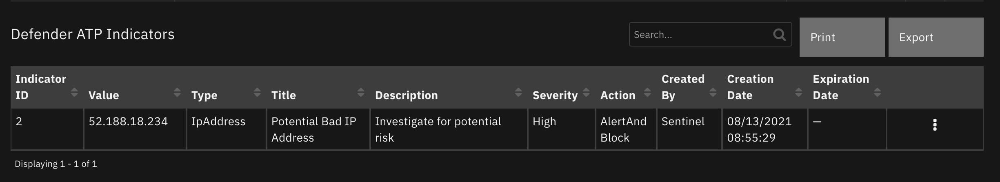

<details><summary>Inputs:</summary>
<p>

| Name | Type | Required | Example | Tooltip |
| ---- | :--: | :------: | ------- | ------- |
| `defender_indicator_field` | `select` | No | `-` | Select which field to filter on |
| `defender_indicator_filter` | `text` | No | `-` | regex capability to limit list. ie: a.* for indicators starting with 'a' |

</p>
</details>

<details><summary>Outputs:</summary>
<p>

```python
results = {
  'version': '1.0',
  'success': True,
  'reason': None,
  'content': {
    'value': [
      {
        'id': '11',
        'indicatorValue': '45.146.164.110',
        'indicatorType': 'IpAddress',
        'action': 'Allowed',
        'createdBy': '2578565a-7957-474e-b626-d290d93c7e38',
        'severity': 'Low',
        'category': 1,
        'application': None,
        'educateUrl': None,
        'bypassDurationHours': None,
        'title': 'my indicator',
        'description': 'ip addr',
        'recommendedActions': None,
        'creationTimeDateTimeUtc': '2021-10-26T21:40:30.868013Z',
        'expirationTime': None,
        'lastUpdateTime': '2021-10-27T01:27:35.1627118Z',
        'lastUpdatedBy': '2578565a-7957-474e-b626-d290d93c7e38',
        'rbacGroupNames': [

        ],
        'rbacGroupIds': [

        ],
        'notificationId': None,
        'notificationBody': None,
        'version': None,
        'mitreTechniques': [

        ],
        'historicalDetection': False,
        'lookBackPeriod': None,
        'generateAlert': False,
        'additionalInfo': None,
        'createdByDisplayName': 'Defender 365',
        'externalId': None,
        'createdBySource': 'PublicApi',
        'certificateInfo': None,
        'creationTimeDateTimeUtc_ts': 1635284430000,
        'expirationTime_ts': None
      }
    ]
  },
  'raw': '',
  'inputs': {
    'defender_indicator_field': {
      'id': 236,
      'name': 'title'
    },
    'defender_indicator_filter': 'my'
  },
  'metrics': {
    'version': '1.0',
    'package': 'fn-microsoft-defender',
    'package_version': '1.0.0',
    'host': 'MacBook-Pro.local',
    'execution_time_ms': 925,
    'timestamp': '2021-10-26 21:31:16'
  }
}
```

</p>
</details>

<details><summary>Example Pre-Process Script:</summary>
<p>

```python
inputs.defender_indicator_filter = rule.properties.defender_indicator_filter
inputs.defender_indicator_field = rule.properties.defender_indicator_field
```

</p>
</details>

<details><summary>Example Post-Process Script:</summary>
<p>

```python
import java.util.Date as Date

if results.success and results.content.get("value"):
    for indicator in results.content.get("value"):
        row = incident.addRow("defender_indicators")
        row['report_date'] = Date().getTime()
        row['ind_id'] = indicator['id']
        row['ind_value'] = indicator['indicatorValue']
        row['ind_type'] = indicator['indicatorType']
        row['ind_title'] = indicator['title']
        row['ind_description'] = indicator['description']
        row['ind_action'] = indicator['action']
        row['ind_severity'] = indicator['severity']
        row['ind_created_by'] = indicator['createdByDisplayName']
        row['ind_creation_date'] = indicator['creationTimeDateTimeUtc_ts']
        row['ind_expiration_date'] = indicator['expirationTime_ts']
        row['status'] = 'Active'
else:
    msg = u"Defender Action unsuccessful.\nAction: List indicators\nReason: {}".format(results.reason)
    incident.addNote(msg)
```

</p>
</details>

---
## Function - Defender Quarantine File
Quarantine a SHA-1 file

<details><summary>Inputs:</summary>
<p>

| Name | Type | Required | Example | Tooltip |
| ---- | :--: | :------: | ------- | ------- |
| `defender_description` | `text` | No | `-` | - |
| `defender_indicator_value` | `text` | No | `-` | - |
| `defender_machine_id` | `text` | Yes | `-` | - |

</p>
</details>

<details><summary>Outputs:</summary>
<p>

```python
results = {
  'version': '1.0',
  'success': True,
  'reason': None,
  'content': {
    '@odata.context': 'https://api.securitycenter.microsoft.com/api/$metadata#MachineActions/$entity',
    'id': '15c5a0d4-6b9d-4751-87bf-e6e0b5e2170a',
    'type': 'StopAndQuarantineFile',
    'title': None,
    'requestor': '2578565a-7957-474e-b626-d290d93c7e38',
    'requestorComment': 'quarantine',
    'status': 'Succeeded',
    'machineId': '2a94aaf80aa31094790ce40da6fdfc03a9a145c5',
    'computerDnsName': 'windowsvmos',
    'creationDateTimeUtc': '2021-10-27T18:24:35.8640423Z',
    'lastUpdateDateTimeUtc': '2021-10-27T18:24:58.758451Z',
    'cancellationRequestor': None,
    'cancellationComment': None,
    'cancellationDateTimeUtc': None,
    'errorHResult': 0,
    'scope': None,
    'externalId': None,
    'requestSource': 'PublicApi',
    'relatedFileInfo': {
      'fileIdentifier': '5e1c8874b29de480a0513516fb542cad2b049cc3',
      'fileIdentifierType': 'Sha1'
    },
    'commands': [

    ],
    'troubleshootInfo': None
  },
  'raw': '{"@odata.context": "https://api.securitycenter.microsoft.com/api/$metadata#MachineActions/$entity", "id": "15c5a0d4-6b9d-4751-87bf-e6e0b5e2170a", "type": "StopAndQuarantineFile", "title": null, "requestor": "2578565a-7957-474e-b626-d290d93c7e38", "requestorComment": "quarantine", "status": "Succeeded", "machineId": "2a94aaf80aa31094790ce40da6fdfc03a9a145c5", "computerDnsName": "windowsvmos", "creationDateTimeUtc": "2021-10-27T18:24:35.8640423Z", "lastUpdateDateTimeUtc": "2021-10-27T18:24:58.758451Z", "cancellationRequestor": null, "cancellationComment": null, "cancellationDateTimeUtc": null, "errorHResult": 0, "scope": null, "externalId": null, "requestSource": "PublicApi", "relatedFileInfo": {"fileIdentifier": "5e1c8874b29de480a0513516fb542cad2b049cc3", "fileIdentifierType": "Sha1"}, "commands": [], "troubleshootInfo": null}',
  'inputs': {
    'defender_description': 'quarantine',
    'defender_machine_id': '2a94aaf80aa31094790ce40da6fdfc03a9a145c5',
    'defender_indicator_value': '5e1c8874b29de480a0513516fb542cad2b049cc3'
  },
  'metrics': {
    'version': '1.0',
    'package': 'fn-microsoft-defender',
    'package_version': '1.0.0',
    'host': 'a2875bae-fd94-432b-8395-2a59908315b3-57c5bb9c88-7gbcp',
    'execution_time_ms': 32322,
    'timestamp': '2021-10-27 18:25:06'
  }
}
```

</p>
</details>

<details><summary>Example Pre-Process Script:</summary>
<p>

```python
inputs.defender_description = rule.properties.defender_action_comment
inputs.defender_indicator_value = row['machine_file_hash']
inputs.defender_machine_id = row['machine_id']

```

</p>
</details>

<details><summary>Example Post-Process Script:</summary>
<p>

```python
import time

if results.success:
  row['report_date'] = int(time.time()*1000)
  action_msg = "Action: {}\nComment: {}\nStatus: {}\nStart Date: {}".format(
    results.content['type'],
    results.content['requestorComment'],
    results.content['status'],
    results.content['creationDateTimeUtc']
    )
  row['machine_last_action'] = helper.createPlainText(action_msg)
else:
  msg = u"Defender Quarantine file Action {}.\nMachine: {} ({})\nType: {}\nComment: {}\nReason: {}"\
   .format("successful" if results.success else "unsuccessful",
           row['machine_name'], row['machine_id'],
           str(rule.properties.defender_isolation_type),
           rule.properties.defender_action_comment,
           results.reason)

  incident.addNote(helper.createPlainText(msg))

```

</p>
</details>

---
## Function - Defender Get Related Alert Information
Get a Defender machine alert details

<details><summary>Inputs:</summary>
<p>

| Name | Type | Required | Example | Tooltip |
| ---- | :--: | :------: | ------- | ------- |
| `defender_alert_id` | `text` | Yes | `-` | - |
| `defender_alert_info` | `multiselect` | No | `-` | - |

</p>
</details>

<details><summary>Outputs:</summary>
<p>

```python
results = {
    # TODO: Copy and paste an example of the Function Output within this code block.
    # To view the output of a Function, run resilient-circuits in DEBUG mode and invoke the Function.
    # The Function results will be printed in the logs: "resilient-circuits run --loglevel=DEBUG"
}
```

</p>
</details>

<details><summary>Example Pre-Process Script:</summary>
<p>

```python
None
```

</p>
</details>

<details><summary>Example Post-Process Script:</summary>
<p>

```python
None
```

</p>
</details>

---
## Function - Defender Machine Scan
Start a Defender Machine antivirus scan

 

<details><summary>Inputs:</summary>
<p>

| Name | Type | Required | Example | Tooltip |
| ---- | :--: | :------: | ------- | ------- |
| `defender_description` | `text` | No | `-` | - |
| `defender_machine_id` | `text` | Yes | `-` | - |
| `defender_machine_scantype` | `select` | Yes | `-` | antivirus scan type |

</p>
</details>

<details><summary>Outputs:</summary>
<p>

```python
results = {
  'version': '1.0',
  'success': True,
  'reason': None,
  'content': {
    '@odata.context': 'https://api.securitycenter.microsoft.com/api/$metadata#MachineActions/$entity',
    'id': 'c54022c7-7753-4fc4-8205-332449fe0771',
    'type': 'RunAntiVirusScan',
    'title': None,
    'requestor': '2578565a-7957-474e-b626-d290d93c7e38',
    'requestorComment': 'full scan',
    'status': 'Succeeded',
    'machineId': '2a94aaf80aa31094790ce40da6fdfc03a9a145c5',
    'computerDnsName': 'windowsvmos',
    'creationDateTimeUtc': '2021-10-27T18:27:10.78994Z',
    'lastUpdateDateTimeUtc': '2021-10-27T18:27:46.4231735Z',
    'cancellationRequestor': None,
    'cancellationComment': None,
    'cancellationDateTimeUtc': None,
    'errorHResult': 0,
    'scope': 'Full',
    'externalId': None,
    'requestSource': 'PublicApi',
    'relatedFileInfo': None,
    'commands': [

    ],
    'troubleshootInfo': None
  },
  'raw': '',
  'inputs': {
    'defender_description': 'full scan',
    'defender_machine_id': '2a94aaf80aa31094790ce40da6fdfc03a9a145c5',
    'defender_machine_scantype': {
      'id': 312,
      'name': 'Full'
    }
  },
  'metrics': {
    'version': '1.0',
    'package': 'fn-microsoft-defender',
    'package_version': '1.0.0',
    'host': 'a2875bae-fd94-432b-8395-2a59908315b3-57c5bb9c88-7gbcp',
    'execution_time_ms': 61758,
    'timestamp': '2021-10-27 18:28:11'
  }
}
```

</p>
</details>

<details><summary>Example Pre-Process Script:</summary>
<p>

```python
inputs.defender_machine_id = row['machine_id']
inputs.defender_description = rule.properties.defender_action_comment
inputs.defender_machine_scantype = str(rule.properties.defender_machine_scantype)

```

</p>
</details>

<details><summary>Example Post-Process Script:</summary>
<p>

```python
import time

if results.success:
  row['report_date'] = int(time.time()*1000)
  action_msg = "Action: {}\nComment: {}\nStatus: {}\nStart Date: {}".format(
    results.content['type'],
    results.content['requestorComment'],
    results.content['status'],
    results.content['creationDateTimeUtc']
    )
  row['machine_last_action'] = helper.createPlainText(action_msg)
else:
  msg = u"Defender Scan Action {}.\nMachine: {} ({})\nType: {}\nComment: {}\nReason: {}"\
   .format("successful" if results.success else "unsuccessful",
           row['machine_name'], row['machine_id'],
           str(rule.properties.defender_isolation_type),
           rule.properties.defender_action_comment,
           results.reason)

  incident.addNote(helper.createPlainText(msg))

```

</p>
</details>

---
## Function - Defender Set Indicator
Set or update an indicator with exposure values

 

<details><summary>Inputs:</summary>
<p>

| Name | Type | Required | Example | Tooltip |
| ---- | :--: | :------: | ------- | ------- |
| `defender_description` | `text` | No | `-` | - |
| `defender_expiration_time` | `datetimepicker` | No | `-` | - |
| `defender_indicator_action` | `select` | No | `-` | - |
| `defender_indicator_id` | `text` | No | `-` | - |
| `defender_indicator_type` | `text` | No | `-` | - |
| `defender_indicator_value` | `text` | No | `-` | - |
| `defender_severity` | `select` | No | `-` | - |
| `defender_title` | `text` | No | `-` | - |

</p>
</details>

<details><summary>Outputs:</summary>
<p>

```python
results = {
  'version': '1.0',
  'success': True,
  'reason': None,
  'content': {
    '@odata.context': 'https://api.securitycenter.microsoft.com/api/$metadata#Indicators/$entity',
    'id': '11',
    'indicatorValue': '45.146.164.110',
    'indicatorType': 'IpAddress',
    'action': 'Allowed',
    'createdBy': '2578565a-7957-474e-b626-d290d93c7e38',
    'severity': 'Low',
    'category': 1,
    'application': None,
    'educateUrl': None,
    'bypassDurationHours': None,
    'title': 'my indicator',
    'description': 'ip addr',
    'recommendedActions': None,
    'creationTimeDateTimeUtc': '2021-10-26T21:40:30.868013Z',
    'expirationTime': None,
    'lastUpdateTime': '2021-10-27T01:27:35.1627118Z',
    'lastUpdatedBy': '2578565a-7957-474e-b626-d290d93c7e38',
    'rbacGroupNames': [

    ],
    'rbacGroupIds': [

    ],
    'notificationId': None,
    'notificationBody': None,
    'version': None,
    'mitreTechniques': [

    ],
    'historicalDetection': False,
    'lookBackPeriod': None,
    'generateAlert': False,
    'additionalInfo': None,
    'createdByDisplayName': 'Defender 365',
    'externalId': None,
    'createdBySource': 'PublicApi',
    'certificateInfo': None,
    'creationTimeDateTimeUtc_ts': 1635284430000,
    'expirationTime_ts': None,
    'lastUpdateTime_ts': 1635298055000
  },
  'raw': '',
  'inputs': {
    'defender_indicator_type': 'IP Address',
    'defender_title': 'my indicator',
    'defender_description': 'ip addr',
    'defender_expiration_time': None,
    'defender_indicator_action': {
      'id': 251,
      'name': 'Allowed'
    },
    'defender_severity': {
      'id': 265,
      'name': 'Low'
    },
    'defender_indicator_value': '45.146.164.110'
  },
  'metrics': {
    'version': '1.0',
    'package': 'fn-microsoft-defender',
    'package_version': '1.0.0',
    'host': 'MacBook-Pro.local',
    'execution_time_ms': 1032,
    'timestamp': '2021-10-26 21:27:35'
  }
}
```

</p>
</details>

<details><summary>Example Pre-Process Script:</summary>
<p>

```python
inputs.defender_indicator_type = artifact.type
inputs.defender_indicator_value = artifact.value
inputs.defender_description = rule.properties.indicator_description
inputs.defender_expiration_time = rule.properties.indicator_expiration
inputs.defender_title = rule.properties.indicator_title
inputs.defender_severity = str(rule.properties.indicator_severity)
inputs.defender_indicator_action = str(rule.properties.indicator_action)
```

</p>
</details>

<details><summary>Example Post-Process Script:</summary>
<p>

```python
import java.util.Date as Date

msg = u"Action {}.\nAction: {}\nArtifact: {}\nTitle: {}\nComment: {}\nSeverity: {}\nExpiration: {}"\
   .format("successful" if results.success else "unsuccessful",
           str(rule.properties.indicator_action),
           artifact.value,
           rule.properties.indicator_title,
           rule.properties.indicator_description,
           str(rule.properties.indicator_severity),
           rule.properties.indicator_expiration)

if not results.success:
    msg = u"{}\nReason: {}".format(msg, results.reason)

incident.addNote(msg)

if results.success:
    row = incident.addRow("defender_indicators")
    row['report_date'] = Date().getTime()
    row['ind_id'] = results.content['id']
    row['ind_value'] = results.content['indicatorValue']
    row['ind_type'] = results.content['indicatorType']
    row['ind_title'] = results.content['title']
    row['ind_description'] = results.content['description']
    row['ind_action'] = results.content['action']
    row['ind_severity'] = results.content['severity']
    row['ind_created_by'] = results.content['createdByDisplayName']
    row['ind_creation_date'] = results.content['creationTimeDateTimeUtc_ts']
    row['ind_expiration_date'] = results.content['expirationTime_ts']
    row['status'] = 'Active'

```

</p>
</details>

---
## Function - Defender Get File Information
Get additional information about a Defender SHA1 or SHA256 file reference.


<details><summary>Inputs:</summary>
<p>

| Name | Type | Required | Example | Tooltip |
| ---- | :--: | :------: | ------- | ------- |
| `defender_file_hash` | `text` | No | `-` | SHA1 or SHA256 |

</p>
</details>

<details><summary>Outputs:</summary>
<p>

```python
results = {
  'version': '1.0',
  'success': True,
  'reason': None,
  'content': {
    '@odata.context': 'https://api.securitycenter.microsoft.com/api/$metadata#Files/$entity',
    'sha1': 'cc4934376adfa2c4d5c698791c51264d0080948b',
    'sha256': '455795fabfd3c2c246b4b9e37782db8dbac8c9957210d782331861b56010bb12',
    'md5': '3912bbf391299d495109636a0ea47bcb',
    'globalPrevalence': 10968,
    'globalFirstObserved': '2020-08-23T07:26:58.0186152Z',
    'globalLastObserved': '2021-10-27T12:53:07.9730547Z',
    'size': 192512,
    'fileType': None,
    'isPeFile': False,
    'filePublisher': None,
    'fileProductName': None,
    'signer': None,
    'issuer': None,
    'signerHash': None,
    'isValidCertificate': None,
    'determinationType': 'Unknown',
    'determinationValue': ''
  },
  'raw': '',
  'inputs': {
    'defender_file_hash': 'cc4934376adfa2c4d5c698791c51264d0080948b'
  },
  'metrics': {
    'version': '1.0',
    'package': 'fn-microsoft-defender',
    'package_version': '1.0.0',
    'host': 'a2875bae-fd94-432b-8395-2a59908315b3-57df779566-tkf5x',
    'execution_time_ms': 673,
    'timestamp': '2021-10-27 20:52:51'
  }
}
```

</p>
</details>

<details><summary>Example Pre-Process Script:</summary>
<p>

```python
inputs.defender_file_hash = artifact.value
```

</p>
</details>

<details><summary>Example Post-Process Script:</summary>
<p>

```python
if not results.success:
    msg = u"Defender Get File Information failed: {}".format(results.reason)
else:
    info = [u"{}: {}".format(k, v) for k, v in results.content.items()]
    msg = u"Defender Get File Information:\n\n{}".format("\n".join(info))

if artifact.description:
    artifact.description = u"{}\n\n{}".format(artifact.description.content, msg)
else:
    artifact.description = msg


"""
{
    "@odata.context": "https://api.securitycenter.microsoft.com/api/$metadata#Files/$entity",
    "sha1": "4388963aaa83afe2042a46a3c017ad50bdcdafb3",
    "sha256": "413c58c8267d2c8648d8f6384bacc2ae9c929b2b96578b6860b5087cd1bd6462",
    "globalPrevalence": 180022,
    "globalFirstObserved": "2017-09-19T03:51:27.6785431Z",
    "globalLastObserved": "2020-01-06T03:59:21.3229314Z",
    "size": 22139496,
    "fileType": "APP",
    "isPeFile": true,
    "filePublisher": "CHENGDU YIWO Tech Development Co., Ltd.",
    "fileProductName": "EaseUS MobiSaver for Android",
    "signer": "CHENGDU YIWO Tech Development Co., Ltd.",
    "issuer": "VeriSign Class 3 Code Signing 2010 CA",
    "signerHash": "6c3245d4a9bc0244d99dff27af259cbbae2e2d16",
    "isValidCertificate": false,
    "determinationType": "Pua",
    "determinationValue": "PUA:Win32/FusionCore"
}
"""
```

</p>
</details>

---
## Function - Defender Find Machines by filter
Find machines based on the OData filter capability of Defender.

 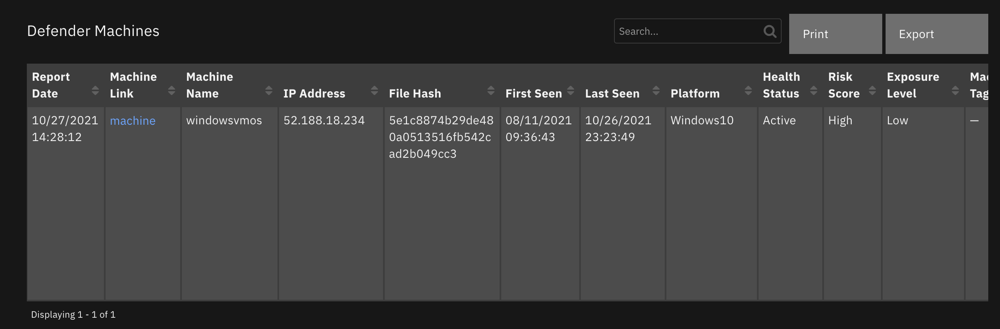

<details><summary>Inputs:</summary>
<p>

| Name | Type | Required | Example | Tooltip |
| ---- | :--: | :------: | ------- | ------- |
| `defender_filter_name` | `text` | No | `-` | - |
| `defender_filter_value` | `text` | No | `-` | - |

</p>
</details>

<details><summary>Outputs:</summary>
<p>

```python
results = {
  'version': '1.0',
  'success': True,
  'reason': None,
  'content': {
    '@odata.context': 'https://api.securitycenter.microsoft.com/api/$metadata#Machines',
    'value': [
      {
        'id': '2a94aaf80aa31094790ce40da6fdfc03a9a145c5',
        'computerDnsName': 'windowsvmos',
        'firstSeen': '2021-08-11T13:36:43.1619242Z',
        'lastSeen': '2021-10-27T03:23:49.4008551Z',
        'osPlatform': 'Windows10',
        'osVersion': None,
        'osProcessor': 'x64',
        'version': '20H2',
        'lastIpAddress': '10.0.0.5',
        'lastExternalIpAddress': '52.188.18.234',
        'agentVersion': '10.7740.19041.1288',
        'osBuild': 19042,
        'healthStatus': 'Active',
        'deviceValue': 'Normal',
        'rbacGroupId': 0,
        'rbacGroupName': None,
        'riskScore': 'High',
        'exposureLevel': 'Low',
        'isAadJoined': False,
        'aadDeviceId': None,
        'machineTags': [

        ],
        'defenderAvStatus': 'Updated',
        'onboardingStatus': 'Onboarded',
        'osArchitecture': '64-bit',
        'managedBy': 'Unknown',
        'ipAddresses': [
          {
            'ipAddress': '10.0.0.5',
            'macAddress': '000D3A5680FC',
            'type': 'Ethernet',
            'operationalStatus': 'Up'
          },
          {
            'ipAddress': 'fe80::844e:e65d:bc36:4f8f',
            'macAddress': '000D3A5680FC',
            'type': 'Ethernet',
            'operationalStatus': 'Up'
          }
        ],
        'vmMetadata': {
          'vmId': '55de7a4c-b77a-4748-9c4f-048b88c0f3aa',
          'cloudProvider': 'Azure',
          'resourceId': '/subscriptions/a4b7e24a-c7aa-4d84-8dae-89e99b336784/resourceGroups/DEMOASSETS/providers/Microsoft.Compute/virtualMachines/WindowsVMOS',
          'subscriptionId': 'a4b7e24a-c7aa-4d84-8dae-89e99b336784'
        },
        'firstSeen_ts': 1628689003000,
        'lastSeen_ts': 1635305029000
      }
    ]
  },
  'raw': '{"@odata.context": "https://api.securitycenter.microsoft.com/api/$metadata#Machines", "value": [{"id": "2a94aaf80aa31094790ce40da6fdfc03a9a145c5", "computerDnsName": "windowsvmos", "firstSeen": "2021-08-11T13:36:43.1619242Z", "lastSeen": "2021-10-27T03:23:49.4008551Z", "osPlatform": "Windows10", "osVersion": null, "osProcessor": "x64", "version": "20H2", "lastIpAddress": "10.0.0.5", "lastExternalIpAddress": "52.188.18.234", "agentVersion": "10.7740.19041.1288", "osBuild": 19042, "healthStatus": "Active", "deviceValue": "Normal", "rbacGroupId": 0, "rbacGroupName": null, "riskScore": "High", "exposureLevel": "Low", "isAadJoined": false, "aadDeviceId": null, "machineTags": [], "defenderAvStatus": "Updated", "onboardingStatus": "Onboarded", "osArchitecture": "64-bit", "managedBy": "Unknown", "ipAddresses": [{"ipAddress": "10.0.0.5", "macAddress": "000D3A5680FC", "type": "Ethernet", "operationalStatus": "Up"}, {"ipAddress": "fe80::844e:e65d:bc36:4f8f", "macAddress": "000D3A5680FC", "type": "Ethernet", "operationalStatus": "Up"}], "vmMetadata": {"vmId": "55de7a4c-b77a-4748-9c4f-048b88c0f3aa", "cloudProvider": "Azure", "resourceId": "/subscriptions/a4b7e24a-c7aa-4d84-8dae-89e99b336784/resourceGroups/DEMOASSETS/providers/Microsoft.Compute/virtualMachines/WindowsVMOS", "subscriptionId": "a4b7e24a-c7aa-4d84-8dae-89e99b336784"}, "firstSeen_ts": 1628689003000, "lastSeen_ts": 1635305029000}]}',
  'inputs': {
    'defender_filter_value': 'windowsvmos',
    'defender_filter_name': 'filter_by_name'
  },
  'metrics': {
    'version': '1.0',
    'package': 'fn-microsoft-defender',
    'package_version': '1.0.0',
    'host': 'a2875bae-fd94-432b-8395-2a59908315b3-57c5bb9c88-7gbcp',
    'execution_time_ms': 500,
    'timestamp': '2021-10-27 18:36:18'
  }
}
```

</p>
</details>

<details><summary>Example Pre-Process Script:</summary>
<p>

```python
inputs.defender_filter_name = "filter_by_name"
inputs.defender_filter_value = artifact.value
```

</p>
</details>

<details><summary>Example Post-Process Script:</summary>
<p>

```python
import time

"""
"value": [
    {
        "id": "04c99d46599f078f1c3da3783cf5b95f01ac61bb",
        "computerDnsName": "",
        "firstSeen": "2017-07-06T01:25:04.9480498Z",
        "osPlatform": "Windows10",
    }
]
"""
if results.success:
    for machine in results.content['value']:
      row = incident.addRow("defender_atp_machines")
      row['report_date'] = int(time.time()*1000)
      row['machine_id'] = machine['id']
      row['machine_ip'] = machine['lastExternalIpAddress']
      row['machine_name'] = machine['computerDnsName']
      row['machine_platform'] = machine['osPlatform']
      row['machine_firstseen'] = machine['firstSeen_ts']
      row['machine_lastseen'] = machine['lastSeen_ts']
      row['machine_health_status'] = machine.get('healthStatus')
      row['machine_risk_score'] = machine.get('riskScore')
      row['machine_exposure_level'] = machine.get('exposureLevel')
      row['machine_tags'] = ', '.join(machine.get('machineTags', []))
else:
  msg = u"Defender Action unsuccessful.\nAction: Find machines by filter\nReason: {}".format(results.reason)
  incident.addNote(helper.createPlainText(msg))
```

</p>
</details>

---
## Function - Defender Delete Indicator
Delete an indicator from Defender

 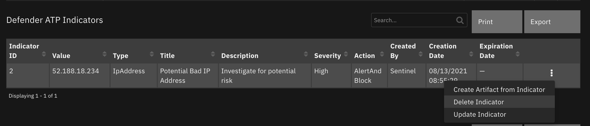

<details><summary>Inputs:</summary>
<p>

| Name | Type | Required | Example | Tooltip |
| ---- | :--: | :------: | ------- | ------- |
| `defender_indicator_id` | `text` | No | `-` | - |

</p>
</details>

<details><summary>Outputs:</summary>
<p>

```python
results = {
  'version': '1.0',
  'success': True,
  'reason': None,
  'content': {

  },
  'raw': '{}',
  'inputs': {
    'defender_indicator_id': '11'
  },
  'metrics': {
    'version': '1.0',
    'package': 'fn-microsoft-defender',
    'package_version': '1.0.0',
    'host': 'MacBook-Pro.local',
    'execution_time_ms': 665,
    'timestamp': '2021-10-26 21:33:51'
  }
}
```

</p>
</details>

<details><summary>Example Pre-Process Script:</summary>
<p>

```python
inputs.defender_indicator_id = row['ind_id']
```

</p>
</details>

<details><summary>Example Post-Process Script:</summary>
<p>

```python
import java.util.Date as Date

msg = u"Defender Action {}.\nAction: Delete Indicator\nIndicator: {}"\
   .format("successful" if results.success else "unsuccessful",
           row['ind_value'],
           )

if results.success:
  row['report_date'] = Date().getTime()
  row['status'] = 'Inactive'
else:
  msg = u"{}\nReason: {}".format(msg, results.reason)

incident.addNote(helper.createPlainText(msg))

```

</p>
</details>

---
## Function - Defender Get Incident
Get a Defender 365 Incident

<details><summary>Inputs:</summary>
<p>

| Name | Type | Required | Example | Tooltip |
| ---- | :--: | :------: | ------- | ------- |
| `defender_alert_result_max` | `number` | No | `5` | Number of top results to return |
| `defender_incident_id` | `number` | No | `-` | - |

</p>
</details>

<details><summary>Outputs:</summary>
<p>

```python
results = {
  'version': 2.0,
  'success': True,
  'reason': None,
  'content': {
    '@odata.context': 'https://api.securitycenter.microsoft.com/api/$metadata#Incidents/$entity',
    'incidentId': 31,
    'incidentUri': 'https://security.microsoft.com/incidents/31?tid=50ad7d3e-b889-434d-802d-13b87c68047b',
    'redirectIncidentId': None,
    'incidentName': 'Multi-stage incident involving Initial access & Discovery on one endpoint',
    'createdTime': '2021-10-18T18:22:55.0166667Z',
    'lastUpdateTime': '2021-10-27T01:12:39.9333333Z',
    'assignedTo': 'Defender 365',
    'classification': 'TruePositive',
    'determination': 'Malware',
    'status': 'Active',
    'severity': 'Medium',
    'tags': [
      'tagA',
      'tagB'
    ],
    'comments': [
      {
        'comment': 'new comment from azure',
        'createdBy': 'abc@swivrllc.onmicrosoft.com',
        'createdTime': '2021-10-22T20:53:53.9133333Z'
      }
    ],
    'alerts': [
      {
        'alertId': 'da637701781744658799_2045659800',
        'providerAlertId': 'da637701781744658799_2045659800',
        'incidentId': 31,
        'serviceSource': 'MicrosoftDefenderForEndpoint',
        'creationTime': '2021-10-18T18:22:54.465905Z',
        'lastUpdatedTime': '2021-10-27T01:12:39.9533333Z',
        'resolvedTime': '2021-10-26T20:38:24.3646436Z',
        'firstActivity': '2021-10-18T18:19:38.3176713Z',
        'lastActivity': '2021-10-18T18:19:40.2929171Z',
        'title': 'Suspicious Task Scheduler activity',
        'description': 'A process involved in earlier malicious activity used Task Scheduler to create, modify, or delete a task. This might be an attempt launch malicious code automatically and establish persistence.',
        'category': 'Persistence',
        'status': 'Resolved',
        'severity': 'Medium',
        'investigationId': None,
        'investigationState': 'UnsupportedAlertType',
        'classification': 'TruePositive',
        'determination': 'Other',
        'detectionSource': 'WindowsDefenderAtp',
        'detectorId': '446b23e1-48b0-41f9-ae7b-03655adcf941',
        'assignedTo': 'Automation',
        'actorName': None,
        'threatFamilyName': None,
        'mitreTechniques': [
          'T1053'
        ],
        'devices': [
          {
            'mdatpDeviceId': '2a94aaf80aa31094790ce40da6fdfc03a9a145c5',
            'aadDeviceId': None,
            'deviceDnsName': 'windowsvmos',
            'osPlatform': 'Windows10',
            'version': '20H2',
            'osProcessor': 'x64',
            'osBuild': 19042,
            'healthStatus': 'Active',
            'riskScore': 'High',
            'rbacGroupName': None,
            'firstSeen': '2021-08-11T13:36:43.1619242Z',
            'tags': [

            ],
            'defenderAvStatus': 'Updated',
            'onboardingStatus': 'Onboarded',
            'vmMetadata': {
              'vmId': '55de7a4c-b77a-4748-9c4f-048b88c0f3aa',
              'cloudProvider': 'Azure',
              'resourceId': '/subscriptions/a4b7e24a-c7aa-4d84-8dae-89e99b336784/resourceGroups/DEMOASSETS/providers/Microsoft.Compute/virtualMachines/WindowsVMOS',
              'subscriptionId': 'a4b7e24a-c7aa-4d84-8dae-89e99b336784'
            }
          }
        ],
        'entities': [
          {
            'entityType': 'Process',
            'evidenceCreationTime': '2021-10-18T18:22:54.73Z',
            'verdict': 'Suspicious',
            'remediationStatus': 'None',
            'sha1': 'f5ee89bb1e4a0b1c3c7f1e8d05d0677f2b2b5919',
            'sha256': '73a3c4aef5de385875339fc2eb7e58a9e8a47b6161bdc6436bf78a763537be70',
            'fileName': 'powershell.exe',
            'filePath': 'C:\\Windows\\SysWOW64\\WindowsPowerShell\\v1.0',
            'processId': 10212,
            'processCommandLine': "powershell.exe -W Hidden -Exec Bypass -Command cd /;$fileBase64Prefix = ''",
            'processCreationTime': '2021-10-18T18:19:33.3686931Z',
            'parentProcessId': 10452,
            'parentProcessCreationTime': '2021-10-18T18:19:11.4593785Z',
            'parentProcessFileName': 'WINWORD.EXE',
            'parentProcessFilePath': 'C:\\Program Files (x86)\\Microsoft Office\\root\\Office16',
            'accountName': 'userAccount',
            'domainName': 'WindowsVMOS',
            'userSid': 'S-1-5-21-1542157044-1944968518-3635326852-500',
            'aadUserId': 'ae973ab4-1b5e-48b2-bf2f-c3bf1b3634a2',
            'userPrincipalName': 'def@swivrllc.onmicrosoft.com',
            'detectionStatus': 'Detected',
            'deviceId': '2a94aaf80aa31094790ce40da6fdfc03a9a145c5'
          }
        ]
      }
    ]
  },
  'raw': None,
  'inputs': {
    'defender_classification': 'TruePositive',
    'defender_incident_id': 31,
    'defender_determination': 'Malware',
    'defender_tags': 'tagA,tagB',
    'defender_incident_status': 'Active'
  },
  'metrics': {
    'version': '1.0',
    'package': 'fn-microsoft-defender',
    'package_version': '1.0.0',
    'host': 'Marks-MacBook-Pro.local',
    'execution_time_ms': 1950,
    'timestamp': '2021-10-26 21:12:40'
  }
}
```

</p>
</details>

<details><summary>Example Pre-Process Script:</summary>
<p>

```python
inputs.defender_incident_id = incident.properties.defender_incident_id

```

</p>
</details>

<details><summary>Example Post-Process Script:</summary>
<p>

```python
import java.util.Date as Date

now = Date().getTime()

resultz = results

if resultz.success:
    # get max alert setting
    max_alerts = int(resultz.inputs.get('defender_alert_result_max', 0))
    row_count = 0
    machine_list = []
    for alert in resultz.content.get('alerts', {}):
        for device in alert.get('devices', {}):
            if device['mdatpDeviceId'] not in machine_list:
                machine_list.append(device['mdatpDeviceId'])
                row = incident.addRow('defender_machines')
                row['report_date'] = int(Date().getTime())
                row['machine_link'] = "<a target='blank' href='https://security.microsoft.com/machines/{}/overview'>machine</a>".format(device['mdatpDeviceId'])
                row['machine_id'] = device['mdatpDeviceId']
                row['machine_name'] = device['deviceDnsName']
                row['machine_platform'] = device['osPlatform']
                row['machine_firstseen'] = device['firstSeen_ts']
                row['machine_health_status'] = device.get('healthStatus')
                row['machine_risk_score'] = device.get('riskScore')
                row['machine_tags'] = ', '.join(device.get('tags', []))

            if row_count < max_alerts or not max_alerts:
                row = incident.addRow("defender_alerts")
                row['report_date'] = now
                row['alert_link'] = "<a target='blank' href='https://security.microsoft.com/alerts/{}'>Alert</a>".format(alert['alertId'])
                row['alert_id'] = alert['alertId']
                row['assigned_to'] = alert['assignedTo']
                row['severity'] = alert['severity']
                row['status'] = alert['status']
                row['title'] = alert['title']
                row['alert_description'] = alert['description']
                row['classification'] = alert['classification']
                row['determination'] = alert['determination']
                row['category'] = alert['category']
                row['mitre_techniques'] = str(' '.join(alert['mitreTechniques']))

                # include the machine inform
                row['computer_name'] = device['deviceDnsName']
                row['machine_id'] = device['mdatpDeviceId']
                row['risk_score'] = device['riskScore']
                row['first_seen'] = device['firstSeen']
            row_count += 1

else:
    msg = u"Defender Get Incident unsuccessful.\nReason: {}".format(resultz.reason)
    incident.addNote(msg)

```

</p>
</details>

---
## Function - Defender Find Machines by Internal IP
Find Defender Machine(s) by Internal IP address

 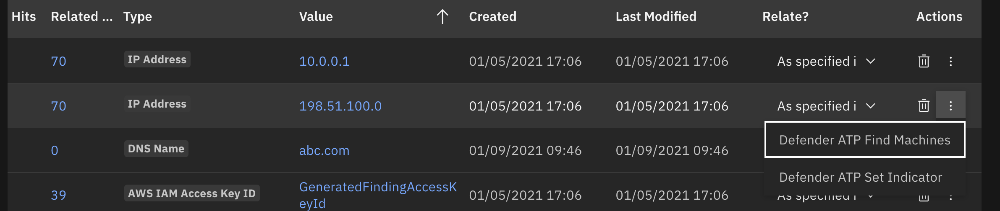

<details><summary>Inputs:</summary>
<p>

| Name | Type | Required | Example | Tooltip |
| ---- | :--: | :------: | ------- | ------- |
| `defender_indicator_value` | `text` | No | `-` | - |
| `defender_lookback_timeframe` | `datepicker` | Yes | `-` | This value must be within 30 days of current date |

</p>
</details>

<details><summary>Outputs:</summary>
<p>

```python
results = {
    # TODO: Copy and paste an example of the Function Output within this code block.
    # To view the output of a Function, run resilient-circuits in DEBUG mode and invoke the Function.
    # The Function results will be printed in the logs: "resilient-circuits run --loglevel=DEBUG"
}
```

</p>
</details>

<details><summary>Example Pre-Process Script:</summary>
<p>

```python
inputs.defender_indicator_value = artifact.value
inputs.defender_lookback_timeframe = rule.properties.defender_lookback_timeframe
```

</p>
</details>

<details><summary>Example Post-Process Script:</summary>
<p>

```python
import time
"""
"value": [
    {
        "id": "04c99d46599f078f1c3da3783cf5b95f01ac61bb",
        "computerDnsName": "",
        "firstSeen": "2017-07-06T01:25:04.9480498Z",
        "osPlatform": "Windows10",
    }
]
"""
if results.success:
  if not results.content['value']:
    msg = u"Defender Find machines by IP Address unsuccessful.\nNothing found for {}".format(artifact.value)
    incident.addNote(helper.createPlainText(msg))
  else:
    for machine in results.content['value']:
        row = incident.addRow("defender_atp_machines")
        row['report_date'] = int(time.time()*1000)
        row['machine_id'] = machine['id']
        row['machine_name'] = machine['computerDnsName']
        row['machine_platform'] = machine['osPlatform']
        row['machine_firstseen'] = machine['firstSeen_ts']
        row['machine_lastseen'] = machine['lastSeen_ts']
        row['machine_health_status'] = machine.get('healthStatus')
        row['machine_risk_score'] = machine.get('riskScore')
        row['machine_exposure_level'] = machine.get('exposureLevel')
        row['machine_tags'] = ', '.join(machine.get('machineTags', []))
else:
    msg = u"Defender Action unsuccessful.\nAction: Find machines by IP Address\nReason: {}".format(results.reason)
    incident.addNote(helper.createPlainText(msg))
```

</p>
</details>

---
## Function - Defender Update Alert
Update a Defender Alert

 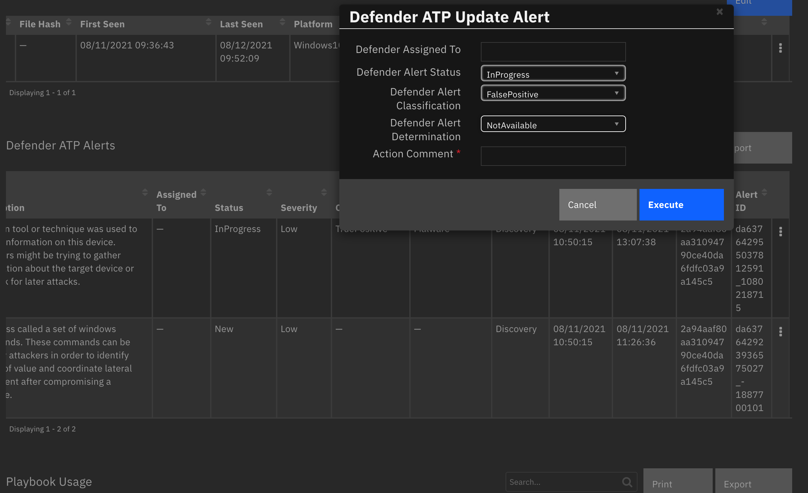

<details><summary>Inputs:</summary>
<p>

| Name | Type | Required | Example | Tooltip |
| ---- | :--: | :------: | ------- | ------- |
| `defender_alert_assigned_to` | `text` | No | `-` | - |
| `defender_alert_id` | `text` | Yes | `-` | - |
| `defender_alert_status` | `select` | No | `-` | - |
| `defender_classification` | `select` | No | `-` | - |
| `defender_description` | `text` | No | `-` | - |
| `defender_determination` | `select` | No | `-` | - |

</p>
</details>

<details><summary>Outputs:</summary>
<p>

```python
results = {
  'version': 2.0,
  'success': True,
  'reason': None,
  'content': {
    '@odata.context': 'https://api.securitycenter.microsoft.com/api/$metadata#Incidents/$entity',
    'incidentId': 31,
    'incidentUri': 'https://security.microsoft.com/incidents/31?tid=50ad7d3e-b889-434d-802d-13b87c68047b',
    'redirectIncidentId': None,
    'incidentName': 'Multi-stage incident involving Initial access & Discovery on one endpoint',
    'createdTime': '2021-10-18T18:22:55.0166667Z',
    'lastUpdateTime': '2021-10-27T20:06:15.0466667Z',
    'assignedTo': 'Defender 365',
    'classification': 'TruePositive',
    'determination': 'Malware',
    'status': 'Active',
    'severity': 'Medium',
    'tags': [
      'tagA',
      'tagB'
    ],
    'comments': [
      {
        'comment': 'new comment from azure',
        'createdBy': 'MarkScherfling@swivrllc.onmicrosoft.com',
        'createdTime': '2021-10-22T20:53:53.9133333Z'
      }
    ],
    'alerts': [
      {
        'alertId': 'da637701781744658799_2045659800',
        'providerAlertId': 'da637701781744658799_2045659800',
        'incidentId': 31,
        'serviceSource': 'MicrosoftDefenderForEndpoint',
        'creationTime': '2021-10-18T18:22:54.465905Z',
        'lastUpdatedTime': '2021-10-27T20:06:15.07Z',
        'resolvedTime': None,
        'firstActivity': '2021-10-18T18:19:38.3176713Z',
        'lastActivity': '2021-10-18T18:19:40.2929171Z',
        'title': 'Suspicious Task Scheduler activity',
        'description': 'A process involved in earlier malicious activity used Task Scheduler to create, modify, or delete a task. This might be an attempt launch malicious code automatically and establish persistence.',
        'category': 'Persistence',
        'status': 'InProgress',
        'severity': 'Medium',
        'investigationId': None,
        'investigationState': 'UnsupportedAlertType',
        'classification': 'TruePositive',
        'determination': 'Other',
        'detectionSource': 'WindowsDefenderAtp',
        'detectorId': '446b23e1-48b0-41f9-ae7b-03655adcf941',
        'assignedTo': 'Automation',
        'actorName': None,
        'threatFamilyName': None,
        'mitreTechniques': [
          'T1053'
        ],
        'devices': [
          {
            'mdatpDeviceId': '2a94aaf80aa31094790ce40da6fdfc03a9a145c5',
            'aadDeviceId': None,
            'deviceDnsName': 'windowsvmos',
            'osPlatform': 'Windows10',
            'version': '20H2',
            'osProcessor': 'x64',
            'osBuild': 19042,
            'healthStatus': 'Active',
            'riskScore': 'High',
            'rbacGroupName': None,
            'firstSeen': '2021-08-11T13:36:43.1619242Z',
            'tags': [

            ],
            'defenderAvStatus': 'Updated',
            'onboardingStatus': 'Onboarded',
            'vmMetadata': {
              'vmId': '55de7a4c-b77a-4748-9c4f-048b88c0f3aa',
              'cloudProvider': 'Azure',
              'resourceId': '/subscriptions/a4b7e24a-c7aa-4d84-8dae-89e99b336784/resourceGroups/DEMOASSETS/providers/Microsoft.Compute/virtualMachines/WindowsVMOS',
              'subscriptionId': 'a4b7e24a-c7aa-4d84-8dae-89e99b336784'
            }
          }
        ],
        'entities': [
          {
            'entityType': 'Process',
            'evidenceCreationTime': '2021-10-18T18:22:54.73Z',
            'verdict': 'Suspicious',
            'remediationStatus': 'None',
            'sha1': 'f5ee89bb1e4a0b1c3c7f1e8d05d0677f2b2b5919',
            'sha256': '73a3c4aef5de385875339fc2eb7e58a9e8a47b6161bdc6436bf78a763537be70',
            'fileName': 'powershell.exe',
            'filePath': 'C:\\Windows\\SysWOW64\\WindowsPowerShell\\v1.0',
            'processId': 10212,
            'processCommandLine': "powershell.exe",
            'processCreationTime': '2021-10-18T18:19:33.3686931Z',
            'parentProcessId': 10452,
            'parentProcessCreationTime': '2021-10-18T18:19:11.4593785Z',
            'parentProcessFileName': 'WINWORD.EXE',
            'parentProcessFilePath': 'C:\\Program Files (x86)\\Microsoft Office\\root\\Office16',
            'accountName': 'edgarjohnson',
            'domainName': 'WindowsVMOS',
            'userSid': 'S-1-5-21-1542157044-1944968518-3635326852-500',
            'aadUserId': 'ae973ab4-1b5e-48b2-bf2f-c3bf1b3634a2',
            'userPrincipalName': 'edgarjohnson@swivrllc.onmicrosoft.com',
            'detectionStatus': 'Detected',
            'deviceId': '2a94aaf80aa31094790ce40da6fdfc03a9a145c5'
          }
        ]
      }
    ]
  },
  'raw': None,
  'inputs': {
    'defender_classification': 'TruePositive',
    'defender_incident_id': 31,
    'defender_determination': 'Malware',
    'defender_comment': 'Action successful.\nAction: Update Alert\nAlert: da637701781744658799_2045659800\nMachine: windowsvmos\nComment: Malware\nStatus: InProgress\nClassification: TruePositive\nDetermination: Malware',
    'defender_tags': 'tagA,tagB',
    'defender_incident_status': 'Active'
  },
  'metrics': {
    'version': '1.0',
    'package': 'fn-microsoft-defender',
    'package_version': '1.0.0',
    'host': 'a2875bae-fd94-432b-8395-2a59908315b3-57c5bb9c88-7gbcp',
    'execution_time_ms': 1479,
    'timestamp': '2021-10-27 20:06:15'
  }
}
```

</p>
</details>

<details><summary>Example Pre-Process Script:</summary>
<p>

```python
inputs.defender_alert_id = row['alert_id']
if rule.properties.defender_alert_classification:
    inputs.defender_classification = str(rule.properties.defender_alert_classification)
if rule.properties.defender_alert_determination:
    inputs.defender_determination = str(rule.properties.defender_alert_determination)
if rule.properties.defender_alert_status:
    inputs.defender_alert_status = str(rule.properties.defender_alert_status)
inputs.defender_description = rule.properties.defender_action_comment
inputs.defender_alert_assigned_to = rule.properties.defender_alert_assigned_to
```

</p>
</details>

<details><summary>Example Post-Process Script:</summary>
<p>

```python
msg = u"Action {}.\nAction: Update Alert\nAlert: {}\nMachine: {}\nComment: {}"\
   .format("successful" if results.success else "unsuccessful",
           row['alert_id'],
           row['computer_name'],
           rule.properties.defender_action_comment)
if rule.properties.defender_alert_assigned_to:
    msg = u"{}\nAssigned to: {}".format(msg, rule.properties.defender_alert_assigned_to)
if rule.properties.defender_alert_status:
    msg = u"{}\nStatus: {}".format(msg, str(rule.properties.defender_alert_status))
if rule.properties.defender_alert_classification:
    msg = u"{}\nClassification: {}".format(msg, str(rule.properties.defender_alert_classification))
if rule.properties.defender_alert_determination:
    msg = u"{}\nDetermination: {}".format(msg, str(rule.properties.defender_alert_determination))

if not results.success:
    msg = u"{}\nReason: {}".format(msg, results.reason)

incident.addNote(msg)

if results.success:
    alert = results.content
    row['classification'] = alert['classification']
    row['determination'] = alert['determination']
    row['status'] = alert['status']
    row['severity'] = alert['severity']
    row['assigned_to'] = alert['assignedTo']

```

</p>
</details>

---
## Function - Defender Collect Machine Investigation Package
Collect the machine investigation package


<details><summary>Inputs:</summary>
<p>

| Name | Type | Required | Example | Tooltip |
| ---- | :--: | :------: | ------- | ------- |
| `defender_description` | `text` | No | `-` | - |
| `defender_machine_id` | `text` | Yes | `-` | - |

</p>
</details>

<details><summary>Outputs:</summary>
<p>

```python
results = {
  'version': 2.0,
  'success': True,
  'reason': None,
  'content': {
    '@odata.context': 'https://api.securitycenter.microsoft.com/api/$metadata#MachineActions/$entity',
    'id': '78680309-6688-4e5b-a863-57382c61ba68',
    'type': 'CollectInvestigationPackage',
    'title': None,
    'requestor': '2578565a-7957-474e-b626-d290d93c7e38',
    'requestorComment': 'investigate',
    'status': 'Succeeded',
    'machineId': '2a94aaf80aa31094790ce40da6fdfc03a9a145c5',
    'computerDnsName': 'windowsvmos',
    'creationDateTimeUtc': '2021-10-27T20:31:39.226874Z',
    'lastUpdateDateTimeUtc': '2021-10-27T20:33:29.9190697Z',
    'cancellationRequestor': None,
    'cancellationComment': None,
    'cancellationDateTimeUtc': None,
    'errorHResult': 0,
    'scope': None,
    'externalId': None,
    'requestSource': 'PublicApi',
    'relatedFileInfo': None,
    'commands': [

    ],
    'troubleshootInfo': None
  },
  'raw': None,
  'inputs': {
    'defender_description': 'investigate',
    'defender_machine_id': '2a94aaf80aa31094790ce40da6fdfc03a9a145c5'
  },
  'metrics': {
    'version': '1.0',
    'package': 'fn-microsoft-defender',
    'package_version': '1.0.0',
    'host': 'a2875bae-fd94-432b-8395-2a59908315b3-57df779566-tkf5x',
    'execution_time_ms': 122480,
    'timestamp': '2021-10-27 20:33:40'
  }
}
```

</p>
</details>

<details><summary>Example Pre-Process Script:</summary>
<p>

```python
inputs.defender_machine_id = row['machine_id']
inputs.defender_description = rule.properties.defender_action_comment
```

</p>
</details>

<details><summary>Example Post-Process Script:</summary>
<p>

```python
import time

if results.success:
  msg = "Action: {}\nComment: {}\nStatus: {}\nStart Date: {}".format(
    results.content['type'],
    results.content['requestorComment'],
    results.content['status'],
    results.content['creationDateTimeUtc']
    )
  row['machine_last_action'] = helper.createPlainText(msg)
  row['report_date'] = int(time.time()*1000)

"""
    'type': 'CollectInvestigationPackage',
    'title': None,
    'requestor': 'f0dc3f88-f617-449c-960c-6b54818cd110',
    'requestorComment': 'ss',
    'status': 'Succeeded',
    'machineId': '2a94aaf80aa31094790ce40da6fdfc03a9a145c5',
    'computerDnsName': 'windowsvmos',
    'creationDateTimeUtc': '2021-08-12T18:53:06.5259227Z',
    'lastUpdateDateTimeUtc': '2021-08-12T18:54:20.4259984Z',
"""

```

</p>
</details>

---

## Script - Create Artifact from Indicator
Convert a Defender indicator to an Artifact for further enrichment or remediation

**Object:** defender_indicators

<details><summary>Script Text:</summary>
<p>

```python
# Convert a Defender indicator to an artifact_type
# lookup for Defender indicator types to arttfact types
type_lookup = {
        "FileSha1": "Malware SHA-1 Hash",
        "FileSha256": "Malware SHA-256 Hash",
        "IpAddress": "IP Address",
        "DomainName": "DNS Name",
        "Url": "URL"
    }

artifact_type = type_lookup.get(row['ind_type'], "String")
artifact_description = u"{}\n{}".format(row['ind_title'], row['ind_description'])
incident.addArtifact(artifact_type, row['ind_value'], artifact_description)

msg = u"Defender Action successful.\nIndicator: {}\nAction: Create Artifact".format(row['ind_value'])
incident.addNote(msg)
```

</p>
</details>

---

## Data Table - Defender Machines

 

#### API Name:
defender_machines

#### Columns:
| Column Name | API Access Name | Type | Tooltip |
| ----------- | --------------- | ---- | ------- |
| Exposure Level | `machine_exposure_level` | `text` | - |
| File Hash | `machine_file_hash` | `text` | - |
| First Seen | `machine_firstseen` | `datetimepicker` | - |
| Health Status | `machine_health_status` | `text` | - |
| Machine ID | `machine_id` | `text` | - |
| IP Address | `machine_ip` | `text` | - |
| Last Action | `machine_last_action` | `textarea` | - |
| Last Seen | `machine_lastseen` | `datetimepicker` | - |
| Machine Link | `machine_link` | `textarea` | - |
| Machine Name | `machine_name` | `text` | - |
| Platform | `machine_platform` | `text` | - |
| Risk Score | `machine_risk_score` | `text` | - |
| Machine Tags | `machine_tags` | `text` | - |
| Report Date | `report_date` | `datetimepicker` | - |

---
## Data Table - Defender Alerts

 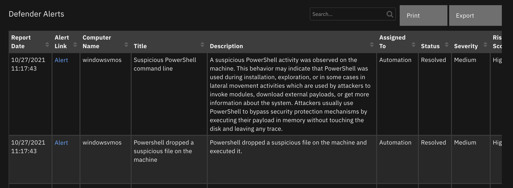

#### API Name:
defender_alerts

#### Columns:
| Column Name | API Access Name | Type | Tooltip |
| ----------- | --------------- | ---- | ------- |
| Description | `alert_description` | `text` | - |
| Alert ID | `alert_id` | `text` | - |
| Alert Link | `alert_link` | `textarea` | - |
| Assigned To | `assigned_to` | `text` | - |
| Category | `category` | `text` | - |
| Classification | `classification` | `text` | - |
| Computer Name | `computer_name` | `text` | - |
| Determination | `determination` | `text` | - |
| First Seen | `first_seen` | `text` | - |
| Machine ID | `machine_id` | `text` | - |
| Mitre Techniques | `mitre_techniques` | `text` | - |
| Report Date | `report_date` | `datetimepicker` | - |
| Risk Score | `risk_score` | `text` | - |
| Severity | `severity` | `text` | - |
| Status | `status` | `text` | - |
| Title | `title` | `text` | - |

---
## Data Table - Defender Indicators

 

#### API Name:
defender_indicators

#### Columns:
| Column Name | API Access Name | Type | Tooltip |
| ----------- | --------------- | ---- | ------- |
| Action | `ind_action` | `text` | - |
| Created By | `ind_created_by` | `text` | - |
| Creation Date | `ind_creation_date` | `datetimepicker` | - |
| Description | `ind_description` | `text` | - |
| Expiration Date | `ind_expiration_date` | `datetimepicker` | - |
| Indicator ID | `ind_id` | `text` | - |
| Severity | `ind_severity` | `text` | - |
| Title | `ind_title` | `text` | - |
| Type | `ind_type` | `text` | - |
| Value | `ind_value` | `text` | - |
| Report Date | `report_date` | `datetimepicker` | - |
| Status | `status` | `text` | - |

---

## Custom Fields
| Label | API Access Name | Type | Prefix | Placeholder | Tooltip |
| ----- | --------------- | ---- | ------ | ----------- | ------- |
| Defender Incident LastUpdateTime | `defender_incident_lastupdatetime` | `datepicker` | `properties` | - | - |
| Defender Tags | `defender_tags` | `text` | `properties` | - | comma separated list of Defender tags |
| Defender Incident Id | `defender_incident_id` | `number` | `properties` | - | - |
| Defender Incident Url | `defender_incident_url` | `textarea` | `properties` | - | - |
| Defender Incident CreateTime | `defender_incident_createtime` | `datetimepicker` | `properties` | - | - |
| Defender Classification | `defender_classification` | `select` | `properties` | - | Unknown, FalsePositive, TruePositive. |
| Defender Determination | `defender_determination` | `select` | `properties` | - | NotAvailable, Apt, Malware, SecurityPersonnel, SecurityTesting, UnwantedSoftware, Other |

---


## Rules
| Rule Name | Object | Workflow Triggered |
| --------- | ------ | ------------------ |
| Defender Find Machine by DNS name | artifact | `defender_find_machines_by_filter` |
| Defender Update Alert | defender_alerts | `defender_atp_update_alert` |
| Defender Close Incident | incident | `defender_close_incident` |
| Defender Get Incident | incident | `defender_get_incident` |
| Defender Refresh Incident | incident | `defender_refresh_incident` |
| Create Artifact from Indicator | defender_indicators | `-` |
| Defender List Indicators | incident | `defender_list_indicators` |
| Delete Indicator | defender_indicators | `defender_atp_delete_indicator` |
| Defender Machine Scan | defender_machines | `defender_atp_machine_scan` |
| Defender Find Machines | artifact | `defender_atp_find_machines` |
| Defender Find Machines by File Hash | artifact | `defender_atp_find_machines_by_file_hash` |
| Defender Machine Isolate Action | defender_machines | `defender_atp_machine_isolation` |
| Defender Get File Information | artifact | `defender_atp_get_file_information` |
| Defender Machine Quarantine File | defender_machines | `defender_quarantine_file` |
| Defender Machine Update Information | defender_machines | `defender_get_updated_machine_information` |
| Defender Machine Vulnerabilities | defender_machines | `defender_atp_machine_vulnerabilities` |
| Defender Machine App Execution Restriction | defender_machines | `defender_atp_app_execution` |
| Update Indicator | defender_indicators | `defender_atp_update_indicator` |
| Defender Machine Collect Investigation Package | defender_machines | `defender_atp_collect_machine_investigation_package` |
| Defender Set Indicator | artifact | `defender_atp_set_indicator` |

---

## Troubleshooting & Support
Refer to the documentation listed in the Requirements section for troubleshooting information.

### For Support
This is a IBM Supported provided App. Use the SOAR Community https://ibm.biz/soarcommunity for app assistance and IBM Support for issue tracking https://ibm.com/mysupport.

## Template Appendix

<details><summary>incident_creation_template</summary>
<pre>
{
  {# JINJA template for creating a new Resilient incident from a Defender incident. #}
  "name": "Defender Incident - {{ incidentName|replace('"', '\\"') }}",
  "discovered_date": {{ createdTime|resilient_datetimeformat }},
  "start_date": {{ createdTime|resilient_datetimeformat }},
  {# if Defender alert users are different than SOAR users, consider using a mapping table using resilient_substitute: #}
  {# "owner_id": "{{ assignedTo|resilient_substitute('{"Automation": "soar_user1@ent.com", "defender_user2@co.com": "soar_user2@ent.com", "DEFAULT": "default_user@ent.com" }') }}", #}
  "plan_status": "{{ status|resilient_substitute('{"Resolved": "C", "Active": "A", "New": "A"}') }}",
  "severity_code": "{{ severity|resilient_substitute('{"Informational": "Low"}') }}",
  "properties": {
    "defender_incident_id": {{ incidentId }},
    "defender_incident_url": "<a target='blank' href='{{ incidentUri }}'>Defender Incident</a>",
    "defender_classification": "{{ classification|replace('"', '\\"') }}",
    "defender_determination": "{{ determination|replace('"', '\\"') }}",
    "defender_incident_createtime": {{ createdTime|resilient_datetimeformat }},
    "defender_incident_lastupdatetime": {{ lastUpdateTime|resilient_datetimeformat }},
    "defender_tags": "{{ tags | join(',') }}"
  },
  "artifacts": [
    
     
      
        
      
        
      
      
      
      
      {
        "type": {
          "name": "IP Address"
        },
        "value": "{{ item.ipAddress }}",
        "description": {
          "format": "text",
          "content": "creation date: {{ item.evidenceCreationTime }}\n{{ machine_comment }}"
        }
      }
      
      
      {
        "type": {
          "name": "User Account"
        },
        "value": "{{ item.userPrincipalName }}",
        "description": {
          "format": "text",
          "content": "creation date: {{ item.evidenceCreationTime }}\n{{ machine_comment }}"
        }
      }
      
      
      {
        "type": {
          "name": "Process Name"
        },
        "value": "{{ item.processCommandLine[:100]|replace('\\', '\\\\')|replace('"', '\\"') }}",
        "description": {
          "format": "text",
          "content": "creation date: {{ item.evidenceCreationTime }}\n{{ machine_comment }}"
        }
      }
      
      
      {
        "type": {
          "name": "File Name"
        },
        "value": "{{ item.fileName|replace('\\', '\\\\')|replace('"', '\\"') }}",
        "description": {
          "format": "text",
          "content": "creation date: {{ item.evidenceCreationTime }}\nFile Path: {{ item.filePath|replace('\\', '\\\\')|replace('"', '\\"') }}\n{{ machine_comment }}"
        }
      }
      
      
      {
        "type": {
          "name": "URL"
        },
        "value": "{{ item.url }}",
        "description": {
          "format": "text",
          "content": "creation date: {{ item.evidenceCreationTime }}\n{{ machine_comment }}"
        }
      }
      
      
      {
        "type": {
          "name": "File Name"
        },
        "value": "{{ item.fileName }}",
        "description": {
          "format": "text",
          "content": "creation date: {{ item.evidenceCreationTime }}\nfile path: {{ item.filePath|replace('\\', '\\\\') }}\n{{ machine_comment }}"
        }
      }
      
      ,{
        "type": {
          "name": "Malware SHA-1 Hash"
        },
        "value": "{{ item.sha1 }}",
        "description": {
          "format": "text",
          "content": "creation date: {{ item.evidenceCreationTime }}\nfile name: {{ item.fileName }}\n{{ machine_comment }}"
        }
      }
      
      
      ,{
        "type": {
          "name": "Malware SHA-256 Hash"
        },
        "value": "{{ item.sha256 }}",
        "description": {
          "format": "text",
          "content": "creation date: {{ item.evidenceCreationTime }}\nfile name: {{ item.fileName }}\n{{ machine_comment }}"
        }
      }
      
      
      
      {
        "type": {
          "name": "Registry Key"
        },
        "value": "{{ item.registryHive|lower }}\\{{ item.registryKey|replace('\\', '\\\\') }}",
        "description": {
          "format": "text",
          "content": "creation date: {{ item.evidenceCreationTime }} }}\n{{ machine_comment }}"
        },
        "properties":[
          {
            "name": "{{ item.registryKey|replace('\\', '\\\\') }}",
            "value": "{{ item.registryValue|replace('\\', '\\\\')|replace('"', '\\"') }}"
          }
        ]
      }
      
      
      {
        "type": {
          "name": "Email Sender"
        },
        "value": "{{ item.sender|replace('"', '\\"') }}",
        "description": {
          "format": "text",
          "content": "creation date: {{ item.evidenceCreationTime }}\n{{ machine_comment }}"
        }
      },
      {
        "type": {
          "name": "Email Recipient"
        },
        "value": "{{ item.recipient|replace('"', '\\"') }}",
        "description": {
          "format": "text",
          "content": "creation date: {{ item.evidenceCreationTime }}\n{{ machine_comment }}"
        }
      },
      {
        "type": {
          "name": "Email Subject"
        },
        "value": "{{ item.subject|replace('"', '\\"') }}",
        "description": {
          "format": "text",
          "content": "creation date: {{ item.evidenceCreationTime }}\n{{ machine_comment }}"
        }
      }
      
      ,
     
     ,
    
  ],
  "comments": [
    
      
      {
        "text": {
          "format": "text",
          "content": "Defender Incident comment: {{ comment.createdTime }}\n{{ comment.comment|replace("<br>", "\n")|replace('"', '\\"') }}"
        }
      }
      ,
      
    
  ]
}

</pre>
</details>
<details><summary>incident_update_template</summary>
<pre>
{
  {# JINJA template for creating a new Resilient incident from a Defender incident. #}
  "name": "Defender Incident - {{ incidentName|replace('"', '\\"') }}",
  "description": {
    "format": "text",
    "content": "{{ description|replace('"', '\\"') }}"
  },
  {# if Defender users are different than SOAR users, consider using a mapping table using resilient_substitute: #}
  {# "owner_id": "{{ assignedTo|resilient_substitute('{"Automation": "soar_user1@ent.com", "defender_user2@co.com": "soar_user2@ent.com", "DEFAULT": "default_user@ent.com" }') }}", #}
  "plan_status": "{{ status|resilient_substitute('{"Resolved": "C", "Active": "A", "New": "A"}') }}",
  "severity_code": "{{ severity|resilient_substitute('{"Informational": "Low"}') }}",
  "properties": {
    "defender_classification": "{{ classification|replace('"', '\\"') }}",
    "defender_determination": "{{ determination|replace('"', '\\"') }}",
    "defender_tags": "{{ tags | join(',') }}"
  }
}
</pre>
</details>
<details><summary>incident_close_template</summary>
<pre>
{
  {# JINJA template for closing a new Resilient incident from a Defender alert. #}
  "plan_status": "C",
  "resolution_id": "Resolved",
  "resolution_summary": "Closed from Defender: {{ investigationState }}",
  "severity_code": "{{ severity|resilient_substitute('{"Informational": "Low"}') }}",
  "properties": {
    "defender_classification": "{{ classification|replace('"', '\\"') }}",
    "defender_determination": "{{ determination|replace('"', '\\"') }}",
    "defender_category": "{{ category|replace('"', '\\"') }}"
  }
}
</pre>
</details>
<details><summary>defender_update_alert_template</summary>
<pre>
{
    {# JINJA template for updating a Defender alert #}
    "properties": {
        "severity": "{{ severity_code|string|resilient_substitute('{"4": "Low", "5": "Medium", "6": "High"}') }}",
        "status": "{{ status }}",
        "classification": "{{ classification }}",
        "determination": "{{ determination }}",
        "assignedTo": "{{ assignedTo }}",
        "comment": "{{ comment }}"
    }
}
</pre>
</details>
<details><summary>defender_update_incident_template</summary>
<pre>
{
    {# JINJA template for updating a Defender incident from a Resilient incident. #}
    
      "status": "{{ defender_incident_status }}"
    
    
        ,"classification": "{{ defender_classification }}"
    
    {# "determine" is set only when classification is TruePositive. Change as necessary #}
    
      
        ,"determination": "{{ defender_determination }}"
      
    
    
        
        ,"tags": {{ tag_list| tojson }}
    
    
        ,"comment": "Created by IBM SOAR<br>{{ defender_comment|striptags|safe }}"
    
}
</pre>
</details>