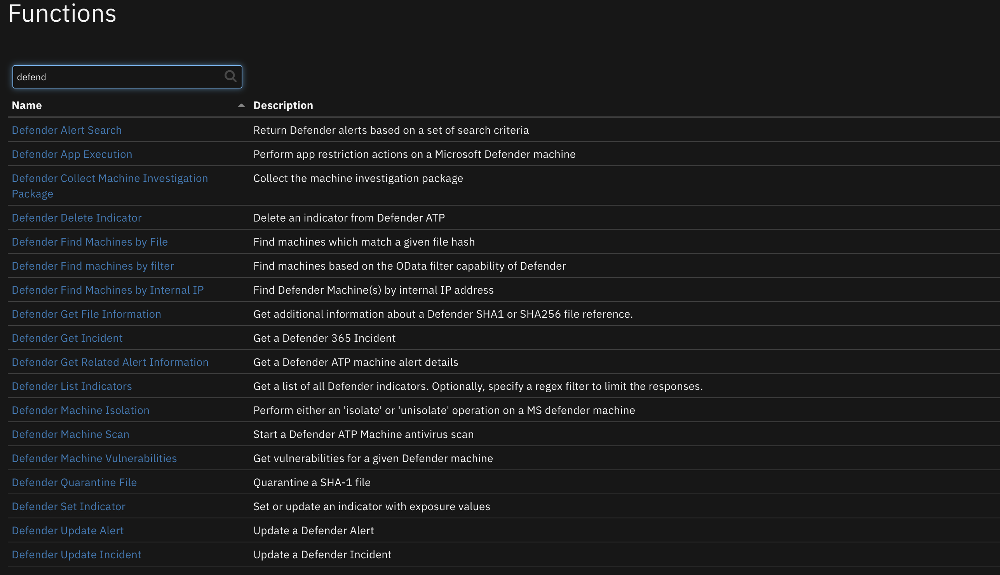

<!--
  This README.md is generated by running:
  "resilient-sdk docgen -p fn_microsoft_defender"

  It is best edited using a Text Editor with a Markdown Previewer. VS Code
  is a good example. Checkout https://guides.github.com/features/mastering-markdown/
  for tips on writing with Markdown

  If you make manual edits and run docgen again, a .bak file will be created

  Store any screenshots in the "doc/screenshots" directory and reference them like:
  

  NOTE: If your app is available in the container-format only, there is no need to mention the integration server in this readme.
-->

# Microsoft Defender ATP Functions

## Table of Contents
- [Release Notes](#release-notes)
- [Overview](#overview)
  - [Key Features](#key-features)
- [Requirements](#requirements)
  - [Resilient platform](#resilient-platform)
  - [Cloud Pak for Security](#cloud-pak-for-security)
  - [Proxy Server](#proxy-server)
- [Installation](#installation)
  - [Install](#install)
  - [App Configuration](#app-configuration)
  - [Custom Layouts](#custom-layouts)
- [Function - Defender Machine Scan](#function---defender-machine-scan)
- [Function - Defender Machine Isolation](#function---defender-machine-isolation)
- [Function - Defender App Execution](#function---defender-app-execution)
- [Function - Defender Quarantine File](#function---defender-quarantine-file)
- [Function - Defender Set Indicator](#function---defender-set-indicator)
- [Function - Defender Find Machines by IP](#function---defender-find-machines-by-ip)
- [Function - Defender List Indicators](#function---defender-list-indicators)
- [Function - Defender Delete Indicator](#function---defender-delete-indicator)
- [Function - Defender Find Machines by File](#function---defender-find-machines-by-file)
- [Function - Defender Search Alerts](#function---defender-search-alerts)
- [Function - Defender Update Alert](#function---defender-update-alert)
- [Script - Create Artifact from Indicator](#script---create-artifact-from-indicator)
- [Data Table - Defender ATP Machines](#data-table---defender-atp-machines)
- [Data Table - Defender ATP Indicators](#data-table---defender-atp-indicators)
- [Data Table - Defender ATP Alerts](#data-table---defender-atp-alerts)
- [Rules](#rules)
- [Troubleshooting & Support](#troubleshooting--support)
---

## Release Notes
<!--
  Specify all changes in this release. Do not remove the release 
  notes of a previous release
-->
| Version | Date | Notes |
| ------- | ---- | ----- |
| 1.0.0 | 01/2021 | Initial Release |

---

## Overview
<!--
  Provide a high-level description of the function itself and its remote software or application.
  The text below is parsed from the "description" and "long_description" attributes in the setup.py file
-->
**Resilient Circuits Components for 'fn_microsoft_defender'**

 

Perform operations against Defender ATP such as set indicators, isolate and quarantine machines, and block file execution

### Key Features
<!--
  List the Key Features of the Integration
-->
* List, set, update and delete Defender indicators
* Search for Defender machines by IP address
* Search for Defender machines by file hash
* Isolate/unisolate Defender machines
* Restrict/unrestrict apps on a Defender machine
* Run an antivirus scan on a Defender machine
* Quarantine files on a Defender machine

---

## Requirements
<!--
  List any Requirements 
-->
This app supports the IBM Resilient SOAR Platform and the IBM Cloud Pak for Security.

### Resilient platform
The Resilient platform supports two app deployment mechanisms, App Host and integration server.

If deploying to a Resilient platform with an App Host, the requirements are:
* Resilient platform >= `36.0.5634`.
* The app is in a container-based format (available from the AppExchange as a `zip` file).

If deploying to a Resilient platform with an integration server, the requirements are:
* Resilient platform >= `36.0.5634`.
* The app is in the older integration format (available from the AppExchange as a `zip` file which contains a `tar.gz` file).
* Integration server is running `resilient_circuits>=30.0.0`.
* If using an API key account, make sure the account provides the following minimum permissions: 
  | Name | Permissions |
  | ---- | ----------- |
  | Org Data | Read |
  | Function | Read |

The following Resilient platform guides provide additional information: 
* _App Host Deployment Guide_: provides installation, configuration, and troubleshooting information, including proxy server settings. 
* _Integration Server Guide_: provides installation, configuration, and troubleshooting information, including proxy server settings.
* _System Administrator Guide_: provides the procedure to install, configure and deploy apps. 

The above guides are available on the IBM Knowledge Center at [ibm.biz/resilient-docs](https://ibm.biz/resilient-docs). On this web page, select your Resilient platform version. On the follow-on page, you can find the _App Host Deployment Guide_ or _Integration Server Guide_ by expanding **Resilient Apps** in the Table of Contents pane. The System Administrator Guide is available by expanding **System Administrator**.

### Cloud Pak for Security
If you are deploying to IBM Cloud Pak for Security, the requirements are:
* IBM Cloud Pak for Security >= 1.4.
* Cloud Pak is configured with an App Host.
* The app is in a container-based format (available from the AppExchange as a `zip` file).

The following Cloud Pak guides provide additional information: 
* _App Host Deployment Guide_: provides installation, configuration, and troubleshooting information, including proxy server settings. From the Table of Contents, select Case Management and Orchestration & Automation > **Orchestration and Automation Apps**.
* _System Administrator Guide_: provides information to install, configure, and deploy apps. From the IBM Cloud Pak for Security Knowledge Center table of contents, select Case Management and Orchestration & Automation > **System administrator**.

These guides are available on the IBM Knowledge Center at [ibm.biz/cp4s-docs](https://ibm.biz/cp4s-docs). From this web page, select your IBM Cloud Pak for Security version. From the version-specific Knowledge Center page, select Case Management and Orchestration & Automation.

### Proxy Server
The app supports a proxy server via the https_proxy and http_proxy app.config settings.

---

## Installation

### Install
* To install or uninstall an App or Integration on the _Resilient platform_, see the documentation at [ibm.biz/resilient-docs](https://ibm.biz/resilient-docs).
* To install or uninstall an App on _IBM Cloud Pak for Security_, see the documentation at [ibm.biz/cp4s-docs](https://ibm.biz/cp4s-docs) and follow the instructions above to navigate to Orchestration and Automation.

### App Configuration
The following table provides the settings you need to configure the app. These settings are made in the app.config file. See the documentation discussed in the Requirements section for the procedure.

| Config | Required | Example | Description |
| ------ | :------: | ------- | ----------- |
| **tenant_id** | Yes | `89d65-...-57bae1c2` | *Azure tenant Id.* |
| **client_id** | Yes | `244ad4-...-3564fc4` | *Azure app id (client id).* |
| **app_secret** | Yes | `940c4d2-...-9d32e1b` | *Azure app secret.* |
| **api_url** | Yes | `https://api.securitycenter.microsoft.com` | *API utl. This can be customized per Azure region.* |

### Custom Layouts
<!--
  Use this section to provide guidance on where the user should add any custom fields and data tables.
  You may wish to recommend a new incident tab.
  You should save a screenshot "custom_layouts.png" in the doc/screenshots directory and reference it here
-->
* Import the Data Tables and Custom Fields like the screenshot below. Your use of custom tabs may vary:

  

---

## Function - Defender Machine Scan
Perform an antivirus scan on a Defender Machine.

 

<details><summary>Inputs:</summary>
<p>

| Name | Type | Required | Example | Tooltip |
| ---- | :--: | :------: | ------- | ------- |
| `defender_description` | `text` | Yes | `-` | Commend on scan action |
| `defender_machine_scantype` | `Full|Quick` | Yes | `-` | Type of antivirus scan to perform |
| `defender_machine_id` | `text` | Yes | `-` | Defender Machine ID |

</p>
</details>

<details><summary>Outputs:</summary>
<p>

```python
results = {
    "id": "5382f7ea-7557-4ab7-9782-d50480024a4e",
    "type": "Full",
    "scope": "Selective",
    "requestor": "Analyst@TestPrd.onmicrosoft.com",
    "requestorComment": "test for docs",
    "status": "Succeeded",
    "machineId": "7b1f4967d9728e5aa3c06a9e617a22a4a5a17378",
    "computerDnsName": "desktop-test",
    "creationDateTimeUtc": "2019-01-02T14:39:38.2262283Z",
    "lastUpdateDateTimeUtc": "2019-01-02T14:40:44.6596267Z",
    "relatedFileInfo": None
}
```

</p>
</details>

<details><summary>Example Pre-Process Script:</summary>
<p>

```python
inputs.defender_machine_id = row['machine_id']
inputs.defender_machine_scantype = str(rule.properties.defender_machine_scantype)
inputs.defender_description = rule.properties.defender_action_comment
```

</p>
</details>

<details><summary>Example Post-Process Script:</summary>
<p>

```python
msg = u"Defender ATP Action {}.\nAction: Antivirus Scan\nMachine: {} ({})\nScan Type: {}\nComment: {}\nScan ID: {}"\
   .format("successful" if results.success else "unsuccessful",
           results.content.get('computerDnsName'), row['machine_id'],
           str(rule.properties.defender_machine_scantype),
           rule.properties.defender_action_comment,
           results.content.get('id'))
           
if not results.success:
    msg = u"{}\nReason: {}".format(msg, results.reason)

incident.addNote(msg)

```

</p>
</details>

---

## Function - Defender Machine Isolation
Perform either an 'isolate' or 'unisolate' operation on a MS defender machine. A note is created with the operation results.

 

<details><summary>Inputs:</summary>
<p>

| Name | Type | Required | Example | Tooltip |
| ---- | :--: | :------: | ------- | ------- |
| `defender_description` | `text` | No | `-` | Commend on Isolation action |
| `defender_isolation_action` | `AlertAndBlock|Alert|Allowed` | Yes | `-` | Selective – Restrict only limited set of applications from accessing the network |
| `defender_isolation_type` | `Selective|Full` | Yes | `-` | Type of isolation operation to perform |
| `defender_machine_id` | `text` | Yes | `-` | Defender Machine ID |

</p>
</details>

<details><summary>Outputs:</summary>
<p>

```python
results = {
    # TODO: Copy and paste an example of the Function Output within this code block.
    # To view the output of a Function, run resilient-circuits in DEBUG mode and invoke the Function. 
    # The Function results will be printed in the logs: "resilient-circuits run --loglevel=DEBUG"
}
```

</p>
</details>

<details><summary>Example Pre-Process Script:</summary>
<p>

```python
inputs.defender_machine_id = row['machine_id']
inputs.defender_isolation_type = str(rule.properties.defender_isolation_type)
inputs.defender_description = rule.properties.defender_action_comment
inputs.defender_isolation_action = str(rule.properties.defender_machine_action)
```

</p>
</details>

<details><summary>Example Post-Process Script:</summary>
<p>

```python
msg = u"Defender ATP Action {}.\nAction: {}\nMachine: {}\nType: {}\nComment: {}"\
   .format("successful" if results.success else "unsuccessful",
           str(rule.properties.defender_isolation_action),
           row['machine_id'],
           str(rule.properties.defender_isolation_type),
           rule.properties.defender_action_comment)
           
if not results.success:
    msg = u"{}\nReason: {}".format(msg, results.reason)

incident.addNote(msg)

```

</p>
</details>

---
## Function - Defender App Execution
Perform app restriction actions on a Microsoft Defender machine. A note is created with the operation results.

 

<details><summary>Inputs:</summary>
<p>

| Name | Type | Required | Example | Tooltip |
| ---- | :--: | :------: | ------- | ------- |
| `defender_description` | `text` | No | `-` | Comment on restriction operation |
| `defender_machine_id` | `text` | Yes | `-` | Defender Machine Id |
| `defender_restriction_type` | `restrictCodeExecution|unrestrictCodeExecution` | Yes | `-` | - |

</p>
</details>

<details><summary>Outputs:</summary>
<p>

```python
results = {
    # TODO: Copy and paste an example of the Function Output within this code block.
    # To view the output of a Function, run resilient-circuits in DEBUG mode and invoke the Function. 
    # The Function results will be printed in the logs: "resilient-circuits run --loglevel=DEBUG"
}
```

</p>
</details>

<details><summary>Example Pre-Process Script:</summary>
<p>

```python
inputs.defender_description = rule.properties.defender_action_comment
inputs.defender_machine_id = row['machine_id']
inputs.defender_restriction_type = str(rule.properties.defender_app_execution_action)

```

</p>
</details>

<details><summary>Example Post-Process Script:</summary>
<p>

```python
msg = u"Defender ATP Action {}.\nAction: {}\nMachine: {}\nComment: {}"\
   .format("successful" if results.success else "unsuccessful",
           rule.properties.defender_app_execution_action,
           row['machine_id'],
           rule.properties.defender_action_comment)
           
if not results.success:
    msg = u"{}\nReason: {}".format(msg, results.reason)

incident.addNote(msg)

```

</p>
</details>

---
## Function - Defender Quarantine File
Quarantine a SHA-1 File. A note is created with the operation results.

 

<details><summary>Inputs:</summary>
<p>

| Name | Type | Required | Example | Tooltip |
| ---- | :--: | :------: | ------- | ------- |
| `defender_description` | `text` | No | `-` | Comment on quarantine operation |
| `defender_indicator_value` | `text` | No | `-` | SHA-1 file hash |
| `defender_machine_id` | `text` | Yes | `-` | Defender machine ID |

</p>
</details>

<details><summary>Outputs:</summary>
<p>

```python
results = {
    # TODO: Copy and paste an example of the Function Output within this code block.
    # To view the output of a Function, run resilient-circuits in DEBUG mode and invoke the Function. 
    # The Function results will be printed in the logs: "resilient-circuits run --loglevel=DEBUG"
}
```

</p>
</details>

<details><summary>Example Pre-Process Script:</summary>
<p>

```python
inputs.defender_description = rule.properties.defender_action_comment
inputs.defender_indicator_value = row['machine_file_hash']
inputs.defender_machine_id = row['machine_id']

```

</p>
</details>

<details><summary>Example Post-Process Script:</summary>
<p>

```python
msg = u"Action {}.\nAction: Quarantine File\nIndicator: {}\nMachine: {} ({})"\
   .format("successful" if results.success else "unsuccessful",
           row['machine_file_hash'],
           row['machine_name'], row['machine_id']
           )

if not results.success:
    msg = u"{}\nReason: {}".format(msg, results.reason)

incident.addNote(msg)

```

</p>
</details>

---
## Function - Defender Set Indicator
Set an indicator on an artifact. A row in the defender_atp_indicators table is created and a note is created with the operation results.

 

<details><summary>Inputs:</summary>
<p>

| Name | Type | Required | Example | Tooltip |
| ---- | :--: | :------: | ------- | ------- |
| `defender_description` | `text` | No | `-` | Common on indicator operation |
| `defender_expiration_time` | `datetimepicker` | No | `-` | Optional expiration date for indicator |
| `defender_indicator_action` | `AlertAndBlock|Alert|Allowed` | No | `-` | - |
| `defender_indicator_id` | `text` | No | `-` | Used when updating an existing indicator |
| `defender_indicator_type` | `text` | No | `-` | artifact type or indicator type |
| `defender_indicator_value` | `text` | No | `-` | artifact value |
| `defender_severity` | `Informational|Low|Medium|High` | No | `-` | - |
| `defender_title` | `text` | No | `-` | Title for indicator |

</p>
</details>

<details><summary>Outputs:</summary>
<p>

```python
results = {
    # TODO: Copy and paste an example of the Function Output within this code block.
    # To view the output of a Function, run resilient-circuits in DEBUG mode and invoke the Function. 
    # The Function results will be printed in the logs: "resilient-circuits run --loglevel=DEBUG"
}
```

</p>
</details>

<details><summary>Example Pre-Process Script:</summary>
<p>

```python
inputs.defender_indicator_type = artifact.type
inputs.defender_indicator_value = artifact.value
inputs.defender_description = rule.properties.indicator_description
inputs.defender_expiration_time = rule.properties.indicator_expiration
inputs.defender_title = rule.properties.indicator_title
inputs.defender_severity = str(rule.properties.indicator_severity)
inputs.defender_indicator_action = str(rule.properties.indicator_action)
```

</p>
</details>

<details><summary>Example Post-Process Script:</summary>
<p>

```python
msg = u"Action {}.\nAction: {}\nArtifact: {}\nTitle: {}\nComment: {}\nSeverity: {}\nExpiration: {}"\
   .format("successful" if results.success else "unsuccessful",
           str(rule.properties.indicator_action),
           artifact.value,
           rule.properties.indicator_title,
           rule.properties.indicator_description,
           str(rule.properties.indicator_severity),
           rule.properties.indicator_expiration)
           
if not results.success:
    msg = u"{}\nReason: {}".format(msg, results.reason)

incident.addNote(msg)

if results.success:
    row = incident.addRow("defender_atp_indicators")
    row['ind_id'] = results.content['id']
    row['ind_value'] = results.content['indicatorValue']
    row['ind_type'] = results.content['indicatorType']
    row['ind_title'] = results.content['title']
    row['ind_description'] = results.content['description']
    row['ind_action'] = results.content['action']
    row['ind_severity'] = results.content['severity']
    row['ind_created_by'] = results.content['createdByDisplayName']
    row['ind_creation_date'] = results.content['creationTimeDateTimeUtc_ts']
    row['ind_expiration_date'] = results.content['expirationTime_ts']

```

</p>
</details>

---
## Function - Defender Find Machines by IP
Find Defender Machine(s) by IP address. Results are populated in the defender_atp_machines datatable.

 

<details><summary>Inputs:</summary>
<p>

| Name | Type | Required | Example | Tooltip |
| ---- | :--: | :------: | ------- | ------- |
| `defender_indicator_value` | `text` | No | `-` | artifact IP address |
| `defender_lookback_timeframe` | `datepicker` | Yes | `-` | This value must be within 30 days of current date |

</p>
</details>

<details><summary>Outputs:</summary>
<p>

```python
results = {
    # TODO: Copy and paste an example of the Function Output within this code block.
    # To view the output of a Function, run resilient-circuits in DEBUG mode and invoke the Function. 
    # The Function results will be printed in the logs: "resilient-circuits run --loglevel=DEBUG"
}
```

</p>
</details>

<details><summary>Example Pre-Process Script:</summary>
<p>

```python
inputs.defender_indicator_value = artifact.value
inputs.defender_lookback_timeframe = rule.properties.defender_lookback_timeframe
```

</p>
</details>

<details><summary>Example Post-Process Script:</summary>
<p>

```python
"""
"value": [
    {
        "id": "04c99d46599f078f1c3da3783cf5b95f01ac61bb",
        "computerDnsName": "",
        "firstSeen": "2017-07-06T01:25:04.9480498Z",
        "osPlatform": "Windows10",
    }
]
"""
if results.success:
    for machine in results.content['value']:
        row = incident.addRow("defender_atp_machines")
        row['machine_id'] = machine['id']
        row['machine_name'] = machine['computerDnsName']
        row['machine_platform'] = machine['osPlatform']
        row['machine_firstseen'] = machine['firstSeen_ts']
        row['machine_lastseen'] = machine['lastSeen_ts']
        row['machine_health_status'] = machine.get('healthStatus')
        row['machine_risk_score'] = machine.get('riskScore')
        row['machine_exposure_level'] = machine.get('exposureLevel')
        row['machine_tags'] = |.join(machine.get('machineTags', []))
else:
    msg = u"Defender ATP Action unsuccessful.\nAction: Find machines by IP Address\nReason: {}".format(results.reason)
    incident.addNote(msg)
```

</p>
</details>

---
## Function - Defender List Indicators
List all indicators defined in Defender. The results are added to the defender_atp_indicators datatable.

 

<details><summary>Inputs:</summary>
<p>

| Name | Type | Required | Example | Tooltip |
| ---- | :--: | :------: | ------- | ------- |

</p>
</details>

<details><summary>Outputs:</summary>
<p>

```python
results = {
    # TODO: Copy and paste an example of the Function Output within this code block.
    # To view the output of a Function, run resilient-circuits in DEBUG mode and invoke the Function. 
    # The Function results will be printed in the logs: "resilient-circuits run --loglevel=DEBUG"
}
```

</p>
</details>

<details><summary>Example Pre-Process Script:</summary>
<p>

```python
None
```

</p>
</details>

<details><summary>Example Post-Process Script:</summary>
<p>

```python
if results.success and results.content.get("value"):
    for indicator in results.content.get("value"):
        row = incident.addRow("defender_atp_indicators")
        row['ind_id'] = indicator['id']
        row['ind_value'] = indicator['indicatorValue']
        row['ind_type'] = indicator['indicatorType']
        row['ind_title'] = indicator['title']
        row['ind_description'] = indicator['description']
        row['ind_action'] = indicator['action']
        row['ind_severity'] = indicator['severity']
        row['ind_created_by'] = indicator['createdByDisplayName']
        row['ind_creation_date'] = indicator['creationTimeDateTimeUtc_ts']
        row['ind_expiration_date'] = indicator['expirationTime_ts']
else:
    msg = u"Defender ATP Action unsuccessful.\nAction: List indicators\nReason: {}".format(results.reason)
    incident.addNote(msg)
```

</p>
</details>

---
## Function - Defender Delete Indicator
Delete an indicator from Defender. A note is created with the operation results.

 

<details><summary>Inputs:</summary>
<p>

| Name | Type | Required | Example | Tooltip |
| ---- | :--: | :------: | ------- | ------- |
| `defender_indicator_id` | `text` | No | `-` | Indicator Id provided by the List Indicators operation |

</p>
</details>

<details><summary>Outputs:</summary>
<p>

```python
results = {
    # TODO: Copy and paste an example of the Function Output within this code block.
    # To view the output of a Function, run resilient-circuits in DEBUG mode and invoke the Function. 
    # The Function results will be printed in the logs: "resilient-circuits run --loglevel=DEBUG"
}
```

</p>
</details>

<details><summary>Example Pre-Process Script:</summary>
<p>

```python
inputs.defender_indicator_id = row['ind_id']
```

</p>
</details>

<details><summary>Example Post-Process Script:</summary>
<p>

```python
msg = u"Defender ATP Action {}.\nAction: Delete Indicator\nIndicator: {}"\
   .format("successful" if results.success else "unsuccessful",
           row['ind_value'],
           )
           
if not results.success:
    msg = u"{}\nReason: {}".format(msg, results.reason)

incident.addNote(msg)

```

</p>
</details>

---
## Function - Defender Find Machines by File
Find machines which match a given file hash. Results are populated in the defender_atp_machines datatable.

 

<details><summary>Inputs:</summary>
<p>

| Name | Type | Required | Example | Tooltip |
| ---- | :--: | :------: | ------- | ------- |
| `defender_indicator_value` | `text` | No | `-` | - |

</p>
</details>

<details><summary>Outputs:</summary>
<p>

```python
results = {
    # TODO: Copy and paste an example of the Function Output within this code block.
    # To view the output of a Function, run resilient-circuits in DEBUG mode and invoke the Function. 
    # The Function results will be printed in the logs: "resilient-circuits run --loglevel=DEBUG"
}
```

</p>
</details>

<details><summary>Example Pre-Process Script:</summary>
<p>

```python
inputs.defender_indicator_value = artifact.value
```

</p>
</details>

<details><summary>Example Post-Process Script:</summary>
<p>

```python
if results.success:
    for machine in results.content['value']:
        row = incident.addRow("defender_atp_machines")
        row['machine_id'] = machine['id']
        row['machine_name'] = machine['computerDnsName']
        row['machine_platform'] = machine['osPlatform']
        row['machine_firstseen'] = machine['firstSeen_ts']
        row['machine_lastseen'] = machine['lastSeen_ts']
        row['machine_ip'] = machine['lastIpAddress']
        row['machine_file_hash'] = artifact.value
        row['machine_health_status'] = machine.get('healthStatus')
        row['machine_risk_score'] = machine.get('riskScore')
        row['machine_exposure_level'] = machine.get('exposureLevel')
        row['machine_tags'] = |.join(machine.get('machineTags', []))
else:
    msg = u"Defender ATP Action unsuccessful.\nAction: Find machines by file hash\nReason: {}".format(results.reason)
    incident.addNote(msg)
```

</p>
</details>

---
## Function - Defender Search Alerts
Return Defender alerts based on a set of search criteria. Filtering criteria exist based on alert severity, last seen date, and last updated date.

 

<details><summary>Inputs:</summary>
<p>

| Name | Type | Required | Example | Tooltip |
| ---- | :--: | :------: | ------- | ------- |
| `defender_machine_id` | `text` | Yes | `-` | Filter alerts to a Defender Machine |
| `defender_alert_severity` | `Informational|Low|Medium|High` | No | `-` | Filter on alert status |
| `defender_alert_lastseen` | `datetime` | No | `-` | Filter on alert last seen date |
| `defender_alert_lastupdatetime` | `datetime` | No | `-` | Filter on alert last update time |
| `defender_alert_result_max` | `number` | No | `-` | Limit alert results returned |

</p>
</details>

<details><summary>Outputs:</summary>
<p>

```python
results = {
    "@odata.context": "https://api.securitycenter.microsoft.com/api/$metadata#Alerts",
    "value": [
        {
            "id": "da637308392288907382_-880718168",
            "incidentId": 7587,
            "investigationId": 723156,
            "assignedTo": "secop123@contoso.com",
            "severity": "Low",
            "status": "New",
            "classification": "TruePositive",
            "determination": null,
            "investigationState": "Queued",
            "detectionSource": "WindowsDefenderAv",
            "category": "SuspiciousActivity",
            "threatFamilyName": "Meterpreter",
            "title": "Suspicious 'Meterpreter' behavior was detected",
            "description": "Malware and unwanted software are undesirable applications that perform annoying, disruptive, or harmful actions on affected machines. Some of these undesirable applications can replicate and spread from one machine to another. Others are able to receive commands from remote attackers and perform activities associated with cyber attacks.\n\nA malware is considered active if it is found running on the machine or it already has persistence mechanisms in place. Active malware detections are assigned higher severity ratings.\n\nBecause this malware was active, take precautionary measures and check for residual signs of infection.",
            "alertCreationTime": "2020-07-20T10:53:48.7657932Z",
            "firstEventTime": "2020-07-20T10:52:17.6654369Z",
            "lastEventTime": "2020-07-20T10:52:18.1362905Z",
            "lastUpdateTime": "2020-07-20T10:53:50.19Z",
            "resolvedTime": null,
            "machineId": "12ee6dd8c833c8a052ea231ec1b19adaf497b625",
            "computerDnsName": "temp123.middleeast.corp.microsoft.com",
            "rbacGroupName": "MiddleEast",
            "aadTenantId": "a839b112-1253-6432-9bf6-94542403f21c",
            "relatedUser": {
                "userName": "temp123",
                "domainName": "MIDDLEEAST"
            },
			"comments": [
				{
					"comment": "test comment for docs",
					"createdBy": "secop123@contoso.com",
					"createdTime": "2020-07-21T01:00:37.8404534Z"
				}
			],
            "evidence": []
		}
	]
}
```

</p>
</details>

<details><summary>Example Pre-Process Script:</summary>
<p>

```python
inputs.defender_machine_id = row['machine_id']
inputs.defender_alert_lastseen = rule.properties.defender_alert_last_seen
inputs.defender_alert_lastupdatetime = rule.properties.defender_alert_lastupdatetime
inputs.defender_alert_severity = str(rule.properties.defender_alert_severity)
inputs.defender_alert_result_max = rule.properties.defender_max_results
```

</p>
</details>

<details><summary>Example Post-Process Script:</summary>
<p>

```python
if results.success:
    for alert in results.content['value']:
        row = incident.addRow("defender_atp_alerts")
        row['alert_id'] = alert['id']
        row['azure_incident_id'] = alert['incidentId']
        row['assigned_to'] = alert['assignedTo']
        row['severity'] = alert['severity']
        row['status'] = alert['status']
        row['title'] = alert['title']
        row['alert_description'] = alert['description']
        row['classification'] = alert['classification']
        row['determination'] = alert['determination']
        row['category'] = alert['category']
        row['computer_name'] = alert['computerDnsName']
        row['machine_id'] = alert['machineId']
        row['last_event'] = alert['lastEventTime_ts']
        row['last_updated'] = alert['lastUpdateTime_ts']
else:
    msg = u"Defender ATP Action unsuccessful.\nAction: Find alerts by machine\nReason: {}".format(results.reason)
    incident.addNote(msg)
```

</p>
</details>

---
## Function - Defender Update Alert
Update a Defender Alert. This is used with alerts populated from the Defender Search Alerts Function in the defender_atp_alerts table.

 

<details><summary>Inputs:</summary>
<p>

| Name | Type | Required | Example | Tooltip |
| ---- | :--: | :------: | ------- | ------- |
| `defender_alert_id` | `text` | Yes | `-` | - |
| `defender_alert_classification` | `FalsePositive|TruePositive|Unknown` | No | `-` | - |
| `defender_alert_determination` | `Apt|Malware|NotAvailable|SecurityPersonnel|SecurityTesting|UnwantedSoftware|Other` | No | `-` | - |
| `defender_alert_status` | `Informational|Low|Medium|High` | No | `-` | - |
| `defender_alert_assigned_to` | `text` | No | `-` | Defender Incident Assignment |
| `defender_description` | `text` | Yes | `-` | Description of change |

</p>
</details>

<details><summary>Outputs:</summary>
<p>

```python
results = {
    "id": "da637308392288907382_-880718168",
    "incidentId": 7587,
    "investigationId": 723156,
    "assignedTo": "secop123@contoso.com",
    "severity": "Low",
    "status": "New",
    "classification": "TruePositive",
    "determination": null,
    "investigationState": "Queued",
    "detectionSource": "WindowsDefenderAv",
    "category": "SuspiciousActivity",
    "threatFamilyName": "Meterpreter",
    "title": "Suspicious 'Meterpreter' behavior was detected",
    "description": "Malware and unwanted software are undesirable applications that perform annoying, disruptive, or harmful actions on affected machines. Some of these undesirable applications can replicate and spread from one machine to another. Others are able to receive commands from remote attackers and perform activities associated with cyber attacks.\n\nA malware is considered active if it is found running on the machine or it already has persistence mechanisms in place. Active malware detections are assigned higher severity ratings.\n\nBecause this malware was active, take precautionary measures and check for residual signs of infection.",
    "alertCreationTime": "2020-07-20T10:53:48.7657932Z",
    "firstEventTime": "2020-07-20T10:52:17.6654369Z",
    "lastEventTime": "2020-07-20T10:52:18.1362905Z",
    "lastUpdateTime": "2020-07-20T10:53:50.19Z",
    "resolvedTime": null,
    "machineId": "12ee6dd8c833c8a052ea231ec1b19adaf497b625",
    "computerDnsName": "temp123.middleeast.corp.microsoft.com",
    "rbacGroupName": "MiddleEast",
    "aadTenantId": "a839b112-1253-6432-9bf6-94542403f21c",
    "relatedUser": {
        "userName": "temp123",
        "domainName": "MIDDLEEAST"
    },
    "comments": [
        {
            "comment": "test comment for docs",
            "createdBy": "secop123@contoso.com",
            "createdTime": "2020-07-21T01:00:37.8404534Z"
        }
    ],
    "evidence": []
}
```

</p>
</details>

<details><summary>Example Pre-Process Script:</summary>
<p>

```python
inputs.defender_alert_id = row['alert_id']
if rule.properties.defender_alert_classification:
    inputs.defender_alert_classification = str(rule.properties.defender_alert_classification)
if rule.properties.defender_alert_determination:
    inputs.defender_alert_determination = str(rule.properties.defender_alert_determination)
if rule.properties.defender_alert_status:
    inputs.defender_alert_status = str(rule.properties.defender_alert_status)
inputs.defender_description = rule.properties.defender_action_comment
inputs.defender_alert_assigned_to = rule.properties.defender_alert_assigned_to
```

</p>
</details>

<details><summary>Example Post-Process Script:</summary>
<p>

```python
msg = u"Action {}.\nAction: Update Alert\nAlert: {}\nMachine: {}\nComment: {}"\
   .format("successful" if results.success else "unsuccessful",
           row['alert_id'],
           row['machine_name'],
           rule.properties.defender_action_comment)
if rule.properties.defender_alert_assigned_to:
    msg = u"{}\nAssigned to: {}".format(msg, rule.properties.defender_alert_assigned_to)
if rule.properties.defender_alert_status:
    msg = u"{}\nStatus: {}".format(msg, str(rule.properties.defender_alert_status))
if rule.properties.defender_alert_classification:
    msg = u"{}\nClassification: {}".format(msg, str(rule.properties.defender_alert_classification))
if rule.properties.defender_alert_determination:
    msg = u"{}\nDetermination: {}".format(msg, str(rule.properties.defender_alert_determination))

if not results.success:
    msg = u"{}\nReason: {}".format(msg, results.reason)

incident.addNote(msg)

if results.success:
    row['classification'] = str(rule.properties.defender_alert_classification)
    row['determination'] = str(rule.properties.defender_alert_determination)
    row['status'] = str(rule.properties.defender_alert_status)
    row['assigned_to'] = rule.properties.defender_alert_assigned_to
```

</p>
</details>

---

## Script - Create Artifact from Indicator
Convert an indicator to an Artifact for further enrichment or remediation. A new artifact is created.

**Object:** defender_atp_indicators

<details><summary>Script Text:</summary>
<p>

```python
# Convert a Defender ATP indicator to an artifact_type
# lookup table for Defender indicator types to artifact types
type_lookup = {
        "FileSha1": "Malware SHA-1 Hash",
        "FileSha256": "Malware SHA-256 Hash",
        "IpAddress": "IP Address",
        "DomainName": "DNS Name",
        "Url": "URL"
    }
    
artifact_type = type_lookup.get(row['ind_type'], "String")
artifact_description = u"{}\n{}".format(row['ind_title'], row['ind_description'])
incident.addArtifact(artifact_type, row['ind_value'], artifact_description)

msg = u"Defender ATP Action successful.\nIndicator: {}\nAction: Create Artifact".format(row['ind_value'])
incident.addNote(msg)
```

</p>
</details>

---

## Data Table - Defender ATP Machines

 

#### API Name:
defender_atp_machines

#### Columns:
| Column Name | API Access Name | Type | Tooltip |
| ----------- | --------------- | ---- | ------- |
| Exposure Level | `machine_exposure_level` | `Low|Medium|High` | - |
| File hash | `machine_file_hash` | `text` | Populated from the 'Find Machines by file hash' operation |
| First seen | `machine_firstseen` | `datetimepicker` | - |
| Health Status | `machine_health_status` | `Active|Inactive` | - |
| Machine ID | `machine_id` | `text` | - |
| IP Address | `machine_ip` | `text` | - |
| Last seen | `machine_lastseen` | `datetimepicker` | - |
| Machine Name | `machine_name` | `text` | - |
| Platform | `machine_platform` | `text` | - |
| Risk Score | `machine_risk_score` | `Low|Medium|High` | - |
| Machine tags | `machine_tags` | `text` | List of tags applied to a machine |

---
## Data Table - Defender ATP Indicators

 

#### API Name:
defender_atp_indicators

#### Columns:
| Column Name | API Access Name | Type | Tooltip |
| ----------- | --------------- | ---- | ------- |
| Action | `ind_action` | `AlertAndBlock|Alert|Allowed` | - |
| Created By | `ind_created_by` | `text` | - |
| Creation Date | `ind_creation_date` | `datetimepicker` | - |
| Description | `ind_description` | `text` | - |
| Expiration Date | `ind_expiration_date` | `datetimepicker` | - |
| Indicator ID | `ind_id` | `text` | - |
| Severity | `ind_severity` | `Informational|Low|Medium|High` | - |
| Title | `ind_title` | `text` | - |
| Type | `ind_type` | `DomainName|Ip Address|FileSha1|Url` | Defender Indication type |
| Value | `ind_value` | `text` | Indicator Value |

---
## Data Table - Defender ATP Alerts

 

#### API Name:
defender_atp_alerts

#### Columns:
| Column Name | API Access Name | Type | Tooltip |
| ----------- | --------------- | ---- | ------- |
| Azure Incident ID | `azure_incident_id` | `number` | - |
| Computer Name | `computer_name` | `text` | - |
| Title | `title` | `text` | Alert title |
| Description | `alert_description` | `text` | Alert description |
| Assigned To | `assigned_to` | `text` | - |
| Status | `status` | `New|InProgress|Resolved` | - |
| Severity | `severity` | `Informational|Low|Medium|High` | - |
| Classification | `classification` | `Unknown|FalsePositive|TruePositive` | - |
| Determination | `determination` | `'NotAvailable|Apt|Malware|SecurityPersonnel|SecurityTesting|UnwantedSoftware|Other` | -- |
| Last Event | `last_event` | `datetimepicker` | Last Event Date |
| Last Updated | `last_updated` | `datetimepicker` | Last Updated Date |
| Machine ID | `machine_id` | `text` | - |
| Alert ID | `alert_id` | `text` | - |

---

## Rules
| Rule Name | Object | Workflow Triggered |
| --------- | ------ | ------------------ |
| Defender ATP Set Indicator | artifact | `defender_atp_set_indicator` |
| Defender ATP Find Machines | artifact | `defender_atp_find_machines` |
| Defender ATP App Execution Restriction | defender_atp_machines | `defender_atp_app_execution` |
| Defender ATP Machine Isolate Action | defender_atp_machines | `defender_atp_machine_isolation` |
| Update Indicator | defender_atp_indicators | `defender_atp_update_indicator` |
| Defender ATP Find Machines by File Hash | artifact | `defender_atp_find_machines_by_file_hash` |
| Defender ATP Quarantine Machine File | defender_atp_machines | `defender_quarantine_file` |
| Defender ATP List Indicators | incident | `defender_list_indicators` |
| Delete Indicator | defender_atp_indicators | `defender_atp_delete_indicator` |

---

## Troubleshooting & Support
Refer to the documentation listed in the Requirements section for troubleshooting information.

### For Support
This is a IBM Community provided App. Please search the Community https://ibm.biz/resilientcommunity for assistance.
