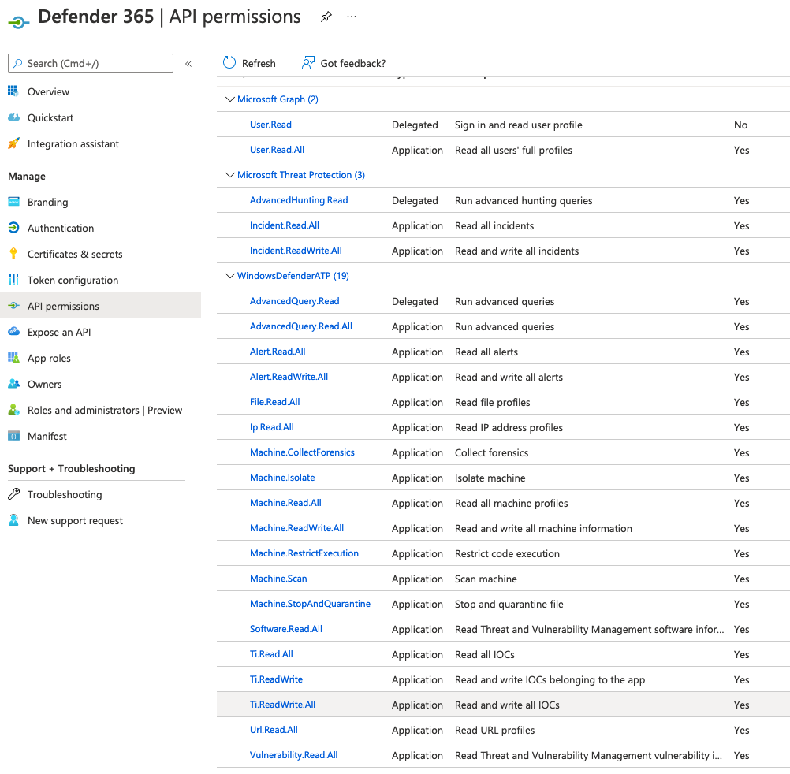

<!--
  This README.md is generated by running:
  "resilient-sdk docgen -p fn_microsoft_defender"

  It is best edited using a Text Editor with a Markdown Previewer. VS Code
  is a good example. Checkout https://guides.github.com/features/mastering-markdown/
  for tips on writing with Markdown

  If you make manual edits and run docgen again, a .bak file will be created

  Store any screenshots in the "doc/screenshots" directory and reference them like:
  

  NOTE: If your app is available in the container-format only, there is no need to mention the integration server in this readme.
-->

# Microsoft Defender ATP Functions

## Table of Contents
- [Release Notes](#release-notes)
- [Overview](#overview)
  - [Key Features](#key-features)
- [Requirements](#requirements)
  - [Resilient platform](#resilient-platform)
  - [Cloud Pak for Security](#cloud-pak-for-security)
  - [Proxy Server](#proxy-server)
  - [Python Environment](#python-environment)
- [Installation](#installation)
  - [Install](#install)
  - [App Configuration](#app-configuration)
  - [Custom Layouts](#custom-layouts)
- [Function - Defender Find machines by filter](#function---defender-find-machines-by-filter)
- [Function - Defender Set Indicator](#function---defender-set-indicator)
- [Function - Defender Machine Scan](#function---defender-machine-scan)
- [Function - Defender Alert Search](#function---defender-alert-search)
- [Function - Defender Find Machines by File](#function---defender-find-machines-by-file)
- [Function - Defender Update Alert](#function---defender-update-alert)
- [Function - Defender List Indicators](#function---defender-list-indicators)
- [Function - Defender App Execution](#function---defender-app-execution)
- [Function - Defender Collect Machine Investigation Package](#function---defender-collect-machine-investigation-package)
- [Function - Defender Machine Isolation](#function---defender-machine-isolation)
- [Function - Defender Find Machines by IP](#function---defender-find-machines-by-ip)
- [Function - Defender Delete Indicator](#function---defender-delete-indicator)
- [Function - Defender Quarantine File](#function---defender-quarantine-file)
- [Function - Defender Machine Vulnerabilities](#function---defender-machine Vulnerabilities)
- [Script - Create Artifact from Indicator](#script---create-artifact-from-indicator)
- [Data Table - Defender ATP Indicators](#data-table---defender-atp-indicators)
- [Data Table - Defender ATP Machines](#data-table---defender-atp-machines)
- [Data Table - Defender ATP Alerts](#data-table---defender-atp-alerts)
- [Custom Templates](#custom-templates)
- [Rules](#rules)
- [Troubleshooting & Support](#troubleshooting--support)
---

## Release Notes
<!--
  Specify all changes in this release. Do not remove the release
  notes of a previous release
-->
| Version | Date | Notes |
| ------- | ---- | ----- |
| 1.0.0 | 08/2021 | Initial Release |

---

## Overview
<!--
  Provide a high-level description of the function itself and its remote software or application.
  The text below is parsed from the "description" and "long_description" attributes in the setup.py file
-->
**Resilient Circuits Components for 'fn_microsoft_defender'**

 

This app allows bi-directional synchronization between IBM SOAR and Microsoft Defender ATP for Endpoints.
Defender entities are exposed as artifacts for further investigation.
Perform operations against Defender ATP such as set indicators, isolate and quarantine machines, and block file execution.

### Key Features
<!--
  List the Key Features of the Integration
-->
* List, set, update and delete Defender indicators
* Search for Defender machines by IP address, file hash, or machine name
* Isolate/unisolate Defender machines
* Restrict/unrestrict apps on a Defender machine
* Run an antivirus scan on a Defender machine
* Quarantine files on a Defender machine
* Request an Investigation Collection Package

---

## Requirements
<!--
  List any Requirements
-->
This app supports the IBM Resilient SOAR Platform and the IBM Cloud Pak for Security.

### Resilient platform
The Resilient platform supports two app deployment mechanisms, App Host and integration server.

If deploying to a Resilient platform with an App Host, the requirements are:
* Resilient platform >= `39.0.6328`.
* The app is in a container-based format (available from the AppExchange as a `zip` file).

If deploying to a Resilient platform with an integration server, the requirements are:
* Resilient platform >= `39.0.6328`.
* The app is in the older integration format (available from the AppExchange as a `zip` file which contains a `tar.gz` file).
* Integration server is running `resilient_circuits>=30.0.0`.
* If using an API key account, make sure the account provides the following minimum permissions:
  | Name | Permissions |
  | ---- | ----------- |
  | Org Data | Read |
  | Function | Read |
  | Incident | Read, Edit, Create, Owner, Status |
  | Incident Notes | Edit |

The following Resilient platform guides provide additional information:
* _App Host Deployment Guide_: provides installation, configuration, and troubleshooting information, including proxy server settings.
* _Integration Server Guide_: provides installation, configuration, and troubleshooting information, including proxy server settings.
* _System Administrator Guide_: provides the procedure to install, configure and deploy apps.

The above guides are available on the IBM Knowledge Center at [ibm.biz/resilient-docs](https://ibm.biz/resilient-docs). On this web page, select your Resilient platform version. On the follow-on page, you can find the _App Host Deployment Guide_ or _Integration Server Guide_ by expanding **Resilient Apps** in the Table of Contents pane. The System Administrator Guide is available by expanding **System Administrator**.

### Cloud Pak for Security
If you are deploying to IBM Cloud Pak for Security, the requirements are:
* IBM Cloud Pak for Security >= 1.4.
* Cloud Pak is configured with an App Host.
* The app is in a container-based format (available from the AppExchange as a `zip` file).

The following Cloud Pak guides provide additional information:
* _App Host Deployment Guide_: provides installation, configuration, and troubleshooting information, including proxy server settings. From the Table of Contents, select Case Management and Orchestration & Automation > **Orchestration and Automation Apps**.
* _System Administrator Guide_: provides information to install, configure, and deploy apps. From the IBM Cloud Pak for Security Knowledge Center table of contents, select Case Management and Orchestration & Automation > **System administrator**.

These guides are available on the IBM Knowledge Center at [ibm.biz/cp4s-docs](https://ibm.biz/cp4s-docs). From this web page, select your IBM Cloud Pak for Security version. From the version-specific Knowledge Center page, select Case Management and Orchestration & Automation.

### Proxy Server
The app **does** support a proxy server.

### Python Environment
Python 3.6+ environments are supported.
Additional package dependencies may exist for each of these packages:
* msal
* resilient_circuits>=30.0.0
* resilient_lib
* simplejson

---

## Installation

### Install
* To install or uninstall an App or Integration on the _Resilient platform_, see the documentation at [ibm.biz/resilient-docs](https://ibm.biz/resilient-docs).
* To install or uninstall an App on _IBM Cloud Pak for Security_, see the documentation at [ibm.biz/cp4s-docs](https://ibm.biz/cp4s-docs) and follow the instructions above to navigate to Orchestration and Automation.

### App Configuration
The following table provides the settings you need to configure the app. These settings are made in the app.config file. See the documentation discussed in the Requirements section for the procedure.

| Config | Required | Example | Description |
| ------ | :------: | ------- | ----------- |
| **tenant_id** | Yes | `89d65-...-57bae1c2` | *Azure tenant Id.* |
| **client_id** | Yes | `244ad4-...-3564fc4` | *Azure app id (client id).* |
| **app_secret** | Yes | `940c4d2-...-9d32e1b` | *Azure app secret.* |
| **api_url** | Yes | `https://api.securitycenter.microsoft.com` | *API utl. This can be customized per Azure region.* |
**polling_lookback** | Yes | `120` | *# of minutes to look back for alert changes. This is used only the first time the app starts* |
| **polling_interval** | Yes | `60` | *# of seconds to wait until checking for changes in Defender. Comment out to disable the poller* |
| **new_incident_filters** | Yes | `"status": ["New", "Active"],"severity": ["High", "Medium","Low"]` | *Set of filters to apply when escalating alerts to Resilient SOAR. Alerts not matching the criteria are not synchronized* |
| **create_incident_template** | /user/path/to/create_incident_template.jinja | Customer supplied template for mapping Defender alert fields to an Resilient incident. If not specified, a default template is used. |
| **update_incident_template** | /user/path/to/update_incident_template.jinja | Customer supplied template for mapping Defender alert fields to an Resilient incident. If not specified, a default template is used. |
| **close_incident_template** | /user/path/to/close_incident_template.jinja | Customer supplied template for mapping Defender alert fields to an Resilient incident. If not specified, a default template is used. This is useful when a customer customizes the fields used when closing an incident. |
| **defender_update_alert_template** | /user/path/to/update_sentinel_incident_template.jinja | Customer supplied template for updating a Defender alert when the Resilient SOAR incident is updated |
| **defender_close_alert_template** | /user/path/to/update_sentinel_incident_template.jinja | Customer supplied template for closing a Defender alert when the Resilient SOAR incident is closed |


### Custom Layouts
<!--
  Use this section to provide guidance on where the user should add any custom fields and data tables.
  You may wish to recommend a new incident tab.
  You should save a screenshot "custom_layouts.png" in the doc/screenshots directory and reference it here
-->
* Import the Data Tables and Custom Fields like the screenshot below:

  

---

## Azure App Configuration

In order to use this app, an Azure app needs to be registered with the proper permissions for Defender ATP and a client secret generated. Settings, in general are:

Application Type: Daemon with api calls enabled

API Permissions (Application type):

    Machine.Read.All
    Machine.ReadWrite.All
    Machine.CollectForensics
    Machine.Isolate
    Machine.RestrictExecution
    Machine.Scan
    Machine.StopAndQuarantine
    Ti.ReadWrite
    Ti.ReadWrite.All
    Alert.Read.All
    Alert.ReadWrite.All
    File.Read.All





## Function - Defender Find machines by filter
Find machines based on the OData filter capability of Defender. Presently only the `computerDnsName` filter is supported.


<details><summary>Inputs:</summary>
<p>

| Name | Type | Required | Example | Tooltip |
| ---- | :--: | :------: | ------- | ------- |
| `defender_filter_name` | `text` | No | `-` | - |
| `defender_filter_value` | `text` | No | `-` | - |

</p>
</details>

<details><summary>Outputs:</summary>
<p>

```python
results = {
  'version': '1.0',
  'success': True,
  'reason': None,
  'content': {
    '@odata.context': 'https://api.securitycenter.microsoft.com/api/$metadata#Machines',
    'value': [
      {
        'id': 'abc123',
        'computerDnsName': 'windowsvmos',
        'firstSeen': '2021-08-11T13:36:43.1619242Z',
        'lastSeen': '2021-08-12T13:52:09.8444175Z',
        'osPlatform': 'Windows10',
        'osVersion': None,
        'osProcessor': 'x64',
        'version': '20H2',
        'lastIpAddress': '10.0.0.5',
        'lastExternalIpAddress': '22.22.22.22',
        'agentVersion': '10.7740.1.1',
        'osBuild': 19042,
        'healthStatus': 'Active',
        'deviceValue': 'Normal',
        'rbacGroupId': 0,
        'rbacGroupName': None,
        'riskScore': 'High',
        'exposureLevel': 'Low',
        'isAadJoined': False,
        'aadDeviceId': None,
        'machineTags': [

        ],
        'defenderAvStatus': 'Updated',
        'onboardingStatus': 'Onboarded',
        'osArchitecture': '64-bit',
        'ipAddresses': [
          {
            'ipAddress': '10.0.0.5',
            'macAddress': '000000',
            'type': 'Ethernet',
            'operationalStatus': 'Up'
          },
          {
            'ipAddress': 'fe80::844e:e65d:ffff:ffff',
            'macAddress': '00000',
            'type': 'Ethernet',
            'operationalStatus': 'Up'
          }
        ],
        'vmMetadata': None,
        'firstSeen_ts': 1628689003000,
        'lastSeen_ts': 1628776329000
      }
    ]
  },
  'raw': '',
  'inputs': {
    'defender_filter_value': 'WindowsVMOS',
    'defender_filter_name': 'filter_by_name'
  },
  'metrics': {
    'version': '1.0',
    'package': 'fn-microsoft-defender',
    'package_version': '1.0.0',
    'host': 'Marks-MacBook-Pro.local',
    'execution_time_ms': 445,
    'timestamp': '2021-08-12 17:20:28'
  }
}
```

</p>
</details>

<details><summary>Example Pre-Process Script:</summary>
<p>

```python
inputs.defender_filter_name = "filter_by_name"
inputs.defender_filter_value = artifact.value
```

</p>
</details>

<details><summary>Example Post-Process Script:</summary>
<p>

```python
import java.util.Date as Date

"""
"value": [
    {
        "id": "04c99d46599f078f1c3da3783cf5b95f01ac61bb",
        "computerDnsName": "",
        "firstSeen": "2017-07-06T01:25:04.9480498Z",
        "osPlatform": "Windows10",
    }
]
"""
if results.success:
    for machine in results.content['value']:
      row = incident.addRow("defender_atp_machines")
      row['report_date'] = Date().getTime()
      row['machine_id'] = machine['id']
      row['machine_ip'] = machine['lastExternalIpAddress']
      row['machine_name'] = machine['computerDnsName']
      row['machine_platform'] = machine['osPlatform']
      row['machine_firstseen'] = machine['firstSeen_ts']
      row['machine_lastseen'] = machine['lastSeen_ts']
      row['machine_health_status'] = machine.get('healthStatus')
      row['machine_risk_score'] = machine.get('riskScore')
      row['machine_exposure_level'] = machine.get('exposureLevel')
      row['machine_tags'] = ', '.join(machine.get('machineTags', []))
else:
  msg = u"Defender ATP Action unsuccessful.\nAction: Find machines by filter\nReason: {}".format(results.reason)
  incident.addNote(helper.createPlainText(msg))
```

</p>
</details>

---
## Function - Defender Set Indicator
Set or update an indicator with exposure values.

 

<details><summary>Inputs:</summary>
<p>

| Name | Type | Required | Example | Tooltip |
| ---- | :--: | :------: | ------- | ------- |
| `defender_description` | `text` | No | `-` | - |
| `defender_expiration_time` | `datetimepicker` | No | `-` | - |
| `defender_indicator_action` | `select` | No | `-` | - |
| `defender_indicator_id` | `text` | No | `-` | - |
| `defender_indicator_type` | `text` | No | `-` | - |
| `defender_indicator_value` | `text` | No | `-` | - |
| `defender_severity` | `select` | No | `-` | - |
| `defender_title` | `text` | No | `-` | - |

</p>
</details>

<details><summary>Outputs:</summary>
<p>

```python
results = {
  'version': '1.0',
  'success': True,
  'reason': None,
  'content': {
    '@odata.context': 'https://api.securitycenter.microsoft.com/api/$metadata#Indicators/$entity',
    'id': '2',
    'indicatorValue': '52.188.18.0',
    'indicatorType': 'IpAddress',
    'action': 'AlertAndBlock',
    'createdBy': 'f0dc3f88-f617-449c-960c-fffffff',
    'severity': 'High',
    'category': None,
    'application': None,
    'educateUrl': None,
    'bypassDurationHours': None,
    'title': 'Potential Bad IP Address',
    'description': 'Investigate for potential risk',
    'recommendedActions': None,
    'creationTimeDateTimeUtc': '2021-08-13T12:55:29.5601303Z',
    'expirationTime': None,
    'lastUpdateTime': '2021-08-13T12:55:29.5672691Z',
    'lastUpdatedBy': None,
    'rbacGroupNames': [

    ],
    'rbacGroupIds': [

    ],
    'notificationId': None,
    'notificationBody': None,
    'version': None,
    'mitreTechniques': [

    ],
    'historicalDetection': False,
    'lookBackPeriod': None,
    'generateAlert': False,
    'additionalInfo': None,
    'createdByDisplayName': 'Sentinel',
    'externalId': None,
    'createdBySource': 'PublicApi',
    'certificateInfo': None,
    'creationTimeDateTimeUtc_ts': 1628859329000,
    'expirationTime_ts': None,
    'lastUpdateTime_ts': 1628859329000
  },
  'raw': '',
  'inputs': {
    'defender_indicator_type': 'IP Address',
    'defender_title': 'Potential Bad IP Address',
    'defender_description': 'Investigate for potential risk',
    'defender_expiration_time': None,
    'defender_indicator_action': {
      'id': 546,
      'name': 'AlertAndBlock'
    },
    'defender_severity': {
      'id': 564,
      'name': 'High'
    },
    'defender_indicator_value': '52.188.18.234'
  },
  'metrics': {
    'version': '1.0',
    'package': 'fn-microsoft-defender',
    'package_version': '1.0.0',
    'host': 'Marks-MacBook-Pro.local',
    'execution_time_ms': 769,
    'timestamp': '2021-08-13 08:55:29'
  }
}
```

</p>
</details>

<details><summary>Example Pre-Process Script:</summary>
<p>

```python
inputs.defender_indicator_type = artifact.type
inputs.defender_indicator_value = artifact.value
inputs.defender_description = rule.properties.indicator_description
inputs.defender_expiration_time = rule.properties.indicator_expiration
inputs.defender_title = rule.properties.indicator_title
inputs.defender_severity = str(rule.properties.indicator_severity)
inputs.defender_indicator_action = str(rule.properties.indicator_action)
```

</p>
</details>

<details><summary>Example Post-Process Script:</summary>
<p>

```python
msg = u"Action {}.\nAction: {}\nArtifact: {}\nTitle: {}\nComment: {}\nSeverity: {}\nExpiration: {}"\
   .format("successful" if results.success else "unsuccessful",
           str(rule.properties.indicator_action),
           artifact.value,
           rule.properties.indicator_title,
           rule.properties.indicator_description,
           str(rule.properties.indicator_severity),
           rule.properties.indicator_expiration)

if not results.success:
    msg = u"{}\nReason: {}".format(msg, results.reason)

incident.addNote(msg)

if results.success:
    row = incident.addRow("defender_atp_indicators")
    row['ind_id'] = results.content['id']
    row['ind_value'] = results.content['indicatorValue']
    row['ind_type'] = results.content['indicatorType']
    row['ind_title'] = results.content['title']
    row['ind_description'] = results.content['description']
    row['ind_action'] = results.content['action']
    row['ind_severity'] = results.content['severity']
    row['ind_created_by'] = results.content['createdByDisplayName']
    row['ind_creation_date'] = results.content['creationTimeDateTimeUtc_ts']
    row['ind_expiration_date'] = results.content['expirationTime_ts']

```

</p>
</details>

---
## Function - Defender Machine Scan
Start a Defender ATP Machine antivirus scan.

 

<details><summary>Inputs:</summary>
<p>

| Name | Type | Required | Example | Tooltip |
| ---- | :--: | :------: | ------- | ------- |
| `defender_description` | `text` | No | `-` | - |
| `defender_machine_id` | `text` | Yes | `-` | - |
| `defender_machine_scantype` | `select` | Yes | `-` | antivirus scan type |

</p>
</details>

<details><summary>Outputs:</summary>
<p>

```python
results = {
    "id": "5382f7ea-7557-4ab7-9782-d50480024a4e",
    "type": "Full",
    "scope": "Selective",
    "requestor": "Analyst@TestPrd.onmicrosoft.com",
    "requestorComment": "test for docs",
    "status": "Succeeded",
    "machineId": "7b1f4967d9728e5aa3c06a9e617a22a4a5a17378",
    "computerDnsName": "desktop-test",
    "creationDateTimeUtc": "2019-01-02T14:39:38.2262283Z",
    "lastUpdateDateTimeUtc": "2019-01-02T14:40:44.6596267Z",
    "relatedFileInfo": None
}
```

</p>
</details>

<details><summary>Example Pre-Process Script:</summary>
<p>

```python
inputs.defender_machine_id = row['machine_id']
inputs.defender_description = rule.properties.defender_action_comment
inputs.defender_machine_scantype = str(rule.properties.defender_machine_scantype)

```

</p>
</details>

<details><summary>Example Post-Process Script:</summary>
<p>

```python
import java.util.Date as Date

if results.success:
  row['report_date'] = Date().getTime()
  action_msg = "Action: {}\nComment: {}\nStatus: {}\nStart Date: {}".format(
    results.content['type'],
    results.content['requestorComment'],
    results.content['status'],
    results.content['creationDateTimeUtc']
    )
  row['machine_last_action'] = helper.createPlainText(action_msg)
else:
  msg = u"Defender ATP Scan Action {}.\nMachine: {} ({})\nType: {}\nComment: {}\nReason: {}"\
   .format("successful" if results.success else "unsuccessful",
           results.content.get('computerDnsName'), row['machine_id'],
           str(rule.properties.defender_isolation_type),
           rule.properties.defender_action_comment,
           results.reason)

  incident.addNote(helper.createPlainText(msg))

```

</p>
</details>

---
## Function - Defender Alert Search
Return Defender alerts based on a set of search criteria.

<details><summary>Inputs:</summary>
<p>

| Name | Type | Required | Example | Tooltip |
| ---- | :--: | :------: | ------- | ------- |
| `defender_alert_lastseen` | `datetimepicker` | No | `-` | Last Seen Alert Date |
| `defender_alert_lastupdatetime` | `datetimepicker` | No | `-` | Date when alert was last updated |
| `defender_alert_result_max` | `number` | No | `5` | Number of top results to return |
| `defender_alert_severity` | `select` | No | `-` | - |
| `defender_machine_id` | `text` | Yes | `-` | - |

</p>
</details>

<details><summary>Outputs:</summary>
<p>

```python
results = {
    "@odata.context": "https://api.securitycenter.microsoft.com/api/$metadata#Alerts",
    "value": [
        {
            "id": "da637308392288907382_-880718168",
            "incidentId": 7587,
            "investigationId": 723156,
            "assignedTo": "secop123@contoso.com",
            "severity": "Low",
            "status": "New",
            "classification": "TruePositive",
            "determination": null,
            "investigationState": "Queued",
            "detectionSource": "WindowsDefenderAv",
            "category": "SuspiciousActivity",
            "threatFamilyName": "Meterpreter",
            "title": "Suspicious 'Meterpreter' behavior was detected",
            "description": "Malware and unwanted software are undesirable applications that perform annoying, disruptive, or harmful actions on affected machines. Some of these undesirable applications can replicate and spread from one machine to another. Others are able to receive commands from remote attackers and perform activities associated with cyber attacks.\n\nA malware is considered active if it is found running on the machine or it already has persistence mechanisms in place. Active malware detections are assigned higher severity ratings.\n\nBecause this malware was active, take precautionary measures and check for residual signs of infection.",
            "alertCreationTime": "2020-07-20T10:53:48.7657932Z",
            "firstEventTime": "2020-07-20T10:52:17.6654369Z",
            "lastEventTime": "2020-07-20T10:52:18.1362905Z",
            "lastUpdateTime": "2020-07-20T10:53:50.19Z",
            "resolvedTime": null,
            "machineId": "12ee6dd8c833c8a052ea231ec1b19adaf497b625",
            "computerDnsName": "temp123.middleeast.corp.microsoft.com",
            "rbacGroupName": "MiddleEast",
            "aadTenantId": "a839b112-1253-6432-9bf6-94542403f21c",
            "relatedUser": {
                "userName": "temp123",
                "domainName": "MIDDLEEAST"
            },
			"comments": [
				{
					"comment": "test comment for docs",
					"createdBy": "secop123@contoso.com",
					"createdTime": "2020-07-21T01:00:37.8404534Z"
				}
			],
            "evidence": []
		}
	]
}
```

</p>
</details>

<details><summary>Example Pre-Process Script:</summary>
<p>

```python
inputs.defender_machine_id = row['machine_id']
inputs.defender_alert_lastseen = rule.properties.defender_alert_last_seen
inputs.defender_alert_lastupdatetime = rule.properties.defender_alert_lastupdatetime
inputs.defender_alert_severity = str(rule.properties.defender_alert_severity)
inputs.defender_alert_result_max = rule.properties.defender_max_results

```

</p>
</details>

<details><summary>Example Post-Process Script:</summary>
<p>

```python
"""
"value" = {
    "@odata.context": "https://api.securitycenter.microsoft.com/api/$metadata#Alerts",
    "value": [
        {
            "id": "da637308392288907382_-880718168",
            "incidentId": 7587,
            "investigationId": 723156,
            "assignedTo": "secop123@contoso.com",
            "severity": "Low",
            "status": "New",
            "classification": "TruePositive",
            "determination": null,
            "investigationState": "Queued",
            "detectionSource": "WindowsDefenderAv",
            "category": "SuspiciousActivity",
            "threatFamilyName": "Meterpreter",
            "title": "Suspicious 'Meterpreter' behavior was detected",
            "description": "Malware and unwanted software are undesirable applications that perform annoying, disruptive, or harmful actions on affected machines. Some of these undesirable applications can replicate and spread from one machine to another. Others are able to receive commands from remote attackers and perform activities associated with cyber attacks.\n\nA malware is considered active if it is found running on the machine or it already has persistence mechanisms in place. Active malware detections are assigned higher severity ratings.\n\nBecause this malware was active, take precautionary measures and check for residual signs of infection.",
            "alertCreationTime": "2020-07-20T10:53:48.7657932Z",
            "firstEventTime": "2020-07-20T10:52:17.6654369Z",
            "lastEventTime": "2020-07-20T10:52:18.1362905Z",
            "lastUpdateTime": "2020-07-20T10:53:50.19Z",
            "resolvedTime": null,
            "machineId": "12ee6dd8c833c8a052ea231ec1b19adaf497b625",
            "computerDnsName": "temp123.middleeast.corp.microsoft.com",
            "rbacGroupName": "MiddleEast",
            "aadTenantId": "a839b112-1253-6432-9bf6-94542403f21c",
            "relatedUser": {
                "userName": "temp123",
                "domainName": "MIDDLEEAST"
            },
			"comments": [
				{
					"comment": "test comment for docs",
					"createdBy": "secop123@contoso.com",
					"createdTime": "2020-07-21T01:00:37.8404534Z"
				}
			],
            "evidence": []
		}
	]
}
"""
if results.success:
    for alert in results.content['value']:
        row = incident.addRow("defender_atp_alerts")
        row['alert_id'] = alert['id']
        row['azure_incident_id'] = alert['incidentId']
        row['assigned_to'] = alert['assignedTo']
        row['severity'] = alert['severity']
        row['status'] = alert['status']
        row['title'] = alert['title']
        row['alert_description'] = alert['description']
        row['classification'] = alert['classification']
        row['determination'] = alert['determination']
        row['category'] = alert['category']
        row['computer_name'] = alert['computerDnsName']
        row['machine_id'] = alert['machineId']
        row['last_event'] = alert['lastEventTime_ts']
        row['last_updated'] = alert['lastUpdateTime_ts']
else:
    msg = u"Defender ATP Action unsuccessful.\nAction: Find alerts by machine\nReason: {}".format(results.reason)
    incident.addNote(msg)

```

</p>
</details>

---
## Function - Defender Find Machines by File
Find machines which match a given file hash.


<details><summary>Inputs:</summary>
<p>

| Name | Type | Required | Example | Tooltip |
| ---- | :--: | :------: | ------- | ------- |
| `defender_indicator_value` | `text` | No | `-` | - |

</p>
</details>

<details><summary>Outputs:</summary>
<p>

```python
results = {
    # TODO: Copy and paste an example of the Function Output within this code block.
    # To view the output of a Function, run resilient-circuits in DEBUG mode and invoke the Function.
    # The Function results will be printed in the logs: "resilient-circuits run --loglevel=DEBUG"
}
```

</p>
</details>

<details><summary>Example Pre-Process Script:</summary>
<p>

```python
inputs.defender_indicator_value = artifact.value
```

</p>
</details>

<details><summary>Example Post-Process Script:</summary>
<p>

```python
import java.util.Date as Date

if results.success:
    for machine in results.content['value']:
        row = incident.addRow("defender_atp_machines")
        row['report_date'] = Date().getTime()
        row['machine_id'] = machine['id']
        row['machine_name'] = machine['computerDnsName']
        row['machine_platform'] = machine['osPlatform']
        row['machine_firstseen'] = machine['firstSeen_ts']
        row['machine_lastseen'] = machine['lastSeen_ts']
        row['machine_ip'] = machine['lastIpAddress']
        row['machine_file_hash'] = artifact.value
        row['machine_health_status'] = machine.get('healthStatus')
        row['machine_risk_score'] = machine.get('riskScore')
        row['machine_exposure_level'] = machine.get('exposureLevel')
        row['machine_tags'] = ', '.join(machine.get('machineTags', []))
else:
    msg = u"Defender ATP Action unsuccessful.\nAction: Find machines by file hash\nReason: {}".format(results.reason)
    incident.addNote(helper.createPlainText(msg))
```

</p>
</details>

---
## Function - Defender Update Alert
Update a Defender Alert.

 

<details><summary>Inputs:</summary>
<p>

| Name | Type | Required | Example | Tooltip |
| ---- | :--: | :------: | ------- | ------- |
| `defender_alert_assigned_to` | `text` | No | `-` | - |
| `defender_alert_classification` | `select` | No | `-` | - |
| `defender_alert_determination` | `select` | No | `-` | - |
| `defender_alert_id` | `text` | Yes | `-` | - |
| `defender_alert_status` | `select` | No | `-` | - |
| `defender_description` | `text` | No | `-` | - |

</p>
</details>

<details><summary>Outputs:</summary>
<p>

```python
results = {
    "id": "da637308392288907382_-880718168",
    "incidentId": 7587,
    "investigationId": 723156,
    "assignedTo": "secop123@contoso.com",
    "severity": "Low",
    "status": "New",
    "classification": "TruePositive",
    "determination": null,
    "investigationState": "Queued",
    "detectionSource": "WindowsDefenderAv",
    "category": "SuspiciousActivity",
    "threatFamilyName": "Meterpreter",
    "title": "Suspicious 'Meterpreter' behavior was detected",
    "description": "Malware and unwanted software are undesirable applications that perform annoying, disruptive, or harmful actions on affected machines. Some of these undesirable applications can replicate and spread from one machine to another. Others are able to receive commands from remote attackers and perform activities associated with cyber attacks.\n\nA malware is considered active if it is found running on the machine or it already has persistence mechanisms in place. Active malware detections are assigned higher severity ratings.\n\nBecause this malware was active, take precautionary measures and check for residual signs of infection.",
    "alertCreationTime": "2020-07-20T10:53:48.7657932Z",
    "firstEventTime": "2020-07-20T10:52:17.6654369Z",
    "lastEventTime": "2020-07-20T10:52:18.1362905Z",
    "lastUpdateTime": "2020-07-20T10:53:50.19Z",
    "resolvedTime": null,
    "machineId": "12ee6dd8c833c8a052ea231ec1b19adaf497b625",
    "computerDnsName": "temp123.middleeast.corp.microsoft.com",
    "rbacGroupName": "MiddleEast",
    "aadTenantId": "a839b112-1253-6432-9bf6-94542403f21c",
    "relatedUser": {
        "userName": "temp123",
        "domainName": "MIDDLEEAST"
    },
    "comments": [
        {
            "comment": "test comment for docs",
            "createdBy": "secop123@contoso.com",
            "createdTime": "2020-07-21T01:00:37.8404534Z"
        }
    ],
    "evidence": []
}
```

</p>
</details>

<details><summary>Example Pre-Process Script:</summary>
<p>

```python
inputs.defender_alert_id = row['alert_id']
if rule.properties.defender_alert_classification:
    inputs.defender_alert_classification = str(rule.properties.defender_alert_classification)
if rule.properties.defender_alert_determination:
    inputs.defender_alert_determination = str(rule.properties.defender_alert_determination)
if rule.properties.defender_alert_status:
    inputs.defender_alert_status = str(rule.properties.defender_alert_status)
inputs.defender_description = rule.properties.defender_action_comment
inputs.defender_alert_assigned_to = rule.properties.defender_alert_assigned_to
```

</p>
</details>

<details><summary>Example Post-Process Script:</summary>
<p>

```python
msg = u"Action {}.\nAction: Update Alert\nAlert: {}\nMachine: {}\nComment: {}"\
   .format("successful" if results.success else "unsuccessful",
           row['alert_id'],
           row['machine_name'],
           rule.properties.defender_action_comment)
if rule.properties.defender_alert_assigned_to:
    msg = u"{}\nAssigned to: {}".format(msg, rule.properties.defender_alert_assigned_to)
if rule.properties.defender_alert_status:
    msg = u"{}\nStatus: {}".format(msg, str(rule.properties.defender_alert_status))
if rule.properties.defender_alert_classification:
    msg = u"{}\nClassification: {}".format(msg, str(rule.properties.defender_alert_classification))
if rule.properties.defender_alert_determination:
    msg = u"{}\nDetermination: {}".format(msg, str(rule.properties.defender_alert_determination))

if not results.success:
    msg = u"{}\nReason: {}".format(msg, results.reason)

incident.addNote(msg)

if results.success:
    row['classification'] = str(rule.properties.defender_alert_classification)
    row['determination'] = str(rule.properties.defender_alert_determination)
    row['status'] = str(rule.properties.defender_alert_status)
    row['assigned_to'] = rule.properties.defender_alert_assigned_to

```

</p>
</details>

---
## Function - Defender List Indicators
Get a list of all Defender indicators.

 

<details><summary>Inputs:</summary>
<p>


</p>
</details>

<details><summary>Outputs:</summary>
<p>

```python
results = {
  'version': '1.0',
  'success': True,
  'reason': None,
  'content': {
    '@odata.context': 'https://api.securitycenter.microsoft.com/api/$metadata#Indicators',
    'value': [
      {
        'id': '2',
        'indicatorValue': '52.188.18.234',
        'indicatorType': 'IpAddress',
        'action': 'AlertAndBlock',
        'createdBy': 'f0dc3f88-f617-449c-960c-ffffff',
        'severity': 'High',
        'category': 1,
        'application': None,
        'educateUrl': None,
        'bypassDurationHours': None,
        'title': 'Potential Bad IP Address',
        'description': 'Investigate for potential risk',
        'recommendedActions': None,
        'creationTimeDateTimeUtc': '2021-08-13T12:55:29.5601303Z',
        'expirationTime': None,
        'lastUpdateTime': '2021-08-13T12:55:29.5672691Z',
        'lastUpdatedBy': None,
        'rbacGroupNames': [

        ],
        'rbacGroupIds': [

        ],
        'notificationId': None,
        'notificationBody': None,
        'version': None,
        'mitreTechniques': [

        ],
        'historicalDetection': False,
        'lookBackPeriod': None,
        'generateAlert': True,
        'additionalInfo': None,
        'createdByDisplayName': 'Sentinel',
        'externalId': None,
        'createdBySource': 'PublicApi',
        'certificateInfo': None,
        'creationTimeDateTimeUtc_ts': 1628859329000,
        'expirationTime_ts': None
      }
    ]
  },
  'raw': '',
  'inputs': {

  },
  'metrics': {
    'version': '1.0',
    'package': 'fn-microsoft-defender',
    'package_version': '1.0.0',
    'host': 'Marks-MacBook-Pro.local',
    'execution_time_ms': 2601,
    'timestamp': '2021-08-13 09:05:33'
  }
}
```

</p>
</details>

<details><summary>Example Pre-Process Script:</summary>
<p>

```python
None
```

</p>
</details>

<details><summary>Example Post-Process Script:</summary>
<p>

```python
if results.success and results.content.get("value"):
    for indicator in results.content.get("value"):
        row = incident.addRow("defender_atp_indicators")
        row['ind_id'] = indicator['id']
        row['ind_value'] = indicator['indicatorValue']
        row['ind_type'] = indicator['indicatorType']
        row['ind_title'] = indicator['title']
        row['ind_description'] = indicator['description']
        row['ind_action'] = indicator['action']
        row['ind_severity'] = indicator['severity']
        row['ind_created_by'] = indicator['createdByDisplayName']
        row['ind_creation_date'] = indicator['creationTimeDateTimeUtc_ts']
        row['ind_expiration_date'] = indicator['expirationTime_ts']
else:
    msg = u"Defender ATP Action unsuccessful.\nAction: List indicators\nReason: {}".format(results.reason)
    incident.addNote(msg)
```

</p>
</details>

---
## Function - Defender App Execution
Perform app restriction actions on a Microsoft Defender machine.

 

<details><summary>Inputs:</summary>
<p>

| Name | Type | Required | Example | Tooltip |
| ---- | :--: | :------: | ------- | ------- |
| `defender_description` | `text` | No | `-` | - |
| `defender_machine_id` | `text` | Yes | `-` | - |
| `defender_restriction_type` | `select` | Yes | `-` | - |

</p>
</details>

<details><summary>Outputs:</summary>
<p>

```python
results = {
    # TODO: Copy and paste an example of the Function Output within this code block.
    # To view the output of a Function, run resilient-circuits in DEBUG mode and invoke the Function.
    # The Function results will be printed in the logs: "resilient-circuits run --loglevel=DEBUG"
}
```

</p>
</details>

<details><summary>Example Pre-Process Script:</summary>
<p>

```python
inputs.defender_description = rule.properties.defender_action_comment
inputs.defender_machine_id = row['machine_id']
inputs.defender_restriction_type = str(rule.properties.defender_app_execution_action)

```

</p>
</details>

<details><summary>Example Post-Process Script:</summary>
<p>

```python
import java.util.Date as Date

msg = u"Defender ATP Action {}.\nAction: {}\nMachine: {}\nComment: {}"\
   .format("successful" if results.success else "unsuccessful",
           rule.properties.defender_app_execution_action,
           row['machine_id'],
           rule.properties.defender_action_comment)

if results.success:
  row['report_date'] = Date().getTime()
  action_msg = "Action: {}\nComment: {}\nStatus: {}\nStart Date: {}".format(
    results.content['type'],
    results.content['requestorComment'],
    results.content['status'],
    results.content['creationDateTimeUtc']
    )
  row['machine_last_action'] = helper.createPlainText(action_msg)
else:
  msg = u"{}\nReason: {}".format(msg, results.reason)

incident.addNote(helper.createPlainText(msg))

```

</p>
</details>

---
## Function - Defender Collect Machine Investigation Package
Collect the machine investigation package.


<details><summary>Inputs:</summary>
<p>

| Name | Type | Required | Example | Tooltip |
| ---- | :--: | :------: | ------- | ------- |
| `defender_description` | `text` | No | `-` | - |
| `defender_machine_id` | `text` | Yes | `-` | - |

</p>
</details>

<details><summary>Outputs:</summary>
<p>

```python
results = {
  'version': 2.0,
  'success': True,
  'reason': None,
  'content': {
    '@odata.context': 'https://api.securitycenter.microsoft.com/api/$metadata#MachineActions/$entity',
    'id': 'a68c6a92-3be6-441e-98c9-7153b6000000',
    'type': 'CollectInvestigationPackage',
    'title': None,
    'requestor': 'f0dc3f88-f617-449c-960c-6b54818cd110',
    'requestorComment': 'start investigation',
    'status': 'Succeeded',
    'machineId': '2a94aaf80aa31094790ce40da6fdfc03a000000',
    'computerDnsName': 'windowsvmos',
    'creationDateTimeUtc': '2021-08-12T20:40:55.5836137Z',
    'lastUpdateDateTimeUtc': '2021-08-12T20:43:48.2006779Z',
    'cancellationRequestor': None,
    'cancellationComment': None,
    'cancellationDateTimeUtc': None,
    'errorHResult': 0,
    'scope': None,
    'externalId': None,
    'requestSource': 'PublicApi',
    'relatedFileInfo': None,
    'commands': [

    ],
    'troubleshootInfo': None
  },
  'raw': None,
  'inputs': {
    'defender_description': 'start investigation',
    'defender_machine_id': '2a94aaf80aa31094790ce40da6fdfc03a000000'
  },
  'metrics': {
    'version': '1.0',
    'package': 'fn-microsoft-defender',
    'package_version': '1.0.0',
    'host': 'Marks-MacBook-Pro.local',
    'execution_time_ms': 182828,
    'timestamp': '2021-08-12 16:43:57'
  }
}
```

</p>
</details>

<details><summary>Example Pre-Process Script:</summary>
<p>

```python
inputs.defender_machine_id = row['machine_id']
inputs.defender_description = rule.properties.defender_action_comment
```

</p>
</details>

<details><summary>Example Post-Process Script:</summary>
<p>

```python
import java.util.Date as Date

if results.success:
  msg = "Action: {}\nComment: {}\nStatus: {}\nStart Date: {}".format(
    results.content['type'],
    results.content['requestorComment'],
    results.content['status'],
    results.content['creationDateTimeUtc']
    )
  row['machine_last_action'] = helper.createPlainText(msg)
  row['report_date'] = Date().getTime()

"""
    'type': 'CollectInvestigationPackage',
    'title': None,
    'requestor': 'f0dc3f88-f617-449c-960c-6b54818cd110',
    'requestorComment': 'ss',
    'status': 'Succeeded',
    'machineId': '2a94aaf80aa31094790ce40da6fdfc03a9a145c5',
    'computerDnsName': 'windowsvmos',
    'creationDateTimeUtc': '2021-08-12T18:53:06.5259227Z',
    'lastUpdateDateTimeUtc': '2021-08-12T18:54:20.4259984Z',
"""

```

</p>
</details>

---
## Function - Defender Machine Isolation
Perform either an 'isolate' or 'unisolate' operation on a MS defender machine.

 

<details><summary>Inputs:</summary>
<p>

| Name | Type | Required | Example | Tooltip |
| ---- | :--: | :------: | ------- | ------- |
| `defender_description` | `text` | No | `-` | - |
| `defender_isolation_action` | `text` | Yes | `-` | 'isolate' or 'unisolate' |
| `defender_isolation_type` | `select` | No | `-` | Type of operation to perform |
| `defender_machine_id` | `text` | Yes | `-` | - |

</p>
</details>

<details><summary>Outputs:</summary>
<p>

```python
results = {
  'version': '1.0',
  'success': True,
  'reason': None,
  'content': {
    '@odata.context': 'https://api.securitycenter.microsoft.com/api/$metadata#MachineActions/$entity',
    'id': 'ceb8e7f5-680d-4ab5-804a-2a484000000',
    'type': 'Unisolate',
    'title': None,
    'requestor': 'f0dc3f88-f617-449c-960c-6b548100000',
    'requestorComment': 'unisolate',
    'status': 'Pending',
    'machineId': '2a94aaf80aa31094790ce40da6fdfc03000000',
    'computerDnsName': 'windowsvmos',
    'creationDateTimeUtc': '2021-08-12T19:53:15.784603Z',
    'lastUpdateDateTimeUtc': '2021-08-12T19:53:15.784603Z',
    'cancellationRequestor': None,
    'cancellationComment': None,
    'cancellationDateTimeUtc': None,
    'errorHResult': 0,
    'scope': None,
    'externalId': None,
    'requestSource': 'PublicApi',
    'relatedFileInfo': None,
    'commands': [

    ],
    'troubleshootInfo': None
  },
  'raw': '',
  'inputs': {
    'defender_isolation_type': None,
    'defender_description': 'unisolate',
    'defender_machine_id': '2a94aaf80aa31094790ce40da6fdfc03a9a145c5',
    'defender_isolation_action': 'unisolate'
  },
  'metrics': {
    'version': '1.0',
    'package': 'fn-microsoft-defender',
    'package_version': '1.0.0',
    'host': 'Marks-MacBook-Pro.local',
    'execution_time_ms': 912,
    'timestamp': '2021-08-12 15:53:16'
  }
}
```

</p>
</details>

<details><summary>Example Pre-Process Script:</summary>
<p>

```python
inputs.defender_machine_id = row['machine_id']
inputs.defender_isolation_type = str(rule.properties.defender_isolation_type)
inputs.defender_description = rule.properties.defender_action_comment
inputs.defender_isolation_action = 'isolate'
```

</p>
</details>

<details><summary>Example Post-Process Script:</summary>
<p>

```python
import java.util.Date as Date

if results.success:
  row['report_date'] = Date().getTime()

  action_msg = "Action: {}\nComment: {}\nStatus: {}\nStart Date: {}".format(
    results.content['type'],
    results.content['requestorComment'],
    results.content['status'],
    results.content['creationDateTimeUtc']
    )
  row['machine_last_action'] = helper.createPlainText(action_msg)
else:
  msg = u"Defender ATP Isolate Action {}.\nMachine: {} ({})\nType: {}\nComment: {}\nReason: {}"\
   .format("successful" if results.success else "unsuccessful",
           results.content.get('computerDnsName'), row['machine_id'],
           str(rule.properties.defender_isolation_type),
           rule.properties.defender_action_comment,
           results.reason)

  incident.addNote(helper.createPlainText(msg))

```

</p>
</details>

---
## Function - Defender Find Machines by IP
Find Defender Machine(s) by IP address.

 

<details><summary>Inputs:</summary>
<p>

| Name | Type | Required | Example | Tooltip |
| ---- | :--: | :------: | ------- | ------- |
| `defender_indicator_value` | `text` | No | `-` | - |
| `defender_lookback_timeframe` | `datepicker` | Yes | `-` | This value must be within 30 days of current date |

</p>
</details>

<details><summary>Outputs:</summary>
<p>

```python
results = {
  'version': '1.0',
  'success': True,
  'reason': None,
  'content': {
    '@odata.context': 'https://api.securitycenter.microsoft.com/api/$metadata#Machines',
    'value': [
      {
        'id': 'abc123',
        'computerDnsName': 'windowsvmos',
        'firstSeen': '2021-08-11T13:36:43.1619242Z',
        'lastSeen': '2021-08-12T13:52:09.8444175Z',
        'osPlatform': 'Windows10',
        'osVersion': None,
        'osProcessor': 'x64',
        'version': '20H2',
        'lastIpAddress': '10.0.0.5',
        'lastExternalIpAddress': '22.22.22.22',
        'agentVersion': '10.7740.1.1',
        'osBuild': 19042,
        'healthStatus': 'Active',
        'deviceValue': 'Normal',
        'rbacGroupId': 0,
        'rbacGroupName': None,
        'riskScore': 'High',
        'exposureLevel': 'Low',
        'isAadJoined': False,
        'aadDeviceId': None,
        'machineTags': [

        ],
        'defenderAvStatus': 'Updated',
        'onboardingStatus': 'Onboarded',
        'osArchitecture': '64-bit',
        'ipAddresses': [
          {
            'ipAddress': '10.0.0.5',
            'macAddress': '000000',
            'type': 'Ethernet',
            'operationalStatus': 'Up'
          },
          {
            'ipAddress': 'fe80::844e:e65d:ffff:ffff',
            'macAddress': '00000',
            'type': 'Ethernet',
            'operationalStatus': 'Up'
          }
        ],
        'vmMetadata': None,
        'firstSeen_ts': 1628689003000,
        'lastSeen_ts': 1628776329000
      }
    ]
  },
  'raw': '',
  'inputs': {
    'defender_filter_value': 'WindowsVMOS',
    'defender_filter_name': 'filter_by_name'
  },
  'metrics': {
    'version': '1.0',
    'package': 'fn-microsoft-defender',
    'package_version': '1.0.0',
    'host': 'Marks-MacBook-Pro.local',
    'execution_time_ms': 445,
    'timestamp': '2021-08-12 17:20:28'
  }
}
```

</p>
</details>

<details><summary>Example Pre-Process Script:</summary>
<p>

```python
inputs.defender_indicator_value = artifact.value
inputs.defender_lookback_timeframe = rule.properties.defender_lookback_timeframe
```

</p>
</details>

<details><summary>Example Post-Process Script:</summary>
<p>

```python
import java.util.Date as Date
"""
"value": [
    {
        "id": "04c99d46599f078f1c3da3783cf5b95f01ac61bb",
        "computerDnsName": "",
        "firstSeen": "2017-07-06T01:25:04.9480498Z",
        "osPlatform": "Windows10",
    }
]
"""
if results.success:
  if not results.content['value']:
    msg = u"Defender ATP Find machines by IP Address unsuccessful.\nNothing found for {}".format(artifact.value)
    incident.addNote(helper.createPlainText(msg))
  else:
    for machine in results.content['value']:
        row = incident.addRow("defender_atp_machines")
        row['report_date'] = Date().getTime()
        row['machine_id'] = machine['id']
        row['machine_name'] = machine['computerDnsName']
        row['machine_platform'] = machine['osPlatform']
        row['machine_firstseen'] = machine['firstSeen_ts']
        row['machine_lastseen'] = machine['lastSeen_ts']
        row['machine_health_status'] = machine.get('healthStatus')
        row['machine_risk_score'] = machine.get('riskScore')
        row['machine_exposure_level'] = machine.get('exposureLevel')
        row['machine_tags'] = ', '.join(machine.get('machineTags', []))
else:
    msg = u"Defender ATP Action unsuccessful.\nAction: Find machines by IP Address\nReason: {}".format(results.reason)
    incident.addNote(helper.createPlainText(msg))
```

</p>
</details>

---
## Function - Defender Delete Indicator
Delete an indicator from Defender ATP.

 

<details><summary>Inputs:</summary>
<p>

| Name | Type | Required | Example | Tooltip |
| ---- | :--: | :------: | ------- | ------- |
| `defender_indicator_id` | `text` | No | `-` | - |

</p>
</details>

<details><summary>Outputs:</summary>
<p>

```python
results = {
    # TODO: Copy and paste an example of the Function Output within this code block.
    # To view the output of a Function, run resilient-circuits in DEBUG mode and invoke the Function.
    # The Function results will be printed in the logs: "resilient-circuits run --loglevel=DEBUG"
}
```

</p>
</details>

<details><summary>Example Pre-Process Script:</summary>
<p>

```python
inputs.defender_indicator_id = row['ind_id']
```

</p>
</details>

<details><summary>Example Post-Process Script:</summary>
<p>

```python
import java.util.Date as Date

msg = u"Defender ATP Action {}.\nAction: Delete Indicator\nIndicator: {}"\
   .format("successful" if results.success else "unsuccessful",
           row['ind_value'],
           )

if results.success:
  row['report_date'] = Date().getTime()
else:
  msg = u"{}\nReason: {}".format(msg, results.reason)

incident.addNote(helper.createPlainText(msg))

```

</p>
</details>

---
## Function - Defender Quarantine File
Quarantine a SHA-1 file.


<details><summary>Inputs:</summary>
<p>

| Name | Type | Required | Example | Tooltip |
| ---- | :--: | :------: | ------- | ------- |
| `defender_description` | `text` | No | `-` | - |
| `defender_indicator_value` | `text` | No | `-` | - |
| `defender_machine_id` | `text` | Yes | `-` | - |

</p>
</details>

<details><summary>Outputs:</summary>
<p>

```python
results = {
    # TODO: Copy and paste an example of the Function Output within this code block.
    # To view the output of a Function, run resilient-circuits in DEBUG mode and invoke the Function.
    # The Function results will be printed in the logs: "resilient-circuits run --loglevel=DEBUG"
}
```

</p>
</details>

<details><summary>Example Pre-Process Script:</summary>
<p>

```python
inputs.defender_description = rule.properties.defender_action_comment
inputs.defender_indicator_value = row['machine_file_hash']
inputs.defender_machine_id = row['machine_id']

```

</p>
</details>

<details><summary>Example Post-Process Script:</summary>
<p>

```python
import java.util.Date as Date

if results.success:
  row['report_date'] = Date().getTime()
  action_msg = "Action: {}\nComment: {}\nStatus: {}\nStart Date: {}".format(
    results.content['type'],
    results.content['requestorComment'],
    results.content['status'],
    results.content['creationDateTimeUtc']
    )
  row['machine_last_action'] = helper.createPlainText(action_msg)
else:
  msg = u"Defender ATP Quarantine file Action {}.\nMachine: {} ({})\nType: {}\nComment: {}\nReason: {}"\
   .format("successful" if results.success else "unsuccessful",
           results.content.get('computerDnsName'), row['machine_id'],
           str(rule.properties.defender_isolation_type),
           rule.properties.defender_action_comment,
           results.reason)

  incident.addNote(helper.createPlainText(msg))
```

</p>
</details>

## Function - Defender Machine Vulnerabilities
List any machine vulernabilities.

<details><summary>Inputs:</summary>
<p>

| Name | Type | Required | Example | Tooltip |
| ---- | :--: | :------: | ------- | ------- |
| `defender_machine_id` | `text` | Yes | `-` | - |

</p>
</details>

<details><summary>Outputs:</summary>
<p>

```python
results = {
    "success": True,
    "content": {
      "value":  [
        {
            "id": "CVE-2019-1348",
            "name": "CVE-2019-1348",
            "description": "Git could allow a remote attacker to bypass security restrictions, caused by a flaw in the --export-marks option of git fast-import. By persuading a victim to import specially-crafted content, an attacker could exploit this vulnerability to overwrite arbitrary paths.",
            "severity": "Medium",
            "cvssV3": 4.3,
            "exposedMachines": 1,
            "publishedOn": "2019-12-13T00:00:00Z",
            "updatedOn": "2019-12-13T00:00:00Z",
            "publicExploit": False,
            "exploitVerified": False,
            "exploitInKit": False,
            "exploitTypes": [],
            "exploitUris": []
        }
      ]
    }
}
```

</p>
</details>

<details><summary>Example Pre-Process Script:</summary>
<p>

```python
inputs.defender_machine_id = row['machine_id']
```

</p>
</details>

<details><summary>Example Post-Process Script:</summary>
<p>

```python
def mk_note(list_of_notes):
    return "<br>---<br><br>".join(["<br>".join(note) for note in list_of_notes])

def format_line(k, v):
    return "<b>{}</b>: {}".format(k, v)

vulnerabilities = results.content['value']
if results['success']:
    if not vulnerabilities:
        incident.addNote("No machine vulnerabilities for: {}".format(row['machine_name']))
    else:
        note = []
        for risk in vulnerabilities:
            note_info = []
            note_info.append(format_line("Machine", row['machine_name']))
            note_info.append(format_line("Machine Id", row['machine_id']))
            note_info.append(format_line("Vulnerability", risk['name']))
            note_info.append(format_line("Description", risk['description']))
            note_info.append(format_line("Severity", risk['severity']))
            note_info.append(format_line("Published", risk['publishedOn']))
            note_info.append(format_line("Updated", risk['updatedOn']))

            note.append(note_info)
        incident.addNote(helper.createRichText(mk_note(note)))
else:
    incident.addNote("Defender ATP Machine Vulnerabilities failed: {}".format(results.reason))
```

</p>
</details>

---

## Script - Create Artifact from Indicator
Convert an indicator to an Artifact for further enrichment or remediation

**Object:** defender_atp_indicators

<details><summary>Script Text:</summary>
<p>

```python
# Convert a Defender ATP indicator to an artifact_type
# lookup for Defender indicator types to arttfact types
type_lookup = {
        "FileSha1": "Malware SHA-1 Hash",
        "FileSha256": "Malware SHA-256 Hash",
        "IpAddress": "IP Address",
        "DomainName": "DNS Name",
        "Url": "URL"
    }

artifact_type = type_lookup.get(row['ind_type'], "String")
artifact_description = u"{}\n{}".format(row['ind_title'], row['ind_description'])
incident.addArtifact(artifact_type, row['ind_value'], artifact_description)

msg = u"Defender ATP Action successful.\nIndicator: {}\nAction: Create Artifact".format(row['ind_value'])
incident.addNote(msg)
```

</p>
</details>

---

## Data Table - Defender ATP Indicators

 

#### API Name:
defender_atp_indicators

#### Columns:
| Column Name | API Access Name | Type | Tooltip |
| ----------- | --------------- | ---- | ------- |
| Action | `ind_action` | `text` | - |
| Created By | `ind_created_by` | `text` | - |
| Creation Date | `ind_creation_date` | `datetimepicker` | - |
| Description | `ind_description` | `text` | - |
| Expiration Date | `ind_expiration_date` | `datetimepicker` | - |
| Indicator ID | `ind_id` | `text` | - |
| Severity | `ind_severity` | `text` | - |
| Title | `ind_title` | `text` | - |
| Type | `ind_type` | `text` | - |
| Value | `ind_value` | `text` | - |

---
## Data Table - Defender ATP Machines

 

#### API Name:
defender_atp_machines

#### Columns:
| Column Name | API Access Name | Type | Tooltip |
| ----------- | --------------- | ---- | ------- |
| Exposure Level | `machine_exposure_level` | `text` | - |
| File Hash | `machine_file_hash` | `text` | - |
| First Seen | `machine_firstseen` | `datetimepicker` | - |
| Health Status | `machine_health_status` | `text` | - |
| Machine ID | `machine_id` | `text` | - |
| IP Address | `machine_ip` | `text` | - |
| Last Action | `machine_last_action` | `textarea` | - |
| Last Seen | `machine_lastseen` | `datetimepicker` | - |
| Machine Name | `machine_name` | `text` | - |
| Platform | `machine_platform` | `text` | - |
| Risk Score | `machine_risk_score` | `text` | - |
| Machine Tags | `machine_tags` | `text` | - |
| Report Date | `report_date` | `datetimepicker` | - |

---
## Data Table - Defender ATP Alerts

 

#### API Name:
defender_atp_alerts

#### Columns:
| Column Name | API Access Name | Type | Tooltip |
| ----------- | --------------- | ---- | ------- |
| Description | `alert_description` | `text` | - |
| Alert ID | `alert_id` | `text` | - |
| Assigned To | `assigned_to` | `text` | - |
| Azure Incident ID | `azure_incident_id` | `number` | - |
| Category | `category` | `text` | - |
| Classification | `classification` | `text` | - |
| Computer Name | `computer_name` | `text` | - |
| Determination | `determination` | `text` | - |
| Last Event | `last_event` | `datetimepicker` | - |
| Last Updated | `last_updated` | `datetimepicker` | - |
| Machine ID | `machine_id` | `text` | - |
| Severity | `severity` | `text` | - |
| Status | `status` | `text` | - |
| Title | `title` | `text` | - |

---

## Custom Templates
Below are examples of templates for creating, updating, and closing Resilient incidents. Customize these templates and refer to them in our app.config file.

Each template should be reviewed for correctness in your enterprise.
For instance, closing a SOAR incident may include additional custom fields which the default template
does not include. Or, remove the `owner_id` mapping entry entirely.

In addition, the `incident_creation_template` and `incident_update_template` includes the following
mapping:

```
  {# if Defender alert users are different than SOAR users, consider using a mapping table using resilient_substitute: #}
  {# "owner_id": "{{ assignedTo|resilient_substitute('{"Automation": "soar_user1@ent.com", "sentinel_user2@co.com": "soar_user2@ent.com", "DEFAULT": "default_user@ent.com" }') }}", #}
  "owner_id":  "{{ assignedTo|resilient_substitute('{"Automation": "a@example.com", "sentinel_user2@co.com": "soar_user2@ent.com", "DEFAULT": "default_user@ent.com" }') }}",  null, 

```

If your Defender login users differ from SOAR users, modify the `owner_id` mapping to use a substitution map as indicated in the jinja comment.

### incident_create_template.jinja
```
{
  {# JINJA template for creating a new Resilient incident from a Sentinel incident. #}
  "name": "Defender Alert - {{ title|replace('"', '\\"') }}",
  "discovered_date": {{ alertCreationTime|resilient_datetimeformat }},
  "start_date": {{ firstEventTime|resilient_datetimeformat }},
  "description": {
    "format": "text",
    "content": "{{ description|replace('"', '\\"') }}"
  },
  {# if Defender alert users are different than SOAR users, consider using a mapping table using resilient_substitute: #}
  {# "owner_id": "{{ assignedTo|resilient_substitute('{"Automation": "soar_user1@ent.com", "sentinel_user2@co.com": "soar_user2@ent.com", "DEFAULT": "default_user@ent.com" }') }}", #}
  "owner_id":  "{{ assignedTo|resilient_substitute('{"Automation": "a@example.com", "sentinel_user2@co.com": "soar_user2@ent.com", "DEFAULT": "default_user@ent.com" }') }}",  null, 
  "plan_status": "{{ status|resilient_substitute('{"Resolved": "C", "Active": "A", "New": "A"}') }}",
  "severity_code": "{{ severity|resilient_substitute('{"Informational": "Low"}') }}",
  "properties": {
    "defender_incident_id": {{ incidentId }},
    "defender_alert_id": "{{ id }}",
    "defender_classification": "{{ classification|replace('"', '\\"') }}",
    "defender_determination": "{{ determination|replace('"', '\\"') }}",
    "defender_category": "{{ category|replace('"', '\\"') }}"
  },
  "comments": [
    
    {
      "text": {
        "format": "text",
        "content": "{{ comment.comment|replace('"', '\\"') }}\ncreated by: {{ comment.createdBy }}\ncreation date: {{ comment.createdTime }}"
      }
    }
    ,
    
  ],
  "artifacts": [
    
      
      
      
      {
        "type": {
          "name": "IP Address"
        },
        "value": "{{ item.ipAddress }}",
        "description": {
          "format": "text",
          "content": "creation date: {{ item.evidenceCreationTime }}"
        }
      }
      
      
      {
        "type": {
          "name": "User Account"
        },
        "value": "{{ item.userPrincipalName }}",
        "description": {
          "format": "text",
          "content": "creation date: {{ item.evidenceCreationTime }}"
        }
      }
      
      
      {
        "type": {
          "name": "Process Name"
        },
        "value": "{{ item.processCommandLine[:100]|replace('\\', '\\\\')|replace('"', '\\"') }}",
        "description": {
          "format": "text",
          "content": "creation date: {{ item.evidenceCreationTime }}"
        }
      }
      
      
      {
        "type": {
          "name": "File Name"
        },
        "value": "{{ item.fileName|replace('\\', '\\\\')|replace('"', '\\"') }}",
        "description": {
          "format": "text",
          "content": "creation date: {{ item.evidenceCreationTime }}\nFile Path: {{ item.filePath|replace('\\', '\\\\')|replace('"', '\\"') }}"
        }
      }
      
      
      {
        "type": {
          "name": "URL"
        },
        "value": "{{ item.url }}",
        "description": {
          "format": "text",
          "content": "creation date: {{ item.evidenceCreationTime }}"
        }
      }
      
      
      {
        "type": {
          "name": "File Name"
        },
        "value": "{{ item.fileName }}",
        "description": {
          "format": "text",
          "content": "creation date: {{ item.evidenceCreationTime }}\nfile path: {{ item.filePath|replace('\\', '\\\\') }}"
        }
      },
      {
        "type": {
          "name": "Malware SHA-1 Hash"
        },
        "value": "{{ item.sha1 }}",
        "description": {
          "format": "text",
          "content": "creation date: {{ item.evidenceCreationTime }}\nfile name: {{ item.fileName }}"
        }
      },
      {
        "type": {
          "name": "Malware SHA-256 Hash"
        },
        "value": "{{ item.sha256 }}",
        "description": {
          "format": "text",
          "content": "creation date: {{ item.evidenceCreationTime }}\nfile name: {{ item.fileName }}"
        }
      }
      
      
      {
        "type": {
          "name": "Registry Key"
        },
        "value": "{{ item.registryHive|lower }}\\{{ item.registryKey|replace('\\', '\\\\') }}",
        "description": {
          "format": "text",
          "content": "creation date: {{ item.evidenceCreationTime }} }}"
        },
        "properties":[
          {
            "name": "{{ item.registryKey|replace('\\', '\\\\') }}",
            "value": "{{ item.registryValue|replace('\\', '\\\\')|replace('"', '\\"') }}"
          }
        ]
      }
      
      
      {
        "type": {
          "name": "Email Sender"
        },
        "value": "{{ item.sender|replace('"', '\\"') }}",
        "description": {
          "format": "text",
          "content": "creation date: {{ item.evidenceCreationTime }}"
        }
      },
      {
        "type": {
          "name": "Email Recipient"
        },
        "value": "{{ item.recipient|replace('"', '\\"') }}",
        "description": {
          "format": "text",
          "content": "creation date: {{ item.evidenceCreationTime }}"
        }
      },
      {
        "type": {
          "name": "Email Subject"
        },
        "value": "{{ item.subject|replace('"', '\\"') }}",
        "description": {
          "format": "text",
          "content": "creation date: {{ item.evidenceCreationTime }}"
        }
      }
      
      ,
    
  ]
}
```

### incident_update_template.jinja
```
{
  {# JINJA template for creating a new Resilient incident from a Sentinel incident. #}
  "name": "Defender Alert - {{ title|replace('"', '\\"') }}",
  "description": {
    "format": "text",
    "content": "{{ description|replace('"', '\\"') }}"
  },
  {# if Defender users are different than SOAR users, consider using a mapping table using resilient_substitute: #}
  {# "owner_id": "{{ assignedTo|resilient_substitute('{"Automation": "soar_user1@ent.com", "sentinel_user2@co.com": "soar_user2@ent.com", "DEFAULT": "default_user@ent.com" }') }}", #}
  "owner_id":  "{{ assignedTo|resilient_substitute('{"Automation": "a@example.com", "sentinel_user2@co.com": "soar_user2@ent.com", "DEFAULT": "default_user@ent.com" }') }}",  null, 
  "plan_status": "{{ status|resilient_substitute('{"Resolved": "C", "Active": "A", "New": "A"}') }}",
  "severity_code": "{{ severity|resilient_substitute('{"Informational": "Low"}') }}",
  "properties": {
    "defender_classification": "{{ classification|replace('"', '\\"') }}",
    "defender_determination": "{{ determination|replace('"', '\\"') }}",
    "defender_category": "{{ category|replace('"', '\\"') }}"
  }
}
```

### incident_close_template.jinja
```
{
  {# JINJA template for closing a new Resilient incident from a Defender alert. #}
  "plan_status": "C",
  "resolution_id": "Resolved",
  "resolution_summary": "Closed from Defender: {{ investigationState }}",
  "severity_code": "{{ severity|resilient_substitute('{"Informational": "Low"}') }}",
  "properties": {
    "defender_classification": "{{ classification|replace('"', '\\"') }}",
    "defender_determination": "{{ determination|replace('"', '\\"') }}",
    "defender_category": "{{ category|replace('"', '\\"') }}"
  }
}
```

### sentinel_close_incident_template.jinja
```
{
    {# JINJA template for closing a new Sentinel incident from a Resilient incident. #}
    "properties": {
        "severity": "{{ severity_code|string|resilient_substitute('{"4": "Low", "5": "Medium", "6": "High"}') }}",
        "status": "Closed",
        "title": "{{ name|replace('Sentinel Incident - ', '')|safe }}",
        "classification": "{{ resolution_id|string|resilient_substitute('{"7": "Undetermined", "8": "Undetermined", "9": "FalsePositive", "10": "TruePositive"}') }}",
        "classificationComment": "{{ resolution_summary|striptags|safe }}",
        {# modify as necessary #}
        "classificationReason": "{{ resolution_id|string|resilient_substitute('{"7": "", "8": "", "9": "InaccurateData", "10": "SuspiciousActivity"}') }}"
    }
}
```

### sentinel_update_incident_template.jinja
```
{
    {# JINJA template for updating a new Sentinel incident from a Resilient incident. #}
    "properties": {
        "severity": "{{ severity_code|string|resilient_substitute('{"4": "Low", "5": "Medium", "6": "High"}') }}",
        "status": "{{ properties.sentinel_incident_status }}",
        "title": "{{ name|replace('Sentinel Incident - ', '')|safe }}",
        "classification": "{{ properties.sentinel_incident_classification }}",
        "classificationComment": "{{ properties.sentinel_incident_classification_comment|safe }}",
        "classificationReason": "{{ properties.sentinel_incident_classification_reason }}",
        "description": "{{ description|striptags|safe }}",
        "labels": "{{ properties.sentinel_incident_labels }}"
    }
}
```
---


## Rules
| Rule Name | Object | Workflow Triggered |
| --------- | ------ | ------------------ |
| Defender ATP Find Machines | artifact | `defender_atp_find_machines` |
| Defender ATP Machine Scan | defender_atp_machines | `defender_atp_machine_scan` |
| Create Artifact from Indicator | defender_atp_indicators | `-` |
| Defender ATP Machine Isolate Action | defender_atp_machines | `defender_atp_machine_isolation` |
| Defender ATP Find machine by DNS name | artifact | `defender_find_machines_by_filter` |
| Update Indicator | defender_atp_indicators | `defender_atp_update_indicator` |
| Defender ATP List Indicators | incident | `defender_list_indicators` |
| Delete Indicator | defender_atp_indicators | `defender_atp_delete_indicator` |
| Defender ATP Set Indicator | artifact | `defender_atp_set_indicator` |
| Defender ATP Update Alert | defender_atp_alerts | `defender_atp_update_alert` |
| Defender ATP Alerts by Machine | defender_atp_machines | `defender_atp_alerts_by_machine` |
| Defender ATP Quarantine Machine File | defender_atp_machines | `defender_quarantine_file` |
| Defender ATP Find Machines by File Hash | artifact | `defender_atp_find_machines_by_file_hash` |
| Defender ATP Collect Machine Investigation Package | defender_atp_machines | `defender_atp_collect_machine_investigation_package` |
| Defender ATP App Execution Restriction | defender_atp_machines | `defender_atp_app_execution` |
| Defender Machine Vulnerabilities | defender_atp_machines | `defender_atp_machine_vulnerabilities` |

---

## Troubleshooting & Support
Refer to the documentation listed in the Requirements section for troubleshooting information.

### For Support
This is a IBM Community provided App. Please search the Community https://ibm.biz/resilientcommunity for assistance.
