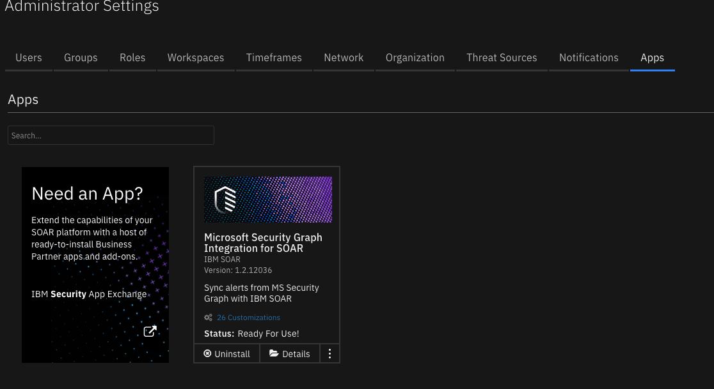
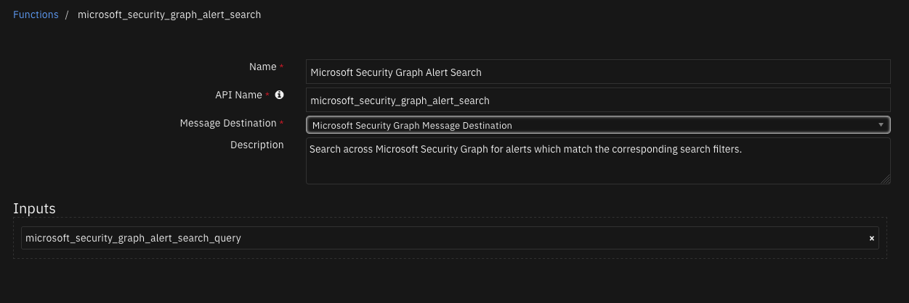
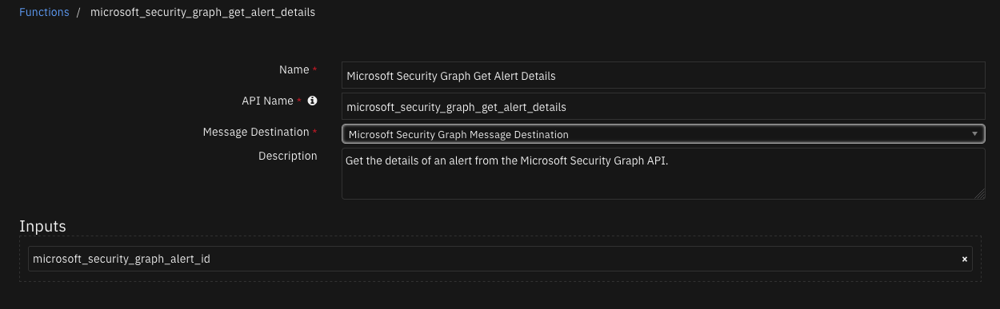
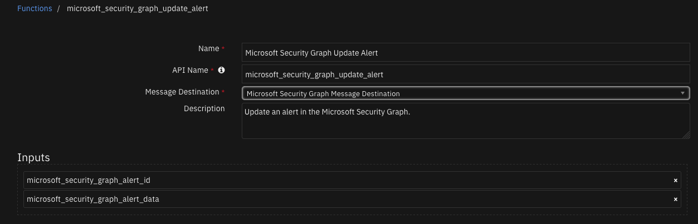

# Microsoft Security Graph Integration for SOAR

## Table of Contents
- [Release Notes](#release-notes)
- [Overview](#overview)
  - [Key Features](#key-features)
- [Requirements](#requirements)
  - [SOAR platform](#soar-platform)
  - [Cloud Pak for Security](#cloud-pak-for-security)
  - [Proxy Server](#proxy-server)
  - [Python Environment](#python-environment)
  - [Endpoint Developed With](#endpoint-developed-with)
- [Installation](#installation)
  - [Install](#install)
  - [App Configuration](#app-configuration)
- [Function - Microsoft Security Graph Alert Search](#function---microsoft-security-graph-alert-search)
- [Function - Microsoft Security Graph Get Alert Details](#function---microsoft-security-graph-get-alert-details)
- [Function - Microsoft Security Graph Update Alert](#function---microsoft-security-graph-update-alert)
- [Script - Convert json to rich text](#script---convert-json-to-rich-text)
- [Custom Fields](#custom-fields)
- [Rules](#rules)
- [Troubleshooting & Support](#troubleshooting--support)
---

## Release Notes
<!--
  Specify all changes in this release. Do not remove the release 
  notes of a previous release
-->
| Version | Date | Notes |
| ------- | ---- | ----- |
| 1.2.0 | 04/2022 | <ul><li>Move functions to their own files</li><li>Timestamp conversion fix</li><li>Add scope option to app.config and when connecting to Microsoft Security Grpah</li></ul>
| 1.1.0 | 09/2020 | <ul><li>Support for App Host</li><li>Proxy support</li><li>Readable formatting of incident notes containing Alert JSON data</li></ul>
| 1.0.1 | 08/2020 | UI version changes |
| 1.0.0 | 10/2018 | Initial Release |

---

## Overview
<!--
  Provide a high-level description of the function itself and its remote software or application.
  The text below is parsed from the "description" and "long_description" attributes in the setup.py file
-->
**SOAR Components for 'fn_microsoft_security_graph'**

 

SOAR Components for 'fn_microsoft_security_graph'

### Key Features
* Alert Polling Integration that creates new incidents in the SOAR platform from Microsoft Graph Security API alerts.
* Search function to query alerts across the tenant's data using Microsoft Graph Security API.
* Function to get details of specific Microsoft Security alerts.
* Function to update details of specific Microsoft Security alerts.
* Update Microsoft Security alerts as "Resolved" when the corresponding SOAR incident is closed.

---

## Requirements
This app supports the IBM Security QRadar SOAR Platform and the IBM Security QRadar SOAR for IBM Cloud Pak for Security.

### SOAR platform
The SOAR platform supports two app deployment mechanisms, App Host and integration server.

If deploying to a SOAR platform with an App Host, the requirements are:
* SOAR platform >= `41.0.6783`.
* The app is in a container-based format (available from the AppExchange as a `zip` file).

If deploying to a SOAR platform with an integration server, the requirements are:
* SOAR platform >= `41.0.6783`.
* The app is in the older integration format (available from the AppExchange as a `zip` file which contains a `tar.gz` file).
* Integration server is running `resilient_circuits>=40.0.0`.
* If using an API key account, make sure the account provides the following minimum permissions: 
  | Name | Permissions |
  | ---- | ----------- |
  | Org Data | Read |
  | Function | Read |

The following SOAR platform guides provide additional information: 
* _App Host Deployment Guide_: provides installation, configuration, and troubleshooting information, including proxy server settings. 
* _Integration Server Guide_: provides installation, configuration, and troubleshooting information, including proxy server settings.
* _System Administrator Guide_: provides the procedure to install, configure and deploy apps. 

The above guides are available on the IBM Documentation website at [ibm.biz/soar-docs](https://ibm.biz/soar-docs). On this web page, select your SOAR platform version. On the follow-on page, you can find the _App Host Deployment Guide_ or _Integration Server Guide_ by expanding **Apps** in the Table of Contents pane. The System Administrator Guide is available by expanding **System Administrator**.

### Cloud Pak for Security
If you are deploying to IBM Cloud Pak for Security, the requirements are:
* IBM Cloud Pak for Security >= 1.4.
* Cloud Pak is configured with an App Host.
* The app is in a container-based format (available from the AppExchange as a `zip` file).

The following Cloud Pak guides provide additional information: 
* _App Host Deployment Guide_: provides installation, configuration, and troubleshooting information, including proxy server settings. From the Table of Contents, select Case Management and Orchestration & Automation > **Orchestration and Automation Apps**.
* _System Administrator Guide_: provides information to install, configure, and deploy apps. From the IBM Cloud Pak for Security IBM Documentation table of contents, select Case Management and Orchestration & Automation > **System administrator**.

These guides are available on the IBM Documentation website at [ibm.biz/cp4s-docs](https://ibm.biz/cp4s-docs). From this web page, select your IBM Cloud Pak for Security version. From the version-specific IBM Documentation page, select Case Management and Orchestration & Automation.

### Proxy Server
The app does support a proxy server.

### Python Environment
Both Python 3.6 and Python 3.9 are supported.
Additional package dependencies may exist for each of these packages:
* resilient_circuits>=40.0.0


## Installation

### Install
* To install or uninstall an App or Integration on the _SOAR platform_, see the documentation at [ibm.biz/soar-docs](https://ibm.biz/soar-docs).
* To install or uninstall an App on _IBM Cloud Pak for Security_, see the documentation at [ibm.biz/cp4s-docs](https://ibm.biz/cp4s-docs) and follow the instructions above to navigate to Orchestration and Automation.

### App Configuration
The following table provides the settings you need to configure the app. These settings are made in the app.config file. See the documentation discussed in the Requirements section for the procedure.

| Config | Required | Example | Description |
| ------ | :------: | ------- | ----------- |
| **microsoft_graph_token_url** | Yes | `https://login.microsoftonline.com/{tenant}/oauth2/v2.0/token` | *Microsoft Graph URL endpoint for acquring access token* |
| **microsoft_graph_url** | Yes | `https://graph.microsoft.com/v1.0` | *Microsoft Graph base URL * |
| **tenant_id** | Yes | `xxx` | *Microsoft Azure Tenant ID* |
| **client_id** | Yes | `xxx` | *Microsoft Azure Client ID (Application ID)* |
| **client_secret** | Yes | `xxx` | *Microsoft Azure Client Secret* |
| **msg_polling_intervals** | Yes | `0` | *Polling interval in seconds. Zero to turn off poller* |
| **incident_template** | No | `` | *Path to custom jinja template. If not set, use default template* |
| **alert_query** | No | `filter=assignedTo eq 'analyst@m365x594651.onmicrosoft.com' and severity eq 'high'` | *String query to apply to the alert polling component* |
| **alert_time_range_sec** | No | `3600` | *Times in seconds to set the start dateTime values for the createdDateTime field when filtering alerts* |

---

## Function - Microsoft Security Graph Alert Search
Search across Microsoft Security Graph for alerts which match the corresponding search filters.

 

<details><summary>Inputs:</summary>
<p>

| Name | Type | Required | Example | Tooltip |
| ---- | :--: | :------: | ------- | ------- |
| `microsoft_security_graph_alert_search_query` | `text` | No | `filter=assignedTo eq 'analyst@m365x594651.onmicrosoft.com' and severity eq 'high'` | String to filter alert search results on |

</p>
</details>

<details><summary>Outputs:</summary>
<p>

> **NOTE:** This example might be in JSON format, but `results` is a Python Dictionary on the SOAR platform.

```python
results = {
  "content": {
    "@odata.context": "https://graph.microsoft.com/v1.0/$metadata#security/alerts",
    "value": []
  },
  "inputs": {
    "microsoft_security_graph_alert_search_query": "filter=userStates/any(user:%20user/accountName%20eq%20\u0027example@example.microsoft.com\u0027)"
  },
  "run_time": 0.3749861717224121,
  "success": true
}
```

</p>
</details>

<details><summary>Example Pre-Process Script:</summary>
<p>

```python
import java.util.Date as Date

search = "filter="
conjunction = False

if rule.properties.microsoft_security_graph_query_start_datetime:
  start = Date(rule.properties.microsoft_security_graph_query_start_datetime)
  start_ts = str(start.toInstant())
  start_filter = "createdDateTime%20ge%20{}".format(start_ts)
  search = search + start_filter
  conjunction = True

if rule.properties.microsoft_security_graph_query_end_datetime:
  end = Date(rule.properties.microsoft_security_graph_query_end_datetime)
  end_ts = str(end.toInstant())
  end_filter = "createdDateTime%20le%20{}".format(end_ts)
  if conjunction: search = search + "%20and%20"
  search = search + end_filter
  conjunction = True

if artifact.type == "User Account":
  artifact_filter = "userStates/any(user:%20user/accountName%20eq%20'{}')".format(artifact.value)
  if conjunction: search = search + "%20and%20"
  search = search + artifact_filter
  conjunction = True

inputs.microsoft_security_graph_alert_search_query = search
```

</p>
</details>

<details><summary>Example Post-Process Script:</summary>
<p>

```python
alerts = results.content.value
note = "Microsoft Security Graph Alert Search<br>There are <b>{}</b> alerts based on the artifact of value <b>{}</b>.".format(str(len(alerts)), artifact.value)

if alerts:
  note = note + "<br><b>Alert ids:</b>"
  for alert in alerts:
    note = note + "<br>- {}".format(alert.id)

incident.addNote(helper.createRichText(note))
```

</p>
</details>

---
## Function - Microsoft Security Graph Get Alert Details
Get the details of an alert from the Microsoft Security Graph API.

 

<details><summary>Inputs:</summary>
<p>

| Name | Type | Required | Example | Tooltip |
| ---- | :--: | :------: | ------- | ------- |
| `microsoft_security_graph_alert_id` | `text` | Yes | `-` | ID of an alert. |

</p>
</details>

<details><summary>Outputs:</summary>
<p>

> **NOTE:** This example might be in JSON format, but `results` is a Python Dictionary on the SOAR platform.

```python
results = {
  "content": {
    "@odata.context": "https://graph.microsoft.com/v1.0/$metadata#security/alerts/$entity",
    "activityGroupName": null,
    "alertDetections": [],
    "assignedTo": null,
    "azureSubscriptionId": null,
    "azureTenantId": "50ad7d3e-b889-434d-802d-13b87c68047b",
    "category": "Discovery",
    "closedDateTime": null,
    "cloudAppStates": [],
    "comments": [],
    "confidence": null,
    "createdDateTime": "2021-11-18T00:25:41.2649763Z",
    "description": "A known tool or technique was used to gather information on this device. Attackers might be trying to gather information about the target device or network for later attacks.",
    "detectionIds": [],
    "eventDateTime": "2021-11-18T00:21:12.910332Z",
    "feedback": null,
    "fileStates": [],
    "historyStates": [],
    "hostStates": [
      {
        "fqdn": "windowsvmos",
        "isAzureAdJoined": false,
        "isAzureAdRegistered": null,
        "isHybridAzureDomainJoined": null,
        "netBiosName": null,
        "os": "Windows10",
        "privateIpAddress": "1.0.0.0",
        "publicIpAddress": "2.2.2.2",
        "riskScore": "Medium"
      }
    ],
    "id": "da637727919412649530_-883158861",
    "incidentIds": [],
    "investigationSecurityStates": [],
    "lastEventDateTime": null,
    "lastModifiedDateTime": "2021-11-18T00:25:41.7333333Z",
    "malwareStates": [],
    "messageSecurityStates": [],
    "networkConnections": [],
    "processes": [],
    "recommendedActions": [],
    "registryKeyStates": [],
    "riskScore": null,
    "securityResources": [],
    "severity": "low",
    "sourceMaterials": [
      "https://securitycenter.microsoft.com/alert/da637727919412649530_-883158861",
      "https://security.microsoft.com/incidents/37"
    ],
    "status": "newAlert",
    "tags": [],
    "title": "Suspicious Process Discovery",
    "triggers": [],
    "uriClickSecurityStates": [],
    "userStates": [
      {
        "aadUserId": "ae973ab4-1b5e-48b2-bf2f-c3bf1b3634a2",
        "accountName": "example",
        "domainName": "WindowsVMOS",
        "emailRole": "unknown",
        "isVpn": null,
        "logonDateTime": null,
        "logonId": null,
        "logonIp": null,
        "logonLocation": null,
        "logonType": null,
        "onPremisesSecurityIdentifier": null,
        "riskScore": null,
        "userAccountType": null,
        "userPrincipalName": "example@example.microsoft.com"
      }
    ],
    "vendorInformation": {
      "provider": "Microsoft Defender ATP",
      "providerVersion": null,
      "subProvider": "MicrosoftDefenderATP",
      "vendor": "Microsoft"
    },
    "vulnerabilityStates": []
  },
  "inputs": {
    "microsoft_security_graph_alert_id": "da637727919412649530_-883158861"
  },
  "run_time": 0.7184658050537109,
  "success": true
}
```

</p>
</details>

<details><summary>Example Pre-Process Script:</summary>
<p>

```python
inputs.microsoft_security_graph_alert_id = incident.properties.microsoft_security_graph_alert_id
```

</p>
</details>

<details><summary>Example Post-Process Script:</summary>
<p>

```python
user_states = results.content.userStates

for state in user_states:
  if state.logonIp:
    incident.addArtifact("IP Address", state.logonIp, "")

  if state.accountName:
    incident.addArtifact("User Account", state.accountName, "")

  if state.userPrincipalName:
    incident.addArtifact("User Account", state.userPrincipalName, "")

# Put the results json into a workflow property so we can call the
# convert_json_to_rich_text script to print readable formatted json in an incident note.
json_note = {
              "version": "1.0.",
              "header": "Microsoft Security Graph Get Alert Details",
              "json": results.content,
              "sort": False
            }

workflow.addProperty('convert_json_to_rich_text', json_note)
```

</p>
</details>

---
## Function - Microsoft Security Graph Update Alert
Update an alert in the Microsoft Security Graph.

 

<details><summary>Inputs:</summary>
<p>

| Name | Type | Required | Example | Tooltip |
| ---- | :--: | :------: | ------- | ------- |
| `microsoft_security_graph_alert_data` | `textarea` | Yes | `-` | JSON string of data to update an alert with. |
| `microsoft_security_graph_alert_id` | `text` | Yes | `-` | ID of an alert. |

</p>
</details>

<details><summary>Outputs:</summary>
<p>

> **NOTE:** This example might be in JSON format, but `results` is a Python Dictionary on the SOAR platform.

```python
results = {
  "content": {
    "@odata.context": "https://graph.microsoft.com/v1.0/$metadata#security/alerts/$entity",
    "CustomProperties": "[\"{\\\"Investigation Steps\\\":\\\"1. Review the IP addresses and determine if they should be communicating with the virtual machine\\\\r\\\\n2. Enforce the hardening rule recommended by Defender for Cloud which will allow access only to recommended IP addresses. You can edit the rule\u0027s properties and change the IP addresses to be allowed, or alternatively edit the Network Security Group\u0027s rules directly\\\",\\\"Destination Port\\\":\\\"514\\\",\\\"Protocol\\\":\\\"TCP\\\",\\\"Source IP(s) [Number of attempts]\\\":\\\"IP: 1.2.3.4 [42]\\\",\\\"resourceType\\\":\\\"Virtual Machine\\\",\\\"ReportingSystem\\\":\\\"Azure\\\"}\",\"\\\"PreAttack\\\"\"]",
    "activityGroupName": null,
    "alertDetections": [],
    "assignedTo": "",
    "azureSubscriptionId": "a4b7e24a-c7aa-4d84-8dae-89e99b336784",
    "azureTenantId": "50ad7d3e-b889-434d-802d-13b87c68047b",
    "category": "Network_TrafficFromUnrecommendedIP",
    "closedDateTime": null,
    "cloudAppStates": [],
    "comments": [],
    "confidence": null,
    "createdDateTime": "2022-04-06T17:03:05.9705338Z",
    "description": "Defender for Cloud detected inbound traffic from IP addresses that are recommended to be blocked. This typically occurs when this IP address doesn\u0027t communicate regularly with this resource.\r\nAlternatively, the IP address has been flagged as malicious by Microsoft\u0027s threat intelligence sources.",
    "detectionIds": [],
    "eventDateTime": "2022-04-05T01:00:00Z",
    "feedback": null,
    "fileStates": [],
    "historyStates": [],
    "hostStates": [],
    "id": "2517531803999999999_eb4f270a-9603-44e0-adb2-16c0e5842d7d",
    "incidentIds": [],
    "investigationSecurityStates": [],
    "lastEventDateTime": null,
    "lastModifiedDateTime": "2022-04-07T12:26:36.5586762Z",
    "malwareStates": [],
    "messageSecurityStates": [],
    "networkConnections": [
      {
        "applicationName": null,
        "destinationAddress": null,
        "destinationDomain": null,
        "destinationLocation": null,
        "destinationPort": "514",
        "destinationUrl": null,
        "direction": null,
        "domainRegisteredDateTime": null,
        "localDnsName": null,
        "natDestinationAddress": null,
        "natDestinationPort": null,
        "natSourceAddress": null,
        "natSourcePort": null,
        "protocol": "tcp",
        "riskScore": null,
        "sourceAddress": "12.34.56.78",
        "sourceLocation": "Fort Worth, Texas, US",
        "sourcePort": null,
        "status": null,
        "urlParameters": null
      }
    ],
    "processes": [],
    "recommendedActions": [
      "{\"kind\":\"openBlade\",\"displayValue\":\"Enforce rule\",\"extension\":\"Microsoft_Azure_Security_R3\",\"detailBlade\":\"AdaptiveNetworkControlsResourceBlade\",\"detailBladeInputs\":\"protectedResourceId=/subscriptions/a4b7e24a-c7aa-4d84-8dae-89e99b336784/resourcegroups/demoassets/providers/microsoft.compute/virtualmachines/logforwarder\"}"
    ],
    "registryKeyStates": [],
    "riskScore": null,
    "securityResources": [
      {
        "resource": "/subscriptions/a4b7e24a-c7aa-4d84-8dae-89e99b336784/resourcegroups/demoassets/providers/microsoft.compute/virtualmachines/logforwarder",
        "resourceType": "attacked"
      }
    ],
    "severity": "low",
    "sourceMaterials": [
      "https://portal.azure.com/#blade/Microsoft_Azure_Security_AzureDefenderForData/AlertBlade/alertId/2517531803999999999_eb4f270a-9603-44e0-adb2-16c0e5842d7d/subscriptionId/a4b7e24a-c7aa-4d84-8dae-89e99b336784/resourceGroup/demoassets/referencedFrom/alertDeepLink/location/centralus"
    ],
    "status": "unknown",
    "tags": [
      "",
      ""
    ],
    "title": "Traffic detected from IP addresses recommended for blocking",
    "triggers": [],
    "uriClickSecurityStates": [],
    "userStates": [],
    "vendorInformation": {
      "provider": "ASC",
      "providerVersion": null,
      "subProvider": "AdaptiveNetworkHardenings",
      "vendor": "Microsoft"
    },
    "vulnerabilityStates": []
  },
  "inputs": {
    "microsoft_security_graph_alert_data": "{\n        \"assignedTo\": \"\",\n        \n        \"comments\": [\u0027\u0027, \u0027\u0027],\n        \"feedback\": \"\",\n        \"status\": \"unknown\",\n        \"tags\": [\u0027\u0027, \u0027\u0027],\n        \"vendorInformation\":\n        {\n            \"provider\": \"ASC\",\n            \"vendor\": \"Microsoft\"\n        }\n    }",
    "microsoft_security_graph_alert_id": "2517531803999999999_eb4f270a-9603-44e0-adb2-16c0e5842d7d"
  },
  "run_time": 0.4577150344848633,
  "success": true
}
```

</p>
</details>

<details><summary>Example Pre-Process Script:</summary>
<p>

```python
import java.util.Date as Date

epoch_time = Date()
closedDateTime = str(epoch_time.toInstant())

provider = workflow.properties.msg_alert_details.content.vendorInformation.provider
vendor = workflow.properties.msg_alert_details.content.vendorInformation.vendor

data = '''{{
        "closedDateTime": "{0}",
        "status": "{1}",
        "vendorInformation":
        {{
            "provider": "{2}",
            "vendor": "{3}"
        }}
    }}'''.format(closedDateTime, "resolved", provider, vendor)

inputs.microsoft_security_graph_alert_data = data
inputs.microsoft_security_graph_alert_id = incident.properties.microsoft_security_graph_alert_id
```

</p>
</details>

<details><summary>Example Post-Process Script:</summary>
<p>

```python
# Put the results json into a workflow property so we can call the
# convert_json_to_rich_text script to print readable formatted json in an incident note.
json_note = {"version": "1.0.",
             "header": "Microsoft Security Graph Resolve Alert",
             "json": results.content}

workflow.addProperty('convert_json_to_rich_text', json_note)
```

</p>
</details>

---

## Script - Convert json to rich text
This script converts a json object into a hierarchical display of rich text and adds the rich text to an incident's rich text (custom) field or an incident note. A workflow property is used to share the json to convert and identify parameters used on how to perform the conversion.
Typically, a function will create workflow property and this script will run after that function to perform the conversion.
  Features:
    * Display the hierarchical nature of json, presenting the json keys as bold labels
    * Provide links to found URLs
    * Create either an incident note or add results to an incident (custom) rich text field.

**Object:** incident

<details><summary>Script Text:</summary>
<p>

```python
"""
  This script converts a json object into a hierarchical display of rich text and adds the rich text to an incident's rich text (custom) field or an incident note.
  A workflow property is used to share the json to convert and identify parameters used on how to perform the conversion.
  Typically, a function will create workflow property and this script will run after that function to perform the conversion.
  Features:
    * Display the hierarchical nature of json, presenting the json keys as bold labels
    * Provide links to found URLs
    * Create either an incident note or add results to an incident (custom) rich text field.
  
  In order to use this script, define a workflow property called: convert_json_to_rich_text, to define the json and parameters to use for the conversion.
  Workflow properties can be added using a command similar to this:
  workflow.addProperty('convert_json_to_rich_text', { 
    "version": 1.0,
    "header": "Artifact scan results for 12.34.221.1",
    "padding": 10,
    "separator": u"<br>",
    "sort": True,
    "json": { "some": "json", "omit": "this", "list": ["a", "b", "c"] },
    "json_omit_list": ["omit"],
    "incident_field": None
  })
  
  Format of workflow.property.convert_json_to_rich_text:
  { 
    "version": 1.0, [this is for future compatibility]
    "header": str, [header line to add to converted json produced or None. Ex: Results from scanning artifact: xxx. The header may contain rich text tags]
    "padding": 10, [padding for nested json elements, or defaults to 10]
    "separator": u"<br>", [html separator between json keys and lists or defaults to html break: '<br>']
    "sort": True|False, [sort the json keys at each level when displayed]
    "json": json, [required json to convert]
    "json_omit_list": [list of json keys to exclude or None]
    "incident_field": "<incident_field>" [indicates a builtin rich text incident field, such as 'description' 
                                          or a custom rich text field in the format: 'properties.<field>'. default: create an incident note]
  }
"""

import re


rc = re.compile('http[s]?://(?:[a-zA-Z]|[0-9]|[$-_@.&+#]|[!*\(\),]|(?:%[0-9a-fA-F][0-9a-fA-F]))+')

class ConvertJson:
  """Class to hold the conversion parameters and perform the conversion"""
  
  def __init__(self, omit_keys=[], padding=10, separator=u"<br>", sort_keys=False):
    self.omit_keys = omit_keys
    self.padding = padding
    self.separator = separator
    self.sort_keys = sort_keys


  def format_link(self, item):
    """[summary]
      Find embedded urls (http(s)) and add html anchor tags to display as links
      Args:
          item ([string])

      Returns:
          [str]: None|original text if no links|text with html links
    """
    formatted_item = item
    if item and not isinstance(item, int) and not isinstance(item, bool):
        list = rc.findall(item)
        if list:
            for link in list:
                formatted_item = formatted_item.replace(link, "<a target='blank' href='{0}'>{0}</a>".format(link))

    return formatted_item

  def expand_list(self, list_value, is_list=False):
    """[summary]
      convert items to html, adding indents to nested dictionaries.
      Args:
          list_value ([dict|list]): json element

      Returns:
          [str]: html converted code
    """
    if not isinstance(list_value, list):
      return self.format_link(list_value)
    elif list_value:
      try:
        items = []  # this will ensure list starts on second line of key label
        for item in list_value:
          if isinstance(item, dict):
            result = self.convert_json_to_rich_text(item)
            if is_list:
              items.append("<div style='padding:{}px'>{}</div>".format(self.padding, result))
            else:
              items.append(result)
          elif isinstance(item, list):
            items.append("<div style='padding:5px'>{}</div>".format(self.expand_list(item, is_list=True)))
          else:
            items.append(self.format_link(str(item)))
        return "<div style='padding:5px'>{}</div>".format(self.separator.join(items))
      except Exception as err:
          return str(err)

  def convert_json_to_rich_text(self, sub_dict):
    """[summary]
      Walk dictionary tree and convert to html for better display
      Args:
          sub_dict ([type]): [description]

      Returns:
          [type]: [description]
    """
    notes = []
    loop_separator = ""  # first time through no separator
    keys = sorted (sub_dict.keys()) if self.sort_keys else sub_dict.keys()

    for key in keys:
      value = sub_dict[key]

      if key not in self.omit_keys:
        if isinstance(value, dict):
          result = self.convert_json_to_rich_text(value)
          notes.append(u"{}<b>{}</b>: <div style='padding:{}px'>{}</div>".format(loop_separator, key, self.padding, result))
        else:
          notes.append(u"{}<b>{}</b>: {}".format(loop_separator, key, self.expand_list(value, is_list=isinstance(value, list))))
          
      loop_separator = self.separator # subsequent times, add in separator

    result = u"".join(notes)
    return result.replace(u"</div>{0}".format(separator), "</div>")  # tighten up result

def get_properties(property_name):
  """
  Logic to collect the json and parameters from a workflow property.
  Args:
    property_name: workflow property to reference
  Returns:
    padding, separator, header, json_omit_list, incident_field, json, sort_keys
  """
  if not workflow.properties.get(property_name):
    helper.fail("workflow.properties.{} undefined".format(property_name))
  if not workflow.properties[property_name].get('json'):
    helper.fail("workflow.properties.{}.json undefined".format(property_name))

  padding = workflow.properties[property_name].get("padding", 10)
  separator = workflow.properties[property_name].get("separator", u"<br>")
  header = workflow.properties[property_name].get("header")
  json_omit_list = workflow.properties[property_name].get("json_omit_list")
  if not json_omit_list:
    json_omit_list = []
  incident_field = workflow.properties[property_name].get("incident_field")
  json = workflow.properties[property_name].get("json")
  if not isinstance(json, dict):
    helper.fail("json element is not formatted correctly: {}".format(json))
  sort_keys = workflow.properties[property_name].get("sort", False)

  return padding, separator, header, json_omit_list, incident_field, json, sort_keys


## S T A R T
padding, separator, header, json_omit_list, incident_field, json, sort_keys = get_properties('convert_json_to_rich_text')

if header:
  hdr = u"{0}{1}".format(header, separator)
else:
  hdr = u""

convert = ConvertJson(omit_keys=json_omit_list, padding=padding, separator=separator, sort_keys=sort_keys)
converted_json = convert.convert_json_to_rich_text(json)
result = u"{}{}".format(hdr, converted_json)

rich_text_note = helper.createRichText(result)
if incident_field:
  incident[incident_field] = rich_text_note
else:
  incident.addNote(rich_text_note)

```

</p>
</details>

---


## Custom Fields
| Label | API Access Name | Type | Prefix | Placeholder | Tooltip |
| ----- | --------------- | ---- | ------ | ----------- | ------- |
| Microsoft Security Graph Alert ID | `microsoft_security_graph_alert_id` | `text` | `properties` | Field for Microsoft Security Graph Alert ID | ID of an alert from Microsoft Security Graph |

---


## Rules
| Rule Name | Object | Workflow Triggered |
| --------- | ------ | ------------------ |
| Example: Microsoft Security Graph Alert Search | artifact | `example_microsoft_security_graph_alert_search` |
| Example: Microsoft Security Graph Get Details | incident | `example_microsoft_security_graph_get_alert_details` |
| Example: Microsoft Security Graph Resolve Alert | incident | `example_microsoft_security_graph_resolve_alert` |
| Example: Microsoft Security Graph Update Alert | incident | `example_microsoft_security_graph_update_alert` |

---

## Upgrading from a version older than v1.1.0
Existing users running fn_microsoft_security_graph functions on an integrations server, should save the [fn_microsoft_security_graph] section of their app.config file to another file and delete that section from the app.config file before installing the new version, as this section has changed.  After installation get the new configuration by running:
```
  $ resilient-circuits config -u -l fn-microsoft-security-graph
  ```
Edit the required configuration setting as described in the [Integration Server](#integration-server) section below.

## Troubleshooting & Support
Refer to the documentation listed in the Requirements section for troubleshooting information.

### For Support
This is an IBM supported app. Please search [ibm.com/mysupport](https://ibm.com/mysupport) for assistance.
