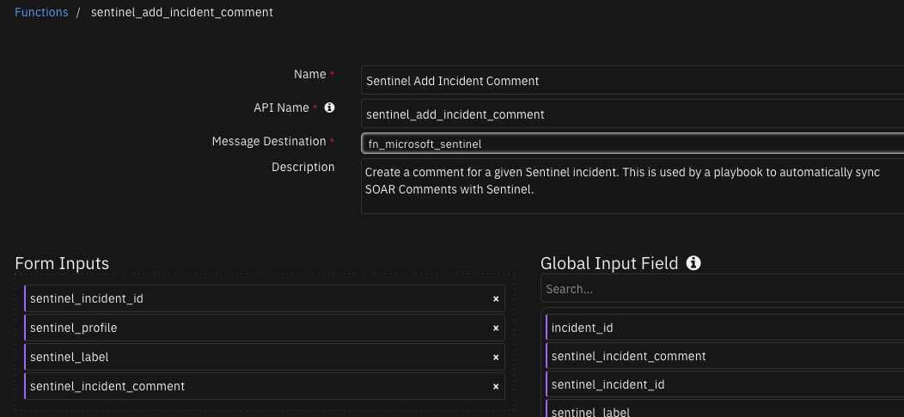
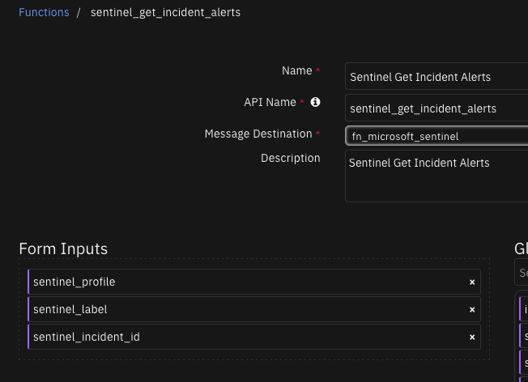
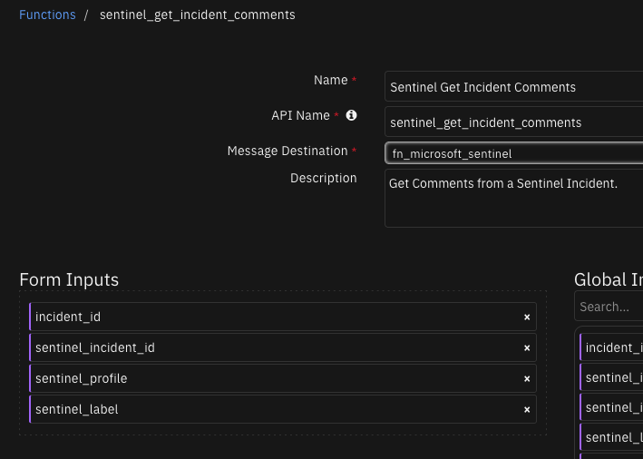
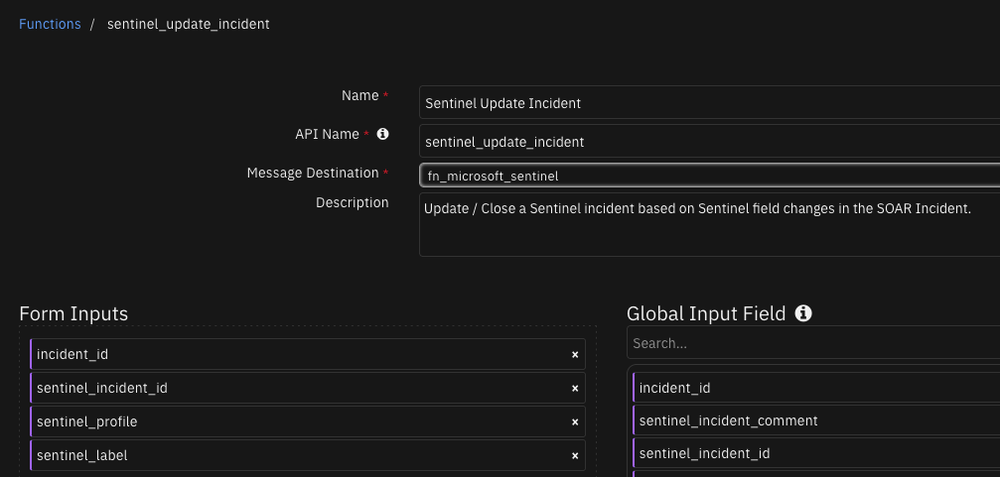

# Microsoft Sentinel


## Table of Contents
- [Release Notes](#release-notes)
- [Overview](#overview)
  - [Key Features](#key-features)
- [Requirements](#requirements)
  - [SOAR platform](#soar-platform)
  - [Cloud Pak for Security](#cloud-pak-for-security)
  - [Proxy Server](#proxy-server)
  - [Python Environment](#python-environment)
- [Sentinel Configuration](#sentinel-configuration)
- [Installation](#installation)
  - [Install](#install)
  - [App Configuration](#app-configuration)
- [Function - Sentinel Add Incident Comment](#function---sentinel-add-incident-comment)
- [Function - Sentinel Get Incident Alerts](#function---sentinel-get-incident-alerts)
- [Function - Sentinel Get Incident Comments](#function---sentinel-get-incident-comments)
- [Function - Sentinel Get Incident Entities](#function---sentinel-get-incident-entities)
- [Function - Sentinel Update Incident](#function---sentinel-update-incident)
  - [Custom Layouts](#custom-layouts)
- [Data Table - Sentinel Incident Alerts](#data-table---sentinel-incident-alerts)
- [Data Table - Sentinel Incident Entities](#data-table---sentinel-incident-entities)
- [Custom Fields](#custom-fields)
- [Playbooks](#playbooks)
- [Custom Templates](#custom-templates)
- [Custom poller filter template](#custom-poller-filter-template)
- [Troubleshooting & Support](#troubleshooting--support)

---

## Release Notes
<!--
  Specify all changes in this release. Do not remove the release 
  notes of a previous release
-->
| Version | Date | Notes |
| ------- | ---- | ----- |
| 2.1.2 | 10/2024 | Added retry logic to SOAR incident updates |
| 2.1.1 | 07/2024 | Correction to documentation on template references |
| 2.1.0 | 03/2024 | Add support for multi-tenancy. |
| 2.0.0 | 01/2024 | <ul><li>Bug fix in jinja template, "incident_update_template.jinja", for escaping double quotation mark when rendering in json.</li><li>Update jinja templates to use values rather than IDs.</li><li>Add new setting in the app.config to set api-version.</li><li>Add the ability to use a jinja template as the poller incident filter.</li></ul> |
| 1.2.0 | 07/2023 | Add config setting to not close SOAR case was Sentinel incident is closed |
| 1.1.0 | 04/2023 | Update function 'Sentinel Update Incident' |
| 1.0.4 | 06/2022 | Several template fixes for tags (labels) and severity |
| 1.0.3 | 04/2022 | Support for app.config verify and cert parameters |
| 1.0.2 | 02/2022 | Bug fix in some situations updating Sentinel from SOAR |
| 1.0.1 | 11/2021 | Minor bug fixes and datatable improvements |
| 1.0.0 | 08/2021 | Initial Release |

### v2.1.1

The default configuration file incorrectly specified the override Sentinel template references were:

```
update_sentinel_incident_template
close_sentinel_incident_template
```

The correct settings are:

```
sentinel_update_incident_template
sentinel_close_incident_template
```

### v2.1.0

When upgrading from a previous version to v2.1.0, manually update your app.config to be able to use the multi-tenant capability. The app.config changes are documented here [App Configuration](#app-configuration). The previous version of the app.config from versions before 2.1.0 are compatible with version 2.1.0+.

---

## Overview
**SOAR integration for 'fn_microsoft_sentinel'**

 

This app allows bi-directional synchronization between IBM SOAR and Microsoft Sentinel.
Sentinel entities are exposed as artifacts for further investigation.

### Key Features
* Escalate Microsoft Sentinel Incidents to IBM SOAR Cases
* Automatically keep Incidents and Cases synchronized
* Retrieve Sentinel Incident alert entities as artifacts and data table rows
* Sync comments to and from Sentinel Incidents
* Support editable templates for field mapping between the two systems
* Supports configuring multiple Sentinel servers

---

## Requirements
This app supports the IBM Security QRadar SOAR Platform and the IBM Security QRadar SOAR for IBM Cloud Pak for Security.

### SOAR platform
The SOAR platform supports two app deployment mechanisms, Edge Gateway (also known as App Host) and integration server.

If deploying to a SOAR platform with an App Host, the requirements are:
* SOAR platform >= `50.0.9097`.
* The app is in a container-based format (available from the AppExchange as a `zip` file).

If deploying to a SOAR platform with an integration server, the requirements are:
* SOAR platform >= `50.0.9097`.
* The app is in the older integration format (available from the AppExchange as a `zip` file which contains a `tar.gz` file).
* Integration server is running `resilient_circuits>=50.0.0`.
* If using an API key account, make sure the account provides the following minimum permissions: 
  | Name | Permissions |
  | ---- | ----------- |
  | Org Data | Read |
  | Function | Read |
  | Incident | Read, Edit, Create, Owner, Status |
  | Incident Notes | Edit |
  | Layout | Read, Edit |

The following SOAR platform guides provide additional information: 
* _Edge Gateway Deployment Guide_ or _App Host Deployment Guide_: provides installation, configuration, and troubleshooting information, including proxy server settings. 
* _Integration Server Guide_: provides installation, configuration, and troubleshooting information, including proxy server settings.
* _System Administrator Guide_: provides the procedure to install, configure and deploy apps. 

The above guides are available on the IBM Documentation website at [ibm.biz/soar-docs](https://ibm.biz/soar-docs). On this web page, select your SOAR platform version. On the follow-on page, you can find the _Edge Gateway Deployment Guide_, _App Host Deployment Guide_, or _Integration Server Guide_ by expanding **Apps** in the Table of Contents pane. The System Administrator Guide is available by expanding **System Administrator**.

### Cloud Pak for Security
If you are deploying to IBM Cloud Pak for Security, the requirements are:
* IBM Cloud Pak for Security >= `1.10.15`.
* Cloud Pak is configured with an Edge Gateway.
* The app is in a container-based format (available from the AppExchange as a `zip` file).

The following Cloud Pak guides provide additional information: 
* _Edge Gateway Deployment Guide_ or _App Host Deployment Guide_: provides installation, configuration, and troubleshooting information, including proxy server settings. From the Table of Contents, select Case Management and Orchestration & Automation > **Orchestration and Automation Apps**.
* _System Administrator Guide_: provides information to install, configure, and deploy apps. From the IBM Cloud Pak for Security IBM Documentation table of contents, select Case Management and Orchestration & Automation > **System administrator**.

These guides are available on the IBM Documentation website at [ibm.biz/cp4s-docs](https://ibm.biz/cp4s-docs). From this web page, select your IBM Cloud Pak for Security version. From the version-specific IBM Documentation page, select Case Management and Orchestration & Automation.

### Proxy Server
The app **does** support a proxy server.

### Python Environment
Python 3.9 and Python 3.11 are supported.
Additional package dependencies may exist for each of these packages:
* jinja2~=3.1.0
* resilient_circuits>=50.0.0
* simplejson~=3.19.0

---

## Sentinel Configuration
Several steps are necessary to enable API access to Sentinel. Below is a brief list of steps to complete:

1. Define an App under `App registration`,  for Sentinel access. The Application (client) ID will be used as the app.config `client_id`.

    a. Specify a client secret. This will be used in the app.config file as `api_secret`.

 
 

2. Define a workspace and resource group for the subscription. These names will be defined in the app.config file as `workspace_name` and `resource_groupname`.


3. For your resource group, specify the app with the Sentinel Responder role.


4. Add your tenant_id (Under `Tenant properties`) and subscription_id to the app.config file.

---

## Installation

### Install
* To install or uninstall an App or Integration on the _SOAR platform_, see the documentation at [ibm.biz/soar-docs](https://ibm.biz/soar-docs).
* To install or uninstall an App on _IBM Cloud Pak for Security_, see the documentation at [ibm.biz/cp4s-docs](https://ibm.biz/cp4s-docs) and follow the instructions above to navigate to Orchestration and Automation.

### App Configuration
The following table provides the settings you need to configure the app. These settings are made in the app.config file. See the documentation discussed in the Requirements section for the procedure.

| Config | Required | Example | Description |
| ------ | :------: | ------- | ----------- |
| **azure_url** | Yes | `https://management.azure.com` | *URL for Azure access. This field is typically not changed* |
| **ms_sentinel_labels** | No | `label1` | *A comma separated list of label(s) to access* |
| **polling_lookback** | Yes | `120` | *# of minutes to look back for incident changes. This is used only the first time the app starts* |
| **polling_interval** | Yes | `60` | *# of Seconds to wait until checking for changes in Sentinel. Comment out to disable the poller* |
| **api_version** | No | `2023-11-01-preview` | *API version to use when making API calls to Microsoft Sentinel. Sentinel API versions can be found https://learn.microsoft.com/en-us/rest/api/securityinsights/api-versions* |
| **https_proxy**| No | `https:/your.proxy.com` | - |
| **http_proxy** | No | `http:/your.proxy.com` | - |
| **verify** | No | `false` | *verify= false or /path/to/client_certificate.pem* |

For each labeled server:
| Config | Required | Example | Description |
| ------ | :------: | ------- | ----------- |
| **tenant_id** | Yes | `aaa-bbb-ccc` | *Your tenant_id* |
| **client_id** | Yes | `aaa-bbb-ddd` | *Your App Id or client_id* |
| **app_secret** | Yes | `aaa-bbb-eee` | *Your app secret* |
| **subscription_id** | Yes | `aaa-bbb-fff` | *subscription_id for incident access * |
| **workspace_name** | Yes | `` | *workspace name for incident access.* |
| **resource_groupname** | Yes | `` | *resource group for incident access.* |
| **new_incident_filters** | No | `"status": ["New", "Active"],"severity": ["High", "Medium","Low"]` | *Set of filters to apply when escalating incidents to SOAR. Incidents not matching the criteria are not synchronized. In this example, both a match of status and severity would be required. * |
| **poller_filters_template** | No | /var/rescircuits/poller_filters_template.jinja | Customer supplied template for filters to apply to new Sentinel incidents found by the poller. |
| **max_alerts** | Yes | 10 | *limit the number of alerts per sentinel incident to the first n alerts or leave blank for all alerts* |
| **close_soar_case** | No | `True` | Whether the SOAR case should be closed when its linked Sentinel incident is closed. If set to False the linked SOAR case will be updated, but not closed. |
| **create_incident_template** | No | /var/rescircuits/create_incident_template.jinja | Customer supplied template for mapping Sentinel Incident fields to an SOAR incident. If not specified, a default template is used. |
| **update_incident_template** | No | /var/rescircuits/update_incident_template.jinja | Customer supplied template for mapping Sentinel Incident fields to an SOAR incident. If not specified, a default template is used. |
| **close_incident_template** | No | /var/rescircuits/close_incident_template.jinja | Customer supplied template for mapping Sentinel Incident fields to an SOAR incident. If not specified, a default template is used. This is useful when a customer customizes the fields used when closing an incident. |
| **sentinel_update_incident_template** | No | /var/rescircuits/update_sentinel_incident_template.jinja | Customer supplied template for updating a sentinel incident when the SOAR incident is updated |
| **sentinel_close_incident_template** | No | /var/rescircuits/update_sentinel_incident_template.jinja | Customer supplied template for closing a sentinel incident when the SOAR incident is closed |

See the section below for examples of the templates.

---

 

## Function - Sentinel Add Incident Comment
Create a comment for a given Sentinel incident. This is used by a playbook to automatically sync
SOAR Comments with Sentinel.

 

<details><summary>Inputs:</summary>
<p>

| Name | Type | Required | Example | Tooltip |
| ---- | :--: | :------: | ------- | ------- |
| `sentinel_incident_comment` | `text` | Yes | `-` | Comment to add to the Sentinel Incident. |
| `sentinel_incident_id` | `text` | No | `-` | The ID of a Sentinel Incident. |
| `sentinel_label` | `text` | No | `-` | Label give to the Sentinel server in the app.config. Example in app.config [fn_microsoft_sentinel:label1] the label here is label1. |
| `sentinel_profile` | `text` | No | `-` | The Sentinel profile name. |

</p>
</details>

<details><summary>Outputs:</summary>
<p>

> **NOTE:** This example might be in JSON format, but `results` is a Python Dictionary on the SOAR platform.

```python
results = {
  "content": {
    "etag": "\"1f017068-0000-0100-0000-6616d57f0000\"",
    "id": "/subscriptions/xxxxxxxx-xxxx-xxxx-xxxx-xxxxxxxxxxxx/resourceGroups/demoassets/providers/Microsoft.OperationalInsights/workspaces/AzureSentinelDemo/providers/Microsoft.SecurityInsights/Incidents/b3763ac5-6319-496b-b404-6c5000418a81/Comments/42acd50c-f765-11ee-ab89-fa89897771d8",
    "name": "42acd50c-f765-11ee-ab89-fa89897771d8",
    "properties": {
      "author": {
        "email": null,
        "name": "Comment created from external application - MS Sentinel",
        "objectId": "fb5360be-0c6a-4260-ae69-9b07dd735441",
        "userPrincipalName": null
      },
      "createdTimeUtc": "2024-04-10T18:07:59.058255Z",
      "lastModifiedTimeUtc": "2024-04-10T18:07:59.058255Z",
      "message": "From IBM SOAR:\nhello"
    },
    "type": "Microsoft.SecurityInsights/Incidents/Comments"
  },
  "inputs": {
    "sentinel_incident_comment": "hello",
    "sentinel_incident_id": "b3763ac5-6319-496b-b404-6c5000418a81",
    "sentinel_label": "label1",
    "sentinel_profile": null
  },
  "metrics": {
    "execution_time_ms": 1497,
    "host": "local",
    "package": "fn-microsoft-sentinel",
    "package_version": "2.1.0",
    "timestamp": "2024-04-10 14:07:59",
    "version": "1.0"
  },
  "raw": null,
  "reason": null,
  "success": true,
  "version": 2.0
}
```

</p>
</details>

<details><summary>Example Function Input Script:</summary>
<p>

```python
inputs.sentinel_incident_comment = note.text.content
inputs.sentinel_incident_id = incident.properties.sentinel_incident_number
if incident.properties.sentinel_profile:
  inputs.sentinel_profile = incident.properties.sentinel_profile
if incident.properties.sentinel_label:
  inputs.sentinel_label = incident.properties.sentinel_label
```

</p>
</details>

<details><summary>Example Function Post Process Script:</summary>
<p>

```python
# Import datetime
from datetime import datetime
results = playbook.functions.results.comment_results

if results.get("success"):
  # Get the current time
  dt_now = datetime.now()
  # note.text = f"<b>Sent to Sentinel at {dt_now}</b><br>{str(note.text.content)}"
else:
  incident.addNote(f"Sentinel Comment Sync failed with reason: {results.get('reason')}")
```

</p>
</details>

---
## Function - Sentinel Get Incident Alerts
Sentinel Get Incident Alerts

 

<details><summary>Inputs:</summary>
<p>

| Name | Type | Required | Example | Tooltip |
| ---- | :--: | :------: | ------- | ------- |
| `sentinel_incident_id` | `text` | No | `-` | The ID of a Sentinel Incident. |
| `sentinel_label` | `text` | No | `-` | Label give to the Sentinel server in the app.config. Example in app.config [fn_microsoft_sentinel:label1] the label here is label1. |
| `sentinel_profile` | `text` | No | `-` | The Sentinel profile name. |

</p>
</details>

<details><summary>Outputs:</summary>
<p>

> **NOTE:** This example might be in JSON format, but `results` is a Python Dictionary on the SOAR platform.

```python
results = {
  "content": {
    "value": [
      {
        "id": "/subscriptions/xxxxxxxx-xxxx-xxxx-xxxx-xxxxxxxxxxxx/resourceGroups/demoassets/providers/Microsoft.OperationalInsights/workspaces/AzureSentinelDemo/providers/Microsoft.SecurityInsights/Entities/4c4831e9-2ed7-a44a-e530-c784cc7c2ddc",
        "kind": "SecurityAlert",
        "name": "4c4831e9-2ed7-a44a-e530-c784cc7c2ddc",
        "properties": {
          "additionalData": {
            "AlertMessageEnqueueTime": "2024-04-10T15:29:49.911Z",
            "MTP_Classification": "Unknown",
            "OriginalProductComponentName": "Databases",
            "OriginalProductName": "Azure Security Center",
            "StoreAlertPublisher": "{\"Succeeded\":true,\"Reason\":null,\"PublishTime\":\"2024-04-10T15:29:41.6565662Z\"}",
            "effectiveSubscriptionId": "xxxxxxxx-xxxx-xxxx-xxxx-xxxxxxxxxxxx"
          },
          "alertDisplayName": "Suspected brute-force attack attempt",
          "alertLink": "https://portal.azure.com/#blade/Microsoft_Azure_Security_AzureDefenderForData/AlertBlade/alertId/2516895378499999999_c01aa88b-4520-4c62-a80d-c61f3dfaf47e/subscriptionId/xxxxxxxx-xxxx-xxxx-xxxx-xxxxxxxxxxxx/resourceGroup/DemoAssets/referencedFrom/alertDeepLink/location/centralus",
          "alertType": "SQL.VM_BruteForce",
          "compromisedEntity": "PAMSqlSv",
          "confidenceLevel": "Unknown",
          "description": "Brute-force attack is a common attack technique for finding valid credentials to the database. By submitting many users/passwords combinations, an attacker can guess a correct one.\r\nOnce obtained, an attacker can have full access to the database. While this specific alert doesn\u0027t indicate a successful brute-force, it is advised to take safety measures to protect your resource against this attack.\r\nTo investigate this suspected brute-force attempt, review it\u0027s origin (based on the application name and IP/Location), and try to find out whether it\u0027s recognized to you, or suspicious.\r\nIf you believe this to be an attack on your database, use firewall rules to limit the access to your resource, and make sure you use strong passwords and not well known user names.\r\nAlso, consider using only AAD authentication to further enhance your security posture.\r\n",
          "endTimeUtc": "2024-04-10T15:29:10Z",
          "friendlyName": "Suspected brute-force attack attempt",
          "processingEndTime": "2024-04-10T15:29:40.734843Z",
          "productComponentName": "Databases",
          "productName": "Azure Security Center",
          "providerAlertId": "2516895378499999999_c01aa88b-4520-4c62-a80d-c61f3dfaf47e",
          "remediationSteps": [
            "* Apply [workflow automation](https://go.microsoft.com/fwlink/?linkid=2174808) to block future attacks.",
            "* Consider [blocking the IP address](https://go.microsoft.com/fwlink/?linkid=2099055) of the attacking client and hardening your firewall.",
            "* When possible, use [Windows authentication](https://go.microsoft.com/fwlink/?linkid=2129121) and disable SQL Server authentication.",
            "* Use [strong passwords](https://go.microsoft.com/fwlink/?linkid=2099068) and avoid reusing them across multiple databases.",
            "* If applicable, disable default and well known application/database accounts such as SA."
          ],
          "resourceIdentifiers": [
            {
              "resourceId": "/subscriptions/xxxxxxxx-xxxx-xxxx-xxxx-xxxxxxxxxxxx/resourceGroups/DemoAssets/providers/Microsoft.Compute/virtualMachines/PAMSqlSv",
              "subscriptionId": "xxxxxxxx-xxxx-xxxx-xxxx-xxxxxxxxxxxx",
              "type": "AzureResource"
            },
            {
              "agentId": "7db452ea-1cae-4079-94a5-85dc76156e96",
              "subscriptionId": "xxxxxxxx-xxxx-xxxx-xxxx-xxxxxxxxxxxx",
              "type": "LogAnalytics",
              "workspaceId": "c6c712b0-dc3d-4408-945a-4bde1db6579b"
            }
          ],
          "severity": "High",
          "startTimeUtc": "2024-04-10T15:29:10Z",
          "status": "New",
          "systemAlertId": "4c4831e9-2ed7-a44a-e530-c784cc7c2ddc",
          "tactics": [
            "PreAttack"
          ],
          "timeGenerated": "2024-04-10T15:29:49.9010714Z",
          "timeGenerated_ms": 1712762989000,
          "vendorName": "Microsoft"
        },
        "type": "Microsoft.SecurityInsights/Entities"
      }
    ]
  },
  "inputs": {
    "sentinel_incident_id": "b3763ac5-6319-496b-b404-6c5000418a81",
    "sentinel_label": "label1",
    "sentinel_profile": null
  },
  "metrics": {
    "execution_time_ms": 883,
    "host": "local",
    "package": "fn-microsoft-sentinel",
    "package_version": "2.1.0",
    "timestamp": "2024-04-10 14:07:28",
    "version": "1.0"
  },
  "raw": null,
  "reason": null,
  "success": true,
  "version": 2.0
}
```

</p>
</details>

<details><summary>Example Function Input Script:</summary>
<p>

```python
inputs.sentinel_incident_id = incident.properties.sentinel_incident_number
if incident.properties.sentinel_profile:
  inputs.sentinel_profile = incident.properties.sentinel_profile
if incident.properties.sentinel_label:
  inputs.sentinel_label = incident.properties.sentinel_label
```

</p>
</details>

<details><summary>Example Function Post Process Script:</summary>
<p>

```python
from datetime import datetime

current_dt = datetime.now()
results = playbook.functions.results.alerts_results
if results.get('success'):
  for alert in results.get('content', {}).get('value'):
    properties = alert.get('properties', {})
    row = incident.addRow("sentinel_incident_alerts")
    row['report_date'] = current_dt
    row['alert_date'] = properties.get('timeGenerated_ms')
    row['alert_name'] = properties.get('alertDisplayName')
    row['alert_description'] = properties.get('description')
    row['alert_type'] = properties.get('alertType')
    row['alert_status'] = properties.get('status')
    row['alert_severity'] = properties.get('severity')
    row['alert_confidence_level'] = properties.get('confidenceLevel')
    row['alert_tactics'] = ",".join(properties.get('tactics', []))
    row['alert_compromised_entity'] = properties.get('compromisedEntity')
    row['alert_remediation_steps'] = helper.createPlainText('\n'.join(properties.get('remediationSteps', [])))
    row['alert_id'] = properties.get('systemAlertId')
    if properties.get('alertLink'):
      row['alert_url'] = helper.createRichText(f"<a target='blank' href='{properties.get('alertLink')}'>Alert Link</a>")
    else:
      row['alert_url'] = helper.createRichText(f"<a target='blank' href='https://security.microsoft.com/alerts/{properties.get('systemAlertId')}'>Alert Link</a>")
else:
  incident.addNote(f"Sentinel Incident Sync failed with reason: {results.get('reason')}")
```

</p>
</details>

---
## Function - Sentinel Get Incident Comments
Get Comments from a Sentinel Incident.

 

<details><summary>Inputs:</summary>
<p>

| Name | Type | Required | Example | Tooltip |
| ---- | :--: | :------: | ------- | ------- |
| `incident_id` | `number` | No | `IncidentID` | SOAR Incident ID |
| `sentinel_incident_id` | `text` | No | `-` | The ID of a Sentinel Incident. |
| `sentinel_label` | `text` | No | `-` | Label give to the Sentinel server in the app.config. Example in app.config [fn_microsoft_sentinel:label1] the label here is label1. |
| `sentinel_profile` | `text` | No | `-` | The Sentinel profile name. |

</p>
</details>

<details><summary>Outputs:</summary>
<p>

> **NOTE:** This example might be in JSON format, but `results` is a Python Dictionary on the SOAR platform.

```python
results = {
  "content": {
    "value": [
      {
        "etag": "\"1f016d66-0000-0100-0000-6616d56e0000\"",
        "id": "/subscriptions/xxxxxxxx-xxxx-xxxx-xxxx-xxxxxxxxxxxx/resourceGroups/demoassets/providers/Microsoft.OperationalInsights/workspaces/AzureSentinelDemo/providers/Microsoft.SecurityInsights/Incidents/b3763ac5-6319-496b-b404-6c5000418a81/Comments/aebab623-5e91-43a7-b7a6-541548fc738f",
        "name": "aebab623-5e91-43a7-b7a6-541548fc738f",
        "properties": {
          "author": {
            "email": "example@microsoft.com",
            "name": "John Doe",
            "objectId": "43dd7b73-6a70-475e-88c3-609a9f30b514",
            "userPrincipalName": "example@microsoft.com"
          },
          "createdTimeUtc": "2024-04-10T18:07:42.5540333Z",
          "lastModifiedTimeUtc": "2024-04-10T18:07:42.5540333Z",
          "message": "hello"
        },
        "type": "Microsoft.SecurityInsights/Incidents/Comments"
      }
    ]
  },
  "inputs": {
    "incident_id": 2121,
    "sentinel_incident_id": "b3763ac5-6319-496b-b404-6c5000418a81",
    "sentinel_label": "label1",
    "sentinel_profile": null
  },
  "metrics": {
    "execution_time_ms": 1044,
    "host": "local",
    "package": "fn-microsoft-sentinel",
    "package_version": "2.1.0",
    "timestamp": "2024-04-10 14:07:55",
    "version": "1.0"
  },
  "raw": null,
  "reason": null,
  "success": true,
  "version": 2.0
}
```

</p>
</details>

<details><summary>Example Function Input Script:</summary>
<p>

```python
inputs.sentinel_incident_id = incident.properties.sentinel_incident_number
inputs.incident_id = incident.id
if incident.properties.sentinel_profile:
  inputs.sentinel_profile = incident.properties.sentinel_profile
if incident.properties.sentinel_label:
  inputs.sentinel_label = incident.properties.sentinel_label
```

</p>
</details>

<details><summary>Example Function Post Process Script:</summary>
<p>

```python
results = playbook.functions.results.comment_results
if results.get("success"):
  for comment in results.get("content", {}).get('value'):
    incident.addNote(helper.createRichText(comment.get('properties', {}).get('message')))
else:
  incident.addNote(f"Sentinel Get Incident Comments failed with reason: {results.get('reason')}")
```

</p>
</details>

---
## Function - Sentinel Get Incident Entities
Get the Entities associated with a Sentinel Incident.

 

<details><summary>Inputs:</summary>
<p>

| Name | Type | Required | Example | Tooltip |
| ---- | :--: | :------: | ------- | ------- |
| `sentinel_incident_id` | `text` | No | `-` | The ID of a Sentinel Incident. |
| `sentinel_label` | `text` | No | `-` | Label give to the Sentinel server in the app.config. Example in app.config [fn_microsoft_sentinel:label1] the label here is label1. |
| `sentinel_profile` | `text` | No | `-` | The Sentinel profile name. |

</p>
</details>

<details><summary>Outputs:</summary>
<p>

> **NOTE:** This example might be in JSON format, but `results` is a Python Dictionary on the SOAR platform.

```python
results = {
  "content": {
    "b3763ac5-6319-496b-b404-6c5000418a81_4c4831e9-2ed7-a44a-e530-c784cc7c2ddc": [
      {
        "id": "/subscriptions/xxxxxxxx-xxxx-xxxx-xxxx-xxxxxxxxxxxx/resourceGroups/demoassets/providers/Microsoft.OperationalInsights/workspaces/AzureSentinelDemo/providers/Microsoft.SecurityInsights/entities/b9ce5c65-0b04-27bf-c4af-c5926008a5d3",
        "kind": "Ip",
        "name": "b9ce5c65-0b04-27bf-c4af-c5926008a5d3",
        "properties": {
          "address": "80.66.76.30",
          "friendlyName": "80.66.76.30"
        },
        "resilient_artifact_type": "IP Address",
        "resilient_artifact_value": "80.66.76.30",
        "type": "Microsoft.SecurityInsights/entities"
      },
      {
        "id": "/subscriptions/xxxxxxxx-xxxx-xxxx-xxxx-xxxxxxxxxxxx/resourceGroups/demoassets/providers/Microsoft.OperationalInsights/workspaces/AzureSentinelDemo/providers/Microsoft.SecurityInsights/entities/8e6ffdf6-05ab-b16e-aaa7-c3465af09c46",
        "kind": "AzureResource",
        "name": "8e6ffdf6-05ab-b16e-aaa7-c3465af09c46",
        "properties": {
          "additionalData": {
            "ResourceName": "PAMSqlSv",
            "ResourceType": "Virtual Machine"
          },
          "friendlyName": "PAMSqlSv",
          "resourceId": "/subscriptions/xxxxxxxx-xxxx-xxxx-xxxx-xxxxxxxxxxxx/resourceGroups/DemoAssets/providers/Microsoft.Compute/virtualMachines/PAMSqlSv",
          "subscriptionId": "xxxxxxxx-xxxx-xxxx-xxxx-xxxxxxxxxxxx"
        },
        "resilient_artifact_type": "String",
        "resilient_artifact_value": "PAMSqlSv",
        "type": "Microsoft.SecurityInsights/entities"
      },
      {
        "id": "/subscriptions/xxxxxxxx-xxxx-xxxx-xxxx-xxxxxxxxxxxx/resourceGroups/demoassets/providers/Microsoft.OperationalInsights/workspaces/AzureSentinelDemo/providers/Microsoft.SecurityInsights/entities/eda45dbc-9011-cfbc-4e9b-4fd97d44f069",
        "kind": "Host",
        "name": "eda45dbc-9011-cfbc-4e9b-4fd97d44f069",
        "properties": {
          "azureID": "/subscriptions/xxxxxxxx-xxxx-xxxx-xxxx-xxxxxxxxxxxx/resourceGroups/DemoAssets/providers/Microsoft.Compute/virtualMachines/PAMSqlSv",
          "friendlyName": "PAMSqlSv",
          "hostName": "PAMSqlSv",
          "omsAgentID": "7db452ea-1cae-4079-94a5-85dc76156e96"
        },
        "resilient_artifact_type": "System Name",
        "resilient_artifact_value": "PAMSqlSv",
        "type": "Microsoft.SecurityInsights/entities"
      },
      {
        "id": "/subscriptions/xxxxxxxx-xxxx-xxxx-xxxx-xxxxxxxxxxxx/resourceGroups/demoassets/providers/Microsoft.OperationalInsights/workspaces/AzureSentinelDemo/providers/Microsoft.SecurityInsights/entities/7cc5b89b-7a07-55eb-cfb1-a8a8afd5c67e",
        "kind": "Account",
        "name": "7cc5b89b-7a07-55eb-cfb1-a8a8afd5c67e",
        "properties": {
          "accountName": "sa",
          "friendlyName": "sa"
        },
        "resilient_artifact_type": "User Account",
        "resilient_artifact_value": "sa",
        "type": "Microsoft.SecurityInsights/entities"
      }
    ]
  },
  "inputs": {
    "sentinel_incident_id": "b3763ac5-6319-496b-b404-6c5000418a81",
    "sentinel_label": "label1",
    "sentinel_profile": null
  },
  "metrics": {
    "execution_time_ms": 2788,
    "host": "local",
    "package": "fn-microsoft-sentinel",
    "package_version": "2.1.0",
    "timestamp": "2024-04-10 14:08:00",
    "version": "1.0"
  },
  "raw": null,
  "reason": null,
  "success": true,
  "version": 2.0
}
```

</p>
</details>

<details><summary>Example Function Input Script:</summary>
<p>

```python
inputs.sentinel_incident_id = incident.properties.sentinel_incident_number
if incident.properties.sentinel_profile:
  inputs.sentinel_profile = incident.properties.sentinel_profile
if incident.properties.sentinel_label:
  inputs.sentinel_label = incident.properties.sentinel_label
```

</p>
</details>

<details><summary>Example Function Post Process Script:</summary>
<p>

```python
from datetime import datetime
current_dt = datetime.now()
results = playbook.functions.results.entities_results

if results.get("success"):
  for alert in results.get("content", {}).keys():
    for entity in results.get("content", {}).get(alert):
      row = incident.addRow("sentinel_incident_entities")
      row['report_date'] = current_dt
      row['alert_id'] = alert
      row['entity_id'] = entity.get('name')
      row['entity_type'] = entity.get('kind')
      row['entity_value'] = entity.get('properties', {}).get('friendlyName')
      row['entity_properties'] = "<br>".join(["<b>{}</b>: {}".format(k, v) for k, v in entity.get('properties', {}).items()])
      # Create an artifact
      desc = [f"created from Sentinel entity: {entity.get('name')}"]
      if entity.get('properties', {}).get('azureID'):
        desc.append(entity.get('properties', {}).get('azureID'))
      if entity.get('resilient_artifact_type'):
        incident.addArtifact(entity.get('resilient_artifact_type'), entity.get('resilient_artifact_value'), "\n".join(desc))
else:
  incident.addNote(f"Sentinel Incident Sync failed with reason: {results.get('reason')}")
```

</p>
</details>

---
## Function - Sentinel Update Incident
Update / Close a Sentinel incident based on Sentinel field changes in the SOAR Incident.

 

<details><summary>Inputs:</summary>
<p>

| Name | Type | Required | Example | Tooltip |
| ---- | :--: | :------: | ------- | ------- |
| `incident_id` | `number` | No | `IncidentID` | SOAR Incident ID |
| `sentinel_incident_id` | `text` | No | `-` | The ID of a Sentinel Incident. |
| `sentinel_label` | `text` | No | `-` | Label give to the Sentinel server in the app.config. Example in app.config [fn_microsoft_sentinel:label1] the label here is label1. |
| `sentinel_profile` | `text` | No | `-` | The Sentinel profile name. |

</p>
</details>

<details><summary>Outputs:</summary>
<p>

> **NOTE:** This example might be in JSON format, but `results` is a Python Dictionary on the SOAR platform.

```python
results = {
  "content": {
    "etag": "\"1f01df97-0000-0100-0000-6616d7020000\"",
    "id": "/subscriptions/xxxxxxxx-xxxx-xxxx-xxxx-xxxxxxxxxxxx/resourceGroups/demoassets/providers/Microsoft.OperationalInsights/workspaces/AzureSentinelDemo/providers/Microsoft.SecurityInsights/Incidents/b3763ac5-6319-496b-b404-6c5000418a81",
    "name": "b3763ac5-6319-496b-b404-6c5000418a81",
    "properties": {
      "additionalData": {
        "alertProductNames": [
          "Azure Security Center"
        ],
        "alertsCount": 1,
        "bookmarksCount": 0,
        "commentsCount": 2,
        "tactics": [
          "PreAttack"
        ],
        "techniques": []
      },
      "createdTimeUtc": "2024-04-10T15:29:50.0960914Z",
      "description": "Brute-force attack is a common attack technique for finding valid credentials to the database. By submitting many users/passwords combinations, an attacker can guess a correct one.\u00a0 Once obtained, an attacker can have full access to the database. While this specific alert doesn\u0027t indicate a successful brute-force, it is advised to take safety measures to protect your resource against this attack.\u00a0 To investigate this suspected brute-force attempt, review it\u0027s origin (based on the application name and IP/Location), and try to find out whether it\u0027s recognized to you, or suspicious.\u00a0 If you believe this to be an attack on your database, use firewall rules to limit the access to your resource, and make sure you use strong passwords and not well known user names.\u00a0 Also, consider using only AAD authentication to further enhance your security posture.\u00a0",
      "incidentNumber": 4609,
      "incidentUrl": "https://portal.azure.com/#asset/Microsoft_Azure_Security_Insights/Incident/subscriptions/xxxxxxxx-xxxx-xxxx-xxxx-xxxxxxxxxxxx/resourceGroups/demoassets/providers/Microsoft.OperationalInsights/workspaces/AzureSentinelDemo/providers/Microsoft.SecurityInsights/Incidents/b3763ac5-6319-496b-b404-6c5000418a81",
      "labels": [
        {
          "labelName": "test tag",
          "labelType": "User"
        },
        {
          "labelName": "another label",
          "labelType": "User"
        }
      ],
      "lastModifiedTimeUtc": "2024-04-10T18:14:26.8445378Z",
      "owner": {
        "assignedTo": null,
        "email": null,
        "objectId": null,
        "ownerType": null,
        "userPrincipalName": null
      },
      "providerIncidentId": "4609",
      "providerName": "Azure Sentinel",
      "relatedAnalyticRuleIds": [
        "/subscriptions/xxxxxxxx-xxxx-xxxx-xxxx-xxxxxxxxxxxx/resourceGroups/demoassets/providers/Microsoft.OperationalInsights/workspaces/AzureSentinelDemo/providers/Microsoft.SecurityInsights/alertRules/14fefa89-3cdd-429f-923b-b524aa8c65c3"
      ],
      "severity": "High",
      "status": "Active",
      "title": "Suspected brute-force attack attempt"
    },
    "type": "Microsoft.SecurityInsights/Incidents"
  },
  "inputs": {
    "incident_id": 2121,
    "sentinel_incident_id": "b3763ac5-6319-496b-b404-6c5000418a81",
    "sentinel_label": "label1",
    "sentinel_profile": null
  },
  "metrics": {
    "execution_time_ms": 2209,
    "host": "local",
    "package": "fn-microsoft-sentinel",
    "package_version": "2.1.0",
    "timestamp": "2024-04-10 14:14:26",
    "version": "1.0"
  },
  "raw": null,
  "reason": null,
  "success": true,
  "version": 2.0
}
```

</p>
</details>

<details><summary>Example Function Input Script:</summary>
<p>

```python
inputs.incident_id = incident.id
inputs.sentinel_incident_id = incident.properties.sentinel_incident_number
if incident.properties.sentinel_profile:
  inputs.sentinel_profile = incident.properties.sentinel_profile
if incident.properties.sentinel_label:
  inputs.sentinel_label = incident.properties.sentinel_label
```

</p>
</details>

<details><summary>Example Function Post Process Script:</summary>
<p>

```python
None
```

</p>
</details>

---


## Playbooks
| Playbook Name | Description | Activation Type | Object | Status | Condition | 
| ------------- | ----------- | --------------- | ------ | ------ | --------- | 
| Sentinel: Comment Sync - Example (PB) | Sync an Incident note to a Sentinel Incident comment. | Automatic | note | `enabled` | `incident.properties.sentinel_incident_number has_a_value AND note.text not_contains From Sentinel AND object_added AND (incident.properties.sentinel_profile has_a_value OR incident.properties.sentinel_label has_a_value)` | 
| Sentinel: Get Incident Alerts - Example (PB) | Get alerts for a Sentinel Incident. | Manual | incident | `enabled` | `incident.properties.sentinel_incident_number has_a_value AND (incident.properties.sentinel_profile has_a_value OR incident.properties.sentinel_label has_a_value)` | 
| Sentinel: Get Incident Comments - Example (PB) | Get Sentinel incident comments. | Manual | incident | `enabled` | `incident.properties.sentinel_incident_number has_a_value AND (incident.properties.sentinel_profile has_a_value OR incident.properties.sentinel_label has_a_value)` | 
| Sentinel: Get Incident Entities - Example (PB) | Get Entities for a Sentinel Incident. | Manual | incident | `enabled` | `incident.properties.sentinel_incident_number has_a_value AND (incident.properties.sentinel_profile has_a_value OR incident.properties.sentinel_label has_a_value)` | 
| Sentinel: Incident Sync - Example (PB) | Sync SOAR incident with linked Sentinel incident. | Automatic | incident | `enabled` | `incident.properties.sentinel_incident_number has_a_value AND object_added AND (incident.properties.sentinel_profile has_a_value OR incident.properties.sentinel_label has_a_value)` | 
| Sentinel: Update Incident - Example (PB) | Update SOAR incident with new information from the Sentinel incident. | Automatic | incident | `enabled` | `incident.properties.sentinel_incident_number has_a_value AND (incident.description changed OR incident.name changed OR incident.resolution_id changed OR incident.resolution_summary changed OR incident.severity_code changed OR incident.properties.sentinel_incident_labels changed) AND (incident.properties.sentinel_profile has_a_value OR incident.properties.sentinel_label has_a_value)` | 

---

## Custom Layouts
* Import the Data Tables and Custom Fields like the screenshot below:

  

  The Sentinel fields are used to capture information specific on a Sentinel Incident, including close incident information (Classification). The datatable, Sentinel Entities, is used to capture specific entity information. Another datatable, Sentinel Comment IDs, is used for tracking purposes and need not be added to a layout.


## Data Table - Sentinel Incident Alerts

 

#### API Name:
sentinel_incident_alerts

#### Columns:
| Column Name | API Access Name | Type | Tooltip |
| ----------- | --------------- | ---- | ------- |
| Alert Date | `alert_date` | `datetimepicker` | Date and time of the Sentinel Alert. |
| Alert Id | `alert_id` | `text` | Sentinel Alert ID. |
| Alert Name | `alert_name` | `text` | Name of the Sentinel Alert. |
| Alert Type | `alert_type` | `text` | The Type of Sentinel Alert. |
| Compromised Entity | `alert_compromised_entity` | `text` | Compromised Entities on the Sentinel Alert. |
| Confidence Level | `alert_confidence_level` | `text` | Confidence level of the Sentinel Alert. |
| Description | `alert_description` | `textarea` | Description of the Sentinel Alert. |
| Link | `alert_url` | `textarea` | URL link to the Sentinel Alert. |
| Remediation Steps | `alert_remediation_steps` | `textarea` | Remediation steps from the Sentinel Alert. |
| Report Date | `report_date` | `datetimepicker` | Report date of the Sentinel Incident. |
| Severity | `alert_severity` | `text` | Severity of the Sentinel Alert. |
| Status | `alert_status` | `text` | Status of the Sentinel Alert. |
| Tactics | `alert_tactics` | `text` | Tactics of the Sentinel Alert. |

---
## Data Table - Sentinel Incident Entities

 

#### API Name:
sentinel_incident_entities

#### Columns:
| Column Name | API Access Name | Type | Tooltip |
| ----------- | --------------- | ---- | ------- |
| Alert ID | `alert_id` | `text` | The Sentinel Alert ID. |
| Entity ID | `entity_id` | `text` | The Sentinel Entity ID. |
| Entity Properties | `entity_properties` | `textarea` | The properties of the Sentinel Entity. |
| Entity Type | `entity_type` | `text` | The type of the Sentinel Entity. |
| Entity Value | `entity_value` | `text` | The value of the Sentinel Entity. |
| Report Date | `report_date` | `datetimepicker` | The reported date and time of the Sentinel Incident. |

---

## Custom Fields
| Label | API Access Name | Type | Prefix | Placeholder | Tooltip |
| ----- | --------------- | ---- | ------ | ----------- | ------- |
| Sentinel Incident Assigned To | `sentinel_incident_assigned_to` | `text` | `properties` | - | - |
| Sentinel Incident Classification | `sentinel_incident_classification` | `text` | `properties` | - | - |
| Sentinel Incident Classification Comment | `sentinel_incident_classification_comment` | `text` | `properties` | - | - |
| Sentinel Incident Classification Reason | `sentinel_incident_classification_reason` | `text` | `properties` | - | - |
| Sentinel Incident ID | `sentinel_incident_id` | `text` | `properties` | - | - |
| Sentinel Incident Labels | `sentinel_incident_labels` | `text` | `properties` | - | - |
| Sentinel Incident Number | `sentinel_incident_number` | `text` | `properties` | - | - |
| Sentinel Incident Status | `sentinel_incident_status` | `text` | `properties` | - | - |
| Sentinel Incident Tactics | `sentinel_incident_tactics` | `text` | `properties` | - | - |
| Sentinel Incident URL | `sentinel_incident_url` | `textarea` | `properties` | - | - |
| Sentinel Server Label | `sentinel_label` | `text` | `properties` | - | Label give to the Sentinel server in the app.config. Example in app.config [fn_microsoft_sentinel:label1] the label here is label1. |
| Sentinel Profile | `sentinel_profile` | `text` | `properties` | - | - |

---

## Custom Templates
Below are examples of templates for creating, updating, and closing SOAR incidents. Customize these templates and refer to them in our app.config file.

Each template should be reviewed for correctness in your enterprise.
For instance, closing a SOAR incident may include additional custom fields which the default template
does not include. Or, remove the `owner_id` mapping entry entirely.

In addition, the `incident_creation_template` and `incident_update_template` includes the following
mapping:

```
  {# if Sentinel users are different than SOAR users, consider using a mapping table using soar_substitute: #}
  {# {{ properties.owner.assignedTo|soar_substitute('{"sentinel_user1@co.com": "soar_user1@ent.com", "sentinel_user2@co.com": "soar_user2@ent.com"}') }} #}
  "owner_id": "{{ properties.owner.assignedTo }}",
```

If your Sentinel login users differ from SOAR users, modify the `owner_id` mapping to use a substitution map as indicated in the jinja comment.

### incident_create_template.jinja
```
{
  {# JINJA template for creating a new SOAR incident from a Sentinel incident. #}
  "name": "Sentinel Incident {{ properties.incidentNumber|e }} - {{ properties.title|replace('"', '\\"') }}",
  "discovered_date": {{ properties.createdTimeUtc|soar_datetimeformat }},
  "start_date":  {{ properties.firstActivityTimeUtc|soar_datetimeformat }}  {{ properties.createdTimeUtc|soar_datetimeformat }} ,
  
    "description": {
      "format": "text",
      "content": "{{ properties.description|replace('"', '\\"') }}"
    },
  
  {# if Sentinel users are different than SOAR users, consider using a mapping table using soar_substitute: #}
  {# "owner_id": "{{ properties.owner.userPrincipalName|soar_substitute('{"sentinel_user1@co.com": "soar_user1@ent.com", "sentinel_user2@co.com": "soar_user2@ent.com", "DEFAULT": "default_user@ent.com" }') }}", #}
  "plan_status": "{{ properties.status|soar_substitute('{"Closed": "C", "Active": "A", "New": "A"}') }}",
  "severity_code": "{{ properties.severity|soar_substitute('{"Informational": "Low"}') }}",
  "properties": {
    "sentinel_incident_number": "{{ name|e }}",
    "sentinel_incident_id": "{{ properties.incidentNumber }}",
    "sentinel_incident_status": "{{ properties.status }}",
    "sentinel_incident_url": "<a target='blank' href='{{ properties.incidentUrl }}'>Sentinel Incident</a>"
    
      ,"sentinel_incident_classification": "{{ properties.classification }}"
    
    
      ,"sentinel_incident_classification_reason": "{{ properties.classificationReason }}"
    
    
      ,"sentinel_incident_classification_comment": "{{ properties.classificationComment|replace('"', '\\"') }}"
    
    
      ,"sentinel_incident_assigned_to": "{{ properties.owner.assignedTo }}"
    
    
      ,"sentinel_incident_labels": "{{ properties.labels | map(attribute='labelName') | join(',') | replace('"', '\\"') | replace('\\', '\\\\') }}"
    
    
      ,"sentinel_incident_tactics": "{{ properties.additionalData.tactics|join(' ') }}"
    
    
      ,"sentinel_profile": "{{ soar_profile }}"
    
    
      ,"sentinel_profile": "{{ resilient_profile }}"
    
    
      ,"sentinel_label": "{{ soar_label }}"
    
  }
  
    ,
    "resolution_id": "Resolved",
    "resolution_summary": "Closed by Sentinel"
  
}

```

### incident_update_template.jinja
```
{
  {# JINJA template for updating a new SOAR incident from a Sentinel incident. #}
  "description": {
    "format": "text",
    "content": "{{ properties.description|replace('"', '\\"') }}"
  },
  {# if Sentinel users are different than SOAR users, consider using a mapping table using soar_substitute: #}
  {# "owner_id": "{{ properties.owner.userPrincipalName|soar_substitute('{"sentinel_user1@co.com": "soar_user1@ent.com", "sentinel_user2@co.com": "soar_user2@ent.com", "DEFAULT": "default_user@ent.com" }') }}", #}
  "plan_status": "{{ properties.status|soar_substitute('{"Closed": "A", "Active": "A", "New": "A"}') }}",
  "severity_code": "{{ properties.severity|soar_substitute('{"Informational": "Low"}') }}",
  "properties": {
    "sentinel_incident_status": "{{ properties.status }}",
    "sentinel_incident_classification": "{{ properties.classification }}",
    "sentinel_incident_classification_reason": "{{ properties.classificationReason }}",
    "sentinel_incident_classification_comment": "{{ properties.classificationComment|replace('"', '\\"') }}",
    "sentinel_incident_assigned_to": "{{ properties.owner.assignedTo }}",
    "sentinel_incident_labels": "{{ properties.labels | map(attribute='labelName') | join(',') | replace('"', '\\"') | replace('\\', '\\\\') }}",
    "sentinel_incident_tactics": "{{ properties.additionalData.tactics|join(' ') }}"
  }
}
```

### incident_close_template.jinja
```
{
  {# JINJA template for closing a new SOAR incident from a Sentinel incident. #}
  "plan_status": "C",
  "resolution_id": "Resolved",
  "resolution_summary": "Closed by Sentinel",
  "properties": {
    "sentinel_incident_status": "{{ properties.status }}",
    "sentinel_incident_classification": "{{ properties.classification }}",
    "sentinel_incident_classification_reason": "{{ properties.classificationReason }}",
    "sentinel_incident_classification_comment": "{{ properties.classificationComment|safe }}",
    "sentinel_incident_assigned_to": "{{ properties.owner.assignedTo }}",
    "sentinel_incident_labels": "{{ properties.labels | map(attribute='labelName') | join(',') | replace('"', '\\"') | replace('\\', '\\\\') }}",
    "sentinel_incident_tactics": "{{ properties.additionalData.tactics|join(' ') }}"
  }
}
```

### sentinel_close_incident_template.jinja
```
{
    {# JINJA template for closing a new Sentinel incident from a SOAR incident. #}
    "properties": {
        "title": "{{ name|soar_splitpart(1)}}",
        "severity": "{{ severity_code|string|soar_substitute('{"Low": "Low", "Medium": "Medium", "High": "High"}') }}",
        "status": "Closed",
        "classification": "{{ resolution_id|string|soar_substitute('{"Unresolved": "Undetermined", "Duplicate": "FalsePositive", "Not an Issue": "BenignPositive", "Resolved": "TruePositive"}') }}",
        "classificationReason": "{{ resolution_id|string|soar_substitute('{"Unresolved": "", "Duplicate": "InaccurateData", "Not an Issue": "SuspiciousButExpected", "Resolved": "SuspiciousActivity"}') }}",
        "classificationComment": "{{ resolution_summary|striptags|safe }}"
        {# modify as necessary #}
        
            
            ,"labels": [
            
                
                {
                    "labelName": {{ label | trim | json }},
                    "labelType": "User"
                }
                
            ,
            
            ]
        
    }
}
```

### sentinel_update_incident_template.jinja
```
{
    {# JINJA template for updating a new Sentinel incident from a SOAR incident. #}
    "properties": {
        "title": "{{ name|soar_splitpart(1) }}",
        "severity": "{{ severity_code|string|soar_substitute('{"Low": "Low", "Medium": "Medium", "High": "High"}') }}",
        "status": "{{ properties.sentinel_incident_status }}"
        
            ,"description": "{{ description|striptags|safe }}"
        
        
            
            ,"labels": [
            
                
                {
                    "labelName": {{ label | trim | json }},
                    "labelType": "User"
                }
                
            ,
            
            ]
        
    }
}
```
---

## Custom poller filter template
In version 2.0.0 the ability to use a jinja template for the poller filter was added.
The following is the example template that is provided with this integration. This template also shows other filter examples
that are commented out. The example template shows all Sentinel incident properties that can be filter for. 

### poller_filters_template.jinja
```
{
  {# JINJA template for filtering Sentinel Incidents. #}
  {# If the value equals true then it passed the filter. #}
  {# To add a filter for a property add an if else to that property where it equals true if it passes the filter. #}
  "title": true,
  {# Example filter for title that will filter out Sentinel incidents that do not have the string "TEST-" in the title:
  "title":  true  false 
  #}
  "description": true,
  {# If the severity of the Sentinel incident is High, or, Medium, or Low then the Sentinel incident will pass this filter. #}
  "severity":  true  false ,
  {# If the status of the Sentinel incident is either New or Active than the Sentinel incident will pass this filter. #}
  "status":  true  false ,
  "email": true,
  "assignedTo": true,
  {# Example filter for assignedTo that will test if the Sentinel incident is assigned to a user in the given list:
  "assignedTo":  true  false 
  #}
  "userPrincipalName": true,
  {# labels are equal to Tags on Sentinel #}
  "labels": true,
  {# Example of filtering labels for a specific labelName:
  "labels": false,
  
  
    
      "labels": true,
    
  
  #}
  {# If the alertsCount of the Sentinel incident is 0 or greater then the Sentinel incident will pass this filter. #}
  "alertsCount":  true  false ,
  "bookmarksCount": true,
  "commentsCount": true,
  "alertProductNames": true,
  {# If the tactics property of the Sentinel incident is equal to PreAttack, or InitialAccess or blank then the Sentinel incident will pass this filter. #}
  "tactics":  true  false ,
  "relatedAnalyticRuleIds": true,
  "providerName": true
}
```

---

## Troubleshooting & Support
Refer to the documentation listed in the Requirements section for troubleshooting information.
 
### For Support
This is a IBM supported App. For assistance, see [https://ibm.com/mysupport](https://ibm.com/mysupport).
